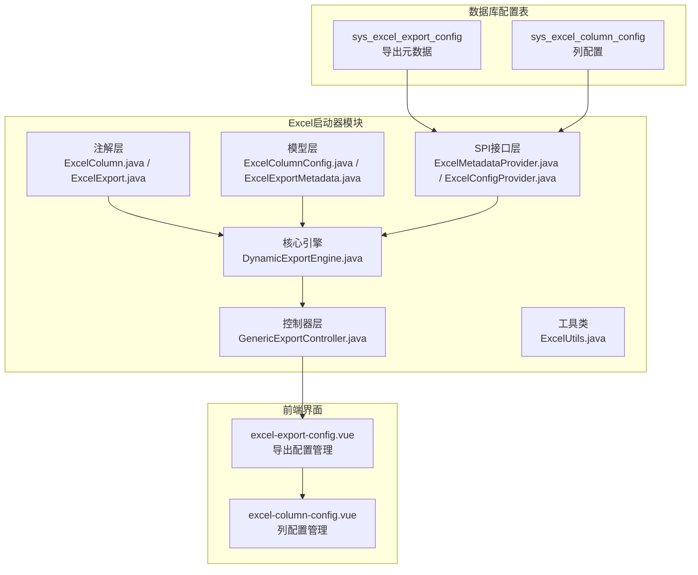
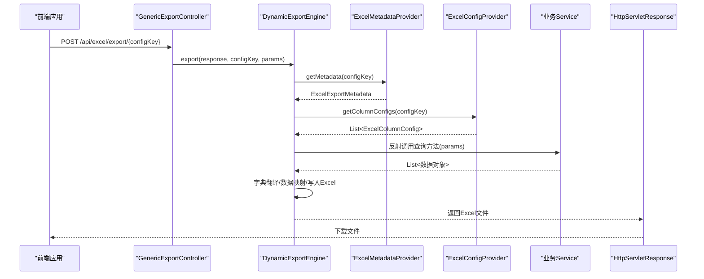
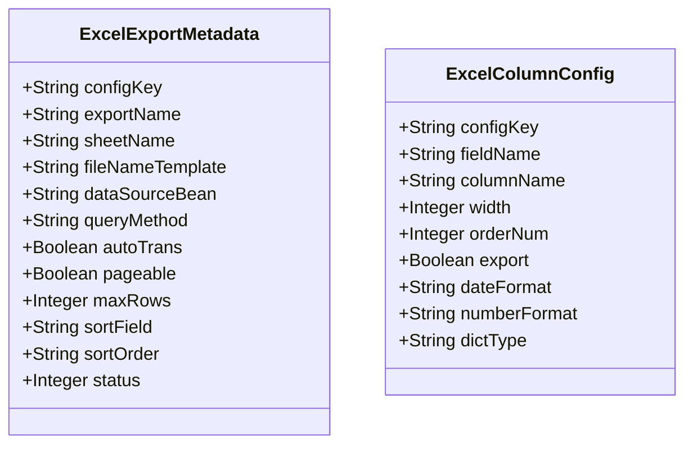
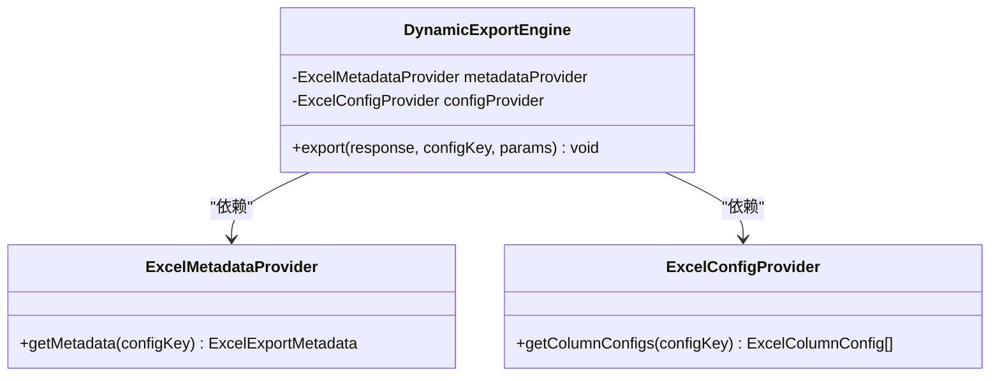
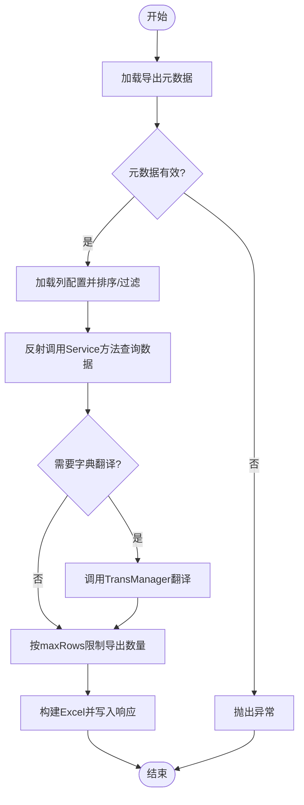
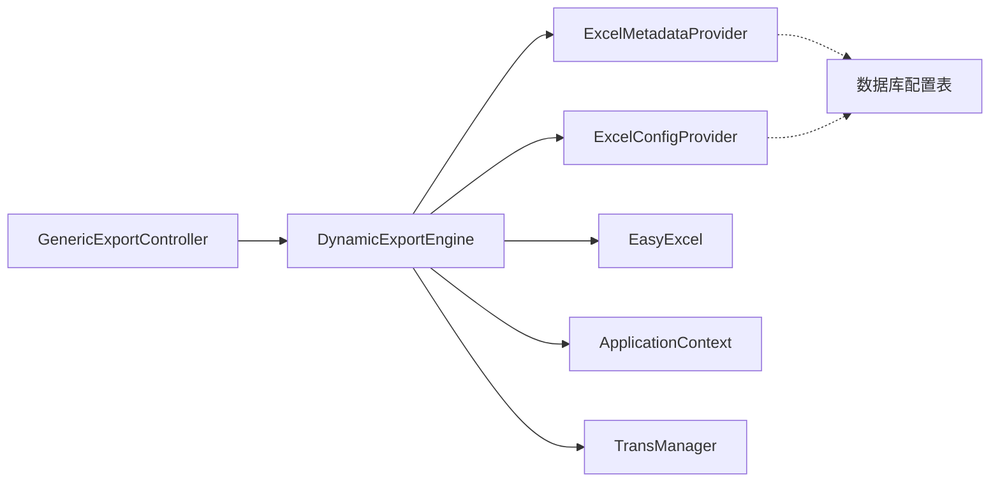

# Excel列配置管理

<cite>
**本文档引用的文件**
- [ExcelColumn.java](file://forge/forge-framework/forge-starter-parent/forge-starter-excel/src/main/java/com/mdframe/forge/starter/excel/annotation/ExcelColumn.java)
- [ExcelExport.java](file://forge/forge-framework/forge-starter-parent/forge-starter-excel/src/main/java/com/mdframe/forge/starter/excel/annotation/ExcelExport.java)
- [ExcelColumnConfig.java](file://forge/forge-framework/forge-starter-parent/forge-starter-excel/src/main/java/com/mdframe/forge/starter/excel/model/ExcelColumnConfig.java)
- [ExcelExportMetadata.java](file://forge/forge-framework/forge-starter-parent/forge-starter-excel/src/main/java/com/mdframe/forge/starter/excel/model/ExcelExportMetadata.java)
- [ExcelMetadataProvider.java](file://forge/forge-framework/forge-starter-parent/forge-starter-excel/src/main/java/com/mdframe/forge/starter/excel/spi/ExcelMetadataProvider.java)
- [ExcelConfigProvider.java](file://forge/forge-framework/forge-starter-parent/forge-starter-excel/src/main/java/com/mdframe/forge/starter/excel/spi/ExcelConfigProvider.java)
- [DynamicExportEngine.java](file://forge/forge-framework/forge-starter-parent/forge-starter-excel/src/main/java/com/mdframe/forge/starter/excel/core/DynamicExportEngine.java)
- [GenericExportController.java](file://forge/forge-framework/forge-starter-parent/forge-starter-excel/src/main/java/com/mdframe/forge/starter/excel/controller/GenericExportController.java)
- [ExcelUtils.java](file://forge/forge-framework/forge-starter-parent/forge-starter-excel/src/main/java/com/mdframe/forge/starter/excel/util/ExcelUtils.java)
- [README.md](file://forge/forge-framework/forge-starter-parent/forge-starter-excel/README.md)
- [excel_export_config.sql](file://forge/forge-framework/forge-starter-parent/forge-starter-excel/sql/excel_export_config.sql)
- [excel-column-config.vue](file://forge-admin-ui/src/views/system/excel-column-config.vue)
- [excel-export-config.vue](file://forge-admin-ui/src/views/system/excel-export-config.vue)
</cite>

## 目录
1. [简介](#简介)
2. [项目结构](#项目结构)
3. [核心组件](#核心组件)
4. [架构总览](#架构总览)
5. [详细组件分析](#详细组件分析)
6. [依赖关系分析](#依赖关系分析)
7. [性能考虑](#性能考虑)
8. [故障排除指南](#故障排除指南)
9. [结论](#结论)
10. [附录](#附录)

## 简介
本技术文档围绕Excel列配置管理功能，系统性阐述ExcelColumn注解的使用方法、列配置模型的设计原理、元数据提供者SPI接口的实现机制，并深入说明列宽设置、列标题配置、数据格式化、排序规则、隐藏字段等列级配置选项。文档还提供最佳实践、性能优化建议以及常见问题解决方案，帮助开发者实现灵活且可维护的Excel列配置管理。

## 项目结构
Excel列配置管理功能位于Excel启动器模块中，采用“注解+模型+SPI+引擎+控制器”的分层架构，配合数据库配置表实现零代码导出能力。前端提供可视化配置界面，支持列配置的增删改查与批量保存。

图表来源
- [ExcelColumn.java](file://forge/forge-framework/forge-starter-parent/forge-starter-excel/src/main/java/com/mdframe/forge/starter/excel/annotation/ExcelColumn.java#L1-L54)
- [ExcelExport.java](file://forge/forge-framework/forge-starter-parent/forge-starter-excel/src/main/java/com/mdframe/forge/starter/excel/annotation/ExcelExport.java)
- [ExcelColumnConfig.java](file://forge/forge-framework/forge-starter-parent/forge-starter-excel/src/main/java/com/mdframe/forge/starter/excel/model/ExcelColumnConfig.java#L1-L56)
- [ExcelExportMetadata.java](file://forge/forge-framework/forge-starter-parent/forge-starter-excel/src/main/java/com/mdframe/forge/starter/excel/model/ExcelExportMetadata.java#L1-L72)
- [ExcelMetadataProvider.java](file://forge/forge-framework/forge-starter-parent/forge-starter-excel/src/main/java/com/mdframe/forge/starter/excel/spi/ExcelMetadataProvider.java#L1-L19)
- [ExcelConfigProvider.java](file://forge/forge-framework/forge-starter-parent/forge-starter-excel/src/main/java/com/mdframe/forge/starter/excel/spi/ExcelConfigProvider.java#L1-L21)
- [DynamicExportEngine.java](file://forge/forge-framework/forge-starter-parent/forge-starter-excel/src/main/java/com/mdframe/forge/starter/excel/core/DynamicExportEngine.java#L1-L509)
- [GenericExportController.java](file://forge/forge-framework/forge-starter-parent/forge-starter-excel/src/main/java/com/mdframe/forge/starter/excel/controller/GenericExportController.java#L1-L51)
- [ExcelUtils.java](file://forge/forge-framework/forge-starter-parent/forge-starter-excel/src/main/java/com/mdframe/forge/starter/excel/util/ExcelUtils.java#L1-L75)
- [excel_export_config.sql](file://forge/forge-framework/forge-starter-parent/forge-starter-excel/sql/excel_export_config.sql#L1-L80)
- [excel-export-config.vue](file://forge-admin-ui/src/views/system/excel-export-config.vue#L1-L583)
- [excel-column-config.vue](file://forge-admin-ui/src/views/system/excel-column-config.vue#L1-L398)

章节来源
- [README.md](file://forge/forge-framework/forge-starter-parent/forge-starter-excel/README.md#L1-L268)

## 核心组件
- 注解层：ExcelColumn用于标注实体字段的导出行为；ExcelExport用于标注类级别的导出配置（静态导出场景）。
- 模型层：ExcelColumnConfig描述数据库中的列配置；ExcelExportMetadata描述导出元数据。
- SPI接口层：ExcelMetadataProvider负责从数据库读取导出元数据；ExcelConfigProvider负责读取列配置。
- 引擎层：DynamicExportEngine负责动态导出流程，包括元数据加载、列配置加载、数据查询、字典翻译、数据映射与写入。
- 控制器层：GenericExportController提供通用REST接口，统一入口。
- 工具类：ExcelUtils提供静态便捷导出方法（基于注解的静态导出）。

章节来源
- [ExcelColumn.java](file://forge/forge-framework/forge-starter-parent/forge-starter-excel/src/main/java/com/mdframe/forge/starter/excel/annotation/ExcelColumn.java#L1-L54)
- [ExcelExport.java](file://forge/forge-framework/forge-starter-parent/forge-starter-excel/src/main/java/com/mdframe/forge/starter/excel/annotation/ExcelExport.java)
- [ExcelColumnConfig.java](file://forge/forge-framework/forge-starter-parent/forge-starter-excel/src/main/java/com/mdframe/forge/starter/excel/model/ExcelColumnConfig.java#L1-L56)
- [ExcelExportMetadata.java](file://forge/forge-framework/forge-starter-parent/forge-starter-excel/src/main/java/com/mdframe/forge/starter/excel/model/ExcelExportMetadata.java#L1-L72)
- [ExcelMetadataProvider.java](file://forge/forge-framework/forge-starter-parent/forge-starter-excel/src/main/java/com/mdframe/forge/starter/excel/spi/ExcelMetadataProvider.java#L1-L19)
- [ExcelConfigProvider.java](file://forge/forge-framework/forge-starter-parent/forge-starter-excel/src/main/java/com/mdframe/forge/starter/excel/spi/ExcelConfigProvider.java#L1-L21)
- [DynamicExportEngine.java](file://forge/forge-framework/forge-starter-parent/forge-starter-excel/src/main/java/com/mdframe/forge/starter/excel/core/DynamicExportEngine.java#L1-L509)
- [GenericExportController.java](file://forge/forge-framework/forge-starter-parent/forge-starter-excel/src/main/java/com/mdframe/forge/starter/excel/controller/GenericExportController.java#L1-L51)
- [ExcelUtils.java](file://forge/forge-framework/forge-starter-parent/forge-starter-excel/src/main/java/com/mdframe/forge/starter/excel/util/ExcelUtils.java#L1-L75)

## 架构总览
动态导出采用“配置驱动”的架构：前端通过通用接口发起导出请求，控制器将请求委派给动态导出引擎；引擎通过SPI接口从数据库读取导出元数据与列配置，反射调用Service方法获取数据，进行字典翻译与数据映射，最终生成Excel文件并返回给客户端。

图表来源
- [GenericExportController.java](file://forge/forge-framework/forge-starter-parent/forge-starter-excel/src/main/java/com/mdframe/forge/starter/excel/controller/GenericExportController.java#L25-L49)
- [DynamicExportEngine.java](file://forge/forge-framework/forge-starter-parent/forge-starter-excel/src/main/java/com/mdframe/forge/starter/excel/core/DynamicExportEngine.java#L54-L93)
- [ExcelMetadataProvider.java](file://forge/forge-framework/forge-starter-parent/forge-starter-excel/src/main/java/com/mdframe/forge/starter/excel/spi/ExcelMetadataProvider.java#L11-L17)
- [ExcelConfigProvider.java](file://forge/forge-framework/forge-starter-parent/forge-starter-excel/src/main/java/com/mdframe/forge/starter/excel/spi/ExcelConfigProvider.java#L13-L19)

## 详细组件分析

### ExcelColumn注解详解
ExcelColumn用于标注实体字段，支持以下关键属性：
- 列名（表头）：value
- 列宽度：width
- 排序（数值越小越靠前）：order
- 是否导出：export
- 日期格式化：dateFormat
- 数字格式化：numberFormat
- 字典类型：dictType
- 是否需要字典翻译：needTrans

注意：该注解主要用于静态导出场景（结合ExcelExport与ExcelUtils），动态导出主要依赖数据库配置表与SPI接口。

章节来源
- [ExcelColumn.java](file://forge/forge-framework/forge-starter-parent/forge-starter-excel/src/main/java/com/mdframe/forge/starter/excel/annotation/ExcelColumn.java#L14-L52)

### ExcelExport注解与静态导出工具
ExcelExport用于类级别配置，ExcelUtils提供便捷的静态导出方法，自动识别注解并构建导出配置，适合不需要数据库配置的场景。

章节来源
- [ExcelExport.java](file://forge/forge-framework/forge-starter-parent/forge-starter-excel/src/main/java/com/mdframe/forge/starter/excel/annotation/ExcelExport.java)
- [ExcelUtils.java](file://forge/forge-framework/forge-starter-parent/forge-starter-excel/src/main/java/com/mdframe/forge/starter/excel/util/ExcelUtils.java#L29-L73)

### 列配置模型设计
ExcelColumnConfig与ExcelExportMetadata分别对应数据库中的列配置表与导出元数据表，字段覆盖列级配置与导出行为控制。

图表来源
- [ExcelExportMetadata.java](file://forge/forge-framework/forge-starter-parent/forge-starter-excel/src/main/java/com/mdframe/forge/starter/excel/model/ExcelExportMetadata.java#L10-L71)
- [ExcelColumnConfig.java](file://forge/forge-framework/forge-starter-parent/forge-starter-excel/src/main/java/com/mdframe/forge/starter/excel/model/ExcelColumnConfig.java#L9-L55)

章节来源
- [ExcelExportMetadata.java](file://forge/forge-framework/forge-starter-parent/forge-starter-excel/src/main/java/com/mdframe/forge/starter/excel/model/ExcelExportMetadata.java#L1-L72)
- [ExcelColumnConfig.java](file://forge/forge-framework/forge-starter-parent/forge-starter-excel/src/main/java/com/mdframe/forge/starter/excel/model/ExcelColumnConfig.java#L1-L56)

### 元数据提供者SPI接口
ExcelMetadataProvider与ExcelConfigProvider作为SPI接口，业务模块需实现以从数据库读取配置。动态导出引擎通过这些接口获取导出元数据与列配置。

图表来源
- [ExcelMetadataProvider.java](file://forge/forge-framework/forge-starter-parent/forge-starter-excel/src/main/java/com/mdframe/forge/starter/excel/spi/ExcelMetadataProvider.java#L9-L18)
- [ExcelConfigProvider.java](file://forge/forge-framework/forge-starter-parent/forge-starter-excel/src/main/java/com/mdframe/forge/starter/excel/spi/ExcelConfigProvider.java#L11-L20)
- [DynamicExportEngine.java](file://forge/forge-framework/forge-starter-parent/forge-starter-excel/src/main/java/com/mdframe/forge/starter/excel/core/DynamicExportEngine.java#L36-L45)

章节来源
- [ExcelMetadataProvider.java](file://forge/forge-framework/forge-starter-parent/forge-starter-excel/src/main/java/com/mdframe/forge/starter/excel/spi/ExcelMetadataProvider.java#L1-L19)
- [ExcelConfigProvider.java](file://forge/forge-framework/forge-starter-parent/forge-starter-excel/src/main/java/com/mdframe/forge/starter/excel/spi/ExcelConfigProvider.java#L1-L21)
- [DynamicExportEngine.java](file://forge/forge-framework/forge-starter-parent/forge-starter-excel/src/main/java/com/mdframe/forge/starter/excel/core/DynamicExportEngine.java#L98-L121)

### 动态导出引擎处理流程
DynamicExportEngine负责完整的导出流程：加载元数据与列配置、查询数据、字典翻译、数据映射、写入Excel并返回响应。其中对参数构建、类型转换、反射调用、数据映射等均有完善处理。

图表来源
- [DynamicExportEngine.java](file://forge/forge-framework/forge-starter-parent/forge-starter-excel/src/main/java/com/mdframe/forge/starter/excel/core/DynamicExportEngine.java#L54-L93)
- [DynamicExportEngine.java](file://forge/forge-framework/forge-starter-parent/forge-starter-excel/src/main/java/com/mdframe/forge/starter/excel/core/DynamicExportEngine.java#L108-L121)
- [DynamicExportEngine.java](file://forge/forge-framework/forge-starter-parent/forge-starter-excel/src/main/java/com/mdframe/forge/starter/excel/core/DynamicExportEngine.java#L126-L151)
- [DynamicExportEngine.java](file://forge/forge-framework/forge-starter-parent/forge-starter-excel/src/main/java/com/mdframe/forge/starter/excel/core/DynamicExportEngine.java#L402-L410)
- [DynamicExportEngine.java](file://forge/forge-framework/forge-starter-parent/forge-starter-excel/src/main/java/com/mdframe/forge/starter/excel/core/DynamicExportEngine.java#L415-L438)

章节来源
- [DynamicExportEngine.java](file://forge/forge-framework/forge-starter-parent/forge-starter-excel/src/main/java/com/mdframe/forge/starter/excel/core/DynamicExportEngine.java#L54-L93)

### 通用导出控制器
GenericExportController提供统一的REST接口，支持POST与GET两种方式，便于前端调用。可通过配置开关启用/禁用通用导出接口。

章节来源
- [GenericExportController.java](file://forge/forge-framework/forge-starter-parent/forge-starter-excel/src/main/java/com/mdframe/forge/starter/excel/controller/GenericExportController.java#L25-L49)
- [README.md](file://forge/forge-framework/forge-starter-parent/forge-starter-excel/README.md#L248-L258)

### 前端列配置管理界面
前端提供两个Vue组件：
- excel-export-config.vue：导出配置管理页面，支持分页查询、编辑、复制、启用/禁用、测试导出等功能。
- excel-column-config.vue：列配置管理页面，支持添加、编辑、删除、上下移动、批量保存列配置。

章节来源
- [excel-export-config.vue](file://forge-admin-ui/src/views/system/excel-export-config.vue#L1-L583)
- [excel-column-config.vue](file://forge-admin-ui/src/views/system/excel-column-config.vue#L1-L398)

## 依赖关系分析
- 组件内聚与耦合：动态导出引擎通过SPI接口与业务模块解耦；控制器仅负责请求转发；工具类提供静态导出能力。
- 外部依赖：EasyExcel用于Excel写入；Spring ApplicationContext用于Bean查找；TransManager用于字典翻译。
- 数据依赖：依赖数据库配置表sys_excel_export_config与sys_excel_column_config。

图表来源
- [GenericExportController.java](file://forge/forge-framework/forge-starter-parent/forge-starter-excel/src/main/java/com/mdframe/forge/starter/excel/controller/GenericExportController.java#L23-L23)
- [DynamicExportEngine.java](file://forge/forge-framework/forge-starter-parent/forge-starter-excel/src/main/java/com/mdframe/forge/starter/excel/core/DynamicExportEngine.java#L36-L45)
- [ExcelMetadataProvider.java](file://forge/forge-framework/forge-starter-parent/forge-starter-excel/src/main/java/com/mdframe/forge/starter/excel/spi/ExcelMetadataProvider.java#L9-L18)
- [ExcelConfigProvider.java](file://forge/forge-framework/forge-starter-parent/forge-starter-excel/src/main/java/com/mdframe/forge/starter/excel/spi/ExcelConfigProvider.java#L11-L20)
- [excel_export_config.sql](file://forge/forge-framework/forge-starter-parent/forge-starter-excel/sql/excel_export_config.sql#L4-L42)

章节来源
- [DynamicExportEngine.java](file://forge/forge-framework/forge-starter-parent/forge-starter-excel/src/main/java/com/mdframe/forge/starter/excel/core/DynamicExportEngine.java#L1-L509)
- [excel_export_config.sql](file://forge/forge-framework/forge-starter-parent/forge-starter-excel/sql/excel_export_config.sql#L1-L80)

## 性能考虑
- 数据量限制：通过maxRows限制导出条数，避免超大数据量导致内存溢出或响应缓慢。
- 分页查询：当pageable为真时，引擎会尝试从分页结果中提取records，减少一次性加载数据量。
- 反射调用：反射调用Service方法存在性能开销，建议在高频导出场景下缓存方法签名与参数类型信息。
- 字典翻译：自动翻译功能在大数据量场景下可能成为瓶颈，建议合理设置字典缓存策略。
- 列配置排序：列配置按orderNum排序并过滤未启用列，确保导出顺序可控且只导出必要字段。
- 文件写入：使用响应流直接写入，避免中间缓冲区占用过多内存。

章节来源
- [ExcelExportMetadata.java](file://forge/forge-framework/forge-starter-parent/forge-starter-excel/src/main/java/com/mdframe/forge/starter/excel/model/ExcelExportMetadata.java#L54-L55)
- [DynamicExportEngine.java](file://forge/forge-framework/forge-starter-parent/forge-starter-excel/src/main/java/com/mdframe/forge/starter/excel/core/DynamicExportEngine.java#L81-L84)
- [DynamicExportEngine.java](file://forge/forge-framework/forge-starter-parent/forge-starter-excel/src/main/java/com/mdframe/forge/starter/excel/core/DynamicExportEngine.java#L377-L396)

## 故障排除指南
- 未配置SPI接口：若未实现ExcelMetadataProvider或ExcelConfigProvider，动态导出会抛出异常。请在业务模块中实现并注册Bean。
- 导出配置不存在或禁用：当元数据为空或status为0时，引擎会抛出异常。请检查数据库配置与状态。
- 未配置导出列：当列配置为空时，引擎会抛出异常。请在sys_excel_column_config中添加列配置。
- 查询方法未找到：反射查找方法失败时会抛出异常。请确认Service Bean名称与方法名正确。
- 类型转换失败：参数类型转换异常时会记录警告日志。请检查前端传参类型与后端方法签名。
- 字典翻译失败：翻译过程异常会被记录为警告。请检查TransManager与字典配置。
- 通用接口未启用：若enable-generic-export为false，通用导出接口将被禁用。请在配置文件中开启。

章节来源
- [DynamicExportEngine.java](file://forge/forge-framework/forge-starter-parent/forge-starter-excel/src/main/java/com/mdframe/forge/starter/excel/core/DynamicExportEngine.java#L98-L103)
- [DynamicExportEngine.java](file://forge/forge-framework/forge-starter-parent/forge-starter-excel/src/main/java/com/mdframe/forge/starter/excel/core/DynamicExportEngine.java#L62-L66)
- [DynamicExportEngine.java](file://forge/forge-framework/forge-starter-parent/forge-starter-excel/src/main/java/com/mdframe/forge/starter/excel/core/DynamicExportEngine.java#L134-L136)
- [DynamicExportEngine.java](file://forge/forge-framework/forge-starter-parent/forge-starter-excel/src/main/java/com/mdframe/forge/starter/excel/core/DynamicExportEngine.java#L292-L296)
- [DynamicExportEngine.java](file://forge/forge-framework/forge-starter-parent/forge-starter-excel/src/main/java/com/mdframe/forge/starter/excel/core/DynamicExportEngine.java#L407-L409)
- [README.md](file://forge/forge-framework/forge-starter-parent/forge-starter-excel/README.md#L250-L258)

## 结论
Excel列配置管理功能通过注解、模型、SPI与引擎的协同，实现了“配置驱动”的零代码导出能力。前端提供可视化的配置界面，业务模块只需实现SPI接口即可接入。该方案具备高度灵活性与可维护性，适合快速迭代的业务场景。建议在生产环境中结合性能优化与监控告警，确保大规模导出的稳定性与效率。

## 附录

### 数据库配置表结构
- sys_excel_export_config：导出元数据表，包含配置键、导出名称、数据源Bean、查询方法、自动翻译、分页、最大行数、排序等字段。
- sys_excel_column_config：列配置表，包含字段名、列名、列宽、排序、是否导出、日期格式、数字格式、字典类型等字段。

章节来源
- [excel_export_config.sql](file://forge/forge-framework/forge-starter-parent/forge-starter-excel/sql/excel_export_config.sql#L4-L42)

### 使用步骤（零代码）
1. 在数据库中创建配置表并插入示例数据。
2. 在业务模块中实现ExcelMetadataProvider与ExcelConfigProvider。
3. 在前端调用通用导出接口，传入configKey与查询参数。
4. 导出完成后，前端接收Blob并触发下载。

章节来源
- [README.md](file://forge/forge-framework/forge-starter-parent/forge-starter-excel/README.md#L53-L129)