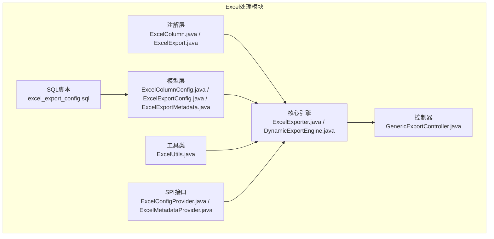
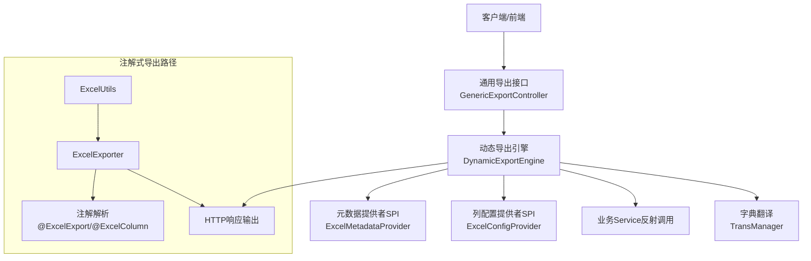
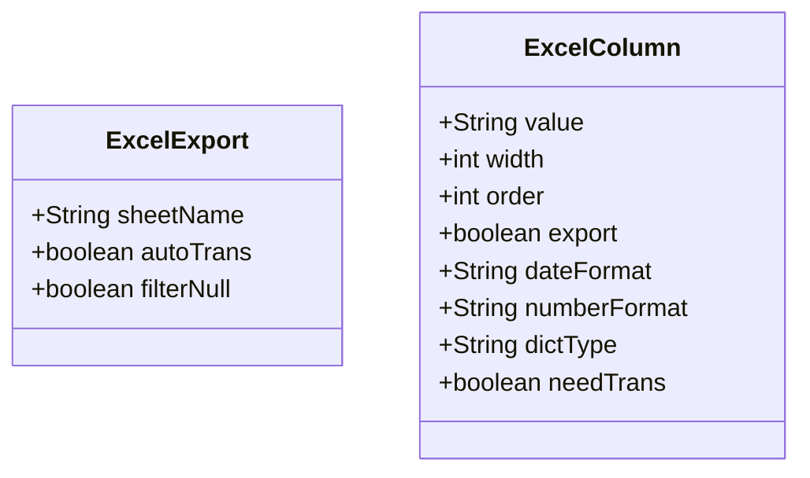
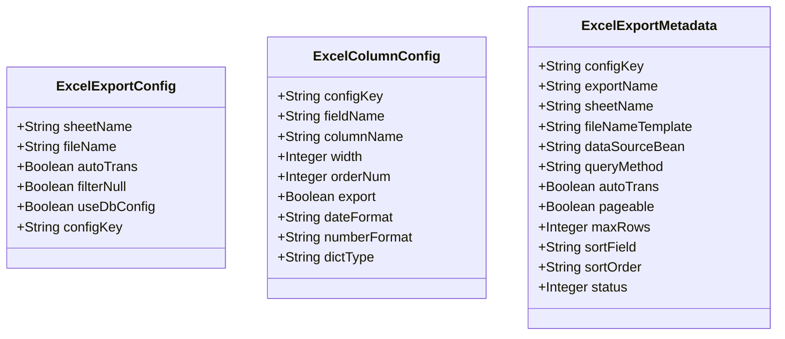
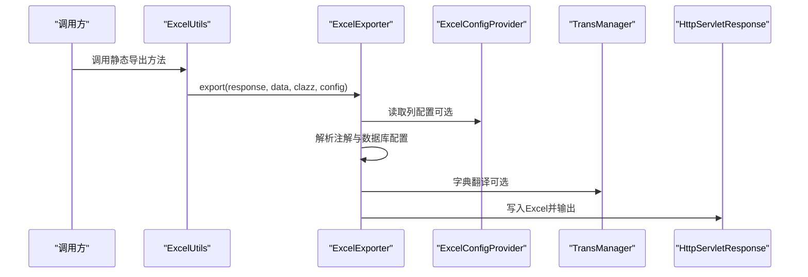
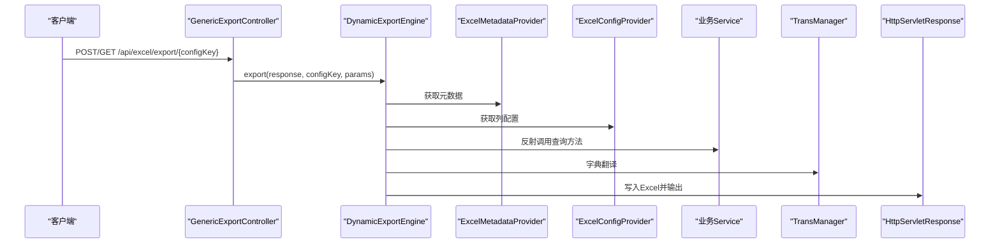
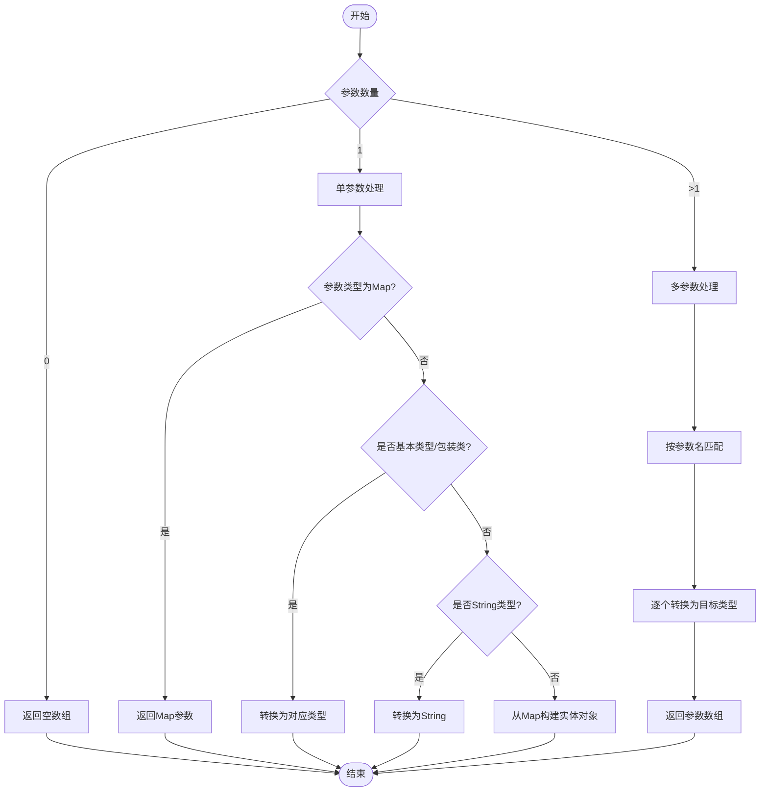
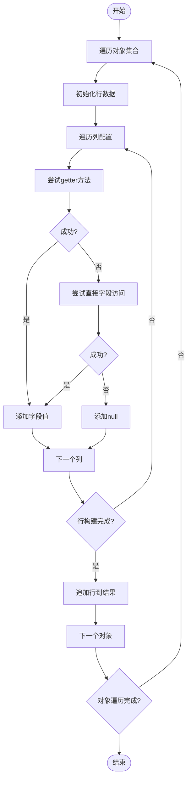
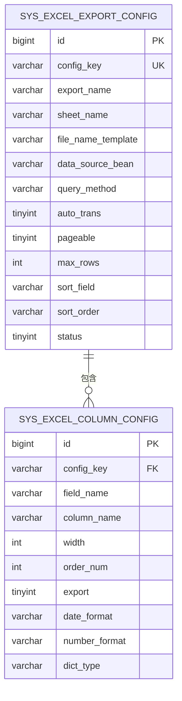
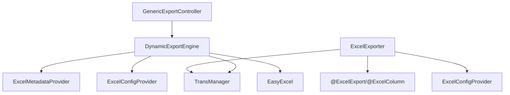

# Excel处理功能

<cite>
**本文档引用的文件**
- [ExcelColumn.java](file://forge/forge-framework/forge-starter-parent/forge-starter-excel/src/main/java/com/mdframe/forge/starter/excel/annotation/ExcelColumn.java)
- [ExcelExport.java](file://forge/forge-framework/forge-starter-parent/forge-starter-excel/src/main/java/com/mdframe/forge/starter/excel/annotation/ExcelExport.java)
- [ExcelColumnConfig.java](file://forge/forge-framework/forge-starter-parent/forge-starter-excel/src/main/java/com/mdframe/forge/starter/excel/model/ExcelColumnConfig.java)
- [ExcelExportConfig.java](file://forge/forge-framework/forge-starter-parent/forge-starter-excel/src/main/java/com/mdframe/forge/starter/excel/model/ExcelExportConfig.java)
- [ExcelExportMetadata.java](file://forge/forge-framework/forge-starter-parent/forge-starter-excel/src/main/java/com/mdframe/forge/starter/excel/model/ExcelExportMetadata.java)
- [DynamicExportEngine.java](file://forge/forge-framework/forge-starter-parent/forge-starter-excel/src/main/java/com/mdframe/forge/starter/excel/core/DynamicExportEngine.java)
- [ExcelExporter.java](file://forge/forge-framework/forge-starter-parent/forge-starter-excel/src/main/java/com/mdframe/forge/starter/excel/core/ExcelExporter.java)
- [GenericExportController.java](file://forge/forge-framework/forge-starter-parent/forge-starter-excel/src/main/java/com/mdframe/forge/starter/excel/controller/GenericExportController.java)
- [ExcelUtils.java](file://forge/forge-framework/forge-starter-parent/forge-starter-excel/src/main/java/com/mdframe/forge/starter/excel/util/ExcelUtils.java)
- [ExcelConfigProvider.java](file://forge/forge-framework/forge-starter-parent/forge-starter-excel/src/main/java/com/mdframe/forge/starter/excel/spi/ExcelConfigProvider.java)
- [ExcelMetadataProvider.java](file://forge/forge-framework/forge-starter-parent/forge-starter-excel/src/main/java/com/mdframe/forge/starter/excel/spi/ExcelMetadataProvider.java)
- [excel_export_config.sql](file://forge/forge-framework/forge-starter-parent/forge-starter-excel/sql/excel_export_config.sql)
</cite>

## 目录
1. [简介](#简介)
2. [项目结构](#项目结构)
3. [核心组件](#核心组件)
4. [架构总览](#架构总览)
5. [详细组件分析](#详细组件分析)
6. [依赖关系分析](#依赖关系分析)
7. [性能考虑](#性能考虑)
8. [故障排除指南](#故障排除指南)
9. [结论](#结论)
10. [附录](#附录)

## 简介
本文件系统性阐述Forge框架的Excel处理能力，覆盖Excel导入导出的完整解决方案。内容包括：
- Excel模板配置与动态导出引擎
- 列配置管理与注解体系
- 批量数据处理与性能优化
- 模板渲染与数据转换的技术实现
- Excel模板设计指南、批量处理最佳实践与性能优化方案

目标是帮助开发者快速实现复杂的数据导入导出需求，降低耦合度，提升可维护性与扩展性。

## 项目结构
Excel处理功能位于 `forge-starter-excel` 模块，采用注解驱动与SPI扩展相结合的设计，支持注解式导出与数据库驱动的动态导出两种模式。

图表来源
- [ExcelColumn.java](file://forge/forge-framework/forge-starter-parent/forge-starter-excel/src/main/java/com/mdframe/forge/starter/excel/annotation/ExcelColumn.java#L1-L54)
- [ExcelExport.java](file://forge/forge-framework/forge-starter-parent/forge-starter-excel/src/main/java/com/mdframe/forge/starter/excel/annotation/ExcelExport.java#L1-L29)
- [ExcelColumnConfig.java](file://forge/forge-framework/forge-starter-parent/forge-starter-excel/src/main/java/com/mdframe/forge/starter/excel/model/ExcelColumnConfig.java#L1-L56)
- [ExcelExportConfig.java](file://forge/forge-framework/forge-starter-parent/forge-starter-excel/src/main/java/com/mdframe/forge/starter/excel/model/ExcelExportConfig.java#L1-L46)
- [ExcelExportMetadata.java](file://forge/forge-framework/forge-starter-parent/forge-starter-excel/src/main/java/com/mdframe/forge/starter/excel/model/ExcelExportMetadata.java#L1-L72)
- [ExcelExporter.java](file://forge/forge-framework/forge-starter-parent/forge-starter-excel/src/main/java/com/mdframe/forge/starter/excel/core/ExcelExporter.java#L1-L230)
- [DynamicExportEngine.java](file://forge/forge-framework/forge-starter-parent/forge-starter-excel/src/main/java/com/mdframe/forge/starter/excel/core/DynamicExportEngine.java#L1-L509)
- [GenericExportController.java](file://forge/forge-framework/forge-starter-parent/forge-starter-excel/src/main/java/com/mdframe/forge/starter/excel/controller/GenericExportController.java#L1-L51)
- [ExcelUtils.java](file://forge/forge-framework/forge-starter-parent/forge-starter-excel/src/main/java/com/mdframe/forge/starter/excel/util/ExcelUtils.java#L1-L75)
- [ExcelConfigProvider.java](file://forge/forge-framework/forge-starter-parent/forge-starter-excel/src/main/java/com/mdframe/forge/starter/excel/spi/ExcelConfigProvider.java#L1-L21)
- [ExcelMetadataProvider.java](file://forge/forge-framework/forge-starter-parent/forge-starter-excel/src/main/java/com/mdframe/forge/starter/excel/spi/ExcelMetadataProvider.java#L1-L19)
- [excel_export_config.sql](file://forge/forge-framework/forge-starter-parent/forge-starter-excel/sql/excel_export_config.sql#L1-L80)

章节来源
- [ExcelExporter.java](file://forge/forge-framework/forge-starter-parent/forge-starter-excel/src/main/java/com/mdframe/forge/starter/excel/core/ExcelExporter.java#L1-L230)
- [DynamicExportEngine.java](file://forge/forge-framework/forge-starter-parent/forge-starter-excel/src/main/java/com/mdframe/forge/starter/excel/core/DynamicExportEngine.java#L1-L509)

## 核心组件
- 注解层：通过 `@ExcelExport` 和 `@ExcelColumn` 提供声明式导出配置，支持表头、宽度、排序、日期/数字格式化、字典类型等。
- 模型层：`ExcelExportConfig`、`ExcelColumnConfig`、`ExcelExportMetadata` 定义导出配置与元数据结构，支撑注解与数据库配置的统一表达。
- 引擎层：`ExcelExporter` 实现注解式导出；`DynamicExportEngine` 实现数据库驱动的动态导出，支持反射调用Service方法、参数构建、字典翻译、数据截断与响应写入。
- 控制器层：`GenericExportController` 提供通用导出接口，支持POST/GET两种方式。
- 工具类：`ExcelUtils` 提供静态便捷方法，简化导出调用。
- SPI接口：`ExcelConfigProvider`、`ExcelMetadataProvider` 由业务模块实现，从数据库读取配置与元数据。
- SQL脚本：提供导出配置表与列配置表的建表与示例数据。

章节来源
- [ExcelColumn.java](file://forge/forge-framework/forge-starter-parent/forge-starter-excel/src/main/java/com/mdframe/forge/starter/excel/annotation/ExcelColumn.java#L1-L54)
- [ExcelExport.java](file://forge/forge-framework/forge-starter-parent/forge-starter-excel/src/main/java/com/mdframe/forge/starter/excel/annotation/ExcelExport.java#L1-L29)
- [ExcelColumnConfig.java](file://forge/forge-framework/forge-starter-parent/forge-starter-excel/src/main/java/com/mdframe/forge/starter/excel/model/ExcelColumnConfig.java#L1-L56)
- [ExcelExportConfig.java](file://forge/forge-framework/forge-starter-parent/forge-starter-excel/src/main/java/com/mdframe/forge/starter/excel/model/ExcelExportConfig.java#L1-L46)
- [ExcelExportMetadata.java](file://forge/forge-framework/forge-starter-parent/forge-starter-excel/src/main/java/com/mdframe/forge/starter/excel/model/ExcelExportMetadata.java#L1-L72)
- [ExcelExporter.java](file://forge/forge-framework/forge-starter-parent/forge-starter-excel/src/main/java/com/mdframe/forge/starter/excel/core/ExcelExporter.java#L1-L230)
- [DynamicExportEngine.java](file://forge/forge-framework/forge-starter-parent/forge-starter-excel/src/main/java/com/mdframe/forge/starter/excel/core/DynamicExportEngine.java#L1-L509)
- [GenericExportController.java](file://forge/forge-framework/forge-starter-parent/forge-starter-excel/src/main/java/com/mdframe/forge/starter/excel/controller/GenericExportController.java#L1-L51)
- [ExcelUtils.java](file://forge/forge-framework/forge-starter-parent/forge-starter-excel/src/main/java/com/mdframe/forge/starter/excel/util/ExcelUtils.java#L1-L75)
- [ExcelConfigProvider.java](file://forge/forge-framework/forge-starter-parent/forge-starter-excel/src/main/java/com/mdframe/forge/starter/excel/spi/ExcelConfigProvider.java#L1-L21)
- [ExcelMetadataProvider.java](file://forge/forge-framework/forge-starter-parent/forge-starter-excel/src/main/java/com/mdframe/forge/starter/excel/spi/ExcelMetadataProvider.java#L1-L19)
- [excel_export_config.sql](file://forge/forge-framework/forge-starter-parent/forge-starter-excel/sql/excel_export_config.sql#L1-L80)

## 架构总览
下图展示Excel导出的整体架构与组件交互：

图表来源
- [GenericExportController.java](file://forge/forge-framework/forge-starter-parent/forge-starter-excel/src/main/java/com/mdframe/forge/starter/excel/controller/GenericExportController.java#L1-L51)
- [DynamicExportEngine.java](file://forge/forge-framework/forge-starter-parent/forge-starter-excel/src/main/java/com/mdframe/forge/starter/excel/core/DynamicExportEngine.java#L1-L509)
- [ExcelExporter.java](file://forge/forge-framework/forge-starter-parent/forge-starter-excel/src/main/java/com/mdframe/forge/starter/excel/core/ExcelExporter.java#L1-L230)
- [ExcelConfigProvider.java](file://forge/forge-framework/forge-starter-parent/forge-starter-excel/src/main/java/com/mdframe/forge/starter/excel/spi/ExcelConfigProvider.java#L1-L21)
- [ExcelMetadataProvider.java](file://forge/forge-framework/forge-starter-parent/forge-starter-excel/src/main/java/com/mdframe/forge/starter/excel/spi/ExcelMetadataProvider.java#L1-L19)

## 详细组件分析

### 注解体系
- `@ExcelExport`：类级注解，用于标记实体支持Excel导出，配置Sheet名称、自动字典翻译、是否过滤null等。
- `@ExcelColumn`：字段级注解，配置列名、列宽、排序、是否导出、日期格式化、数字格式化、字典类型等。

图表来源
- [ExcelExport.java](file://forge/forge-framework/forge-starter-parent/forge-starter-excel/src/main/java/com/mdframe/forge/starter/excel/annotation/ExcelExport.java#L1-L29)
- [ExcelColumn.java](file://forge/forge-framework/forge-starter-parent/forge-starter-excel/src/main/java/com/mdframe/forge/starter/excel/annotation/ExcelColumn.java#L1-L54)

章节来源
- [ExcelExport.java](file://forge/forge-framework/forge-starter-parent/forge-starter-excel/src/main/java/com/mdframe/forge/starter/excel/annotation/ExcelExport.java#L1-L29)
- [ExcelColumn.java](file://forge/forge-framework/forge-starter-parent/forge-starter-excel/src/main/java/com/mdframe/forge/starter/excel/annotation/ExcelColumn.java#L1-L54)

### 模型与配置
- `ExcelExportConfig`：导出配置，支持Sheet名称、文件名、自动翻译、过滤null、是否使用数据库配置、配置键等。
- `ExcelColumnConfig`：列配置（数据库读取），包含字段名、列名、宽度、排序、是否导出、日期/数字格式、字典类型等。
- `ExcelExportMetadata`：导出元数据（数据库读取），包含配置键、导出名称、Sheet名称、文件名模板、数据源Bean、查询方法、自动翻译、分页、最大导出条数、排序字段与方向、状态等。

图表来源
- [ExcelExportConfig.java](file://forge/forge-framework/forge-starter-parent/forge-starter-excel/src/main/java/com/mdframe/forge/starter/excel/model/ExcelExportConfig.java#L1-L46)
- [ExcelColumnConfig.java](file://forge/forge-framework/forge-starter-parent/forge-starter-excel/src/main/java/com/mdframe/forge/starter/excel/model/ExcelColumnConfig.java#L1-L56)
- [ExcelExportMetadata.java](file://forge/forge-framework/forge-starter-parent/forge-starter-excel/src/main/java/com/mdframe/forge/starter/excel/model/ExcelExportMetadata.java#L1-L72)

章节来源
- [ExcelExportConfig.java](file://forge/forge-framework/forge-starter-parent/forge-starter-excel/src/main/java/com/mdframe/forge/starter/excel/model/ExcelExportConfig.java#L1-L46)
- [ExcelColumnConfig.java](file://forge/forge-framework/forge-starter-parent/forge-starter-excel/src/main/java/com/mdframe/forge/starter/excel/model/ExcelColumnConfig.java#L1-L56)
- [ExcelExportMetadata.java](file://forge/forge-framework/forge-starter-parent/forge-starter-excel/src/main/java/com/mdframe/forge/starter/excel/model/ExcelExportMetadata.java#L1-L72)

### 注解式导出引擎（ExcelExporter）
- 功能要点：
  - 支持将List<T>数据导出为Excel，自动解析注解配置生成表头与列元数据。
  - 支持字典翻译（通过TransManager）。
  - 支持从数据库读取列配置（通过ExcelConfigProvider），并与注解配置合并。
  - 输出到HttpServletResponse或OutputStream。
- 关键流程：
  1) 解析类字段与注解，结合数据库配置生成列元数据。
  2) 构建表头与数据映射。
  3) 写入Excel并完成响应。

图表来源
- [ExcelUtils.java](file://forge/forge-framework/forge-starter-parent/forge-starter-excel/src/main/java/com/mdframe/forge/starter/excel/util/ExcelUtils.java#L1-L75)
- [ExcelExporter.java](file://forge/forge-framework/forge-starter-parent/forge-starter-excel/src/main/java/com/mdframe/forge/starter/excel/core/ExcelExporter.java#L1-L230)
- [ExcelConfigProvider.java](file://forge/forge-framework/forge-starter-parent/forge-starter-excel/src/main/java/com/mdframe/forge/starter/excel/spi/ExcelConfigProvider.java#L1-L21)

章节来源
- [ExcelExporter.java](file://forge/forge-framework/forge-starter-parent/forge-starter-excel/src/main/java/com/mdframe/forge/starter/excel/core/ExcelExporter.java#L1-L230)
- [ExcelUtils.java](file://forge/forge-framework/forge-starter-parent/forge-starter-excel/src/main/java/com/mdframe/forge/starter/excel/util/ExcelUtils.java#L1-L75)

### 动态导出引擎（DynamicExportEngine）
- 功能要点：
  - 通过配置键加载元数据与列配置，无需编写代码即可实现导出。
  - 反射调用指定Service的查询方法，支持多种参数形式（无参、Map、单值、实体、多参数）。
  - 支持字典翻译、数据截断（最大导出条数）、文件名模板替换、响应头设置。
  - 通过EasyExcel写入响应流。
- 关键流程：
  1) 加载元数据与列配置（SPI）。
  2) 反射查询数据，处理分页返回。
  3) 字典翻译与数据截断。
  4) 构建表头与数据，写入Excel并输出。

图表来源
- [GenericExportController.java](file://forge/forge-framework/forge-starter-parent/forge-starter-excel/src/main/java/com/mdframe/forge/starter/excel/controller/GenericExportController.java#L1-L51)
- [DynamicExportEngine.java](file://forge/forge-framework/forge-starter-parent/forge-starter-excel/src/main/java/com/mdframe/forge/starter/excel/core/DynamicExportEngine.java#L1-L509)
- [ExcelConfigProvider.java](file://forge/forge-framework/forge-starter-parent/forge-starter-excel/src/main/java/com/mdframe/forge/starter/excel/spi/ExcelConfigProvider.java#L1-L21)
- [ExcelMetadataProvider.java](file://forge/forge-framework/forge-starter-parent/forge-starter-excel/src/main/java/com/mdframe/forge/starter/excel/spi/ExcelMetadataProvider.java#L1-L19)

章节来源
- [DynamicExportEngine.java](file://forge/forge-framework/forge-starter-parent/forge-starter-excel/src/main/java/com/mdframe/forge/starter/excel/core/DynamicExportEngine.java#L1-L509)
- [GenericExportController.java](file://forge/forge-framework/forge-starter-parent/forge-starter-excel/src/main/java/com/mdframe/forge/starter/excel/controller/GenericExportController.java#L1-L51)

### 参数构建算法（多参数方法）
DynamicExportEngine支持多种参数形式，参数构建逻辑如下：

图表来源
- [DynamicExportEngine.java](file://forge/forge-framework/forge-starter-parent/forge-starter-excel/src/main/java/com/mdframe/forge/starter/excel/core/DynamicExportEngine.java#L174-L251)

章节来源
- [DynamicExportEngine.java](file://forge/forge-framework/forge-starter-parent/forge-starter-excel/src/main/java/com/mdframe/forge/starter/excel/core/DynamicExportEngine.java#L174-L251)

### 数据映射与字段访问
- 字段访问策略：优先通过getter方法，回退到直接字段访问（支持父类字段）。
- 数据映射：将对象集合映射为二维列表，与列配置顺序一一对应。

图表来源
- [DynamicExportEngine.java](file://forge/forge-framework/forge-starter-parent/forge-starter-excel/src/main/java/com/mdframe/forge/starter/excel/core/DynamicExportEngine.java#L489-L507)

章节来源
- [DynamicExportEngine.java](file://forge/forge-framework/forge-starter-parent/forge-starter-excel/src/main/java/com/mdframe/forge/starter/excel/core/DynamicExportEngine.java#L489-L507)

### SPI接口与数据库配置
- `ExcelConfigProvider`：根据配置键获取列配置列表。
- `ExcelMetadataProvider`：根据配置键获取导出元数据。
- 数据库表结构：
  - 主表：导出配置（config_key唯一、sheet_name、file_name_template、data_source_bean、query_method、auto_trans、pageable、max_rows、sort_field、sort_order、status等）。
  - 从表：列配置（config_key关联、field_name、column_name、width、order_num、export、date_format、number_format、dict_type）。
- 示例数据：包含用户列表与订单列表的导出配置及字段映射。

图表来源
- [excel_export_config.sql](file://forge/forge-framework/forge-starter-parent/forge-starter-excel/sql/excel_export_config.sql#L1-L80)

章节来源
- [ExcelConfigProvider.java](file://forge/forge-framework/forge-starter-parent/forge-starter-excel/src/main/java/com/mdframe/forge/starter/excel/spi/ExcelConfigProvider.java#L1-L21)
- [ExcelMetadataProvider.java](file://forge/forge-framework/forge-starter-parent/forge-starter-excel/src/main/java/com/mdframe/forge/starter/excel/spi/ExcelMetadataProvider.java#L1-L19)
- [excel_export_config.sql](file://forge/forge-framework/forge-starter-parent/forge-starter-excel/sql/excel_export_config.sql#L1-L80)

## 依赖关系分析
- 组件内聚与耦合：
  - ExcelExporter与注解紧密耦合，同时通过ExcelConfigProvider实现对数据库配置的松耦合。
  - DynamicExportEngine通过SPI与TransManager实现对元数据、列配置与字典翻译的松耦合。
  - GenericExportController仅作为入口，职责单一，便于扩展。
- 外部依赖：
  - EasyExcel：负责Excel写入。
  - Spring：依赖注入、条件装配（GenericExportController的开关）。
  - 可选：TransManager（字典翻译）。

图表来源
- [ExcelExporter.java](file://forge/forge-framework/forge-starter-parent/forge-starter-excel/src/main/java/com/mdframe/forge/starter/excel/core/ExcelExporter.java#L1-L230)
- [DynamicExportEngine.java](file://forge/forge-framework/forge-starter-parent/forge-starter-excel/src/main/java/com/mdframe/forge/starter/excel/core/DynamicExportEngine.java#L1-L509)
- [GenericExportController.java](file://forge/forge-framework/forge-starter-parent/forge-starter-excel/src/main/java/com/mdframe/forge/starter/excel/controller/GenericExportController.java#L1-L51)

章节来源
- [ExcelExporter.java](file://forge/forge-framework/forge-starter-parent/forge-starter-excel/src/main/java/com/mdframe/forge/starter/excel/core/ExcelExporter.java#L1-L230)
- [DynamicExportEngine.java](file://forge/forge-framework/forge-starter-parent/forge-starter-excel/src/main/java/com/mdframe/forge/starter/excel/core/DynamicExportEngine.java#L1-L509)
- [GenericExportController.java](file://forge/forge-framework/forge-starter-parent/forge-starter-excel/src/main/java/com/mdframe/forge/starter/excel/controller/GenericExportController.java#L1-L51)

## 性能考虑
- 数据量控制：
  - DynamicExportEngine支持最大导出条数限制，防止超大数据量导致内存溢出或响应超时。
- 分页查询：
  - 支持pageable模式，通过反射获取分页对象中的records字段，减少一次性加载。
- 字典翻译：
  - 在导出前进行批量翻译，避免重复查询；若翻译失败，记录告警但不影响导出流程。
- 参数构建优化：
  - 对单参数场景提供快速路径（Map、基本类型、String），减少反射开销。
- 输出流写入：
  - 直接写入HttpServletResponse输出流，避免中间缓冲区占用。

章节来源
- [DynamicExportEngine.java](file://forge/forge-framework/forge-starter-parent/forge-starter-excel/src/main/java/com/mdframe/forge/starter/excel/core/DynamicExportEngine.java#L80-L84)
- [ExcelExporter.java](file://forge/forge-framework/forge-starter-parent/forge-starter-excel/src/main/java/com/mdframe/forge/starter/excel/core/ExcelExporter.java#L75-L78)

## 故障排除指南
- 通用导出接口不可用：
  - 检查配置开关：`forge.excel.enable-generic-export`，默认开启。
- 导出配置不存在或禁用：
  - DynamicExportEngine会抛出异常提示配置不存在或状态为禁用。
- 未配置SPI实现：
  - 若未实现ExcelConfigProvider或ExcelMetadataProvider，将抛出未配置异常。
- 查询方法未找到：
  - 反射查找方法失败时会抛出异常，需确认Service Bean名称与方法名正确。
- 参数构建失败：
  - 多参数场景无法按参数名匹配时，将使用null填充，建议确保请求参数与方法签名一致。
- 字段值读取失败：
  - 字段访问异常时记录告警并返回null，不影响整体导出。
- 文件名编码问题：
  - 响应头中使用UTF-8编码与URL编码，确保浏览器正确显示中文文件名。

章节来源
- [GenericExportController.java](file://forge/forge-framework/forge-starter-parent/forge-starter-excel/src/main/java/com/mdframe/forge/starter/excel/controller/GenericExportController.java#L20-L38)
- [DynamicExportEngine.java](file://forge/forge-framework/forge-starter-parent/forge-starter-excel/src/main/java/com/mdframe/forge/starter/excel/core/DynamicExportEngine.java#L54-L93)
- [ExcelExporter.java](file://forge/forge-framework/forge-starter-parent/forge-starter-excel/src/main/java/com/mdframe/forge/starter/excel/core/ExcelExporter.java#L125-L151)

## 结论
Forge的Excel处理功能以注解与SPI为核心，提供了灵活且强大的导出能力：
- 注解式导出适合固定结构的报表，开发效率高。
- 动态导出适合多变的业务场景，零代码即可配置导出。
- 通过数据库配置与字典翻译，满足复杂业务需求。
- 提供完善的错误处理与性能优化策略，保障生产环境稳定运行。

## 附录

### Excel模板设计指南
- 表头设计：使用注解或数据库配置定义列名，保持与实体字段一致。
- 列宽与排序：通过注解或数据库配置设置列宽与排序，确保阅读体验。
- 格式化：针对日期与数字字段设置格式化规则，保证展示一致性。
- 字典翻译：为枚举或码表字段配置字典类型，实现自动翻译。
- 文件命名：利用文件名模板占位符（如{date}、{time}）生成动态文件名。

章节来源
- [ExcelColumn.java](file://forge/forge-framework/forge-starter-parent/forge-starter-excel/src/main/java/com/mdframe/forge/starter/excel/annotation/ExcelColumn.java#L14-L52)
- [ExcelExportConfig.java](file://forge/forge-framework/forge-starter-parent/forge-starter-excel/src/main/java/com/mdframe/forge/starter/excel/model/ExcelExportConfig.java#L16-L44)
- [excel_export_config.sql](file://forge/forge-framework/forge-starter-parent/forge-starter-excel/sql/excel_export_config.sql#L28-L42)

### 批量处理最佳实践
- 合理设置最大导出条数，避免超大数据量。
- 对于分页查询，确保Service返回分页对象并包含records字段。
- 使用字典翻译前，确保字典服务可用，避免影响导出速度。
- 参数传递尽量使用Map或实体对象，减少反射参数构建失败的概率。

章节来源
- [DynamicExportEngine.java](file://forge/forge-framework/forge-starter-parent/forge-starter-excel/src/main/java/com/mdframe/forge/starter/excel/core/DynamicExportEngine.java#L125-L151)
- [ExcelExportMetadata.java](file://forge/forge-framework/forge-starter-parent/forge-starter-excel/src/main/java/com/mdframe/forge/starter/excel/model/ExcelExportMetadata.java#L49-L50)

### 性能优化方案
- 使用注解式导出替代频繁的数据库查询，减少SPI调用次数。
- 对热点导出任务进行缓存（如列配置），降低重复解析成本。
- 合理设置列宽与字段数量，避免过大表格导致内存压力。
- 在高并发场景下，限制同时导出的任务数量，避免资源争用。

章节来源
- [ExcelExporter.java](file://forge/forge-framework/forge-starter-parent/forge-starter-excel/src/main/java/com/mdframe/forge/starter/excel/core/ExcelExporter.java#L112-L164)
- [DynamicExportEngine.java](file://forge/forge-framework/forge-starter-parent/forge-starter-excel/src/main/java/com/mdframe/forge/starter/excel/core/DynamicExportEngine.java#L80-L84)