# Excel处理功能

<cite>
**本文档引用的文件**
- [ExcelColumn.java](file://forge/forge-framework/forge-starter-parent/forge-starter-excel/src/main/java/com/mdframe/forge/starter/excel/annotation/ExcelColumn.java)
- [ExcelExport.java](file://forge/forge-framework/forge-starter-parent/forge-starter-excel/src/main/java/com/mdframe/forge/starter/excel/annotation/ExcelExport.java)
- [ExcelColumnConfig.java](file://forge/forge-framework/forge-starter-parent/forge-starter-excel/src/main/java/com/mdframe/forge/starter/excel/model/ExcelColumnConfig.java)
- [ExcelExportConfig.java](file://forge/forge-framework/forge-starter-parent/forge-starter-excel/src/main/java/com/mdframe/forge/starter/excel/model/ExcelExportConfig.java)
- [ExcelExportMetadata.java](file://forge/forge-framework/forge-starter-parent/forge-starter-excel/src/main/java/com/mdframe/forge/starter/excel/model/ExcelExportMetadata.java)
- [DynamicExportEngine.java](file://forge/forge-framework/forge-starter-parent/forge-starter-excel/src/main/java/com/mdframe/forge/starter/excel/core/DynamicExportEngine.java)
- [ExcelExporter.java](file://forge/forge-framework/forge-starter-parent/forge-starter-excel/src/main/java/com/mdframe/forge/starter/excel/core/ExcelExporter.java)
- [ExcelTemplateExporter.java](file://forge/forge-framework/forge-starter-parent/forge-starter-excel/src/main/java/com/mdframe/forge/starter/excel/core/ExcelTemplateExporter.java)
- [GenericExportController.java](file://forge/forge-framework/forge-starter-parent/forge-starter-excel/src/main/java/com/mdframe/forge/starter/excel/controller/GenericExportController.java)
- [ExcelEnhancedController.java](file://forge/forge-framework/forge-starter-parent/forge-starter-excel/src/main/java/com/mdframe/forge/starter/excel/controller/ExcelEnhancedController.java)
- [ExcelUtils.java](file://forge/forge-framework/forge-starter-parent/forge-starter-excel/src/main/java/com/mdframe/forge/starter/excel/util/ExcelUtils.java)
- [ExcelConfigProvider.java](file://forge/forge-framework/forge-starter-parent/forge-starter-excel/src/main/java/com/mdframe/forge/starter/excel/spi/ExcelConfigProvider.java)
- [ExcelMetadataProvider.java](file://forge/forge-framework/forge-starter-parent/forge-starter-excel/src/main/java/com/mdframe/forge/starter/excel/spi/ExcelMetadataProvider.java)
- [ExcelImportService.java](file://forge/forge-framework/forge-starter-parent/forge-starter-excel/src/main/java/com/mdframe/forge/starter/excel/service/ExcelImportService.java)
- [AsyncExportService.java](file://forge/forge-framework/forge-starter-parent/forge-starter-excel/src/main/java/com/mdframe/forge/starter/excel/service/AsyncExportService.java)
- [ExcelImportServiceImpl.java](file://forge/forge-framework/forge-starter-parent/forge-starter-excel/src/main/java/com/mdframe/forge/starter/excel/service/impl/ExcelImportServiceImpl.java)
- [AsyncExportServiceImpl.java](file://forge/forge-framework/forge-starter-parent/forge-starter-excel/src/main/java/com/mdframe/forge/starter/excel/service/impl/AsyncExportServiceImpl.java)
- [GenericRowDataListener.java](file://forge/forge-framework/forge-starter-parent/forge-starter-excel/src/main/java/com/mdframe/forge/starter/excel/service/impl/GenericRowDataListener.java)
- [AsyncExportTask.java](file://forge/forge-framework/forge-starter-parent/forge-starter-excel/src/main/java/com/mdframe/forge/starter/excel/model/AsyncExportTask.java)
- [GenericRowData.java](file://forge/forge-framework/forge-starter-parent/forge-starter-excel/src/main/java/com/mdframe/forge/starter/excel/model/GenericRowData.java)
- [ImportResult.java](file://forge/forge-framework/forge-starter-parent/forge-starter-excel/src/main/java/com/mdframe/forge/starter/excel/model/ImportResult.java)
- [ImportErrorRecord.java](file://forge/forge-framework/forge-starter-parent/forge-starter-excel/src/main/java/com/mdframe/forge/starter/excel/model/ImportErrorRecord.java)
- [ExcelAutoConfiguration.java](file://forge/forge-framework/forge-starter-parent/forge-starter-excel/src/main/java/com/mdframe/forge/starter/excel/config/ExcelAutoConfiguration.java)
- [excel_export_config.sql](file://forge/forge-framework/forge-starter-parent/forge-starter-excel/sql/excel_export_config.sql)
</cite>

## 更新摘要
**变更内容**
- 新增Excel增强控制器(ExcelEnhancedController)，提供完整的导入导出增强功能
- 新增Excel模板导出器(ExcelTemplateExporter)，支持基于模板的动态数据填充
- 新增异步导出服务(AsyncExportService)，支持大规模数据的异步导出处理
- 新增Excel导入服务(ExcelImportService)，提供完整的Excel导入能力
- 新增通用行数据模型(GenericRowData)，解决动态数据导入的类型问题
- 新增导入结果模型(ImportResult)，提供详细的导入过程跟踪
- 新增导入错误记录模型(ImportErrorRecord)，支持错误详情追踪
- 新增异步导出任务模型(AsyncExportTask)，支持任务状态管理
- 新增导入监听器(GenericRowDataListener)，提供数据校验和错误收集
- 新增Excel自动配置类(ExcelAutoConfiguration)，简化组件注册

## 目录
1. [简介](#简介)
2. [项目结构](#项目结构)
3. [核心组件](#核心组件)
4. [架构总览](#架构总览)
5. [详细组件分析](#详细组件分析)
6. [新增功能详解](#新增功能详解)
7. [依赖关系分析](#依赖关系分析)
8. [性能考虑](#性能考虑)
9. [故障排除指南](#故障排除指南)
10. [结论](#结论)
11. [附录](#附录)

## 简介
本文件系统性阐述Forge框架的Excel处理能力，覆盖Excel导入导出的完整解决方案。内容包括：
- Excel模板配置与动态导出引擎
- 列配置管理与注解体系
- 批量数据处理与性能优化
- 模板渲染与数据转换的技术实现
- Excel模板设计指南、批量处理最佳实践与性能优化方案
- **新增**：Excel导入导出增强功能、异步导出服务、模板导出器等高级特性

目标是帮助开发者快速实现复杂的数据导入导出需求，降低耦合度，提升可维护性与扩展性。

## 项目结构
Excel处理功能位于 `forge-starter-excel` 模块，采用注解驱动与SPI扩展相结合的设计，支持注解式导出与数据库驱动的动态导出两种模式。**新增**了完整的导入导出增强功能和模板处理能力。

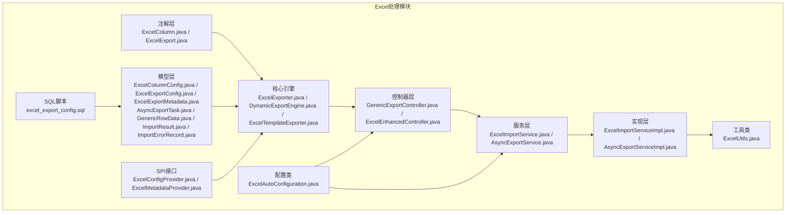

**图表来源**
- [ExcelColumn.java:1-54](file://forge/forge-framework/forge-starter-parent/forge-starter-excel/src/main/java/com/mdframe/forge/starter/excel/annotation/ExcelColumn.java#L1-L54)
- [ExcelExport.java:1-29](file://forge/forge-framework/forge-starter-parent/forge-starter-excel/src/main/java/com/mdframe/forge/starter/excel/annotation/ExcelExport.java#L1-L29)
- [ExcelColumnConfig.java:1-56](file://forge/forge-framework/forge-starter-parent/forge-starter-excel/src/main/java/com/mdframe/forge/starter/excel/model/ExcelColumnConfig.java#L1-L56)
- [ExcelExportConfig.java:1-46](file://forge/forge-framework/forge-starter-parent/forge-starter-excel/src/main/java/com/mdframe/forge/starter/excel/model/ExcelExportConfig.java#L1-L46)
- [ExcelExportMetadata.java:1-72](file://forge/forge-framework/forge-starter-parent/forge-starter-excel/src/main/java/com/mdframe/forge/starter/excel/model/ExcelExportMetadata.java#L1-L72)
- [ExcelExporter.java:1-230](file://forge/forge-framework/forge-starter-parent/forge-starter-excel/src/main/java/com/mdframe/forge/starter/excel/core/ExcelExporter.java#L1-L230)
- [DynamicExportEngine.java:1-509](file://forge/forge-framework/forge-starter-parent/forge-starter-excel/src/main/java/com/mdframe/forge/starter/excel/core/DynamicExportEngine.java#L1-L509)
- [ExcelTemplateExporter.java:1-103](file://forge/forge-framework/forge-starter-parent/forge-starter-excel/src/main/java/com/mdframe/forge/starter/excel/core/ExcelTemplateExporter.java#L1-L103)
- [GenericExportController.java:1-51](file://forge/forge-framework/forge-starter-parent/forge-starter-excel/src/main/java/com/mdframe/forge/starter/excel/controller/GenericExportController.java#L1-L51)
- [ExcelEnhancedController.java:1-218](file://forge/forge-framework/forge-starter-parent/forge-starter-excel/src/main/java/com/mdframe/forge/starter/excel/controller/ExcelEnhancedController.java#L1-L218)
- [ExcelUtils.java:1-75](file://forge/forge-framework/forge-starter-parent/forge-starter-excel/src/main/java/com/mdframe/forge/starter/excel/util/ExcelUtils.java#L1-L75)
- [ExcelConfigProvider.java:1-21](file://forge/forge-framework/forge-starter-parent/forge-starter-excel/src/main/java/com/mdframe/forge/starter/excel/spi/ExcelConfigProvider.java#L1-L21)
- [ExcelMetadataProvider.java:1-19](file://forge/forge-framework/forge-starter-parent/forge-starter-excel/src/main/java/com/mdframe/forge/starter/excel/spi/ExcelMetadataProvider.java#L1-L19)
- [ExcelImportService.java:1-51](file://forge/forge-framework/forge-starter-parent/forge-starter-excel/src/main/java/com/mdframe/forge/starter/excel/service/ExcelImportService.java#L1-L51)
- [AsyncExportService.java:1-42](file://forge/forge-framework/forge-starter-parent/forge-starter-excel/src/main/java/com/mdframe/forge/starter/excel/service/AsyncExportService.java#L1-L42)
- [ExcelImportServiceImpl.java:1-56](file://forge/forge-framework/forge-starter-parent/forge-starter-excel/src/main/java/com/mdframe/forge/starter/excel/service/impl/ExcelImportServiceImpl.java#L1-L56)
- [AsyncExportServiceImpl.java:1-178](file://forge/forge-framework/forge-starter-parent/forge-starter-excel/src/main/java/com/mdframe/forge/starter/excel/service/impl/AsyncExportServiceImpl.java#L1-L178)
- [GenericRowDataListener.java:1-122](file://forge/forge-framework/forge-starter-parent/forge-starter-excel/src/main/java/com/mdframe/forge/starter/excel/service/impl/GenericRowDataListener.java#L1-L122)
- [AsyncExportTask.java:1-72](file://forge/forge-framework/forge-starter-parent/forge-starter-excel/src/main/java/com/mdframe/forge/starter/excel/model/AsyncExportTask.java#L1-L72)
- [GenericRowData.java:1-43](file://forge/forge-framework/forge-starter-parent/forge-starter-excel/src/main/java/com/mdframe/forge/starter/excel/model/GenericRowData.java#L1-L43)
- [ImportResult.java:1-69](file://forge/forge-framework/forge-starter-parent/forge-starter-excel/src/main/java/com/mdframe/forge/starter/excel/model/ImportResult.java#L1-L69)
- [ImportErrorRecord.java:1-41](file://forge/forge-framework/forge-starter-parent/forge-starter-excel/src/main/java/com/mdframe/forge/starter/excel/model/ImportErrorRecord.java#L1-L41)
- [ExcelAutoConfiguration.java:1-46](file://forge/forge-framework/forge-starter-parent/forge-starter-excel/src/main/java/com/mdframe/forge/starter/excel/config/ExcelAutoConfiguration.java#L1-L46)
- [excel_export_config.sql:1-80](file://forge/forge-framework/forge-starter-parent/forge-starter-excel/sql/excel_export_config.sql#L1-L80)

**章节来源**
- [ExcelExporter.java:1-230](file://forge/forge-framework/forge-starter-parent/forge-starter-excel/src/main/java/com/mdframe/forge/starter/excel/core/ExcelExporter.java#L1-L230)
- [DynamicExportEngine.java:1-509](file://forge/forge-framework/forge-starter-parent/forge-starter-excel/src/main/java/com/mdframe/forge/starter/excel/core/DynamicExportEngine.java#L1-L509)
- [ExcelEnhancedController.java:1-218](file://forge/forge-framework/forge-starter-parent/forge-starter-excel/src/main/java/com/mdframe/forge/starter/excel/controller/ExcelEnhancedController.java#L1-L218)

## 核心组件
- 注解层：通过 `@ExcelExport` 和 `@ExcelColumn` 提供声明式导出配置，支持表头、宽度、排序、日期/数字格式化、字典类型等。
- 模型层：`ExcelExportConfig`、`ExcelColumnConfig`、`ExcelExportMetadata` 定义导出配置与元数据结构，支撑注解与数据库配置的统一表达。**新增**：`AsyncExportTask`、`GenericRowData`、`ImportResult`、`ImportErrorRecord` 等模型支持完整的导入导出生命周期管理。
- 引擎层：`ExcelExporter` 实现注解式导出；`DynamicExportEngine` 实现数据库驱动的动态导出，支持反射调用Service方法、参数构建、字典翻译、数据截断与响应写入。**新增**：`ExcelTemplateExporter` 支持基于模板的数据填充导出。
- 控制器层：`GenericExportController` 提供通用导出接口，支持POST/GET两种方式。**新增**：`ExcelEnhancedController` 提供完整的导入导出增强功能，包括模板下载、数据导入、异步导出等。
- 服务层：**新增**：`ExcelImportService` 和 `AsyncExportService` 接口，提供导入导出服务抽象。
- 实现层：**新增**：`ExcelImportServiceImpl` 和 `AsyncExportServiceImpl` 实现类，提供具体的服务功能。
- 工具类：`ExcelUtils` 提供静态便捷方法，简化导出调用。
- SPI接口：`ExcelConfigProvider`、`ExcelMetadataProvider` 由业务模块实现，从数据库读取配置与元数据。
- 配置类：**新增**：`ExcelAutoConfiguration` 自动配置类，简化组件注册和依赖注入。
- SQL脚本：提供导出配置表与列配置表的建表与示例数据。

**章节来源**
- [ExcelColumn.java:1-54](file://forge/forge-framework/forge-starter-parent/forge-starter-excel/src/main/java/com/mdframe/forge/starter/excel/annotation/ExcelColumn.java#L1-L54)
- [ExcelExport.java:1-29](file://forge/forge-framework/forge-starter-parent/forge-starter-excel/src/main/java/com/mdframe/forge/starter/excel/annotation/ExcelExport.java#L1-L29)
- [ExcelColumnConfig.java:1-56](file://forge/forge-framework/forge-starter-parent/forge-starter-excel/src/main/java/com/mdframe/forge/starter/excel/model/ExcelColumnConfig.java#L1-L56)
- [ExcelExportConfig.java:1-46](file://forge/forge-framework/forge-starter-parent/forge-starter-excel/src/main/java/com/mdframe/forge/starter/excel/model/ExcelExportConfig.java#L1-L46)
- [ExcelExportMetadata.java:1-72](file://forge/forge-framework/forge-starter-parent/forge-starter-excel/src/main/java/com/mdframe/forge/starter/excel/model/ExcelExportMetadata.java#L1-L72)
- [ExcelExporter.java:1-230](file://forge/forge-framework/forge-starter-parent/forge-starter-excel/src/main/java/com/mdframe/forge/starter/excel/core/ExcelExporter.java#L1-L230)
- [DynamicExportEngine.java:1-509](file://forge/forge-framework/forge-starter-parent/forge-starter-excel/src/main/java/com/mdframe/forge/starter/excel/core/DynamicExportEngine.java#L1-L509)
- [ExcelTemplateExporter.java:1-103](file://forge/forge-framework/forge-starter-parent/forge-starter-excel/src/main/java/com/mdframe/forge/starter/excel/core/ExcelTemplateExporter.java#L1-L103)
- [GenericExportController.java:1-51](file://forge/forge-framework/forge-starter-parent/forge-starter-excel/src/main/java/com/mdframe/forge/starter/excel/controller/GenericExportController.java#L1-L51)
- [ExcelEnhancedController.java:1-218](file://forge/forge-framework/forge-starter-parent/forge-starter-excel/src/main/java/com/mdframe/forge/starter/excel/controller/ExcelEnhancedController.java#L1-L218)
- [ExcelUtils.java:1-75](file://forge/forge-framework/forge-starter-parent/forge-starter-excel/src/main/java/com/mdframe/forge/starter/excel/util/ExcelUtils.java#L1-L75)
- [ExcelConfigProvider.java:1-21](file://forge/forge-framework/forge-starter-parent/forge-starter-excel/src/main/java/com/mdframe/forge/starter/excel/spi/ExcelConfigProvider.java#L1-L21)
- [ExcelMetadataProvider.java:1-19](file://forge/forge-framework/forge-starter-parent/forge-starter-excel/src/main/java/com/mdframe/forge/starter/excel/spi/ExcelMetadataProvider.java#L1-L19)
- [ExcelImportService.java:1-51](file://forge/forge-framework/forge-starter-parent/forge-starter-excel/src/main/java/com/mdframe/forge/starter/excel/service/ExcelImportService.java#L1-L51)
- [AsyncExportService.java:1-42](file://forge/forge-framework/forge-starter-parent/forge-starter-excel/src/main/java/com/mdframe/forge/starter/excel/service/AsyncExportService.java#L1-L42)
- [ExcelImportServiceImpl.java:1-56](file://forge/forge-framework/forge-starter-parent/forge-starter-excel/src/main/java/com/mdframe/forge/starter/excel/service/impl/ExcelImportServiceImpl.java#L1-L56)
- [AsyncExportServiceImpl.java:1-178](file://forge/forge-framework/forge-starter-parent/forge-starter-excel/src/main/java/com/mdframe/forge/starter/excel/service/impl/AsyncExportServiceImpl.java#L1-L178)
- [GenericRowDataListener.java:1-122](file://forge/forge-framework/forge-starter-parent/forge-starter-excel/src/main/java/com/mdframe/forge/starter/excel/service/impl/GenericRowDataListener.java#L1-L122)
- [AsyncExportTask.java:1-72](file://forge/forge-framework/forge-starter-parent/forge-starter-excel/src/main/java/com/mdframe/forge/starter/excel/model/AsyncExportTask.java#L1-L72)
- [GenericRowData.java:1-43](file://forge/forge-framework/forge-starter-parent/forge-starter-excel/src/main/java/com/mdframe/forge/starter/excel/model/GenericRowData.java#L1-L43)
- [ImportResult.java:1-69](file://forge/forge-framework/forge-starter-parent/forge-starter-excel/src/main/java/com/mdframe/forge/starter/excel/model/ImportResult.java#L1-L69)
- [ImportErrorRecord.java:1-41](file://forge/forge-framework/forge-starter-parent/forge-starter-excel/src/main/java/com/mdframe/forge/starter/excel/model/ImportErrorRecord.java#L1-L41)
- [ExcelAutoConfiguration.java:1-46](file://forge/forge-framework/forge-starter-parent/forge-starter-excel/src/main/java/com/mdframe/forge/starter/excel/config/ExcelAutoConfiguration.java#L1-L46)
- [excel_export_config.sql:1-80](file://forge/forge-framework/forge-starter-parent/forge-starter-excel/sql/excel_export_config.sql#L1-L80)

## 架构总览
下图展示Excel导出的整体架构与组件交互，**新增**了导入导出增强功能和模板处理能力：

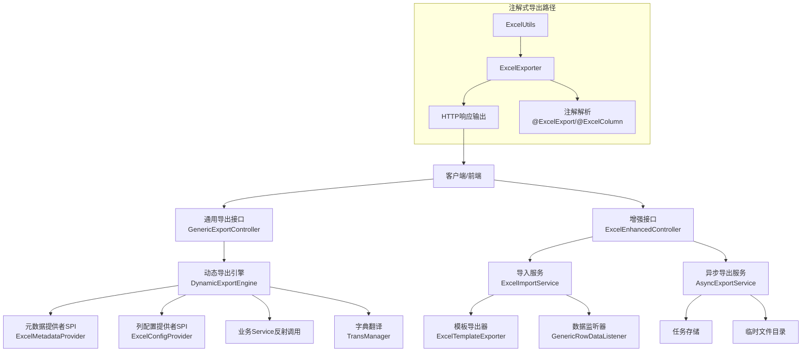

**图表来源**
- [GenericExportController.java:1-51](file://forge/forge-framework/forge-starter-parent/forge-starter-excel/src/main/java/com/mdframe/forge/starter/excel/controller/GenericExportController.java#L1-L51)
- [ExcelEnhancedController.java:1-218](file://forge/forge-framework/forge-starter-parent/forge-starter-excel/src/main/java/com/mdframe/forge/starter/excel/controller/ExcelEnhancedController.java#L1-L218)
- [DynamicExportEngine.java:1-509](file://forge/forge-framework/forge-starter-parent/forge-starter-excel/src/main/java/com/mdframe/forge/starter/excel/core/DynamicExportEngine.java#L1-L509)
- [ExcelImporterService.java:1-51](file://forge/forge-framework/forge-starter-parent/forge-starter-excel/src/main/java/com/mdframe/forge/starter/excel/service/ExcelImportService.java#L1-L51)
- [AsyncExportService.java:1-42](file://forge/forge-framework/forge-starter-parent/forge-starter-excel/src/main/java/com/mdframe/forge/starter/excel/service/AsyncExportService.java#L1-L42)
- [ExcelTemplateExporter.java:1-103](file://forge/forge-framework/forge-starter-parent/forge-starter-excel/src/main/java/com/mdframe/forge/starter/excel/core/ExcelTemplateExporter.java#L1-L103)
- [GenericRowDataListener.java:1-122](file://forge/forge-framework/forge-starter-parent/forge-starter-excel/src/main/java/com/mdframe/forge/starter/excel/service/impl/GenericRowDataListener.java#L1-L122)
- [ExcelExporter.java:1-230](file://forge/forge-framework/forge-starter-parent/forge-starter-excel/src/main/java/com/mdframe/forge/starter/excel/core/ExcelExporter.java#L1-L230)
- [ExcelConfigProvider.java:1-21](file://forge/forge-framework/forge-starter-parent/forge-starter-excel/src/main/java/com/mdframe/forge/starter/excel/spi/ExcelConfigProvider.java#L1-L21)
- [ExcelMetadataProvider.java:1-19](file://forge/forge-framework/forge-starter-parent/forge-starter-excel/src/main/java/com/mdframe/forge/starter/excel/spi/ExcelMetadataProvider.java#L1-L19)

## 详细组件分析

### 注解体系
- `@ExcelExport`：类级注解，用于标记实体支持Excel导出，配置Sheet名称、自动字典翻译、是否过滤null等。
- `@ExcelColumn`：字段级注解，配置列名、列宽、排序、是否导出、日期格式化、数字格式化、字典类型等。

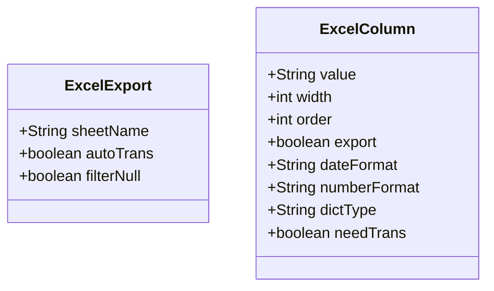

**图表来源**
- [ExcelExport.java:1-29](file://forge/forge-framework/forge-starter-parent/forge-starter-excel/src/main/java/com/mdframe/forge/starter/excel/annotation/ExcelExport.java#L1-L29)
- [ExcelColumn.java:1-54](file://forge/forge-framework/forge-starter-parent/forge-starter-excel/src/main/java/com/mdframe/forge/starter/excel/annotation/ExcelColumn.java#L1-L54)

**章节来源**
- [ExcelExport.java:1-29](file://forge/forge-framework/forge-starter-parent/forge-starter-excel/src/main/java/com/mdframe/forge/starter/excel/annotation/ExcelExport.java#L1-L29)
- [ExcelColumn.java:1-54](file://forge/forge-framework/forge-starter-parent/forge-starter-excel/src/main/java/com/mdframe/forge/starter/excel/annotation/ExcelColumn.java#L1-L54)

### 模型与配置
- `ExcelExportConfig`：导出配置，支持Sheet名称、文件名、自动翻译、过滤null、是否使用数据库配置、配置键等。
- `ExcelColumnConfig`：列配置（数据库读取），包含字段名、列名、宽度、排序、是否导出、日期/数字格式、字典类型等。
- `ExcelExportMetadata`：导出元数据（数据库读取），包含配置键、导出名称、Sheet名称、文件名模板、数据源Bean、查询方法、自动翻译、分页、最大导出条数、排序字段与方向、状态等。
- **新增**：`AsyncExportTask`：异步导出任务模型，包含任务ID、配置键、文件名、状态、文件路径、大小、数据条数、错误信息等。
- **新增**：`GenericRowData`：通用行数据模型，支持动态字段存储和访问。
- **新增**：`ImportResult`：导入结果模型，包含成功/失败统计、数据列表、错误记录等。
- **新增**：`ImportErrorRecord`：导入错误记录模型，提供详细的错误信息和修复建议。

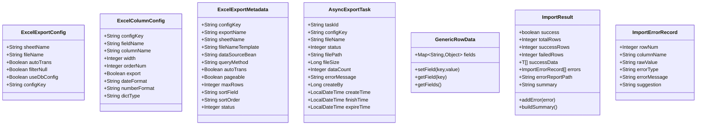

**图表来源**
- [ExcelExportConfig.java:1-46](file://forge/forge-framework/forge-starter-parent/forge-starter-excel/src/main/java/com/mdframe/forge/starter/excel/model/ExcelExportConfig.java#L1-L46)
- [ExcelColumnConfig.java:1-56](file://forge/forge-framework/forge-starter-parent/forge-starter-excel/src/main/java/com/mdframe/forge/starter/excel/model/ExcelColumnConfig.java#L1-L56)
- [ExcelExportMetadata.java:1-72](file://forge/forge-framework/forge-starter-parent/forge-starter-excel/src/main/java/com/mdframe/forge/starter/excel/model/ExcelExportMetadata.java#L1-L72)
- [AsyncExportTask.java:1-72](file://forge/forge-framework/forge-starter-parent/forge-starter-excel/src/main/java/com/mdframe/forge/starter/excel/model/AsyncExportTask.java#L1-L72)
- [GenericRowData.java:1-43](file://forge/forge-framework/forge-starter-parent/forge-starter-excel/src/main/java/com/mdframe/forge/starter/excel/model/GenericRowData.java#L1-L43)
- [ImportResult.java:1-69](file://forge/forge-framework/forge-starter-parent/forge-starter-excel/src/main/java/com/mdframe/forge/starter/excel/model/ImportResult.java#L1-L69)
- [ImportErrorRecord.java:1-41](file://forge/forge-framework/forge-starter-parent/forge-starter-excel/src/main/java/com/mdframe/forge/starter/excel/model/ImportErrorRecord.java#L1-L41)

**章节来源**
- [ExcelExportConfig.java:1-46](file://forge/forge-framework/forge-starter-parent/forge-starter-excel/src/main/java/com/mdframe/forge/starter/excel/model/ExcelExportConfig.java#L1-L46)
- [ExcelColumnConfig.java:1-56](file://forge/forge-framework/forge-starter-parent/forge-starter-excel/src/main/java/com/mdframe/forge/starter/excel/model/ExcelColumnConfig.java#L1-L56)
- [ExcelExportMetadata.java:1-72](file://forge/forge-framework/forge-starter-parent/forge-starter-excel/src/main/java/com/mdframe/forge/starter/excel/model/ExcelExportMetadata.java#L1-L72)
- [AsyncExportTask.java:1-72](file://forge/forge-framework/forge-starter-parent/forge-starter-excel/src/main/java/com/mdframe/forge/starter/excel/model/AsyncExportTask.java#L1-L72)
- [GenericRowData.java:1-43](file://forge/forge-framework/forge-starter-parent/forge-starter-excel/src/main/java/com/mdframe/forge/starter/excel/model/GenericRowData.java#L1-L43)
- [ImportResult.java:1-69](file://forge/forge-framework/forge-starter-parent/forge-starter-excel/src/main/java/com/mdframe/forge/starter/excel/model/ImportResult.java#L1-L69)
- [ImportErrorRecord.java:1-41](file://forge/forge-framework/forge-starter-parent/forge-starter-excel/src/main/java/com/mdframe/forge/starter/excel/model/ImportErrorRecord.java#L1-L41)

### 注解式导出引擎（ExcelExporter）
- 功能要点：
  - 支持将List<T>数据导出为Excel，自动解析注解配置生成表头与列元数据。
  - 支持字典翻译（通过TransManager）。
  - 支持从数据库读取列配置（通过ExcelConfigProvider），并与注解配置合并。
  - 输出到HttpServletResponse或OutputStream。
- 关键流程：
  1) 解析类字段与注解，结合数据库配置生成列元数据。
  2) 构建表头与数据映射。
  3) 写入Excel并完成响应。

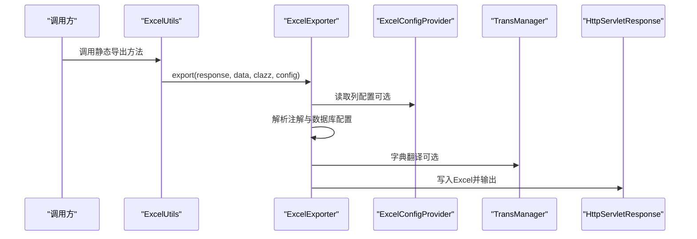

**图表来源**
- [ExcelUtils.java:1-75](file://forge/forge-framework/forge-starter-parent/forge-starter-excel/src/main/java/com/mdframe/forge/starter/excel/util/ExcelUtils.java#L1-L75)
- [ExcelExporter.java:1-230](file://forge/forge-framework/forge-starter-parent/forge-starter-excel/src/main/java/com/mdframe/forge/starter/excel/core/ExcelExporter.java#L1-L230)
- [ExcelConfigProvider.java:1-21](file://forge/forge-framework/forge-starter-parent/forge-starter-excel/src/main/java/com/mdframe/forge/starter/excel/spi/ExcelConfigProvider.java#L1-L21)

**章节来源**
- [ExcelExporter.java:1-230](file://forge/forge-framework/forge-starter-parent/forge-starter-excel/src/main/java/com/mdframe/forge/starter/excel/core/ExcelExporter.java#L1-L230)
- [ExcelUtils.java:1-75](file://forge/forge-framework/forge-starter-parent/forge-starter-excel/src/main/java/com/mdframe/forge/starter/excel/util/ExcelUtils.java#L1-L75)

### 动态导出引擎（DynamicExportEngine）
- 功能要点：
  - 通过配置键加载元数据与列配置，无需编写代码即可实现导出。
  - 反射调用指定Service的查询方法，支持多种参数形式（无参、Map、单值、实体、多参数）。
  - 支持字典翻译、数据截断（最大导出条数）、文件名模板替换、响应头设置。
  - 通过EasyExcel写入响应流。
- 关键流程：
  1) 加载元数据与列配置（SPI）。
  2) 反射查询数据，处理分页返回。
  3) 字典翻译与数据截断。
  4) 构建表头与数据，写入Excel并输出。

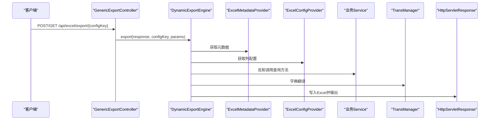

**图表来源**
- [GenericExportController.java:1-51](file://forge/forge-framework/forge-starter-parent/forge-starter-excel/src/main/java/com/mdframe/forge/starter/excel/controller/GenericExportController.java#L1-L51)
- [DynamicExportEngine.java:1-509](file://forge/forge-framework/forge-starter-parent/forge-starter-excel/src/main/java/com/mdframe/forge/starter/excel/core/DynamicExportEngine.java#L1-L509)
- [ExcelConfigProvider.java:1-21](file://forge/forge-framework/forge-starter-parent/forge-starter-excel/src/main/java/com/mdframe/forge/starter/excel/spi/ExcelConfigProvider.java#L1-L21)
- [ExcelMetadataProvider.java:1-19](file://forge/forge-framework/forge-starter-parent/forge-starter-excel/src/main/java/com/mdframe/forge/starter/excel/spi/ExcelMetadataProvider.java#L1-L19)

**章节来源**
- [DynamicExportEngine.java:1-509](file://forge/forge-framework/forge-starter-parent/forge-starter-excel/src/main/java/com/mdframe/forge/starter/excel/core/DynamicExportEngine.java#L1-L509)
- [GenericExportController.java:1-51](file://forge/forge-framework/forge-starter-parent/forge-starter-excel/src/main/java/com/mdframe/forge/starter/excel/controller/GenericExportController.java#L1-L51)

### 参数构建算法（多参数方法）
DynamicExportEngine支持多种参数形式，参数构建逻辑如下：

**图表来源**
- [DynamicExportEngine.java:174-251](file://forge/forge-framework/forge-starter-parent/forge-starter-excel/src/main/java/com/mdframe/forge/starter/excel/core/DynamicExportEngine.java#L174-L251)

**章节来源**
- [DynamicExportEngine.java:174-251](file://forge/forge-framework/forge-starter-parent/forge-starter-excel/src/main/java/com/mdframe/forge/starter/excel/core/DynamicExportEngine.java#L174-L251)

### 数据映射与字段访问
- 字段访问策略：优先通过getter方法，回退到直接字段访问（支持父类字段）。
- 数据映射：将对象集合映射为二维列表，与列配置顺序一一对应。

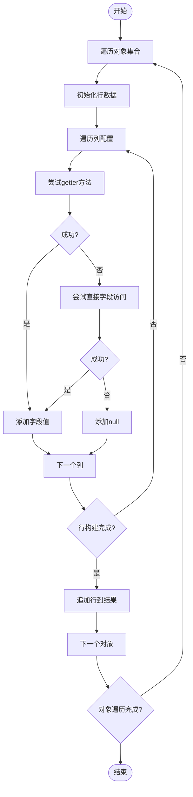

**图表来源**
- [DynamicExportEngine.java:489-507](file://forge/forge-framework/forge-starter-parent/forge-starter-excel/src/main/java/com/mdframe/forge/starter/excel/core/DynamicExportEngine.java#L489-L507)

**章节来源**
- [DynamicExportEngine.java:489-507](file://forge/forge-framework/forge-starter-parent/forge-starter-excel/src/main/java/com/mdframe/forge/starter/excel/core/DynamicExportEngine.java#L489-L507)

### SPI接口与数据库配置
- `ExcelConfigProvider`：根据配置键获取列配置列表。
- `ExcelMetadataProvider`：根据配置键获取导出元数据。
- 数据库表结构：
  - 主表：导出配置（config_key唯一、sheet_name、file_name_template、data_source_bean、query_method、auto_trans、pageable、max_rows、sort_field、sort_order、status等）。
  - 从表：列配置（config_key关联、field_name、column_name、width、order_num、export、date_format、number_format、dict_type）。
- 示例数据：包含用户列表与订单列表的导出配置及字段映射。

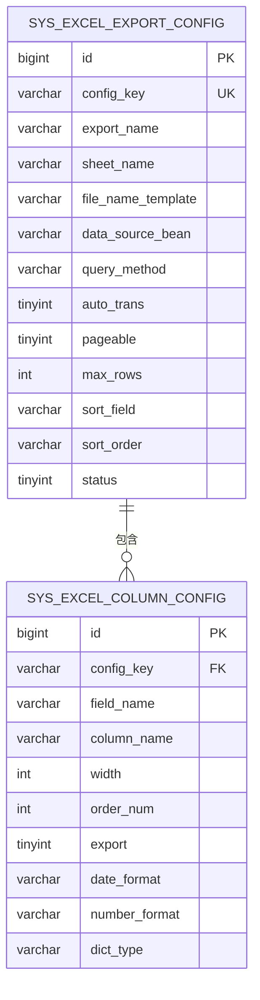

**图表来源**
- [excel_export_config.sql:1-80](file://forge/forge-framework/forge-starter-parent/forge-starter-excel/sql/excel_export_config.sql#L1-L80)

**章节来源**
- [ExcelConfigProvider.java:1-21](file://forge/forge-framework/forge-starter-parent/forge-starter-excel/src/main/java/com/mdframe/forge/starter/excel/spi/ExcelConfigProvider.java#L1-L21)
- [ExcelMetadataProvider.java:1-19](file://forge/forge-framework/forge-starter-parent/forge-starter-excel/src/main/java/com/mdframe/forge/starter/excel/spi/ExcelMetadataProvider.java#L1-L19)
- [excel_export_config.sql:1-80](file://forge/forge-framework/forge-starter-parent/forge-starter-excel/sql/excel_export_config.sql#L1-L80)

## 新增功能详解

### Excel增强控制器（ExcelEnhancedController）
**新增**：提供完整的Excel导入导出增强功能，包括模板下载、数据导入、异步导出等。

- **导入相关接口**：
  - `GET /api/excel/template/{configKey}`：下载导入模板
  - `POST /api/excel/import/{configKey}`：导入Excel数据
  - `GET /api/excel/error-report/{taskId}`：下载导入错误报告

- **异步导出相关接口**：
  - `POST /api/excel/async-export/{configKey}`：提交异步导出任务
  - `GET /api/excel/async-export/status/{taskId}`：查询任务状态
  - `GET /api/excel/async-export/download/{taskId}`：下载导出文件
  - `GET /api/excel/async-export/{taskId}`：轮询导出状态并自动下载

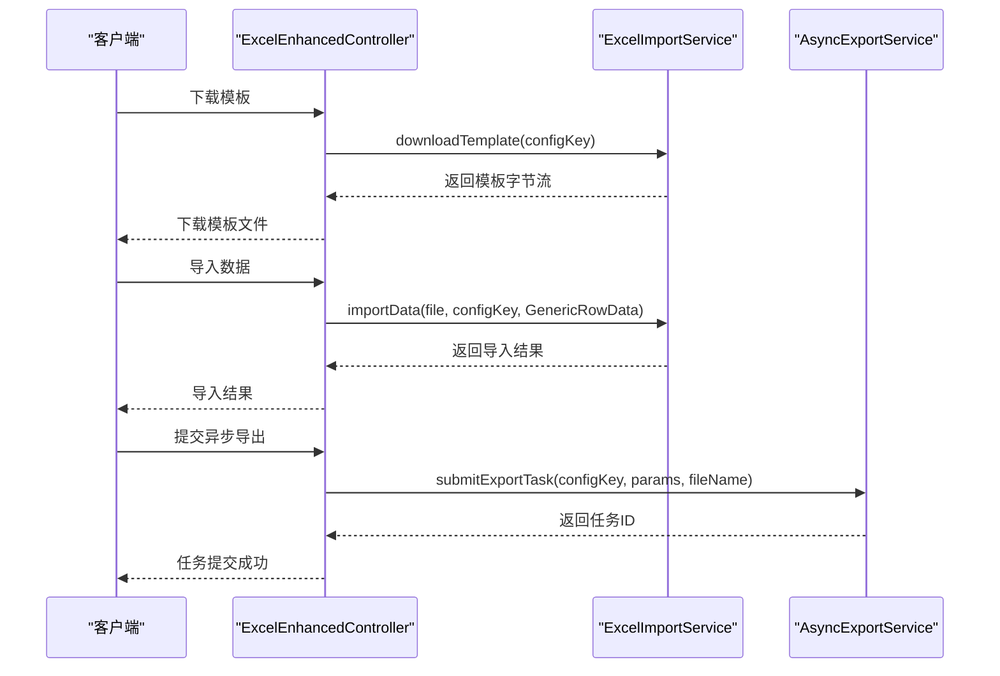

**图表来源**
- [ExcelEnhancedController.java:1-218](file://forge/forge-framework/forge-starter-parent/forge-starter-excel/src/main/java/com/mdframe/forge/starter/excel/controller/ExcelEnhancedController.java#L1-L218)
- [ExcelImportService.java:1-51](file://forge/forge-framework/forge-starter-parent/forge-starter-excel/src/main/java/com/mdframe/forge/starter/excel/service/ExcelImportService.java#L1-L51)
- [AsyncExportService.java:1-42](file://forge/forge-framework/forge-starter-parent/forge-starter-excel/src/main/java/com/mdframe/forge/starter/excel/service/AsyncExportService.java#L1-L42)

**章节来源**
- [ExcelEnhancedController.java:1-218](file://forge/forge-framework/forge-starter-parent/forge-starter-excel/src/main/java/com/mdframe/forge/starter/excel/controller/ExcelEnhancedController.java#L1-L218)

### Excel模板导出器（ExcelTemplateExporter）
**新增**：基于EasyExcel模板功能，支持动态数据填充导出。

- **功能特性**：
  - 支持单个对象、列表、复杂场景（单个对象+列表）的模板填充
  - 自动设置HTTP响应头，支持中文文件名
  - 基于模板的样式保持，确保导出文件格式一致

- **使用场景**：
  - 报表模板导出
  - 合同模板填充
  - 发票模板生成

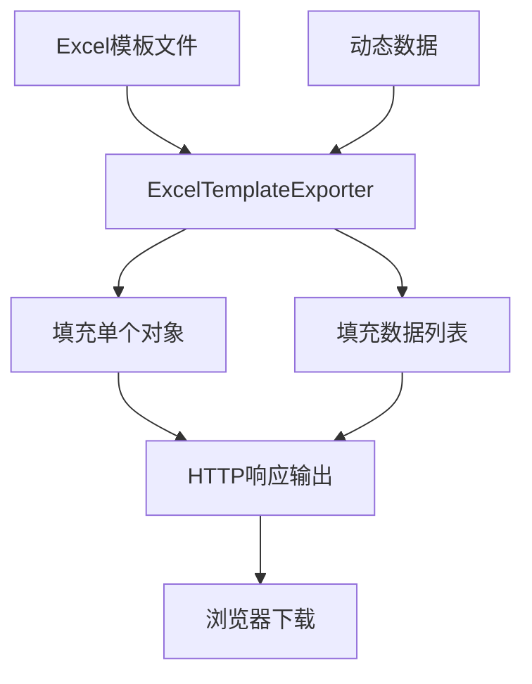

**图表来源**
- [ExcelTemplateExporter.java:1-103](file://forge/forge-framework/forge-starter-parent/forge-starter-excel/src/main/java/com/mdframe/forge/starter/excel/core/ExcelTemplateExporter.java#L1-L103)

**章节来源**
- [ExcelTemplateExporter.java:1-103](file://forge/forge-framework/forge-starter-parent/forge-starter-excel/src/main/java/com/mdframe/forge/starter/excel/core/ExcelTemplateExporter.java#L1-L103)

### 异步导出服务（AsyncExportService）
**新增**：支持大规模数据的异步导出处理，避免长时间阻塞请求。

- **核心功能**：
  - 任务提交：`submitExportTask()` - 提交异步导出任务
  - 状态查询：`getTaskStatus()` - 查询任务执行状态
  - 文件下载：`downloadFile()` - 下载已完成的导出文件
  - 清理过期：`cleanupExpiredTasks()` - 清理过期任务和文件

- **任务状态**：
  - 0：处理中
  - 1：完成
  - 2：失败

- **存储机制**：
  - 内存存储：`ConcurrentHashMap`（生产环境建议使用Redis）
  - 临时文件：导出文件保存在系统临时目录

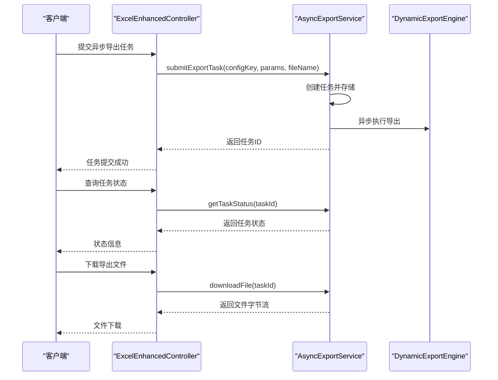

**图表来源**
- [AsyncExportService.java:1-42](file://forge/forge-framework/forge-starter-parent/forge-starter-excel/src/main/java/com/mdframe/forge/starter/excel/service/AsyncExportService.java#L1-L42)
- [AsyncExportServiceImpl.java:1-178](file://forge/forge-framework/forge-starter-parent/forge-starter-excel/src/main/java/com/mdframe/forge/starter/excel/service/impl/AsyncExportServiceImpl.java#L1-L178)
- [ExcelEnhancedController.java:1-218](file://forge/forge-framework/forge-starter-parent/forge-starter-excel/src/main/java/com/mdframe/forge/starter/excel/controller/ExcelEnhancedController.java#L1-L218)

**章节来源**
- [AsyncExportService.java:1-42](file://forge/forge-framework/forge-starter-parent/forge-starter-excel/src/main/java/com/mdframe/forge/starter/excel/service/AsyncExportService.java#L1-L42)
- [AsyncExportServiceImpl.java:1-178](file://forge/forge-framework/forge-starter-parent/forge-starter-excel/src/main/java/com/mdframe/forge/starter/excel/service/impl/AsyncExportServiceImpl.java#L1-L178)

### Excel导入服务（ExcelImportService）
**新增**：提供完整的Excel导入能力，支持模板下载、数据导入、错误报告等功能。

- **核心接口**：
  - `downloadTemplate()`：下载导入模板
  - `importData()`：导入Excel数据（支持MultipartFile和InputStream）
  - `downloadErrorReport()`：下载导入错误报告

- **数据模型**：
  - 使用`GenericRowData`作为通用数据容器，解决Map接口无法实例化的问题
  - 支持动态字段存储和访问

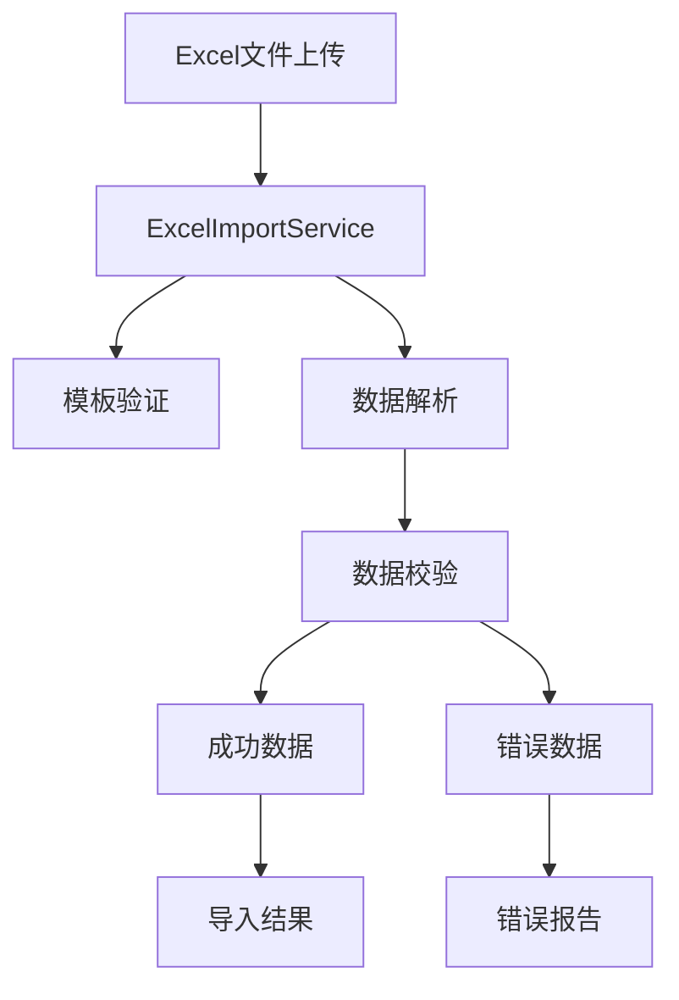

**图表来源**
- [ExcelImportService.java:1-51](file://forge/forge-framework/forge-starter-parent/forge-starter-excel/src/main/java/com/mdframe/forge/starter/excel/service/ExcelImportService.java#L1-L51)
- [ExcelImportServiceImpl.java:1-56](file://forge/forge-framework/forge-starter-parent/forge-starter-excel/src/main/java/com/mdframe/forge/starter/excel/service/impl/ExcelImportServiceImpl.java#L1-L56)
- [GenericRowData.java:1-43](file://forge/forge-framework/forge-starter-parent/forge-starter-excel/src/main/java/com/mdframe/forge/starter/excel/model/GenericRowData.java#L1-L43)

**章节来源**
- [ExcelImportService.java:1-51](file://forge/forge-framework/forge-starter-parent/forge-starter-excel/src/main/java/com/mdframe/forge/starter/excel/service/ExcelImportService.java#L1-L51)
- [ExcelImportServiceImpl.java:1-56](file://forge/forge-framework/forge-starter-parent/forge-starter-excel/src/main/java/com/mdframe/forge/starter/excel/service/impl/ExcelImportServiceImpl.java#L1-L56)

### 导入监听器（GenericRowDataListener）
**新增**：专门用于处理动态列的Excel导入监听器，提供数据校验和错误收集功能。

- **校验功能**：
  - 必填字段校验
  - 格式正则表达式校验
  - 类型转换异常处理

- **错误处理**：
  - 详细的错误记录，包含行号、列名、错误类型、错误信息
  - 支持建议修正值，帮助用户快速修复数据

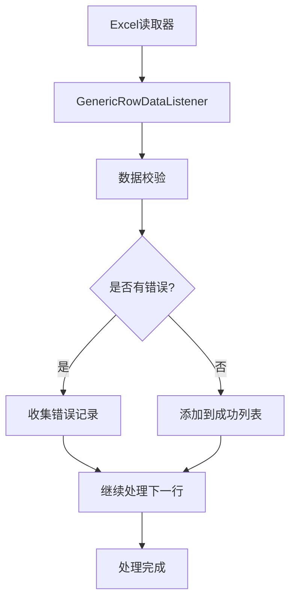

**图表来源**
- [GenericRowDataListener.java:1-122](file://forge/forge-framework/forge-starter-parent/forge-starter-excel/src/main/java/com/mdframe/forge/starter/excel/service/impl/GenericRowDataListener.java#L1-L122)

**章节来源**
- [GenericRowDataListener.java:1-122](file://forge/forge-framework/forge-starter-parent/forge-starter-excel/src/main/java/com/mdframe/forge/starter/excel/service/impl/GenericRowDataListener.java#L1-L122)

### Excel自动配置（ExcelAutoConfiguration）
**新增**：简化Excel模块的组件注册和依赖注入，提供智能配置。

- **自动注册组件**：
  - `ExcelExporter`：Excel导出器
  - `AsyncExportService`：异步导出服务
  - `ExcelImportService`：Excel导入服务
  - `ExcelEnhancedController`：增强控制器

- **条件装配**：
  - 使用`@ConditionalOnMissingBean`确保用户自定义实现优先级更高

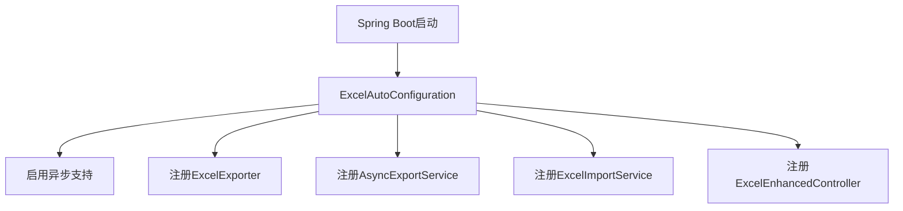

**图表来源**
- [ExcelAutoConfiguration.java:1-46](file://forge/forge-framework/forge-starter-parent/forge-starter-excel/src/main/java/com/mdframe/forge/starter/excel/config/ExcelAutoConfiguration.java#L1-L46)

**章节来源**
- [ExcelAutoConfiguration.java:1-46](file://forge/forge-framework/forge-starter-parent/forge-starter-excel/src/main/java/com/mdframe/forge/starter/excel/config/ExcelAutoConfiguration.java#L1-L46)

## 依赖关系分析
- 组件内聚与耦合：
  - ExcelExporter与注解紧密耦合，同时通过ExcelConfigProvider实现对数据库配置的松耦合。
  - DynamicExportEngine通过SPI与TransManager实现对元数据、列配置与字典翻译的松耦合。
  - GenericExportController仅作为入口，职责单一，便于扩展。
  - **新增**：ExcelEnhancedController协调导入导出服务，提供统一的增强接口。
  - **新增**：ExcelAutoConfiguration简化组件注册，降低使用复杂度。
- 外部依赖：
  - EasyExcel：负责Excel写入和模板处理。
  - Spring：依赖注入、条件装配（GenericExportController的开关）、异步执行。
  - 可选：TransManager（字典翻译）。

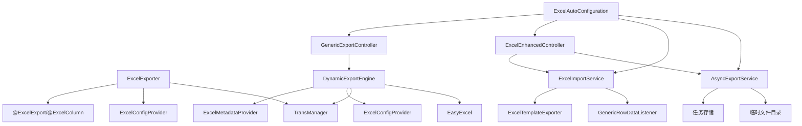

**图表来源**
- [ExcelExporter.java:1-230](file://forge/forge-framework/forge-starter-parent/forge-starter-excel/src/main/java/com/mdframe/forge/starter/excel/core/ExcelExporter.java#L1-L230)
- [DynamicExportEngine.java:1-509](file://forge/forge-framework/forge-starter-parent/forge-starter-excel/src/main/java/com/mdframe/forge/starter/excel/core/DynamicExportEngine.java#L1-L509)
- [GenericExportController.java:1-51](file://forge/forge-framework/forge-starter-parent/forge-starter-excel/src/main/java/com/mdframe/forge/starter/excel/controller/GenericExportController.java#L1-L51)
- [ExcelEnhancedController.java:1-218](file://forge/forge-framework/forge-starter-parent/forge-starter-excel/src/main/java/com/mdframe/forge/starter/excel/controller/ExcelEnhancedController.java#L1-L218)
- [ExcelImportService.java:1-51](file://forge/forge-framework/forge-starter-parent/forge-starter-excel/src/main/java/com/mdframe/forge/starter/excel/service/ExcelImportService.java#L1-L51)
- [AsyncExportService.java:1-42](file://forge/forge-framework/forge-starter-parent/forge-starter-excel/src/main/java/com/mdframe/forge/starter/excel/service/AsyncExportService.java#L1-L42)
- [ExcelTemplateExporter.java:1-103](file://forge/forge-framework/forge-starter-parent/forge-starter-excel/src/main/java/com/mdframe/forge/starter/excel/core/ExcelTemplateExporter.java#L1-L103)
- [GenericRowDataListener.java:1-122](file://forge/forge-framework/forge-starter-parent/forge-starter-excel/src/main/java/com/mdframe/forge/starter/excel/service/impl/GenericRowDataListener.java#L1-L122)
- [ExcelAutoConfiguration.java:1-46](file://forge/forge-framework/forge-starter-parent/forge-starter-excel/src/main/java/com/mdframe/forge/starter/excel/config/ExcelAutoConfiguration.java#L1-L46)

**章节来源**
- [ExcelExporter.java:1-230](file://forge/forge-framework/forge-starter-parent/forge-starter-excel/src/main/java/com/mdframe/forge/starter/excel/core/ExcelExporter.java#L1-L230)
- [DynamicExportEngine.java:1-509](file://forge/forge-framework/forge-starter-parent/forge-starter-excel/src/main/java/com/mdframe/forge/starter/excel/core/DynamicExportEngine.java#L1-L509)
- [GenericExportController.java:1-51](file://forge/forge-framework/forge-starter-parent/forge-starter-excel/src/main/java/com/mdframe/forge/starter/excel/controller/GenericExportController.java#L1-L51)
- [ExcelEnhancedController.java:1-218](file://forge/forge-framework/forge-starter-parent/forge-starter-excel/src/main/java/com/mdframe/forge/starter/excel/controller/ExcelEnhancedController.java#L1-L218)

## 性能考虑
- 数据量控制：
  - DynamicExportEngine支持最大导出条数限制，防止超大数据量导致内存溢出或响应超时。
  - **新增**：异步导出服务支持大规模数据处理，避免长时间阻塞请求。
- 分页查询：
  - 支持pageable模式，通过反射获取分页对象中的records字段，减少一次性加载。
- 字典翻译：
  - 在导出前进行批量翻译，避免重复查询；若翻译失败，记录告警但不影响导出流程。
- 参数构建优化：
  - 对单参数场景提供快速路径（Map、基本类型、String），减少反射开销。
- 输出流写入：
  - 直接写入HttpServletResponse输出流，避免中间缓冲区占用。
- **新增**：异步处理优化：
  - 异步导出使用线程池处理，不阻塞主线程
  - 临时文件存储，支持大文件导出
  - 任务状态管理，支持任务监控和清理

**章节来源**
- [DynamicExportEngine.java:80-84](file://forge/forge-framework/forge-starter-parent/forge-starter-excel/src/main/java/com/mdframe/forge/starter/excel/core/DynamicExportEngine.java#L80-L84)
- [ExcelExporter.java:75-78](file://forge/forge-framework/forge-starter-parent/forge-starter-excel/src/main/java/com/mdframe/forge/starter/excel/core/ExcelExporter.java#L75-L78)
- [AsyncExportServiceImpl.java:73-108](file://forge/forge-framework/forge-starter-parent/forge-starter-excel/src/main/java/com/mdframe/forge/starter/excel/service/impl/AsyncExportServiceImpl.java#L73-L108)

## 故障排除指南
- 通用导出接口不可用：
  - 检查配置开关：`forge.excel.enable-generic-export`，默认开启。
- 导出配置不存在或禁用：
  - DynamicExportEngine会抛出异常提示配置不存在或状态为禁用。
- 未配置SPI实现：
  - 若未实现ExcelConfigProvider或ExcelMetadataProvider，将抛出未配置异常。
- 查询方法未找到：
  - 反射查找方法失败时会抛出异常，需确认Service Bean名称与方法名正确。
- 参数构建失败：
  - 多参数场景无法按参数名匹配时，将使用null填充，建议确保请求参数与方法签名一致。
- 字段值读取失败：
  - 字段访问异常时记录告警并返回null，不影响整体导出。
- 文件名编码问题：
  - 响应头中使用UTF-8编码与URL编码，确保浏览器正确显示中文文件名。
- **新增**：导入相关问题：
  - 模板下载失败：检查配置键是否存在，确认模板文件路径
  - 导入数据异常：查看错误报告文件，定位具体错误行和列
  - 异步导出任务超时：检查任务状态，确认导出数据量和服务器性能
- **新增**：异步导出问题：
  - 任务状态查询失败：确认任务ID正确性和任务存储配置
  - 文件下载失败：检查临时文件目录权限和磁盘空间
  - 过期任务清理：定期执行清理操作，释放磁盘空间

**章节来源**
- [GenericExportController.java:20-38](file://forge/forge-framework/forge-starter-parent/forge-starter-excel/src/main/java/com/mdframe/forge/starter/excel/controller/GenericExportController.java#L20-L38)
- [DynamicExportEngine.java:54-93](file://forge/forge-framework/forge-starter-parent/forge-starter-excel/src/main/java/com/mdframe/forge/starter/excel/core/DynamicExportEngine.java#L54-L93)
- [ExcelExporter.java:125-151](file://forge/forge-framework/forge-starter-parent/forge-starter-excel/src/main/java/com/mdframe/forge/starter/excel/core/ExcelExporter.java#L125-L151)
- [ExcelEnhancedController.java:1-218](file://forge/forge-framework/forge-starter-parent/forge-starter-excel/src/main/java/com/mdframe/forge/starter/excel/controller/ExcelEnhancedController.java#L1-L218)

## 结论
Forge的Excel处理功能以注解与SPI为核心，提供了灵活且强大的导出能力：
- 注解式导出适合固定结构的报表，开发效率高。
- 动态导出适合多变的业务场景，零代码即可配置导出。
- 通过数据库配置与字典翻译，满足复杂业务需求。
- **新增**：完整的导入导出增强功能，包括模板下载、数据导入、异步导出等高级特性。
- **新增**：基于模板的动态数据填充，支持复杂的报表生成场景。
- **新增**：异步导出服务，支持大规模数据处理，提升系统性能。
- 提供完善的错误处理与性能优化策略，保障生产环境稳定运行。

## 附录

### Excel模板设计指南
- 表头设计：使用注解或数据库配置定义列名，保持与实体字段一致。
- 列宽与排序：通过注解或数据库配置设置列宽与排序，确保阅读体验。
- 格式化：针对日期与数字字段设置格式化规则，保证展示一致性。
- 字典翻译：为枚举或码表字段配置字典类型，实现自动翻译。
- 文件命名：利用文件名模板占位符（如{date}、{time}）生成动态文件名。
- **新增**：模板字段绑定：使用EasyExcel的模板语法进行字段绑定，支持动态数据填充。

**章节来源**
- [ExcelColumn.java:14-52](file://forge/forge-framework/forge-starter-parent/forge-starter-excel/src/main/java/com/mdframe/forge/starter/excel/annotation/ExcelColumn.java#L14-L52)
- [ExcelExportConfig.java:16-44](file://forge/forge-framework/forge-starter-parent/forge-starter-excel/src/main/java/com/mdframe/forge/starter/excel/model/ExcelExportConfig.java#L16-L44)
- [excel_export_config.sql:28-42](file://forge/forge-framework/forge-starter-parent/forge-starter-excel/sql/excel_export_config.sql#L28-L42)
- [ExcelTemplateExporter.java:28-91](file://forge/forge-framework/forge-starter-parent/forge-starter-excel/src/main/java/com/mdframe/forge/starter/excel/core/ExcelTemplateExporter.java#L28-L91)

### 批量处理最佳实践
- 合理设置最大导出条数，避免超大数据量。
- 对于分页查询，确保Service返回分页对象并包含records字段。
- 使用字典翻译前，确保字典服务可用，避免影响导出速度。
- 参数传递尽量使用Map或实体对象，减少反射参数构建失败的概率。
- **新增**：大规模数据导出建议使用异步导出服务，避免阻塞请求。
- **新增**：合理设置异步导出任务的过期时间，及时清理临时文件。

**章节来源**
- [DynamicExportEngine.java:125-151](file://forge/forge-framework/forge-starter-parent/forge-starter-excel/src/main/java/com/mdframe/forge/starter/excel/core/DynamicExportEngine.java#L125-L151)
- [ExcelExportMetadata.java:49-50](file://forge/forge-framework/forge-starter-parent/forge-starter-excel/src/main/java/com/mdframe/forge/starter/excel/model/ExcelExportMetadata.java#L49-L50)
- [AsyncExportServiceImpl.java:52-71](file://forge/forge-framework/forge-starter-parent/forge-starter-excel/src/main/java/com/mdframe/forge/starter/excel/service/impl/AsyncExportServiceImpl.java#L52-L71)

### 性能优化方案
- 使用注解式导出替代频繁的数据库查询，减少SPI调用次数。
- 对热点导出任务进行缓存（如列配置），降低重复解析成本。
- 合理设置列宽与字段数量，避免过大表格导致内存压力。
- 在高并发场景下，限制同时导出的任务数量，避免资源争用。
- **新增**：异步导出优化：使用线程池处理异步任务，避免阻塞主线程。
- **新增**：临时文件管理：定期清理过期的导出文件，释放磁盘空间。
- **新增**：内存管理：异步导出使用流式写入，避免大文件内存溢出。

**章节来源**
- [ExcelExporter.java:112-164](file://forge/forge-framework/forge-starter-parent/forge-starter-excel/src/main/java/com/mdframe/forge/starter/excel/core/ExcelExporter.java#L112-L164)
- [DynamicExportEngine.java:80-84](file://forge/forge-framework/forge-starter-parent/forge-starter-excel/src/main/java/com/mdframe/forge/starter/excel/core/DynamicExportEngine.java#L80-L84)
- [AsyncExportServiceImpl.java:130-149](file://forge/forge-framework/forge-starter-parent/forge-starter-excel/src/main/java/com/mdframe/forge/starter/excel/service/impl/AsyncExportServiceImpl.java#L130-L149)

### 导入导出最佳实践
- **导入数据质量**：使用模板下载功能，确保数据格式符合要求。
- **错误处理**：利用错误报告功能，快速定位和修复数据问题。
- **异步处理**：对于大批量数据导出，使用异步导出服务提升用户体验。
- **任务监控**：定期检查异步导出任务状态，及时发现和处理异常。
- **性能监控**：关注内存使用情况和磁盘空间，避免资源耗尽。

**章节来源**
- [ExcelEnhancedController.java:1-218](file://forge/forge-framework/forge-starter-parent/forge-starter-excel/src/main/java/com/mdframe/forge/starter/excel/controller/ExcelEnhancedController.java#L1-L218)
- [ExcelImportServiceImpl.java:1-56](file://forge/forge-framework/forge-starter-parent/forge-starter-excel/src/main/java/com/mdframe/forge/starter/excel/service/impl/ExcelImportServiceImpl.java#L1-L56)
- [AsyncExportServiceImpl.java:1-178](file://forge/forge-framework/forge-starter-parent/forge-starter-excel/src/main/java/com/mdframe/forge/starter/excel/service/impl/AsyncExportServiceImpl.java#L1-L178)