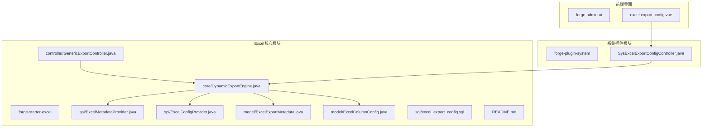
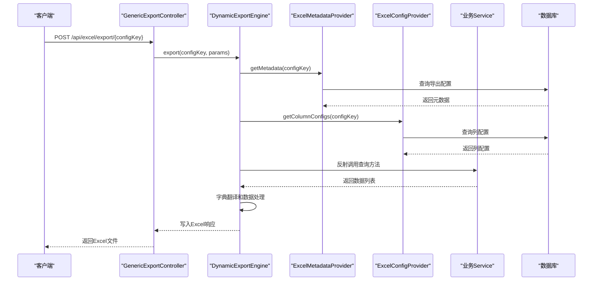
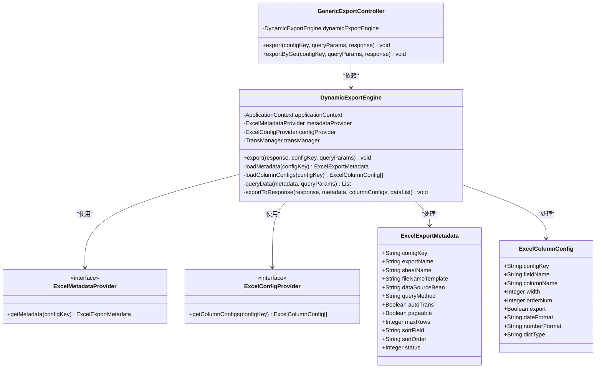
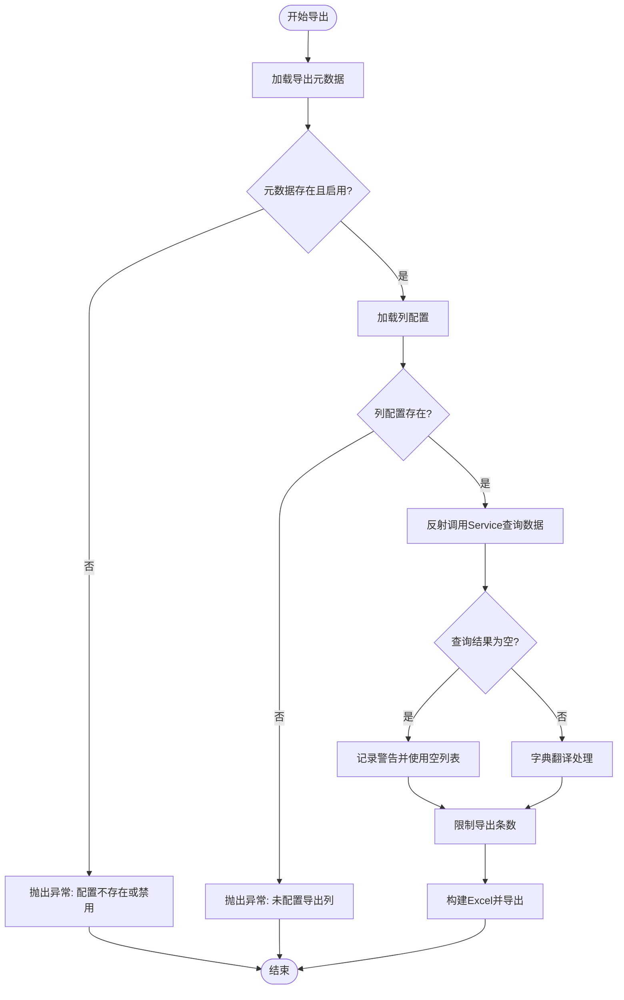
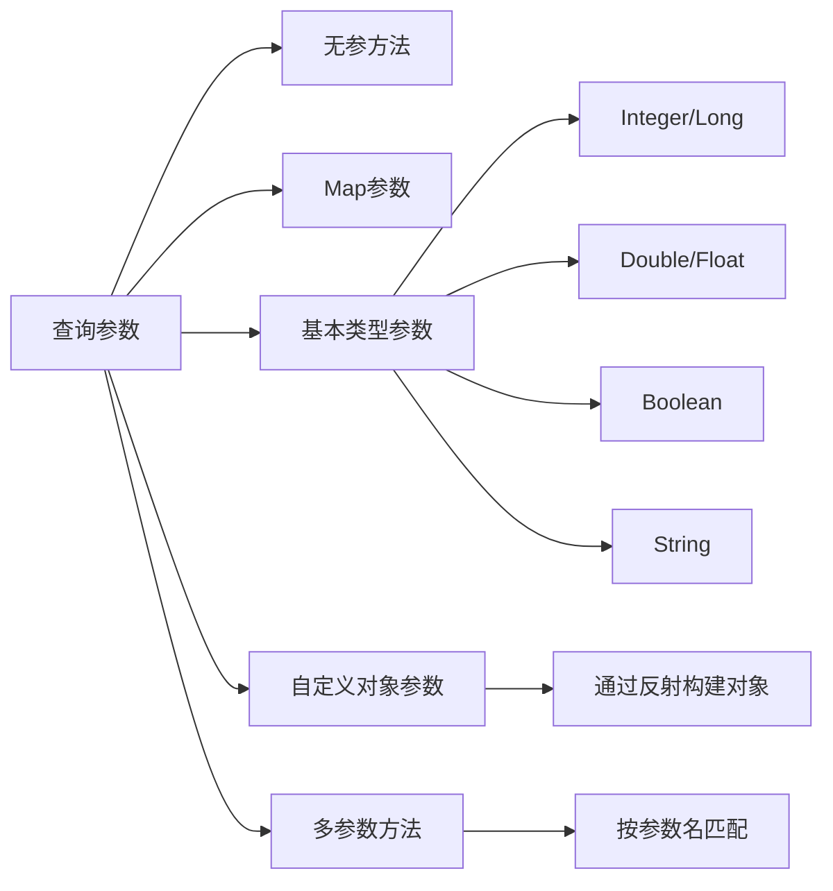
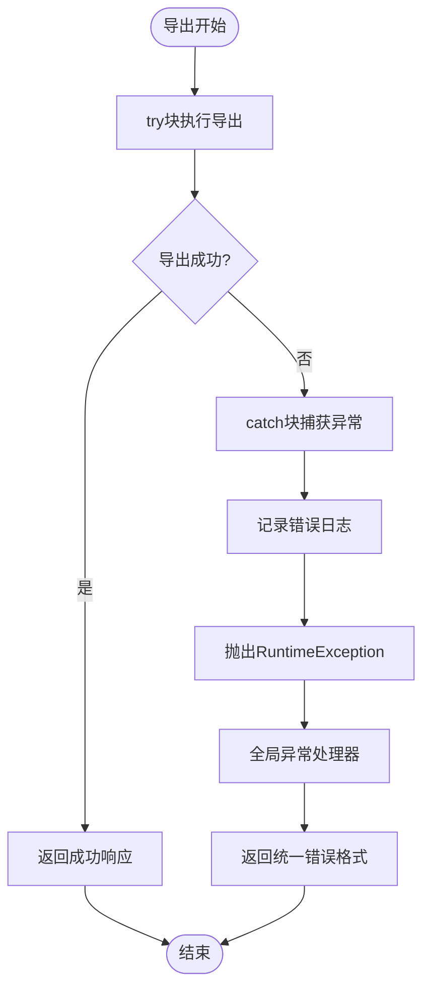
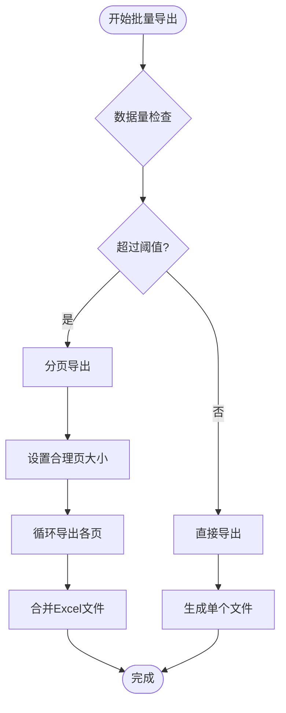
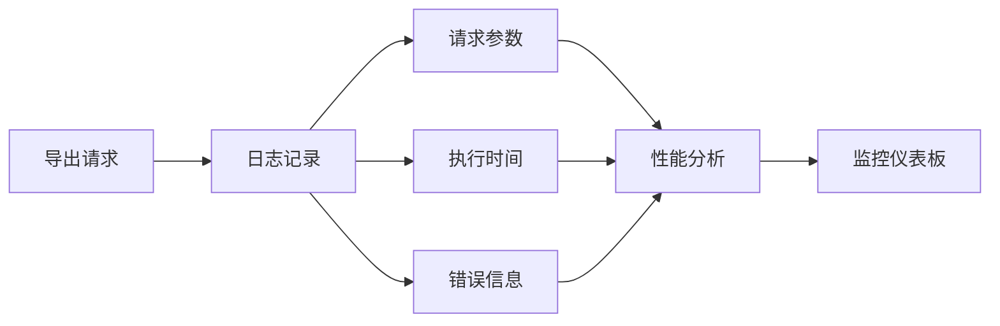

# Excel接口使用指南

<cite>
**本文档引用的文件**
- [GenericExportController.java](file://forge/forge-framework/forge-starter-parent/forge-starter-excel/src/main/java/com/mdframe/forge/starter/excel/controller/GenericExportController.java)
- [DynamicExportEngine.java](file://forge/forge-framework/forge-starter-parent/forge-starter-excel/src/main/java/com/mdframe/forge/starter/excel/core/DynamicExportEngine.java)
- [ExcelMetadataProvider.java](file://forge/forge-framework/forge-starter-parent/forge-starter-excel/src/main/java/com/mdframe/forge/starter/excel/spi/ExcelMetadataProvider.java)
- [ExcelConfigProvider.java](file://forge/forge-framework/forge-starter-parent/forge-starter-excel/src/main/java/com/mdframe/forge/starter/excel/spi/ExcelConfigProvider.java)
- [ExcelExportMetadata.java](file://forge/forge-framework/forge-starter-parent/forge-starter-excel/src/main/java/com/mdframe/forge/starter/excel/model/ExcelExportMetadata.java)
- [ExcelColumnConfig.java](file://forge/forge-framework/forge-starter-parent/forge-starter-excel/src/main/java/com/mdframe/forge/starter/excel/model/ExcelColumnConfig.java)
- [excel_export_config.sql](file://forge/forge-framework/forge-starter-parent/forge-starter-excel/sql/excel_export_config.sql)
- [README.md](file://forge/forge-framework/forge-starter-parent/forge-starter-excel/README.md)
- [SysExcelExportConfigController.java](file://forge/forge-framework/forge-plugin-parent/forge-plugin-system/src/main/java/com/mdframe/forge/plugin/system/controller/SysExcelExportConfigController.java)
- [excel-export-config.vue](file://forge-admin-ui/src/views/system/excel-export-config.vue)
</cite>

## 目录
1. [简介](#简介)
2. [项目结构](#项目结构)
3. [核心组件](#核心组件)
4. [架构概览](#架构概览)
5. [详细组件分析](#详细组件分析)
6. [POST与GET导出方式对比](#post与get导出方式对比)
7. [接口调用示例](#接口调用示例)
8. [参数说明](#参数说明)
9. [响应格式](#响应格式)
10. [错误处理机制](#错误处理机制)
11. [前端集成示例](#前端集成示例)
12. [后端服务调用](#后端服务调用)
13. [批量导出最佳实践](#批量导出最佳实践)
14. [性能优化建议](#性能优化建议)
15. [故障排除指南](#故障排除指南)
16. [结论](#结论)

## 简介

Excel接口使用指南为开发者提供了一个完整的Excel导出功能集成方案。该系统基于Spring Boot框架，采用通用导出控制器和动态导出引擎的设计模式，实现了零代码开发的Excel导出功能。

系统的核心特点包括：
- **零代码开发**：无需编写导出接口代码
- **动态配置**：通过数据库配置驱动导出行为
- **统一接口**：所有导出统一走`/api/excel/export/{configKey}`路径
- **灵活参数**：支持复杂查询条件和多种参数类型
- **自动字典翻译**：内置字典翻译功能
- **分页支持**：支持大数据量导出

## 项目结构

Excel导出功能主要分布在以下模块中：



**图表来源**
- [GenericExportController.java](file://forge/forge-framework/forge-starter-parent/forge-starter-excel/src/main/java/com/mdframe/forge/starter/excel/controller/GenericExportController.java#L1-L51)
- [DynamicExportEngine.java](file://forge/forge-framework/forge-starter-parent/forge-starter-excel/src/main/java/com/mdframe/forge/starter/excel/core/DynamicExportEngine.java#L1-L509)

**章节来源**
- [GenericExportController.java](file://forge/forge-framework/forge-starter-parent/forge-starter-excel/src/main/java/com/mdframe/forge/starter/excel/controller/GenericExportController.java#L1-L51)
- [README.md](file://forge/forge-framework/forge-starter-parent/forge-starter-excel/README.md#L1-L268)

## 核心组件

### 通用导出控制器
GenericExportController是系统的入口点，提供两个主要的导出接口：
- POST方式：`/api/excel/export/{configKey}` - 支持复杂查询参数
- GET方式：`/api/excel/export/{configKey}` - 适用于简单查询参数

### 动态导出引擎
DynamicExportEngine是核心处理组件，负责：
- 加载导出元数据和列配置
- 反射调用Service方法获取数据
- 自动字典翻译
- 构建Excel并导出

### SPI接口
系统采用SPI（Service Provider Interface）模式：
- ExcelMetadataProvider：元数据提供者
- ExcelConfigProvider：列配置提供者

**章节来源**
- [GenericExportController.java](file://forge/forge-framework/forge-starter-parent/forge-starter-excel/src/main/java/com/mdframe/forge/starter/excel/controller/GenericExportController.java#L12-L51)
- [DynamicExportEngine.java](file://forge/forge-framework/forge-starter-parent/forge-starter-excel/src/main/java/com/mdframe/forge/starter/excel/core/DynamicExportEngine.java#L27-L93)
- [ExcelMetadataProvider.java](file://forge/forge-framework/forge-starter-parent/forge-starter-excel/src/main/java/com/mdframe/forge/starter/excel/spi/ExcelMetadataProvider.java#L1-L18)
- [ExcelConfigProvider.java](file://forge/forge-framework/forge-starter-parent/forge-starter-excel/src/main/java/com/mdframe/forge/starter/excel/spi/ExcelConfigProvider.java#L1-L20)

## 架构概览

系统采用分层架构设计，实现了高度的解耦和灵活性：



**图表来源**
- [GenericExportController.java](file://forge/forge-framework/forge-starter-parent/forge-starter-excel/src/main/java/com/mdframe/forge/starter/excel/controller/GenericExportController.java#L32-L49)
- [DynamicExportEngine.java](file://forge/forge-framework/forge-starter-parent/forge-starter-excel/src/main/java/com/mdframe/forge/starter/excel/core/DynamicExportEngine.java#L54-L93)

**章节来源**
- [README.md](file://forge/forge-framework/forge-starter-parent/forge-starter-excel/README.md#L4-L15)

## 详细组件分析

### GenericExportController类图



**图表来源**
- [GenericExportController.java](file://forge/forge-framework/forge-starter-parent/forge-starter-excel/src/main/java/com/mdframe/forge/starter/excel/controller/GenericExportController.java#L21-L51)
- [DynamicExportEngine.java](file://forge/forge-framework/forge-starter-parent/forge-starter-excel/src/main/java/com/mdframe/forge/starter/excel/core/DynamicExportEngine.java#L34-L509)
- [ExcelMetadataProvider.java](file://forge/forge-framework/forge-starter-parent/forge-starter-excel/src/main/java/com/mdframe/forge/starter/excel/spi/ExcelMetadataProvider.java#L9-L18)
- [ExcelConfigProvider.java](file://forge/forge-framework/forge-starter-parent/forge-starter-excel/src/main/java/com/mdframe/forge/starter/excel/spi/ExcelConfigProvider.java#L11-L20)
- [ExcelExportMetadata.java](file://forge/forge-framework/forge-starter-parent/forge-starter-excel/src/main/java/com/mdframe/forge/starter/excel/model/ExcelExportMetadata.java#L10-L72)
- [ExcelColumnConfig.java](file://forge/forge-framework/forge-starter-parent/forge-starter-excel/src/main/java/com/mdframe/forge/starter/excel/model/ExcelColumnConfig.java#L9-L56)

### DynamicExportEngine处理流程



**图表来源**
- [DynamicExportEngine.java](file://forge/forge-framework/forge-starter-parent/forge-starter-excel/src/main/java/com/mdframe/forge/starter/excel/core/DynamicExportEngine.java#L54-L93)

**章节来源**
- [DynamicExportEngine.java](file://forge/forge-framework/forge-starter-parent/forge-starter-excel/src/main/java/com/mdframe/forge/starter/excel/core/DynamicExportEngine.java#L27-L509)

## POST与GET导出方式对比

### POST方式导出

**适用场景**：
- 复杂查询条件
- 大量参数传递
- 需要精确控制参数类型
- 安全性要求较高的场景

**特点**：
- 请求体中传递查询参数
- 支持任意复杂的参数结构
- 参数大小不受URL限制
- 更适合大数据量导出

### GET方式导出

**适用场景**：
- 简单查询参数
- 快速导出常用报表
- 参数较少的情况
- 需要分享导出链接

**特点**：
- URL查询参数传递
- 参数直观可见
- 便于分享和缓存
- 参数长度受URL限制

### 选择建议

| 场景 | 推荐方式 | 原因 |
|------|----------|------|
| 复杂筛选条件 | POST | 支持复杂参数结构 |
| 大数据量导出 | POST | 避免URL长度限制 |
| 简单固定报表 | GET | 操作简便 |
| 需要分享链接 | GET | 可直接分享URL |

**章节来源**
- [GenericExportController.java](file://forge/forge-framework/forge-starter-parent/forge-starter-excel/src/main/java/com/mdframe/forge/starter/excel/controller/GenericExportController.java#L25-L49)

## 接口调用示例

### 基本POST导出示例

```javascript
// 用户列表导出
axios.post('/api/excel/export/user_list_export', {
    status: 1,
    startDate: '2025-01-01',
    endDate: '2025-01-31',
    keyword: 'admin'
}, {
    responseType: 'blob'
}).then(response => {
    const url = window.URL.createObjectURL(new Blob([response.data]));
    const link = document.createElement('a');
    link.href = url;
    link.download = '用户列表.xlsx';
    link.click();
});
```

### GET方式导出示例

```javascript
// 订单导出（简单参数）
window.open('/api/excel/export/order_export?status=PAID&userId=1001');
```

### 带分页的导出示例

```javascript
// 分页查询导出
axios.post('/api/excel/export/order_export', {
    page: 1,
    size: 1000,
    status: 'PAID'
}, {
    responseType: 'blob'
});
```

**章节来源**
- [README.md](file://forge/forge-framework/forge-starter-parent/forge-starter-excel/README.md#L108-L178)

## 参数说明

### 必填参数

| 参数名 | 类型 | 描述 | 示例 |
|--------|------|------|------|
| configKey | String | 配置键（在数据库中唯一标识） | `user_list_export` |
| queryParams | Map/Object | 查询参数（根据业务需求传入） | `{status: 1, keyword: 'admin'}` |

### 查询参数类型支持

系统支持多种参数类型：



**图表来源**
- [DynamicExportEngine.java](file://forge/forge-framework/forge-starter-parent/forge-starter-excel/src/main/java/com/mdframe/forge/starter/excel/core/DynamicExportEngine.java#L174-L251)

### 参数构建规则

| 参数类型 | 构建方式 | 示例 |
|----------|----------|------|
| 无参方法 | 直接调用，无参数 | `service.list()` |
| Map参数 | 直接传递整个Map | `service.queryList(params)` |
| 基本类型 | 从Map中取值并转换 | `service.query(userId)` |
| 对象参数 | 通过反射从Map构建 | `service.query(query)` |
| 多参数 | 按参数名从Map中匹配 | `service.query(keyword, status)` |

**章节来源**
- [DynamicExportEngine.java](file://forge/forge-framework/forge-starter-parent/forge-starter-excel/src/main/java/com/mdframe/forge/starter/excel/core/DynamicExportEngine.java#L166-L251)

## 响应格式

### 成功响应

当导出成功时，系统返回标准的Excel文件流：

```mermaid
sequenceDiagram
participant Client as "客户端"
participant Controller as "控制器"
participant Engine as "导出引擎"
participant Response as "HTTP响应"
Client->>Controller : 导出请求
Controller->>Engine : 处理导出
Engine->>Response : 设置响应头
Response->>Response : Content-Type : application/vnd.openxmlformats-officedocument.spreadsheetml.sheet
Response->>Response : Content-Disposition : attachment; filename*=utf-8''用户列表.xlsx
Engine->>Response : 写入Excel数据
Response-->>Client : 返回Excel文件
```

**图表来源**
- [DynamicExportEngine.java](file://forge/forge-framework/forge-starter-parent/forge-starter-excel/src/main/java/com/mdframe/forge/starter/excel/core/DynamicExportEngine.java#L415-L438)

### 响应头配置

| 响应头 | 值 | 说明 |
|--------|----|------|
| Content-Type | `application/vnd.openxmlformats-officedocument.spreadsheetml.sheet` | 指定Excel文件类型 |
| Content-Disposition | `attachment; filename*=utf-8''文件名.xlsx` | 规定文件下载行为 |
| Content-Encoding | `utf-8` | 指定字符编码 |

### 文件命名规则

系统支持动态文件名模板：

| 占位符 | 含义 | 示例 |
|--------|------|------|
| `{date}` | 当前日期（yyyyMMdd） | `20250131` |
| `{time}` | 当前时间（HHmmss） | `143025` |

**章节来源**
- [DynamicExportEngine.java](file://forge/forge-framework/forge-starter-parent/forge-starter-excel/src/main/java/com/mdframe/forge/starter/excel/core/DynamicExportEngine.java#L415-L450)

## 错误处理机制

### 异常分类

系统定义了完善的异常处理机制：



### 错误类型

| 错误类型 | 触发条件 | 错误码 | 描述 |
|----------|----------|--------|------|
| 配置错误 | 导出配置不存在或禁用 | 500 | 导出配置不存在或已禁用 |
| 参数错误 | 查询方法不存在 | 500 | 未找到查询方法 |
| 数据错误 | 查询结果为空 | 200 | 导出数据为空（警告级别） |
| 系统错误 | 其他异常情况 | 500 | 导出失败 |

### 错误响应格式

```json
{
    "code": 500,
    "message": "导出失败: 查询数据失败",
    "data": null,
    "timestamp": 1702012345678
}
```

**章节来源**
- [DynamicExportEngine.java](file://forge/forge-framework/forge-starter-parent/forge-starter-excel/src/main/java/com/mdframe/forge/starter/excel/core/DynamicExportEngine.java#L89-L92)

## 前端集成示例

### Vue.js集成示例

```javascript
// Excel导出工具函数
export function exportExcel(configKey, params = {}, method = 'POST') {
    const url = `/api/excel/export/${configKey}`;
    
    return new Promise((resolve, reject) => {
        axios({
            method: method,
            url: url,
            [method === 'POST' ? 'data' : 'params']: params,
            responseType: 'blob',
            timeout: 300000 // 5分钟超时
        }).then(response => {
            if (response.status === 200) {
                downloadFile(response.data, `${configKey}_${getCurrentDate()}.xlsx`);
                resolve(response);
            } else {
                reject(new Error(`导出失败: ${response.status}`));
            }
        }).catch(error => {
            handleError(error);
            reject(error);
        });
    });
}

// 下载文件函数
function downloadFile(blob, filename) {
    const url = window.URL.createObjectURL(blob);
    const link = document.createElement('a');
    link.href = url;
    link.download = filename;
    document.body.appendChild(link);
    link.click();
    document.body.removeChild(link);
    window.URL.revokeObjectURL(url);
}

// 获取当前日期字符串
function getCurrentDate() {
    const now = new Date();
    return now.getFullYear().toString() + 
           (now.getMonth() + 1).toString().padStart(2, '0') +
           now.getDate().toString().padStart(2, '0');
}
```

### React集成示例

```jsx
import axios from 'axios';

const ExcelExporter = ({ configKey, params }) => {
    const handleExport = async () => {
        try {
            const response = await axios.post(
                `/api/excel/export/${configKey}`,
                params,
                { responseType: 'blob' }
            );
            
            const url = window.URL.createObjectURL(response.data);
            const link = document.createElement('a');
            link.href = url;
            link.download = `${configKey}_${new Date().getTime()}.xlsx`;
            link.click();
        } catch (error) {
            console.error('导出失败:', error);
            // 显示错误提示
            showErrorToast('导出失败，请稍后重试');
        }
    };

    return (
        <button onClick={handleExport}>
            导出Excel
        </button>
    );
};
```

**章节来源**
- [excel-export-config.vue](file://forge-admin-ui/src/views/system/excel-export-config.vue#L460-L513)

## 后端服务调用

### Service层集成

```java
@Service
public class ExportService {
    
    @Autowired
    private DynamicExportEngine dynamicExportEngine;
    
    public void exportUserData(ExportParams params, HttpServletResponse response) {
        try {
            dynamicExportEngine.export(response, "user_list_export", params.toMap());
        } catch (Exception e) {
            log.error("用户数据导出失败", e);
            throw new BusinessException("导出失败", e);
        }
    }
    
    public List<UserVO> queryUserList(Map<String, Object> params) {
        // 业务查询逻辑
        return userMapper.selectByParams(params);
    }
}
```

### 控制器层集成

```java
@RestController
@RequestMapping("/api/data")
public class DataExportController {
    
    @Autowired
    private ExportService exportService;
    
    @PostMapping("/export-user-data")
    public void exportUserData(@RequestBody ExportParams params, 
                             HttpServletResponse response) {
        exportService.exportUserData(params, response);
    }
}
```

### 数据库配置

```sql
-- 用户导出配置
INSERT INTO sys_excel_export_config 
(config_key, export_name, data_source_bean, query_method, auto_trans, max_rows)
VALUES 
('user_list_export', '用户列表导出', 'exportService', 'queryUserList', 1, 50000);

-- 用户导出列配置
INSERT INTO sys_excel_column_config 
(config_key, field_name, column_name, order_num, width, dict_type)
VALUES 
('user_list_export', 'userId', '用户ID', 1, 15, NULL),
('user_list_export', 'username', '用户名', 2, 20, NULL),
('user_list_export', 'status', '状态', 3, 15, 'user_status'),
('user_list_export', 'createTime', '创建时间', 4, 25, NULL);
```

**章节来源**
- [excel_export_config.sql](file://forge/forge-framework/forge-starter-parent/forge-starter-excel/sql/excel_export_config.sql#L47-L80)

## 批量导出最佳实践

### 大数据量导出策略



### 分页导出实现

```java
public class BatchExportStrategy {
    
    public void batchExport(String configKey, Map<String, Object> params, 
                          HttpServletResponse response) {
        final int PAGE_SIZE = 10000;
        int totalRecords = getTotalCount(configKey, params);
        
        if (totalRecords <= PAGE_SIZE) {
            // 小数据量直接导出
            exportDirect(configKey, params, response);
            return;
        }
        
        // 大数据量分页导出
        exportWithPagination(configKey, params, PAGE_SIZE, response);
    }
    
    private void exportWithPagination(String configKey, Map<String, Object> params,
                                   int pageSize, HttpServletResponse response) {
        int totalPages = (int) Math.ceil((double) getTotalCount(configKey, params) / pageSize);
        List<ByteArrayOutputStream> tempFiles = new ArrayList<>();
        
        for (int page = 0; page < totalPages; page++) {
            Map<String, Object> pageParams = new HashMap<>(params);
            pageParams.put("page", page);
            pageParams.put("size", pageSize);
            
            ByteArrayOutputStream tempStream = new ByteArrayOutputStream();
            exportDirect(configKey, pageParams, tempStream);
            tempFiles.add(tempStream);
        }
        
        // 合并多个Excel文件
        mergeExcelFiles(tempFiles, response);
    }
}
```

### 内存优化策略

| 优化策略 | 实现方式 | 效果 |
|----------|----------|------|
| 流式写入 | 使用ServletOutputStream | 减少内存占用 |
| 分批处理 | 分页查询和分页导出 | 控制内存峰值 |
| 及时清理 | 及时释放临时资源 | 防止内存泄漏 |
| 连接池 | 复用数据库连接 | 提高性能 |

**章节来源**
- [DynamicExportEngine.java](file://forge/forge-framework/forge-starter-parent/forge-starter-excel/src/main/java/com/mdframe/forge/starter/excel/core/DynamicExportEngine.java#L80-L84)

## 性能优化建议

### 数据库层面优化

```sql
-- 为导出查询建立合适的索引
CREATE INDEX idx_export_query ON sys_user(status, create_time);
CREATE INDEX idx_export_keyword ON sys_user(username);

-- 优化查询语句
SELECT u.userId, u.username, u.status, u.createTime 
FROM sys_user u 
WHERE u.status = ? 
AND u.createTime BETWEEN ? AND ?
ORDER BY u.createTime DESC
LIMIT 10000;
```

### 应用层面优化

```java
@Component
public class OptimizedExportEngine extends DynamicExportEngine {
    
    // 缓存配置信息
    private final Cache<String, ExcelExportMetadata> metadataCache = 
        Caffeine.newBuilder()
            .expireAfterWrite(Duration.ofMinutes(30))
            .maximumSize(1000)
            .build();
    
    // 优化参数构建
    @Override
    protected Object[] buildMethodArgs(Method method, Map<String, Object> queryParams) {
        // 使用预编译的参数映射
        return super.buildMethodArgs(method, queryParams);
    }
    
    // 优化数据处理
    @Override
    protected List<?> extractDataList(Object result, Boolean pageable) {
        // 使用流式处理减少内存占用
        return super.extractDataList(result, pageable);
    }
}
```

### 前端优化

```javascript
// 导出进度监控
export function exportWithProgress(configKey, params, onProgress) {
    const controller = new AbortController();
    const signal = controller.signal;
    
    const xhr = new XMLHttpRequest();
    
    xhr.upload.addEventListener('progress', (event) => {
        if (event.lengthComputable) {
            const percentComplete = (event.loaded / event.total) * 100;
            onProgress(percentComplete);
        }
    });
    
    xhr.addEventListener('load', () => {
        if (xhr.status === 200) {
            downloadFile(xhr.response, 'export.xlsx');
        }
    });
    
    xhr.addEventListener('error', () => {
        handleError('导出失败');
    });
    
    xhr.open('POST', `/api/excel/export/${configKey}`);
    xhr.responseType = 'blob';
    xhr.send(JSON.stringify(params));
}
```

## 故障排除指南

### 常见问题及解决方案

| 问题类型 | 症状 | 原因分析 | 解决方案 |
|----------|------|----------|----------|
| 导出空白文件 | Excel文件打开为空 | 查询结果为空 | 检查查询条件和数据源 |
| 导出失败 | 抛出异常 | 配置错误或参数错误 | 验证配置和参数 |
| 文件名乱码 | 下载文件名显示乱码 | 编码问题 | 设置正确的Content-Disposition |
| 内存溢出 | 大数据量导出失败 | 内存不足 | 使用分页导出策略 |
| 性能缓慢 | 导出耗时过长 | 查询效率低 | 优化数据库查询和索引 |

### 调试技巧

```java
@RestController
public class DebugExportController {
    
    @PostMapping("/debug/export/{configKey}")
    public ResponseEntity<?> debugExport(@PathVariable String configKey,
                                       @RequestBody Map<String, Object> params) {
        try {
            // 记录请求参数
            log.info("导出请求: configKey={}, params={}", configKey, params);
            
            // 验证配置是否存在
            ExcelExportMetadata metadata = metadataProvider.getMetadata(configKey);
            if (metadata == null) {
                return ResponseEntity.badRequest()
                    .body("配置不存在: " + configKey);
            }
            
            // 验证Service方法
            Object serviceBean = applicationContext.getBean(metadata.getDataSourceBean());
            Method method = findQueryMethod(serviceBean.getClass(), metadata.getQueryMethod());
            if (method == null) {
                return ResponseEntity.badRequest()
                    .body("查询方法不存在: " + metadata.getQueryMethod());
            }
            
            return ResponseEntity.ok("调试信息: 配置验证通过");
        } catch (Exception e) {
            return ResponseEntity.status(500)
                .body("调试失败: " + e.getMessage());
        }
    }
}
```

### 日志监控



**章节来源**
- [SysExcelExportConfigController.java](file://forge/forge-framework/forge-plugin-parent/forge-plugin-system/src/main/java/com/mdframe/forge/plugin/system/controller/SysExcelExportConfigController.java#L107-L117)

## 结论

Excel接口使用指南提供了完整的Excel导出功能集成方案。通过通用导出控制器和动态导出引擎的设计，系统实现了零代码开发的目标，为开发者提供了灵活、高效的Excel导出解决方案。

### 主要优势

1. **零代码开发**：无需编写导出接口代码
2. **灵活配置**：通过数据库配置驱动导出行为
3. **统一接口**：所有导出统一走`/api/excel/export/{configKey}`路径
4. **强大功能**：支持复杂查询、字典翻译、分页导出
5. **易于维护**：配置化管理，无需修改代码

### 最佳实践建议

1. **合理配置**：根据业务需求合理设置导出配置
2. **性能优化**：对大数据量采用分页导出策略
3. **错误处理**：完善异常处理和错误提示机制
4. **监控告警**：建立导出过程的监控和告警机制
5. **安全考虑**：对敏感数据导出进行权限控制

通过遵循本文档提供的指导和最佳实践，开发者可以快速、稳定地集成Excel导出功能，提升应用的数据导出能力和用户体验。