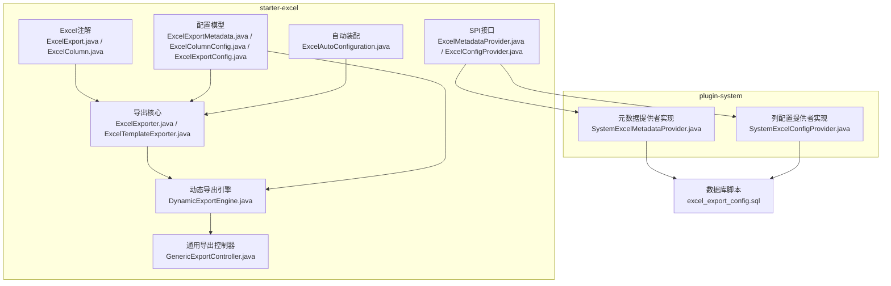
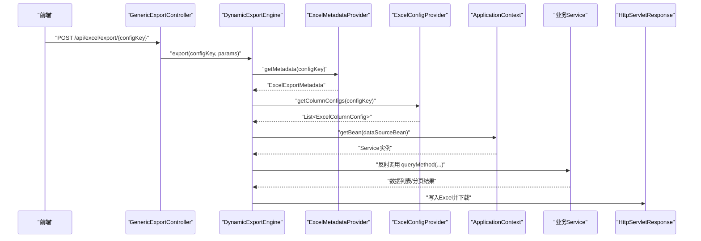
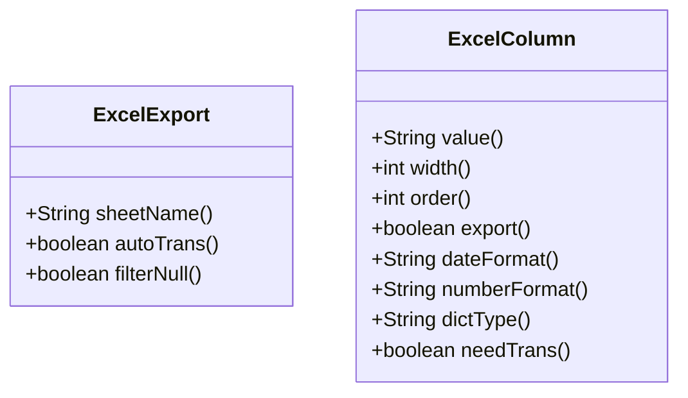
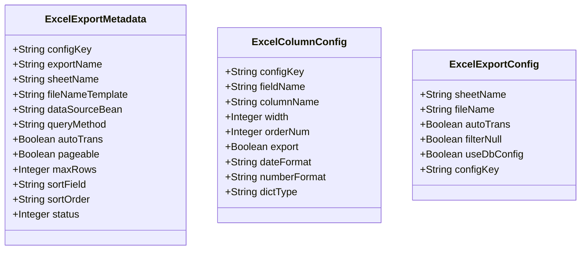
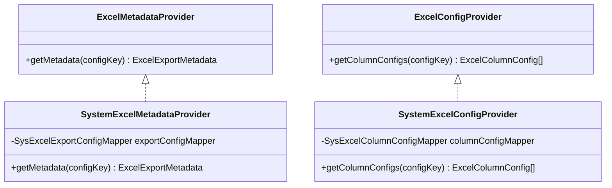
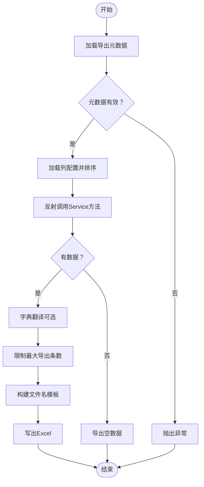
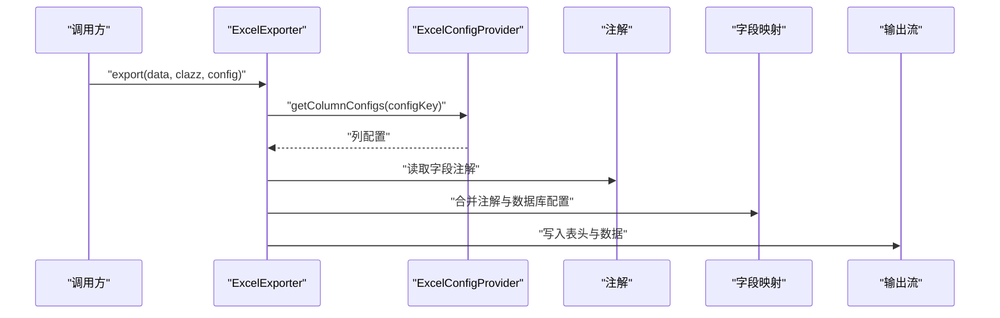
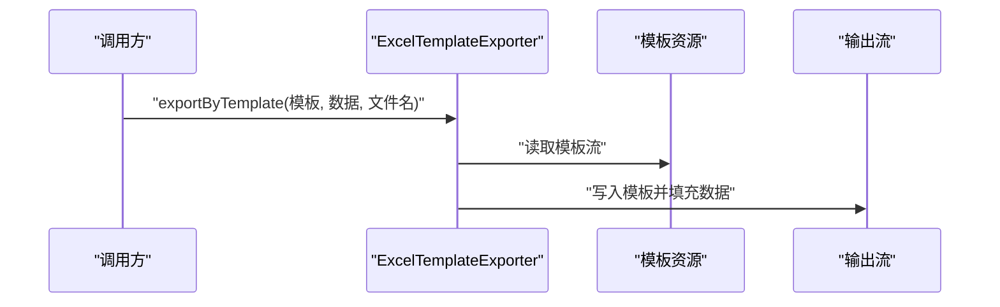
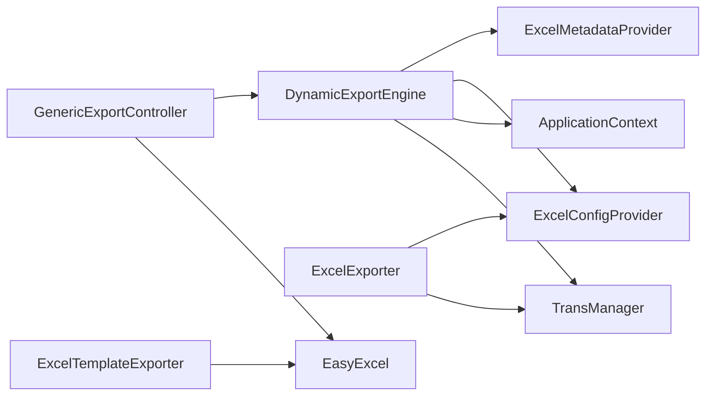

# Excel模板配置

<cite>
**本文引用的文件**
- [ExcelExport.java](file://forge/forge-framework/forge-starter-parent/forge-starter-excel/src/main/java/com/mdframe/forge/starter/excel/annotation/ExcelExport.java)
- [ExcelColumn.java](file://forge/forge-framework/forge-starter-parent/forge-starter-excel/src/main/java/com/mdframe/forge/starter/excel/annotation/ExcelColumn.java)
- [ExcelExporter.java](file://forge/forge-framework/forge-starter-parent/forge-starter-excel/src/main/java/com/mdframe/forge/starter/excel/core/ExcelExporter.java)
- [ExcelTemplateExporter.java](file://forge/forge-framework/forge-starter-parent/forge-starter-excel/src/main/java/com/mdframe/forge/starter/excel/core/ExcelTemplateExporter.java)
- [ExcelAutoConfiguration.java](file://forge/forge-framework/forge-starter-parent/forge-starter-excel/src/main/java/com/mdframe/forge/starter/excel/config/ExcelAutoConfiguration.java)
- [ExcelMetadataProvider.java](file://forge/forge-framework/forge-starter-parent/forge-starter-excel/src/main/java/com/mdframe/forge/starter/excel/spi/ExcelMetadataProvider.java)
- [ExcelConfigProvider.java](file://forge/forge-framework/forge-starter-parent/forge-starter-excel/src/main/java/com/mdframe/forge/starter/excel/spi/ExcelConfigProvider.java)
- [DynamicExportEngine.java](file://forge/forge-framework/forge-starter-parent/forge-starter-excel/src/main/java/com/mdframe/forge/starter/excel/core/DynamicExportEngine.java)
- [GenericExportController.java](file://forge/forge-framework/forge-starter-parent/forge-starter-excel/src/main/java/com/mdframe/forge/starter/excel/controller/GenericExportController.java)
- [ExcelExportMetadata.java](file://forge/forge-framework/forge-starter-parent/forge-starter-excel/src/main/java/com/mdframe/forge/starter/excel/model/ExcelExportMetadata.java)
- [ExcelColumnConfig.java](file://forge/forge-framework/forge-starter-parent/forge-starter-excel/src/main/java/com/mdframe/forge/starter/excel/model/ExcelColumnConfig.java)
- [ExcelExportConfig.java](file://forge/forge-framework/forge-starter-parent/forge-starter-excel/src/main/java/com/mdframe/forge/starter/excel/model/ExcelExportConfig.java)
- [SystemExcelMetadataProvider.java](file://forge/forge-framework/forge-plugin-parent/forge-plugin-system/src/main/java/com/mdframe/forge/plugin/system/service/impl/SystemExcelMetadataProvider.java)
- [SystemExcelConfigProvider.java](file://forge/forge-framework/forge-plugin-parent/forge-plugin-system/src/main/java/com/mdframe/forge/plugin/system/service/impl/SystemExcelConfigProvider.java)
- [excel_export_config.sql](file://forge/forge-framework/forge-starter-parent/forge-starter-excel/sql/excel_export_config.sql)
- [README.md](file://forge/forge-framework/forge-starter-parent/forge-starter-excel/README.md)
- [excel-export-config.vue](file://forge-admin-ui/src/views/system/excel-export-config.vue)
</cite>

## 目录
1. [简介](#简介)
2. [项目结构](#项目结构)
3. [核心组件](#核心组件)
4. [架构总览](#架构总览)
5. [详细组件分析](#详细组件分析)
6. [依赖关系分析](#依赖关系分析)
7. [性能考虑](#性能考虑)
8. [故障排查指南](#故障排查指南)
9. [结论](#结论)
10. [附录](#附录)

## 简介
本技术文档围绕Excel模板配置功能，系统讲解以下内容：
- ExcelExport注解的使用方法与作用域
- Excel导出配置模型的设计与字段语义
- 模板提供者SPI接口的实现方式与职责边界
- 如何配置Excel导出模板、字段映射规则、样式设置、数据验证等核心功能
- 提供完整的配置示例、注解参数说明、模板设计最佳实践，帮助开发者快速掌握Excel模板的创建与管理

## 项目结构
Excel模板配置功能主要分布在两个模块：
- starter-excel：核心导出能力、注解、SPI接口、自动装配与通用导出控制器
- plugin-system：系统模块对SPI接口的具体实现，负责从数据库读取导出配置

图表来源
- [ExcelExporter.java](file://forge/forge-framework/forge-starter-parent/forge-starter-excel/src/main/java/com/mdframe/forge/starter/excel/core/ExcelExporter.java#L1-L230)
- [ExcelTemplateExporter.java](file://forge/forge-framework/forge-starter-parent/forge-starter-excel/src/main/java/com/mdframe/forge/starter/excel/core/ExcelTemplateExporter.java#L1-L91)
- [DynamicExportEngine.java](file://forge/forge-framework/forge-starter-parent/forge-starter-excel/src/main/java/com/mdframe/forge/starter/excel/core/DynamicExportEngine.java#L1-L509)
- [GenericExportController.java](file://forge/forge-framework/forge-starter-parent/forge-starter-excel/src/main/java/com/mdframe/forge/starter/excel/controller/GenericExportController.java#L1-L51)
- [ExcelMetadataProvider.java](file://forge/forge-framework/forge-starter-parent/forge-starter-excel/src/main/java/com/mdframe/forge/starter/excel/spi/ExcelMetadataProvider.java#L1-L18)
- [ExcelConfigProvider.java](file://forge/forge-framework/forge-starter-parent/forge-starter-excel/src/main/java/com/mdframe/forge/starter/excel/spi/ExcelConfigProvider.java#L1-L20)
- [ExcelExportMetadata.java](file://forge/forge-framework/forge-starter-parent/forge-starter-excel/src/main/java/com/mdframe/forge/starter/excel/model/ExcelExportMetadata.java#L1-L71)
- [ExcelColumnConfig.java](file://forge/forge-framework/forge-starter-parent/forge-starter-excel/src/main/java/com/mdframe/forge/starter/excel/model/ExcelColumnConfig.java#L1-L56)
- [ExcelExportConfig.java](file://forge/forge-framework/forge-starter-parent/forge-starter-excel/src/main/java/com/mdframe/forge/starter/excel/model/ExcelExportConfig.java#L1-L45)
- [ExcelAutoConfiguration.java](file://forge/forge-framework/forge-starter-parent/forge-starter-excel/src/main/java/com/mdframe/forge/starter/excel/config/ExcelAutoConfiguration.java#L1-L20)
- [SystemExcelMetadataProvider.java](file://forge/forge-framework/forge-plugin-parent/forge-plugin-system/src/main/java/com/mdframe/forge/plugin/system/service/impl/SystemExcelMetadataProvider.java#L1-L41)
- [SystemExcelConfigProvider.java](file://forge/forge-framework/forge-plugin-parent/forge-plugin-system/src/main/java/com/mdframe/forge/plugin/system/service/impl/SystemExcelConfigProvider.java#L1-L48)
- [excel_export_config.sql](file://forge/forge-framework/forge-starter-parent/forge-starter-excel/sql/excel_export_config.sql#L1-L22)

章节来源
- [ExcelExporter.java](file://forge/forge-framework/forge-starter-parent/forge-starter-excel/src/main/java/com/mdframe/forge/starter/excel/core/ExcelExporter.java#L1-L230)
- [DynamicExportEngine.java](file://forge/forge-framework/forge-starter-parent/forge-starter-excel/src/main/java/com/mdframe/forge/starter/excel/core/DynamicExportEngine.java#L1-L509)
- [GenericExportController.java](file://forge/forge-framework/forge-starter-parent/forge-starter-excel/src/main/java/com/mdframe/forge/starter/excel/controller/GenericExportController.java#L1-L51)
- [ExcelAutoConfiguration.java](file://forge/forge-framework/forge-starter-parent/forge-starter-excel/src/main/java/com/mdframe/forge/starter/excel/config/ExcelAutoConfiguration.java#L1-L20)

## 核心组件
- 注解层
  - ExcelExport：用于类级别，声明Sheet名称、是否自动翻译字典、是否过滤null等导出属性
  - ExcelColumn：用于字段级别，声明列名、列宽、排序、是否导出、日期/数字格式化、字典类型等
- 导出引擎
  - ExcelExporter：面向注解的导出器，支持注解+数据库配置合并、字典翻译、动态表头与数据映射
  - ExcelTemplateExporter：基于模板的导出器，支持单对象/列表模板填充
- 动态导出引擎
  - DynamicExportEngine：通过数据库配置驱动，反射调用业务Service方法，动态生成Excel
- 控制器
  - GenericExportController：提供通用导出接口，支持GET/POST两种方式
- SPI接口
  - ExcelMetadataProvider：根据配置键获取导出元数据
  - ExcelConfigProvider：根据配置键获取列配置列表
- 配置模型
  - ExcelExportMetadata：导出元数据（来自数据库）
  - ExcelColumnConfig：列配置（来自数据库）
  - ExcelExportConfig：运行时导出配置（用于注解模式）

章节来源
- [ExcelExport.java](file://forge/forge-framework/forge-starter-parent/forge-starter-excel/src/main/java/com/mdframe/forge/starter/excel/annotation/ExcelExport.java#L1-L28)
- [ExcelColumn.java](file://forge/forge-framework/forge-starter-parent/forge-starter-excel/src/main/java/com/mdframe/forge/starter/excel/annotation/ExcelColumn.java#L1-L54)
- [ExcelExporter.java](file://forge/forge-framework/forge-starter-parent/forge-starter-excel/src/main/java/com/mdframe/forge/starter/excel/core/ExcelExporter.java#L1-L230)
- [ExcelTemplateExporter.java](file://forge/forge-framework/forge-starter-parent/forge-starter-excel/src/main/java/com/mdframe/forge/starter/excel/core/ExcelTemplateExporter.java#L1-L91)
- [DynamicExportEngine.java](file://forge/forge-framework/forge-starter-parent/forge-starter-excel/src/main/java/com/mdframe/forge/starter/excel/core/DynamicExportEngine.java#L1-L509)
- [GenericExportController.java](file://forge/forge-framework/forge-starter-parent/forge-starter-excel/src/main/java/com/mdframe/forge/starter/excel/controller/GenericExportController.java#L1-L51)
- [ExcelMetadataProvider.java](file://forge/forge-framework/forge-starter-parent/forge-starter-excel/src/main/java/com/mdframe/forge/starter/excel/spi/ExcelMetadataProvider.java#L1-L18)
- [ExcelConfigProvider.java](file://forge/forge-framework/forge-starter-parent/forge-starter-excel/src/main/java/com/mdframe/forge/starter/excel/spi/ExcelConfigProvider.java#L1-L20)
- [ExcelExportMetadata.java](file://forge/forge-framework/forge-starter-parent/forge-starter-excel/src/main/java/com/mdframe/forge/starter/excel/model/ExcelExportMetadata.java#L1-L71)
- [ExcelColumnConfig.java](file://forge/forge-framework/forge-starter-parent/forge-starter-excel/src/main/java/com/mdframe/forge/starter/excel/model/ExcelColumnConfig.java#L1-L56)
- [ExcelExportConfig.java](file://forge/forge-framework/forge-starter-parent/forge-starter-excel/src/main/java/com/mdframe/forge/starter/excel/model/ExcelExportConfig.java#L1-L45)

## 架构总览
Excel模板配置采用“数据库驱动 + SPI扩展 + 通用接口”的架构，支持零代码导出与模板填充两种模式。

图表来源
- [GenericExportController.java](file://forge/forge-framework/forge-starter-parent/forge-starter-excel/src/main/java/com/mdframe/forge/starter/excel/controller/GenericExportController.java#L1-L51)
- [DynamicExportEngine.java](file://forge/forge-framework/forge-starter-parent/forge-starter-excel/src/main/java/com/mdframe/forge/starter/excel/core/DynamicExportEngine.java#L1-L509)
- [ExcelMetadataProvider.java](file://forge/forge-framework/forge-starter-parent/forge-starter-excel/src/main/java/com/mdframe/forge/starter/excel/spi/ExcelMetadataProvider.java#L1-L18)
- [ExcelConfigProvider.java](file://forge/forge-framework/forge-starter-parent/forge-starter-excel/src/main/java/com/mdframe/forge/starter/excel/spi/ExcelConfigProvider.java#L1-L20)

## 详细组件分析

### Excel注解体系
- ExcelExport（类级）
  - 参数：sheetName、autoTrans、filterNull
  - 用途：为实体类提供导出层面的默认行为
- ExcelColumn（字段级）
  - 参数：value（列名）、width（列宽）、order（排序）、export（是否导出）、dateFormat、numberFormat、dictType、needTrans
  - 用途：精细化控制每个字段的导出表现

图表来源
- [ExcelExport.java](file://forge/forge-framework/forge-starter-parent/forge-starter-excel/src/main/java/com/mdframe/forge/starter/excel/annotation/ExcelExport.java#L1-L28)
- [ExcelColumn.java](file://forge/forge-framework/forge-starter-parent/forge-starter-excel/src/main/java/com/mdframe/forge/starter/excel/annotation/ExcelColumn.java#L1-L54)

章节来源
- [ExcelExport.java](file://forge/forge-framework/forge-starter-parent/forge-starter-excel/src/main/java/com/mdframe/forge/starter/excel/annotation/ExcelExport.java#L1-L28)
- [ExcelColumn.java](file://forge/forge-framework/forge-starter-parent/forge-starter-excel/src/main/java/com/mdframe/forge/starter/excel/annotation/ExcelColumn.java#L1-L54)

### Excel导出配置模型
- ExcelExportMetadata：数据库导出元数据，包含配置键、导出名称、Sheet名称、文件名模板、数据源Bean、查询方法、自动翻译、分页、最大行数、排序、状态等
- ExcelColumnConfig：数据库列配置，包含字段名、列名、宽度、排序、是否导出、日期/数字格式、字典类型
- ExcelExportConfig：运行时导出配置，包含Sheet名称、文件名、自动翻译、过滤null、是否使用数据库配置、配置键

图表来源
- [ExcelExportMetadata.java](file://forge/forge-framework/forge-starter-parent/forge-starter-excel/src/main/java/com/mdframe/forge/starter/excel/model/ExcelExportMetadata.java#L1-L71)
- [ExcelColumnConfig.java](file://forge/forge-framework/forge-starter-parent/forge-starter-excel/src/main/java/com/mdframe/forge/starter/excel/model/ExcelColumnConfig.java#L1-L56)
- [ExcelExportConfig.java](file://forge/forge-framework/forge-starter-parent/forge-starter-excel/src/main/java/com/mdframe/forge/starter/excel/model/ExcelExportConfig.java#L1-L45)

章节来源
- [ExcelExportMetadata.java](file://forge/forge-framework/forge-starter-parent/forge-starter-excel/src/main/java/com/mdframe/forge/starter/excel/model/ExcelExportMetadata.java#L1-L71)
- [ExcelColumnConfig.java](file://forge/forge-framework/forge-starter-parent/forge-starter-excel/src/main/java/com/mdframe/forge/starter/excel/model/ExcelColumnConfig.java#L1-L56)
- [ExcelExportConfig.java](file://forge/forge-framework/forge-starter-parent/forge-starter-excel/src/main/java/com/mdframe/forge/starter/excel/model/ExcelExportConfig.java#L1-L45)

### 模板提供者SPI接口
- ExcelMetadataProvider：根据配置键获取导出元数据
- ExcelConfigProvider：根据配置键获取列配置列表
- plugin-system模块提供具体实现，从数据库表读取并转换为配置模型

图表来源
- [ExcelMetadataProvider.java](file://forge/forge-framework/forge-starter-parent/forge-starter-excel/src/main/java/com/mdframe/forge/starter/excel/spi/ExcelMetadataProvider.java#L1-L18)
- [ExcelConfigProvider.java](file://forge/forge-framework/forge-starter-parent/forge-starter-excel/src/main/java/com/mdframe/forge/starter/excel/spi/ExcelConfigProvider.java#L1-L20)
- [SystemExcelMetadataProvider.java](file://forge/forge-framework/forge-plugin-parent/forge-plugin-system/src/main/java/com/mdframe/forge/plugin/system/service/impl/SystemExcelMetadataProvider.java#L1-L41)
- [SystemExcelConfigProvider.java](file://forge/forge-framework/forge-plugin-parent/forge-plugin-system/src/main/java/com/mdframe/forge/plugin/system/service/impl/SystemExcelConfigProvider.java#L1-L48)

章节来源
- [ExcelMetadataProvider.java](file://forge/forge-framework/forge-starter-parent/forge-starter-excel/src/main/java/com/mdframe/forge/starter/excel/spi/ExcelMetadataProvider.java#L1-L18)
- [ExcelConfigProvider.java](file://forge/forge-framework/forge-starter-parent/forge-starter-excel/src/main/java/com/mdframe/forge/starter/excel/spi/ExcelConfigProvider.java#L1-L20)
- [SystemExcelMetadataProvider.java](file://forge/forge-framework/forge-plugin-parent/forge-plugin-system/src/main/java/com/mdframe/forge/plugin/system/service/impl/SystemExcelMetadataProvider.java#L1-L41)
- [SystemExcelConfigProvider.java](file://forge/forge-framework/forge-plugin-parent/forge-plugin-system/src/main/java/com/mdframe/forge/plugin/system/service/impl/SystemExcelConfigProvider.java#L1-L48)

### 动态导出引擎（数据库驱动）
- 核心流程：加载元数据→加载列配置→反射调用Service→字典翻译→限制导出条数→写出Excel
- 参数构建：支持无参、Map参数、单个实体、多参数（按参数名匹配），并进行类型转换
- 文件名构建：支持{date}、{time}占位符

图表来源
- [DynamicExportEngine.java](file://forge/forge-framework/forge-starter-parent/forge-starter-excel/src/main/java/com/mdframe/forge/starter/excel/core/DynamicExportEngine.java#L1-L509)

章节来源
- [DynamicExportEngine.java](file://forge/forge-framework/forge-starter-parent/forge-starter-excel/src/main/java/com/mdframe/forge/starter/excel/core/DynamicExportEngine.java#L1-L509)

### 注解模式导出器（ExcelExporter）
- 合并策略：优先使用数据库配置，其次使用注解配置，否则回退默认值
- 字段映射：通过反射读取字段值，构建动态表头与数据
- 字典翻译：可选集成TransManager进行翻译

图表来源
- [ExcelExporter.java](file://forge/forge-framework/forge-starter-parent/forge-starter-excel/src/main/java/com/mdframe/forge/starter/excel/core/ExcelExporter.java#L1-L230)
- [ExcelConfigProvider.java](file://forge/forge-framework/forge-starter-parent/forge-starter-excel/src/main/java/com/mdframe/forge/starter/excel/spi/ExcelConfigProvider.java#L1-L20)
- [ExcelColumn.java](file://forge/forge-framework/forge-starter-parent/forge-starter-excel/src/main/java/com/mdframe/forge/starter/excel/annotation/ExcelColumn.java#L1-L54)

章节来源
- [ExcelExporter.java](file://forge/forge-framework/forge-starter-parent/forge-starter-excel/src/main/java/com/mdframe/forge/starter/excel/core/ExcelExporter.java#L1-L230)

### 模板导出器（ExcelTemplateExporter）
- 支持单对象模板填充与列表模板填充
- 支持复杂场景：先填充单对象，再填充列表
- 使用FillConfig.forceNewRow保证列表每条记录换行

图表来源
- [ExcelTemplateExporter.java](file://forge/forge-framework/forge-starter-parent/forge-starter-excel/src/main/java/com/mdframe/forge/starter/excel/core/ExcelTemplateExporter.java#L1-L91)

章节来源
- [ExcelTemplateExporter.java](file://forge/forge-framework/forge-starter-parent/forge-starter-excel/src/main/java/com/mdframe/forge/starter/excel/core/ExcelTemplateExporter.java#L1-L91)

### 通用导出控制器（GenericExportController）
- 提供统一导出接口：/api/excel/export/{configKey}
- 支持POST（复杂参数）与GET（简单参数）
- 受条件属性控制：forge.excel.enable-generic-export

章节来源
- [GenericExportController.java](file://forge/forge-framework/forge-starter-parent/forge-starter-excel/src/main/java/com/mdframe/forge/starter/excel/controller/GenericExportController.java#L1-L51)

### 自动装配（ExcelAutoConfiguration）
- 在容器中注册ExcelExporter Bean，当不存在时生效

章节来源
- [ExcelAutoConfiguration.java](file://forge/forge-framework/forge-starter-parent/forge-starter-excel/src/main/java/com/mdframe/forge/starter/excel/config/ExcelAutoConfiguration.java#L1-L20)

## 依赖关系分析
- 组件耦合
  - DynamicExportEngine依赖ApplicationContext进行Bean查找，依赖SPI接口读取配置，依赖TransManager进行字典翻译
  - ExcelExporter依赖ExcelConfigProvider与TransManager，用于注解模式导出
  - GenericExportController依赖DynamicExportEngine
- 外部依赖
  - EasyExcel用于Excel读写
  - Spring MVC用于Web层
  - MyBatis-Plus用于plugin-system的数据库访问

图表来源
- [GenericExportController.java](file://forge/forge-framework/forge-starter-parent/forge-starter-excel/src/main/java/com/mdframe/forge/starter/excel/controller/GenericExportController.java#L1-L51)
- [DynamicExportEngine.java](file://forge/forge-framework/forge-starter-parent/forge-starter-excel/src/main/java/com/mdframe/forge/starter/excel/core/DynamicExportEngine.java#L1-L509)
- [ExcelExporter.java](file://forge/forge-framework/forge-starter-parent/forge-starter-excel/src/main/java/com/mdframe/forge/starter/excel/core/ExcelExporter.java#L1-L230)
- [ExcelTemplateExporter.java](file://forge/forge-framework/forge-starter-parent/forge-starter-excel/src/main/java/com/mdframe/forge/starter/excel/core/ExcelTemplateExporter.java#L1-L91)

章节来源
- [GenericExportController.java](file://forge/forge-framework/forge-starter-parent/forge-starter-excel/src/main/java/com/mdframe/forge/starter/excel/controller/GenericExportController.java#L1-L51)
- [DynamicExportEngine.java](file://forge/forge-framework/forge-starter-parent/forge-starter-excel/src/main/java/com/mdframe/forge/starter/excel/core/DynamicExportEngine.java#L1-L509)
- [ExcelExporter.java](file://forge/forge-framework/forge-starter-parent/forge-starter-excel/src/main/java/com/mdframe/forge/starter/excel/core/ExcelExporter.java#L1-L230)
- [ExcelTemplateExporter.java](file://forge/forge-framework/forge-starter-parent/forge-starter-excel/src/main/java/com/mdframe/forge/starter/excel/core/ExcelTemplateExporter.java#L1-L91)

## 性能考虑
- 最大导出条数限制：通过ExcelExportMetadata.maxRows限制，避免超大数据量导出
- 分页查询：通过ExcelExportMetadata.pageable启用分页，减少内存占用
- 字典翻译：仅在开启autoTrans且TransManager可用时进行，避免不必要的开销
- 模板导出：模板复用与流式写入，降低内存峰值
- 反射调用：在DynamicExportEngine中按需反射，避免重复扫描

## 故障排查指南
- 未配置ExcelMetadataProvider或ExcelConfigProvider
  - 现象：导出时报“未配置Provider”
  - 处理：在业务模块实现SPI接口并注册为Spring Bean
- 未找到查询方法
  - 现象：导出时报“未找到查询方法”
  - 处理：确认ExcelExportMetadata.queryMethod与Service方法名一致
- 参数类型不匹配
  - 现象：反射调用失败或类型转换异常
  - 处理：检查参数类型与传入值，确保可转换
- 导出数据为空
  - 现象：导出空数据或提示数据为空
  - 处理：检查查询条件与Service实现
- 通用导出接口未启用
  - 现象：访问 /api/excel/export/* 返回404或被拒绝
  - 处理：确认配置项forge.excel.enable-generic-export为true

章节来源
- [DynamicExportEngine.java](file://forge/forge-framework/forge-starter-parent/forge-starter-excel/src/main/java/com/mdframe/forge/starter/excel/core/DynamicExportEngine.java#L1-L509)
- [GenericExportController.java](file://forge/forge-framework/forge-starter-parent/forge-starter-excel/src/main/java/com/mdframe/forge/starter/excel/controller/GenericExportController.java#L1-L51)

## 结论
Excel模板配置功能通过数据库驱动与SPI扩展，实现了“零代码导出”与“模板填充”两大能力。开发者只需配置数据库与实现SPI接口，即可快速完成复杂的Excel导出需求。注解体系与配置模型提供了灵活的字段映射、格式化与样式控制能力；动态导出引擎则保障了参数解析、字典翻译与性能优化。

## 附录

### 数据库配置表
- sys_excel_export_config：导出元数据主表
- sys_excel_column_config：导出列配置明细表

章节来源
- [excel_export_config.sql](file://forge/forge-framework/forge-starter-parent/forge-starter-excel/sql/excel_export_config.sql#L1-L22)

### 前端配置界面
- excel-export-config.vue：提供导出配置的增删改查与复制功能，支持文件名模板占位符提示

章节来源
- [excel-export-config.vue](file://forge-admin-ui/src/views/system/excel-export-config.vue#L1-L553)

### 使用步骤与示例
- 无需编写代码：配置数据库→实现SPI→前端调用通用接口
- 完整示例：用户列表导出、订单导出，包含SQL配置与前端调用方式

章节来源
- [README.md](file://forge/forge-framework/forge-starter-parent/forge-starter-excel/README.md#L1-L268)