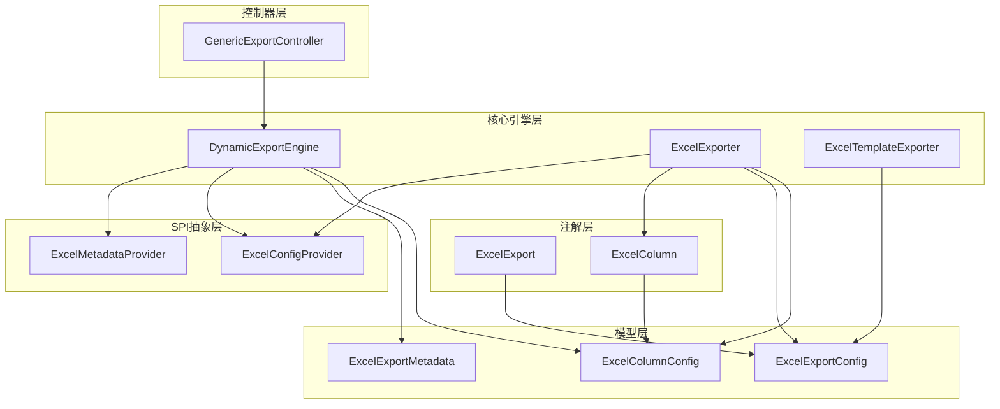
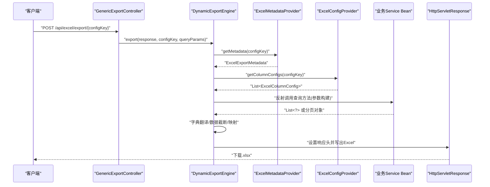
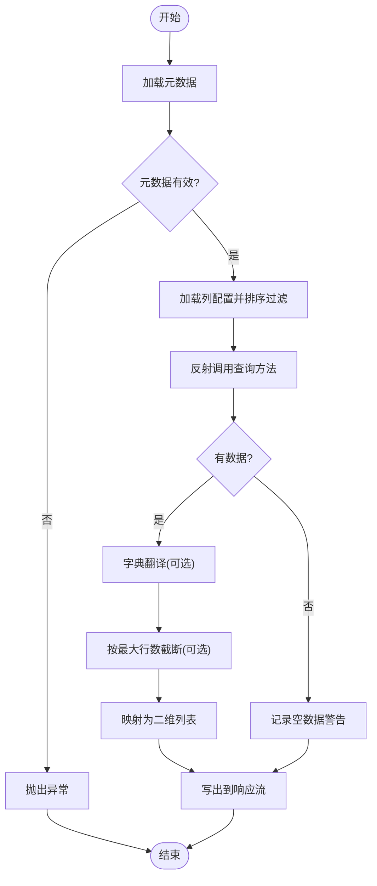
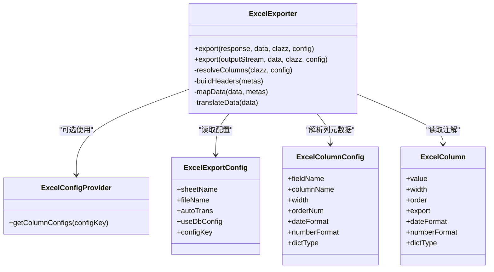
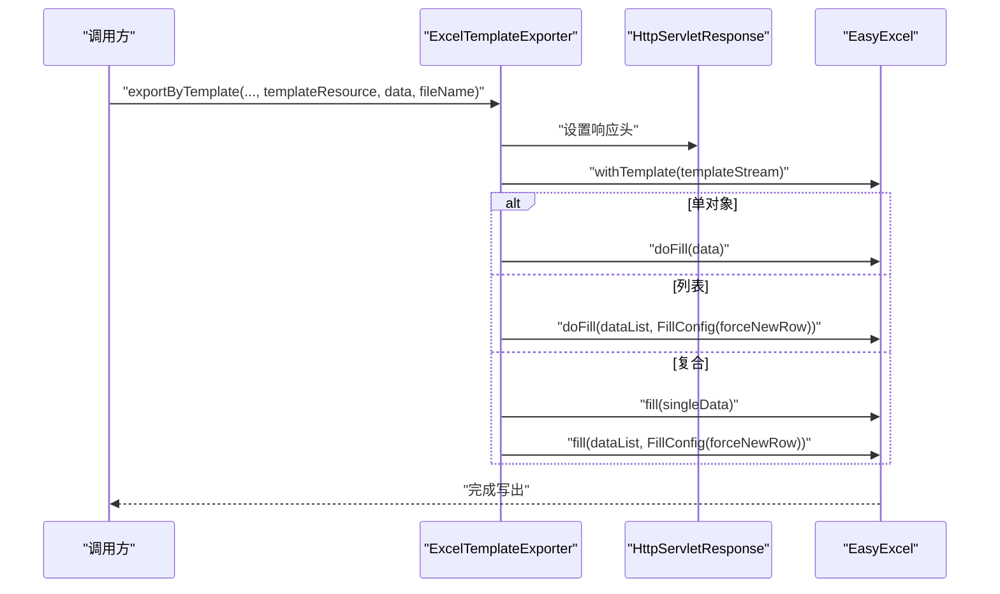
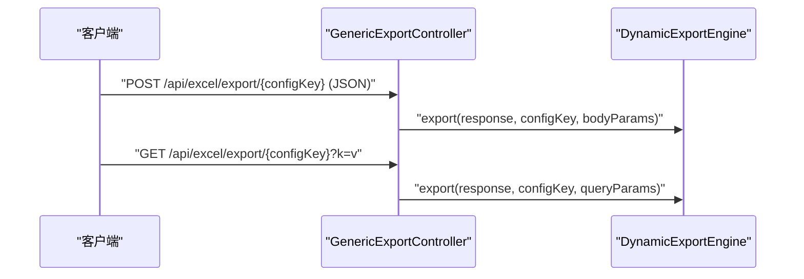
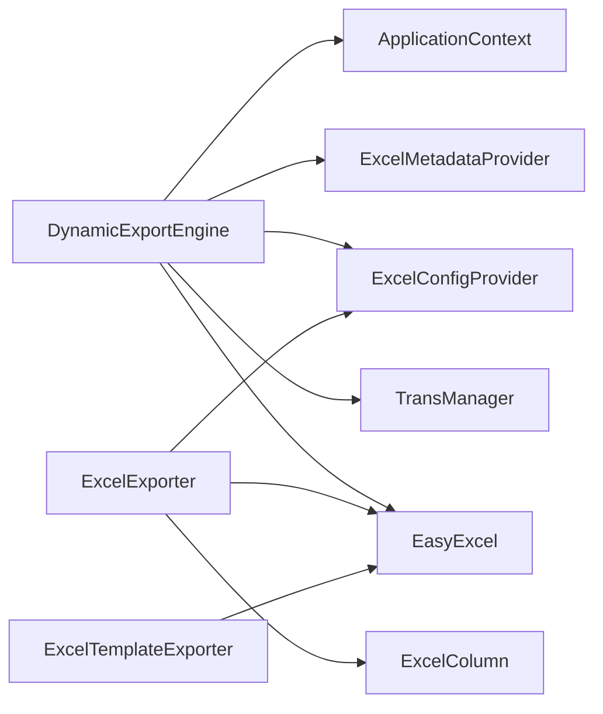

# 动态导出引擎

<cite>
**本文引用的文件**
- [DynamicExportEngine.java](file://forge/forge-framework/forge-starter-parent/forge-starter-excel/src/main/java/com/mdframe/forge/starter/excel/core/DynamicExportEngine.java)
- [ExcelExporter.java](file://forge/forge-framework/forge-starter-parent/forge-starter-excel/src/main/java/com/mdframe/forge/starter/excel/core/ExcelExporter.java)
- [ExcelTemplateExporter.java](file://forge/forge-framework/forge-starter-parent/forge-starter-excel/src/main/java/com/mdframe/forge/starter/excel/core/ExcelTemplateExporter.java)
- [GenericExportController.java](file://forge/forge-framework/forge-starter-parent/forge-starter-excel/src/main/java/com/mdframe/forge/starter/excel/controller/GenericExportController.java)
- [ExcelExportConfig.java](file://forge/forge-framework/forge-starter-parent/forge-starter-excel/src/main/java/com/mdframe/forge/starter/excel/model/ExcelExportConfig.java)
- [ExcelExportMetadata.java](file://forge/forge-framework/forge-starter-parent/forge-starter-excel/src/main/java/com/mdframe/forge/starter/excel/model/ExcelExportMetadata.java)
- [ExcelColumnConfig.java](file://forge/forge-framework/forge-starter-parent/forge-starter-excel/src/main/java/com/mdframe/forge/starter/excel/model/ExcelColumnConfig.java)
- [ExcelExport.java](file://forge/forge-framework/forge-starter-parent/forge-starter-excel/src/main/java/com/mdframe/forge/starter/excel/annotation/ExcelExport.java)
- [ExcelColumn.java](file://forge/forge-framework/forge-starter-parent/forge-starter-excel/src/main/java/com/mdframe/forge/starter/excel/annotation/ExcelColumn.java)
- [ExcelConfigProvider.java](file://forge/forge-framework/forge-starter-parent/forge-starter-excel/src/main/java/com/mdframe/forge/starter/excel/spi/ExcelConfigProvider.java)
- [ExcelMetadataProvider.java](file://forge/forge-framework/forge-starter-parent/forge-starter-excel/src/main/java/com/mdframe/forge/starter/excel/spi/ExcelMetadataProvider.java)
</cite>

## 目录
1. [简介](#简介)
2. [项目结构](#项目结构)
3. [核心组件](#核心组件)
4. [架构总览](#架构总览)
5. [组件详解](#组件详解)
6. [依赖关系分析](#依赖关系分析)
7. [性能考量](#性能考量)
8. [故障排除指南](#故障排除指南)
9. [结论](#结论)
10. [附录](#附录)

## 简介
本技术文档围绕动态导出引擎展开，系统性阐述以下内容：
- DynamicExportEngine 的核心架构与工作流程
- ExcelExporter 的静态导出实现与注解驱动配置
- ExcelTemplateExporter 的模板填充机制
- 通用导出控制器的工作原理、动态配置加载、模板渲染流程与数据转换过程
- 性能优化、内存管理、大文件处理与并发控制等关键技术点
- 完整使用示例与故障排除指南

## 项目结构
Excel 导出相关代码位于启动器模块中，采用“注解 + SPI + 控制器 + 核心引擎”的分层设计：
- 注解层：ExcelExport、ExcelColumn 定义导出元信息与字段配置
- 模型层：ExcelExportConfig、ExcelExportMetadata、ExcelColumnConfig 描述导出配置与元数据
- SPI 层：ExcelConfigProvider、ExcelMetadataProvider 抽象配置来源
- 核心引擎层：DynamicExportEngine（动态导出）、ExcelExporter（静态导出）、ExcelTemplateExporter（模板导出）
- 控制器层：GenericExportController 对外暴露通用导出接口

图表来源
- [GenericExportController.java](file://forge/forge-framework/forge-starter-parent/forge-starter-excel/src/main/java/com/mdframe/forge/starter/excel/controller/GenericExportController.java#L1-L51)
- [DynamicExportEngine.java](file://forge/forge-framework/forge-starter-parent/forge-starter-excel/src/main/java/com/mdframe/forge/starter/excel/core/DynamicExportEngine.java#L1-L509)
- [ExcelExporter.java](file://forge/forge-framework/forge-starter-parent/forge-starter-excel/src/main/java/com/mdframe/forge/starter/excel/core/ExcelExporter.java#L1-L230)
- [ExcelTemplateExporter.java](file://forge/forge-framework/forge-starter-parent/forge-starter-excel/src/main/java/com/mdframe/forge/starter/excel/core/ExcelTemplateExporter.java#L1-L103)
- [ExcelConfigProvider.java](file://forge/forge-framework/forge-starter-parent/forge-starter-excel/src/main/java/com/mdframe/forge/starter/excel/spi/ExcelConfigProvider.java#L1-L21)
- [ExcelMetadataProvider.java](file://forge/forge-framework/forge-starter-parent/forge-starter-excel/src/main/java/com/mdframe/forge/starter/excel/spi/ExcelMetadataProvider.java#L1-L19)
- [ExcelExportConfig.java](file://forge/forge-framework/forge-starter-parent/forge-starter-excel/src/main/java/com/mdframe/forge/starter/excel/model/ExcelExportConfig.java#L1-L46)
- [ExcelExportMetadata.java](file://forge/forge-framework/forge-starter-parent/forge-starter-excel/src/main/java/com/mdframe/forge/starter/excel/model/ExcelExportMetadata.java#L1-L72)
- [ExcelColumnConfig.java](file://forge/forge-framework/forge-starter-parent/forge-starter-excel/src/main/java/com/mdframe/forge/starter/excel/model/ExcelColumnConfig.java#L1-L56)
- [ExcelExport.java](file://forge/forge-framework/forge-starter-parent/forge-starter-excel/src/main/java/com/mdframe/forge/starter/excel/annotation/ExcelExport.java#L1-L29)
- [ExcelColumn.java](file://forge/forge-framework/forge-starter-parent/forge-starter-excel/src/main/java/com/mdframe/forge/starter/excel/annotation/ExcelColumn.java#L1-L54)

章节来源
- [GenericExportController.java](file://forge/forge-framework/forge-starter-parent/forge-starter-excel/src/main/java/com/mdframe/forge/starter/excel/controller/GenericExportController.java#L1-L51)
- [DynamicExportEngine.java](file://forge/forge-framework/forge-starter-parent/forge-starter-excel/src/main/java/com/mdframe/forge/starter/excel/core/DynamicExportEngine.java#L1-L509)
- [ExcelExporter.java](file://forge/forge-framework/forge-starter-parent/forge-starter-excel/src/main/java/com/mdframe/forge/starter/excel/core/ExcelExporter.java#L1-L230)
- [ExcelTemplateExporter.java](file://forge/forge-framework/forge-starter-parent/forge-starter-excel/src/main/java/com/mdframe/forge/starter/excel/core/ExcelTemplateExporter.java#L1-L103)
- [ExcelConfigProvider.java](file://forge/forge-framework/forge-starter-parent/forge-starter-excel/src/main/java/com/mdframe/forge/starter/excel/spi/ExcelConfigProvider.java#L1-L21)
- [ExcelMetadataProvider.java](file://forge/forge-framework/forge-starter-parent/forge-starter-excel/src/main/java/com/mdframe/forge/starter/excel/spi/ExcelMetadataProvider.java#L1-L19)
- [ExcelExportConfig.java](file://forge/forge-framework/forge-starter-parent/forge-starter-excel/src/main/java/com/mdframe/forge/starter/excel/model/ExcelExportConfig.java#L1-L46)
- [ExcelExportMetadata.java](file://forge/forge-framework/forge-starter-parent/forge-starter-excel/src/main/java/com/mdframe/forge/starter/excel/model/ExcelExportMetadata.java#L1-L72)
- [ExcelColumnConfig.java](file://forge/forge-framework/forge-starter-parent/forge-starter-excel/src/main/java/com/mdframe/forge/starter/excel/model/ExcelColumnConfig.java#L1-L56)
- [ExcelExport.java](file://forge/forge-framework/forge-starter-parent/forge-starter-excel/src/main/java/com/mdframe/forge/starter/excel/annotation/ExcelExport.java#L1-L29)
- [ExcelColumn.java](file://forge/forge-framework/forge-starter-parent/forge-starter-excel/src/main/java/com/mdframe/forge/starter/excel/annotation/ExcelColumn.java#L1-L54)

## 核心组件
- DynamicExportEngine：基于数据库配置驱动的动态导出引擎，通过反射调用服务方法、动态参数构建、字典翻译、数据截断与EasyExcel写出，实现“零代码”导出。
- ExcelExporter：面向注解的静态导出器，支持注解与数据库配置双通道解析列元数据，统一写出到响应流。
- ExcelTemplateExporter：模板导出器，支持单对象、列表与复合场景的模板填充，并设置标准HTTP响应头。
- GenericExportController：通用导出REST接口，暴露POST/GET两种方式，参数通过configKey与查询参数集驱动引擎执行。

章节来源
- [DynamicExportEngine.java](file://forge/forge-framework/forge-starter-parent/forge-starter-excel/src/main/java/com/mdframe/forge/starter/excel/core/DynamicExportEngine.java#L27-L93)
- [ExcelExporter.java](file://forge/forge-framework/forge-starter-parent/forge-starter-excel/src/main/java/com/mdframe/forge/starter/excel/core/ExcelExporter.java#L25-L94)
- [ExcelTemplateExporter.java](file://forge/forge-framework/forge-starter-parent/forge-starter-excel/src/main/java/com/mdframe/forge/starter/excel/core/ExcelTemplateExporter.java#L19-L91)
- [GenericExportController.java](file://forge/forge-framework/forge-starter-parent/forge-starter-excel/src/main/java/com/mdframe/forge/starter/excel/controller/GenericExportController.java#L12-L49)

## 架构总览
动态导出引擎以“配置即代码”的理念运行：前端或调用方仅需提供配置键与查询参数，后端通过SPI从数据库加载元数据与列配置，再反射调用业务服务方法获取数据，完成字典翻译、数据截断与写出。

图表来源
- [GenericExportController.java](file://forge/forge-framework/forge-starter-parent/forge-starter-excel/src/main/java/com/mdframe/forge/starter/excel/controller/GenericExportController.java#L25-L38)
- [DynamicExportEngine.java](file://forge/forge-framework/forge-starter-parent/forge-starter-excel/src/main/java/com/mdframe/forge/starter/excel/core/DynamicExportEngine.java#L54-L93)
- [ExcelMetadataProvider.java](file://forge/forge-framework/forge-starter-parent/forge-starter-excel/src/main/java/com/mdframe/forge/starter/excel/spi/ExcelMetadataProvider.java#L11-L17)
- [ExcelConfigProvider.java](file://forge/forge-framework/forge-starter-parent/forge-starter-excel/src/main/java/com/mdframe/forge/starter/excel/spi/ExcelConfigProvider.java#L13-L19)

## 组件详解

### DynamicExportEngine（动态导出引擎）
- 职责
  - 加载导出元数据与列配置
  - 反射调用业务服务方法获取数据
  - 字典翻译、数据截断与写出
- 关键流程
  - 元数据加载：通过ExcelMetadataProvider获取ExcelExportMetadata
  - 列配置加载：通过ExcelConfigProvider获取ExcelColumnConfig列表并按orderNum排序与过滤
  - 数据查询：根据dataSourceBean与queryMethod反射定位方法，按参数形态构建参数数组
  - 数据处理：字典翻译（可选）、最大行数限制、数据映射
  - 写出：设置响应头、构建表头、写入EasyExcel
- 参数构建策略
  - 无参、单参（Map/基本类型/String/自定义对象）、多参数（按参数名匹配）三种形态
  - 多参数回退：当参数名不匹配时以null填充
- 数据映射
  - 优先通过getter方法读取字段值，失败则回退到直接字段访问
- 错误处理
  - 对各阶段异常进行日志记录与抛出，保证导出失败可追踪

图表来源
- [DynamicExportEngine.java](file://forge/forge-framework/forge-starter-parent/forge-starter-excel/src/main/java/com/mdframe/forge/starter/excel/core/DynamicExportEngine.java#L54-L93)
- [DynamicExportEngine.java](file://forge/forge-framework/forge-starter-parent/forge-starter-excel/src/main/java/com/mdframe/forge/starter/excel/core/DynamicExportEngine.java#L126-L151)
- [DynamicExportEngine.java](file://forge/forge-framework/forge-starter-parent/forge-starter-excel/src/main/java/com/mdframe/forge/starter/excel/core/DynamicExportEngine.java#L415-L438)

章节来源
- [DynamicExportEngine.java](file://forge/forge-framework/forge-starter-parent/forge-starter-excel/src/main/java/com/mdframe/forge/starter/excel/core/DynamicExportEngine.java#L47-L93)
- [DynamicExportEngine.java](file://forge/forge-framework/forge-starter-parent/forge-starter-excel/src/main/java/com/mdframe/forge/starter/excel/core/DynamicExportEngine.java#L98-L121)
- [DynamicExportEngine.java](file://forge/forge-framework/forge-starter-parent/forge-starter-excel/src/main/java/com/mdframe/forge/starter/excel/core/DynamicExportEngine.java#L126-L151)
- [DynamicExportEngine.java](file://forge/forge-framework/forge-starter-parent/forge-starter-excel/src/main/java/com/mdframe/forge/starter/excel/core/DynamicExportEngine.java#L174-L251)
- [DynamicExportEngine.java](file://forge/forge-framework/forge-starter-parent/forge-starter-excel/src/main/java/com/mdframe/forge/starter/excel/core/DynamicExportEngine.java#L415-L438)

### ExcelExporter（静态导出器）
- 职责
  - 面向注解的导出器，支持注解与数据库配置双通道解析列元数据
  - 将数据映射为Map并写出到响应流
- 列解析策略
  - 优先使用数据库配置（若启用useDbConfig且存在configKey）
  - 其次使用ExcelColumn注解
  - 无注解时默认字段名为列名，宽度20
- 写出流程
  - 设置响应头
  - 构建表头与映射后的数据
  - 使用EasyExcel写出到指定Sheet

图表来源
- [ExcelExporter.java](file://forge/forge-framework/forge-starter-parent/forge-starter-excel/src/main/java/com/mdframe/forge/starter/excel/core/ExcelExporter.java#L39-L94)
- [ExcelExporter.java](file://forge/forge-framework/forge-starter-parent/forge-starter-excel/src/main/java/com/mdframe/forge/starter/excel/core/ExcelExporter.java#L112-L164)
- [ExcelConfigProvider.java](file://forge/forge-framework/forge-starter-parent/forge-starter-excel/src/main/java/com/mdframe/forge/starter/excel/spi/ExcelConfigProvider.java#L13-L19)
- [ExcelExportConfig.java](file://forge/forge-framework/forge-starter-parent/forge-starter-excel/src/main/java/com/mdframe/forge/starter/excel/model/ExcelExportConfig.java#L11-L45)
- [ExcelColumnConfig.java](file://forge/forge-framework/forge-starter-parent/forge-starter-excel/src/main/java/com/mdframe/forge/starter/excel/model/ExcelColumnConfig.java#L9-L55)
- [ExcelColumn.java](file://forge/forge-framework/forge-starter-parent/forge-starter-excel/src/main/java/com/mdframe/forge/starter/excel/annotation/ExcelColumn.java#L12-L53)

章节来源
- [ExcelExporter.java](file://forge/forge-framework/forge-starter-parent/forge-starter-excel/src/main/java/com/mdframe/forge/starter/excel/core/ExcelExporter.java#L39-L94)
- [ExcelExporter.java](file://forge/forge-framework/forge-starter-parent/forge-starter-excel/src/main/java/com/mdframe/forge/starter/excel/core/ExcelExporter.java#L112-L164)
- [ExcelExporter.java](file://forge/forge-framework/forge-starter-parent/forge-starter-excel/src/main/java/com/mdframe/forge/starter/excel/core/ExcelExporter.java#L180-L197)

### ExcelTemplateExporter（模板导出器）
- 职责
  - 基于模板资源进行数据填充，支持单对象、列表与复合场景
- 填充策略
  - 单对象：直接填充
  - 列表：开启forceNewRow以逐条新增行
  - 复合：先填充单对象，再填充列表
- 响应头
  - 统一设置Content-Type与Content-Disposition，确保浏览器正确下载

图表来源
- [ExcelTemplateExporter.java](file://forge/forge-framework/forge-starter-parent/forge-starter-excel/src/main/java/com/mdframe/forge/starter/excel/core/ExcelTemplateExporter.java#L27-L91)

章节来源
- [ExcelTemplateExporter.java](file://forge/forge-framework/forge-starter-parent/forge-starter-excel/src/main/java/com/mdframe/forge/starter/excel/core/ExcelTemplateExporter.java#L27-L91)

### 通用导出控制器（GenericExportController）
- 职责
  - 对外暴露通用导出接口，支持POST与GET两种方式
  - 通过configKey与查询参数驱动DynamicExportEngine执行导出
- 访问控制
  - 通过条件注解控制开关，默认启用

图表来源
- [GenericExportController.java](file://forge/forge-framework/forge-starter-parent/forge-starter-excel/src/main/java/com/mdframe/forge/starter/excel/controller/GenericExportController.java#L25-L49)

章节来源
- [GenericExportController.java](file://forge/forge-framework/forge-starter-parent/forge-starter-excel/src/main/java/com/mdframe/forge/starter/excel/controller/GenericExportController.java#L12-L49)

## 依赖关系分析
- 组件耦合
  - DynamicExportEngine 依赖Spring上下文进行Bean查找，依赖ExcelMetadataProvider与ExcelConfigProvider进行配置加载，依赖TransManager进行字典翻译
  - ExcelExporter 依赖ExcelConfigProvider与注解进行列元数据解析
  - ExcelTemplateExporter 依赖EasyExcel模板能力
- 外部依赖
  - EasyExcel：写出与模板填充
  - Spring Web：HttpServletResponse与条件注解
  - Spring Core：ApplicationContext与Resource

图表来源
- [DynamicExportEngine.java](file://forge/forge-framework/forge-starter-parent/forge-starter-excel/src/main/java/com/mdframe/forge/starter/excel/core/DynamicExportEngine.java#L36-L45)
- [ExcelExporter.java](file://forge/forge-framework/forge-starter-parent/forge-starter-excel/src/main/java/com/mdframe/forge/starter/excel/core/ExcelExporter.java#L14-L37)
- [ExcelTemplateExporter.java](file://forge/forge-framework/forge-starter-parent/forge-starter-excel/src/main/java/com/mdframe/forge/starter/excel/core/ExcelTemplateExporter.java#L3-L9)

章节来源
- [DynamicExportEngine.java](file://forge/forge-framework/forge-starter-parent/forge-starter-excel/src/main/java/com/mdframe/forge/starter/excel/core/DynamicExportEngine.java#L36-L45)
- [ExcelExporter.java](file://forge/forge-framework/forge-starter-parent/forge-starter-excel/src/main/java/com/mdframe/forge/starter/excel/core/ExcelExporter.java#L14-L37)
- [ExcelTemplateExporter.java](file://forge/forge-framework/forge-starter-parent/forge-starter-excel/src/main/java/com/mdframe/forge/starter/excel/core/ExcelTemplateExporter.java#L3-L9)

## 性能考量
- 大数据量限制
  - 通过最大行数限制防止超大数据量导出导致内存溢出
- 内存管理
  - 数据映射采用逐行构建，避免一次性构造过多中间对象
  - 列配置按需解析，减少反射开销
- 并发控制
  - 导出接口为无状态操作，遵循幂等；可通过外部网关或应用层限流控制并发
- I/O优化
  - 直接写出到HttpServletResponse输出流，避免中间缓冲
- 字典翻译
  - 可选开启，避免不必要的翻译成本

章节来源
- [DynamicExportEngine.java](file://forge/forge-framework/forge-starter-parent/forge-starter-excel/src/main/java/com/mdframe/forge/starter/excel/core/DynamicExportEngine.java#L80-L84)
- [ExcelExporter.java](file://forge/forge-framework/forge-starter-parent/forge-starter-excel/src/main/java/com/mdframe/forge/starter/excel/core/ExcelExporter.java#L75-L78)

## 故障排除指南
- 常见问题
  - 导出配置不存在或禁用：检查ExcelMetadataProvider实现与数据库配置
  - 未配置导出列：检查ExcelConfigProvider返回的列配置列表
  - 未找到查询方法：确认dataSourceBean与queryMethod配置正确
  - 参数类型不匹配：检查查询方法签名与传入参数键名一致性
  - 字段无法读取：确认实体存在对应getter或同名字段
  - 模板导出失败：检查模板资源路径与填充数据结构
- 日志与错误
  - 引擎对各阶段异常进行日志记录，便于定位问题
  - 响应头设置失败或写出异常会抛出运行时异常

章节来源
- [DynamicExportEngine.java](file://forge/forge-framework/forge-starter-parent/forge-starter-excel/src/main/java/com/mdframe/forge/starter/excel/core/DynamicExportEngine.java#L58-L66)
- [DynamicExportEngine.java](file://forge/forge-framework/forge-starter-parent/forge-starter-excel/src/main/java/com/mdframe/forge/starter/excel/core/DynamicExportEngine.java#L134-L136)
- [DynamicExportEngine.java](file://forge/forge-framework/forge-starter-parent/forge-starter-excel/src/main/java/com/mdframe/forge/starter/excel/core/DynamicExportEngine.java#L214-L219)
- [ExcelTemplateExporter.java](file://forge/forge-framework/forge-starter-parent/forge-starter-excel/src/main/java/com/mdframe/forge/starter/excel/core/ExcelTemplateExporter.java#L38-L41)

## 结论
动态导出引擎通过“配置即代码”的模式，将导出能力从代码中剥离，实现零代码导出与灵活的列配置管理。结合注解与模板导出能力，满足多样化的业务场景需求。配合性能与故障处理策略，可在生产环境中稳定运行。

## 附录

### 使用示例（步骤说明）
- 动态导出（通用接口）
  - 在数据库中配置导出元数据与列配置
  - 调用接口：POST/GET /api/excel/export/{configKey}，携带查询参数
  - 引擎将自动加载配置、查询数据、写出Excel
- 静态导出（注解+数据库配置）
  - 在实体类上使用ExcelExport与ExcelColumn注解
  - 若启用useDbConfig，请提供configKey
  - 调用ExcelExporter.export(...)写出到响应流
- 模板导出
  - 准备模板资源与填充数据
  - 调用ExcelTemplateExporter.exportByTemplate(...)完成填充与下载

章节来源
- [GenericExportController.java](file://forge/forge-framework/forge-starter-parent/forge-starter-excel/src/main/java/com/mdframe/forge/starter/excel/controller/GenericExportController.java#L25-L49)
- [ExcelExporter.java](file://forge/forge-framework/forge-starter-parent/forge-starter-excel/src/main/java/com/mdframe/forge/starter/excel/core/ExcelExporter.java#L42-L94)
- [ExcelTemplateExporter.java](file://forge/forge-framework/forge-starter-parent/forge-starter-excel/src/main/java/com/mdframe/forge/starter/excel/core/ExcelTemplateExporter.java#L30-L91)