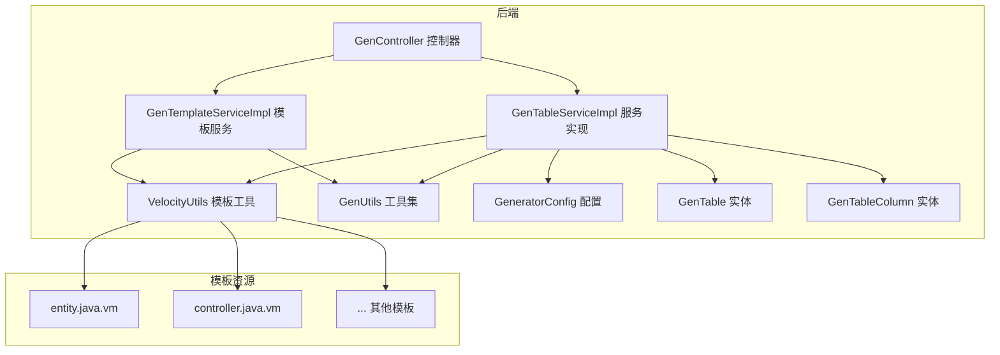
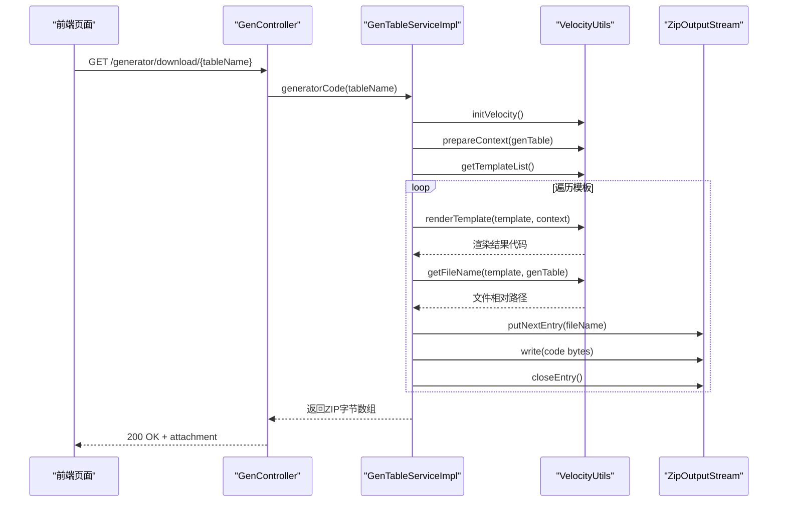
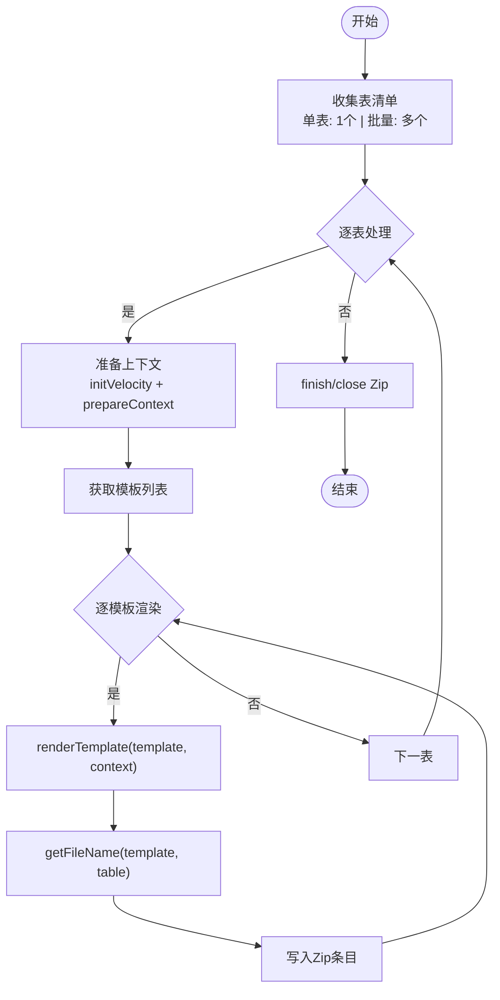
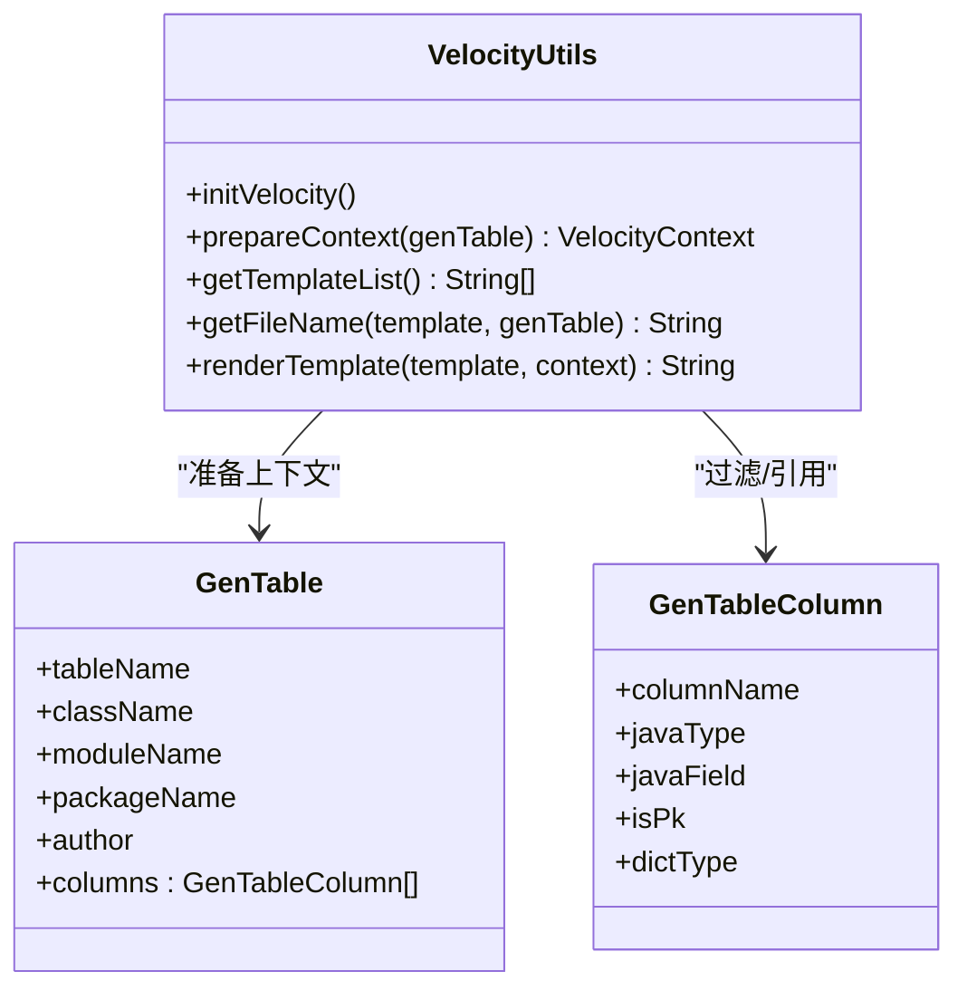
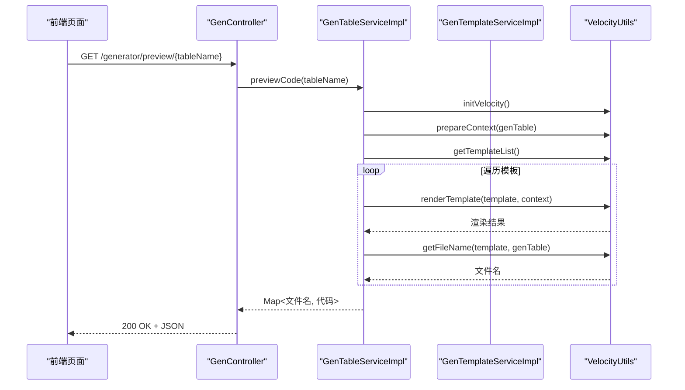
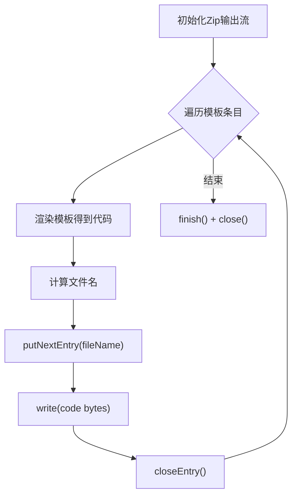
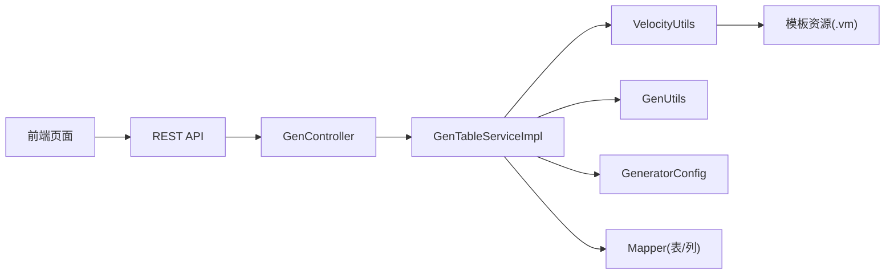
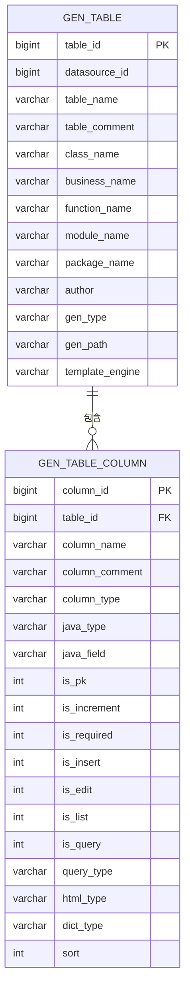

# 代码生成

<cite>
**本文引用的文件**
- [GenController.java](file://forge/forge-framework/forge-plugin-parent/forge-plugin-generator/src/main/java/com/mdframe/forge/plugin/generator/controller/GenController.java)
- [GenTableServiceImpl.java](file://forge/forge-framework/forge-plugin-parent/forge-plugin-generator/src/main/java/com/mdframe/forge/plugin/generator/service/impl/GenTableServiceImpl.java)
- [GenTemplateServiceImpl.java](file://forge/forge-framework/forge-plugin-parent/forge-plugin-generator/src/main/java/com/mdframe/forge/plugin/generator/service/impl/GenTemplateServiceImpl.java)
- [VelocityUtils.java](file://forge/forge-framework/forge-plugin-parent/forge-plugin-generator/src/main/java/com/mdframe/forge/plugin/generator/util/VelocityUtils.java)
- [GenUtils.java](file://forge/forge-framework/forge-plugin-parent/forge-plugin-generator/src/main/java/com/mdframe/forge/plugin/generator/util/GenUtils.java)
- [GenTable.java](file://forge/forge-framework/forge-plugin-parent/forge-plugin-generator/src/main/java/com/mdframe/forge/plugin/generator/domain/entity/GenTable.java)
- [GenTableColumn.java](file://forge/forge-framework/forge-plugin-parent/forge-plugin-generator/src/main/java/com/mdframe/forge/plugin/generator/domain/entity/GenTableColumn.java)
- [GeneratorConfig.java](file://forge/forge-framework/forge-plugin-parent/forge-plugin-generator/src/main/java/com/mdframe/forge/plugin/generator/config/GeneratorConfig.java)
- [generator_tables.sql](file://forge/forge-framework/forge-plugin-parent/forge-plugin-generator/src/main/resources/sql/generator_tables.sql)
- [entity.java.vm](file://forge/forge-framework/forge-plugin-parent/forge-plugin-generator/src/main/resources/templates/vm/entity.java.vm)
- [controller.java.vm](file://forge/forge-framework/forge-plugin-parent/forge-plugin-generator/src/main/resources/templates/vm/controller.java.vm)
- [template.vue](file://forge-admin-ui/src/views/generator/template.vue)
- [table.vue](file://forge-admin-ui/src/views/generator/table.vue)
</cite>

## 目录
1. [简介](#简介)
2. [项目结构](#项目结构)
3. [核心组件](#核心组件)
4. [架构总览](#架构总览)
5. [详细组件分析](#详细组件分析)
6. [依赖关系分析](#依赖关系分析)
7. [性能考量](#性能考量)
8. [故障排查指南](#故障排查指南)
9. [结论](#结论)
10. [附录](#附录)

## 简介
本技术文档围绕代码生成器的核心代码生成功能展开，系统阐述从模板解析、变量替换、文件生成到压缩打包的完整流程；对比单表与批量生成的差异及配置要点；详解 Velocity 模板引擎工具的使用、代码预览功能的实现原理以及 Zip 文件打包机制；并提供质量控制、错误处理策略、性能优化建议与常见问题排查指南，帮助开发者高效掌握代码生成技能。

## 项目结构
代码生成模块位于后端插件工程中，采用“控制器-服务-工具-模板”的分层组织，前端通过 Vue 页面进行交互与预览。

**图示来源**
- [GenController.java](file://forge/forge-framework/forge-plugin-parent/forge-plugin-generator/src/main/java/com/mdframe/forge/plugin/generator/controller/GenController.java#L25-L141)
- [GenTableServiceImpl.java](file://forge/forge-framework/forge-plugin-parent/forge-plugin-generator/src/main/java/com/mdframe/forge/plugin/generator/service/impl/GenTableServiceImpl.java#L35-L272)
- [GenTemplateServiceImpl.java](file://forge/forge-framework/forge-plugin-parent/forge-plugin-generator/src/main/java/com/mdframe/forge/plugin/generator/service/impl/GenTemplateServiceImpl.java#L29-L97)
- [VelocityUtils.java](file://forge/forge-framework/forge-plugin-parent/forge-plugin-generator/src/main/java/com/mdframe/forge/plugin/generator/util/VelocityUtils.java#L16-L154)
- [GenUtils.java](file://forge/forge-framework/forge-plugin-parent/forge-plugin-generator/src/main/java/com/mdframe/forge/plugin/generator/util/GenUtils.java#L15-L237)
- [GenTable.java](file://forge/forge-framework/forge-plugin-parent/forge-plugin-generator/src/main/java/com/mdframe/forge/plugin/generator/domain/entity/GenTable.java#L14-L84)
- [GenTableColumn.java](file://forge/forge-framework/forge-plugin-parent/forge-plugin-generator/src/main/java/com/mdframe/forge/plugin/generator/domain/entity/GenTableColumn.java#L14-L58)
- [GeneratorConfig.java](file://forge/forge-framework/forge-plugin-parent/forge-plugin-generator/src/main/java/com/mdframe/forge/plugin/generator/config/GeneratorConfig.java#L13-L49)
- [entity.java.vm](file://forge/forge-framework/forge-plugin-parent/forge-plugin-generator/src/main/resources/templates/vm/entity.java.vm#L1-L58)
- [controller.java.vm](file://forge/forge-framework/forge-plugin-parent/forge-plugin-generator/src/main/resources/templates/vm/controller.java.vm#L1-L99)

**章节来源**
- [GenController.java](file://forge/forge-framework/forge-plugin-parent/forge-plugin-generator/src/main/java/com/mdframe/forge/plugin/generator/controller/GenController.java#L25-L141)
- [GenTableServiceImpl.java](file://forge/forge-framework/forge-plugin-parent/forge-plugin-generator/src/main/java/com/mdframe/forge/plugin/generator/service/impl/GenTableServiceImpl.java#L35-L272)
- [GenTemplateServiceImpl.java](file://forge/forge-framework/forge-plugin-parent/forge-plugin-generator/src/main/java/com/mdframe/forge/plugin/generator/service/impl/GenTemplateServiceImpl.java#L29-L97)
- [VelocityUtils.java](file://forge/forge-framework/forge-plugin-parent/forge-plugin-generator/src/main/java/com/mdframe/forge/plugin/generator/util/VelocityUtils.java#L16-L154)
- [GenUtils.java](file://forge/forge-framework/forge-plugin-parent/forge-plugin-generator/src/main/java/com/mdframe/forge/plugin/generator/util/GenUtils.java#L15-L237)
- [GenTable.java](file://forge/forge-framework/forge-plugin-parent/forge-plugin-generator/src/main/java/com/mdframe/forge/plugin/generator/domain/entity/GenTable.java#L14-L84)
- [GenTableColumn.java](file://forge/forge-framework/forge-plugin-parent/forge-plugin-generator/src/main/java/com/mdframe/forge/plugin/generator/domain/entity/GenTableColumn.java#L14-L58)
- [GeneratorConfig.java](file://forge/forge-framework/forge-plugin-parent/forge-plugin-generator/src/main/java/com/mdframe/forge/plugin/generator/config/GeneratorConfig.java#L13-L49)
- [entity.java.vm](file://forge/forge-framework/forge-plugin-parent/forge-plugin-generator/src/main/resources/templates/vm/entity.java.vm#L1-L58)
- [controller.java.vm](file://forge/forge-framework/forge-plugin-parent/forge-plugin-generator/src/main/resources/templates/vm/controller.java.vm#L1-L99)

## 核心组件
- 控制器层：对外提供数据库表查询、表配置管理、代码生成下载、批量生成下载、代码预览等接口。
- 服务层：负责表结构导入、单表/批量代码生成、模板预览、表配置更新与删除。
- 工具层：Velocity 模板引擎初始化、上下文准备、模板列表、文件名解析、模板渲染；通用工具集负责类型映射、命名转换、导入判断、模块路径等。
- 模板层：内置 Velocity 模板集合，覆盖实体、Mapper、Service、Controller、DTO、XML、SQL 脚本等。
- 配置层：全局生成配置，如作者、包名、模块名、模板引擎、表前缀、基础路径等。

**章节来源**
- [GenController.java](file://forge/forge-framework/forge-plugin-parent/forge-plugin-generator/src/main/java/com/mdframe/forge/plugin/generator/controller/GenController.java#L25-L141)
- [GenTableServiceImpl.java](file://forge/forge-framework/forge-plugin-parent/forge-plugin-generator/src/main/java/com/mdframe/forge/plugin/generator/service/impl/GenTableServiceImpl.java#L35-L272)
- [GenTemplateServiceImpl.java](file://forge/forge-framework/forge-plugin-parent/forge-plugin-generator/src/main/java/com/mdframe/forge/plugin/generator/service/impl/GenTemplateServiceImpl.java#L29-L97)
- [VelocityUtils.java](file://forge/forge-framework/forge-plugin-parent/forge-plugin-generator/src/main/java/com/mdframe/forge/plugin/generator/util/VelocityUtils.java#L16-L154)
- [GenUtils.java](file://forge/forge-framework/forge-plugin-parent/forge-plugin-generator/src/main/java/com/mdframe/forge/plugin/generator/util/GenUtils.java#L15-L237)
- [GeneratorConfig.java](file://forge/forge-framework/forge-plugin-parent/forge-plugin-generator/src/main/java/com/mdframe/forge/plugin/generator/config/GeneratorConfig.java#L13-L49)

## 架构总览
下图展示从前端到后端的典型生成流程：前端发起生成请求，后端通过服务层调用模板工具完成渲染与打包，最终以 ZIP 形式返回给客户端。

**图示来源**
- [GenController.java](file://forge/forge-framework/forge-plugin-parent/forge-plugin-generator/src/main/java/com/mdframe/forge/plugin/generator/controller/GenController.java#L118-L127)
- [GenTableServiceImpl.java](file://forge/forge-framework/forge-plugin-parent/forge-plugin-generator/src/main/java/com/mdframe/forge/plugin/generator/service/impl/GenTableServiceImpl.java#L114-L155)
- [VelocityUtils.java](file://forge/forge-framework/forge-plugin-parent/forge-plugin-generator/src/main/java/com/mdframe/forge/plugin/generator/util/VelocityUtils.java#L21-L27)
- [VelocityUtils.java](file://forge/forge-framework/forge-plugin-parent/forge-plugin-generator/src/main/java/com/mdframe/forge/plugin/generator/util/VelocityUtils.java#L93-L107)
- [VelocityUtils.java](file://forge/forge-framework/forge-plugin-parent/forge-plugin-generator/src/main/java/com/mdframe/forge/plugin/generator/util/VelocityUtils.java#L112-L144)

## 详细组件分析

### 单表生成 vs 批量生成
- 单表生成：按表名查询表配置与列信息，准备 Velocity 上下文，遍历模板列表逐个渲染并写入 Zip。
- 批量生成：对每个表重复上述流程，最终输出一个包含多表产物的 Zip 包。
- 关键差异点：
  - 输入来源：单表传入表名字符串，批量传入表名数组。
  - 输出形态：单表生成以目标表名为文件名导出 Zip；批量生成固定命名为 code.zip。
  - 生成规则：两者共享同一套模板与上下文构建逻辑，区别仅在循环次数与 Zip 写入顺序。

**图示来源**
- [GenTableServiceImpl.java](file://forge/forge-framework/forge-plugin-parent/forge-plugin-generator/src/main/java/com/mdframe/forge/plugin/generator/service/impl/GenTableServiceImpl.java#L114-L155)
- [GenTableServiceImpl.java](file://forge/forge-framework/forge-plugin-parent/forge-plugin-generator/src/main/java/com/mdframe/forge/plugin/generator/service/impl/GenTableServiceImpl.java#L158-L191)
- [VelocityUtils.java](file://forge/forge-framework/forge-plugin-parent/forge-plugin-generator/src/main/java/com/mdframe/forge/plugin/generator/util/VelocityUtils.java#L93-L107)
- [VelocityUtils.java](file://forge/forge-framework/forge-plugin-parent/forge-plugin-generator/src/main/java/com/mdframe/forge/plugin/generator/util/VelocityUtils.java#L112-L144)

**章节来源**
- [GenTableServiceImpl.java](file://forge/forge-framework/forge-plugin-parent/forge-plugin-generator/src/main/java/com/mdframe/forge/plugin/generator/service/impl/GenTableServiceImpl.java#L114-L191)
- [GenController.java](file://forge/forge-framework/forge-plugin-parent/forge-plugin-generator/src/main/java/com/mdframe/forge/plugin/generator/controller/GenController.java#L118-L140)

### Velocity 模板引擎工具
- 初始化：设置资源加载器、输入输出编码，确保模板读取与渲染字符集一致。
- 上下文准备：注入表基本信息、列集合、主键列、导入判断标志、模块路径等。
- 模板列表：内置标准模板集合，覆盖实体、Mapper、Service、Controller、DTO、XML、SQL 脚本等。
- 文件名解析：根据模板类型与表配置计算输出文件的相对路径，保证目录结构符合 Java 项目规范。
- 渲染：基于 Velocity 合并模板与上下文，输出纯文本代码。

**图示来源**
- [VelocityUtils.java](file://forge/forge-framework/forge-plugin-parent/forge-plugin-generator/src/main/java/com/mdframe/forge/plugin/generator/util/VelocityUtils.java#L16-L154)
- [GenTable.java](file://forge/forge-framework/forge-plugin-parent/forge-plugin-generator/src/main/java/com/mdframe/forge/plugin/generator/domain/entity/GenTable.java#L14-L84)
- [GenTableColumn.java](file://forge/forge-framework/forge-plugin-parent/forge-plugin-generator/src/main/java/com/mdframe/forge/plugin/generator/domain/entity/GenTableColumn.java#L14-L58)

**章节来源**
- [VelocityUtils.java](file://forge/forge-framework/forge-plugin-parent/forge-plugin-generator/src/main/java/com/mdframe/forge/plugin/generator/util/VelocityUtils.java#L16-L154)

### 代码预览功能
- 预览接口：后端提供按表名预览所有模板渲染结果的接口，返回文件名到代码内容的映射。
- 模板预览：模板服务可对指定模板与表配置进行即时渲染，便于前端编辑器展示。
- 前端集成：前端页面通过请求预览接口，使用代码编辑器展示渲染结果，支持复制与二次编辑。

**图示来源**
- [GenController.java](file://forge/forge-framework/forge-plugin-parent/forge-plugin-generator/src/main/java/com/mdframe/forge/plugin/generator/controller/GenController.java#L110-L114)
- [GenTableServiceImpl.java](file://forge/forge-framework/forge-plugin-parent/forge-plugin-generator/src/main/java/com/mdframe/forge/plugin/generator/service/impl/GenTableServiceImpl.java#L194-L216)
- [GenTemplateServiceImpl.java](file://forge/forge-framework/forge-plugin-parent/forge-plugin-generator/src/main/java/com/mdframe/forge/plugin/generator/service/impl/GenTemplateServiceImpl.java#L54-L91)
- [VelocityUtils.java](file://forge/forge-framework/forge-plugin-parent/forge-plugin-generator/src/main/java/com/mdframe/forge/plugin/generator/util/VelocityUtils.java#L93-L107)

**章节来源**
- [GenController.java](file://forge/forge-framework/forge-plugin-parent/forge-plugin-generator/src/main/java/com/mdframe/forge/plugin/generator/controller/GenController.java#L110-L114)
- [GenTableServiceImpl.java](file://forge/forge-framework/forge-plugin-parent/forge-plugin-generator/src/main/java/com/mdframe/forge/plugin/generator/service/impl/GenTableServiceImpl.java#L194-L216)
- [GenTemplateServiceImpl.java](file://forge/forge-framework/forge-plugin-parent/forge-plugin-generator/src/main/java/com/mdframe/forge/plugin/generator/service/impl/GenTemplateServiceImpl.java#L54-L91)
- [template.vue](file://forge-admin-ui/src/views/generator/template.vue#L455-L475)

### Zip 文件打包机制
- 流式写入：使用 ByteArrayOutputStream 作为内存缓冲，ZipOutputStream 逐条写入模板渲染后的代码。
- 条目命名：依据模板类型与表配置计算相对路径，确保生成的文件树符合标准 Java 项目结构。
- 完成与关闭：写入完成后 finish 并关闭流，避免资源泄漏。

**图示来源**
- [GenTableServiceImpl.java](file://forge/forge-framework/forge-plugin-parent/forge-plugin-generator/src/main/java/com/mdframe/forge/plugin/generator/service/impl/GenTableServiceImpl.java#L114-L155)
- [GenTableServiceImpl.java](file://forge/forge-framework/forge-plugin-parent/forge-plugin-generator/src/main/java/com/mdframe/forge/plugin/generator/service/impl/GenTableServiceImpl.java#L158-L191)
- [VelocityUtils.java](file://forge/forge-framework/forge-plugin-parent/forge-plugin-generator/src/main/java/com/mdframe/forge/plugin/generator/util/VelocityUtils.java#L112-L144)

**章节来源**
- [GenTableServiceImpl.java](file://forge/forge-framework/forge-plugin-parent/forge-plugin-generator/src/main/java/com/mdframe/forge/plugin/generator/service/impl/GenTableServiceImpl.java#L114-L191)

### 生成规则配置与输出路径
- 生成规则：通过全局配置类设置作者、包名、模块名、模板引擎、表前缀、基础路径等。
- 输出路径：文件名解析函数根据包名、模块名与模板类型生成相对路径，例如 entity 存放于 main/java/包/模块/entity/，Mapper XML 存放于 main/resources/mapper/。
- 生成方式：表配置中包含生成方式（下载/直接生成到项目），当前实现以下载方式为主。

**章节来源**
- [GeneratorConfig.java](file://forge/forge-framework/forge-plugin-parent/forge-plugin-generator/src/main/java/com/mdframe/forge/plugin/generator/config/GeneratorConfig.java#L13-L49)
- [VelocityUtils.java](file://forge/forge-framework/forge-plugin-parent/forge-plugin-generator/src/main/java/com/mdframe/forge/plugin/generator/util/VelocityUtils.java#L112-L144)
- [GenTable.java](file://forge/forge-framework/forge-plugin-parent/forge-plugin-generator/src/main/java/com/mdframe/forge/plugin/generator/domain/entity/GenTable.java#L72-L79)

### 模板结构与命名规范
- 模板类型：实体、Mapper 接口、Mapper XML、Service 接口、ServiceImpl、Controller、DTO、Query、SQL 脚本等。
- 命名规范：模板中使用 Velocity 变量（如包名、类名、模块名、作者、日期等）进行动态替换；文件名解析函数将模板类型映射为具体路径与文件名。

**章节来源**
- [VelocityUtils.java](file://forge/forge-framework/forge-plugin-parent/forge-plugin-generator/src/main/java/com/mdframe/forge/plugin/generator/util/VelocityUtils.java#L93-L107)
- [entity.java.vm](file://forge/forge-framework/forge-plugin-parent/forge-plugin-generator/src/main/resources/templates/vm/entity.java.vm#L1-L58)
- [controller.java.vm](file://forge/forge-framework/forge-plugin-parent/forge-plugin-generator/src/main/resources/templates/vm/controller.java.vm#L1-L99)

## 依赖关系分析
- 控制器依赖服务接口，服务实现依赖工具类与配置类。
- 服务实现依赖 Mapper 访问表与列配置，VelocityUtils 依赖模板资源。
- 前端页面通过 API 请求与后端交互，模板页面支持模板预览与复制。

**图示来源**
- [GenController.java](file://forge/forge-framework/forge-plugin-parent/forge-plugin-generator/src/main/java/com/mdframe/forge/plugin/generator/controller/GenController.java#L25-L141)
- [GenTableServiceImpl.java](file://forge/forge-framework/forge-plugin-parent/forge-plugin-generator/src/main/java/com/mdframe/forge/plugin/generator/service/impl/GenTableServiceImpl.java#L35-L272)
- [VelocityUtils.java](file://forge/forge-framework/forge-plugin-parent/forge-plugin-generator/src/main/java/com/mdframe/forge/plugin/generator/util/VelocityUtils.java#L16-L154)
- [GenUtils.java](file://forge/forge-framework/forge-plugin-parent/forge-plugin-generator/src/main/java/com/mdframe/forge/plugin/generator/util/GenUtils.java#L15-L237)
- [GeneratorConfig.java](file://forge/forge-framework/forge-plugin-parent/forge-plugin-generator/src/main/java/com/mdframe/forge/plugin/generator/config/GeneratorConfig.java#L13-L49)

**章节来源**
- [GenController.java](file://forge/forge-framework/forge-plugin-parent/forge-plugin-generator/src/main/java/com/mdframe/forge/plugin/generator/controller/GenController.java#L25-L141)
- [GenTableServiceImpl.java](file://forge/forge-framework/forge-plugin-parent/forge-plugin-generator/src/main/java/com/mdframe/forge/plugin/generator/service/impl/GenTableServiceImpl.java#L35-L272)

## 性能考量
- 模板渲染：尽量减少模板复杂度与嵌套循环，避免在模板中执行重型逻辑。
- IO 写入：使用内存流（ByteArrayOutputStream）+ Zip 输出，避免频繁磁盘 IO；确保及时关闭流，防止资源泄露。
- 批量生成：批量场景下建议分批处理（如每批 10 个表），并在 UI 层提示进度，避免长时间阻塞。
- 字符集：统一设置输入输出编码为 UTF-8，避免乱码与编码转换开销。
- 类型映射与判断：在工具集中进行一次性判断（如 BigDecimal、LocalDateTime、BaseEntity、字典翻译），减少模板内分支判断。

[本节为通用性能建议，不直接分析具体文件，故无“章节来源”]

## 故障排查指南
- 表不存在或未导入：当表配置不存在或未导入时，服务层会抛出运行时异常；请检查表导入流程与数据源配置。
- 模板渲染失败：模板预览接口会捕获渲染异常并记录日志；请检查模板语法与上下文变量是否正确。
- Zip 写入异常：生成过程中若发生 IO 异常，会记录错误并抛出运行时异常；请检查磁盘空间与权限。
- 下载文件为空：确认模板列表非空且文件名解析返回有效路径；检查模板资源是否存在。
- 前端预览空白：检查前端请求是否成功、编辑器初始化是否完成、模板内容是否正确返回。

**章节来源**
- [GenTableServiceImpl.java](file://forge/forge-framework/forge-plugin-parent/forge-plugin-generator/src/main/java/com/mdframe/forge/plugin/generator/service/impl/GenTableServiceImpl.java#L64-L111)
- [GenTemplateServiceImpl.java](file://forge/forge-framework/forge-plugin-parent/forge-plugin-generator/src/main/java/com/mdframe/forge/plugin/generator/service/impl/GenTemplateServiceImpl.java#L54-L91)
- [GenController.java](file://forge/forge-framework/forge-plugin-parent/forge-plugin-generator/src/main/java/com/mdframe/forge/plugin/generator/controller/GenController.java#L118-L140)

## 结论
该代码生成器以 Velocity 模板为核心，结合标准化的上下文与文件命名规则，实现了从表配置到多文件 Zip 的自动化生成。单表与批量生成共享同一套模板与流程，差异主要体现在循环次数与输出命名。通过合理的配置、严格的错误处理与性能优化，可稳定支撑日常开发中的快速代码生成需求。

[本节为总结性内容，不直接分析具体文件，故无“章节来源”]

## 附录

### 数据模型概览

**图示来源**
- [generator_tables.sql](file://forge/forge-framework/forge-plugin-parent/forge-plugin-generator/src/main/resources/sql/generator_tables.sql#L32-L56)
- [GenTable.java](file://forge/forge-framework/forge-plugin-parent/forge-plugin-generator/src/main/java/com/mdframe/forge/plugin/generator/domain/entity/GenTable.java#L14-L84)
- [GenTableColumn.java](file://forge/forge-framework/forge-plugin-parent/forge-plugin-generator/src/main/java/com/mdframe/forge/plugin/generator/domain/entity/GenTableColumn.java#L14-L58)

### 前端交互要点
- 表配置页面：支持导入表、字段配置、生成方式选择、模板引擎切换、预览与下载。
- 模板管理页面：支持模板增删改查、模板类型分类、模板内容编辑与预览。

**章节来源**
- [table.vue](file://forge-admin-ui/src/views/generator/table.vue#L1-L352)
- [template.vue](file://forge-admin-ui/src/views/generator/template.vue#L1-L499)