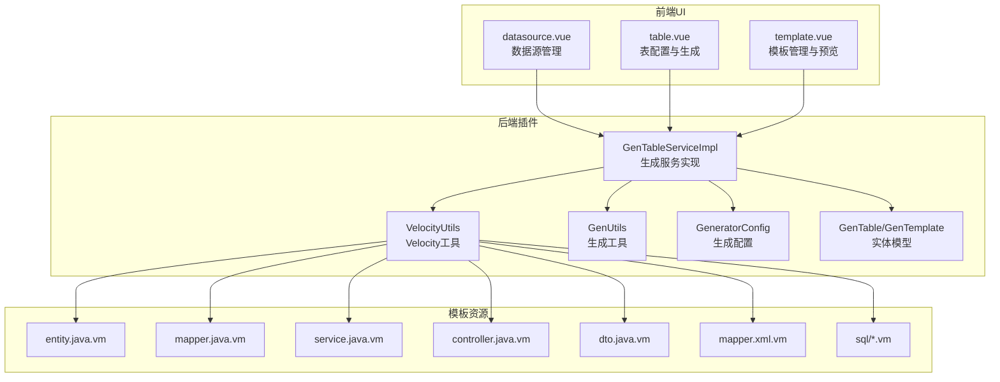
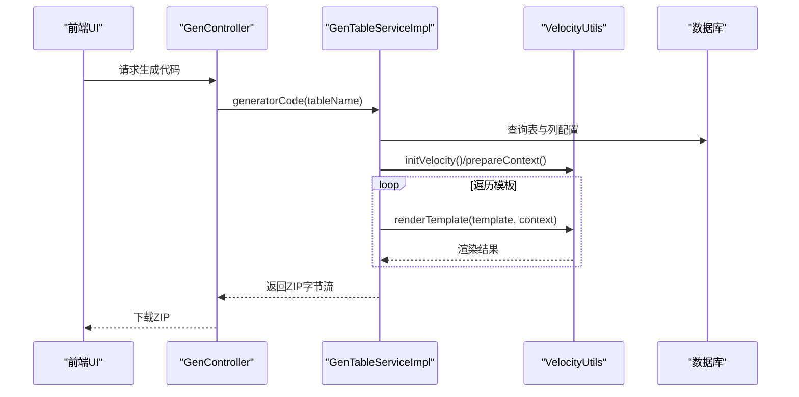
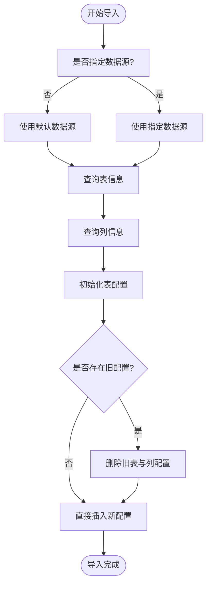
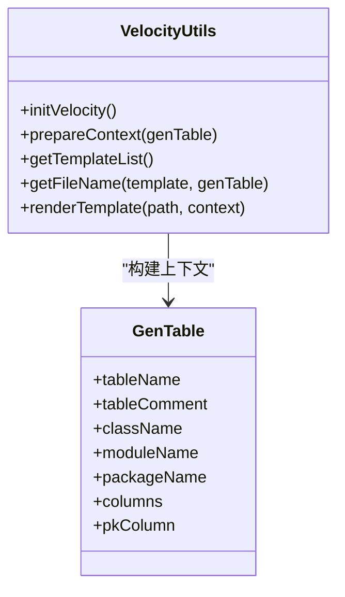
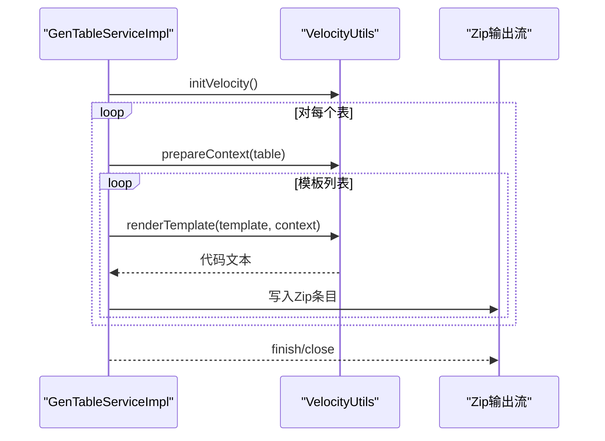
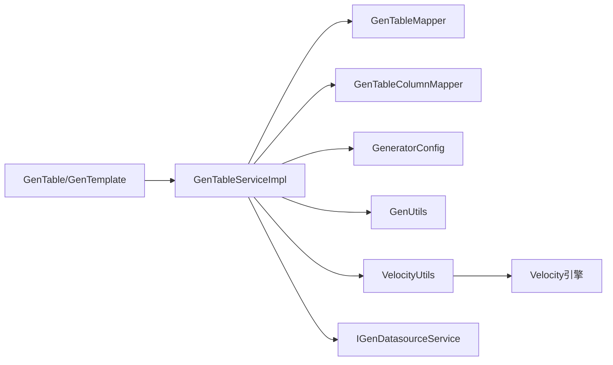

# 代码生成器

<cite>
**本文引用的文件**
- [GenTableServiceImpl.java](file://forge/forge-framework/forge-plugin-parent/forge-plugin-generator/src/main/java/com/mdframe/forge/plugin/generator/service/impl/GenTableServiceImpl.java)
- [VelocityUtils.java](file://forge/forge-framework/forge-plugin-parent/forge-plugin-generator/src/main/java/com/mdframe/forge/plugin/generator/util/VelocityUtils.java)
- [GenUtils.java](file://forge/forge-framework/forge-plugin-parent/forge-plugin-generator/src/main/java/com/mdframe/forge/plugin/generator/util/GenUtils.java)
- [GeneratorConfig.java](file://forge/forge-framework/forge-plugin-parent/forge-plugin-generator/src/main/java/com/mdframe/forge/plugin/generator/config/GeneratorConfig.java)
- [GenTable.java](file://forge/forge-framework/forge-plugin-parent/forge-plugin-generator/src/main/java/com/mdframe/forge/plugin/generator/domain/entity/GenTable.java)
- [GenTemplate.java](file://forge/forge-framework/forge-plugin-parent/forge-plugin-generator/src/main/java/com/mdframe/forge/plugin/generator/domain/entity/GenTemplate.java)
- [generator_tables.sql](file://forge/forge-framework/forge-plugin-parent/forge-plugin-generator/src/main/resources/sql/generator_tables.sql)
- [application.yml](file://forge/forge-framework/forge-plugin-parent/forge-plugin-generator/src/main/resources/application.yml)
- [entity.java.vm](file://forge/forge-framework/forge-plugin-parent/forge-plugin-generator/src/main/resources/templates/vm/entity.java.vm)
- [GenController.java](file://forge/forge-framework/forge-plugin-parent/forge-plugin-generator/src/main/java/com/mdframe/forge/plugin/generator/controller/GenController.java)
- [datasource.vue](file://forge-admin-ui/src/views/generator/datasource.vue)
- [table.vue](file://forge-admin-ui/src/views/generator/table.vue)
- [template.vue](file://forge-admin-ui/src/views/generator/template.vue)
</cite>

## 目录
1. [简介](#简介)
2. [项目结构](#项目结构)
3. [核心组件](#核心组件)
4. [架构总览](#架构总览)
5. [详细组件分析](#详细组件分析)
6. [依赖关系分析](#依赖关系分析)
7. [性能考量](#性能考量)
8. [故障排查指南](#故障排查指南)
9. [结论](#结论)
10. [附录](#附录)

## 简介
本技术文档面向Forge框架的代码生成器功能，系统性阐述基于数据库表结构的自动化代码生成能力。文档覆盖表结构导入机制、模板引擎配置、代码生成流程、输出格式定制、Velocity模板语法、生成规则配置、批量生成操作、代码预览功能，并提供完整的使用示例、模板定制指南与性能优化建议，帮助开发者高效利用代码生成器提升开发效率。

## 项目结构
代码生成器位于Forge框架的插件体系中，采用“插件-模板-前端UI”三层协作：
- 后端插件层：负责表结构导入、模板渲染、批量生成与预览
- 模板层：内置Velocity模板，覆盖实体、Mapper、Service、Controller、DTO、XML及SQL脚本
- 前端UI层：提供数据源管理、表配置、模板管理与代码生成的可视化操作界面

**图表来源**
- [GenTableServiceImpl.java](file://forge/forge-framework/forge-plugin-parent/forge-plugin-generator/src/main/java/com/mdframe/forge/plugin/generator/service/impl/GenTableServiceImpl.java#L1-L273)
- [VelocityUtils.java](file://forge/forge-framework/forge-plugin-parent/forge-plugin-generator/src/main/java/com/mdframe/forge/plugin/generator/util/VelocityUtils.java#L1-L155)
- [GenUtils.java](file://forge/forge-framework/forge-plugin-parent/forge-plugin-generator/src/main/java/com/mdframe/forge/plugin/generator/util/GenUtils.java#L1-L238)
- [GeneratorConfig.java](file://forge/forge-framework/forge-plugin-parent/forge-plugin-generator/src/main/java/com/mdframe/forge/plugin/generator/config/GeneratorConfig.java#L1-L50)
- [GenTable.java](file://forge/forge-framework/forge-plugin-parent/forge-plugin-generator/src/main/java/com/mdframe/forge/plugin/generator/domain/entity/GenTable.java#L1-L147)
- [GenTemplate.java](file://forge/forge-framework/forge-plugin-parent/forge-plugin-generator/src/main/java/com/mdframe/forge/plugin/generator/domain/entity/GenTemplate.java#L1-L89)
- [entity.java.vm](file://forge/forge-framework/forge-plugin-parent/forge-plugin-generator/src/main/resources/templates/vm/entity.java.vm#L1-L58)
- [datasource.vue](file://forge-admin-ui/src/views/generator/datasource.vue#L1-L350)
- [table.vue](file://forge-admin-ui/src/views/generator/table.vue#L1-L396)
- [template.vue](file://forge-admin-ui/src/views/generator/template.vue#L1-L542)

**章节来源**
- [GenTableServiceImpl.java](file://forge/forge-framework/forge-plugin-parent/forge-plugin-generator/src/main/java/com/mdframe/forge/plugin/generator/service/impl/GenTableServiceImpl.java#L1-L273)
- [VelocityUtils.java](file://forge/forge-framework/forge-plugin-parent/forge-plugin-generator/src/main/java/com/mdframe/forge/plugin/generator/util/VelocityUtils.java#L1-L155)
- [GenUtils.java](file://forge/forge-framework/forge-plugin-parent/forge-plugin-generator/src/main/java/com/mdframe/forge/plugin/generator/util/GenUtils.java#L1-L238)
- [GeneratorConfig.java](file://forge/forge-framework/forge-plugin-parent/forge-plugin-generator/src/main/java/com/mdframe/forge/plugin/generator/config/GeneratorConfig.java#L1-L50)
- [GenTable.java](file://forge/forge-framework/forge-plugin-parent/forge-plugin-generator/src/main/java/com/mdframe/forge/plugin/generator/domain/entity/GenTable.java#L1-L147)
- [GenTemplate.java](file://forge/forge-framework/forge-plugin-parent/forge-plugin-generator/src/main/java/com/mdframe/forge/plugin/generator/domain/entity/GenTemplate.java#L1-L89)
- [entity.java.vm](file://forge/forge-framework/forge-plugin-parent/forge-plugin-generator/src/main/resources/templates/vm/entity.java.vm#L1-L58)
- [datasource.vue](file://forge-admin-ui/src/views/generator/datasource.vue#L1-L350)
- [table.vue](file://forge-admin-ui/src/views/generator/table.vue#L1-L396)
- [template.vue](file://forge-admin-ui/src/views/generator/template.vue#L1-L542)

## 核心组件
- 生成服务实现：负责表结构导入、批量生成、单表生成、代码预览与配置更新
- Velocity工具：初始化引擎、准备上下文、模板列表、文件名解析与模板渲染
- 生成工具：数据库类型到Java类型的映射、表名/列名转换、HTML类型推断、字典翻译识别、主键列提取等
- 生成配置：全局作者、包名、模块名、模板引擎、表前缀、基础路径等
- 实体模型：GenTable（表配置）、GenTableColumn（列配置）、GenTemplate（模板配置）
- 模板资源：内置Velocity模板集合，覆盖实体、Mapper、Service、Controller、DTO、XML及SQL脚本
- 前端UI：数据源管理、表配置与生成、模板管理与预览

**章节来源**
- [GenTableServiceImpl.java](file://forge/forge-framework/forge-plugin-parent/forge-plugin-generator/src/main/java/com/mdframe/forge/plugin/generator/service/impl/GenTableServiceImpl.java#L1-L273)
- [VelocityUtils.java](file://forge/forge-framework/forge-plugin-parent/forge-plugin-generator/src/main/java/com/mdframe/forge/plugin/generator/util/VelocityUtils.java#L1-L155)
- [GenUtils.java](file://forge/forge-framework/forge-plugin-parent/forge-plugin-generator/src/main/java/com/mdframe/forge/plugin/generator/util/GenUtils.java#L1-L238)
- [GeneratorConfig.java](file://forge/forge-framework/forge-plugin-parent/forge-plugin-generator/src/main/java/com/mdframe/forge/plugin/generator/config/GeneratorConfig.java#L1-L50)
- [GenTable.java](file://forge/forge-framework/forge-plugin-parent/forge-plugin-generator/src/main/java/com/mdframe/forge/plugin/generator/domain/entity/GenTable.java#L1-L147)
- [GenTemplate.java](file://forge/forge-framework/forge-plugin-parent/forge-plugin-generator/src/main/java/com/mdframe/forge/plugin/generator/domain/entity/GenTemplate.java#L1-L89)

## 架构总览
代码生成器采用“配置驱动 + 模板渲染”的架构模式：
- 配置驱动：通过GeneratorConfig与GenTable/GenTemplate实体承载生成参数与模板元数据
- 模板渲染：VelocityUtils统一管理模板加载、上下文构建与渲染输出
- 批量与单表：GenTableServiceImpl提供单表生成、批量生成与代码预览
- 前端交互：UI层通过HTTP API调用后端，完成数据源、表配置与模板的增删改查与预览

**图表来源**
- [GenController.java](file://forge/forge-framework/forge-plugin-parent/forge-plugin-generator/src/main/java/com/mdframe/forge/plugin/generator/controller/GenController.java)
- [GenTableServiceImpl.java](file://forge/forge-framework/forge-plugin-parent/forge-plugin-generator/src/main/java/com/mdframe/forge/plugin/generator/service/impl/GenTableServiceImpl.java#L114-L155)
- [VelocityUtils.java](file://forge/forge-framework/forge-plugin-parent/forge-plugin-generator/src/main/java/com/mdframe/forge/plugin/generator/util/VelocityUtils.java#L21-L153)

**章节来源**
- [GenTableServiceImpl.java](file://forge/forge-framework/forge-plugin-parent/forge-plugin-generator/src/main/java/com/mdframe/forge/plugin/generator/service/impl/GenTableServiceImpl.java#L114-L155)
- [VelocityUtils.java](file://forge/forge-framework/forge-plugin-parent/forge-plugin-generator/src/main/java/com/mdframe/forge/plugin/generator/util/VelocityUtils.java#L21-L153)
- [GenController.java](file://forge/forge-framework/forge-plugin-parent/forge-plugin-generator/src/main/java/com/mdframe/forge/plugin/generator/controller/GenController.java)

## 详细组件分析

### 表结构导入机制
- 支持默认数据源与指定数据源两种导入方式
- 导入流程包括：查询表信息与列信息、初始化表与列配置、删除旧配置并插入新配置
- 支持自动移除表前缀、设置包名、模块名、作者、模板引擎等

**图表来源**
- [GenTableServiceImpl.java](file://forge/forge-framework/forge-plugin-parent/forge-plugin-generator/src/main/java/com/mdframe/forge/plugin/generator/service/impl/GenTableServiceImpl.java#L48-L111)
- [GenUtils.java](file://forge/forge-framework/forge-plugin-parent/forge-plugin-generator/src/main/java/com/mdframe/forge/plugin/generator/util/GenUtils.java#L86-L96)

**章节来源**
- [GenTableServiceImpl.java](file://forge/forge-framework/forge-plugin-parent/forge-plugin-generator/src/main/java/com/mdframe/forge/plugin/generator/service/impl/GenTableServiceImpl.java#L48-L111)
- [GenUtils.java](file://forge/forge-framework/forge-plugin-parent/forge-plugin-generator/src/main/java/com/mdframe/forge/plugin/generator/util/GenUtils.java#L86-L96)

### 模板引擎配置与上下文
- Velocity初始化：设置资源加载器、输入输出编码
- 上下文准备：注入表基本信息、列信息、导入判断标志、模块路径等
- 模板列表：内置标准模板集合（实体、Mapper、Service、Controller、DTO、XML、SQL脚本）
- 文件名解析：根据模板类型与表配置生成目标文件路径

**图表来源**
- [VelocityUtils.java](file://forge/forge-framework/forge-plugin-parent/forge-plugin-generator/src/main/java/com/mdframe/forge/plugin/generator/util/VelocityUtils.java#L21-L153)
- [GenTable.java](file://forge/forge-framework/forge-plugin-parent/forge-plugin-generator/src/main/java/com/mdframe/forge/plugin/generator/domain/entity/GenTable.java#L1-L147)

**章节来源**
- [VelocityUtils.java](file://forge/forge-framework/forge-plugin-parent/forge-plugin-generator/src/main/java/com/mdframe/forge/plugin/generator/util/VelocityUtils.java#L21-L153)
- [GenTable.java](file://forge/forge-framework/forge-plugin-parent/forge-plugin-generator/src/main/java/com/mdframe/forge/plugin/generator/domain/entity/GenTable.java#L1-L147)

### 代码生成流程
- 单表生成：查询表与列配置，初始化Velocity，遍历模板渲染并打包为ZIP
- 批量生成：对多个表重复上述流程，合并到同一ZIP
- 代码预览：不打包，返回文件名到代码内容的映射，便于前端展示

**图表来源**
- [GenTableServiceImpl.java](file://forge/forge-framework/forge-plugin-parent/forge-plugin-generator/src/main/java/com/mdframe/forge/plugin/generator/service/impl/GenTableServiceImpl.java#L114-L191)
- [VelocityUtils.java](file://forge/forge-framework/forge-plugin-parent/forge-plugin-generator/src/main/java/com/mdframe/forge/plugin/generator/util/VelocityUtils.java#L93-L153)

**章节来源**
- [GenTableServiceImpl.java](file://forge/forge-framework/forge-plugin-parent/forge-plugin-generator/src/main/java/com/mdframe/forge/plugin/generator/service/impl/GenTableServiceImpl.java#L114-L191)
- [VelocityUtils.java](file://forge/forge-framework/forge-plugin-parent/forge-plugin-generator/src/main/java/com/mdframe/forge/plugin/generator/util/VelocityUtils.java#L93-L153)

### 输出格式定制
- 文件路径：按包名与模块名生成标准目录结构
- 文件后缀：由模板配置决定（如.java、.xml、.sql）
- 生成方式：支持下载ZIP包或直接生成到项目（当前UI默认下载）

**章节来源**
- [VelocityUtils.java](file://forge/forge-framework/forge-plugin-parent/forge-plugin-generator/src/main/java/com/mdframe/forge/plugin/generator/util/VelocityUtils.java#L112-L144)
- [table.vue](file://forge-admin-ui/src/views/generator/table.vue#L354-L378)

### Velocity模板语法与内置变量
- 基础变量：表名、注释、类名、业务名、模块名、包名、作者、生成时间
- 列信息：columns（过滤基类字段）、pkColumn（主键列）
- 导入判断：hasBigDecimal、hasDate、hasBaseEntity、hasDictTrans
- 模块路径：modulePath
- 控制结构：条件判断、循环遍历列

**章节来源**
- [VelocityUtils.java](file://forge/forge-framework/forge-plugin-parent/forge-plugin-generator/src/main/java/com/mdframe/forge/plugin/generator/util/VelocityUtils.java#L32-L68)
- [entity.java.vm](file://forge/forge-framework/forge-plugin-parent/forge-plugin-generator/src/main/resources/templates/vm/entity.java.vm#L1-L58)

### 生成规则配置
- 全局配置：作者、包名、模块名、模板引擎、表前缀、基础路径
- 表级配置：类名、业务名、功能名、模块名、包名、作者、生成方式、模板引擎、生成路径、选项等
- 模板配置：模板名称、编码、类型、引擎、内容、文件后缀、路径、启用状态、排序等

**章节来源**
- [GeneratorConfig.java](file://forge/forge-framework/forge-plugin-parent/forge-plugin-generator/src/main/java/com/mdframe/forge/plugin/generator/config/GeneratorConfig.java#L1-L50)
- [GenTable.java](file://forge/forge-framework/forge-plugin-parent/forge-plugin-generator/src/main/java/com/mdframe/forge/plugin/generator/domain/entity/GenTable.java#L1-L147)
- [GenTemplate.java](file://forge/forge-framework/forge-plugin-parent/forge-plugin-generator/src/main/java/com/mdframe/forge/plugin/generator/domain/entity/GenTemplate.java#L1-L89)
- [application.yml](file://forge/forge-framework/forge-plugin-parent/forge-plugin-generator/src/main/resources/application.yml#L1-L18)

### 批量生成操作
- 支持传入多个表名进行批量生成，统一初始化Velocity并逐表渲染模板
- 输出为单一ZIP包，便于下载与归档

**章节来源**
- [GenTableServiceImpl.java](file://forge/forge-framework/forge-plugin-parent/forge-plugin-generator/src/main/java/com/mdframe/forge/plugin/generator/service/impl/GenTableServiceImpl.java#L157-L191)

### 代码预览功能
- 预览接口返回文件名到代码内容的映射
- 前端以只读编辑器展示，支持复制与保存

**章节来源**
- [GenTableServiceImpl.java](file://forge/forge-framework/forge-plugin-parent/forge-plugin-generator/src/main/java/com/mdframe/forge/plugin/generator/service/impl/GenTableServiceImpl.java#L193-L216)
- [table.vue](file://forge-admin-ui/src/views/generator/table.vue#L348-L352)

### 前端使用示例
- 数据源管理：支持新增、编辑、删除、测试连接
- 表配置：支持导入表、字段配置、预览、生成、删除
- 模板管理：支持新增、编辑、复制、预览、删除（系统内置模板不可删除）

**章节来源**
- [datasource.vue](file://forge-admin-ui/src/views/generator/datasource.vue#L1-L350)
- [table.vue](file://forge-admin-ui/src/views/generator/table.vue#L1-L396)
- [template.vue](file://forge-admin-ui/src/views/generator/template.vue#L1-L542)

## 依赖关系分析
- 生成服务依赖：GenTableMapper、GenTableColumnMapper、IGenDatasourceService、GeneratorConfig
- 模板工具依赖：Velocity引擎、GenUtils工具方法
- 实体模型依赖：MyBatis-Plus注解、Jackson TypeHandler用于options字段序列化
- 前端依赖：HTTP API、CodeMirror编辑器、Naive UI组件

**图表来源**
- [GenTableServiceImpl.java](file://forge/forge-framework/forge-plugin-parent/forge-plugin-generator/src/main/java/com/mdframe/forge/plugin/generator/service/impl/GenTableServiceImpl.java#L35-L40)
- [VelocityUtils.java](file://forge/forge-framework/forge-plugin-parent/forge-plugin-generator/src/main/java/com/mdframe/forge/plugin/generator/util/VelocityUtils.java#L1-L155)
- [GenTable.java](file://forge/forge-framework/forge-plugin-parent/forge-plugin-generator/src/main/java/com/mdframe/forge/plugin/generator/domain/entity/GenTable.java#L1-L147)
- [GenTemplate.java](file://forge/forge-framework/forge-plugin-parent/forge-plugin-generator/src/main/java/com/mdframe/forge/plugin/generator/domain/entity/GenTemplate.java#L1-L89)

**章节来源**
- [GenTableServiceImpl.java](file://forge/forge-framework/forge-plugin-parent/forge-plugin-generator/src/main/java/com/mdframe/forge/plugin/generator/service/impl/GenTableServiceImpl.java#L35-L40)
- [VelocityUtils.java](file://forge/forge-framework/forge-plugin-parent/forge-plugin-generator/src/main/java/com/mdframe/forge/plugin/generator/util/VelocityUtils.java#L1-L155)
- [GenTable.java](file://forge/forge-framework/forge-plugin-parent/forge-plugin-generator/src/main/java/com/mdframe/forge/plugin/generator/domain/entity/GenTable.java#L1-L147)
- [GenTemplate.java](file://forge/forge-framework/forge-plugin-parent/forge-plugin-generator/src/main/java/com/mdframe/forge/plugin/generator/domain/entity/GenTemplate.java#L1-L89)

## 性能考量
- 模板渲染：建议减少模板数量与复杂度，避免在模板中执行重型逻辑
- 批量生成：合理控制并发与内存占用，必要时拆分批次生成
- 数据库访问：导入与查询阶段尽量复用连接与事务，避免N+1查询
- 输出压缩：ZIP生成时注意编码与缓冲区大小，避免内存溢出
- 前端预览：对大文件采用懒加载与分页展示，提升交互体验

## 故障排查指南
- 导入失败：检查数据源连接、表是否存在、是否已配置默认数据源
- 模板渲染异常：核对模板语法、上下文变量是否完整、编码设置
- 生成失败：查看日志错误堆栈，确认表配置完整性与模板路径正确性
- 预览空白：确认模板预览接口返回的数据结构与前端解析一致

**章节来源**
- [GenTableServiceImpl.java](file://forge/forge-framework/forge-plugin-parent/forge-plugin-generator/src/main/java/com/mdframe/forge/plugin/generator/service/impl/GenTableServiceImpl.java#L148-L154)
- [GenTableServiceImpl.java](file://forge/forge-framework/forge-plugin-parent/forge-plugin-generator/src/main/java/com/mdframe/forge/plugin/generator/service/impl/GenTableServiceImpl.java#L210-L213)

## 结论
Forge框架的代码生成器通过“配置驱动 + 模板渲染”的设计，实现了从数据库表结构到多层级Java代码的自动化生成。结合Velocity模板与完善的前后端交互，开发者可快速完成代码生成、模板定制与批量处理，显著提升开发效率。建议在实际项目中结合团队规范，定制模板与生成规则，持续优化性能与可维护性。

## 附录

### 数据库表结构与配置
- 生成表配置表：gen_table
- 生成模板配置表：gen_template
- 初始化SQL脚本：generator_tables.sql

**章节来源**
- [generator_tables.sql](file://forge/forge-framework/forge-plugin-parent/forge-plugin-generator/src/main/resources/sql/generator_tables.sql#L84-L102)