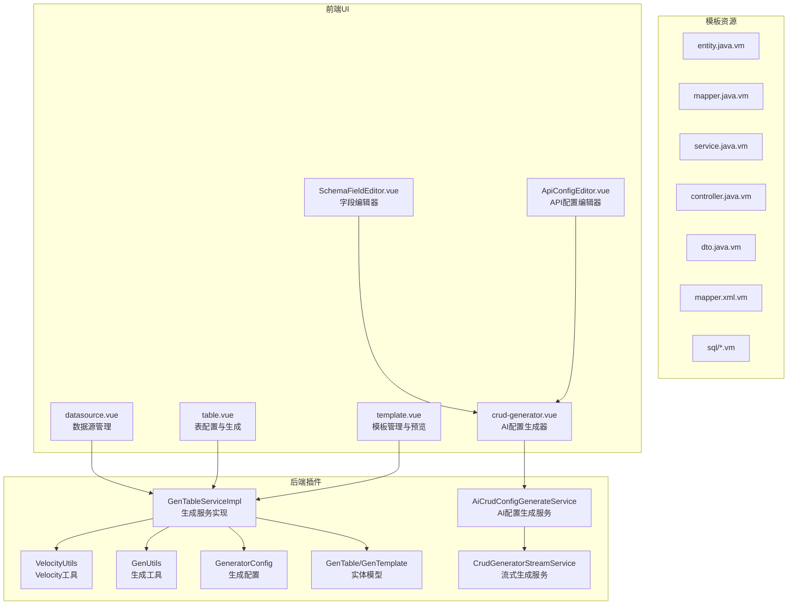
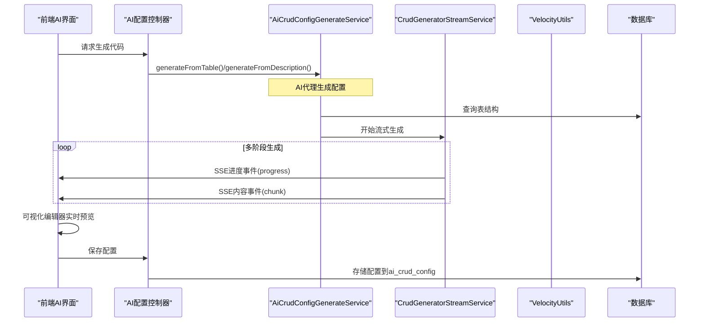
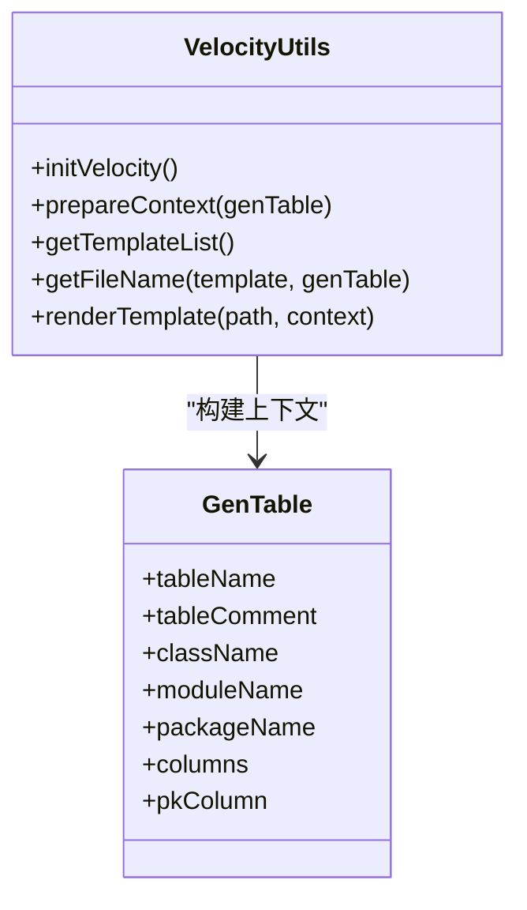
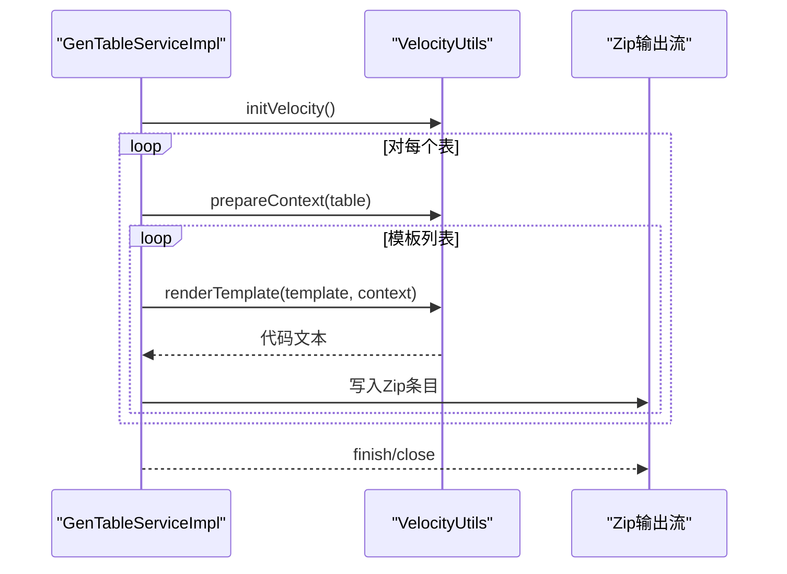
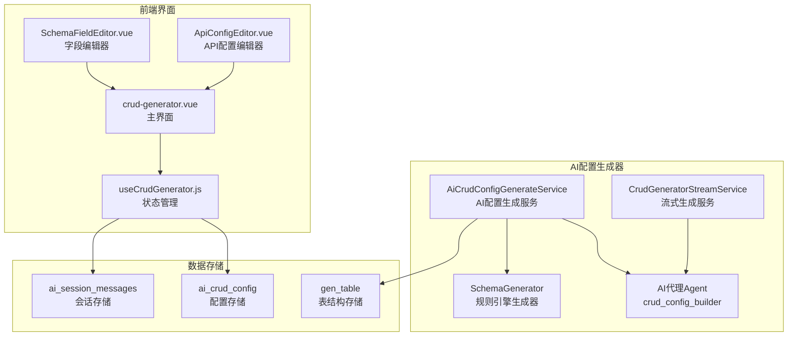
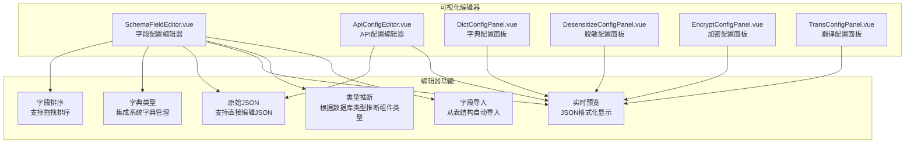
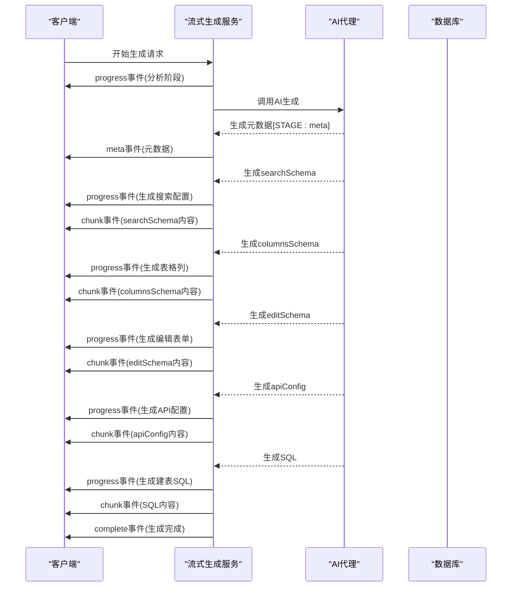
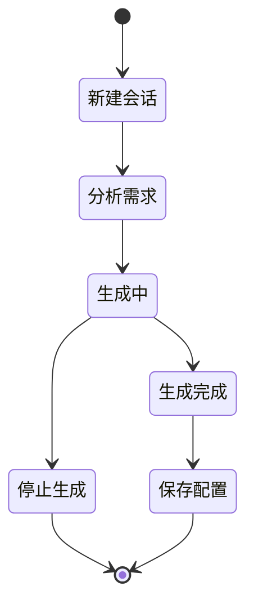
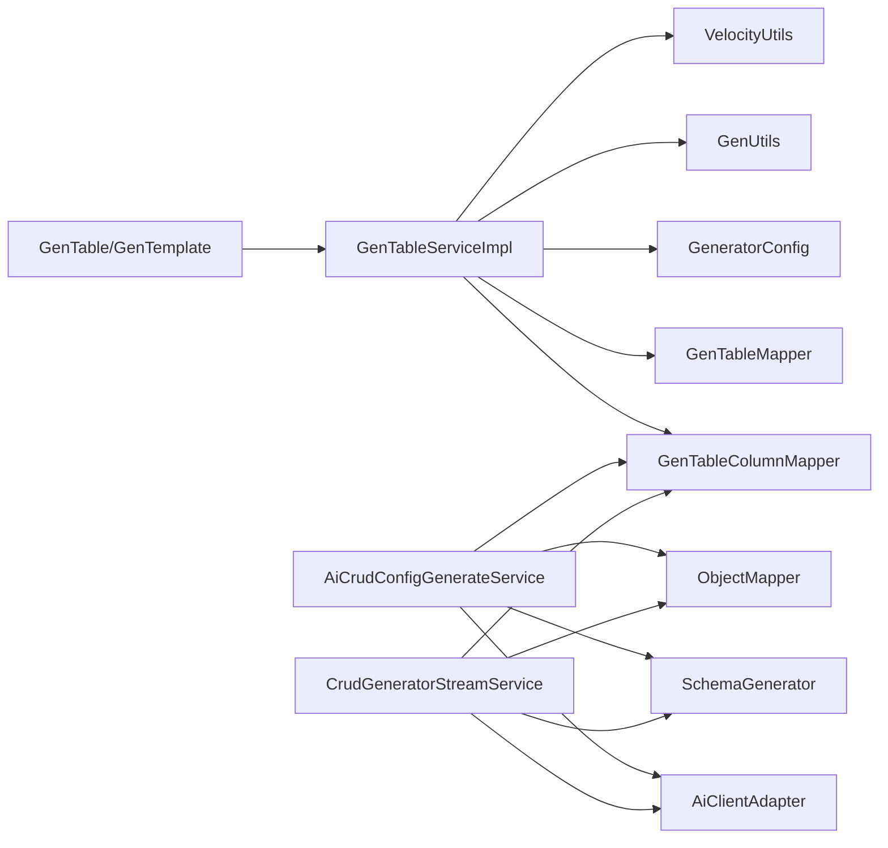

# 代码生成器

<cite>
**本文引用的文件**
- [GenTableServiceImpl.java](file://forge/forge-framework/forge-plugin-parent/forge-plugin-generator/src/main/java/com/mdframe/forge/plugin/generator/service/impl/GenTableServiceImpl.java)
- [VelocityUtils.java](file://forge/forge-framework/forge-plugin-parent/forge-plugin-generator/src/main/java/com/mdframe/forge/plugin/generator/util/VelocityUtils.java)
- [GenUtils.java](file://forge/forge-framework/forge-plugin-parent/forge-plugin-generator/src/main/java/com/mdframe/forge/plugin/generator/util/GenUtils.java)
- [GeneratorConfig.java](file://forge/forge-framework/forge-plugin-parent/forge-plugin-generator/src/main/java/com/mdframe/forge/plugin/generator/config/GeneratorConfig.java)
- [GenTable.java](file://forge/forge-framework/forge-plugin-parent/forge-plugin-generator/src/main/java/com/mdframe/forge/plugin/generator/domain/entity/GenTable.java)
- [GenTemplate.java](file://forge/forge-framework/forge-plugin-parent/forge-plugin-generator/src/main/java/com/mdframe/forge/plugin/generator/domain/entity/GenTemplate.java)
- [generator_tables.sql](file://forge/forge-framework/forge-plugin-parent/forge-plugin-generator/src/main/resources/sql/generator_tables.sql)
- [application.yml](file://forge/forge-framework/forge-plugin-parent/forge-plugin-generator/src/main/resources/application.yml)
- [entity.java.vm](file://forge/forge-framework/forge-plugin-parent/forge-plugin-generator/src/main/resources/templates/vm/entity.java.vm)
- [GenController.java](file://forge/forge-framework/forge-plugin-parent/forge-plugin-generator/src/main/java/com/mdframe/forge/plugin/generator/controller/GenController.java)
- [datasource.vue](file://forge-admin-ui/src/views/generator/datasource.vue)
- [table.vue](file://forge-admin-ui/src/views/generator/table.vue)
- [template.vue](file://forge-admin-ui/src/views/generator/template.vue)
- [crud-generator.vue](file://forge-admin-ui/src/views/ai/crud-generator.vue)
- [useCrudGenerator.js](file://forge-admin-ui/src/composables/useCrudGenerator.js)
- [crud-generator.js](file://forge-admin-ui/src/api/crud-generator.js)
- [crud-generator.css](file://forge-admin-ui/src/views/ai/crud-generator.css)
- [SchemaFieldEditor.vue](file://forge-admin-ui/src/views/ai/components/SchemaFieldEditor.vue)
- [ApiConfigEditor.vue](file://forge-admin-ui/src/views/ai/components/ApiConfigEditor.vue)
- [AiCrudConfigGenerateService.java](file://forge/forge-framework/forge-plugin-parent/forge-plugin-generator/src/main/java/com/mdframe/forge/plugin/generator/service/AiCrudConfigGenerateService.java)
- [CrudGeneratorStreamService.java](file://forge/forge-framework/forge-plugin-parent/forge-plugin-generator/src/main/java/com/mdframe/forge/plugin/generator/service/CrudGeneratorStreamService.java)
- [2026-04-21-crud-generator-design.md](file://docs/superpowers/specs/2026-04-21-crud-generator-design.md)
</cite>

## 更新摘要
**变更内容**
- 新增AI驱动的CRUD配置生成器功能
- 增加多阶段生成流程和流式输出机制
- 引入可视化配置编辑器组件
- 实现会话管理和历史记录功能
- 添加增量生成和右键菜单操作

## 目录
1. [简介](#简介)
2. [项目结构](#项目结构)
3. [核心组件](#核心组件)
4. [架构总览](#架构总览)
5. [详细组件分析](#详细组件分析)
6. [AI驱动的CRUD配置生成器](#ai驱动的crud配置生成器)
7. [可视化配置编辑器](#可视化配置编辑器)
8. [多阶段生成流程](#多阶段生成流程)
9. [会话管理与历史记录](#会话管理与历史记录)
10. [依赖关系分析](#依赖关系分析)
11. [性能考量](#性能考量)
12. [故障排查指南](#故障排查指南)
13. [结论](#结论)
14. [附录](#附录)

## 简介
本技术文档面向Forge框架的代码生成器功能，系统性阐述基于数据库表结构的自动化代码生成能力。文档覆盖表结构导入机制、模板引擎配置、代码生成流程、输出格式定制、Velocity模板语法、生成规则配置、批量生成操作、代码预览功能。**特别新增**AI驱动的CRUD配置生成器功能，包括多阶段生成流程、可视化配置编辑器、会话管理与历史记录等重大增强功能，帮助开发者高效利用代码生成器提升开发效率。

## 项目结构
代码生成器位于Forge框架的插件体系中，采用"插件-模板-前端UI"三层协作：
- 后端插件层：负责表结构导入、模板渲染、批量生成与预览
- 模板层：内置Velocity模板，覆盖实体、Mapper、Service、Controller、DTO、XML及SQL脚本
- 前端UI层：提供数据源管理、表配置、模板管理与代码生成的可视化操作界面

**更新** 新增AI驱动的CRUD配置生成器，采用"AI代理-流式生成-可视化编辑"的全新架构模式。

**图表来源**
- [GenTableServiceImpl.java:1-273](file://forge/forge-framework/forge-plugin-parent/forge-plugin-generator/src/main/java/com/mdframe/forge/plugin/generator/service/impl/GenTableServiceImpl.java#L1-L273)
- [VelocityUtils.java:1-155](file://forge/forge-framework/forge-plugin-parent/forge-plugin-generator/src/main/java/com/mdframe/forge/plugin/generator/util/VelocityUtils.java#L1-L155)
- [GenUtils.java:1-238](file://forge/forge-framework/forge-plugin-parent/forge-plugin-generator/src/main/java/com/mdframe/forge/plugin/generator/util/GenUtils.java#L1-L238)
- [GeneratorConfig.java:1-50](file://forge/forge-framework/forge-plugin-parent/forge-plugin-generator/src/main/java/com/mdframe/forge/plugin/generator/config/GeneratorConfig.java#L1-L50)
- [GenTable.java:1-147](file://forge/forge-framework/forge-plugin-parent/forge-plugin-generator/src/main/java/com/mdframe/forge/plugin/generator/domain/entity/GenTable.java#L1-L147)
- [GenTemplate.java:1-89](file://forge/forge-framework/forge-plugin-parent/forge-plugin-generator/src/main/java/com/mdframe/forge/plugin/generator/domain/entity/GenTemplate.java#L1-L89)
- [AiCrudConfigGenerateService.java:1-219](file://forge/forge-framework/forge-plugin-parent/forge-plugin-generator/src/main/java/com/mdframe/forge/plugin/generator/service/AiCrudConfigGenerateService.java#L1-L219)
- [CrudGeneratorStreamService.java:1-302](file://forge/forge-framework/forge-plugin-parent/forge-plugin-generator/src/main/java/com/mdframe/forge/plugin/generator/service/CrudGeneratorStreamService.java#L1-L302)
- [crud-generator.vue:1-748](file://forge-admin-ui/src/views/ai/crud-generator.vue#L1-L748)
- [SchemaFieldEditor.vue:1-552](file://forge-admin-ui/src/views/ai/components/SchemaFieldEditor.vue#L1-L552)
- [ApiConfigEditor.vue:1-183](file://forge-admin-ui/src/views/ai/components/ApiConfigEditor.vue#L1-L183)

## 核心组件
- 生成服务实现：负责表结构导入、批量生成、单表生成、代码预览与配置更新
- Velocity工具：初始化引擎、准备上下文、模板列表、文件名解析与模板渲染
- 生成工具：数据库类型到Java类型的映射、表名/列名转换、HTML类型推断、字典翻译识别、主键列提取等
- 生成配置：全局作者、包名、模块名、模板引擎、表前缀、基础路径等
- 实体模型：GenTable（表配置）、GenTableColumn（列配置）、GenTemplate（模板配置）
- 模板资源：内置Velocity模板集合，覆盖实体、Mapper、Service、Controller、DTO、XML及SQL脚本
- 前端UI：数据源管理、表配置与生成、模板管理与预览
- **AI配置生成服务**：基于AI代理的CRUD配置生成，支持自然语言描述和表结构导入
- **流式生成服务**：实现多阶段、分阶段的流式代码生成，支持进度跟踪和增量输出
- **可视化编辑器**：提供字段配置、API配置、字典配置等可视化编辑功能

**章节来源**
- [GenTableServiceImpl.java:1-273](file://forge/forge-framework/forge-plugin-parent/forge-plugin-generator/src/main/java/com/mdframe/forge/plugin/generator/service/impl/GenTableServiceImpl.java#L1-L273)
- [VelocityUtils.java:1-155](file://forge/forge-framework/forge-plugin-parent/forge-plugin-generator/src/main/java/com/mdframe/forge/plugin/generator/util/VelocityUtils.java#L1-L155)
- [GenUtils.java:1-238](file://forge/forge-framework/forge-plugin-parent/forge-plugin-generator/src/main/java/com/mdframe/forge/plugin/generator/util/GenUtils.java#L1-L238)
- [GeneratorConfig.java:1-50](file://forge/forge-framework/forge-plugin-parent/forge-plugin-generator/src/main/java/com/mdframe/forge/plugin/generator/config/GeneratorConfig.java#L1-L50)
- [GenTable.java:1-147](file://forge/forge-framework/forge-plugin-parent/forge-plugin-generator/src/main/java/com/mdframe/forge/plugin/generator/domain/entity/GenTable.java#L1-L147)
- [GenTemplate.java:1-89](file://forge/forge-framework/forge-plugin-parent/forge-plugin-generator/src/main/java/com/mdframe/forge/plugin/generator/domain/entity/GenTemplate.java#L1-L89)
- [AiCrudConfigGenerateService.java:1-219](file://forge/forge-framework/forge-plugin-parent/forge-plugin-generator/src/main/java/com/mdframe/forge/plugin/generator/service/AiCrudConfigGenerateService.java#L1-L219)
- [CrudGeneratorStreamService.java:1-302](file://forge/forge-framework/forge-plugin-parent/forge-plugin-generator/src/main/java/com/mdframe/forge/plugin/generator/service/CrudGeneratorStreamService.java#L1-L302)

## 架构总览
代码生成器采用"配置驱动 + 模板渲染"的传统架构，**新增**AI驱动的CRUD配置生成器采用"AI代理-流式生成-可视化编辑"的现代化架构模式：

**图表来源**
- [AiCrudConfigGenerateService.java:29-66](file://forge/forge-framework/forge-plugin-parent/forge-plugin-generator/src/main/java/com/mdframe/forge/plugin/generator/service/AiCrudConfigGenerateService.java#L29-L66)
- [CrudGeneratorStreamService.java:38-61](file://forge/forge-framework/forge-plugin-parent/forge-plugin-generator/src/main/java/com/mdframe/forge/plugin/generator/service/CrudGeneratorStreamService.java#L38-L61)
- [crud-generator.vue:137-211](file://forge-admin-ui/src/views/ai/crud-generator.vue#L137-L211)

## 详细组件分析

### 表结构导入机制
- 支持默认数据源与指定数据源两种导入方式
- 导入流程包括：查询表信息与列信息、初始化表与列配置、删除旧配置并插入新配置
- 支持自动移除表前缀、设置包名、模块名、作者、模板引擎等

**图表来源**
- [GenTableServiceImpl.java:48-111](file://forge/forge-framework/forge-plugin-parent/forge-plugin-generator/src/main/java/com/mdframe/forge/plugin/generator/service/impl/GenTableServiceImpl.java#L48-L111)
- [GenUtils.java:86-96](file://forge/forge-framework/forge-plugin-parent/forge-plugin-generator/src/main/java/com/mdframe/forge/plugin/generator/util/GenUtils.java#L86-L96)

**章节来源**
- [GenTableServiceImpl.java:48-111](file://forge/forge-framework/forge-plugin-parent/forge-plugin-generator/src/main/java/com/mdframe/forge/plugin/generator/service/impl/GenTableServiceImpl.java#L48-L111)
- [GenUtils.java:86-96](file://forge/forge-framework/forge-plugin-parent/forge-plugin-generator/src/main/java/com/mdframe/forge/plugin/generator/util/GenUtils.java#L86-L96)

### 模板引擎配置与上下文
- Velocity初始化：设置资源加载器、输入输出编码
- 上下文准备：注入表基本信息、列信息、导入判断标志、模块路径等
- 模板列表：内置标准模板集合（实体、Mapper、Service、Controller、DTO、XML、SQL脚本）
- 文件名解析：根据模板类型与表配置生成目标文件路径

**图表来源**
- [VelocityUtils.java:21-153](file://forge/forge-framework/forge-plugin-parent/forge-plugin-generator/src/main/java/com/mdframe/forge/plugin/generator/util/VelocityUtils.java#L21-L153)
- [GenTable.java:1-147](file://forge/forge-framework/forge-plugin-parent/forge-plugin-generator/src/main/java/com/mdframe/forge/plugin/generator/domain/entity/GenTable.java#L1-L147)

**章节来源**
- [VelocityUtils.java:21-153](file://forge/forge-framework/forge-plugin-parent/forge-plugin-generator/src/main/java/com/mdframe/forge/plugin/generator/util/VelocityUtils.java#L21-L153)
- [GenTable.java:1-147](file://forge/forge-framework/forge-plugin-parent/forge-plugin-generator/src/main/java/com/mdframe/forge/plugin/generator/domain/entity/GenTable.java#L1-L147)

### 代码生成流程
- 单表生成：查询表与列配置，初始化Velocity，遍历模板渲染并打包为ZIP
- 批量生成：对多个表重复上述流程，合并到同一ZIP
- 代码预览：不打包，返回文件名到代码内容的映射，便于前端展示

**图表来源**
- [GenTableServiceImpl.java:114-191](file://forge/forge-framework/forge-plugin-parent/forge-plugin-generator/src/main/java/com/mdframe/forge/plugin/generator/service/impl/GenTableServiceImpl.java#L114-L191)
- [VelocityUtils.java:93-153](file://forge/forge-framework/forge-plugin-parent/forge-plugin-generator/src/main/java/com/mdframe/forge/plugin/generator/util/VelocityUtils.java#L93-L153)

**章节来源**
- [GenTableServiceImpl.java:114-191](file://forge/forge-framework/forge-plugin-parent/forge-plugin-generator/src/main/java/com/mdframe/forge/plugin/generator/service/impl/GenTableServiceImpl.java#L114-L191)
- [VelocityUtils.java:93-153](file://forge/forge-framework/forge-plugin-parent/forge-plugin-generator/src/main/java/com/mdframe/forge/plugin/generator/util/VelocityUtils.java#L93-L153)

### 输出格式定制
- 文件路径：按包名与模块名生成标准目录结构
- 文件后缀：由模板配置决定（如.java、.xml、.sql）
- 生成方式：支持下载ZIP包或直接生成到项目（当前UI默认下载）

**章节来源**
- [VelocityUtils.java:112-144](file://forge/forge-framework/forge-plugin-parent/forge-plugin-generator/src/main/java/com/mdframe/forge/plugin/generator/util/VelocityUtils.java#L112-L144)
- [table.vue:354-378](file://forge-admin-ui/src/views/generator/table.vue#L354-L378)

### Velocity模板语法与内置变量
- 基础变量：表名、注释、类名、业务名、模块名、包名、作者、生成时间
- 列信息：columns（过滤基类字段）、pkColumn（主键列）
- 导入判断：hasBigDecimal、hasDate、hasBaseEntity、hasDictTrans
- 模块路径：modulePath
- 控制结构：条件判断、循环遍历列

**章节来源**
- [VelocityUtils.java:32-68](file://forge/forge-framework/forge-plugin-parent/forge-plugin-generator/src/main/java/com/mdframe/forge/plugin/generator/util/VelocityUtils.java#L32-L68)
- [entity.java.vm:1-58](file://forge/forge-framework/forge-plugin-parent/forge-plugin-generator/src/main/resources/templates/vm/entity.java.vm#L1-L58)

### 生成规则配置
- 全局配置：作者、包名、模块名、模板引擎、表前缀、基础路径
- 表级配置：类名、业务名、功能名、模块名、包名、作者、生成方式、模板引擎、生成路径、选项等
- 模板配置：模板名称、编码、类型、引擎、内容、文件后缀、路径、启用状态、排序等

**章节来源**
- [GeneratorConfig.java:1-50](file://forge/forge-framework/forge-plugin-parent/forge-plugin-generator/src/main/java/com/mdframe/forge/plugin/generator/config/GeneratorConfig.java#L1-L50)
- [GenTable.java:1-147](file://forge/forge-framework/forge-plugin-parent/forge-plugin-generator/src/main/java/com/mdframe/forge/plugin/generator/domain/entity/GenTable.java#L1-L147)
- [GenTemplate.java:1-89](file://forge/forge-framework/forge-plugin-parent/forge-plugin-generator/src/main/java/com/mdframe/forge/plugin/generator/domain/entity/GenTemplate.java#L1-L89)
- [application.yml:1-18](file://forge/forge-framework/forge-plugin-parent/forge-plugin-generator/src/main/resources/application.yml#L1-L18)

### 批量生成操作
- 支持传入多个表名进行批量生成，统一初始化Velocity并逐表渲染模板
- 输出为单一ZIP包，便于下载与归档

**章节来源**
- [GenTableServiceImpl.java:157-191](file://forge/forge-framework/forge-plugin-parent/forge-plugin-generator/src/main/java/com/mdframe/forge/plugin/generator/service/impl/GenTableServiceImpl.java#L157-L191)

### 代码预览功能
- 预览接口返回文件名到代码内容的映射
- 前端以只读编辑器展示，支持复制与保存

**章节来源**
- [GenTableServiceImpl.java:193-216](file://forge/forge-framework/forge-plugin-parent/forge-plugin-generator/src/main/java/com/mdframe/forge/plugin/generator/service/impl/GenTableServiceImpl.java#L193-L216)
- [table.vue:348-352](file://forge-admin-ui/src/views/generator/table.vue#L348-L352)

### 前端使用示例
- 数据源管理：支持新增、编辑、删除、测试连接
- 表配置：支持导入表、字段配置、预览、生成、删除
- 模板管理：支持新增、编辑、复制、预览、删除（系统内置模板不可删除）

**章节来源**
- [datasource.vue:1-350](file://forge-admin-ui/src/views/generator/datasource.vue#L1-L350)
- [table.vue:1-396](file://forge-admin-ui/src/views/generator/table.vue#L1-L396)
- [template.vue:1-542](file://forge-admin-ui/src/views/generator/template.vue#L1-L542)

## AI驱动的CRUD配置生成器

### 功能概述
AI驱动的CRUD配置生成器是Forge框架的重大增强功能，提供类似豆包/Cursor的专业AI配置生成体验。该功能支持自然语言描述和已有表结构两种生成模式，具备多阶段生成、流式输出、可视化编辑等特性。

### 核心架构

**图表来源**
- [AiCrudConfigGenerateService.java:24-27](file://forge/forge-framework/forge-plugin-parent/forge-plugin-generator/src/main/java/com/mdframe/forge/plugin/generator/service/AiCrudConfigGenerateService.java#L24-L27)
- [CrudGeneratorStreamService.java:26-29](file://forge/forge-framework/forge-plugin-parent/forge-plugin-generator/src/main/java/com/mdframe/forge/plugin/generator/service/CrudGeneratorStreamService.java#L26-L29)
- [crud-generator.vue:267-313](file://forge-admin-ui/src/views/ai/crud-generator.vue#L267-L313)

### 生成模式
AI配置生成器支持两种主要生成模式：

#### 1. 自然语言描述生成
用户输入业务需求描述，AI推断表结构和配置：
- 输入：configKey + 自然语言描述
- 输出：完整的CRUD配置（searchSchema + columnsSchema + editSchema + apiConfig）
- 特点：无需现有表结构，完全基于自然语言理解

#### 2. 表结构导入生成
用户选择已有数据库表，系统读取表元数据并生成配置：
- 输入：configKey + tableName
- 输出：基于表结构的完整CRUD配置
- 特点：精确匹配表字段，支持AI优化

**章节来源**
- [AiCrudConfigGenerateService.java:29-66](file://forge/forge-framework/forge-plugin-parent/forge-plugin-generator/src/main/java/com/mdframe/forge/plugin/generator/service/AiCrudConfigGenerateService.java#L29-L66)
- [2026-04-21-crud-generator-design.md:181-187](file://docs/superpowers/specs/2026-04-21-crud-generator-design.md#L181-L187)

### AI代理配置
系统使用专门的AI代理`crud_config_builder`来处理CRUD配置生成：

- **systemPrompt**：指导AI根据表结构或自然语言生成完整CRUD页面配置
- **输出格式**：标准JSON格式，包含前端三套Schema + apiConfig + 推荐的表名/表注释/菜单名称/菜单路径等
- **降级机制**：当AI不可用时，自动降级到规则引擎生成基础配置

**章节来源**
- [AiCrudConfigGenerateService.java:73-89](file://forge/forge-framework/forge-plugin-parent/forge-plugin-generator/src/main/java/com/mdframe/forge/plugin/generator/service/AiCrudConfigGenerateService.java#L73-L89)
- [2026-04-21-crud-generator-design.md:182-186](file://docs/superpowers/specs/2026-04-21-crud-generator-design.md#L182-L186)

## 可视化配置编辑器

### 编辑器组件架构
可视化配置编辑器提供多种专用编辑器组件，支持实时预览和编辑：

**图表来源**
- [SchemaFieldEditor.vue:94-108](file://forge-admin-ui/src/views/ai/components/SchemaFieldEditor.vue#L94-L108)
- [ApiConfigEditor.vue:38-45](file://forge-admin-ui/src/views/ai/components/ApiConfigEditor.vue#L38-L45)

### 字段配置编辑器
字段配置编辑器支持三种模式的可视化编辑：

#### 搜索配置编辑器（searchSchema）
- 字段：字段名（驼峰命名）
- 标签：中文显示标签
- 类型：输入框、下拉框、日期范围、数字、日期等
- 字典类型：可选的字典类型配置

#### 表格列配置编辑器（columnsSchema）
- 字段：字段名（驼峰命名）
- 标题：中文列标题
- 类型：文本、标签（字典）、日期、数字等
- 宽度：列宽设置
- 字典类型：可选的字典类型配置

#### 编辑表单配置编辑器（editSchema）
- 字段：字段名（驼峰命名）
- 标签：中文表单标签
- 类型：输入框、多行文本、下拉框、单选、复选框、开关、日期、日期时间、数字、文件上传等
- 必填：字段验证设置
- 字典类型：可选的字典类型配置

**章节来源**
- [SchemaFieldEditor.vue:135-195](file://forge-admin-ui/src/views/ai/components/SchemaFieldEditor.vue#L135-L195)
- [SchemaFieldEditor.vue:347-464](file://forge-admin-ui/src/views/ai/components/SchemaFieldEditor.vue#L347-L464)

### API配置编辑器
API配置编辑器提供直观的RESTful API配置界面：

- **列表接口**：GET /xxx/page
- **详情接口**：GET /xxx/{id}
- **新增接口**：POST /xxx
- **编辑接口**：PUT /xxx
- **删除接口**：DELETE /xxx/{id}

支持方法选择和路径配置，同时提供原始JSON编辑模式。

**章节来源**
- [ApiConfigEditor.vue:49-62](file://forge-admin-ui/src/views/ai/components/ApiConfigEditor.vue#L49-L62)
- [ApiConfigEditor.vue:109-117](file://forge-admin-ui/src/views/ai/components/ApiConfigEditor.vue#L109-L117)

### 字典配置面板
字典配置面板支持：
- 字典类型选择
- 字典翻译配置
- 与字段配置的联动
- 实时预览和编辑

**章节来源**
- [DictConfigPanel.vue](file://forge-admin-ui/src/views/ai/components/DictConfigPanel.vue)

### 脱敏配置面板
脱敏配置面板支持敏感信息保护：
- 手机号脱敏
- 身份证号脱敏
- 银行卡号脱敏
- 邮箱地址脱敏
- 自定义脱敏规则

**章节来源**
- [DesensitizeConfigPanel.vue](file://forge-admin-ui/src/views/ai/components/DesensitizeConfigPanel.vue)

### 加密配置面板
加密配置面板支持：
- 接口数据加密
- 敏感字段加密
- 加密算法配置
- 密钥管理

**章节来源**
- [EncryptConfigPanel.vue](file://forge-admin-ui/src/views/ai/components/EncryptConfigPanel.vue)

### 翻译配置面板
翻译配置面板支持：
- 字典字段翻译
- 多语言支持
- 翻译规则配置
- 实时翻译预览

**章节来源**
- [TransConfigPanel.vue](file://forge-admin-ui/src/views/ai/components/TransConfigPanel.vue)

## 多阶段生成流程

### 流式生成机制
多阶段生成流程通过Server-Sent Events (SSE) 实现流式输出，提供实时的生成进度反馈：

**图表来源**
- [CrudGeneratorStreamService.java:68-110](file://forge/forge-framework/forge-plugin-parent/forge-plugin-generator/src/main/java/com/mdframe/forge/plugin/generator/service/CrudGeneratorStreamService.java#L68-L110)
- [crud-generator.js:18-135](file://forge-admin-ui/src/api/crud-generator.js#L18-L135)

### 阶段标识系统
多阶段生成使用特定的阶段标识来组织输出内容：

| 阶段标识 | 阶段名称 | 功能描述 |
|---------|---------|----------|
| [STAGE:meta] | 元数据推断 | AI推断configKey、tableName、tableComment等元数据 |
| [STAGE:searchSchema] | 搜索配置生成 | 生成搜索表单配置数组 |
| [STAGE:columnsSchema] | 表格列配置生成 | 生成表格列配置数组 |
| [STAGE:editSchema] | 编辑表单配置生成 | 生成编辑表单配置数组 |
| [STAGE:apiConfig] | API配置生成 | 生成API接口配置对象 |
| [STAGE:createTableSql] | 建表SQL生成 | 生成CREATE TABLE SQL语句 |

**章节来源**
- [CrudGeneratorStreamService.java:31-36](file://forge/forge-framework/forge-plugin-parent/forge-plugin-generator/src/main/java/com/mdframe/forge/plugin/generator/service/CrudGeneratorStreamService.java#L31-L36)
- [CrudGeneratorStreamService.java:82-101](file://forge/forge-framework/forge-plugin-parent/forge-plugin-generator/src/main/java/com/mdframe/forge/plugin/generator/service/CrudGeneratorStreamService.java#L82-L101)

### 增量生成功能
系统支持增量生成和右键菜单操作：

- **右键菜单**：支持重新生成单项、清空内容、复制内容等操作
- **单项生成**：用户可以单独重新生成某个配置部分
- **内容管理**：支持清空特定配置、复制配置内容
- **实时预览**：生成过程中实时更新预览内容

**章节来源**
- [crud-generator.vue:431-496](file://forge-admin-ui/src/views/ai/crud-generator.vue#L431-L496)
- [crud-generator.vue:507-562](file://forge-admin-ui/src/views/ai/crud-generator.vue#L507-L562)

## 会话管理与历史记录

### 会话生命周期
AI配置生成器采用完整的会话管理机制：

### 会话存储
系统提供完整的会话存储和管理功能：

- **会话列表**：显示所有生成会话的历史记录
- **会话详情**：加载特定会话的所有消息和生成内容
- **会话删除**：支持删除不需要的会话记录
- **会话元数据**：自动同步configKey、tableName、description等元数据

**章节来源**
- [useCrudGenerator.js:54-135](file://forge-admin-ui/src/composables/useCrudGenerator.js#L54-L135)
- [crud-generator.js:137-147](file://forge-admin-ui/src/api/crud-generator.js#L137-L147)

### 历史记录功能
- **消息持久化**：所有用户消息和AI回复都会保存到数据库
- **配置恢复**：可以从历史会话恢复到主界面进行继续编辑
- **会话搜索**：支持按configKey、表名、时间等条件搜索会话
- **会话导出**：支持导出会话内容和生成的配置

**章节来源**
- [useCrudGenerator.js:77-122](file://forge-admin-ui/src/composables/useCrudGenerator.js#L77-L122)
- [2026-04-21-crud-generator-design.md:297-310](file://docs/superpowers/specs/2026-04-21-crud-generator-design.md#L297-L310)

## 依赖关系分析
- 生成服务依赖：GenTableMapper、GenTableColumnMapper、IGenDatasourceService、GeneratorConfig
- 模板工具依赖：Velocity引擎、GenUtils工具方法
- 实体模型依赖：MyBatis-Plus注解、Jackson TypeHandler用于options字段序列化
- 前端依赖：HTTP API、CodeMirror编辑器、Naive UI组件
- **AI服务依赖**：AiClientAdapter、SchemaGenerator、GenTableColumnMapper
- **流式服务依赖**：Spring WebFlux、ServerSentEvent、Reactor

**图表来源**
- [GenTableServiceImpl.java:35-40](file://forge/forge-framework/forge-plugin-parent/forge-plugin-generator/src/main/java/com/mdframe/forge/plugin/generator/service/impl/GenTableServiceImpl.java#L35-L40)
- [AiCrudConfigGenerateService.java:24-27](file://forge/forge-framework/forge-plugin-parent/forge-plugin-generator/src/main/java/com/mdframe/forge/plugin/generator/service/AiCrudConfigGenerateService.java#L24-L27)
- [CrudGeneratorStreamService.java:26-29](file://forge/forge-framework/forge-plugin-parent/forge-plugin-generator/src/main/java/com/mdframe/forge/plugin/generator/service/CrudGeneratorStreamService.java#L26-L29)

**章节来源**
- [GenTableServiceImpl.java:35-40](file://forge/forge-framework/forge-plugin-parent/forge-plugin-generator/src/main/java/com/mdframe/forge/plugin/generator/service/impl/GenTableServiceImpl.java#L35-L40)
- [AiCrudConfigGenerateService.java:24-27](file://forge/forge-framework/forge-plugin-parent/forge-plugin-generator/src/main/java/com/mdframe/forge/plugin/generator/service/AiCrudConfigGenerateService.java#L24-L27)
- [CrudGeneratorStreamService.java:26-29](file://forge/forge-framework/forge-plugin-parent/forge-plugin-generator/src/main/java/com/mdframe/forge/plugin/generator/service/CrudGeneratorStreamService.java#L26-L29)

## 性能考量
- 模板渲染：建议减少模板数量与复杂度，避免在模板中执行重型逻辑
- 批量生成：合理控制并发与内存占用，必要时拆分批次生成
- 数据库访问：导入与查询阶段尽量复用连接与事务，避免N+1查询
- 输出压缩：ZIP生成时注意编码与缓冲区大小，避免内存溢出
- 前端预览：对大文件采用懒加载与分页展示，提升交互体验
- **AI生成优化**：合理设置AI超时时间，实现智能降级机制
- **流式传输**：优化SSE连接，实现断线重连和进度恢复
- **编辑器性能**：对大量字段配置采用虚拟滚动和延迟渲染

## 故障排查指南
- 导入失败：检查数据源连接、表是否存在、是否已配置默认数据源
- 模板渲染异常：核对模板语法、上下文变量是否完整、编码设置
- 生成失败：查看日志错误堆栈，确认表配置完整性与模板路径正确性
- 预览空白：确认模板预览接口返回的数据结构与前端解析一致
- **AI生成失败**：检查AI代理配置、网络连接、降级机制是否正常工作
- **流式生成异常**：检查SSE连接状态、事件格式、客户端重连逻辑
- **编辑器异常**：验证JSON格式、字段类型、字典配置的有效性

**章节来源**
- [GenTableServiceImpl.java:148-154](file://forge/forge-framework/forge-plugin-parent/forge-plugin-generator/src/main/java/com/mdframe/forge/plugin/generator/service/impl/GenTableServiceImpl.java#L148-L154)
- [GenTableServiceImpl.java:210-213](file://forge/forge-framework/forge-plugin-parent/forge-plugin-generator/src/main/java/com/mdframe/forge/plugin/generator/service/impl/GenTableServiceImpl.java#L210-L213)
- [AiCrudConfigGenerateService.java:75-89](file://forge/forge-framework/forge-plugin-parent/forge-plugin-generator/src/main/java/com/mdframe/forge/plugin/generator/service/AiCrudConfigGenerateService.java#L75-L89)

## 结论
Forge框架的代码生成器通过"配置驱动 + 模板渲染"的传统设计，实现了从数据库表结构到多层级Java代码的自动化生成。**新增的AI驱动CRUD配置生成器**进一步提升了开发效率，通过"AI代理-流式生成-可视化编辑"的现代化架构，为开发者提供了类似专业IDE的配置生成体验。

该增强功能包括：
- 多阶段、分阶段的流式生成机制
- 丰富的可视化配置编辑器组件
- 完整的会话管理和历史记录功能
- 智能降级和错误恢复机制
- 支持自然语言描述和表结构导入两种生成模式

建议在实际项目中结合团队规范，充分利用AI生成器的强大功能，持续优化性能与可维护性。

## 附录

### 数据库表结构与配置
- 生成表配置表：gen_table
- 生成模板配置表：gen_template
- AI配置存储表：ai_crud_config
- AI会话存储表：ai_session_messages
- 初始化SQL脚本：generator_tables.sql

**章节来源**
- [generator_tables.sql:84-102](file://forge/forge-framework/forge-plugin-parent/forge-plugin-generator/src/main/resources/sql/generator_tables.sql#L84-L102)

### AI配置生成器接口
- **流式生成接口**：`POST /ai/crud-generator/stream-generate`
- **AI配置生成接口**：`POST /ai/crud-config/ai/generate`
- **会话列表接口**：`GET /ai/admin/session/page`
- **会话消息接口**：`GET /ai/admin/session/{id}/messages`
- **会话删除接口**：`DELETE /ai/admin/session/{id}`

**章节来源**
- [2026-04-21-crud-generator-design.md:181-202](file://docs/superpowers/specs/2026-04-21-crud-generator-design.md#L181-L202)
- [crud-generator.js:137-147](file://forge-admin-ui/src/api/crud-generator.js#L137-L147)

### 可视化编辑器组件
- **字段编辑器**：支持三种模式的字段配置编辑
- **API编辑器**：RESTful API配置的可视化编辑
- **字典面板**：字典类型和翻译配置管理
- **脱敏面板**：敏感信息脱敏规则配置
- **加密面板**：接口和字段加密配置
- **翻译面板**：多语言翻译配置管理

**章节来源**
- [SchemaFieldEditor.vue:1-552](file://forge-admin-ui/src/views/ai/components/SchemaFieldEditor.vue#L1-L552)
- [ApiConfigEditor.vue:1-183](file://forge-admin-ui/src/views/ai/components/ApiConfigEditor.vue#L1-L183)