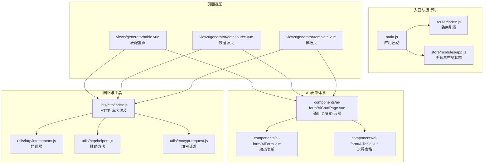
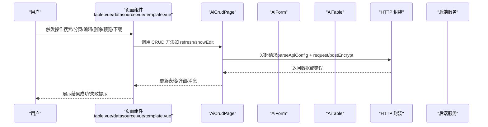
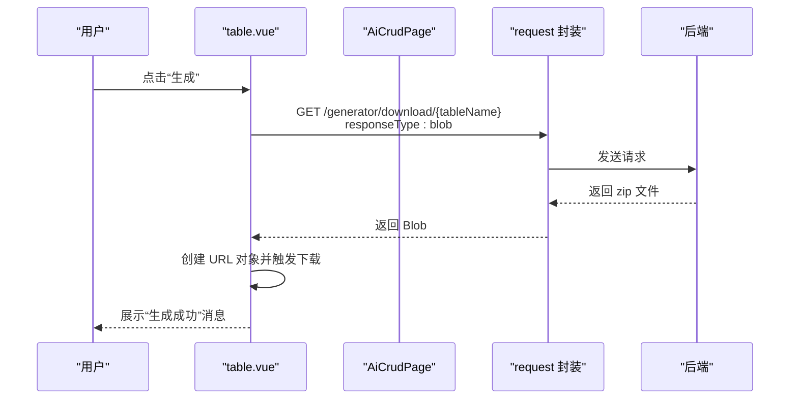
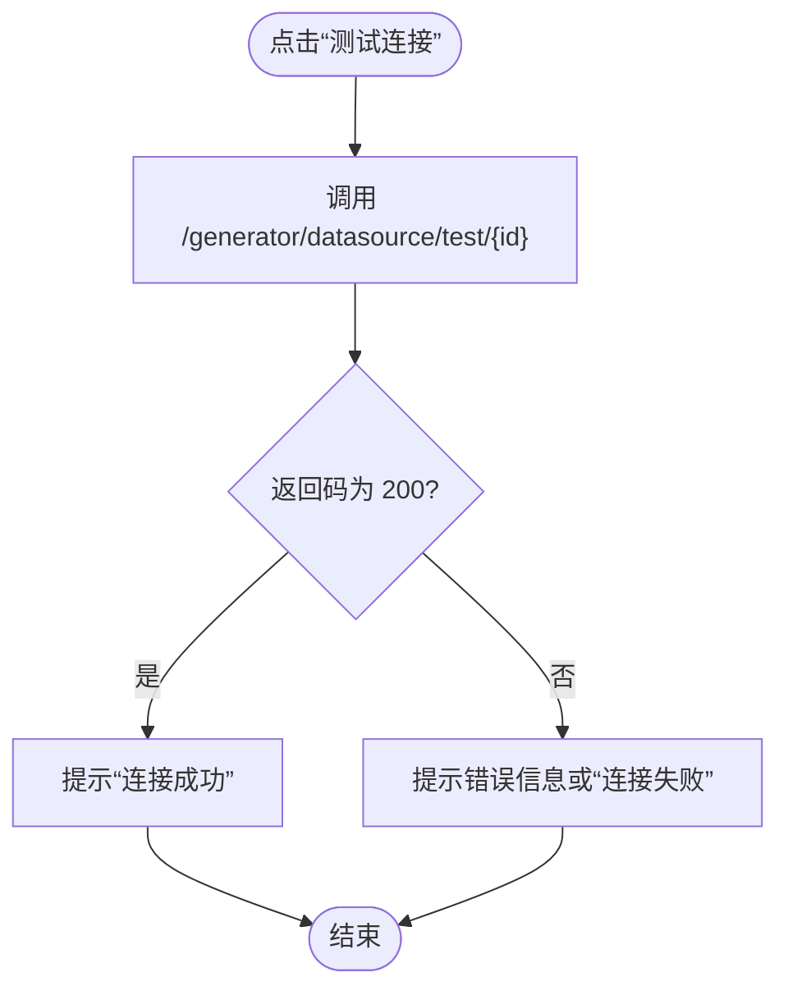
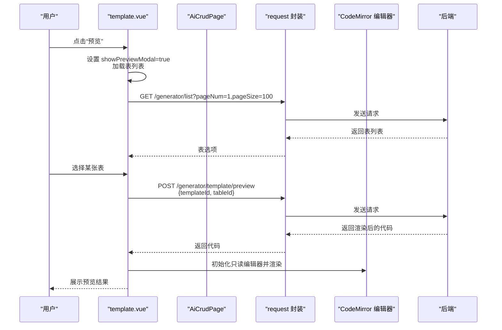
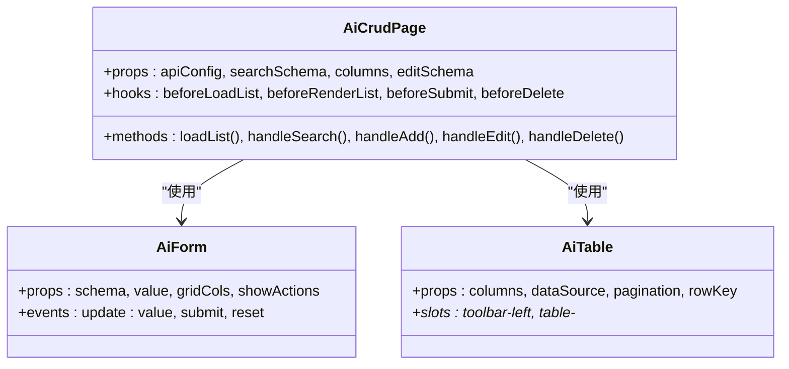
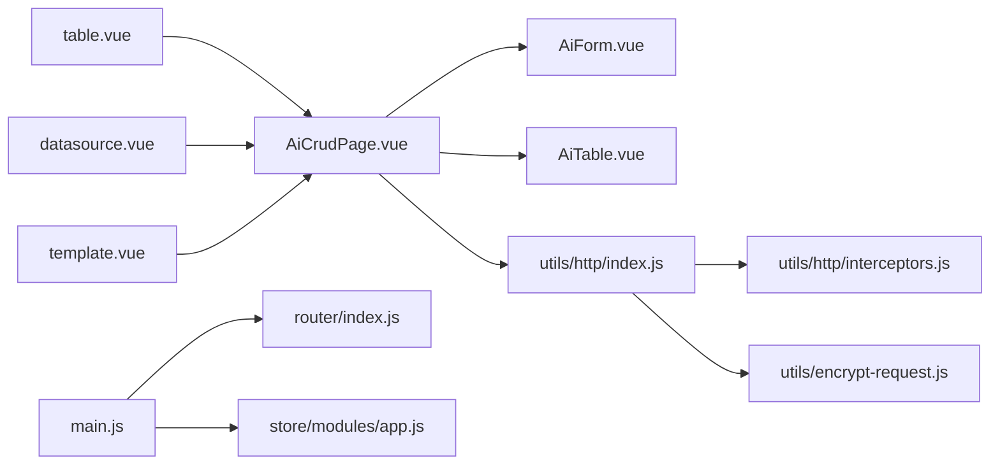

# 前端集成

<cite>
**本文引用的文件**
- [table.vue](file://forge-admin-ui/src/views/generator/table.vue)
- [datasource.vue](file://forge-admin-ui/src/views/generator/datasource.vue)
- [template.vue](file://forge-admin-ui/src/views/generator/template.vue)
- [AiCrudPage.vue](file://forge-admin-ui/src/components/ai-form/AiCrudPage.vue)
- [AiCrudPageProps.js](file://forge-admin-ui/src/components/ai-form/AiCrudPageProps.js)
- [AiForm.vue](file://forge-admin-ui/src/components/ai-form/AiForm.vue)
- [AiTable.vue](file://forge-admin-ui/src/components/ai-form/AiTable.vue)
- [index.js](file://forge-admin-ui/src/utils/http/index.js)
- [interceptors.js](file://forge-admin-ui/src/utils/http/interceptors.js)
- [helpers.js](file://forge-admin-ui/src/utils/http/helpers.js)
- [encrypt-request.js](file://forge-admin-ui/src/utils/encrypt-request.js)
- [main.js](file://forge-admin-ui/src/main.js)
- [router/index.js](file://forge-admin-ui/src/router/index.js)
- [app.js](file://forge-admin-ui/src/store/modules/app.js)
</cite>

## 目录
1. [简介](#简介)
2. [项目结构](#项目结构)
3. [核心组件](#核心组件)
4. [架构总览](#架构总览)
5. [详细组件分析](#详细组件分析)
6. [依赖关系分析](#依赖关系分析)
7. [性能考量](#性能考量)
8. [故障排查指南](#故障排查指南)
9. [结论](#结论)
10. [附录](#附录)

## 简介
本文件面向前端开发者，系统性梳理代码生成器前端集成方案，重点围绕三个核心页面组件（表配置、数据源、模板）的设计思路、数据绑定机制、事件处理流程与状态管理策略进行深入解析；同时说明与后端 API 的对接方式、数据请求封装、错误处理机制与加载状态管理，并总结组件复用策略、样式定制方法、国际化支持与响应式设计的最佳实践。

## 项目结构
代码生成器前端位于 forge-admin-ui 子工程，采用 Vue 3 + Vite 技术栈，结合 Pinia 状态管理、Naive UI 组件库与自研 AI 表单体系（AiCrudPage/AiForm/AiTable），形成“配置即 UI”的 CRUD 快速开发框架。

图表来源
- [main.js](file://forge-admin-ui/src/main.js#L15-L37)
- [router/index.js](file://forge-admin-ui/src/router/index.js#L1-L18)
- [app.js](file://forge-admin-ui/src/store/modules/app.js#L1-L91)
- [table.vue](file://forge-admin-ui/src/views/generator/table.vue#L1-L396)
- [datasource.vue](file://forge-admin-ui/src/views/generator/datasource.vue#L1-L350)
- [template.vue](file://forge-admin-ui/src/views/generator/template.vue#L1-L542)
- [AiCrudPage.vue](file://forge-admin-ui/src/components/ai-form/AiCrudPage.vue#L1-L254)
- [AiForm.vue](file://forge-admin-ui/src/components/ai-form/AiForm.vue#L1-L200)
- [AiTable.vue](file://forge-admin-ui/src/components/ai-form/AiTable.vue#L1-L200)
- [index.js](file://forge-admin-ui/src/utils/http/index.js#L1-L24)
- [interceptors.js](file://forge-admin-ui/src/utils/http/interceptors.js#L1-L200)
- [helpers.js](file://forge-admin-ui/src/utils/http/helpers.js#L1-L200)
- [encrypt-request.js](file://forge-admin-ui/src/utils/encrypt-request.js#L1-L200)

章节来源
- [main.js](file://forge-admin-ui/src/main.js#L15-L37)
- [router/index.js](file://forge-admin-ui/src/router/index.js#L1-L18)
- [app.js](file://forge-admin-ui/src/store/modules/app.js#L1-L91)

## 核心组件
- AiCrudPage：统一的 CRUD 页面容器，负责搜索、表格、新增/编辑弹窗、导入导出、分页与钩子扩展，支持 Modal/Drawer 两种编辑模式。
- AiForm：基于 JSON Schema 动态渲染表单，内置栅格布局、校验规则、折叠/展开、插槽透传。
- AiTable：远程数据表格，封装列设置、密度、刷新、全屏等工具栏能力，支持插槽与上下文传递。

章节来源
- [AiCrudPage.vue](file://forge-admin-ui/src/components/ai-form/AiCrudPage.vue#L1-L254)
- [AiCrudPageProps.js](file://forge-admin-ui/src/components/ai-form/AiCrudPageProps.js#L1-L565)
- [AiForm.vue](file://forge-admin-ui/src/components/ai-form/AiForm.vue#L1-L200)
- [AiTable.vue](file://forge-admin-ui/src/components/ai-form/AiTable.vue#L1-L200)

## 架构总览
三类页面均通过 AiCrudPage 组合 AiForm 与 AiTable 实现一致的 CRUD 体验。页面组件负责：
- 定义搜索 Schema、表格列、编辑 Schema；
- 绑定 API 配置（RESTful 风格，支持 get@/path 与 post@/path）；
- 处理按钮交互（编辑、删除、预览、下载、测试连接、复制模板等）；
- 管理模态框状态与局部状态（当前选中行、当前表名、预览弹窗等）。

网络层通过 utils/http/index.js 封装请求，支持拦截器、加密请求与统一错误提示；Pinia store 管理主题、布局与全局状态；路由在 main.js 中初始化。

图表来源
- [table.vue](file://forge-admin-ui/src/views/generator/table.vue#L1-L396)
- [datasource.vue](file://forge-admin-ui/src/views/generator/datasource.vue#L1-L350)
- [template.vue](file://forge-admin-ui/src/views/generator/template.vue#L1-L542)
- [AiCrudPage.vue](file://forge-admin-ui/src/components/ai-form/AiCrudPage.vue#L527-L642)
- [index.js](file://forge-admin-ui/src/utils/http/index.js#L1-L24)
- [interceptors.js](file://forge-admin-ui/src/utils/http/interceptors.js#L1-L200)
- [encrypt-request.js](file://forge-admin-ui/src/utils/encrypt-request.js#L1-L200)

## 详细组件分析

### 表配置页面（table.vue）
- 设计要点
  - 使用 AiCrudPage 统一承载列表、搜索、编辑、操作列与模态框。
  - 自定义顶部工具栏（导入表）与操作列（配置/字段/预览/生成/删除）。
  - 编辑 Schema 包含基础信息与生成配置，内置必填校验与默认值。
  - 通过 request 封装发起下载（Blob）、删除、刷新等操作。
- 关键交互
  - 导入成功后刷新列表。
  - 字段配置弹窗根据当前表 ID 与表名联动。
  - 代码预览弹窗展示当前表名。
  - 生成按钮触发下载，使用 Blob 与 a 标签触发浏览器下载。
- API 对接
  - 列表/详情/编辑/删除通过 api-config 的字符串约定（get@/path）解析为具体方法与 URL。
  - 下载接口返回二进制流，前端转换为 Blob 并触发下载。
- 状态管理
  - 通过 ref 管理模态框开关与当前行数据，配合 crudRef.refresh() 刷新表格。

图表来源
- [table.vue](file://forge-admin-ui/src/views/generator/table.vue#L355-L378)
- [index.js](file://forge-admin-ui/src/utils/http/index.js#L1-L24)

章节来源
- [table.vue](file://forge-admin-ui/src/views/generator/table.vue#L1-L396)

### 数据源页面（datasource.vue）
- 设计要点
  - 支持数据库类型选择，自动填充驱动类名映射。
  - 密码字段在编辑时可留空（不更新密码）。
  - 提供“测试连接”能力，异步验证数据源连通性。
  - 使用 NTag 渲染启用/默认状态标签。
- 关键交互
  - beforeSubmit 在提交前移除空密码字段。
  - handleTestConnection 调用 /generator/datasource/test/{id} 并根据返回码提示。
  - 删除前二次确认对话框。
- API 对接
  - 列表/详情/新增/编辑/删除通过 api-config 约定。
  - 测试连接调用 /generator/datasource/test/{id}。
- 状态管理
  - crudRef 控制弹窗与表格刷新；本地 ref 管理编辑时的密码清空。

图表来源
- [datasource.vue](file://forge-admin-ui/src/views/generator/datasource.vue#L329-L342)

章节来源
- [datasource.vue](file://forge-admin-ui/src/views/generator/datasource.vue#L1-L350)

### 模板页面（template.vue）
- 设计要点
  - 自定义编辑器：使用 CodeMirror 在编辑弹窗中渲染模板内容，支持 Java 语法高亮与暗色主题。
  - 预览弹窗：选择目标表后，POST /generator/template/preview 获取渲染后的代码并在只读编辑器中展示。
  - 复制模板：将模板数据去 ID、加后缀并以新增模式打开。
  - 系统内置模板不可删除。
- 关键交互
  - watch 监听编辑弹窗打开/关闭，按需初始化/销毁编辑器。
  - 预览时先加载表列表，再根据所选表渲染模板。
  - 卸载时销毁编辑器实例，避免内存泄漏。
- API 对接
  - 列表/详情/新增/编辑/删除通过 api-config。
  - 预览调用 /generator/template/preview，传入 templateId 与 tableId。
- 状态管理
  - 通过 ref 管理编辑器实例、预览弹窗、预览加载状态与当前模板/表 ID。

图表来源
- [template.vue](file://forge-admin-ui/src/views/generator/template.vue#L429-L475)
- [index.js](file://forge-admin-ui/src/utils/http/index.js#L1-L24)

章节来源
- [template.vue](file://forge-admin-ui/src/views/generator/template.vue#L1-L542)

### AI 表单体系（AiCrudPage/AiForm/AiTable）
- AiCrudPage
  - 统一封装搜索、表格、弹窗、导入导出、分页与钩子（beforeLoadList/beforeRenderList/beforeSubmit/beforeDelete 等）。
  - API 配置解析：支持 "get@/path"、"post@/path"、"postEncrypt@/path" 等格式，自动区分是否加密请求。
  - 表格列自动注入“操作列”，支持 slot 插槽透传。
- AiForm
  - 基于 schema 动态渲染，支持栅格布局、折叠/展开、插槽透传、表单动作按钮。
  - 内置校验规则生成与反馈。
- AiTable
  - 远程表格，支持工具栏（刷新、密度、列设置、搜索切换、全屏）。
  - 支持固定列、滚动宽度计算、最大高度计算。

图表来源
- [AiCrudPage.vue](file://forge-admin-ui/src/components/ai-form/AiCrudPage.vue#L256-L800)
- [AiCrudPageProps.js](file://forge-admin-ui/src/components/ai-form/AiCrudPageProps.js#L1-L565)
- [AiForm.vue](file://forge-admin-ui/src/components/ai-form/AiForm.vue#L1-L200)
- [AiTable.vue](file://forge-admin-ui/src/components/ai-form/AiTable.vue#L1-L200)

章节来源
- [AiCrudPage.vue](file://forge-admin-ui/src/components/ai-form/AiCrudPage.vue#L1-L800)
- [AiCrudPageProps.js](file://forge-admin-ui/src/components/ai-form/AiCrudPageProps.js#L1-L565)
- [AiForm.vue](file://forge-admin-ui/src/components/ai-form/AiForm.vue#L1-L200)
- [AiTable.vue](file://forge-admin-ui/src/components/ai-form/AiTable.vue#L1-L200)

## 依赖关系分析
- 页面组件对 AiCrudPage 的依赖：table.vue/datasource.vue/template.vue 通过 AiCrudPage 统一实现 CRUD 能力，降低重复代码。
- AiCrudPage 对 AiForm/AiTable 的依赖：内部组合表单与表格组件，提供统一的交互与状态管理。
- 网络层依赖：utils/http/index.js 作为统一入口，interceptors.js 提供拦截器链路，encrypt-request.js 提供加密请求能力。
- 应用启动依赖：main.js 初始化 Pinia、Naive Discrete API、路由与主题配置；router/index.js 配置路由历史模式与守卫；store/modules/app.js 管理主题与布局状态。

图表来源
- [table.vue](file://forge-admin-ui/src/views/generator/table.vue#L1-L396)
- [datasource.vue](file://forge-admin-ui/src/views/generator/datasource.vue#L1-L350)
- [template.vue](file://forge-admin-ui/src/views/generator/template.vue#L1-L542)
- [AiCrudPage.vue](file://forge-admin-ui/src/components/ai-form/AiCrudPage.vue#L1-L254)
- [AiForm.vue](file://forge-admin-ui/src/components/ai-form/AiForm.vue#L1-L200)
- [AiTable.vue](file://forge-admin-ui/src/components/ai-form/AiTable.vue#L1-L200)
- [index.js](file://forge-admin-ui/src/utils/http/index.js#L1-L24)
- [interceptors.js](file://forge-admin-ui/src/utils/http/interceptors.js#L1-L200)
- [encrypt-request.js](file://forge-admin-ui/src/utils/encrypt-request.js#L1-L200)
- [main.js](file://forge-admin-ui/src/main.js#L15-L37)
- [router/index.js](file://forge-admin-ui/src/router/index.js#L1-L18)
- [app.js](file://forge-admin-ui/src/store/modules/app.js#L1-L91)

章节来源
- [main.js](file://forge-admin-ui/src/main.js#L15-L37)
- [router/index.js](file://forge-admin-ui/src/router/index.js#L1-L18)
- [app.js](file://forge-admin-ui/src/store/modules/app.js#L1-L91)

## 性能考量
- 列宽与滚动：AiCrudPage 会根据列宽度自动计算 scrollX，避免不必要的横向滚动；AiTable 支持固定列与最大高度，减少重排。
- 表单渲染：AiForm 支持折叠/展开，减少长表单一次性渲染压力；必要时延迟初始化复杂编辑器（如 CodeMirror）。
- 请求优化：AiCrudPage 支持 beforeLoadList 钩子统一处理分页与查询参数；支持 postEncrypt 加密请求，减少明文传输风险。
- 资源释放：template.vue 在组件卸载时销毁 CodeMirror 实例，避免内存泄漏。

## 故障排查指南
- 列表加载失败
  - 现象：表格加载状态持续或报错提示。
  - 排查：检查 api-config 的方法与 URL 是否正确；确认 beforeLoadList 钩子是否返回了期望参数；查看拦截器与加密请求配置。
- 表单提交失败
  - 现象：提交按钮加载中但无响应或报错。
  - 排查：检查 beforeSubmit 钩子是否返回 false 或异常；确认表单校验规则与必填字段；查看加密请求是否正确签名。
- 下载失败
  - 现象：点击“生成”无响应或提示失败。
  - 排查：确认后端返回的是二进制流；前端 responseType 设置为 blob；检查 Blob 创建与 URL 对象生成逻辑。
- 预览失败
  - 现象：模板预览弹窗无法渲染或报错。
  - 排查：确认 /generator/template/preview 接口返回正确代码；检查 CodeMirror 初始化时机与销毁逻辑；确认表列表加载成功。

章节来源
- [AiCrudPage.vue](file://forge-admin-ui/src/components/ai-form/AiCrudPage.vue#L543-L642)
- [table.vue](file://forge-admin-ui/src/views/generator/table.vue#L355-L378)
- [template.vue](file://forge-admin-ui/src/views/generator/template.vue#L455-L475)

## 结论
通过 AiCrudPage/AiForm/AiTable 的组合，代码生成器前端实现了高度一致的 CRUD 体验与强大的可扩展性。页面组件以配置驱动的方式快速落地业务需求，网络层提供统一的请求封装与安全策略，状态层由 Pinia 与路由共同保障用户体验。建议在后续迭代中进一步完善国际化、可访问性与单元测试覆盖，以提升整体质量与可维护性。

## 附录
- 组件复用策略
  - 将公共配置（如搜索 Schema、列配置、编辑 Schema）抽取为常量或工具函数，便于跨页面共享。
  - 使用插槽与上下文（context）传递状态，减少父子组件紧耦合。
- 样式定制方法
  - 通过主题配置 store/modules/app.js 动态切换主色与主题变量；在页面级样式中使用 CSS 变量覆盖 Naive UI 组件样式。
- 国际化支持
  - 建议在表单标签、按钮文案与消息提示处引入 i18n；对动态渲染的标签可通过字典或枚举映射实现国际化。
- 响应式设计
  - 使用 UnoCSS 与响应式变量，结合 AiForm/AiTable 的栅格与密度设置，适配不同屏幕尺寸。