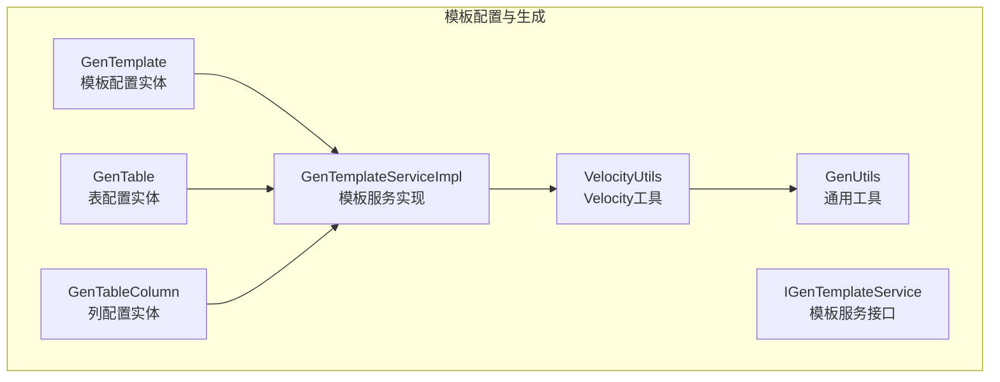
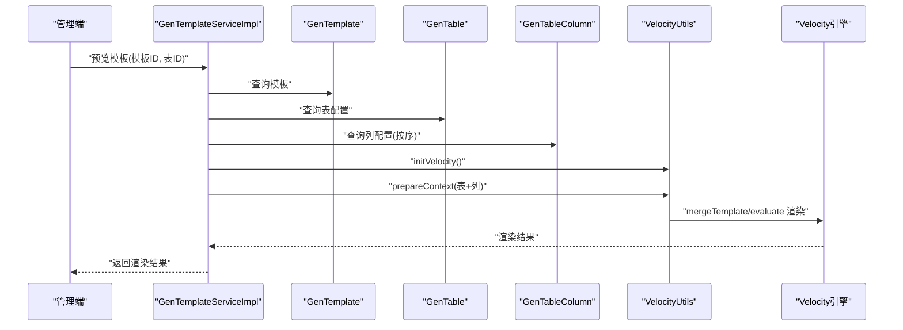
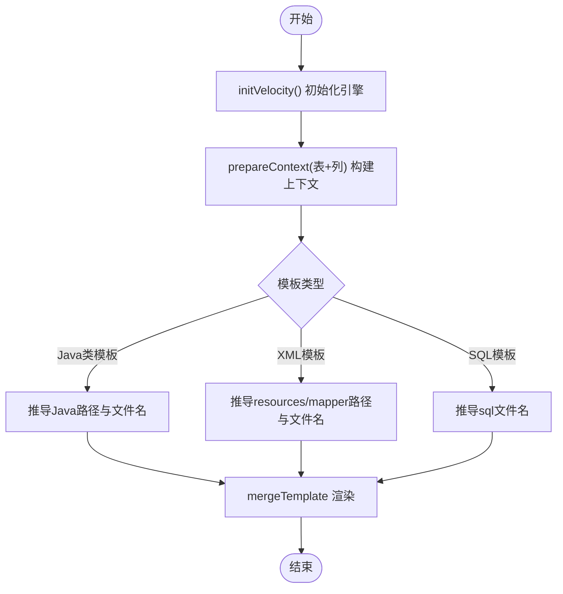
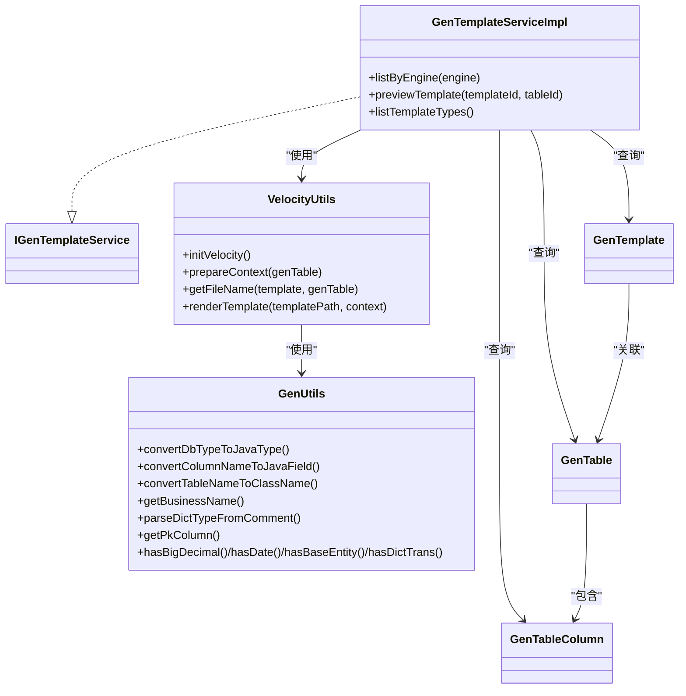

# 模板配置

<cite>
**本文引用的文件**
- [GenTemplateServiceImpl.java](file://forge/forge-framework/forge-plugin-parent/forge-plugin-generator/src/main/java/com/mdframe/forge/plugin/generator/service/impl/GenTemplateServiceImpl.java)
- [IGenTemplateService.java](file://forge/forge-framework/forge-plugin-parent/forge-plugin-generator/src/main/java/com/mdframe/forge/plugin/generator/service/IGenTemplateService.java)
- [VelocityUtils.java](file://forge/forge-framework/forge-plugin-parent/forge-plugin-generator/src/main/java/com/mdframe/forge/plugin/generator/util/VelocityUtils.java)
- [GenUtils.java](file://forge/forge-framework/forge-plugin-parent/forge-plugin-generator/src/main/java/com/mdframe/forge/plugin/generator/util/GenUtils.java)
- [GenTemplate.java](file://forge/forge-framework/forge-plugin-parent/forge-plugin-generator/src/main/java/com/mdframe/forge/plugin/generator/domain/entity/GenTemplate.java)
- [GenTable.java](file://forge/forge-framework/forge-plugin-parent/forge-plugin-generator/src/main/java/com/mdframe/forge/plugin/generator/domain/entity/GenTable.java)
- [GenTableColumn.java](file://forge/forge-framework/forge-plugin-parent/forge-plugin-generator/src/main/java/com/mdframe/forge/plugin/generator/domain/entity/GenTableColumn.java)
- [entity.java.vm](file://forge/forge-framework/forge-plugin-parent/forge-plugin-generator/src/main/resources/templates/vm/entity.java.vm)
- [controller.java.vm](file://forge/forge-framework/forge-plugin-parent/forge-plugin-generator/src/main/resources/templates/vm/controller.java.vm)
- [service.java.vm](file://forge/forge-framework/forge-plugin-parent/forge-plugin-generator/src/main/resources/templates/vm/service.java.vm)
- [serviceImpl.java.vm](file://forge/forge-framework/forge-plugin-parent/forge-plugin-generator/src/main/resources/templates/vm/serviceImpl.java.vm)
- [mapper.java.vm](file://forge/forge-framework/forge-plugin-parent/forge-plugin-generator/src/main/resources/templates/vm/mapper.java.vm)
- [mapper.xml.vm](file://forge/forge-framework/forge-plugin-parent/forge-plugin-generator/src/main/resources/templates/vm/mapper.xml.vm)
- [dto.java.vm](file://forge/forge-framework/forge-plugin-parent/forge-plugin-generator/src/main/resources/templates/vm/dto.java.vm)
- [query.java.vm](file://forge/forge-framework/forge-plugin-parent/forge-plugin-generator/src/main/resources/templates/vm/query.java.vm)
- [dict.sql.vm](file://forge/forge-framework/forge-plugin-parent/forge-plugin-generator/src/main/resources/templates/vm/sql/dict.sql.vm)
</cite>

## 目录
1. [简介](#简介)
2. [项目结构](#项目结构)
3. [核心组件](#核心组件)
4. [架构总览](#架构总览)
5. [详细组件分析](#详细组件分析)
6. [依赖关系分析](#依赖关系分析)
7. [性能考量](#性能考量)
8. [故障排查指南](#故障排查指南)
9. [结论](#结论)
10. [附录](#附录)

## 简介
本技术文档围绕代码生成器的“模板配置”能力展开，系统性介绍基于 Velocity 的模板引擎使用、模板变量与上下文准备、模板类型与生成产物、以及针对 controller、entity、mapper、service、dto、query 等模板的生成逻辑与定制方法。同时提供模板语法参考、变量定义规则、条件判断与循环遍历等高级用法，以及模板定制最佳实践、性能优化技巧与调试方法，帮助开发者按需灵活定制模板。

## 项目结构
模板配置位于代码生成插件模块中，核心由以下部分组成：
- 模板实体与表/列模型：GenTemplate、GenTable、GenTableColumn
- 模板服务接口与实现：IGenTemplateService、GenTemplateServiceImpl
- 模板工具：VelocityUtils（Velocity 初始化、上下文准备、文件名与模板渲染）
- 通用工具：GenUtils（类型映射、命名转换、字典解析、导入判断等）
- 模板资源：Velocity 模板文件（entity、controller、service、serviceImpl、mapper、mapper.xml、dto、query、SQL 初始化）

图表来源
- [GenTemplate.java](file://forge/forge-framework/forge-plugin-parent/forge-plugin-generator/src/main/java/com/mdframe/forge/plugin/generator/domain/entity/GenTemplate.java#L1-L89)
- [GenTable.java](file://forge/forge-framework/forge-plugin-parent/forge-plugin-generator/src/main/java/com/mdframe/forge/plugin/generator/domain/entity/GenTable.java#L1-L147)
- [GenTableColumn.java](file://forge/forge-framework/forge-plugin-parent/forge-plugin-generator/src/main/java/com/mdframe/forge/plugin/generator/domain/entity/GenTableColumn.java#L1-L59)
- [IGenTemplateService.java](file://forge/forge-framework/forge-plugin-parent/forge-plugin-generator/src/main/java/com/mdframe/forge/plugin/generator/service/IGenTemplateService.java#L1-L36)
- [GenTemplateServiceImpl.java](file://forge/forge-framework/forge-plugin-parent/forge-plugin-generator/src/main/java/com/mdframe/forge/plugin/generator/service/impl/GenTemplateServiceImpl.java#L1-L98)
- [VelocityUtils.java](file://forge/forge-framework/forge-plugin-parent/forge-plugin-generator/src/main/java/com/mdframe/forge/plugin/generator/util/VelocityUtils.java#L1-L155)
- [GenUtils.java](file://forge/forge-framework/forge-plugin-parent/forge-plugin-generator/src/main/java/com/mdframe/forge/plugin/generator/util/GenUtils.java#L1-L238)

章节来源
- [GenTemplate.java](file://forge/forge-framework/forge-plugin-parent/forge-plugin-generator/src/main/java/com/mdframe/forge/plugin/generator/domain/entity/GenTemplate.java#L1-L89)
- [GenTable.java](file://forge/forge-framework/forge-plugin-parent/forge-plugin-generator/src/main/java/com/mdframe/forge/plugin/generator/domain/entity/GenTable.java#L1-L147)
- [GenTableColumn.java](file://forge/forge-framework/forge-plugin-parent/forge-plugin-generator/src/main/java/com/mdframe/forge/plugin/generator/domain/entity/GenTableColumn.java#L1-L59)
- [IGenTemplateService.java](file://forge/forge-framework/forge-plugin-parent/forge-plugin-generator/src/main/java/com/mdframe/forge/plugin/generator/service/IGenTemplateService.java#L1-L36)
- [GenTemplateServiceImpl.java](file://forge/forge-framework/forge-plugin-parent/forge-plugin-generator/src/main/java/com/mdframe/forge/plugin/generator/service/impl/GenTemplateServiceImpl.java#L1-L98)
- [VelocityUtils.java](file://forge/forge-framework/forge-plugin-parent/forge-plugin-generator/src/main/java/com/mdframe/forge/plugin/generator/util/VelocityUtils.java#L1-L155)
- [GenUtils.java](file://forge/forge-framework/forge-plugin-parent/forge-plugin-generator/src/main/java/com/mdframe/forge/plugin/generator/util/GenUtils.java#L1-L238)

## 核心组件
- 模板实体 GenTemplate：存储模板元数据（模板名称、编码、类型、引擎、内容、文件后缀与路径、排序、启用状态等），用于在后台管理与生成流程中识别与选择模板。
- 表与列实体 GenTable/GenTableColumn：承载表结构信息与字段属性（含 Java 类型、是否主键、是否查询、字典类型、HTML 类型等），作为模板渲染上下文的基础数据。
- 模板服务 IGenTemplateService/GenTemplateServiceImpl：提供按引擎筛选模板、预览模板渲染结果、列出模板类型等能力；预览时会组装上下文并调用 Velocity 渲染。
- VelocityUtils：负责 Velocity 引擎初始化、上下文准备（基础信息、列信息、导入判断、模块路径）、模板文件名推导、模板渲染。
- GenUtils：提供数据库类型到 Java 类型映射、命名转换、字典类型解析、导入判断、主键列获取等工具方法，支撑模板上下文构建与智能导入。

章节来源
- [GenTemplate.java](file://forge/forge-framework/forge-plugin-parent/forge-plugin-generator/src/main/java/com/mdframe/forge/plugin/generator/domain/entity/GenTemplate.java#L1-L89)
- [GenTable.java](file://forge/forge-framework/forge-plugin-parent/forge-plugin-generator/src/main/java/com/mdframe/forge/plugin/generator/domain/entity/GenTable.java#L1-L147)
- [GenTableColumn.java](file://forge/forge-framework/forge-plugin-parent/forge-plugin-generator/src/main/java/com/mdframe/forge/plugin/generator/domain/entity/GenTableColumn.java#L1-L59)
- [IGenTemplateService.java](file://forge/forge-framework/forge-plugin-parent/forge-plugin-generator/src/main/java/com/mdframe/forge/plugin/generator/service/IGenTemplateService.java#L1-L36)
- [GenTemplateServiceImpl.java](file://forge/forge-framework/forge-plugin-parent/forge-plugin-generator/src/main/java/com/mdframe/forge/plugin/generator/service/impl/GenTemplateServiceImpl.java#L1-L98)
- [VelocityUtils.java](file://forge/forge-framework/forge-plugin-parent/forge-plugin-generator/src/main/java/com/mdframe/forge/plugin/generator/util/VelocityUtils.java#L1-L155)
- [GenUtils.java](file://forge/forge-framework/forge-plugin-parent/forge-plugin-generator/src/main/java/com/mdframe/forge/plugin/generator/util/GenUtils.java#L1-L238)

## 架构总览
模板配置与生成的整体流程如下：
- 后台通过 IGenTemplateService.listByEngine 选择启用且按排序排列的模板；
- 通过 IGenTemplateService.previewTemplate 预览渲染结果；
- 渲染时由 VelocityUtils.initVelocity 初始化引擎，prepareContext 构建上下文，evaluate 或 mergeTemplate 完成渲染；
- 上下文包含表基础信息、列集合、主键列、导入判断标志、模块路径等；
- 模板文件位于 resources/templates/vm 下，按类型组织，如 entity、controller、service、serviceImpl、mapper、mapper.xml、dto、query、SQL 初始化等。

图表来源
- [GenTemplateServiceImpl.java](file://forge/forge-framework/forge-plugin-parent/forge-plugin-generator/src/main/java/com/mdframe/forge/plugin/generator/service/impl/GenTemplateServiceImpl.java#L53-L91)
- [VelocityUtils.java](file://forge/forge-framework/forge-plugin-parent/forge-plugin-generator/src/main/java/com/mdframe/forge/plugin/generator/util/VelocityUtils.java#L21-L27)
- [VelocityUtils.java](file://forge/forge-framework/forge-plugin-parent/forge-plugin-generator/src/main/java/com/mdframe/forge/plugin/generator/util/VelocityUtils.java#L32-L69)

章节来源
- [GenTemplateServiceImpl.java](file://forge/forge-framework/forge-plugin-parent/forge-plugin-generator/src/main/java/com/mdframe/forge/plugin/generator/service/impl/GenTemplateServiceImpl.java#L1-L98)
- [VelocityUtils.java](file://forge/forge-framework/forge-plugin-parent/forge-plugin-generator/src/main/java/com/mdframe/forge/plugin/generator/util/VelocityUtils.java#L1-L155)

## 详细组件分析

### Velocity 模板引擎与上下文
- 引擎初始化：通过 VelocityUtils.initVelocity 设置资源加载器与字符集，确保模板正确读取与输出。
- 上下文准备：prepareContext 将表基础信息（表名、注释、类名、业务名、模块、包、作者、时间）与列信息（过滤基类字段、主键列、导入判断标志）注入 VelocityContext。
- 文件名推导：getFileName 根据模板类型与表配置计算生成文件的相对路径与文件名，覆盖 Java 源码与 XML、SQL 初始化等场景。
- 模板渲染：renderTemplate 使用 mergeTemplate 渲染指定路径模板；previewTemplate 中直接对模板内容进行 evaluate 渲染。

图表来源
- [VelocityUtils.java](file://forge/forge-framework/forge-plugin-parent/forge-plugin-generator/src/main/java/com/mdframe/forge/plugin/generator/util/VelocityUtils.java#L21-L27)
- [VelocityUtils.java](file://forge/forge-framework/forge-plugin-parent/forge-plugin-generator/src/main/java/com/mdframe/forge/plugin/generator/util/VelocityUtils.java#L32-L69)
- [VelocityUtils.java](file://forge/forge-framework/forge-plugin-parent/forge-plugin-generator/src/main/java/com/mdframe/forge/plugin/generator/util/VelocityUtils.java#L112-L144)
- [VelocityUtils.java](file://forge/forge-framework/forge-plugin-parent/forge-plugin-generator/src/main/java/com/mdframe/forge/plugin/generator/util/VelocityUtils.java#L149-L153)

章节来源
- [VelocityUtils.java](file://forge/forge-framework/forge-plugin-parent/forge-plugin-generator/src/main/java/com/mdframe/forge/plugin/generator/util/VelocityUtils.java#L1-L155)

### 模板变量与上下文
- 基础变量：tableName、tableComment、className、classname（首字母小写）、businessName、functionName、moduleName、packageName、author、datetime。
- 列集合：columns（已过滤基类字段）、pkColumn（主键列）。
- 导入判断：hasBigDecimal、hasDate、hasBaseEntity、hasDictTrans。
- 模块路径：modulePath。
- 字段属性：javaType、javaField、isPk、dictType、queryType、htmlType、isInsert/isEdit/isList/isQuery 等。

章节来源
- [VelocityUtils.java](file://forge/forge-framework/forge-plugin-parent/forge-plugin-generator/src/main/java/com/mdframe/forge/plugin/generator/util/VelocityUtils.java#L32-L69)
- [GenUtils.java](file://forge/forge-framework/forge-plugin-parent/forge-plugin-generator/src/main/java/com/mdframe/forge/plugin/generator/util/GenUtils.java#L18-L48)
- [GenUtils.java](file://forge/forge-framework/forge-plugin-parent/forge-plugin-generator/src/main/java/com/mdframe/forge/plugin/generator/util/GenUtils.java#L200-L236)

### 模板类型与生成逻辑
- 模板类型枚举：ENTITY、MAPPER、MAPPER_XML、SERVICE、SERVICE_IMPL、CONTROLLER、DTO、VO、QUERY、SQL。
- 生成产物：
  - 实体类：entity.java.vm
  - Mapper 接口：mapper.java.vm
  - Service 接口：service.java.vm
  - Service 实现：serviceImpl.java.vm
  - 控制器：controller.java.vm
  - DTO/Query：dto.java.vm、query.java.vm
  - MyBatis 映射：mapper.xml.vm
  - SQL 初始化：dict.sql.vm、menu.sql.vm、excel.sql.vm

章节来源
- [GenTemplateServiceImpl.java](file://forge/forge-framework/forge-plugin-parent/forge-plugin-generator/src/main/java/com/mdframe/forge/plugin/generator/service/impl/GenTemplateServiceImpl.java#L35-L41)
- [VelocityUtils.java](file://forge/forge-framework/forge-plugin-parent/forge-plugin-generator/src/main/java/com/mdframe/forge/plugin/generator/util/VelocityUtils.java#L93-L107)

### 模板语法参考与高级用法
- 条件判断：#if/#end，常用于导入判断（如 hasDate、hasBigDecimal、hasBaseEntity、hasDictTrans）与字段筛选（如 isInsert/isEdit/isList/isQuery、isQuery）。
- 循环遍历：#foreach($column in $columns)，用于生成实体字段、DTO/Query 属性、Mapper 结果映射、查询条件构建等。
- 字符串处理：#set 定义局部变量（如 dictName、items、sortIndex），支持字符串截取与分割。
- 注释与占位：Velocity 注释以 # 开头；模板中保留必要的占位符（如 ${...}）以便渲染。

章节来源
- [entity.java.vm](file://forge/forge-framework/forge-plugin-parent/forge-plugin-generator/src/main/resources/templates/vm/entity.java.vm#L1-L58)
- [dto.java.vm](file://forge/forge-framework/forge-plugin-parent/forge-plugin-generator/src/main/resources/templates/vm/dto.java.vm#L1-L34)
- [query.java.vm](file://forge/forge-framework/forge-plugin-parent/forge-plugin-generator/src/main/resources/templates/vm/query.java.vm#L1-L34)
- [mapper.xml.vm](file://forge/forge-framework/forge-plugin-parent/forge-plugin-generator/src/main/resources/templates/vm/mapper.xml.vm#L1-L14)
- [serviceImpl.java.vm](file://forge/forge-framework/forge-plugin-parent/forge-plugin-generator/src/main/resources/templates/vm/serviceImpl.java.vm#L88-L100)
- [dict.sql.vm](file://forge/forge-framework/forge-plugin-parent/forge-plugin-generator/src/main/resources/templates/vm/sql/dict.sql.vm#L1-L49)

### 各类模板生成逻辑与定制方法

#### 实体类模板（entity.java.vm）
- 作用：生成实体类，自动处理导入（如 BaseEntity、DictTrans）、主键注解、字典翻译注解与对应显示字段。
- 关键点：基于 hasBaseEntity、hasDictTrans、columns 列表生成字段与注解；对字典类型生成 TransField 与显示字段。

章节来源
- [entity.java.vm](file://forge/forge-framework/forge-plugin-parent/forge-plugin-generator/src/main/resources/templates/vm/entity.java.vm#L1-L58)
- [VelocityUtils.java](file://forge/forge-framework/forge-plugin-parent/forge-plugin-generator/src/main/java/com/mdframe/forge/plugin/generator/util/VelocityUtils.java#L54-L68)

#### Mapper 接口模板（mapper.java.vm）
- 作用：生成 Mapper 接口，继承 BaseMapper 并标注 @Mapper。
- 关键点：使用 ${className}Mapper 命名约定，引入实体类。

章节来源
- [mapper.java.vm](file://forge/forge-framework/forge-plugin-parent/forge-plugin-generator/src/main/resources/templates/vm/mapper.java.vm#L1-L17)

#### Service 接口模板（service.java.vm）
- 作用：生成 Service 接口，定义分页、列表、详情、增删改等方法签名。
- 关键点：使用 ${className}DTO/${className}Query 与主键字段类型。

章节来源
- [service.java.vm](file://forge/forge-framework/forge-plugin-parent/forge-plugin-generator/src/main/resources/templates/vm/service.java.vm#L1-L55)

#### Service 实现模板（serviceImpl.java.vm）
- 作用：生成 Service 实现类，包含分页、列表、增删改、批量删除与查询条件构建方法。
- 关键点：buildQueryWrapper 使用 #foreach 遍历列，结合 queryType（EQ/LIKE）与 isQuery 标志动态拼装条件；使用 BeanUtil 复制属性；集成字典翻译注解。

章节来源
- [serviceImpl.java.vm](file://forge/forge-framework/forge-plugin-parent/forge-plugin-generator/src/main/resources/templates/vm/serviceImpl.java.vm#L1-L102)

#### 控制器模板（controller.java.vm）
- 作用：生成控制器，提供分页查询、列表查询、详情、新增、修改、删除、批量删除等接口。
- 关键点：使用 @OperationLog 记录操作日志；请求路径为 “/${moduleName}/${businessName}”。

章节来源
- [controller.java.vm](file://forge/forge-framework/forge-plugin-parent/forge-plugin-generator/src/main/resources/templates/vm/controller.java.vm#L1-L99)

#### DTO/Query 模板（dto.java.vm、query.java.vm）
- 作用：生成新增/修改 DTO 与查询条件 DTO。
- 关键点：仅包含 isInsert/isEdit 或 isQuery 标记为 1 的字段；自动导入日期与数值类型。

章节来源
- [dto.java.vm](file://forge/forge-framework/forge-plugin-parent/forge-plugin-generator/src/main/resources/templates/vm/dto.java.vm#L1-L34)
- [query.java.vm](file://forge/forge-framework/forge-plugin-parent/forge-plugin-generator/src/main/resources/templates/vm/query.java.vm#L1-L34)

#### Mapper XML 模板（mapper.xml.vm）
- 作用：生成 MyBatis Mapper XML，定义基础结果映射。
- 关键点：基于 columns 生成 result 节点；可扩展自定义 SQL。

章节来源
- [mapper.xml.vm](file://forge/forge-framework/forge-plugin-parent/forge-plugin-generator/src/main/resources/templates/vm/mapper.xml.vm#L1-L14)

#### SQL 初始化模板（dict.sql.vm、menu.sql.vm、excel.sql.vm）
- 作用：生成字典、菜单、Excel 导出等初始化 SQL。
- 关键点：从列注释解析字典项（支持冒号或短横线分隔），生成 sys_dict_type 与 sys_dict_data 插入语句；支持手动补充字典数据项。

章节来源
- [dict.sql.vm](file://forge/forge-framework/forge-plugin-parent/forge-plugin-generator/src/main/resources/templates/vm/sql/dict.sql.vm#L1-L49)

### 模板继承与复用策略
- 统一上下文：所有模板共享同一 VelocityContext，通过 has* 判断与列集合实现按需导入与字段生成，避免重复逻辑。
- 命名与路径约定：通过 VelocityUtils.getFileName 规范化生成路径与文件名，便于统一管理与复用。
- 模板拆分：将导入判断、字段生成、查询条件构建等逻辑拆分为独立模板片段，减少重复编写。

章节来源
- [VelocityUtils.java](file://forge/forge-framework/forge-plugin-parent/forge-plugin-generator/src/main/java/com/mdframe/forge/plugin/generator/util/VelocityUtils.java#L112-L144)
- [VelocityUtils.java](file://forge/forge-framework/forge-plugin-parent/forge-plugin-generator/src/main/java/com/mdframe/forge/plugin/generator/util/VelocityUtils.java#L74-L88)

## 依赖关系分析
- 服务层依赖：GenTemplateServiceImpl 依赖 GenTemplateMapper、GenTableMapper、GenTableColumnMapper 与 VelocityUtils、GenUtils。
- 工具层依赖：VelocityUtils 依赖 GenUtils 提供的类型映射与判断方法；GenUtils 依赖 GeneratorConfig（外部配置）与 Hutool/StrUtil。
- 模板资源：各 vm 模板依赖上下文变量，如 columns、pkColumn、has*、modulePath 等。

图表来源
- [GenTemplateServiceImpl.java](file://forge/forge-framework/forge-plugin-parent/forge-plugin-generator/src/main/java/com/mdframe/forge/plugin/generator/service/impl/GenTemplateServiceImpl.java#L1-L98)
- [IGenTemplateService.java](file://forge/forge-framework/forge-plugin-parent/forge-plugin-generator/src/main/java/com/mdframe/forge/plugin/generator/service/IGenTemplateService.java#L1-L36)
- [VelocityUtils.java](file://forge/forge-framework/forge-plugin-parent/forge-plugin-generator/src/main/java/com/mdframe/forge/plugin/generator/util/VelocityUtils.java#L1-L155)
- [GenUtils.java](file://forge/forge-framework/forge-plugin-parent/forge-plugin-generator/src/main/java/com/mdframe/forge/plugin/generator/util/GenUtils.java#L1-L238)
- [GenTemplate.java](file://forge/forge-framework/forge-plugin-parent/forge-plugin-generator/src/main/java/com/mdframe/forge/plugin/generator/domain/entity/GenTemplate.java#L1-L89)
- [GenTable.java](file://forge/forge-framework/forge-plugin-parent/forge-plugin-generator/src/main/java/com/mdframe/forge/plugin/generator/domain/entity/GenTable.java#L1-L147)
- [GenTableColumn.java](file://forge/forge-framework/forge-plugin-parent/forge-plugin-generator/src/main/java/com/mdframe/forge/plugin/generator/domain/entity/GenTableColumn.java#L1-L59)

章节来源
- [GenTemplateServiceImpl.java](file://forge/forge-framework/forge-plugin-parent/forge-plugin-generator/src/main/java/com/mdframe/forge/plugin/generator/service/impl/GenTemplateServiceImpl.java#L1-L98)
- [VelocityUtils.java](file://forge/forge-framework/forge-plugin-parent/forge-plugin-generator/src/main/java/com/mdframe/forge/plugin/generator/util/VelocityUtils.java#L1-L155)
- [GenUtils.java](file://forge/forge-framework/forge-plugin-parent/forge-plugin-generator/src/main/java/com/mdframe/forge/plugin/generator/util/GenUtils.java#L1-L238)

## 性能考量
- 模板数量与复杂度：模板越多、嵌套越深，渲染耗时越高。建议拆分复杂模板为多个简单模板，减少单个模板的循环与判断层级。
- 上下文构建：prepareContext 对列进行过滤与判断，注意避免在模板中重复计算；尽量在工具层完成预处理。
- IO 与缓存：模板文件位于类路径，首次加载有开销；可在应用启动阶段初始化 Velocity，避免运行时重复初始化。
- 渲染策略：对于大量表的批量生成，建议采用异步或批处理方式，避免阻塞主线程。

## 故障排查指南
- 模板不存在：预览时若模板 ID 无效，将抛出异常。请检查模板是否存在且启用。
- 表配置缺失：若表 ID 无效，将提示表配置不存在。请确认表配置与列配置完整。
- 渲染失败：evaluate/mergeTemplate 抛错时会记录错误日志并抛出异常。请检查模板语法（条件、循环、变量引用）与上下文变量是否齐全。
- 变量未定义：若模板中使用了未提供的上下文变量（如 hasDictTrans 但列未解析字典），请检查列注释格式与字典解析逻辑。
- 导入缺失：若生成类缺少相应导入（如 BigDecimal、LocalDateTime），请检查 hasBigDecimal、hasDate 的判断逻辑与列类型映射。

章节来源
- [GenTemplateServiceImpl.java](file://forge/forge-framework/forge-plugin-parent/forge-plugin-generator/src/main/java/com/mdframe/forge/plugin/generator/service/impl/GenTemplateServiceImpl.java#L54-L91)
- [VelocityUtils.java](file://forge/forge-framework/forge-plugin-parent/forge-plugin-generator/src/main/java/com/mdframe/forge/plugin/generator/util/VelocityUtils.java#L149-L153)

## 结论
该模板配置体系以 Velocity 为核心，结合统一的上下文构建与命名规范，实现了对实体、Mapper、Service、Controller、DTO/Query、MyBatis XML 与 SQL 初始化的自动化生成。通过 has* 判断与列集合驱动，模板具备良好的可扩展性与可维护性。建议在实际项目中遵循命名约定、拆分复杂模板、合理组织上下文变量，并结合日志与异常信息进行调试与优化。

## 附录

### 模板变量定义规则
- 基础信息：tableName、tableComment、className、classname、businessName、functionName、moduleName、packageName、author、datetime
- 列集合：columns（过滤基类字段）、pkColumn（主键列）
- 导入判断：hasBigDecimal、hasDate、hasBaseEntity、hasDictTrans
- 模块路径：modulePath

章节来源
- [VelocityUtils.java](file://forge/forge-framework/forge-plugin-parent/forge-plugin-generator/src/main/java/com/mdframe/forge/plugin/generator/util/VelocityUtils.java#L32-L69)

### 模板类型与文件映射
- ENTITY → entity.java.vm
- MAPPER → mapper.java.vm
- SERVICE → service.java.vm
- SERVICE_IMPL → serviceImpl.java.vm
- CONTROLLER → controller.java.vm
- DTO → dto.java.vm
- QUERY → query.java.vm
- MAPPER_XML → mapper.xml.vm
- SQL → dict.sql.vm / menu.sql.vm / excel.sql.vm

章节来源
- [GenTemplateServiceImpl.java](file://forge/forge-framework/forge-plugin-parent/forge-plugin-generator/src/main/java/com/mdframe/forge/plugin/generator/service/impl/GenTemplateServiceImpl.java#L35-L41)
- [VelocityUtils.java](file://forge/forge-framework/forge-plugin-parent/forge-plugin-generator/src/main/java/com/mdframe/forge/plugin/generator/util/VelocityUtils.java#L93-L107)