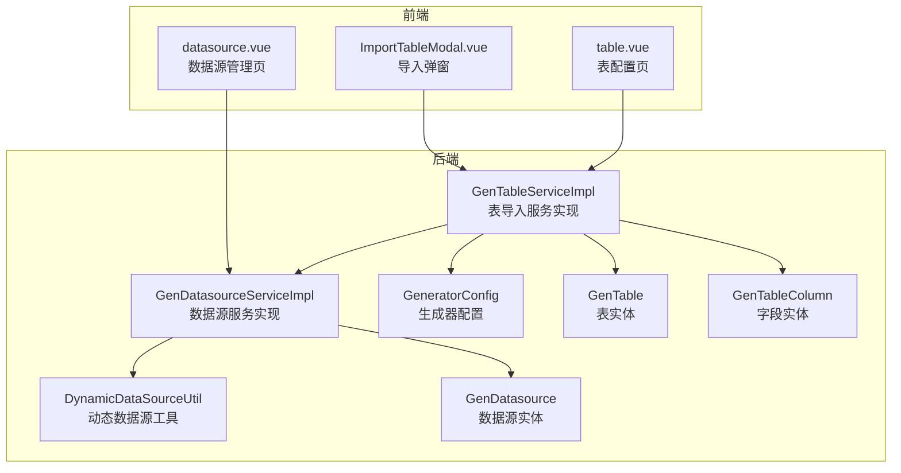
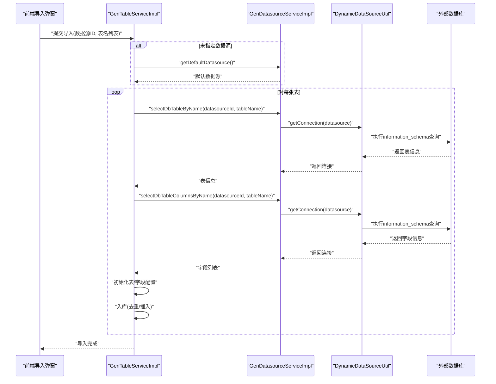
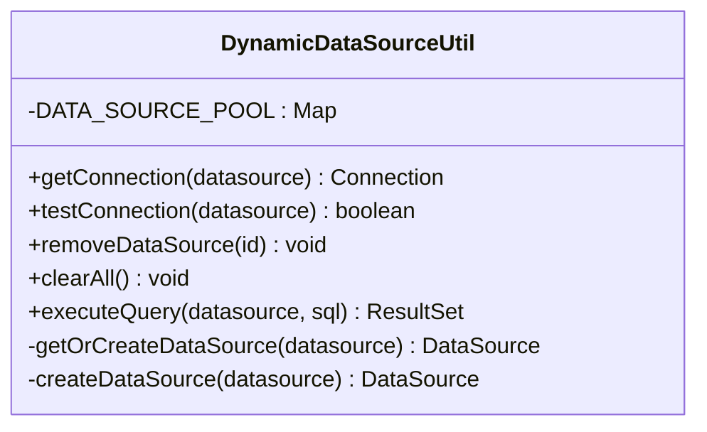
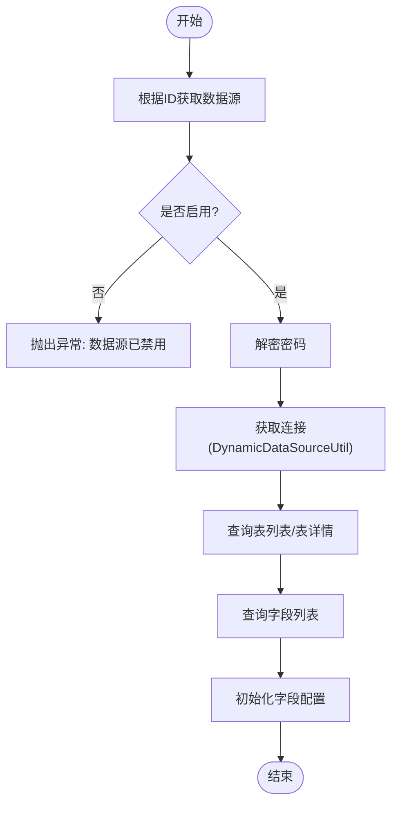
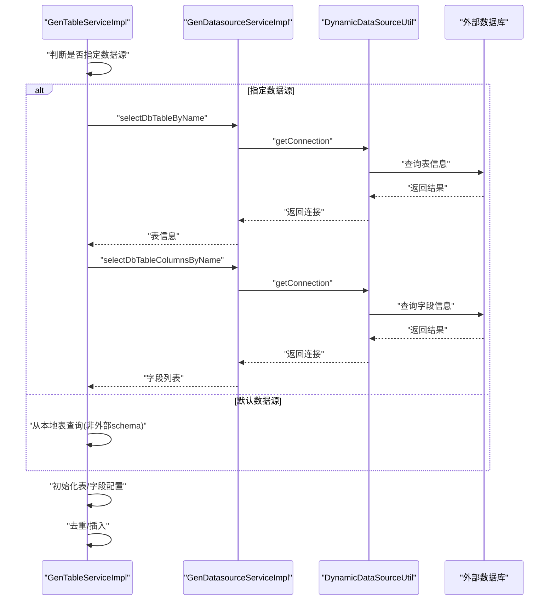
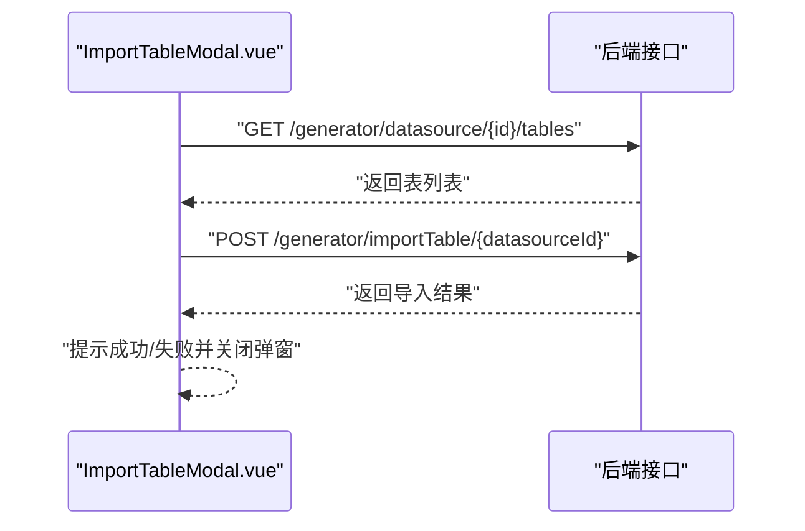
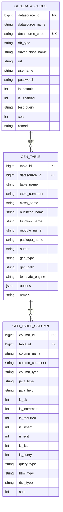
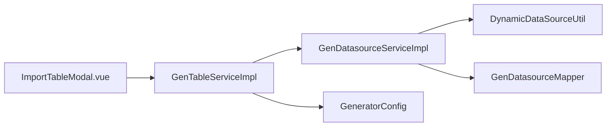

# 表结构导入

<cite>
**本文引用的文件**
- [DynamicDataSourceUtil.java](file://forge/forge-framework/forge-plugin-parent/forge-plugin-generator/src/main/java/com/mdframe/forge/plugin/generator/util/DynamicDataSourceUtil.java)
- [GenDatasourceServiceImpl.java](file://forge/forge-framework/forge-plugin-parent/forge-plugin-generator/src/main/java/com/mdframe/forge/plugin/generator/service/impl/GenDatasourceServiceImpl.java)
- [GenTableServiceImpl.java](file://forge/forge-framework/forge-plugin-parent/forge-plugin-generator/src/main/java/com/mdframe/forge/plugin/generator/service/impl/GenTableServiceImpl.java)
- [IGenDatasourceService.java](file://forge/forge-framework/forge-plugin-parent/forge-plugin-generator/src/main/java/com/mdframe/forge/plugin/generator/service/IGenDatasourceService.java)
- [GenDatasource.java](file://forge/forge-framework/forge-plugin-parent/forge-plugin-generator/src/main/java/com/mdframe/forge/plugin/generator/domain/entity/GenDatasource.java)
- [GenTable.java](file://forge/forge-framework/forge-plugin-parent/forge-plugin-generator/src/main/java/com/mdframe/forge/plugin/generator/domain/entity/GenTable.java)
- [GenTableColumn.java](file://forge/forge-framework/forge-plugin-parent/forge-plugin-generator/src/main/java/com/mdframe/forge/plugin/generator/domain/entity/GenTableColumn.java)
- [GeneratorConfig.java](file://forge/forge-framework/forge-plugin-parent/forge-plugin-generator/src/main/java/com/mdframe/forge/plugin/generator/config/GeneratorConfig.java)
- [ImportTableModal.vue](file://forge-admin-ui/src/views/generator/components/ImportTableModal.vue)
- [table.vue](file://forge-admin-ui/src/views/generator/table.vue)
- [datasource.vue](file://forge-admin-ui/src/views/generator/datasource.vue)
</cite>

## 目录
1. [简介](#简介)
2. [项目结构](#项目结构)
3. [核心组件](#核心组件)
4. [架构总览](#架构总览)
5. [组件详解](#组件详解)
6. [依赖关系分析](#依赖关系分析)
7. [性能考量](#性能考量)
8. [故障排查指南](#故障排查指南)
9. [结论](#结论)
10. [附录](#附录)

## 简介
本技术文档围绕“表结构导入”功能展开，系统性阐述数据库表扫描机制、表与字段信息提取、默认与指定数据源的导入流程差异、动态数据源切换机制（DynamicDataSourceUtil）、以及完整的导入示例、错误处理策略与性能优化建议。目标是帮助开发者快速理解并正确使用该功能。

## 项目结构
- 后端核心位于 forge/forge-framework/forge-plugin-parent/forge-plugin-generator 模块，包含数据源配置、表结构导入、动态数据源工具与生成配置等。
- 前端位于 forge-admin-ui/views/generator，提供数据源管理、表导入弹窗与表格配置页面。

**图表来源**
- [GenDatasourceServiceImpl.java](file://forge/forge-framework/forge-plugin-parent/forge-plugin-generator/src/main/java/com/mdframe/forge/plugin/generator/service/impl/GenDatasourceServiceImpl.java#L1-L241)
- [GenTableServiceImpl.java](file://forge/forge-framework/forge-plugin-parent/forge-plugin-generator/src/main/java/com/mdframe/forge/plugin/generator/service/impl/GenTableServiceImpl.java#L1-L273)
- [DynamicDataSourceUtil.java](file://forge/forge-framework/forge-plugin-parent/forge-plugin-generator/src/main/java/com/mdframe/forge/plugin/generator/util/DynamicDataSourceUtil.java#L1-L114)
- [GeneratorConfig.java](file://forge/forge-framework/forge-plugin-parent/forge-plugin-generator/src/main/java/com/mdframe/forge/plugin/generator/config/GeneratorConfig.java#L1-L50)
- [GenDatasource.java](file://forge/forge-framework/forge-plugin-parent/forge-plugin-generator/src/main/java/com/mdframe/forge/plugin/generator/domain/entity/GenDatasource.java#L1-L104)
- [GenTable.java](file://forge/forge-framework/forge-plugin-parent/forge-plugin-generator/src/main/java/com/mdframe/forge/plugin/generator/domain/entity/GenTable.java#L1-L147)
- [GenTableColumn.java](file://forge/forge-framework/forge-plugin-parent/forge-plugin-generator/src/main/java/com/mdframe/forge/plugin/generator/domain/entity/GenTableColumn.java#L1-L59)
- [ImportTableModal.vue](file://forge-admin-ui/src/views/generator/components/ImportTableModal.vue#L1-L292)
- [table.vue](file://forge-admin-ui/src/views/generator/table.vue#L1-L396)
- [datasource.vue](file://forge-admin-ui/src/views/generator/datasource.vue#L1-L350)

**章节来源**
- [GenDatasourceServiceImpl.java](file://forge/forge-framework/forge-plugin-parent/forge-plugin-generator/src/main/java/com/mdframe/forge/plugin/generator/service/impl/GenDatasourceServiceImpl.java#L1-L241)
- [GenTableServiceImpl.java](file://forge/forge-framework/forge-plugin-parent/forge-plugin-generator/src/main/java/com/mdframe/forge/plugin/generator/service/impl/GenTableServiceImpl.java#L1-L273)
- [DynamicDataSourceUtil.java](file://forge/forge-framework/forge-plugin-parent/forge-plugin-generator/src/main/java/com/mdframe/forge/plugin/generator/util/DynamicDataSourceUtil.java#L1-L114)
- [ImportTableModal.vue](file://forge-admin-ui/src/views/generator/components/ImportTableModal.vue#L1-L292)
- [table.vue](file://forge-admin-ui/src/views/generator/table.vue#L1-L396)
- [datasource.vue](file://forge-admin-ui/src/views/generator/datasource.vue#L1-L350)

## 核心组件
- 动态数据源工具（DynamicDataSourceUtil）：负责数据源连接池的创建、缓存、连接获取、连接测试、资源清理与执行查询。
- 数据源服务实现（GenDatasourceServiceImpl）：封装对指定数据源的表与字段查询、默认数据源获取、密码加解密与连接测试。
- 表导入服务实现（GenTableServiceImpl）：统一入口，支持默认数据源与指定数据源的表导入；负责表与字段的初始化、去重与入库。
- 前端导入弹窗（ImportTableModal.vue）：提供数据源选择、表列表加载、勾选导入、错误提示与成功反馈。
- 生成器配置（GeneratorConfig）：提供默认作者、包名、模块名、模板引擎、表前缀等生成参数。

**章节来源**
- [DynamicDataSourceUtil.java](file://forge/forge-framework/forge-plugin-parent/forge-plugin-generator/src/main/java/com/mdframe/forge/plugin/generator/util/DynamicDataSourceUtil.java#L1-L114)
- [GenDatasourceServiceImpl.java](file://forge/forge-framework/forge-plugin-parent/forge-plugin-generator/src/main/java/com/mdframe/forge/plugin/generator/service/impl/GenDatasourceServiceImpl.java#L1-L241)
- [GenTableServiceImpl.java](file://forge/forge-framework/forge-plugin-parent/forge-plugin-generator/src/main/java/com/mdframe/forge/plugin/generator/service/impl/GenTableServiceImpl.java#L1-L273)
- [ImportTableModal.vue](file://forge-admin-ui/src/views/generator/components/ImportTableModal.vue#L1-L292)
- [GeneratorConfig.java](file://forge/forge-framework/forge-plugin-parent/forge-plugin-generator/src/main/java/com/mdframe/forge/plugin/generator/config/GeneratorConfig.java#L1-L50)

## 架构总览
表结构导入涉及前后端协作与多层服务调用，核心流程如下：

**图表来源**
- [GenTableServiceImpl.java](file://forge/forge-framework/forge-plugin-parent/forge-plugin-generator/src/main/java/com/mdframe/forge/plugin/generator/service/impl/GenTableServiceImpl.java#L56-L111)
- [GenDatasourceServiceImpl.java](file://forge/forge-framework/forge-plugin-parent/forge-plugin-generator/src/main/java/com/mdframe/forge/plugin/generator/service/impl/GenDatasourceServiceImpl.java#L72-L172)
- [DynamicDataSourceUtil.java](file://forge/forge-framework/forge-plugin-parent/forge-plugin-generator/src/main/java/com/mdframe/forge/plugin/generator/util/DynamicDataSourceUtil.java#L30-L80)

## 组件详解

### 动态数据源管理（DynamicDataSourceUtil）
- 职责
  - 数据源连接池缓存（基于数据源ID）。
  - 获取连接、创建连接池、测试连接、关闭连接池、执行查询。
- 关键点
  - 使用Hikari连接池，限制最大连接数、空闲超时、最大存活时间等。
  - 支持通过数据源的测试SQL进行连通性验证。
  - 提供按ID移除与清空全部连接池的能力，便于资源回收。

**图表来源**
- [DynamicDataSourceUtil.java](file://forge/forge-framework/forge-plugin-parent/forge-plugin-generator/src/main/java/com/mdframe/forge/plugin/generator/util/DynamicDataSourceUtil.java#L19-L114)

**章节来源**
- [DynamicDataSourceUtil.java](file://forge/forge-framework/forge-plugin-parent/forge-plugin-generator/src/main/java/com/mdframe/forge/plugin/generator/util/DynamicDataSourceUtil.java#L1-L114)

### 数据源服务实现（GenDatasourceServiceImpl）
- 职责
  - 保存/更新数据源时对密码进行AES加密。
  - 测试连接：解密密码后通过动态数据源工具测试。
  - 查询指定数据源的表列表与表详情（information_schema）。
  - 查询指定数据源的字段列表（information_schema），并初始化字段配置。
  - 获取默认启用的数据源。
- 安全与健壮性
  - 解密失败时兼容未加密旧数据，避免阻断。
  - 对不存在或禁用数据源抛出明确异常。

**图表来源**
- [GenDatasourceServiceImpl.java](file://forge/forge-framework/forge-plugin-parent/forge-plugin-generator/src/main/java/com/mdframe/forge/plugin/generator/service/impl/GenDatasourceServiceImpl.java#L174-L239)

**章节来源**
- [GenDatasourceServiceImpl.java](file://forge/forge-framework/forge-plugin-parent/forge-plugin-generator/src/main/java/com/mdframe/forge/plugin/generator/service/impl/GenDatasourceServiceImpl.java#L1-L241)

### 表导入服务实现（GenTableServiceImpl）
- 职责
  - 支持默认数据源与指定数据源的导入。
  - 若未指定数据源，自动获取默认数据源。
  - 对每张表：查询表信息与字段列表，初始化表/字段配置，去重后入库。
- 事务与一致性
  - 整体导入在事务中执行，保证原子性。
  - 存在同名表时先删除旧配置再插入新配置。

**图表来源**
- [GenTableServiceImpl.java](file://forge/forge-framework/forge-plugin-parent/forge-plugin-generator/src/main/java/com/mdframe/forge/plugin/generator/service/impl/GenTableServiceImpl.java#L56-L111)

**章节来源**
- [GenTableServiceImpl.java](file://forge/forge-framework/forge-plugin-parent/forge-plugin-generator/src/main/java/com/mdframe/forge/plugin/generator/service/impl/GenTableServiceImpl.java#L1-L273)

### 前端导入弹窗（ImportTableModal.vue）
- 功能
  - 选择数据源、搜索表名、勾选多表、提交导入。
  - 加载表列表、错误提示、成功反馈。
- 交互
  - 调用后端接口获取表列表与执行导入。
  - 成功后触发父组件刷新。

**图表来源**
- [ImportTableModal.vue](file://forge-admin-ui/src/views/generator/components/ImportTableModal.vue#L205-L274)

**章节来源**
- [ImportTableModal.vue](file://forge-admin-ui/src/views/generator/components/ImportTableModal.vue#L1-L292)
- [table.vue](file://forge-admin-ui/src/views/generator/table.vue#L70-L89)
- [datasource.vue](file://forge-admin-ui/src/views/generator/datasource.vue#L1-L350)

### 数据模型与配置
- 数据源实体（GenDatasource）：包含数据源ID、名称、编码、数据库类型、驱动类名、JDBC URL、用户名、密码（加密存储）、默认/启用状态、测试SQL、排序与备注等。
- 表实体（GenTable）：包含表ID、数据源ID、表名、表注释、实体类名、业务名、功能名、模块名、包路径、作者、生成方式、生成路径、模板引擎、其他选项、树形字段等。
- 字段实体（GenTableColumn）：包含字段ID、表ID、列名、注释、类型、Java类型/字段、主键/自增/必填标记、插入/编辑/列表/查询标记、查询方式、HTML类型、字典类型、排序等。
- 生成器配置（GeneratorConfig）：默认作者、包名、模块名、模板引擎、是否自动移除前缀、表前缀、生成基础路径等。

**图表来源**
- [GenDatasource.java](file://forge/forge-framework/forge-plugin-parent/forge-plugin-generator/src/main/java/com/mdframe/forge/plugin/generator/domain/entity/GenDatasource.java#L1-L104)
- [GenTable.java](file://forge/forge-framework/forge-plugin-parent/forge-plugin-generator/src/main/java/com/mdframe/forge/plugin/generator/domain/entity/GenTable.java#L1-L147)
- [GenTableColumn.java](file://forge/forge-framework/forge-plugin-parent/forge-plugin-generator/src/main/java/com/mdframe/forge/plugin/generator/domain/entity/GenTableColumn.java#L1-L59)

**章节来源**
- [GenDatasource.java](file://forge/forge-framework/forge-plugin-parent/forge-plugin-generator/src/main/java/com/mdframe/forge/plugin/generator/domain/entity/GenDatasource.java#L1-L104)
- [GenTable.java](file://forge/forge-framework/forge-plugin-parent/forge-plugin-generator/src/main/java/com/mdframe/forge/plugin/generator/domain/entity/GenTable.java#L1-L147)
- [GenTableColumn.java](file://forge/forge-framework/forge-plugin-parent/forge-plugin-generator/src/main/java/com/mdframe/forge/plugin/generator/domain/entity/GenTableColumn.java#L1-L59)
- [GeneratorConfig.java](file://forge/forge-framework/forge-plugin-parent/forge-plugin-generator/src/main/java/com/mdframe/forge/plugin/generator/config/GeneratorConfig.java#L1-L50)

## 依赖关系分析
- GenTableServiceImpl 依赖 IGenDatasourceService 与 GeneratorConfig，用于导入与初始化。
- GenDatasourceServiceImpl 依赖 GenDatasourceMapper 与 DynamicDataSourceUtil，用于数据源查询与连接管理。
- DynamicDataSourceUtil 依赖 HikariDataSource 与 GenDatasource，负责连接池生命周期管理。
- 前端 ImportTableModal.vue 与后端接口对接，触发导入流程。

**图表来源**
- [GenTableServiceImpl.java](file://forge/forge-framework/forge-plugin-parent/forge-plugin-generator/src/main/java/com/mdframe/forge/plugin/generator/service/impl/GenTableServiceImpl.java#L35-L40)
- [GenDatasourceServiceImpl.java](file://forge/forge-framework/forge-plugin-parent/forge-plugin-generator/src/main/java/com/mdframe/forge/plugin/generator/service/impl/GenDatasourceServiceImpl.java#L39-L13)
- [DynamicDataSourceUtil.java](file://forge/forge-framework/forge-plugin-parent/forge-plugin-generator/src/main/java/com/mdframe/forge/plugin/generator/util/DynamicDataSourceUtil.java#L1-L14)

**章节来源**
- [GenTableServiceImpl.java](file://forge/forge-framework/forge-plugin-parent/forge-plugin-generator/src/main/java/com/mdframe/forge/plugin/generator/service/impl/GenTableServiceImpl.java#L1-L273)
- [GenDatasourceServiceImpl.java](file://forge/forge-framework/forge-plugin-parent/forge-plugin-generator/src/main/java/com/mdframe/forge/plugin/generator/service/impl/GenDatasourceServiceImpl.java#L1-L241)
- [DynamicDataSourceUtil.java](file://forge/forge-framework/forge-plugin-parent/forge-plugin-generator/src/main/java/com/mdframe/forge/plugin/generator/util/DynamicDataSourceUtil.java#L1-L114)

## 性能考量
- 连接池参数
  - 最大连接数、最小空闲、连接超时、空闲超时、最大存活时间等已在动态数据源工具中设置，建议结合业务并发与数据库承载能力调整。
- 查询策略
  - 使用 information_schema 查询表与字段，注意过滤系统表（如定时任务、生成器内部表）以减少无关数据。
- 导入批处理
  - 单次导入多表时，建议控制并发与批次大小，避免一次性打开过多连接导致资源紧张。
- 资源回收
  - 在数据源变更或应用重启时，及时调用移除或清空连接池，释放底层资源。

[本节为通用指导，无需具体文件引用]

## 故障排查指南
- 数据源不可用
  - 现象：导入失败或连接测试失败。
  - 排查：确认数据源启用状态、驱动类名、JDBC URL、用户名密码；检查测试SQL是否正确；查看日志中的错误信息。
  - 参考：数据源测试逻辑与动态数据源工具的连接测试方法。
- 表不存在
  - 现象：导入时报表不存在。
  - 排查：确认表名拼写与大小写；若指定数据源，确认表存在于对应schema中。
  - 参考：表导入服务对表存在性的校验。
- 密码解密失败
  - 现象：连接测试报错或无法建立连接。
  - 排查：确认密码是否为旧版本未加密数据；若解密失败会回退为原值，仍可能为错误密码。
  - 参考：数据源服务实现中的解密兼容逻辑。
- 权限不足
  - 现象：information_schema 查询失败。
  - 排查：确保数据库用户具备查询 information_schema 的权限。
- 前端无表显示
  - 现象：导入弹窗加载表列表为空。
  - 排查：确认选择了正确的数据源；检查后端返回的表列表是否为空；核对过滤条件（如系统表前缀）。

**章节来源**
- [GenDatasourceServiceImpl.java](file://forge/forge-framework/forge-plugin-parent/forge-plugin-generator/src/main/java/com/mdframe/forge/plugin/generator/service/impl/GenDatasourceServiceImpl.java#L59-L70)
- [GenTableServiceImpl.java](file://forge/forge-framework/forge-plugin-parent/forge-plugin-generator/src/main/java/com/mdframe/forge/plugin/generator/service/impl/GenTableServiceImpl.java#L69-L84)
- [DynamicDataSourceUtil.java](file://forge/forge-framework/forge-plugin-parent/forge-plugin-generator/src/main/java/com/mdframe/forge/plugin/generator/util/DynamicDataSourceUtil.java#L69-L79)
- [ImportTableModal.vue](file://forge-admin-ui/src/views/generator/components/ImportTableModal.vue#L205-L221)

## 结论
表结构导入功能通过“默认数据源 + 指定数据源”的双通道设计，结合动态数据源工具与前后端协同，实现了灵活、安全且可扩展的表结构导入能力。开发者应重点关注数据源配置、连接池参数、权限与过滤策略，并遵循错误处理与性能优化建议，以获得稳定高效的导入体验。

[本节为总结性内容，无需具体文件引用]

## 附录

### 默认数据源与指定数据源的导入流程差异
- 默认数据源
  - 未传入数据源ID时，自动获取默认启用的数据源；后续查询表与字段走本地或默认数据源的查询逻辑。
- 指定数据源
  - 显式传入数据源ID，使用动态数据源工具连接外部数据库，查询 information_schema 获取表与字段信息。

**章节来源**
- [GenTableServiceImpl.java](file://forge/forge-framework/forge-plugin-parent/forge-plugin-generator/src/main/java/com/mdframe/forge/plugin/generator/service/impl/GenTableServiceImpl.java#L58-L84)
- [GenDatasourceServiceImpl.java](file://forge/forge-framework/forge-plugin-parent/forge-plugin-generator/src/main/java/com/mdframe/forge/plugin/generator/service/impl/GenDatasourceServiceImpl.java#L174-L182)

### 字段类型映射规则
- 当前实现通过查询 information_schema 的列类型字段获取原始类型字符串，并在导入过程中调用初始化方法完成字段配置的进一步处理。
- 建议在实际项目中补充数据库类型到Java类型的映射规则，以便生成更贴合业务的代码。

**章节来源**
- [GenDatasourceServiceImpl.java](file://forge/forge-framework/forge-plugin-parent/forge-plugin-generator/src/main/java/com/mdframe/forge/plugin/generator/service/impl/GenDatasourceServiceImpl.java#L136-L172)

### 表结构导入示例（步骤说明）
- 步骤1：在数据源管理页配置数据源（填写名称、编码、数据库类型、驱动类名、JDBC URL、用户名、密码、测试SQL、默认/启用状态等）。
- 步骤2：进入表配置页，点击“导入表”，在导入弹窗中选择数据源并搜索表名。
- 步骤3：勾选需要导入的表，点击“提交导入”，等待导入完成并查看结果提示。
- 步骤4：导入完成后可在表列表中查看导入的表配置，必要时进行字段配置与生成代码。

**章节来源**
- [datasource.vue](file://forge-admin-ui/src/views/generator/datasource.vue#L147-L290)
- [ImportTableModal.vue](file://forge-admin-ui/src/views/generator/components/ImportTableModal.vue#L244-L274)
- [table.vue](file://forge-admin-ui/src/views/generator/table.vue#L70-L89)