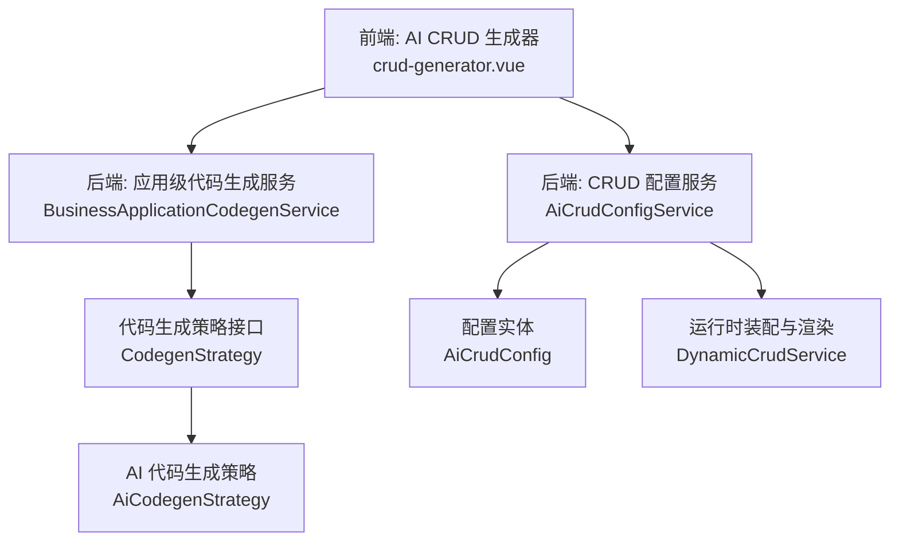
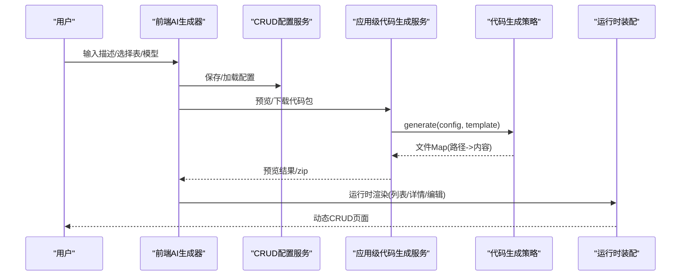
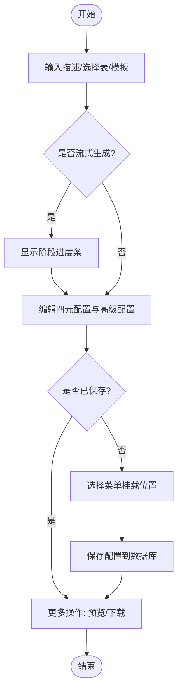
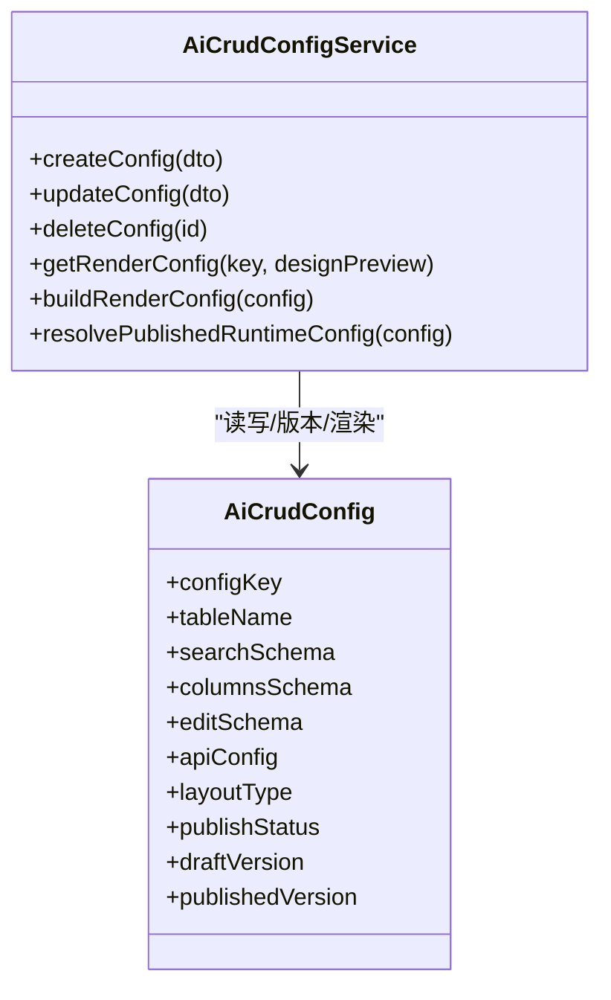
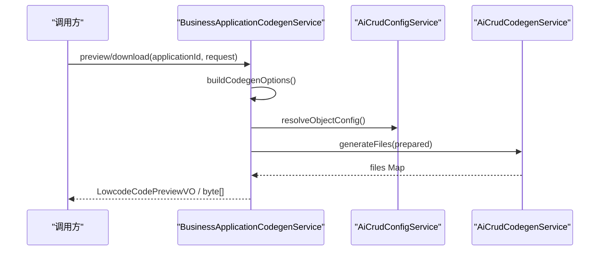
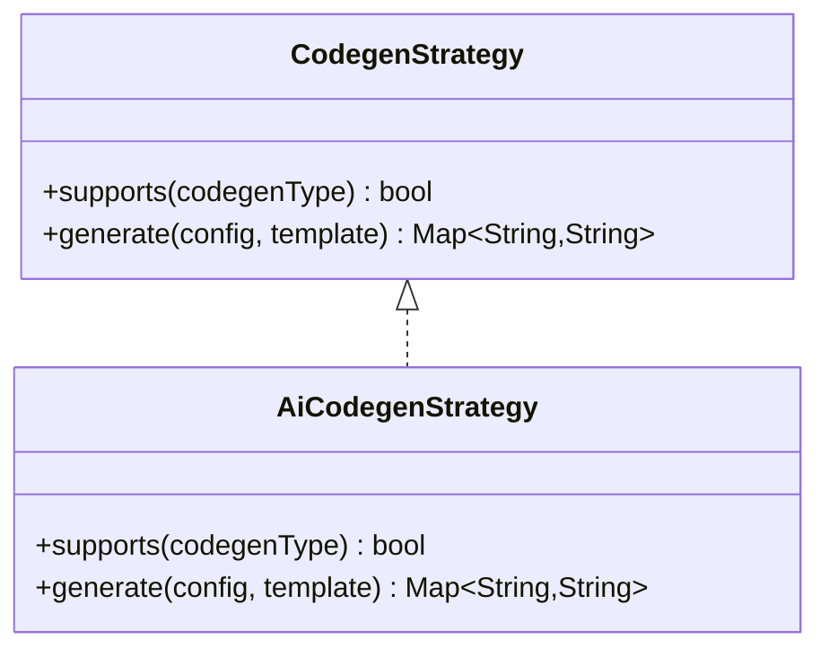
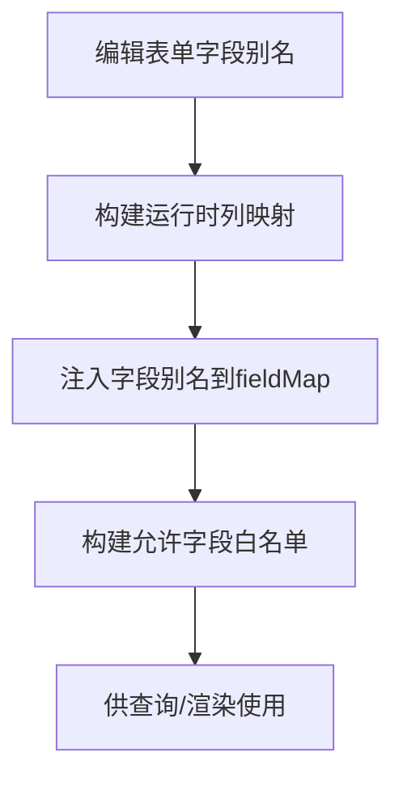
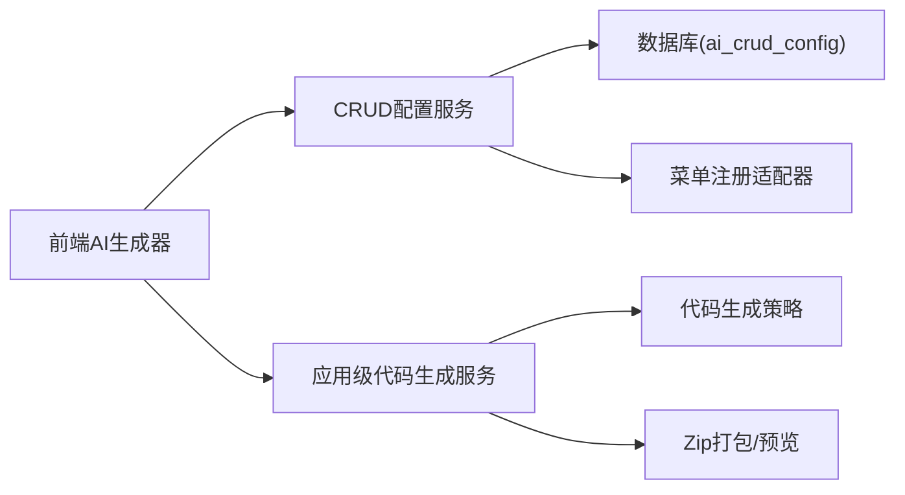

# CRUD生成器

<cite>
**本文引用的文件**
- [2026-04-21-crud-generator-design.md](file://docs/superpowers/specs/2026-04-21-crud-generator-design.md)
- [SKILL.md](file://.agents/skills/forge-codegen-crud/SKILL.md)
- [single-table-crud.md](file://.agents/skills/forge-codegen-crud/references/single-table-crud.md)
- [crud-generator.vue](file://forge-admin-ui/src/views/ai/crud-generator.vue)
- [BusinessApplicationCodegenService.java](file://forge-server/forge-framework/forge-plugin-parent/forge-plugin-generator/src/main/java/com/mdframe/forge/plugin/generator/service/businessapp/BusinessApplicationCodegenService.java)
- [AiCrudConfigService.java](file://forge-server/forge-framework/forge-plugin-parent/forge-plugin-generator/src/main/java/com/mdframe/forge/plugin/generator/service/AiCrudConfigService.java)
- [AiCrudConfig.java](file://forge-server/forge-framework/forge-plugin-parent/forge-plugin-generator/src/main/java/com/mdframe/forge/plugin/generator/domain/entity/AiCrudConfig.java)
- [CodegenStrategy.java](file://forge-server/forge-framework/forge-plugin-parent/forge-plugin-generator/src/main/java/com/mdframe/forge/plugin/generator/codegen/CodegenStrategy.java)
- [AiCodegenStrategy.java](file://forge-server/forge-framework/forge-plugin-parent/forge-plugin-generator/src/main/java/com/mdframe/forge/plugin/generator/codegen/AiCodegenStrategy.java)
- [DynamicCrudService.java](file://forge-server/forge-framework/forge-plugin-parent/forge-plugin-generator/src/main/java/com/mdframe/forge/plugin/generator/service/DynamicCrudService.java)
</cite>

## 目录
1. [简介](#简介)
2. [项目结构](#项目结构)
3. [核心组件](#核心组件)
4. [架构总览](#架构总览)
5. [详细组件分析](#详细组件分析)
6. [依赖关系分析](#依赖关系分析)
7. [性能考虑](#性能考虑)
8. [故障排查指南](#故障排查指南)
9. [结论](#结论)
10. [附录](#附录)

## 简介
本文件面向Forge Admin的CRUD生成器，系统性说明基于业务对象的自动代码与页面配置生成能力。内容覆盖：
- 列表、详情、编辑页面的自动生成机制
- 代码生成的配置项、模板定制与扩展点集成
- 查询条件、操作按钮、导入导出等CRUD功能定制
- 前端AI生成器交互流程与后端服务协作
- 实际使用示例与最佳实践指引

## 项目结构
CRUD生成器由“前端AI生成器”和“后端配置与代码生成服务”两部分组成：
- 前端：提供对话式AI生成界面，支持搜索/表格/编辑/接口配置的可视化编辑与保存
- 后端：负责CRUD配置的持久化、渲染、发布版本管理、以及按应用维度批量生成代码包

图表来源
- [crud-generator.vue:1-800](file://forge-admin-ui/src/views/ai/crud-generator.vue#L1-L800)
- [AiCrudConfigService.java:1-759](file://forge-server/forge-framework/forge-plugin-parent/forge-plugin-generator/src/main/java/com/mdframe/forge/plugin/generator/service/AiCrudConfigService.java#L1-L759)
- [BusinessApplicationCodegenService.java:1-514](file://forge-server/forge-framework/forge-plugin-parent/forge-plugin-generator/src/main/java/com/mdframe/forge/plugin/generator/service/businessapp/BusinessApplicationCodegenService.java#L1-L514)
- [CodegenStrategy.java:1-30](file://forge-server/forge-framework/forge-plugin-parent/forge-plugin-generator/src/main/java/com/mdframe/forge/plugin/generator/codegen/CodegenStrategy.java#L1-L30)
- [AiCodegenStrategy.java:28-54](file://forge-server/forge-framework/forge-plugin-parent/forge-plugin-generator/src/main/java/com/mdframe/forge/plugin/generator/codegen/AiCodegenStrategy.java#L28-L54)
- [AiCrudConfig.java:1-97](file://forge-server/forge-framework/forge-plugin-parent/forge-plugin-generator/src/main/java/com/mdframe/forge/plugin/generator/domain/entity/AiCrudConfig.java#L1-L97)

章节来源
- [2026-04-21-crud-generator-design.md:1-356](file://docs/superpowers/specs/2026-04-21-crud-generator-design.md#L1-L356)
- [SKILL.md:1-57](file://.agents/skills/forge-codegen-crud/SKILL.md#L1-L57)

## 核心组件
- 前端AI生成器页面：提供会话历史、流式生成进度、四元配置（搜索/列/编辑/接口）编辑器、高级配置（字典/脱敏/加解密/翻译）、SQL/表结构查看与执行、菜单挂载选择、预览与下载等能力
- CRUD配置服务：负责配置的创建/更新/删除、草稿与发布版本管理、渲染配置组装、菜单注册联动、缓存与权限校验
- 应用级代码生成服务：按业务应用维度聚合对象，准备配置并调用代码生成服务，输出可预览/下载的完整代码包
- 代码生成策略：通过策略模式统一接入不同生成方式（当前预留AI策略占位）
- 运行时装配：将配置转换为运行时可用的查询、列、表单、API契约，支撑动态CRUD运行

章节来源
- [crud-generator.vue:1-800](file://forge-admin-ui/src/views/ai/crud-generator.vue#L1-L800)
- [AiCrudConfigService.java:1-759](file://forge-server/forge-framework/forge-plugin-parent/forge-plugin-generator/src/main/java/com/mdframe/forge/plugin/generator/service/AiCrudConfigService.java#L1-L759)
- [BusinessApplicationCodegenService.java:1-514](file://forge-server/forge-framework/forge-plugin-parent/forge-plugin-generator/src/main/java/com/mdframe/forge/plugin/generator/service/businessapp/BusinessApplicationCodegenService.java#L1-L514)
- [CodegenStrategy.java:1-30](file://forge-server/forge-framework/forge-plugin-parent/forge-plugin-generator/src/main/java/com/mdframe/forge/plugin/generator/codegen/CodegenStrategy.java#L1-L30)
- [AiCodegenStrategy.java:28-54](file://forge-server/forge-framework/forge-plugin-parent/forge-plugin-generator/src/main/java/com/mdframe/forge/plugin/generator/codegen/AiCodegenStrategy.java#L28-L54)
- [DynamicCrudService.java:2431-2458](file://forge-server/forge-framework/forge-plugin-parent/forge-plugin-generator/src/main/java/com/mdframe/forge/plugin/generator/service/DynamicCrudService.java#L2431-L2458)

## 架构总览
CRUD生成器采用“前后端分离 + 配置驱动 + 策略生成”的架构：
- 前端通过SSE/流式接口获取AI生成进度与增量内容，实时编辑四元配置与高级配置
- 后端将配置持久化到AiCrudConfig，并提供渲染视图供低代码运行时消费
- 应用级代码生成服务根据业务对象与配置，生成后端Java、Mapper XML、前端页面与API、SQL脚本等，打包为zip或预览
- 运行时通过DynamicCrudService将配置解析为查询、列、表单、API契约，实现无侵入的动态CRUD

图表来源
- [crud-generator.vue:1-800](file://forge-admin-ui/src/views/ai/crud-generator.vue#L1-L800)
- [BusinessApplicationCodegenService.java:97-189](file://forge-server/forge-framework/forge-plugin-parent/forge-plugin-generator/src/main/java/com/mdframe/forge/plugin/generator/service/businessapp/BusinessApplicationCodegenService.java#L97-L189)
- [CodegenStrategy.java:13-30](file://forge-server/forge-framework/forge-plugin-parent/forge-plugin-generator/src/main/java/com/mdframe/forge/plugin/generator/codegen/CodegenStrategy.java#L13-L30)
- [AiCrudConfigService.java:353-440](file://forge-server/forge-framework/forge-plugin-parent/forge-plugin-generator/src/main/java/com/mdframe/forge/plugin/generator/service/AiCrudConfigService.java#L353-L440)

## 详细组件分析

### 前端AI生成器（crud-generator.vue）
- 三栏布局：左侧会话历史、中间对话+配置区、右侧配置面板（核心/高级/SQL分组）
- 流式阶段进度：分析需求→推断元数据→搜索配置→表格列→编辑表单→接口配置→建表SQL
- 配置编辑器：SchemaFieldEditor用于search/columns/edit，ApiConfigEditor用于接口映射
- 高级配置：字典、脱敏、加解密、翻译面板，支持对列/表单字段进行增强
- SQL/表结构：支持查看与执行建表SQL（需权限控制）
- 保存与更多操作：保存配置、复制、导出全部、预览页面、下载代码

图表来源
- [crud-generator.vue:1-800](file://forge-admin-ui/src/views/ai/crud-generator.vue#L1-L800)

章节来源
- [crud-generator.vue:1-800](file://forge-admin-ui/src/views/ai/crud-generator.vue#L1-L800)
- [2026-04-21-crud-generator-design.md:103-180](file://docs/superpowers/specs/2026-04-21-crud-generator-design.md#L103-L180)

### CRUD配置服务（AiCrudConfigService）
- 配置生命周期：创建/更新/删除，JSON字段校验，草稿与发布版本管理
- 渲染配置：从modelSchema/pageSchema构建运行时配置，兼容旧版search/columns/edit/api存储
- 菜单联动：配置驱动模式下自动注册/更新/删除菜单资源
- 缓存与权限：按租户隔离的短期缓存；设计预览需要特定权限
- 发布快照：发布时记录快照，运行时优先读取发布版本

图表来源
- [AiCrudConfigService.java:115-238](file://forge-server/forge-framework/forge-plugin-parent/forge-plugin-generator/src/main/java/com/mdframe/forge/plugin/generator/service/AiCrudConfigService.java#L115-L238)
- [AiCrudConfigService.java:353-440](file://forge-server/forge-framework/forge-plugin-parent/forge-plugin-generator/src/main/java/com/mdframe/forge/plugin/generator/service/AiCrudConfigService.java#L353-L440)
- [AiCrudConfig.java:1-97](file://forge-server/forge-framework/forge-plugin-parent/forge-plugin-generator/src/main/java/com/mdframe/forge/plugin/generator/domain/entity/AiCrudConfig.java#L1-L97)

章节来源
- [AiCrudConfigService.java:1-759](file://forge-server/forge-framework/forge-plugin-parent/forge-plugin-generator/src/main/java/com/mdframe/forge/plugin/generator/service/AiCrudConfigService.java#L1-L759)
- [AiCrudConfig.java:1-97](file://forge-server/forge-framework/forge-plugin-parent/forge-plugin-generator/src/main/java/com/mdframe/forge/plugin/generator/domain/entity/AiCrudConfig.java#L1-L97)

### 应用级代码生成服务（BusinessApplicationCodegenService）
- 应用维度聚合：读取应用对象集合，选择主对象与关联对象，生成统一代码包
- 配置准备：合并应用选项与请求参数，计算模块名、包名、输出路径、开关
- 文件合并与冲突检测：同一路径内容不一致时报错，避免重复生成
- 产物清单：生成application-manifest.json与README.md，记录生成范围与对象信息
- 预览与下载：返回文件Map或打包zip

图表来源
- [BusinessApplicationCodegenService.java:76-139](file://forge-server/forge-framework/forge-plugin-parent/forge-plugin-generator/src/main/java/com/mdframe/forge/plugin/generator/service/businessapp/BusinessApplicationCodegenService.java#L76-L139)
- [BusinessApplicationCodegenService.java:159-201](file://forge-server/forge-framework/forge-plugin-parent/forge-plugin-generator/src/main/java/com/mdframe/forge/plugin/generator/service/businessapp/BusinessApplicationCodegenService.java#L159-L201)

章节来源
- [BusinessApplicationCodegenService.java:1-514](file://forge-server/forge-framework/forge-plugin-parent/forge-plugin-generator/src/main/java/com/mdframe/forge/plugin/generator/service/businessapp/BusinessApplicationCodegenService.java#L1-L514)

### 代码生成策略（CodegenStrategy 与 AiCodegenStrategy）
- 策略接口：定义supports与generate，便于未来扩展多种生成方式
- AI策略占位：当前抛出未实现异常，提示使用TEMPLATE模式或等待实现
- 扩展建议：实现AI策略以对接大模型，支持流式响应、质量检查与缓存

图表来源
- [CodegenStrategy.java:13-30](file://forge-server/forge-framework/forge-plugin-parent/forge-plugin-generator/src/main/java/com/mdframe/forge/plugin/generator/codegen/CodegenStrategy.java#L13-L30)
- [AiCodegenStrategy.java:28-54](file://forge-server/forge-framework/forge-plugin-parent/forge-plugin-generator/src/main/java/com/mdframe/forge/plugin/generator/codegen/AiCodegenStrategy.java#L28-L54)

章节来源
- [CodegenStrategy.java:1-30](file://forge-server/forge-framework/forge-plugin-parent/forge-plugin-generator/src/main/java/com/mdframe/forge/plugin/generator/codegen/CodegenStrategy.java#L1-L30)
- [AiCodegenStrategy.java:28-54](file://forge-server/forge-framework/forge-plugin-parent/forge-plugin-generator/src/main/java/com/mdframe/forge/plugin/generator/codegen/AiCodegenStrategy.java#L28-L54)

### 运行时装配（DynamicCrudService）
- 字段别名与映射：将编辑表单字段别名映射到运行时列映射，支持snake/camel转换
- 允许字段白名单：从search/columns/edit提取允许字段，保障安全与一致性
- 树形运行时：在树形场景下追加过滤字段到允许查询字段集

图表来源
- [DynamicCrudService.java:2431-2458](file://forge-server/forge-framework/forge-plugin-parent/forge-plugin-generator/src/main/java/com/mdframe/forge/plugin/generator/service/DynamicCrudService.java#L2431-L2458)
- [DynamicCrudService.java:4951-4969](file://forge-server/forge-framework/forge-plugin-parent/forge-plugin-generator/src/main/java/com/mdframe/forge/plugin/generator/service/DynamicCrudService.java#L4951-L4969)

章节来源
- [DynamicCrudService.java:2431-2458](file://forge-server/forge-framework/forge-plugin-parent/forge-plugin-generator/src/main/java/com/mdframe/forge/plugin/generator/service/DynamicCrudService.java#L2431-L2458)
- [DynamicCrudService.java:4951-4969](file://forge-server/forge-framework/forge-plugin-parent/forge-plugin-generator/src/main/java/com/mdframe/forge/plugin/generator/service/DynamicCrudService.java#L4951-L4969)

## 依赖关系分析
- 前端依赖：NUI组件、Monaco/编辑器、图标库、路由与状态管理
- 后端依赖：MyBatis-Plus、FastJSON、Jackson、权限与会话上下文、菜单注册适配器
- 外部集成：AI供应商/模型（通过策略与客户端适配）、Excel导入导出、Flyway迁移

图表来源
- [crud-generator.vue:1-800](file://forge-admin-ui/src/views/ai/crud-generator.vue#L1-L800)
- [AiCrudConfigService.java:115-238](file://forge-server/forge-framework/forge-plugin-parent/forge-plugin-generator/src/main/java/com/mdframe/forge/plugin/generator/service/AiCrudConfigService.java#L115-L238)
- [BusinessApplicationCodegenService.java:76-139](file://forge-server/forge-framework/forge-plugin-parent/forge-plugin-generator/src/main/java/com/mdframe/forge/plugin/generator/service/businessapp/BusinessApplicationCodegenService.java#L76-L139)

章节来源
- [AiCrudConfigService.java:115-238](file://forge-server/forge-framework/forge-plugin-parent/forge-plugin-generator/src/main/java/com/mdframe/forge/plugin/generator/service/AiCrudConfigService.java#L115-L238)
- [BusinessApplicationCodegenService.java:76-139](file://forge-server/forge-framework/forge-plugin-parent/forge-plugin-generator/src/main/java/com/mdframe/forge/plugin/generator/service/businessapp/BusinessApplicationCodegenService.java#L76-L139)

## 性能考虑
- 配置缓存：按租户与configKey短期缓存，减少重复查询
- 流式输出：前端分阶段展示进度，降低长耗时阻塞体验
- 代码包体积：按需勾选includeBackend/includeFrontend/includeSql，减少不必要产物
- 运行时查询：允许字段白名单与列映射优化查询构造，避免全表扫描

[本节为通用指导，不直接分析具体文件]

## 故障排查指南
- configKey格式错误：需小写字母开头，仅含小写字母+数字+下划线，长度2-64
- JSON字段非法：search/columns/edit/api/options/dict/desensitize/encrypt/trans必须为合法JSON
- 发布版本缺失：LOWCODE模式需发布后才能运行；草稿预览需具备设计预览权限
- 菜单删除失败：若菜单已被角色授权，需先移除授权再删除
- 代码包文件冲突：多对象生成相同路径且内容不一致，需检查表名/类名配置

章节来源
- [AiCrudConfigService.java:115-238](file://forge-server/forge-framework/forge-plugin-parent/forge-plugin-generator/src/main/java/com/mdframe/forge/plugin/generator/service/AiCrudConfigService.java#L115-L238)
- [AiCrudConfigService.java:708-731](file://forge-server/forge-framework/forge-plugin-parent/forge-plugin-generator/src/main/java/com/mdframe/forge/plugin/generator/service/AiCrudConfigService.java#L708-L731)
- [BusinessApplicationCodegenService.java:191-201](file://forge-server/forge-framework/forge-plugin-parent/forge-plugin-generator/src/main/java/com/mdframe/forge/plugin/generator/service/businessapp/BusinessApplicationCodegenService.java#L191-L201)

## 结论
Forge Admin的CRUD生成器通过“AI辅助配置 + 配置驱动 + 策略生成”的方式，实现了从描述到页面配置的快速产出，并支持按应用维度批量生成后端与前端代码。其优势在于：
- 低门槛：通过自然语言与可视化编辑器快速生成CRUD
- 高可控：四元配置与高级配置精细可调
- 可扩展：策略模式预留AI/模板等多种生成方式
- 可运维：发布版本与快照机制保障稳定性

## 附录

### 配置项速查
- 基础配置：configKey、tableName、appName、layoutType、mode、buildMode、status、publishStatus
- 页面配置：searchSchema、columnsSchema、editSchema、apiConfig
- 高级配置：dictConfig、desensitizeConfig、encryptConfig、transConfig
- 运行时：modelSchema、pageSchema、runtimeDatasource*、primaryKey*、tenantStrategy、auditStrategy、logicDeleteStrategy
- 版本信息：draftVersion、publishedVersion、publishTime、publishBy

章节来源
- [AiCrudConfig.java:1-97](file://forge-server/forge-framework/forge-plugin-parent/forge-plugin-generator/src/main/java/com/mdframe/forge/plugin/generator/domain/entity/AiCrudConfig.java#L1-L97)

### 单表CRUD约定（参考）
- 后端Controller使用POST-safe接口：detail/create/update/delete/batch delete
- Service处理校验、唯一性、事务边界；Mapper XML承载分页与复杂查询
- 前端使用AiCrudPage绑定API与schema，启用导入导出时需配套Excel配置

章节来源
- [single-table-crud.md:57-120](file://.agents/skills/forge-codegen-crud/references/single-table-crud.md#L57-L120)
- [single-table-crud.md:142-209](file://.agents/skills/forge-codegen-crud/references/single-table-crud.md#L142-L209)

### 技能与工作流（参考）
- 生成前确认模块/对象/表/路由/权限/字典/加密/导入导出等要素
- 遵循Flyway脚本、逻辑删除、字典、资源菜单等规范
- 生成顺序：Flyway SQL → 后端 → 前端 → 菜单/资源种子SQL → 验证清单

章节来源
- [SKILL.md:12-41](file://.agents/skills/forge-codegen-crud/SKILL.md#L12-L41)