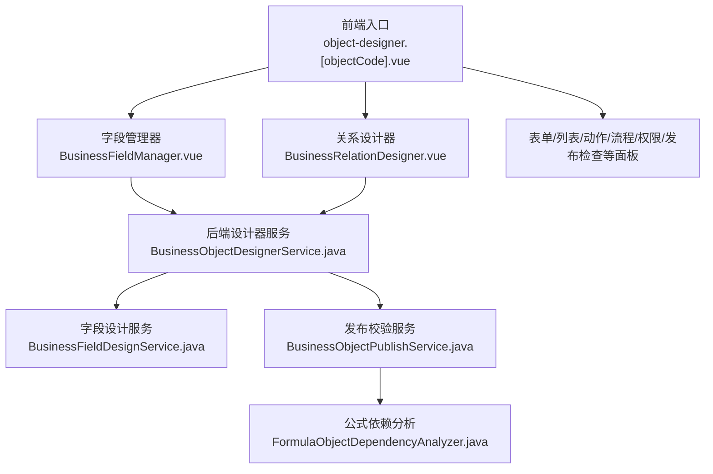
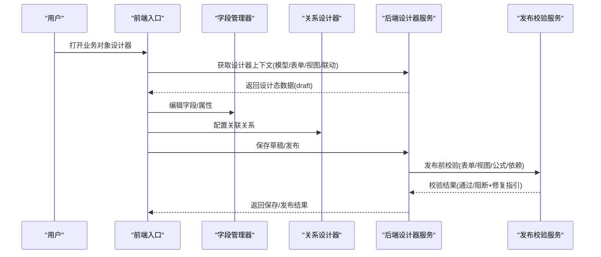
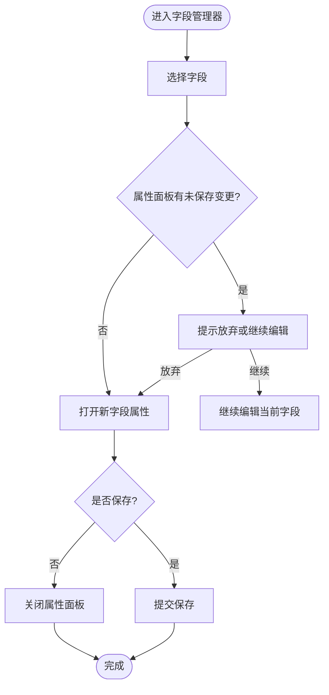
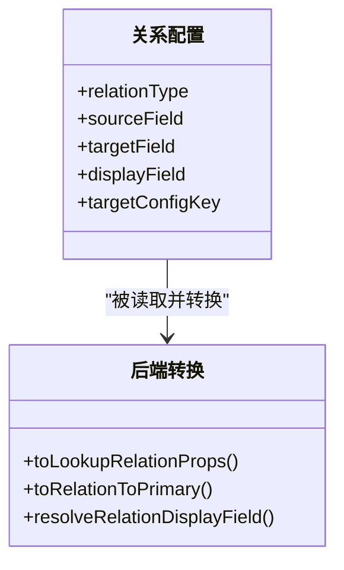
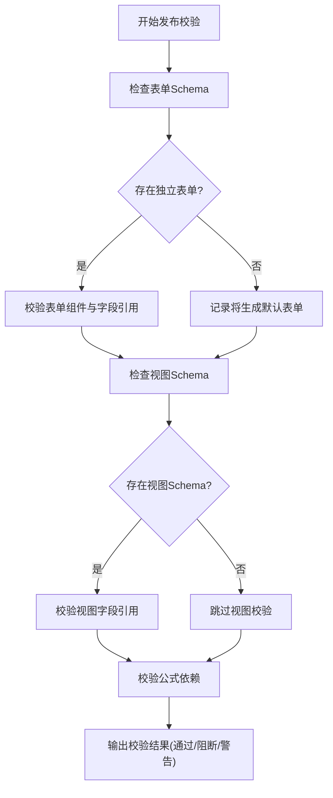
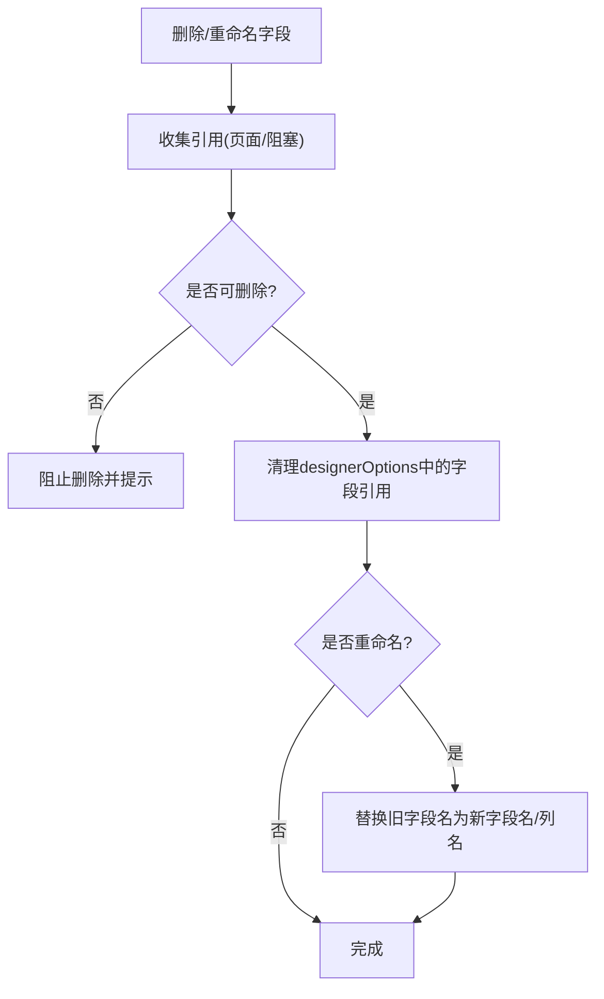
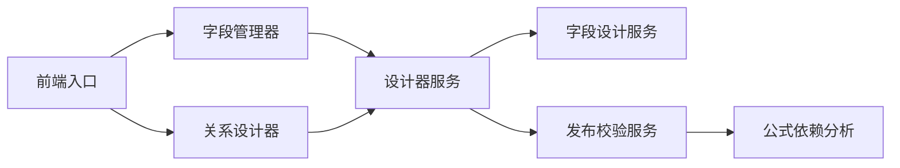

# 业务对象设计器

<cite>
**本文引用的文件**
- [object-designer.[objectCode].vue](file://forge-admin-ui/src/views/app-center/object-designer.[objectCode].vue)
- [BusinessFieldManager.vue](file://forge-admin-ui/src/views/app-center/components/designer/BusinessFieldManager.vue)
- [BusinessRelationDesigner.vue](file://forge-admin-ui/src/views/app-center/components/designer/BusinessRelationDesigner.vue)
- [BusinessObjectDesignerService.java](file://forge-server/forge-framework/forge-plugin-parent/forge-plugin-generator/src/main/java/com/mdframe/forge/plugin/generator/service/businessapp/BusinessObjectDesignerService.java)
- [BusinessFieldDesignService.java](file://forge-server/forge-framework/forge-plugin-parent/forge-plugin-generator/src/main/java/com/mdframe/forge/plugin/generator/service/businessapp/BusinessFieldDesignService.java)
- [BusinessObjectPublishService.java](file://forge-server/forge-framework/forge-plugin-parent/forge-plugin-generator/src/main/java/com/mdframe/forge/plugin/generator/service/businessapp/BusinessObjectPublishService.java)
- [FormulaObjectDependencyAnalyzer.java](file://forge-server/forge-framework/forge-plugin-parent/forge-plugin-generator/src/main/java/com/mdframe/forge/plugin/generator/service/formula/FormulaObjectDependencyAnalyzer.java)
</cite>

## 目录
1. [简介](#简介)
2. [项目结构](#项目结构)
3. [核心组件](#核心组件)
4. [架构总览](#架构总览)
5. [详细组件分析](#详细组件分析)
6. [依赖关系分析](#依赖关系分析)
7. [性能考虑](#性能考虑)
8. [故障排查指南](#故障排查指南)
9. [结论](#结论)
10. [附录](#附录)

## 简介
本文件面向 Forge Admin 的“业务对象设计器”，系统性阐述业务对象的建模概念、字段类型与配置、关联关系设计、验证规则设置，以及可视化设计器的实现原理与交互流程。文档覆盖字段管理器、关系设计器、属性面板等关键组件的工作机制，并提供完整的创建流程、配置指南、最佳实践与扩展建议（含自定义字段类型与验证规则的扩展思路）。

## 项目结构
业务对象设计器由前端页面容器与各子设计器组成，后端提供模型装配、发布校验与依赖分析能力：
- 前端入口页负责加载设计器上下文、路由到不同面板（基本信息、字段、数据模型、表单、列表、关系、动作、流程应用、权限树、发布检查、高级配置），并协调各子设计器之间的状态同步与保存。
- 字段管理器和关系设计器是建模的核心 UI；属性面板承载字段级配置与校验规则编辑。
- 后端服务负责将模型、视图、表单、联动规则等统一装配为可发布的业务对象设计态数据，并在发布阶段进行一致性校验与依赖分析。

图表来源
- [object-designer.[objectCode].vue:1-274](file://forge-admin-ui/src/views/app-center/object-designer.[objectCode].vue#L1-L274)
- [BusinessFieldManager.vue:75-101](file://forge-admin-ui/src/views/app-center/components/designer/BusinessFieldManager.vue#L75-L101)
- [BusinessObjectDesignerService.java:1446-1469](file://forge-server/forge-framework/forge-plugin-parent/forge-plugin-generator/src/main/java/com/mdframe/forge/plugin/generator/service/businessapp/BusinessObjectDesignerService.java#L1446-L1469)
- [BusinessFieldDesignService.java:385-416](file://forge-server/forge-framework/forge-plugin-parent/forge-plugin-generator/src/main/java/com/mdframe/forge/plugin/generator/service/businessapp/BusinessFieldDesignService.java#L385-L416)
- [BusinessObjectPublishService.java:1149-1174](file://forge-server/forge-framework/forge-plugin-parent/forge-plugin-generator/src/main/java/com/mdframe/forge/plugin/generator/service/businessapp/BusinessObjectPublishService.java#L1149-L1174)
- [FormulaObjectDependencyAnalyzer.java:115-134](file://forge-server/forge-framework/forge-plugin-parent/forge-plugin-generator/src/main/java/com/mdframe/forge/plugin/generator/service/formula/FormulaObjectDependencyAnalyzer.java#L115-L134)

章节来源
- [object-designer.[objectCode].vue:1-274](file://forge-admin-ui/src/views/app-center/object-designer.[objectCode].vue#L1-L274)

## 核心组件
- 设计器外壳与导航：负责加载设计器上下文、维护草稿状态、处理保存/发布/预览、在多个面板间切换，并将当前面板的数据同步到底层 schema（模型、视图、表单、联动规则等）。
- 字段管理器：集中展示与管理业务对象的所有字段，支持新增、编辑、删除、排序、可见性控制、默认值、校验规则、显示标签、国际化等；右侧抽屉式属性面板用于精细化配置。
- 关系设计器：以可视化方式定义对象间的关联关系（一对一、一对多、多对一等），包括源字段、目标字段、显示字段、级联行为、查询投影等。
- 表单/列表/动作/流程/权限/发布检查：围绕同一份模型与字段，生成运行时可用的表单布局、列表列、动作编排、流程绑定、权限树映射与发布前检查清单。

章节来源
- [object-designer.[objectCode].vue:86-271](file://forge-admin-ui/src/views/app-center/object-designer.[objectCode].vue#L86-L271)
- [BusinessFieldManager.vue:75-101](file://forge-admin-ui/src/views/app-center/components/designer/BusinessFieldManager.vue#L75-L101)
- [BusinessRelationDesigner.vue:192-208](file://forge-admin-ui/src/views/app-center/object-designer.[objectCode].vue#L192-L208)

## 架构总览
设计器采用“前端多面板 + 后端统一装配”的分层架构：
- 前端通过单一入口聚合多个子设计器，使用响应式状态管理 draft（包含 fields、modelSchema、pageSchema、viewSchema、linkageSchema、designerOptions 等）。
- 后端 BusinessObjectDesignerService 将模型、视图、表单、联动规则等统一转换为设计态数据，供前端渲染与编辑。
- 发布阶段由 BusinessObjectPublishService 执行一致性校验（表单优先、视图投影、字段注册表、公式依赖等），确保运行期稳定。

图表来源
- [object-designer.[objectCode].vue:565-611](file://forge-admin-ui/src/views/app-center/object-designer.[objectCode].vue#L565-L611)
- [BusinessObjectDesignerService.java:1446-1469](file://forge-server/forge-framework/forge-plugin-parent/forge-plugin-generator/src/main/java/com/mdframe/forge/plugin/generator/service/businessapp/BusinessObjectDesignerService.java#L1446-L1469)
- [BusinessObjectPublishService.java:1149-1174](file://forge-server/forge-framework/forge-plugin-parent/forge-plugin-generator/src/main/java/com/mdframe/forge/plugin/generator/service/businessapp/BusinessObjectPublishService.java#L1149-L1174)

## 详细组件分析

### 字段管理器与属性面板
- 职责：集中管理字段集合，支持选择字段后打开右侧抽屉式属性面板进行精细化配置；在未保存时提供切换保护提示。
- 关键交互：
  - 选中字段后打开属性面板，若存在未保存变更则提示放弃或继续编辑。
  - 关闭属性面板时同样检测未保存变更，避免误丢修改。
  - 支持批量操作与脏标记，便于整体保存。
- 数据流：字段列表与属性来自 draft.fields 与 designerOptions，保存时回写至后端设计器数据。

图表来源
- [BusinessFieldManager.vue:390-442](file://forge-admin-ui/src/views/app-center/components/designer/BusinessFieldManager.vue#L390-L442)

章节来源
- [BusinessFieldManager.vue:75-101](file://forge-admin-ui/src/views/app-center/components/designer/BusinessFieldManager.vue#L75-L101)
- [BusinessFieldManager.vue:390-442](file://forge-admin-ui/src/views/app-center/components/designer/BusinessFieldManager.vue#L390-L442)

### 关系设计器
- 职责：可视化配置对象间关联关系，包括源字段、目标字段、显示字段、级联策略、查询投影等。
- 关键点：
  - 关系配置会写入 linkageSchema 与 designerOptions，供表单/列表/查询等运行时使用。
  - 后端在转换关系时解析 displayField、targetConfigKey、source/target field 等，保证跨对象展示一致。
- 交互：在数据模型面板中切换“对象关系”标签，拖拽或选择建立关系，实时预览效果。

图表来源
- [BusinessObjectDesignerService.java:1446-1469](file://forge-server/forge-framework/forge-plugin-parent/forge-plugin-generator/src/main/java/com/mdframe/forge/plugin/generator/service/businessapp/BusinessObjectDesignerService.java#L1446-L1469)
- [BusinessObjectDesignerService.java:1616-1632](file://forge-server/forge-framework/forge-plugin-parent/forge-plugin-generator/src/main/java/com/mdframe/forge/plugin/generator/service/businessapp/BusinessObjectDesignerService.java#L1616-L1632)

章节来源
- [object-designer.[objectCode].vue:101-120](file://forge-admin-ui/src/views/app-center/object-designer.[objectCode].vue#L101-L120)
- [BusinessObjectDesignerService.java:1446-1469](file://forge-server/forge-framework/forge-plugin-parent/forge-plugin-generator/src/main/java/com/mdframe/forge/plugin/generator/service/businessapp/BusinessObjectDesignerService.java#L1446-L1469)

### 发布校验与依赖分析
- 表单优先校验：当存在独立表单 Schema 时，校验表单组件树与字段注册表的一致性；若无独立表单但有业务字段，则提示将按字段注册表生成默认表单。
- 视图投影校验：校验 viewSchema 中的字段引用是否在 modelSchema 中存在。
- 公式依赖校验：校验公式中引用的对象、字段是否存在且可访问，输出错误与警告。
- 联动规则兼容：从 designerOptions 中读取 legacy linkage rules，桥接到新的表单治理体系。

图表来源
- [BusinessObjectPublishService.java:1149-1174](file://forge-server/forge-framework/forge-plugin-parent/forge-plugin-generator/src/main/java/com/mdframe/forge/plugin/generator/service/businessapp/BusinessObjectPublishService.java#L1149-L1174)
- [BusinessObjectPublishService.java:2249-2283](file://forge-server/forge-framework/forge-plugin-parent/forge-plugin-generator/src/main/java/com/mdframe/forge/plugin/generator/service/businessapp/BusinessObjectPublishService.java#L2249-L2283)
- [FormulaObjectDependencyAnalyzer.java:115-134](file://forge-server/forge-framework/forge-plugin-parent/forge-plugin-generator/src/main/java/com/mdframe/forge/plugin/generator/service/formula/FormulaObjectDependencyAnalyzer.java#L115-L134)

章节来源
- [BusinessObjectPublishService.java:1149-1174](file://forge-server/forge-framework/forge-plugin-parent/forge-plugin-generator/src/main/java/com/mdframe/forge/plugin/generator/service/businessapp/BusinessObjectPublishService.java#L1149-L1174)
- [BusinessObjectPublishService.java:2249-2283](file://forge-server/forge-framework/forge-plugin-parent/forge-plugin-generator/src/main/java/com/mdframe/forge/plugin/generator/service/businessapp/BusinessObjectPublishService.java#L2249-L2283)
- [FormulaObjectDependencyAnalyzer.java:115-134](file://forge-server/forge-framework/forge-plugin-parent/forge-plugin-generator/src/main/java/com/mdframe/forge/plugin/generator/service/formula/FormulaObjectDependencyAnalyzer.java#L115-L134)

### 字段设计与选项清理
- 字段删除保护：在删除字段时，收集页面引用与阻塞性引用，决定是否允许删除，防止破坏现有配置。
- 设计器选项清理：删除字段后，自动清理 designerOptions 中对该字段的嵌套引用，保持配置整洁。
- 字段重命名替换：重命名字段时，自动替换 designerOptions 中旧字段名与新列名的引用，避免断裂。

图表来源
- [BusinessFieldDesignService.java:385-416](file://forge-server/forge-framework/forge-plugin-parent/forge-plugin-generator/src/main/java/com/mdframe/forge/plugin/generator/service/businessapp/BusinessFieldDesignService.java#L385-L416)
- [BusinessFieldDesignService.java:502-518](file://forge-server/forge-framework/forge-plugin-parent/forge-plugin-generator/src/main/java/com/mdframe/forge/plugin/generator/service/businessapp/BusinessFieldDesignService.java#L502-L518)

章节来源
- [BusinessFieldDesignService.java:385-416](file://forge-server/forge-framework/forge-plugin-parent/forge-plugin-generator/src/main/java/com/mdframe/forge/plugin/generator/service/businessapp/BusinessFieldDesignService.java#L385-L416)
- [BusinessFieldDesignService.java:502-518](file://forge-server/forge-framework/forge-plugin-parent/forge-plugin-generator/src/main/java/com/mdframe/forge/plugin/generator/service/businessapp/BusinessFieldDesignService.java#L502-L518)

## 依赖关系分析
- 前端依赖：
  - object-designer.[objectCode].vue 作为壳，按需异步加载各子设计器，减少首屏体积。
  - 字段管理器与关系设计器共享 draft 状态，并通过事件回调更新父级状态。
- 后端依赖：
  - BusinessObjectDesignerService 负责将模型、视图、表单、联动规则等统一装配为设计态数据。
  - BusinessFieldDesignService 负责字段级元数据增强（引用统计、删除保护、选项清理）。
  - BusinessObjectPublishService 在发布阶段执行一致性校验，保障运行期稳定性。
  - FormulaObjectDependencyAnalyzer 提供公式依赖分析，确保公式中字段/对象可用。

图表来源
- [object-designer.[objectCode].vue:344-355](file://forge-admin-ui/src/views/app-center/object-designer.[objectCode].vue#L344-L355)
- [BusinessObjectDesignerService.java:1446-1469](file://forge-server/forge-framework/forge-plugin-parent/forge-plugin-generator/src/main/java/com/mdframe/forge/plugin/generator/service/businessapp/BusinessObjectDesignerService.java#L1446-L1469)
- [BusinessFieldDesignService.java:385-416](file://forge-server/forge-framework/forge-plugin-parent/forge-plugin-generator/src/main/java/com/mdframe/forge/plugin/generator/service/businessapp/BusinessFieldDesignService.java#L385-L416)
- [BusinessObjectPublishService.java:1149-1174](file://forge-server/forge-framework/forge-plugin-parent/forge-plugin-generator/src/main/java/com/mdframe/forge/plugin/generator/service/businessapp/BusinessObjectPublishService.java#L1149-L1174)
- [FormulaObjectDependencyAnalyzer.java:115-134](file://forge-server/forge-framework/forge-plugin-parent/forge-plugin-generator/src/main/java/com/mdframe/forge/plugin/generator/service/formula/FormulaObjectDependencyAnalyzer.java#L115-L134)

章节来源
- [object-designer.[objectCode].vue:344-355](file://forge-admin-ui/src/views/app-center/object-designer.[objectCode].vue#L344-L355)

## 性能考虑
- 懒加载与按需引入：前端通过异步组件加载各设计器面板，降低初始包体与首屏时间。
- 状态最小化：draft 仅保留必要的设计态数据，避免冗余计算；面板切换时只更新相关 schema。
- 发布校验优化：后端校验分阶段执行，先快速失败（如缺失必填项），再深入校验复杂依赖。
- 字段引用清理：删除/重命名字段时自动清理 designerOptions 中的引用，减少无效配置带来的运行时开销。

[本节为通用指导，不直接分析具体文件]

## 故障排查指南
- 字段无法删除：检查该字段是否被页面或业务流程引用，若有阻塞性引用需先解除引用。
- 发布失败：查看发布检查清单中的阻断项，根据提示修复表单/视图/公式/依赖问题。
- 公式报错：确认公式中引用的对象与字段已发布且具备访问权限。
- 联动规则异常：检查 linkageSchema 中的规则是否正确映射到字段，必要时重新选择字段。

章节来源
- [BusinessFieldDesignService.java:502-518](file://forge-server/forge-framework/forge-plugin-parent/forge-plugin-generator/src/main/java/com/mdframe/forge/plugin/generator/service/businessapp/BusinessFieldDesignService.java#L502-L518)
- [BusinessObjectPublishService.java:1149-1174](file://forge-server/forge-framework/forge-plugin-parent/forge-plugin-generator/src/main/java/com/mdframe/forge/plugin/generator/service/businessapp/BusinessObjectPublishService.java#L1149-L1174)
- [FormulaObjectDependencyAnalyzer.java:115-134](file://forge-server/forge-framework/forge-plugin-parent/forge-plugin-generator/src/main/java/com/mdframe/forge/plugin/generator/service/formula/FormulaObjectDependencyAnalyzer.java#L115-L134)

## 结论
业务对象设计器通过前后端协同，提供了可视化的建模体验与严格的发布校验。字段管理器与关系设计器构成建模核心，属性面板承载细粒度配置；后端服务确保模型、视图、表单、联动规则的一致性与可发布性。遵循本文的流程与实践，可高效构建稳定可靠的业务对象。

[本节为总结性内容，不直接分析具体文件]

## 附录

### 业务对象创建流程（端到端）
- 新建或选择业务对象，进入设计器。
- 在“基本信息”面板设置名称、图标、默认标题字段、启用状态与说明。
- 在“字段”面板添加字段，配置类型、标签、默认值、校验规则、可见性等。
- 在“数据模型 → 对象关系”中配置关联关系，设置源/目标字段与显示字段。
- 在“表单/列表”面板生成或调整运行时布局。
- 在“动作/流程/权限”中配置业务动作、流程绑定与权限树映射。
- 在“发布检查”中执行发布前校验，修复阻断项后发布。

章节来源
- [object-designer.[objectCode].vue:42-271](file://forge-admin-ui/src/views/app-center/object-designer.[objectCode].vue#L42-L271)

### 字段配置指南（要点）
- 字段类型：文本、数字、日期、枚举、附件、富文本等，依据业务需求选择。
- 校验规则：必填、长度、格式、范围、唯一性等，结合发布校验确保数据质量。
- 显示与国际化：设置 label、placeholder、帮助文案，支持多语言。
- 可见性与权限：根据角色或场景控制字段可见与可编辑。

章节来源
- [BusinessFieldManager.vue:75-101](file://forge-admin-ui/src/views/app-center/components/designer/BusinessFieldManager.vue#L75-L101)

### 关联关系设计模式
- 一对一/一对多/多对一：通过源/目标字段建立关系，合理设置 displayField 提升可读性。
- 级联行为：删除/更新时的级联策略需谨慎配置，避免数据不一致。
- 查询投影：在列表/详情中按需投影关联字段，提升性能。

章节来源
- [BusinessObjectDesignerService.java:1446-1469](file://forge-server/forge-framework/forge-plugin-parent/forge-plugin-generator/src/main/java/com/mdframe/forge/plugin/generator/service/businessapp/BusinessObjectDesignerService.java#L1446-L1469)

### 扩展自定义字段类型与验证规则（思路）
- 自定义字段类型：
  - 在前端字段管理器中注册新字段类型，提供渲染与编辑组件。
  - 在后端字段设计服务中扩展字段元数据处理逻辑，确保序列化与校验一致。
- 自定义验证规则：
  - 在前端属性面板中添加规则编辑器，生成规则描述。
  - 在后端发布校验服务中增加对应规则校验逻辑，输出错误与修复指引。
- 注意事项：
  - 保持字段与规则在模型、表单、视图、联动规则中的一致性。
  - 发布前校验应覆盖新增类型与规则，避免运行期异常。

[本节为扩展指导，不直接分析具体文件]