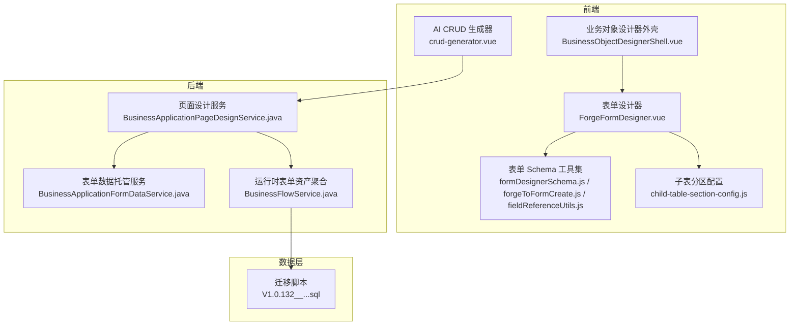
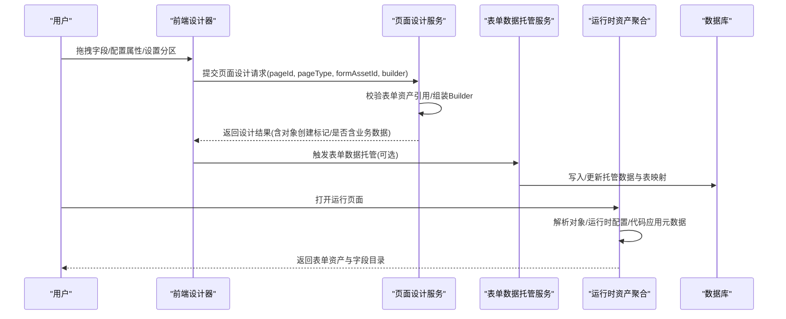
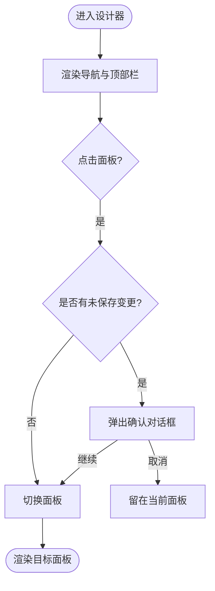
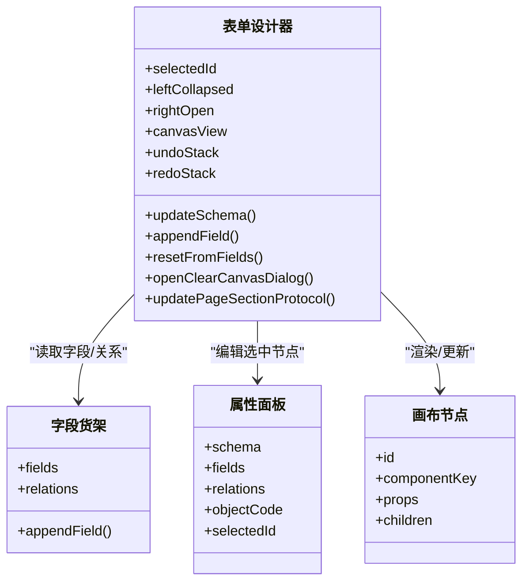
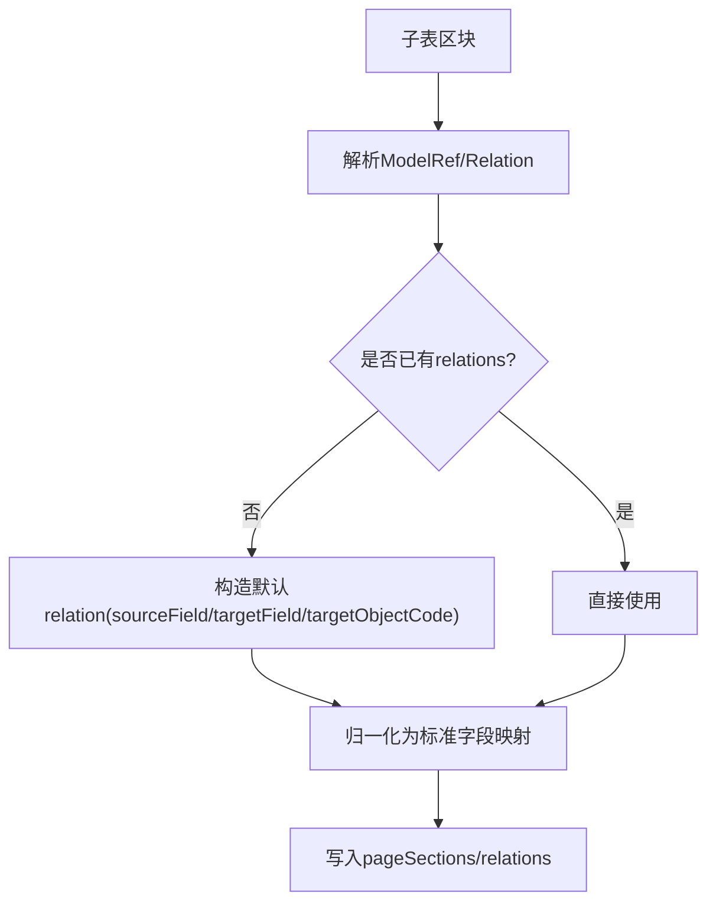
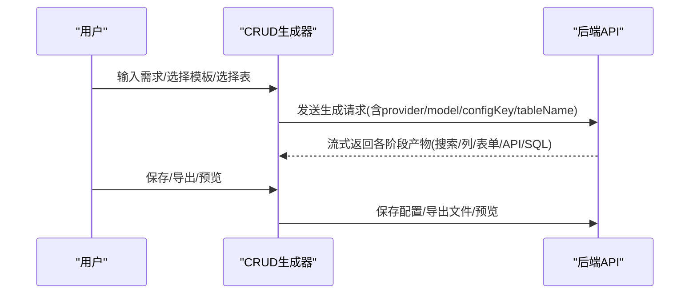
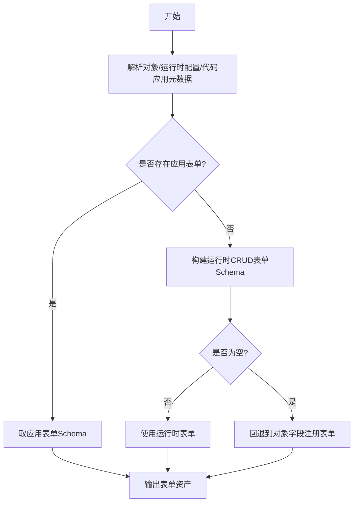
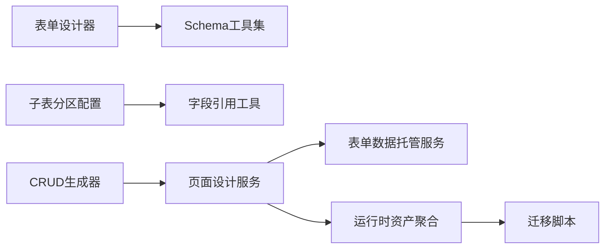

# 低代码平台

<cite>
**本文引用的文件**
- [BusinessObjectDesignerShell.vue](file://forge-admin-ui/src/views/app-center/components/designer/BusinessObjectDesignerShell.vue)
- [ForgeFormDesigner.vue](file://forge-admin-ui/src/views/app-center/components/designer/forge-form-designer/ForgeFormDesigner.vue)
- [forgeToFormCreate.js](file://forge-admin-ui/src/views/app-center/components/designer/form-first/forgeToFormCreate.js)
- [formDesignerSchema.js](file://forge-admin-ui/src/views/app-center/components/designer/form-first/formDesignerSchema.js)
- [fieldReferenceUtils.js](file://forge-admin-ui/src/views/app-center/components/designer/form-first/fieldReferenceUtils.js)
- [child-table-section-config.js](file://forge-admin-ui/src/views/app-center/components/designer/child-table-section-config.js)
- [crud-generator.vue](file://forge-admin-ui/src/views/ai/crud-generator.vue)
- [BusinessApplicationPageDesignService.java](file://forge-server/forge-framework/forge-plugin-parent/forge-plugin-generator/src/main/java/com/mdframe/forge/plugin/generator/service/businessapp/BusinessApplicationPageDesignService.java)
- [BusinessApplicationFormDataService.java](file://forge-server/forge-framework/forge-plugin-parent/forge-plugin-generator/src/main/java/com/mdframe/forge/plugin/generator/service/businessapp/BusinessApplicationFormDataService.java)
- [BusinessFlowService.java](file://forge-server/forge-framework/forge-plugin-parent/forge-plugin-generator/src/main/java/com/mdframe/forge/plugin/generator/service/businessapp/BusinessFlowService.java)
- [V1.0.132__migrate_application_page_menus_to_portal.sql](file://forge-server/db/migration/V1.0.132__migrate_application_page_menus_to_portal.sql)
</cite>

## 目录
1. [简介](#简介)
2. [项目结构](#项目结构)
3. [核心组件](#核心组件)
4. [架构总览](#架构总览)
5. [详细组件分析](#详细组件分析)
6. [依赖关系分析](#依赖关系分析)
7. [性能考量](#性能考量)
8. [故障排查指南](#故障排查指南)
9. [结论](#结论)
10. [附录](#附录)

## 简介
本文件面向 Forge Admin 低代码平台，系统性说明业务对象设计器、表单设计器、CRUD 生成器、页面模板管理与低代码应用中心的核心能力与实现原理。文档覆盖可视化设计器的数据模型、渲染引擎、代码生成机制，以及建模、字段类型、关联关系、验证规则的配置方法；并提供使用指南、扩展点集成方案、性能优化与最佳实践建议。

## 项目结构
平台采用前后端分离的模块化组织：
- 前端（forge-admin-ui）：提供业务对象设计器外壳、表单设计器画布、属性面板、分区编辑、AI 辅助 CRUD 生成器等界面与交互逻辑。
- 后端（forge-server）：提供应用与对象设计服务、页面设计与发布、运行时配置装配、流程与表单资产聚合等能力。
- 数据库迁移脚本：维护页面路由与菜单到门户化页面的迁移策略。

**图表来源**
- [BusinessObjectDesignerShell.vue:1-130](file://forge-admin-ui/src/views/app-center/components/designer/BusinessObjectDesignerShell.vue#L1-L130)
- [ForgeFormDesigner.vue:1-240](file://forge-admin-ui/src/views/app-center/components/designer/forge-form-designer/ForgeFormDesigner.vue#L1-L240)
- [BusinessApplicationPageDesignService.java:529-627](file://forge-server/forge-framework/forge-plugin-parent/forge-plugin-generator/src/main/java/com/mdframe/forge/plugin/generator/service/businessapp/BusinessApplicationPageDesignService.java#L529-L627)
- [BusinessApplicationFormDataService.java:26-51](file://forge-server/forge-framework/forge-plugin-parent/forge-plugin-generator/src/main/java/com/mdframe/forge/plugin/generator/service/businessapp/BusinessApplicationFormDataService.java#L26-L51)
- [BusinessFlowService.java:3073-3098](file://forge-server/forge-framework/forge-plugin-parent/forge-plugin-generator/src/main/java/com/mdframe/forge/plugin/generator/service/businessapp/BusinessFlowService.java#L3073-L3098)
- [V1.0.132__migrate_application_page_menus_to_portal.sql:30-42](file://forge-server/db/migration/V1.0.132__migrate_application_page_menus_to_portal.sql#L30-L42)

**章节来源**
- [BusinessObjectDesignerShell.vue:1-130](file://forge-admin-ui/src/views/app-center/components/designer/BusinessObjectDesignerShell.vue#L1-L130)
- [ForgeFormDesigner.vue:1-240](file://forge-admin-ui/src/views/app-center/components/designer/forge-form-designer/ForgeFormDesigner.vue#L1-L240)
- [BusinessApplicationPageDesignService.java:529-627](file://forge-server/forge-framework/forge-plugin-parent/forge-plugin-generator/src/main/java/com/mdframe/forge/plugin/generator/service/businessapp/BusinessApplicationPageDesignService.java#L529-L627)
- [BusinessApplicationFormDataService.java:26-51](file://forge-server/forge-framework/forge-plugin-parent/forge-plugin-generator/src/main/java/com/mdframe/forge/plugin/generator/service/businessapp/BusinessApplicationFormDataService.java#L26-L51)
- [BusinessFlowService.java:3073-3098](file://forge-server/forge-framework/forge-plugin-parent/forge-plugin-generator/src/main/java/com/mdframe/forge/plugin/generator/service/businessapp/BusinessFlowService.java#L3073-L3098)
- [V1.0.132__migrate_application_page_menus_to_portal.sql:30-42](file://forge-server/db/migration/V1.0.132__migrate_application_page_menus_to_portal.sql#L30-L42)

## 核心组件
- 业务对象设计器外壳：统一导航、状态管理（草稿/已发布/未保存）、预览与发布入口、面板切换保护。
- 表单设计器：画布、左侧字段货架、右侧属性面板、撤销/重做、多表单资产、页面分区视图、底部操作栏、详情设置。
- 表单 Schema 工具：规范化 Schema、从字段生成组件、提取字段引用、校验与修复引用。
- 子表分区配置：将子表区块映射为“分区”，并推导父子关系与字段映射。
- AI CRUD 生成器：对话式生成搜索、表格列、编辑表单、接口配置、SQL 与表结构，支持模板选择与保存/导出。
- 后端页面设计服务：接收页面设计请求，组装 Builder、校验表单资产引用、返回设计结果。
- 表单数据托管服务：将页面表单转换为应用内部托管的数据存储，联动对象创建与表映射。
- 运行时表单资产聚合：按对象或运行时配置动态拼装表单资产，提供字段目录与对象名解析。

**章节来源**
- [BusinessObjectDesignerShell.vue:1-130](file://forge-admin-ui/src/views/app-center/components/designer/BusinessObjectDesignerShell.vue#L1-L130)
- [ForgeFormDesigner.vue:1-240](file://forge-admin-ui/src/views/app-center/components/designer/forge-form-designer/ForgeFormDesigner.vue#L1-L240)
- [forgeToFormCreate.js:43-69](file://forge-admin-ui/src/views/app-center/components/designer/form-first/forgeToFormCreate.js#L43-L69)
- [child-table-section-config.js:205-245](file://forge-admin-ui/src/views/app-center/components/designer/child-table-section-config.js#L205-L245)
- [crud-generator.vue:1-800](file://forge-admin-ui/src/views/ai/crud-generator.vue#L1-L800)
- [BusinessApplicationPageDesignService.java:529-627](file://forge-server/forge-framework/forge-plugin-parent/forge-plugin-generator/src/main/java/com/mdframe/forge/plugin/generator/service/businessapp/BusinessApplicationPageDesignService.java#L529-L627)
- [BusinessApplicationFormDataService.java:26-51](file://forge-server/forge-framework/forge-plugin-parent/forge-plugin-generator/src/main/java/com/mdframe/forge/plugin/generator/service/businessapp/BusinessApplicationFormDataService.java#L26-L51)
- [BusinessFlowService.java:3073-3098](file://forge-server/forge-framework/forge-plugin-parent/forge-plugin-generator/src/main/java/com/mdframe/forge/plugin/generator/service/businessapp/BusinessFlowService.java#L3073-L3098)

## 架构总览
低代码平台以“设计态—运行态”双态协同为核心：
- 设计态：前端设计器产出标准化 Schema（布局、组件、属性、联动、分区），并通过后端服务持久化与发布。
- 运行态：后端根据对象与运行时配置聚合表单资产，前端渲染引擎基于 Schema 渲染表单与列表。

**图表来源**
- [BusinessApplicationPageDesignService.java:529-627](file://forge-server/forge-framework/forge-plugin-parent/forge-plugin-generator/src/main/java/com/mdframe/forge/plugin/generator/service/businessapp/BusinessApplicationPageDesignService.java#L529-L627)
- [BusinessApplicationFormDataService.java:26-51](file://forge-server/forge-framework/forge-plugin-parent/forge-plugin-generator/src/main/java/com/mdframe/forge/plugin/generator/service/businessapp/BusinessApplicationFormDataService.java#L26-L51)
- [BusinessFlowService.java:3073-3098](file://forge-server/forge-framework/forge-plugin-parent/forge-plugin-generator/src/main/java/com/mdframe/forge/plugin/generator/service/businessapp/BusinessFlowService.java#L3073-L3098)

## 详细组件分析

### 业务对象设计器外壳
- 职责：统一顶部栏（保存/预览/发布/更多）、侧边导航（数据结构/表单设计/列表设计/关系与级联/业务动作/业务流程配置/树形模型/基本信息/高级配置）、面板切换保护（未保存提示）。
- 关键行为：
  - 导航项过滤与图标映射，支持嵌入模式与紧凑模式。
  - 状态标签：设计状态（草稿/设计中/已发布/已归档）、发布状态（未发布/已发布/有未发布变更/发布失败）。
  - 事件派发：save/preview/publish/back/refresh/openRuntime/openFields/openFunctionMarket。

**图表来源**
- [BusinessObjectDesignerShell.vue:1-130](file://forge-admin-ui/src/views/app-center/components/designer/BusinessObjectDesignerShell.vue#L1-L130)
- [BusinessObjectDesignerShell.vue:232-368](file://forge-admin-ui/src/views/app-center/components/designer/BusinessObjectDesignerShell.vue#L232-L368)

**章节来源**
- [BusinessObjectDesignerShell.vue:1-130](file://forge-admin-ui/src/views/app-center/components/designer/BusinessObjectDesignerShell.vue#L1-L130)
- [BusinessObjectDesignerShell.vue:232-368](file://forge-admin-ui/src/views/app-center/components/designer/BusinessObjectDesignerShell.vue#L232-L368)

### 表单设计器与渲染引擎
- 画布与工具栏：支持撤销/重做、清空画布、更多操作（按字段生成、清理失效字段、底部操作栏）。
- 多表单资产：主表单与多个子表单 Tab，支持复制/新建。
- 页面分区视图：由布局容器派生 pageSections（card/collapse=内容分区、subTable=子表分区），与表单草稿同步保存。
- 预览模式：新增/编辑/详情三种模式，使用运行时上下文与布局参数（labelPlacement/labelWidth/grid-cols/x-gap/y-gap）。
- Schema 规范化工具：normalizeFormDesignerSchema、createDefaultFormDesignerSchema、applyGridColumnsToFormDesignerSchema、extractForgeSchemaFieldRefs。

**图表来源**
- [ForgeFormDesigner.vue:1-240](file://forge-admin-ui/src/views/app-center/components/designer/forge-form-designer/ForgeFormDesigner.vue#L1-L240)
- [ForgeFormDesigner.vue:472-800](file://forge-admin-ui/src/views/app-center/components/designer/forge-form-designer/ForgeFormDesigner.vue#L472-L800)
- [formDesignerSchema.js](file://forge-admin-ui/src/views/app-center/components/designer/form-first/formDesignerSchema.js)
- [forgeToFormCreate.js:43-69](file://forge-admin-ui/src/views/app-center/components/designer/form-first/forgeToFormCreate.js#L43-L69)

**章节来源**
- [ForgeFormDesigner.vue:1-240](file://forge-admin-ui/src/views/app-center/components/designer/forge-form-designer/ForgeFormDesigner.vue#L1-L240)
- [ForgeFormDesigner.vue:472-800](file://forge-admin-ui/src/views/app-center/components/designer/forge-form-designer/ForgeFormDesigner.vue#L472-L800)
- [formDesignerSchema.js](file://forge-admin-ui/src/views/app-center/components/designer/form-first/formDesignerSchema.js)
- [forgeToFormCreate.js:43-69](file://forge-admin-ui/src/views/app-center/components/designer/form-first/forgeToFormCreate.js#L43-L69)

### 业务对象建模与关联关系
- 字段注册与命名：自动字段注册、命名工具、字段引用修复。
- 子表分区与关系：将子表区块映射为分区，推导 sourceField/targetField 与 targetObjectCode，形成 DETAIL 关系。
- 关系校验：后端对关系源字段、目标对象存在性进行校验，避免无效关联。

**图表来源**
- [child-table-section-config.js:205-245](file://forge-admin-ui/src/views/app-center/components/designer/child-table-section-config.js#L205-L245)
- [fieldReferenceUtils.js](file://forge-admin-ui/src/views/app-center/components/designer/form-first/fieldReferenceUtils.js)

**章节来源**
- [child-table-section-config.js:205-245](file://forge-admin-ui/src/views/app-center/components/designer/child-table-section-config.js#L205-L245)
- [fieldReferenceUtils.js](file://forge-admin-ui/src/views/app-center/components/designer/form-first/fieldReferenceUtils.js)

### CRUD 生成器与页面模板管理
- 对话式生成：输入需求描述，分阶段生成搜索配置、表格列、编辑表单、接口配置、建表 SQL、表结构。
- 模板选择：支持页面模板（layoutType）与导入表（tableName），可自动推断配置键（configKey）。
- 保存与导出：保存至菜单树、导出全部配置、下载代码、预览页面。
- 后端协作：通过页面设计服务与运行时资产聚合，确保生成的配置可被运行态正确加载。

**图表来源**
- [crud-generator.vue:1-800](file://forge-admin-ui/src/views/ai/crud-generator.vue#L1-L800)
- [BusinessApplicationPageDesignService.java:529-627](file://forge-server/forge-framework/forge-plugin-parent/forge-plugin-generator/src/main/java/com/mdframe/forge/plugin/generator/service/businessapp/BusinessApplicationPageDesignService.java#L529-L627)

**章节来源**
- [crud-generator.vue:1-800](file://forge-admin-ui/src/views/ai/crud-generator.vue#L1-L800)

### 运行时表单资产聚合
- 优先级：应用页面表单 > 运行时 CRUD 配置 > 对象字段注册。
- 资产去重：按 formKey 去重，避免重复注入。
- 字段目录：收集业务表单字段目录，用于运行时渲染与校验。

**图表来源**
- [BusinessFlowService.java:3073-3098](file://forge-server/forge-framework/forge-plugin-parent/forge-plugin-generator/src/main/java/com/mdframe/forge/plugin/generator/service/businessapp/BusinessFlowService.java#L3073-L3098)
- [BusinessFlowService.java:5530-5556](file://forge-server/forge-framework/forge-plugin-parent/forge-plugin-generator/src/main/java/com/mdframe/forge/plugin/generator/service/businessapp/BusinessFlowService.java#L5530-L5556)

**章节来源**
- [BusinessFlowService.java:3073-3098](file://forge-server/forge-framework/forge-plugin-parent/forge-plugin-generator/src/main/java/com/mdframe/forge/plugin/generator/service/businessapp/BusinessFlowService.java#L3073-L3098)
- [BusinessFlowService.java:5530-5556](file://forge-server/forge-framework/forge-plugin-parent/forge-plugin-generator/src/main/java/com/mdframe/forge/plugin/generator/service/businessapp/BusinessFlowService.java#L5530-L5556)

## 依赖关系分析
- 前端模块耦合：
  - 表单设计器依赖 Schema 工具集（规范化、转换、引用修复）。
  - 子表分区配置依赖关系推导与字段映射工具。
- 前后端契约：
  - 页面设计服务接收结构化请求（pageId/pageType/formAssetId/builder），返回设计结果。
  - 运行时资产聚合依据对象与运行时配置动态拼装表单资产。
- 数据迁移：
  - 迁移脚本将旧版页面菜单资源迁移至门户化页面，统一运行时打开方式。

**图表来源**
- [ForgeFormDesigner.vue:472-800](file://forge-admin-ui/src/views/app-center/components/designer/forge-form-designer/ForgeFormDesigner.vue#L472-L800)
- [formDesignerSchema.js](file://forge-admin-ui/src/views/app-center/components/designer/form-first/formDesignerSchema.js)
- [fieldReferenceUtils.js](file://forge-admin-ui/src/views/app-center/components/designer/form-first/fieldReferenceUtils.js)
- [BusinessApplicationPageDesignService.java:529-627](file://forge-server/forge-framework/forge-plugin-parent/forge-plugin-generator/src/main/java/com/mdframe/forge/plugin/generator/service/businessapp/BusinessApplicationPageDesignService.java#L529-L627)
- [BusinessApplicationFormDataService.java:26-51](file://forge-server/forge-framework/forge-plugin-parent/forge-plugin-generator/src/main/java/com/mdframe/forge/plugin/generator/service/businessapp/BusinessApplicationFormDataService.java#L26-L51)
- [BusinessFlowService.java:3073-3098](file://forge-server/forge-framework/forge-plugin-parent/forge-plugin-generator/src/main/java/com/mdframe/forge/plugin/generator/service/businessapp/BusinessFlowService.java#L3073-L3098)
- [V1.0.132__migrate_application_page_menus_to_portal.sql:30-42](file://forge-server/db/migration/V1.0.132__migrate_application_page_menus_to_portal.sql#L30-L42)

**章节来源**
- [BusinessApplicationPageDesignService.java:529-627](file://forge-server/forge-framework/forge-plugin-parent/forge-plugin-generator/src/main/java/com/mdframe/forge/plugin/generator/service/businessapp/BusinessApplicationPageDesignService.java#L529-L627)
- [BusinessApplicationFormDataService.java:26-51](file://forge-server/forge-framework/forge-plugin-parent/forge-plugin-generator/src/main/java/com/mdframe/forge/plugin/generator/service/businessapp/BusinessApplicationFormDataService.java#L26-L51)
- [BusinessFlowService.java:3073-3098](file://forge-server/forge-framework/forge-plugin-parent/forge-plugin-generator/src/main/java/com/mdframe/forge/plugin/generator/service/businessapp/BusinessFlowService.java#L3073-L3098)
- [V1.0.132__migrate_application_page_menus_to_portal.sql:30-42](file://forge-server/db/migration/V1.0.132__migrate_application_page_menus_to_portal.sql#L30-L42)

## 性能考量
- 设计态优化：
  - 撤销/重做栈限制长度，避免内存膨胀。
  - 画布节点数量统计与网格列数约束，减少复杂布局导致的渲染压力。
  - 分区由布局派生时，避免独立编辑带来的双重维护成本。
- 运行态优化：
  - 表单资产按 formKey 去重，减少重复加载。
  - 运行时配置优先于对象字段注册，降低回退路径开销。
- 数据层优化：
  - 迁移脚本批量更新菜单资源，减少运行时路由解析成本。

[本节为通用性能建议，不直接分析具体文件]

## 故障排查指南
- 表单设计器常见问题：
  - 字段引用失效：使用“清理失效字段”功能修复引用。
  - 画布清空误操作：可通过撤销恢复；清空前会检查锁定字段。
- 页面设计服务问题：
  - 表单资产引用缺失：检查 builder 中 formAssetId 是否正确传递。
- 运行时表单资产问题：
  - 表单为空：检查运行时配置与对象字段注册是否有效。
- 迁移脚本问题：
  - 页面路由异常：核对迁移脚本对 resource.component 与 path 的更新范围。

**章节来源**
- [ForgeFormDesigner.vue:611-625](file://forge-admin-ui/src/views/app-center/components/designer/forge-form-designer/ForgeFormDesigner.vue#L611-L625)
- [BusinessApplicationPageDesignService.java:529-542](file://forge-server/forge-framework/forge-plugin-parent/forge-plugin-generator/src/main/java/com/mdframe/forge/plugin/generator/service/businessapp/BusinessApplicationPageDesignService.java#L529-L542)
- [BusinessFlowService.java:3073-3098](file://forge-server/forge-framework/forge-plugin-parent/forge-plugin-generator/src/main/java/com/mdframe/forge/plugin/generator/service/businessapp/BusinessFlowService.java#L3073-L3098)
- [V1.0.132__migrate_application_page_menus_to_portal.sql:30-42](file://forge-server/db/migration/V1.0.132__migrate_application_page_menus_to_portal.sql#L30-L42)

## 结论
Forge Admin 低代码平台通过“设计态—运行态”双态协同，提供了完整的业务对象建模、表单设计、CRUD 生成、页面模板管理与应用中心能力。前端设计器强调可视化与易用性，后端服务保障数据一致性与运行期灵活性。结合 Schema 规范化、资产聚合与迁移策略，平台在可扩展性、性能与可维护性方面具备良好基础。

[本节为总结性内容，不直接分析具体文件]

## 附录
- 使用指南要点：
  - 业务对象建模：定义字段类型、必填与校验规则、关联关系（DETAIL/ONE_TO_MANY 等）。
  - 表单设计：拖拽字段、设置属性、配置联动与分区、预览调试。
  - CRUD 生成：选择模板与表，逐步生成并保存/导出/预览。
  - 发布与运行：发布后由运行时资产聚合加载，确保表单与列表可用。
- 扩展点集成：
  - 自定义组件：通过字段组件目录与运行时组件注册接入。
  - 公式与联动：在属性面板配置联动规则与公式表达式。
  - 权限与数据域：在对象与页面级别配置数据范围与权限策略。

[本节为通用指导，不直接分析具体文件]