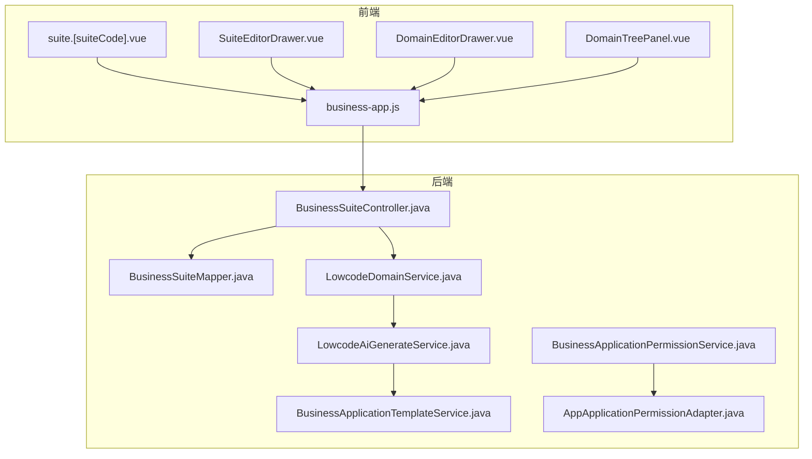
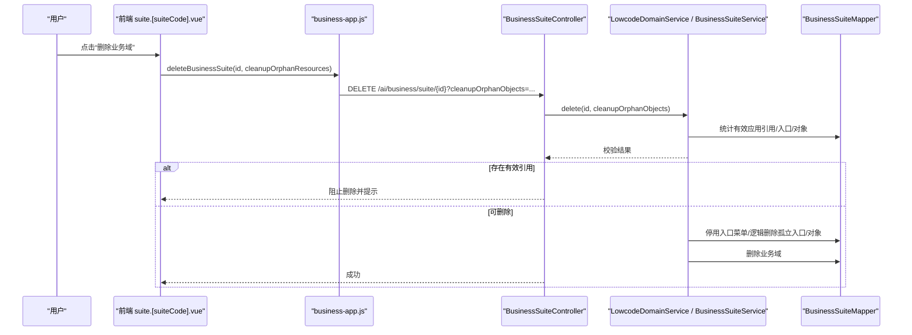
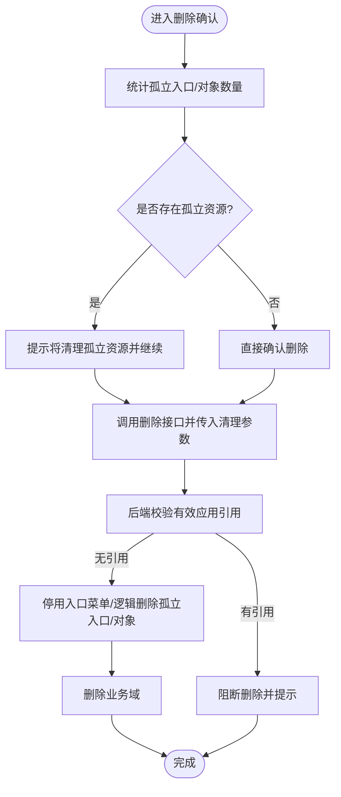
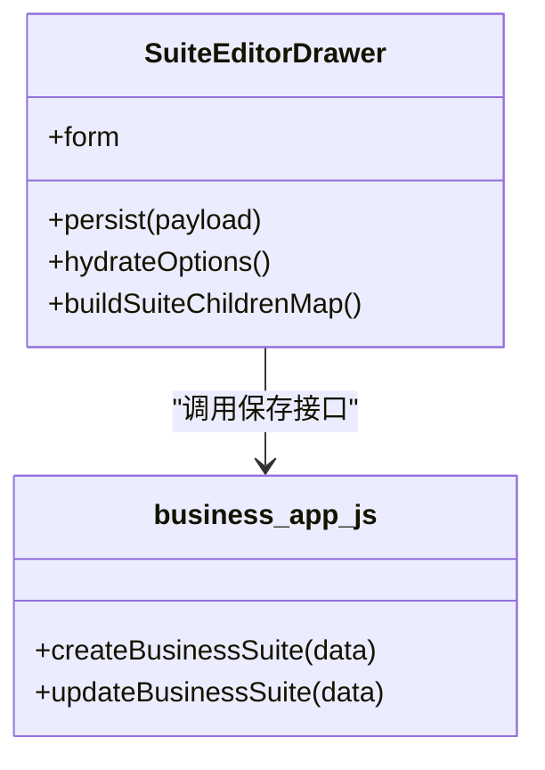
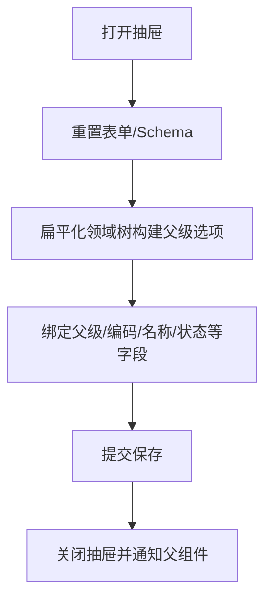
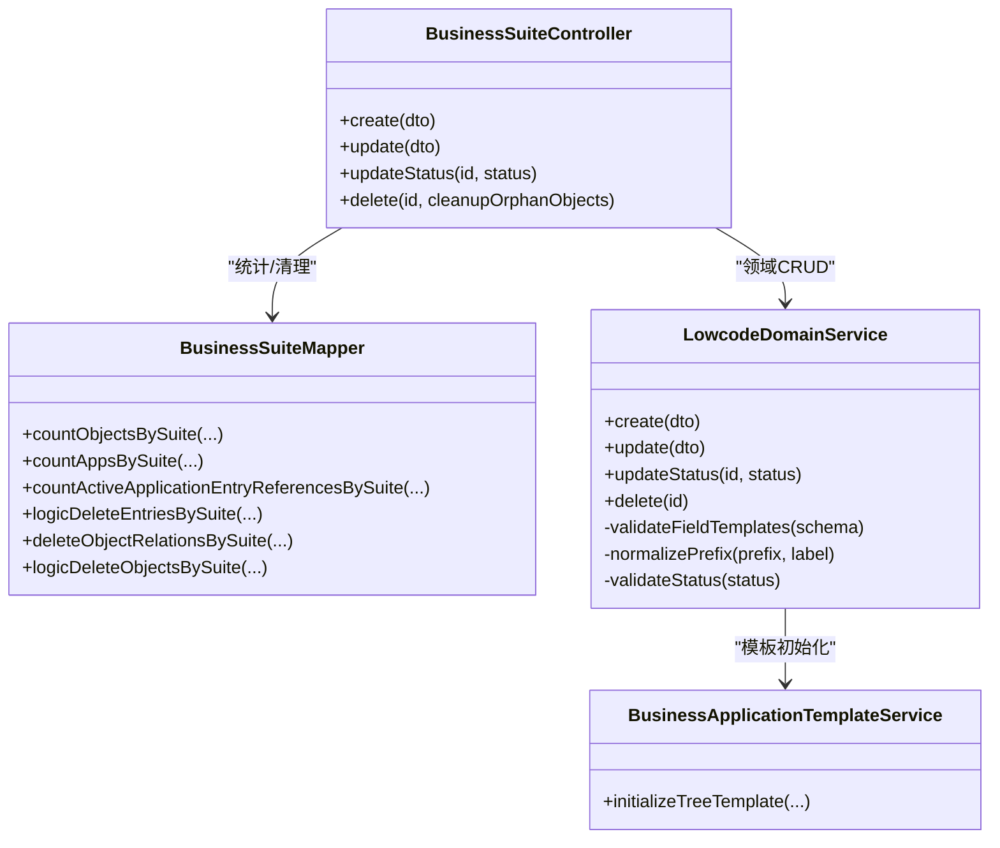
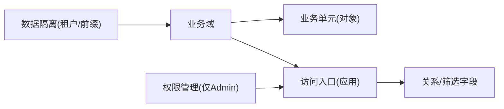
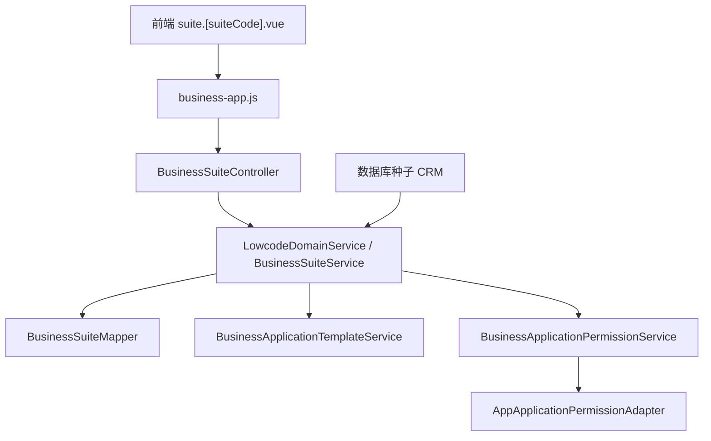

# 业务域管理

<cite>
**本文引用的文件**
- [suite.[suiteCode].vue](file://forge-admin-ui/src/views/app-center/suite.[suiteCode].vue)
- [SuiteEditorDrawer.vue](file://forge-admin-ui/src/views/app-center/components/SuiteEditorDrawer.vue)
- [DomainEditorDrawer.vue](file://forge-admin-ui/src/components/lowcode-builder/domain/DomainEditorDrawer.vue)
- [DomainTreePanel.vue](file://forge-admin-ui/src/components/lowcode-builder/domain/DomainTreePanel.vue)
- [business-app.js](file://forge-admin-ui/src/api/business-app.js)
- [BusinessSuiteController.java](file://forge-server/forge-framework/forge-plugin-parent/forge-plugin-generator/src/main/java/com/mdframe/forge/plugin/generator/controller/BusinessSuiteController.java)
- [BusinessSuiteMapper.java](file://forge-server/forge-framework/forge-plugin-parent/forge-plugin-generator/src/main/java/com/mdframe/forge/plugin/generator/mapper/BusinessSuiteMapper.java)
- [LowcodeDomainService.java](file://forge-server/forge-framework/forge-plugin-parent/forge-plugin-generator/src/main/java/com/mdframe/forge/plugin/generator/service/lowcode/LowcodeDomainService.java)
- [LowcodeAiGenerateService.java](file://forge-server/forge-framework/forge-plugin-parent/forge-plugin-generator/src/main/java/com/mdframe/forge/plugin/generator/service/lowcode/LowcodeAiGenerateService.java)
- [BusinessApplicationTemplateService.java](file://forge-server/forge-framework/forge-plugin-parent/forge-plugin-generator/src/main/java/com/mdframe/forge/plugin/generator/service/businessapp/BusinessApplicationTemplateService.java)
- [BusinessApplicationPermissionService.java](file://forge-server/forge-framework/forge-plugin-parent/forge-plugin-generator/src/main/java/com/mdframe/forge/plugin/generator/service/businessapp/BusinessApplicationPermissionService.java)
- [AppApplicationPermissionAdapter.java](file://forge-server/forge-app-server/src/main/java/com/mdframe/forge/app/server/bridge/AppApplicationPermissionAdapter.java)
- [V1.0.28__seed_crm_business_suite.sql](file://forge-server/db/backup/V1.0.28__seed_crm_business_suite.sql)
- [spec.md（孤立入口修复）](file://code-copilot/changes/business-domain-delete-orphan-entry-fix/spec.md)
- [execution-log.md（孤立入口修复）](file://code-copilot/changes/business-domain-delete-orphan-entry-fix/execution-log.md)
</cite>

## 目录
1. [简介](#简介)
2. [项目结构](#项目结构)
3. [核心组件](#核心组件)
4. [架构总览](#架构总览)
5. [详细组件分析](#详细组件分析)
6. [依赖关系分析](#依赖关系分析)
7. [性能考虑](#性能考虑)
8. [故障排查指南](#故障排查指南)
9. [结论](#结论)
10. [附录](#附录)

## 简介
本文件面向 Forge Admin 的“业务域管理”能力，聚焦业务域的树形组织、创建/编辑/删除与层级维护，以及业务域编辑器抽屉的前端实现。同时说明业务域与应用的关系映射、权限继承与数据隔离等架构要点，并提供企业级命名规范、层级设计、权限规划的最佳实践，以及迁移优化策略和实际案例。

## 项目结构
业务域管理涉及前端视图、抽屉表单、API 封装，以及后端的控制器、服务、数据访问层与领域模板生成逻辑：
- 前端
  - 业务域详情页：展示业务单元、场景入口、交付验收，并支持启停、删除等操作。
  - 业务域编辑器抽屉：用于新建/编辑业务域，包含父级选择、编码/名称/图标/排序/菜单配置等字段。
  - 低代码业务领域编辑器抽屉与树面板：提供领域维度的树形管理与操作入口。
  - API 封装：统一对后端 /ai/business/suite 等接口进行调用。
- 后端
  - 控制器：暴露业务套件（业务域）的增删改查、状态切换、删除清理等接口。
  - Mapper：提供按租户/业务域统计对象数、应用数、引用关系等查询与清理 SQL。
  - 服务：领域创建、更新、状态管理、删除时清理孤立资源；低代码领域校验与默认规则；模板初始化（如左树右表）。
  - 权限适配：Admin 服务承载权限管理，非 Admin 服务通过桥接拒绝相关能力。

**图表来源**
- [suite.[suiteCode].vue:1-200](file://forge-admin-ui/src/views/app-center/suite.[suiteCode].vue#L1-L200)
- [SuiteEditorDrawer.vue:164-213](file://forge-admin-ui/src/views/app-center/components/SuiteEditorDrawer.vue#L164-L213)
- [DomainEditorDrawer.vue:105-170](file://forge-admin-ui/src/components/lowcode-builder/domain/DomainEditorDrawer.vue#L105-L170)
- [DomainTreePanel.vue:1-161](file://forge-admin-ui/src/components/lowcode-builder/domain/DomainTreePanel.vue#L1-L161)
- [business-app.js:14-48](file://forge-admin-ui/src/api/business-app.js#L14-L48)
- [BusinessSuiteController.java:84-115](file://forge-server/forge-framework/forge-plugin-parent/forge-plugin-generator/src/main/java/com/mdframe/forge/plugin/generator/controller/BusinessSuiteController.java#L84-L115)
- [BusinessSuiteMapper.java:27-53](file://forge-server/forge-framework/forge-plugin-parent/forge-plugin-generator/src/main/java/com/mdframe/forge/plugin/generator/mapper/BusinessSuiteMapper.java#L27-L53)
- [LowcodeDomainService.java:32-321](file://forge-server/forge-framework/forge-plugin-parent/forge-plugin-generator/src/main/java/com/mdframe/forge/plugin/generator/service/lowcode/LowcodeDomainService.java#L32-L321)
- [LowcodeAiGenerateService.java:60-67](file://forge-server/forge-framework/forge-plugin-parent/forge-plugin-generator/src/main/java/com/mdframe/forge/plugin/generator/service/lowcode/LowcodeAiGenerateService.java#L60-L67)
- [BusinessApplicationTemplateService.java:105-149](file://forge-server/forge-framework/forge-plugin-parent/forge-plugin-generator/src/main/java/com/mdframe/forge/plugin/generator/service/businessapp/BusinessApplicationTemplateService.java#L105-L149)
- [BusinessApplicationPermissionService.java:409-440](file://forge-server/forge-framework/forge-plugin-parent/forge-plugin-generator/src/main/java/com/mdframe/forge/plugin/generator/service/businessapp/BusinessApplicationPermissionService.java#L409-L440)
- [AppApplicationPermissionAdapter.java:1-45](file://forge-server/forge-app-server/src/main/java/com/mdframe/forge/app/server/bridge/AppApplicationPermissionAdapter.java#L1-L45)

**章节来源**
- [suite.[suiteCode].vue:1-200](file://forge-admin-ui/src/views/app-center/suite.[suiteCode].vue#L1-L200)
- [business-app.js:14-48](file://forge-admin-ui/src/api/business-app.js#L14-L48)
- [BusinessSuiteController.java:84-115](file://forge-server/forge-framework/forge-plugin-parent/forge-plugin-generator/src/main/java/com/mdframe/forge/plugin/generator/controller/BusinessSuiteController.java#L84-L115)
- [BusinessSuiteMapper.java:27-53](file://forge-server/forge-framework/forge-plugin-parent/forge-plugin-generator/src/main/java/com/mdframe/forge/plugin/generator/mapper/BusinessSuiteMapper.java#L27-L53)

## 核心组件
- 业务域详情页（suite.[suiteCode].vue）
  - 展示业务单元与场景入口，支持启停、删除、打开设计器、查看验收清单。
  - 删除业务域时根据孤立入口/对象数量提示并决定是否清理。
- 业务域编辑器抽屉（SuiteEditorDrawer.vue）
  - 表单字段：业务域名称、编码（新增不可改）、图标、上级业务域、菜单同步配置、排序等。
  - 保存流程：新增或更新后返回并刷新列表。
- 低代码业务领域编辑器抽屉（DomainEditorDrawer.vue）
  - 表单字段：父级领域、领域编码/名称/说明、启用状态、图标、排序、菜单父级、表前缀、配置键前缀等。
  - 父级选项由扁平化后的领域树构建，避免自引用。
- 低代码业务领域树面板（DomainTreePanel.vue）
  - 提供搜索、刷新、新增、新增子目录、编辑、删除等操作入口。
- 后端控制器与服务
  - 控制器暴露业务套件 CRUD、状态切换、删除（含孤立资源清理参数）。
  - Mapper 提供按业务域统计对象/应用数、有效引用计数、逻辑删除入口/对象等能力。
  - 领域服务负责领域校验、默认规则、状态管理、删除清理。
  - 模板服务在生成应用时自动建立树形筛选对象与关系，并配置树形布局。
  - 权限服务与适配器确保仅在 Admin 服务中执行角色/资源/数据范围管理。

**章节来源**
- [suite.[suiteCode].vue:1-200](file://forge-admin-ui/src/views/app-center/suite.[suiteCode].vue#L1-L200)
- [SuiteEditorDrawer.vue:164-213](file://forge-admin-ui/src/views/app-center/components/SuiteEditorDrawer.vue#L164-L213)
- [DomainEditorDrawer.vue:105-170](file://forge-admin-ui/src/components/lowcode-builder/domain/DomainEditorDrawer.vue#L105-L170)
- [DomainTreePanel.vue:1-161](file://forge-admin-ui/src/components/lowcode-builder/domain/DomainTreePanel.vue#L1-L161)
- [BusinessSuiteController.java:84-115](file://forge-server/forge-framework/forge-plugin-parent/forge-plugin-generator/src/main/java/com/mdframe/forge/plugin/generator/controller/BusinessSuiteController.java#L84-L115)
- [BusinessSuiteMapper.java:27-53](file://forge-server/forge-framework/forge-plugin-parent/forge-plugin-generator/src/main/java/com/mdframe/forge/plugin/generator/mapper/BusinessSuiteMapper.java#L27-L53)
- [LowcodeDomainService.java:32-321](file://forge-server/forge-framework/forge-plugin-parent/forge-plugin-generator/src/main/java/com/mdframe/forge/plugin/generator/service/lowcode/LowcodeDomainService.java#L32-L321)
- [BusinessApplicationTemplateService.java:105-149](file://forge-server/forge-framework/forge-plugin-parent/forge-plugin-generator/src/main/java/com/mdframe/forge/plugin/generator/service/businessapp/BusinessApplicationTemplateService.java#L105-L149)
- [BusinessApplicationPermissionService.java:409-440](file://forge-server/forge-framework/forge-plugin-parent/forge-plugin-generator/src/main/java/com/mdframe/forge/plugin/generator/service/businessapp/BusinessApplicationPermissionService.java#L409-L440)
- [AppApplicationPermissionAdapter.java:1-45](file://forge-server/forge-app-server/src/main/java/com/mdframe/forge/app/server/bridge/AppApplicationPermissionAdapter.java#L1-L45)

## 架构总览
业务域作为上层组织容器，聚合业务单元（对象）与访问入口（应用），并通过权限与数据隔离形成清晰的边界。

**图表来源**
- [suite.[suiteCode].vue:526-550](file://forge-admin-ui/src/views/app-center/suite.[suiteCode].vue#L526-L550)
- [business-app.js:42-44](file://forge-admin-ui/src/api/business-app.js#L42-L44)
- [BusinessSuiteController.java:107-115](file://forge-server/forge-framework/forge-plugin-parent/forge-plugin-generator/src/main/java/com/mdframe/forge/plugin/generator/controller/BusinessSuiteController.java#L107-L115)
- [BusinessSuiteMapper.java:40-53](file://forge-server/forge-framework/forge-plugin-parent/forge-plugin-generator/src/main/java/com/mdframe/forge/plugin/generator/mapper/BusinessSuiteMapper.java#L40-L53)

## 详细组件分析

### 业务域详情页与删除流程
- 功能要点
  - 展示业务单元与场景入口，支持分页、启停、删除。
  - 删除业务域时，若存在孤立入口/对象，会提示并传递清理参数，后端将停用菜单并逻辑删除孤立资源。
- 关键路径
  - 前端触发删除 -> API 调用 -> 控制器接收参数 -> 服务层校验引用 -> 清理并删除。

**图表来源**
- [suite.[suiteCode].vue:526-550](file://forge-admin-ui/src/views/app-center/suite.[suiteCode].vue#L526-L550)
- [business-app.js:42-44](file://forge-admin-ui/src/api/business-app.js#L42-L44)
- [BusinessSuiteController.java:107-115](file://forge-server/forge-framework/forge-plugin-parent/forge-plugin-generator/src/main/java/com/mdframe/forge/plugin/generator/controller/BusinessSuiteController.java#L107-L115)
- [BusinessSuiteMapper.java:40-53](file://forge-server/forge-framework/forge-plugin-parent/forge-plugin-generator/src/main/java/com/mdframe/forge/plugin/generator/mapper/BusinessSuiteMapper.java#L40-L53)
- [spec.md（孤立入口修复）:47-70](file://code-copilot/changes/business-domain-delete-orphan-entry-fix/spec.md#L47-L70)
- [execution-log.md（孤立入口修复）:20-36](file://code-copilot/changes/business-domain-delete-orphan-entry-fix/execution-log.md#L20-L36)

**章节来源**
- [suite.[suiteCode].vue:526-550](file://forge-admin-ui/src/views/app-center/suite.[suiteCode].vue#L526-L550)
- [business-app.js:42-44](file://forge-admin-ui/src/api/business-app.js#L42-L44)
- [BusinessSuiteController.java:107-115](file://forge-server/forge-framework/forge-plugin-parent/forge-plugin-generator/src/main/java/com/mdframe/forge/plugin/generator/controller/BusinessSuiteController.java#L107-L115)
- [BusinessSuiteMapper.java:40-53](file://forge-server/forge-framework/forge-plugin-parent/forge-plugin-generator/src/main/java/com/mdframe/forge/plugin/generator/mapper/BusinessSuiteMapper.java#L40-L53)

### 业务域编辑器抽屉（SuiteEditorDrawer）
- 表单字段
  - 业务域名称、编码（新增不可修改）、图标、上级业务域、菜单同步开关、菜单父级、排序等。
- 数据绑定与持久化
  - 使用表单模型双向绑定，提交时根据是否已有 id 决定新增或更新，成功后通知父组件刷新。
- 父级树构建
  - 基于传入的业务域列表构建父子关系映射，支持选择上级节点。

**图表来源**
- [SuiteEditorDrawer.vue:164-213](file://forge-admin-ui/src/views/app-center/components/SuiteEditorDrawer.vue#L164-L213)
- [business-app.js:30-36](file://forge-admin-ui/src/api/business-app.js#L30-L36)

**章节来源**
- [SuiteEditorDrawer.vue:164-213](file://forge-admin-ui/src/views/app-center/components/SuiteEditorDrawer.vue#L164-L213)
- [business-app.js:30-36](file://forge-admin-ui/src/api/business-app.js#L30-L36)

### 低代码业务领域编辑器抽屉（DomainEditorDrawer）
- 表单字段
  - 父级领域、领域编码/名称/说明、启用状态、图标、排序、菜单父级、表前缀、配置键前缀。
- 父级选项
  - 通过扁平化领域树构建，排除当前节点以避免自引用。
- 数据绑定
  - 使用响应式表单，打开抽屉时重置为空白或编辑数据。

**图表来源**
- [DomainEditorDrawer.vue:105-170](file://forge-admin-ui/src/components/lowcode-builder/domain/DomainEditorDrawer.vue#L105-L170)

**章节来源**
- [DomainEditorDrawer.vue:105-170](file://forge-admin-ui/src/components/lowcode-builder/domain/DomainEditorDrawer.vue#L105-L170)

### 低代码业务领域树面板（DomainTreePanel）
- 功能
  - 显示领域树、搜索、刷新、新增、新增子目录、编辑、删除。
- 交互
  - 通过事件向父组件广播操作，便于上层统一管理。

**章节来源**
- [DomainTreePanel.vue:1-161](file://forge-admin-ui/src/components/lowcode-builder/domain/DomainTreePanel.vue#L1-L161)

### 后端控制器与服务
- 控制器
  - 暴露业务套件（业务域）的增删改查、状态切换、删除（含孤立资源清理参数）。
- Mapper
  - 提供按业务域统计对象/应用数、有效引用计数、逻辑删除入口/对象等能力。
- 领域服务
  - 领域创建/更新/状态管理/删除；校验领域通用字段、前缀格式、状态值；发布作用域缓存失效。
- 模板服务
  - 生成应用时自动建立树形筛选对象与关系，配置树形布局（左树右表）。

**图表来源**
- [BusinessSuiteController.java:84-115](file://forge-server/forge-framework/forge-plugin-parent/forge-plugin-generator/src/main/java/com/mdframe/forge/plugin/generator/controller/BusinessSuiteController.java#L84-L115)
- [BusinessSuiteMapper.java:27-53](file://forge-server/forge-framework/forge-plugin-parent/forge-plugin-generator/src/main/java/com/mdframe/forge/plugin/generator/mapper/BusinessSuiteMapper.java#L27-L53)
- [LowcodeDomainService.java:32-321](file://forge-server/forge-framework/forge-plugin-parent/forge-plugin-generator/src/main/java/com/mdframe/forge/plugin/generator/service/lowcode/LowcodeDomainService.java#L32-L321)
- [BusinessApplicationTemplateService.java:105-149](file://forge-server/forge-framework/forge-plugin-parent/forge-plugin-generator/src/main/java/com/mdframe/forge/plugin/generator/service/businessapp/BusinessApplicationTemplateService.java#L105-L149)

**章节来源**
- [BusinessSuiteController.java:84-115](file://forge-server/forge-framework/forge-plugin-parent/forge-plugin-generator/src/main/java/com/mdframe/forge/plugin/generator/controller/BusinessSuiteController.java#L84-L115)
- [BusinessSuiteMapper.java:27-53](file://forge-server/forge-framework/forge-plugin-parent/forge-plugin-generator/src/main/java/com/mdframe/forge/plugin/generator/mapper/BusinessSuiteMapper.java#L27-L53)
- [LowcodeDomainService.java:32-321](file://forge-server/forge-framework/forge-plugin-parent/forge-plugin-generator/src/main/java/com/mdframe/forge/plugin/generator/service/lowcode/LowcodeDomainService.java#L32-L321)
- [BusinessApplicationTemplateService.java:105-149](file://forge-server/forge-framework/forge-plugin-parent/forge-plugin-generator/src/main/java/com/mdframe/forge/plugin/generator/service/businessapp/BusinessApplicationTemplateService.java#L105-L149)

### 业务域与应用的关系映射、权限继承、数据隔离
- 关系映射
  - 业务域聚合业务单元（对象）与访问入口（应用），应用可通过模板自动生成树形筛选对象与关系，并在界面配置树形布局。
- 权限继承
  - 权限管理集中在 Admin 服务；非 Admin 服务通过桥接拒绝角色/资源/数据范围管理，避免越权。
- 数据隔离
  - 通过租户 ID、业务域编码、表前缀与配置键前缀实现数据与配置的隔离；领域服务校验前缀格式与通用字段覆盖限制。

**图表来源**
- [BusinessApplicationTemplateService.java:105-149](file://forge-server/forge-framework/forge-plugin-parent/forge-plugin-generator/src/main/java/com/mdframe/forge/plugin/generator/service/businessapp/BusinessApplicationTemplateService.java#L105-L149)
- [BusinessApplicationPermissionService.java:409-440](file://forge-server/forge-framework/forge-plugin-parent/forge-plugin-generator/src/main/java/com/mdframe/forge/plugin/generator/service/businessapp/BusinessApplicationPermissionService.java#L409-L440)
- [AppApplicationPermissionAdapter.java:1-45](file://forge-server/forge-app-server/src/main/java/com/mdframe/forge/app/server/bridge/AppApplicationPermissionAdapter.java#L1-L45)
- [LowcodeDomainService.java:309-321](file://forge-server/forge-framework/forge-plugin-parent/forge-plugin-generator/src/main/java/com/mdframe/forge/plugin/generator/service/lowcode/LowcodeDomainService.java#L309-L321)

**章节来源**
- [BusinessApplicationTemplateService.java:105-149](file://forge-server/forge-framework/forge-plugin-parent/forge-plugin-generator/src/main/java/com/mdframe/forge/plugin/generator/service/businessapp/BusinessApplicationTemplateService.java#L105-L149)
- [BusinessApplicationPermissionService.java:409-440](file://forge-server/forge-framework/forge-plugin-parent/forge-plugin-generator/src/main/java/com/mdframe/forge/plugin/generator/service/businessapp/BusinessApplicationPermissionService.java#L409-L440)
- [AppApplicationPermissionAdapter.java:1-45](file://forge-server/forge-app-server/src/main/java/com/mdframe/forge/app/server/bridge/AppApplicationPermissionAdapter.java#L1-L45)
- [LowcodeDomainService.java:309-321](file://forge-server/forge-framework/forge-plugin-parent/forge-plugin-generator/src/main/java/com/mdframe/forge/plugin/generator/service/lowcode/LowcodeDomainService.java#L309-L321)

## 依赖关系分析
- 前端依赖
  - 视图组件依赖 API 封装，API 封装统一加密请求与错误处理。
- 后端依赖
  - 控制器依赖服务与 Mapper；服务依赖领域模板与权限适配器；Mapper 提供精确的统计与清理 SQL。
- 外部依赖
  - 数据库种子数据提供样板业务域（CRM）。

**图表来源**
- [suite.[suiteCode].vue:1-200](file://forge-admin-ui/src/views/app-center/suite.[suiteCode].vue#L1-L200)
- [business-app.js:14-48](file://forge-admin-ui/src/api/business-app.js#L14-L48)
- [BusinessSuiteController.java:84-115](file://forge-server/forge-framework/forge-plugin-parent/forge-plugin-generator/src/main/java/com/mdframe/forge/plugin/generator/controller/BusinessSuiteController.java#L84-L115)
- [BusinessSuiteMapper.java:27-53](file://forge-server/forge-framework/forge-plugin-parent/forge-plugin-generator/src/main/java/com/mdframe/forge/plugin/generator/mapper/BusinessSuiteMapper.java#L27-L53)
- [BusinessApplicationTemplateService.java:105-149](file://forge-server/forge-framework/forge-plugin-parent/forge-plugin-generator/src/main/java/com/mdframe/forge/plugin/generator/service/businessapp/BusinessApplicationTemplateService.java#L105-L149)
- [BusinessApplicationPermissionService.java:409-440](file://forge-server/forge-framework/forge-plugin-parent/forge-plugin-generator/src/main/java/com/mdframe/forge/plugin/generator/service/businessapp/BusinessApplicationPermissionService.java#L409-L440)
- [AppApplicationPermissionAdapter.java:1-45](file://forge-server/forge-app-server/src/main/java/com/mdframe/forge/app/server/bridge/AppApplicationPermissionAdapter.java#L1-L45)
- [V1.0.28__seed_crm_business_suite.sql:1-13](file://forge-server/db/backup/V1.0.28__seed_crm_business_suite.sql#L1-L13)

**章节来源**
- [business-app.js:14-48](file://forge-admin-ui/src/api/business-app.js#L14-L48)
- [BusinessSuiteController.java:84-115](file://forge-server/forge-framework/forge-plugin-parent/forge-plugin-generator/src/main/java/com/mdframe/forge/plugin/generator/controller/BusinessSuiteController.java#L84-L115)
- [BusinessSuiteMapper.java:27-53](file://forge-server/forge-framework/forge-plugin-parent/forge-plugin-generator/src/main/java/com/mdframe/forge/plugin/generator/mapper/BusinessSuiteMapper.java#L27-L53)
- [V1.0.28__seed_crm_business_suite.sql:1-13](file://forge-server/db/backup/V1.0.28__seed_crm_business_suite.sql#L1-L13)

## 性能考虑
- 列表与分页
  - 业务单元与场景入口均支持分页加载，减少首屏压力。
- 树形渲染
  - 父级选项采用扁平化处理，降低递归渲染开销。
- 删除清理
  - 删除前统计引用与孤立资源，避免不必要的副作用；仅逻辑删除与停用菜单，保证可恢复性。
- 权限与隔离
  - 通过租户与业务域编码过滤数据，减少跨域扫描；前缀规范化避免无效查询。

[本节为通用指导，不直接分析具体文件]

## 故障排查指南
- 删除业务域被阻断
  - 现象：提示仍存在应用入口或对象引用。
  - 排查：检查后端统计有效应用引用；确认前端是否传递清理参数；查看 Mapper XML 条件是否包含租户与未删除标志。
  - 参考：孤立入口修复 Spec 与执行日志。
- 领域通用字段冲突
  - 现象：保存领域时报错“领域通用字段重复/不能覆盖审计字段”。
  - 排查：检查领域 Schema 中的字段模板是否重复或覆盖系统审计字段。
- 权限能力不可用
  - 现象：在非 Admin 服务调用权限管理接口抛出不支持异常。
  - 排查：确认是否在 Admin 服务执行；检查权限适配器实现。

**章节来源**
- [spec.md（孤立入口修复）:47-70](file://code-copilot/changes/business-domain-delete-orphan-entry-fix/spec.md#L47-L70)
- [execution-log.md（孤立入口修复）:20-36](file://code-copilot/changes/business-domain-delete-orphan-entry-fix/execution-log.md#L20-L36)
- [LowcodeDomainService.java:292-321](file://forge-server/forge-framework/forge-plugin-parent/forge-plugin-generator/src/main/java/com/mdframe/forge/plugin/generator/service/lowcode/LowcodeDomainService.java#L292-L321)
- [AppApplicationPermissionAdapter.java:1-45](file://forge-server/forge-app-server/src/main/java/com/mdframe/forge/app/server/bridge/AppApplicationPermissionAdapter.java#L1-L45)

## 结论
Forge Admin 的业务域管理以“业务域-业务单元-访问入口”为核心组织模型，提供完整的树形结构与生命周期管理。前端通过抽屉表单与树面板实现高效编辑，后端通过控制器、服务与 Mapper 保障数据一致性与安全性。权限与数据隔离机制确保多租户与企业级治理需求。结合命名规范、层级设计与权限规划的最佳实践，可有效支撑复杂业务应用的清晰组织与可持续演进。

## 附录

### 企业级最佳实践
- 命名规范
  - 业务域编码：小写字母开头，仅含小写字母+数字+下划线；建议体现业务含义（如 crm、scm、finance）。
  - 表前缀与配置键前缀：遵循小写前缀规范，避免与系统字段冲突。
- 层级设计
  - 顶层按业务能力划分（客户关系、供应链、财务、人力资源、项目管理、运营管理），子层按模块或产品线细分。
  - 避免过深嵌套，保持树形结构可读性与操作效率。
- 权限规划
  - 角色与资源绑定集中在 Admin 服务；数据范围按业务域与租户隔离。
  - 新业务域上线前完成最小权限集配置，逐步放开。
- 迁移与优化
  - 利用模板服务快速生成树形筛选对象与关系，减少手工配置。
  - 删除业务域时优先清理孤立资源，保留历史数据以便审计与恢复。
  - 定期审查业务域下的对象与入口，归档或下线不再使用的配置。

[本节为通用指导，不直接分析具体文件]