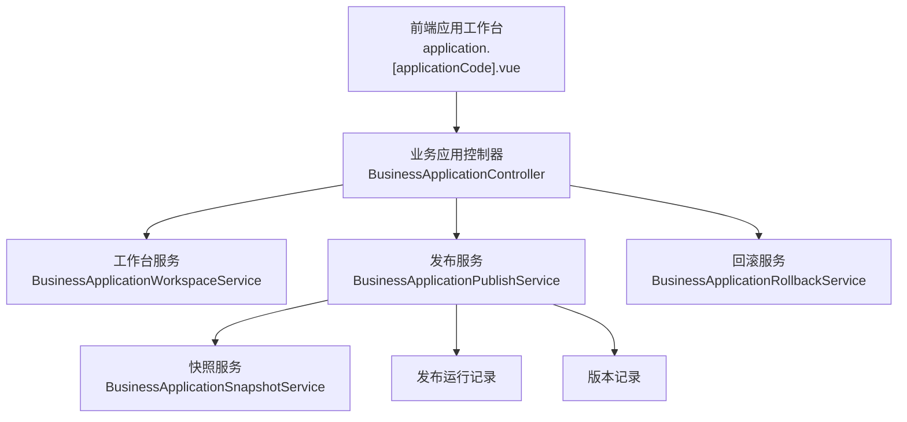
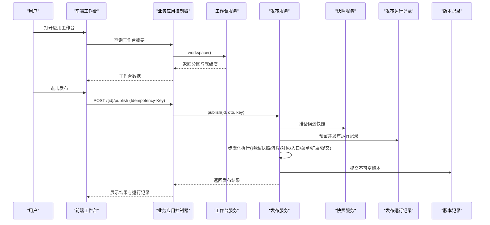
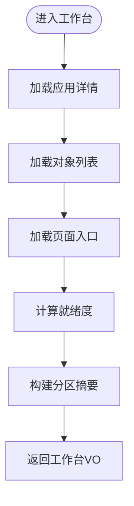
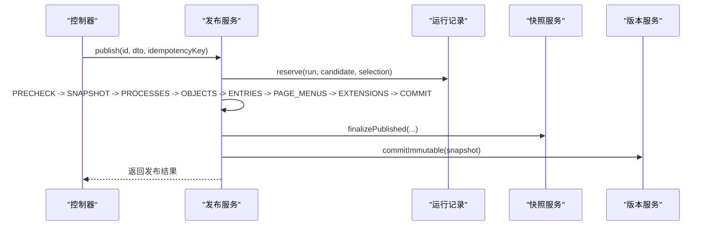
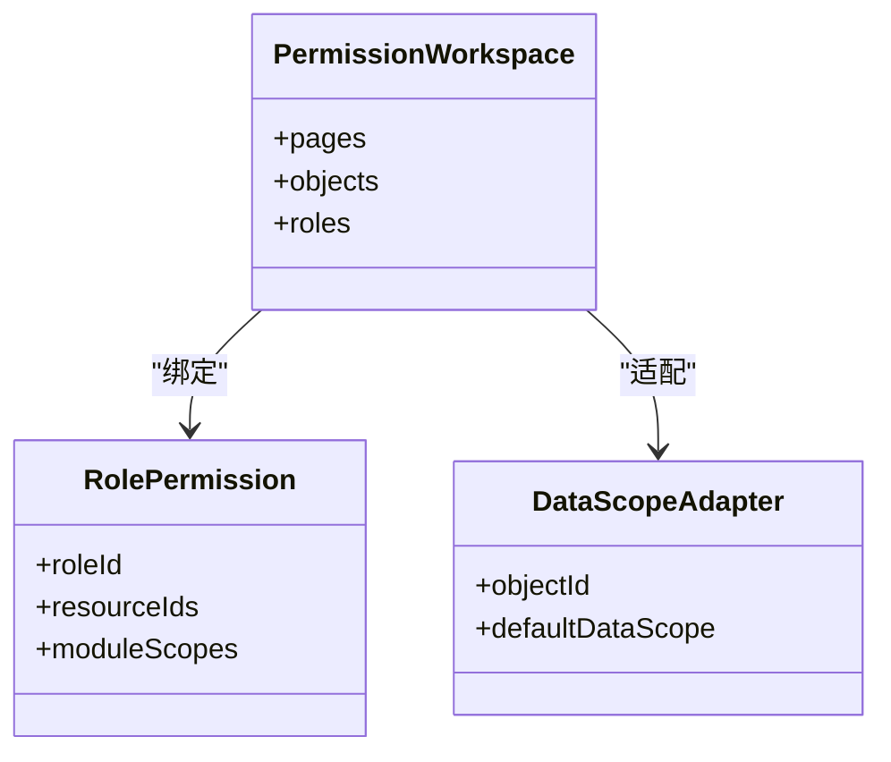
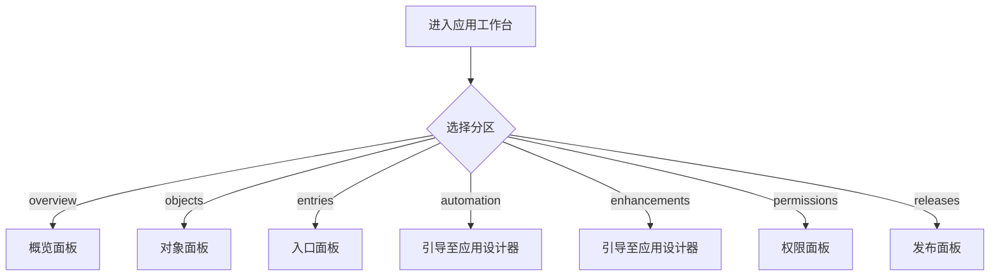
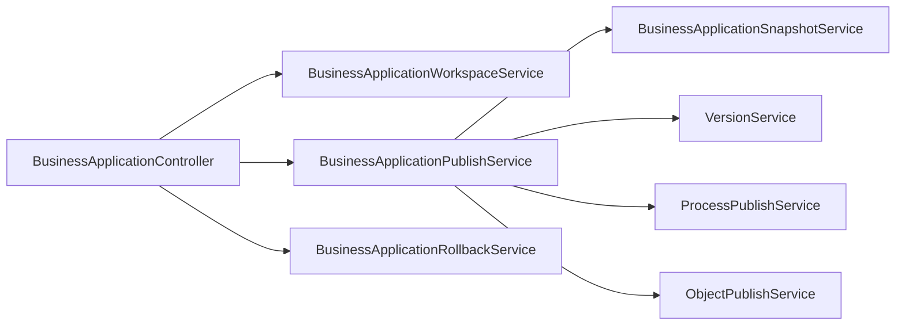

# 低代码应用中心

<cite>
**本文引用的文件**
- [README.md](file://README.md)
- [BusinessApplicationController.java](file://forge-server/forge-framework/forge-plugin-parent/forge-plugin-generator/src/main/java/com/mdframe/forge/plugin/generator/controller/BusinessApplicationController.java)
- [BusinessApplicationWorkspaceService.java](file://forge-server/forge-framework/forge-plugin-parent/forge-plugin-generator/src/main/java/com/mdframe/forge/plugin/generator/service/businessapp/BusinessApplicationWorkspaceService.java)
- [BusinessApplicationPublishService.java](file://forge-server/forge-framework/forge-plugin-parent/forge-plugin-generator/src/main/java/com/mdframe/forge/plugin/generator/service/businessapp/BusinessApplicationPublishService.java)
- [BusinessApplicationRollbackService.java](file://forge-server/forge-framework/forge-plugin-parent/forge-plugin-generator/src/main/java/com/mdframe/forge/plugin/generator/service/businessapp/BusinessApplicationRollbackService.java)
- [BusinessApplicationSnapshotService.java](file://forge-server/forge-framework/forge-plugin-parent/forge-plugin-generator/src/main/java/com/mdframe/forge/plugin/generator/service/businessapp/BusinessApplicationSnapshotService.java)
- [application.[applicationCode].vue](file://forge-admin-ui/src/views/app-center/application.[applicationCode].vue)
- [application-permission-utils.js](file://forge-admin-ui/src/views/app-center/application-permission-utils.js)
- [spec.md（低代码平台架构）](file://code-copilot/changes/lowcode-platform-architecture/spec.md)
- [spec.md（应用内低代码搭建器）](file://code-copilot/changes/in-app-lowcode-builder/spec.md)
- [tasks.md（应用内低代码搭建器）](file://code-copilot/changes/in-app-lowcode-builder/tasks.md)
</cite>

## 目录
1. [简介](#简介)
2. [项目结构](#项目结构)
3. [核心组件](#核心组件)
4. [架构总览](#架构总览)
5. [详细组件分析](#详细组件分析)
6. [依赖关系分析](#依赖关系分析)
7. [性能与可用性](#性能与可用性)
8. [故障排查指南](#故障排查指南)
9. [结论](#结论)
10. [附录：开发工作流与最佳实践](#附录开发工作流与最佳实践)

## 简介
本文件面向 Forge Admin 的低代码应用中心，围绕“应用的创建、管理、发布、运行”全生命周期展开，重点说明应用工作空间、权限控制、版本管理与部署发布的机制，并给出从需求到上线运维的完整流程指导。文档同时提供企业级业务应用构建案例、性能优化建议与常见故障排查方法，帮助团队高效交付稳定可靠的低代码应用。

## 项目结构
应用中心由前后端协同构成：
- 后端以控制器聚合能力，通过服务层编排工作台、权限、发布、回滚等流程；快照与版本持久化保障可追溯与可恢复。
- 前端以应用工作台页面为核心，按分区组织对象、入口、自动化、增强、权限与发布能力，支持草稿预览、在线配置与一键发布。

**图表来源**
- [BusinessApplicationController.java:76-101](file://forge-server/forge-framework/forge-plugin-parent/forge-plugin-generator/src/main/java/com/mdframe/forge/plugin/generator/controller/BusinessApplicationController.java#L76-L101)
- [BusinessApplicationWorkspaceService.java:20-43](file://forge-server/forge-framework/forge-plugin-parent/forge-plugin-generator/src/main/java/com/mdframe/forge/plugin/generator/service/businessapp/BusinessApplicationWorkspaceService.java#L20-L43)
- [BusinessApplicationPublishService.java:37-69](file://forge-server/forge-framework/forge-plugin-parent/forge-plugin-generator/src/main/java/com/mdframe/forge/plugin/generator/service/businessapp/BusinessApplicationPublishService.java#L37-L69)
- [BusinessApplicationRollbackService.java:63-89](file://forge-server/forge-framework/forge-plugin-parent/forge-plugin-generator/src/main/java/com/mdframe/forge/plugin/generator/service/businessapp/BusinessApplicationRollbackService.java#L63-L89)
- [BusinessApplicationSnapshotService.java:158-168](file://forge-server/forge-framework/forge-plugin-parent/forge-plugin-generator/src/main/java/com/mdframe/forge/plugin/generator/service/businessapp/BusinessApplicationSnapshotService.java#L158-L168)
- [application.[applicationCode].vue:1-100](file://forge-admin-ui/src/views/app-center/application.[applicationCode].vue#L1-L100)

**章节来源**
- [README.md:241-259](file://README.md#L241-L259)

## 核心组件
- 应用工作台：聚合概览、数据对象、页面入口、流程自动化、动作增强、权限与发布历史等分区，提供就绪度检查与问题定位。
- 发布协调器：将预检查、快照、流程、对象、入口、菜单、扩展、提交等步骤串联，支持幂等执行、部分完成与恢复。
- 版本与快照：为每次发布生成不可变快照与版本记录，支撑回滚与审计。
- 权限与工作区：基于角色与资源绑定，结合模块数据范围适配，实现细粒度访问控制。
- 前端工作台：按路由与分区动态加载面板，支持草稿预览、在线编辑与发布操作。

**章节来源**
- [BusinessApplicationWorkspaceService.java:45-104](file://forge-server/forge-framework/forge-plugin-parent/forge-plugin-generator/src/main/java/com/mdframe/forge/plugin/generator/service/businessapp/BusinessApplicationWorkspaceService.java#L45-L104)
- [BusinessApplicationPublishService.java:115-218](file://forge-server/forge-framework/forge-plugin-parent/forge-plugin-generator/src/main/java/com/mdframe/forge/plugin/generator/service/businessapp/BusinessApplicationPublishService.java#L115-L218)
- [BusinessApplicationSnapshotService.java:158-168](file://forge-server/forge-framework/forge-plugin-parent/forge-plugin-generator/src/main/java/com/mdframe/forge/plugin/generator/service/businessapp/BusinessApplicationSnapshotService.java#L158-L168)
- [application.[applicationCode].vue:117-160](file://forge-admin-ui/src/views/app-center/application.[applicationCode].vue#L117-L160)

## 架构总览
应用中心采用“控制器聚合 + 服务编排 + 快照版本持久化”的分层设计。前端通过统一接口获取工作台摘要、权限目录与运行时配置；后端在发布链路中引入幂等键、步骤化执行与可恢复机制，确保复杂变更的可控性与可观测性。

**图表来源**
- [BusinessApplicationController.java:395-412](file://forge-server/forge-framework/forge-plugin-parent/forge-plugin-generator/src/main/java/com/mdframe/forge/plugin/generator/controller/BusinessApplicationController.java#L395-L412)
- [BusinessApplicationPublishService.java:61-108](file://forge-server/forge-framework/forge-plugin-parent/forge-plugin-generator/src/main/java/com/mdframe/forge/plugin/generator/service/businessapp/BusinessApplicationPublishService.java#L61-L108)
- [BusinessApplicationPublishService.java:115-218](file://forge-server/forge-framework/forge-plugin-parent/forge-plugin-generator/src/main/java/com/mdframe/forge/plugin/generator/service/businessapp/BusinessApplicationPublishService.java#L115-L218)
- [BusinessApplicationSnapshotService.java:158-168](file://forge-server/forge-framework/forge-plugin-parent/forge-plugin-generator/src/main/java/com/mdframe/forge/plugin/generator/service/businessapp/BusinessApplicationSnapshotService.java#L158-L168)

## 详细组件分析

### 应用工作台与就绪度
- 工作台聚合七个分区：概览、数据对象、页面入口、流程自动化、动作与增强、权限、发布历史。每个分区包含资产数量、问题计数与状态。
- 就绪度检查覆盖应用启用状态、业务域可用性、页面依赖、入口激活、对象设计与发布状态等，区分阻断与警告级别，避免普通分区切换触发完整发布链路。

**图表来源**
- [BusinessApplicationWorkspaceService.java:45-86](file://forge-server/forge-framework/forge-plugin-parent/forge-plugin-generator/src/main/java/com/mdframe/forge/plugin/generator/service/businessapp/BusinessApplicationWorkspaceService.java#L45-L86)
- [BusinessApplicationWorkspaceService.java:110-157](file://forge-server/forge-framework/forge-plugin-parent/forge-plugin-generator/src/main/java/com/mdframe/forge/plugin/generator/service/businessapp/BusinessApplicationWorkspaceService.java#L110-L157)

**章节来源**
- [BusinessApplicationWorkspaceService.java:20-104](file://forge-server/forge-framework/forge-plugin-parent/forge-plugin-generator/src/main/java/com/mdframe/forge/plugin/generator/service/businessapp/BusinessApplicationWorkspaceService.java#L20-L104)

### 发布协调与版本管理
- 发布流程分为多个步骤：预检查、快照、流程、对象、入口、页面菜单、扩展、提交。每一步可独立成功或失败，支持恢复与重试。
- 使用幂等键防止重复执行；发布成功后提交不可变版本快照，便于回滚与审计。
- 回滚流程同样分步执行，锁定来源版本并重新发布目标版本。

**图表来源**
- [BusinessApplicationPublishService.java:61-108](file://forge-server/forge-framework/forge-plugin-parent/forge-plugin-generator/src/main/java/com/mdframe/forge/plugin/generator/service/businessapp/BusinessApplicationPublishService.java#L61-L108)
- [BusinessApplicationPublishService.java:115-218](file://forge-server/forge-framework/forge-plugin-parent/forge-plugin-generator/src/main/java/com/mdframe/forge/plugin/generator/service/businessapp/BusinessApplicationPublishService.java#L115-L218)
- [BusinessApplicationSnapshotService.java:158-168](file://forge-server/forge-framework/forge-plugin-parent/forge-plugin-generator/src/main/java/com/mdframe/forge/plugin/generator/service/businessapp/BusinessApplicationSnapshotService.java#L158-L168)
- [BusinessApplicationRollbackService.java:63-112](file://forge-server/forge-framework/forge-plugin-parent/forge-plugin-generator/src/main/java/com/mdframe/forge/plugin/generator/service/businessapp/BusinessApplicationRollbackService.java#L63-L112)

**章节来源**
- [BusinessApplicationPublishService.java:37-218](file://forge-server/forge-framework/forge-plugin-parent/forge-plugin-generator/src/main/java/com/mdframe/forge/plugin/generator/service/businessapp/BusinessApplicationPublishService.java#L37-L218)
- [BusinessApplicationRollbackService.java:63-112](file://forge-server/forge-framework/forge-plugin-parent/forge-plugin-generator/src/main/java/com/mdframe/forge/plugin/generator/service/businessapp/BusinessApplicationRollbackService.java#L63-L112)

### 权限控制与工作区
- 权限工作区提供角色权限查看与保存、对象数据范围适配等能力。
- 前端对角色权限进行规范化处理，包括资源ID去重、模块数据范围映射与差异比较，保证前后端一致的数据模型。

**图表来源**
- [application-permission-utils.js:16-59](file://forge-admin-ui/src/views/app-center/application-permission-utils.js#L16-L59)
- [BusinessApplicationController.java:208-242](file://forge-server/forge-framework/forge-plugin-parent/forge-plugin-generator/src/main/java/com/mdframe/forge/plugin/generator/controller/BusinessApplicationController.java#L208-L242)

**章节来源**
- [application-permission-utils.js:1-59](file://forge-admin-ui/src/views/app-center/application-permission-utils.js#L1-59)
- [BusinessApplicationController.java:208-242](file://forge-server/forge-framework/forge-plugin-parent/forge-plugin-generator/src/main/java/com/mdframe/forge/plugin/generator/controller/BusinessApplicationController.java#L208-L242)

### 前端应用工作台与页面编排
- 前端工作台按路由参数选择分区，动态加载对应面板，支持 KeepAlive 缓存与懒加载。
- 针对已迁移至应用设计器的能力（如业务流程、动作增强），控制台导航隐藏但保留旧链接引导。
- 支持应用内低代码搭建器，复用既有页面、表单、列表、规则与流程资产，无需改动后端与数据库。

**图表来源**
- [application.[applicationCode].vue:117-160](file://forge-admin-ui/src/views/app-center/application.[applicationCode].vue#L117-L160)
- [application.[applicationCode].vue:127-149](file://forge-admin-ui/src/views/app-center/application.[applicationCode].vue#L127-L149)

**章节来源**
- [application.[applicationCode].vue:1-200](file://forge-admin-ui/src/views/app-center/application.[applicationCode].vue#L1-L200)
- [spec.md（应用内低代码搭建器）:25-33](file://code-copilot/changes/in-app-lowcode-builder/spec.md#L25-L33)
- [tasks.md（应用内低代码搭建器）:1-28](file://code-copilot/changes/in-app-lowcode-builder/tasks.md#L1-L28)

## 依赖关系分析
- 控制器依赖多个服务：工作台、权限、发布、版本、运行时、代码生成等，形成统一的对外接口边界。
- 发布服务依赖就绪度、表单数据、快照、流程、对象、入口、菜单、扩展与DDL校验等子系统，体现强内聚与弱耦合。
- 前端依赖API封装与组件库，按分区懒加载，降低首屏体积。

**图表来源**
- [BusinessApplicationController.java:86-101](file://forge-server/forge-framework/forge-plugin-parent/forge-plugin-generator/src/main/java/com/mdframe/forge/plugin/generator/controller/BusinessApplicationController.java#L86-L101)
- [BusinessApplicationPublishService.java:45-59](file://forge-server/forge-framework/forge-plugin-parent/forge-plugin-generator/src/main/java/com/mdframe/forge/plugin/generator/service/businessapp/BusinessApplicationPublishService.java#L45-L59)

**章节来源**
- [BusinessApplicationController.java:76-101](file://forge-server/forge-framework/forge-plugin-parent/forge-plugin-generator/src/main/java/com/mdframe/forge/plugin/generator/controller/BusinessApplicationController.java#L76-L101)
- [BusinessApplicationPublishService.java:45-59](file://forge-server/forge-framework/forge-plugin-parent/forge-plugin-generator/src/main/java/com/mdframe/forge/plugin/generator/service/businessapp/BusinessApplicationPublishService.java#L45-L59)

## 性能与可用性
- 发布链路步骤化与幂等键：避免重复执行，支持部分完成后的恢复，提升可用性与容错能力。
- 快照与版本不可变：每次发布生成唯一快照与版本，便于快速回滚与审计追踪。
- 前端懒加载与缓存：按分区异步加载面板，KeepAlive 缓存常用视图，减少渲染开销。
- 就绪度轻量检查：工作台仅做轻量状态评估，完整发布检查在发布分区显式执行，避免误触发耗时流程。

[本节为通用指导，不直接分析具体文件]

## 故障排查指南
- 发布失败：查看发布运行记录与步骤信息，关注阻断项与警告项；必要时执行恢复或回滚。
- 权限异常：核对角色资源绑定与模块数据范围适配，确保前端规范化数据与后端一致。
- 工作台空白或报错：检查应用状态、业务域可用性与页面依赖，确认对象设计与入口是否已发布。
- 前端请求失败：确认代理配置与服务端口，检查鉴权与跨域设置。

**章节来源**
- [BusinessApplicationPublishService.java:344-412](file://forge-server/forge-framework/forge-plugin-parent/forge-plugin-generator/src/main/java/com/mdframe/forge/plugin/generator/service/businessapp/BusinessApplicationPublishService.java#L344-L412)
- [application-permission-utils.js:16-59](file://forge-admin-ui/src/views/app-center/application-permission-utils.js#L16-L59)
- [BusinessApplicationWorkspaceService.java:110-157](file://forge-server/forge-framework/forge-plugin-parent/forge-plugin-generator/src/main/java/com/mdframe/forge/plugin/generator/service/businessapp/BusinessApplicationWorkspaceService.java#L110-L157)

## 结论
Forge Admin 的低代码应用中心以“工作台 + 发布协调 + 快照版本 + 权限控制”为核心，提供从创建、设计、发布到运行与回滚的完整闭环。通过步骤化发布、幂等执行与不可变快照，系统具备高可用与可追溯特性；前端工作台按分区组织能力，支持在线编排与预览，满足企业级业务应用的高效交付与稳定运维需求。

[本节为总结性内容，不直接分析具体文件]

## 附录：开发工作流与最佳实践
- 需求分析与领域建模：明确业务边界与核心对象，优先定义主对象与共享对象，建立对象关系与字段规范。
- 应用创建与初始化：通过模板或AI方案初始化应用，配置门户地址与基础信息，导入或创建数据对象。
- 页面与流程编排：在设计器中拖拽页面、绑定对象字段、配置事件与动作；编排业务流程并关联对象与数据源。
- 权限与数据范围：为角色分配资源与按钮权限，配置对象数据范围适配，确保多租户与数据安全。
- 发布与版本管理：执行发布预检查，解决阻断与警告；发布后生成版本快照，必要时回滚至稳定版本。
- 上线与运维：监控运行状态与日志，收集用户反馈；持续迭代对象、页面与流程，保持版本演进可控。

**章节来源**
- [spec.md（低代码平台架构）:92-124](file://code-copilot/changes/lowcode-platform-architecture/spec.md#L92-L124)
- [spec.md（应用内低代码搭建器）:25-33](file://code-copilot/changes/in-app-lowcode-builder/spec.md#L25-L33)
- [tasks.md（应用内低代码搭建器）:1-28](file://code-copilot/changes/in-app-lowcode-builder/tasks.md#L1-L28)