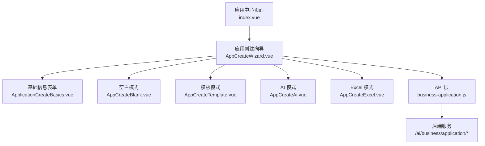
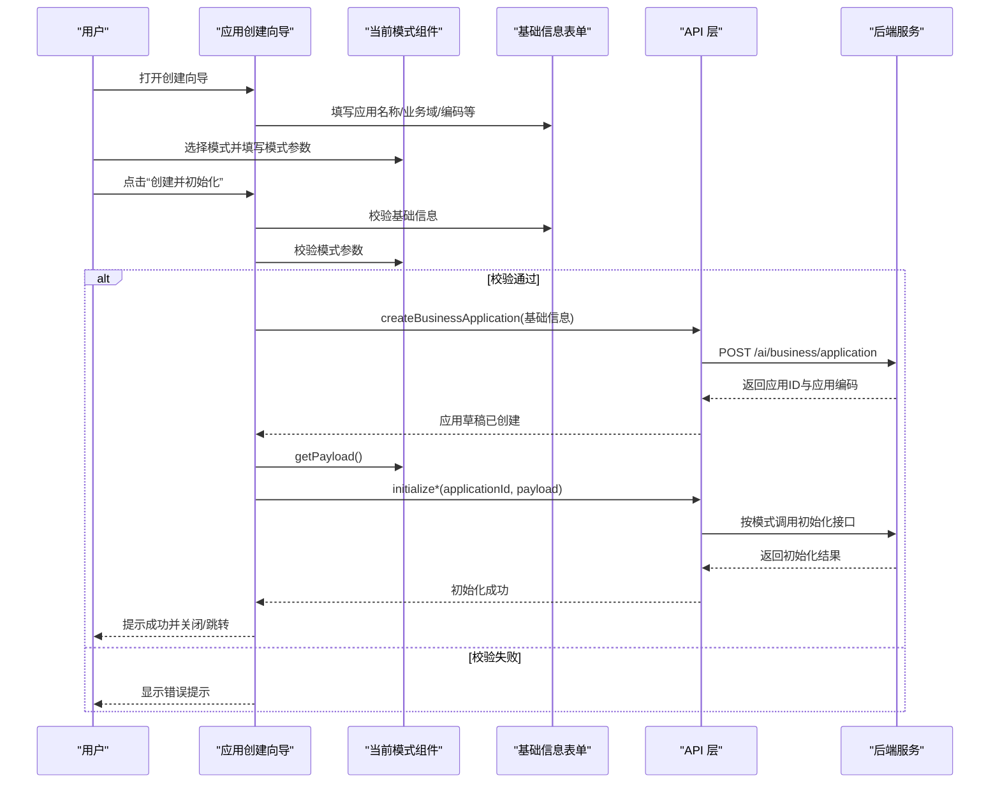
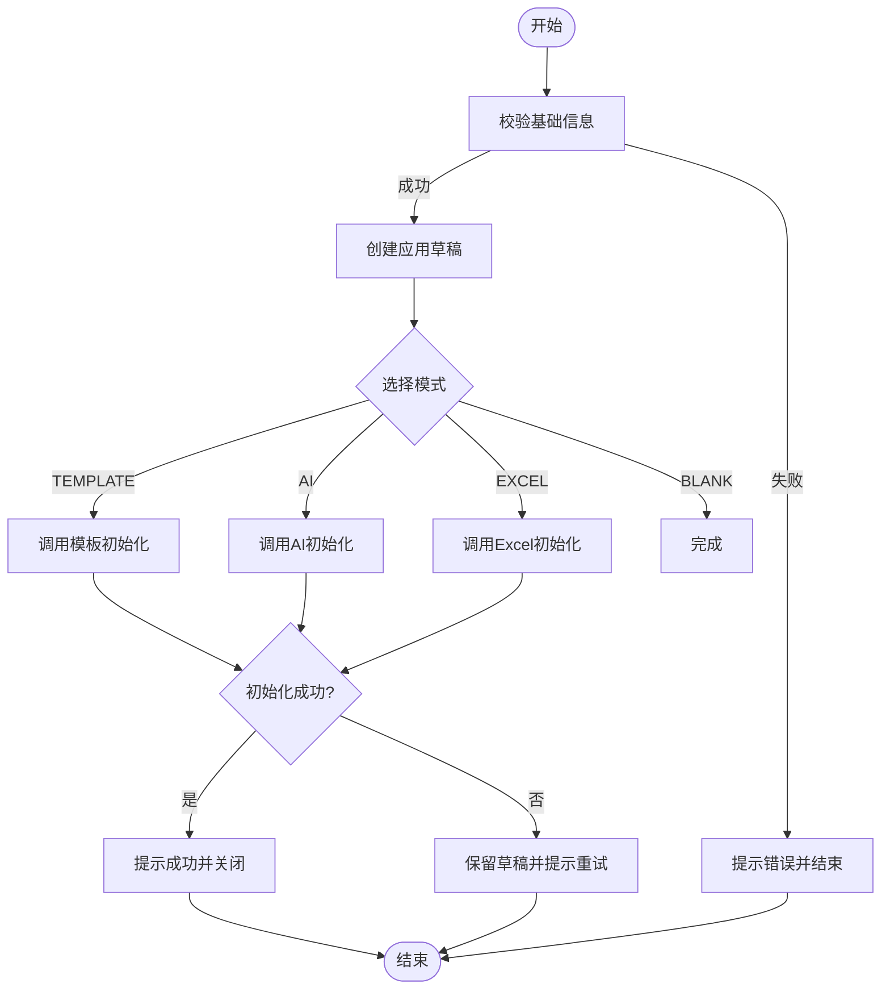
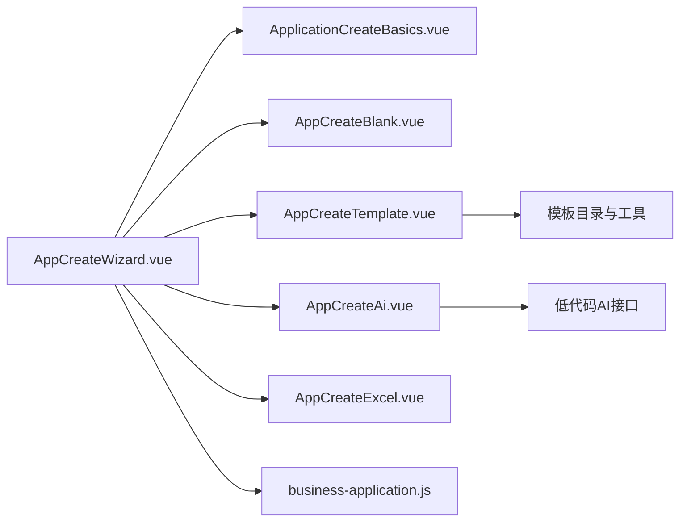

# 应用创建向导

<cite>
**本文引用的文件**
- [AppCreateWizard.vue](file://forge-admin-ui/src/views/app-center/components/AppCreateWizard.vue)
- [ApplicationCreateBasics.vue](file://forge-admin-ui/src/views/app-center/components/create/ApplicationCreateBasics.vue)
- [AppCreateBlank.vue](file://forge-admin-ui/src/views/app-center/components/create/AppCreateBlank.vue)
- [AppCreateTemplate.vue](file://forge-admin-ui/src/views/app-center/components/create/AppCreateTemplate.vue)
- [AppCreateAi.vue](file://forge-admin-ui/src/views/app-center/components/create/AppCreateAi.vue)
- [AppCreateExcel.vue](file://forge-admin-ui/src/views/app-center/components/create/AppCreateExcel.vue)
- [business-application.js](file://forge-admin-ui/src/api/business-application.js)
- [index.vue（应用中心）](file://forge-admin-ui/src/views/app-center/index.vue)
</cite>

## 目录
1. [简介](#简介)
2. [项目结构](#项目结构)
3. [核心组件](#核心组件)
4. [架构总览](#架构总览)
5. [详细组件分析](#详细组件分析)
6. [依赖关系分析](#依赖关系分析)
7. [性能与可用性考虑](#性能与可用性考虑)
8. [故障排查指南](#故障排查指南)
9. [结论](#结论)
10. [附录：完整创建流程与最佳实践](#附录：完整创建流程与最佳实践)

## 简介
本文件面向在 Forge Admin 中从零开始创建业务应用的“应用创建向导”。文档覆盖空白应用创建、模板应用选择、AI 方案生成、Excel 导入建对象等四种模式；解释界面设计、表单验证、数据绑定、元数据配置、初始化模式与交付模式设置；并提供端到端流程图、常见问题与最佳实践，帮助快速完成应用创建并进入后续设计与发布。

## 项目结构
应用创建向导由一个主容器组件与多个子模式组件构成，并通过统一的 API 层调用后端接口完成草稿创建与初始化。

图表来源
- [AppCreateWizard.vue:1-76](file://forge-admin-ui/src/views/app-center/components/AppCreateWizard.vue#L1-L76)
- [business-application.js:72-137](file://forge-admin-ui/src/api/business-application.js#L72-L137)

章节来源
- [AppCreateWizard.vue:1-76](file://forge-admin-ui/src/views/app-center/components/AppCreateWizard.vue#L1-L76)
- [business-application.js:72-137](file://forge-admin-ui/src/api/business-application.js#L72-L137)

## 核心组件
- 应用创建向导（AppCreateWizard.vue）
  - 负责模式切换、基础信息收集、校验、草稿创建、按模式初始化、结果回传与错误提示。
  - 关键能力：
    - 支持 AI、模板、Excel、空白四种创建模式。
    - 统一的基础信息表单（名称、业务域、图标、状态、说明、编码）。
    - 失败时保留草稿并提示重试。
    - 根据交付模式决定后续行为（在线使用或生成源码）。
- 基础信息表单（ApplicationCreateBasics.vue）
  - 字段：应用名称、所属业务域、图标、状态、说明、高级设置中的应用编码。
  - 校验规则：名称必填、业务域必填、编码格式校验（字母开头、仅字母数字下划线、长度限制）。
- 空白模式（AppCreateBlank.vue）
  - 无额外参数，仅创建应用身份与工作区。
- 模板模式（AppCreateTemplate.vue）
  - 提供模板搜索、选择、交付模式（在线使用/生成源码）切换。
  - 构建模板初始化载荷并交由向导发起初始化。
- AI 模式（AppCreateAi.vue）
  - 输入业务描述，调用 AI 生成应用方案（模型、页面、流程建议），确认后写入设计态。
  - 可自动建议应用名称回填到基础信息。
- Excel 模式（AppCreateExcel.vue）
  - 上传 Excel，预览识别表头与字段类型，支持编辑字段名、编码、类型、是否必填、下拉选项。
  - 提交后生成对象与页面设计，不导入业务数据。

章节来源
- [AppCreateWizard.vue:78-242](file://forge-admin-ui/src/views/app-center/components/AppCreateWizard.vue#L78-L242)
- [ApplicationCreateBasics.vue:1-139](file://forge-admin-ui/src/views/app-center/components/create/ApplicationCreateBasics.vue#L1-L139)
- [AppCreateBlank.vue:1-61](file://forge-admin-ui/src/views/app-center/components/create/AppCreateBlank.vue#L1-L61)
- [AppCreateTemplate.vue:1-193](file://forge-admin-ui/src/views/app-center/components/create/AppCreateTemplate.vue#L1-L193)
- [AppCreateAi.vue:1-205](file://forge-admin-ui/src/views/app-center/components/create/AppCreateAi.vue#L1-L205)
- [AppCreateExcel.vue:1-256](file://forge-admin-ui/src/views/app-center/components/create/AppCreateExcel.vue#L1-L256)

## 架构总览
应用创建向导采用“容器 + 模式插件”的架构：容器负责编排流程与状态，各模式组件暴露统一的 validate/getPayload 接口，便于统一校验与载荷组装。

图表来源
- [AppCreateWizard.vue:164-242](file://forge-admin-ui/src/views/app-center/components/AppCreateWizard.vue#L164-L242)
- [business-application.js:72-137](file://forge-admin-ui/src/api/business-application.js#L72-L137)

## 详细组件分析

### 应用创建向导（AppCreateWizard.vue）
- 界面设计
  - 顶部为模式切换标签（智能创建、从模板创建、从 Excel 创建、空白创建）。
  - 中部为对应模式的表单区域。
  - 下方为“应用信息”区块，包含基础信息表单。
  - 底部为操作按钮与状态提示。
- 数据绑定
  - basics 响应式对象承载基础信息，双向绑定至 ApplicationCreateBasics。
  - activeMode 控制当前模式面板渲染。
  - createdDraft 保存草稿结果，用于二次初始化与提示。
- 表单验证
  - 先校验基础信息表单，再校验当前模式组件。
  - 任一校验失败则中断流程并提示。
- 创建与初始化流程
  - 首次创建草稿：调用 createBusinessApplication。
  - 根据 activeMode 调用对应的初始化接口：
    - TEMPLATE: initializeBusinessApplicationTemplate
    - AI: initializeBusinessApplicationAi
    - EXCEL: initializeBusinessApplicationExcel
    - BLANK: 无需初始化
- 错误处理
  - 初始化失败时保留草稿，提示“草稿已创建，可调整配置后重试”，并触发 draftSaved 事件供上层处理。
- 交付模式
  - 模板模式下可选择 ONLINE（在线使用）或 SOURCE（生成源码）。
  - 向导将 deliveryMode 随结果返回给上层，由上层决定是否打开源码下载面板。

图表来源
- [AppCreateWizard.vue:164-242](file://forge-admin-ui/src/views/app-center/components/AppCreateWizard.vue#L164-L242)

章节来源
- [AppCreateWizard.vue:78-242](file://forge-admin-ui/src/views/app-center/components/AppCreateWizard.vue#L78-L242)

### 基础信息表单（ApplicationCreateBasics.vue）
- 字段与交互
  - 应用名称：必填，最大长度限制，实时计数。
  - 所属业务域：下拉选择，仅启用状态的可用。
  - 应用图标：图标选择器。
  - 应用状态：开关控制启用/停用。
  - 应用说明：多行文本，带字数统计。
  - 高级设置：应用编码，留空则由系统自动生成；失焦时规范化编码。
- 表单验证
  - 名称必填。
  - 业务域必填。
  - 编码正则校验：以字母开头，仅字母、数字、下划线，长度 2-64。
- 数据导出
  - 暴露 validate 方法供父级调用。

章节来源
- [ApplicationCreateBasics.vue:1-139](file://forge-admin-ui/src/views/app-center/components/create/ApplicationCreateBasics.vue#L1-L139)

### 空白模式（AppCreateBlank.vue）
- 作用：仅创建应用身份与工作区，不附加任何初始化内容。
- 载荷：空对象。
- 校验：始终通过。

章节来源
- [AppCreateBlank.vue:1-61](file://forge-admin-ui/src/views/app-center/components/create/AppCreateBlank.vue#L1-L61)

### 模板模式（AppCreateTemplate.vue）
- 功能
  - 模板搜索与筛选。
  - 交付模式切换：在线使用/生成源码。
  - 模板卡片展示：名称、分类、描述、使用次数、布局类型。
- 载荷构建
  - 根据选中模板构建 initialization 载荷。
  - 携带 deliveryMode 供上层决策。
- 校验
  - 必须选择一个有效模板。

章节来源
- [AppCreateTemplate.vue:1-193](file://forge-admin-ui/src/views/app-center/components/create/AppCreateTemplate.vue#L1-L193)

### AI 模式（AppCreateAi.vue）
- 功能
  - 输入业务描述，调用 AI 生成应用方案（模型、页面、流程建议）。
  - 方案确认后可回填应用名称建议。
- 载荷
  - 将生成的 plan 作为初始化载荷提交。
- 校验
  - 必须先生成并确认方案，且至少包含一个模型。

章节来源
- [AppCreateAi.vue:1-205](file://forge-admin-ui/src/views/app-center/components/create/AppCreateAi.vue#L1-L205)

### Excel 模式（AppCreateExcel.vue）
- 功能
  - 拖拽或选择 Excel 文件，读取首个 Sheet 的首行表头与最多 50 行样本。
  - 预览并编辑字段：表头、字段编码、推荐类型、是否必填、下拉选项。
  - 支持重置预览。
- 载荷
  - 提交 file、objectName、objectCode、fields。
- 校验
  - 必须上传并识别成功。
  - 至少保留一个字段。
  - 字段编码非空且不重复。

章节来源
- [AppCreateExcel.vue:1-256](file://forge-admin-ui/src/views/app-center/components/create/AppCreateExcel.vue#L1-L256)

## 依赖关系分析
- 组件耦合
  - AppCreateWizard 与四个模式组件松耦合，通过统一接口 validate/getPayload 协作。
  - 基础信息表单独立于模式，复用性强。
- API 依赖
  - 创建应用：createBusinessApplication
  - 模板初始化：initializeBusinessApplicationTemplate
  - AI 初始化：initializeBusinessApplicationAi
  - Excel 初始化：initializeBusinessApplicationExcel
  - Excel 预览：previewBusinessApplicationExcel
- 外部集成
  - 模板模式依赖模板目录与过滤逻辑（在组件内引用）。
  - AI 模式依赖低代码 AI 生成接口（在组件内调用）。

图表来源
- [AppCreateWizard.vue:78-242](file://forge-admin-ui/src/views/app-center/components/AppCreateWizard.vue#L78-L242)
- [business-application.js:72-137](file://forge-admin-ui/src/api/business-application.js#L72-L137)

章节来源
- [AppCreateWizard.vue:78-242](file://forge-admin-ui/src/views/app-center/components/AppCreateWizard.vue#L78-L242)
- [business-application.js:72-137](file://forge-admin-ui/src/api/business-application.js#L72-L137)

## 性能与可用性考虑
- 懒加载与异步组件
  - 非默认模式组件按需异步加载，减少首屏体积。
- 表单体验
  - 基础信息实时校验与反馈，避免集中报错。
  - 模板模式提供搜索与筛选，提升选择效率。
- 大文件处理
  - Excel 模式限制文件大小与行数，降低解析压力。
- 错误恢复
  - 初始化失败保留草稿，允许修正后重试，避免重复创建。
- 并发与幂等
  - 发布相关接口具备超时与幂等键（在 API 层定义），创建流程聚焦草稿与初始化，避免长时间阻塞。

[本节为通用指导，不直接分析具体文件]

## 故障排查指南
- 常见错误与定位
  - 基础信息未填或格式错误：检查应用名称、业务域、编码是否符合规则。
  - 模板未选择：确保在模板模式中选择有效模板。
  - Excel 未识别或字段为空：确认文件可读、至少有一个字段且编码唯一。
  - AI 方案为空：检查描述长度与网络请求是否成功。
- 错误提示位置
  - 基础信息表单：字段下方反馈。
  - 模式面板：顶部警告条或消息提示。
  - 全局消息：失败时弹出错误消息。
- 调试建议
  - 观察浏览器控制台的网络请求，核对请求体与响应体。
  - 若初始化失败但草稿存在，可在应用列表中查看并重新进入初始化。

章节来源
- [AppCreateWizard.vue:164-209](file://forge-admin-ui/src/views/app-center/components/AppCreateWizard.vue#L164-L209)
- [ApplicationCreateBasics.vue:91-122](file://forge-admin-ui/src/views/app-center/components/create/ApplicationCreateBasics.vue#L91-L122)
- [AppCreateTemplate.vue:86-99](file://forge-admin-ui/src/views/app-center/components/create/AppCreateTemplate.vue#L86-L99)
- [AppCreateExcel.vue:143-163](file://forge-admin-ui/src/views/app-center/components/create/AppCreateExcel.vue#L143-L163)
- [AppCreateAi.vue:74-112](file://forge-admin-ui/src/views/app-center/components/create/AppCreateAi.vue#L74-L112)

## 结论
应用创建向导通过统一的容器与模式化组件，实现了空白、模板、AI、Excel 四种创建路径的无缝衔接。其设计强调“先草稿、后初始化”的安全流程，配合严格的表单校验与友好的错误恢复机制，显著降低了创建成本并提升了成功率。结合模板与 AI 能力，用户可快速获得可用的应用骨架，随后进入工作区进行精细化设计与发布。

[本节为总结性内容，不直接分析具体文件]

## 附录：完整创建流程与最佳实践

### 从零创建应用步骤
- 打开应用中心，点击“创建应用”进入向导。
- 填写基础信息：
  - 应用名称、所属业务域、图标、状态、说明。
  - 可选：自定义应用编码（留空由系统生成）。
- 选择创建模式：
  - 空白创建：直接进入工作区继续设计。
  - 模板创建：搜索并选择模板，选择交付模式（在线使用/生成源码）。
  - AI 创建：输入业务描述，生成方案并确认。
  - Excel 创建：上传 Excel，预览并编辑字段，确认生成。
- 点击“创建并初始化”：
  - 系统创建应用草稿并按模式初始化。
  - 成功后提示并关闭向导；若失败，保留草稿并提示重试。
- 后续操作：
  - 在线使用：进入应用运行态或工作台继续完善。
  - 生成源码：打开统一代码预览与下载面板，获取一致性的源码包。

章节来源
- [AppCreateWizard.vue:164-242](file://forge-admin-ui/src/views/app-center/components/AppCreateWizard.vue#L164-L242)
- [index.vue（应用中心）:528-560](file://forge-admin-ui/src/views/app-center/index.vue#L528-L560)

### 最佳实践建议
- 命名规范
  - 应用编码建议使用小写字母开头，仅含字母、数字与下划线，便于路由与接口标识。
- 业务域选择
  - 优先选择启用状态的领域，保证权限与可见性正确。
- 模板选择
  - 根据场景选择合适布局（单表 CRUD、左树右表、主子表）。
  - 需要源码交付时选择“生成源码”，确保协议一致性。
- AI 方案
  - 描述尽量具体，包含实体、字段与业务流程要点，有助于生成更准确的方案。
- Excel 导入
  - 保持表头清晰，合理设置字段类型与必填项；下拉选项建议基于实际枚举值。
- 错误恢复
  - 初始化失败不要担心，草稿已保留，修正后重试即可。

[本节为通用指导，不直接分析具体文件]

### 实际案例演示（示例流程）
- 案例一：空白应用
  - 填写基础信息 → 选择空白模式 → 创建并进入应用工作区。
- 案例二：模板应用（在线使用）
  - 填写基础信息 → 选择模板 → 选择“在线使用” → 创建并初始化 → 进入运行态。
- 案例三：模板应用（生成源码）
  - 填写基础信息 → 选择模板 → 选择“生成源码” → 创建并初始化 → 打开源码预览与下载。
- 案例四：AI 应用
  - 填写基础信息 → 输入业务描述 → 生成方案并确认 → 创建并初始化 → 进入工作区继续设计。
- 案例五：Excel 应用
  - 填写基础信息 → 上传 Excel → 预览并编辑字段 → 创建并初始化 → 进入工作区继续设计。

[本节为流程示例，不直接分析具体文件]