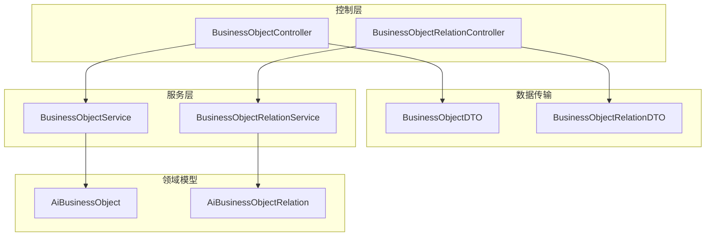
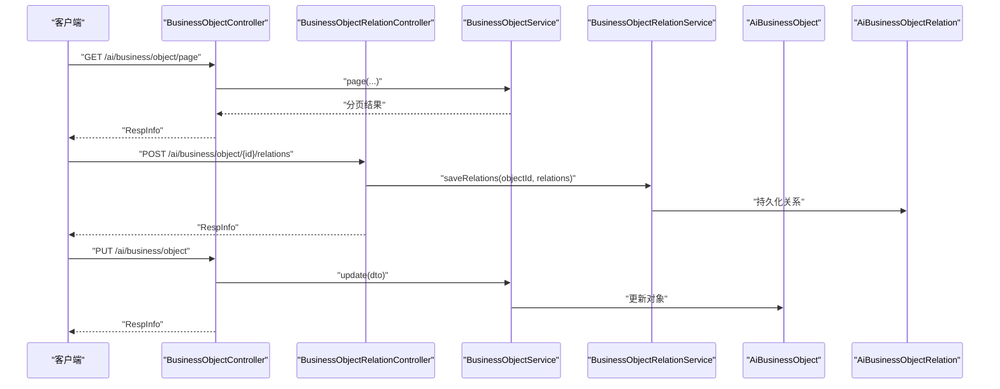
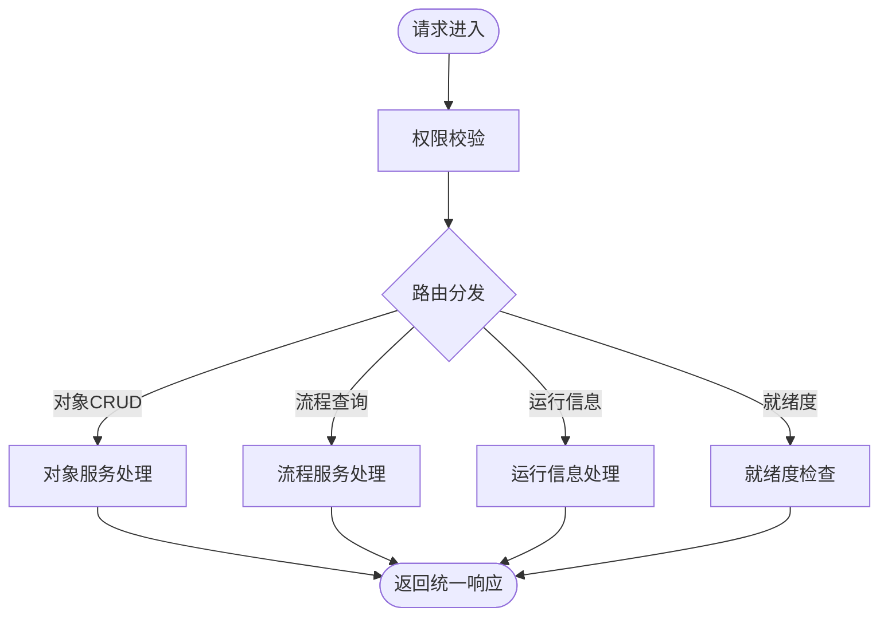
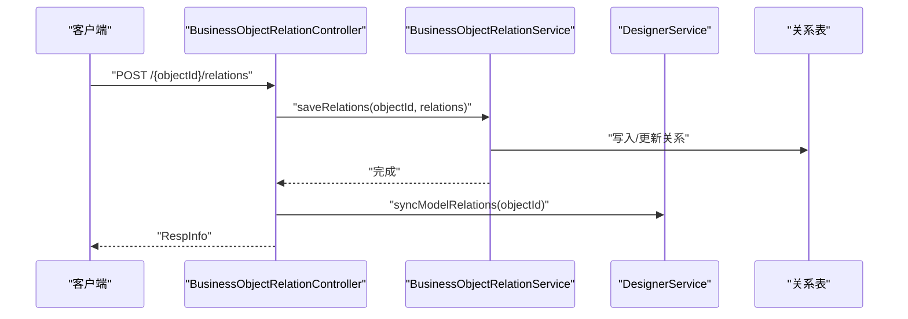
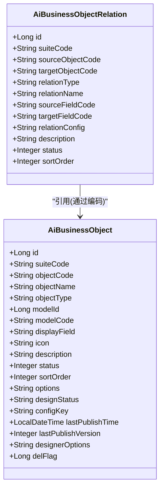
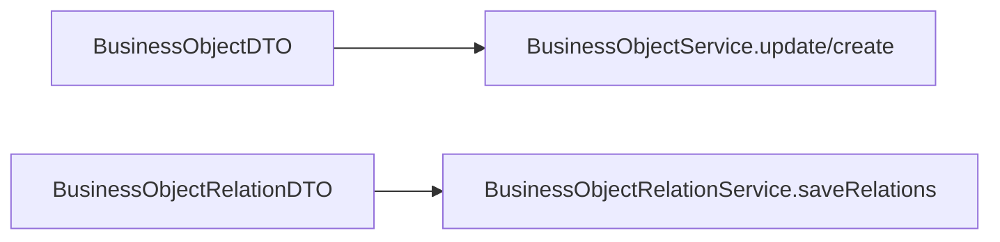
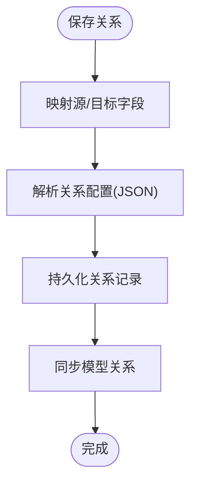
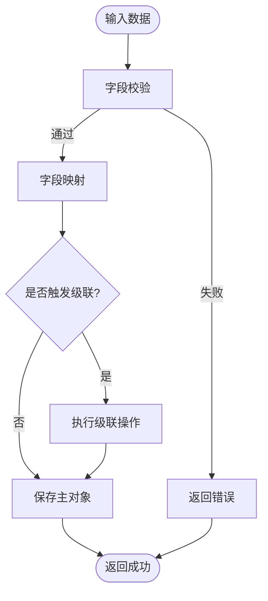
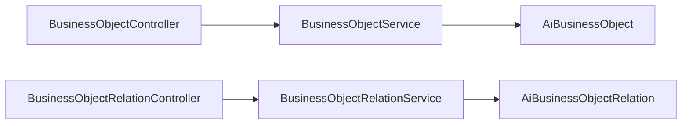

# 业务对象管理

<cite>
**本文引用的文件**
- [BusinessObjectController.java](file://forge-server/forge-framework/forge-plugin-parent/forge-plugin-generator/src/main/java/com/mdframe/forge/plugin/generator/controller/BusinessObjectController.java)
- [BusinessObjectRelationController.java](file://forge-server/forge-framework/forge-plugin-parent/forge-plugin-generator/src/main/java/com/mdframe/forge/plugin/generator/controller/BusinessObjectRelationController.java)
- [AiBusinessObject.java](file://forge-server/forge-framework/forge-plugin-parent/forge-plugin-generator/src/main/java/com/mdframe/forge/plugin/generator/domain/entity/AiBusinessObject.java)
- [AiBusinessObjectRelation.java](file://forge-server/forge-framework/forge-plugin-parent/forge-plugin-generator/src/main/java/com/mdframe/forge/plugin/generator/domain/entity/AiBusinessObjectRelation.java)
- [BusinessObjectDTO.java](file://forge-server/forge-framework/forge-plugin-parent/forge-plugin-generator/src/main/java/com/mdframe/forge/plugin/generator/dto/businessapp/BusinessObjectDTO.java)
- [BusinessObjectRelationDTO.java](file://forge-server/forge-framework/forge-plugin-parent/forge-plugin-generator/src/main/java/com/mdframe/forge/plugin/generator/dto/businessapp/BusinessObjectRelationDTO.java)
- [BusinessObjectService.java](file://forge-server/forge-framework/forge-plugin-parent/forge-plugin-generator/src/main/java/com/mdframe/forge/plugin/generator/service/businessapp/BusinessObjectService.java)
- [BusinessObjectRelationService.java](file://forge-server/forge-framework/forge-plugin-parent/forge-plugin-generator/src/main/java/com/mdframe/forge/plugin/generator/service/businessapp/BusinessObjectRelationService.java)
</cite>

## 目录
1. [简介](#简介)
2. [项目结构](#项目结构)
3. [核心组件](#核心组件)
4. [架构总览](#架构总览)
5. [详细组件分析](#详细组件分析)
6. [依赖关系分析](#依赖关系分析)
7. [性能考量](#性能考量)
8. [故障排查指南](#故障排查指南)
9. [结论](#结论)
10. [附录](#附录)

## 简介
本文件面向“业务对象管理”能力，系统性阐述业务对象的定义、关联关系与生命周期管理；说明对象绑定器在运行时如何支撑一对一、一对多、多对多等关系的配置与使用；解释字段映射、数据验证规则、级联操作等高级特性；并提供对象建模的架构最佳实践（继承、接口抽象、扩展点）以及实际业务场景下的建模案例与性能优化建议。内容基于仓库中业务对象与关系相关的控制器、实体、DTO与服务接口进行归纳与可视化。

## 项目结构
围绕业务对象管理的代码主要位于生成器插件模块中，采用典型的分层组织：
- 控制层：提供业务对象与关系的增删改查、状态切换、运行信息、就绪度检查等API
- 领域模型：持久化实体描述业务对象及其关系
- DTO：用于请求参数与响应数据的传输
- 服务层：封装业务逻辑（由接口暴露，具体实现位于同包下）

**图表来源**
- [BusinessObjectController.java:31-126](file://forge-server/forge-framework/forge-plugin-parent/forge-plugin-generator/src/main/java/com/mdframe/forge/plugin/generator/controller/BusinessObjectController.java#L31-L126)
- [BusinessObjectRelationController.java:24-68](file://forge-server/forge-framework/forge-plugin-parent/forge-plugin-generator/src/main/java/com/mdframe/forge/plugin/generator/controller/BusinessObjectRelationController.java#L24-L68)
- [AiBusinessObject.java:17-72](file://forge-server/forge-framework/forge-plugin-parent/forge-plugin-generator/src/main/java/com/mdframe/forge/plugin/generator/domain/entity/AiBusinessObject.java#L17-L72)
- [AiBusinessObjectRelation.java:15-50](file://forge-server/forge-framework/forge-plugin-parent/forge-plugin-generator/src/main/java/com/mdframe/forge/plugin/generator/domain/entity/AiBusinessObjectRelation.java#L15-L50)
- [BusinessObjectDTO.java:8-44](file://forge-server/forge-framework/forge-plugin-parent/forge-plugin-generator/src/main/java/com/mdframe/forge/plugin/generator/dto/businessapp/BusinessObjectDTO.java#L8-L44)
- [BusinessObjectRelationDTO.java:8-34](file://forge-server/forge-framework/forge-plugin-parent/forge-plugin-generator/src/main/java/com/mdframe/forge/plugin/generator/dto/businessapp/BusinessObjectRelationDTO.java#L8-L34)

**章节来源**
- [BusinessObjectController.java:31-126](file://forge-server/forge-framework/forge-plugin-parent/forge-plugin-generator/src/main/java/com/mdframe/forge/plugin/generator/controller/BusinessObjectController.java#L31-L126)
- [BusinessObjectRelationController.java:24-68](file://forge-server/forge-framework/forge-plugin-parent/forge-plugin-generator/src/main/java/com/mdframe/forge/plugin/generator/controller/BusinessObjectRelationController.java#L24-L68)

## 核心组件
- 业务对象控制器：提供对象分页/列表查询、详情、创建、更新、启停、删除、流程参与查询、运行信息与就绪度检查等能力
- 业务对象关系控制器：提供对象关系的查询、保存、删除以及运行时关系入口查询
- 业务对象实体：描述对象元数据（编码、名称、类型、显示字段、图标、描述、状态、排序、设计状态、发布版本、扩展配置等）
- 业务对象关系实体：描述源对象到目标对象的关联（关系类型、字段映射、关系配置、状态、排序等）
- DTO：承载对象与关系的保存参数
- 服务接口：对外暴露对象与关系的核心业务能力（具体实现位于对应service包）

**章节来源**
- [BusinessObjectController.java:44-126](file://forge-server/forge-framework/forge-plugin-parent/forge-plugin-generator/src/main/java/com/mdframe/forge/plugin/generator/controller/BusinessObjectController.java#L44-L126)
- [BusinessObjectRelationController.java:36-68](file://forge-server/forge-framework/forge-plugin-parent/forge-plugin-generator/src/main/java/com/mdframe/forge/plugin/generator/controller/BusinessObjectRelationController.java#L36-L68)
- [AiBusinessObject.java:25-72](file://forge-server/forge-framework/forge-plugin-parent/forge-plugin-generator/src/main/java/com/mdframe/forge/plugin/generator/domain/entity/AiBusinessObject.java#L25-L72)
- [AiBusinessObjectRelation.java:23-50](file://forge-server/forge-framework/forge-plugin-parent/forge-plugin-generator/src/main/java/com/mdframe/forge/plugin/generator/domain/entity/AiBusinessObjectRelation.java#L23-L50)
- [BusinessObjectDTO.java:11-44](file://forge-server/forge-framework/forge-plugin-parent/forge-plugin-generator/src/main/java/com/mdframe/forge/plugin/generator/dto/businessapp/BusinessObjectDTO.java#L11-L44)
- [BusinessObjectRelationDTO.java:11-34](file://forge-server/forge-framework/forge-plugin-parent/forge-plugin-generator/src/main/java/com/mdframe/forge/plugin/generator/dto/businessapp/BusinessObjectRelationDTO.java#L11-L34)
- [BusinessObjectService.java](file://forge-server/forge-framework/forge-plugin-parent/forge-plugin-generator/src/main/java/com/mdframe/forge/plugin/generator/service/businessapp/BusinessObjectService.java)
- [BusinessObjectRelationService.java](file://forge-server/forge-framework/forge-plugin-parent/forge-plugin-generator/src/main/java/com/mdframe/forge/plugin/generator/service/businessapp/BusinessObjectRelationService.java)

## 架构总览
下图展示了从HTTP请求到领域模型的调用路径，以及对象与关系在控制层、服务层与持久化层的交互方式。

**图表来源**
- [BusinessObjectController.java:44-126](file://forge-server/forge-framework/forge-plugin-parent/forge-plugin-generator/src/main/java/com/mdframe/forge/plugin/generator/controller/BusinessObjectController.java#L44-L126)
- [BusinessObjectRelationController.java:36-68](file://forge-server/forge-framework/forge-plugin-parent/forge-plugin-generator/src/main/java/com/mdframe/forge/plugin/generator/controller/BusinessObjectRelationController.java#L36-L68)
- [AiBusinessObject.java:25-72](file://forge-server/forge-framework/forge-plugin-parent/forge-plugin-generator/src/main/java/com/mdframe/forge/plugin/generator/domain/entity/AiBusinessObject.java#L25-L72)
- [AiBusinessObjectRelation.java:23-50](file://forge-server/forge-framework/forge-plugin-parent/forge-plugin-generator/src/main/java/com/mdframe/forge/plugin/generator/domain/entity/AiBusinessObjectRelation.java#L23-L50)

## 详细组件分析

### 业务对象控制器
- 职责：暴露业务对象的CRUD、状态切换、流程参与查询、运行信息与就绪度检查等能力
- 关键能力：
  - 分页与列表查询
  - 同步低代码模型为业务对象
  - 查询对象详情与运行信息
  - 查询对象参与的业务流程
  - 新增、修改、启停、删除对象
- 安全与审计：通过权限注解与操作日志注解保障访问控制与可追溯性

**图表来源**
- [BusinessObjectController.java:44-126](file://forge-server/forge-framework/forge-plugin-parent/forge-plugin-generator/src/main/java/com/mdframe/forge/plugin/generator/controller/BusinessObjectController.java#L44-L126)

**章节来源**
- [BusinessObjectController.java:44-126](file://forge-server/forge-framework/forge-plugin-parent/forge-plugin-generator/src/main/java/com/mdframe/forge/plugin/generator/controller/BusinessObjectController.java#L44-L126)

### 业务对象关系控制器
- 职责：管理对象之间的关系（查询、保存、删除），并提供运行时关系入口查询
- 关键能力：
  - 根据对象ID查询其所有关系
  - 批量保存关系并同步模型关系
  - 删除指定关系并同步模型关系
  - 获取运行时可用的关系集合

**图表来源**
- [BusinessObjectRelationController.java:36-68](file://forge-server/forge-framework/forge-plugin-parent/forge-plugin-generator/src/main/java/com/mdframe/forge/plugin/generator/controller/BusinessObjectRelationController.java#L36-L68)

**章节来源**
- [BusinessObjectRelationController.java:36-68](file://forge-server/forge-framework/forge-plugin-parent/forge-plugin-generator/src/main/java/com/mdframe/forge/plugin/generator/controller/BusinessObjectRelationController.java#L36-L68)

### 领域模型与数据结构
- 业务对象实体：包含对象编码、名称、类型、显示字段、图标、描述、状态、排序、设计状态、发布版本、扩展配置等
- 业务对象关系实体：包含源/目标对象编码、关系类型（参考、明细、子列表、多对多）、关系名称、字段映射、关系配置、状态、排序等

**图表来源**
- [AiBusinessObject.java:25-72](file://forge-server/forge-framework/forge-plugin-parent/forge-plugin-generator/src/main/java/com/mdframe/forge/plugin/generator/domain/entity/AiBusinessObject.java#L25-L72)
- [AiBusinessObjectRelation.java:23-50](file://forge-server/forge-framework/forge-plugin-parent/forge-plugin-generator/src/main/java/com/mdframe/forge/plugin/generator/domain/entity/AiBusinessObjectRelation.java#L23-L50)

**章节来源**
- [AiBusinessObject.java:25-72](file://forge-server/forge-framework/forge-plugin-parent/forge-plugin-generator/src/main/java/com/mdframe/forge/plugin/generator/domain/entity/AiBusinessObject.java#L25-L72)
- [AiBusinessObjectRelation.java:23-50](file://forge-server/forge-framework/forge-plugin-parent/forge-plugin-generator/src/main/java/com/mdframe/forge/plugin/generator/domain/entity/AiBusinessObjectRelation.java#L23-L50)

### 数据传输对象（DTO）
- 业务对象DTO：用于创建/更新对象时的参数传递，包括基础属性、运行时/导入数据源、模型关联、展示与状态等
- 业务对象关系DTO：用于保存关系时的参数传递，包括源/目标对象、关系类型、字段映射、关系配置、状态与排序等

**图表来源**
- [BusinessObjectDTO.java:11-44](file://forge-server/forge-framework/forge-plugin-parent/forge-plugin-generator/src/main/java/com/mdframe/forge/plugin/generator/dto/businessapp/BusinessObjectDTO.java#L11-L44)
- [BusinessObjectRelationDTO.java:11-34](file://forge-server/forge-framework/forge-plugin-parent/forge-plugin-generator/src/main/java/com/mdframe/forge/plugin/generator/dto/businessapp/BusinessObjectRelationDTO.java#L11-L34)

**章节来源**
- [BusinessObjectDTO.java:11-44](file://forge-server/forge-framework/forge-plugin-parent/forge-plugin-generator/src/main/java/com/mdframe/forge/plugin/generator/dto/businessapp/BusinessObjectDTO.java#L11-L44)
- [BusinessObjectRelationDTO.java:11-34](file://forge-server/forge-framework/forge-plugin-parent/forge-plugin-generator/src/main/java/com/mdframe/forge/plugin/generator/dto/businessapp/BusinessObjectRelationDTO.java#L11-L34)

### 对象绑定器与关系配置（一对一、一对多、多对多）
- 关系类型：支持参考、明细、子列表、多对多等常见关系形态
- 字段映射：通过源字段与目标字段建立双向或单向映射，便于运行时导航与数据装配
- 关系配置：以JSON形式存储扩展配置，可用于约束行为（如级联策略、可见性、只读等）
- 运行时入口：提供运行时关系查询能力，供上层应用按需加载关联数据

**图表来源**
- [BusinessObjectRelationController.java:43-60](file://forge-server/forge-framework/forge-plugin-parent/forge-plugin-generator/src/main/java/com/mdframe/forge/plugin/generator/controller/BusinessObjectRelationController.java#L43-L60)
- [AiBusinessObjectRelation.java:32-42](file://forge-server/forge-framework/forge-plugin-parent/forge-plugin-generator/src/main/java/com/mdframe/forge/plugin/generator/domain/entity/AiBusinessObjectRelation.java#L32-L42)

**章节来源**
- [AiBusinessObjectRelation.java:32-42](file://forge-server/forge-framework/forge-plugin-parent/forge-plugin-generator/src/main/java/com/mdframe/forge/plugin/generator/domain/entity/AiBusinessObjectRelation.java#L32-L42)
- [BusinessObjectRelationController.java:43-60](file://forge-server/forge-framework/forge-plugin-parent/forge-plugin-generator/src/main/java/com/mdframe/forge/plugin/generator/controller/BusinessObjectRelationController.java#L43-L60)

### 字段映射、数据验证与级联操作
- 字段映射：通过源字段与目标字段建立映射，配合关系配置实现跨对象的数据装配与展示
- 数据验证：建议在保存前对必填、格式、唯一性等规则进行校验（可在服务层或表单层实现）
- 级联操作：结合关系配置与运行时服务，可实现新增/更新/删除时的级联行为（如明细级联、主从一致性）

[本节为概念性流程说明，不直接分析具体文件]

### 对象设计模式与架构最佳实践
- 继承关系：将通用字段（如租户、状态、排序、描述）抽取至基类，减少重复
- 接口抽象：通过服务接口解耦实现，便于替换与测试
- 扩展点设计：利用扩展配置（JSON）与运行时配置键，在不改动核心逻辑的前提下扩展行为
- 版本与发布：通过设计状态与发布版本管理对象演进，保证线上稳定性

[本节为概念性指导，不直接分析具体文件]

## 依赖关系分析
- 控制层依赖服务层：控制器仅负责入参校验、权限与日志，核心逻辑下沉至服务
- 服务层依赖领域模型：服务通过实体进行数据持久化与状态管理
- 关系与对象通过编码关联：关系实体通过源/目标对象编码与对象实体形成逻辑关联

**图表来源**
- [BusinessObjectController.java:31-126](file://forge-server/forge-framework/forge-plugin-parent/forge-plugin-generator/src/main/java/com/mdframe/forge/plugin/generator/controller/BusinessObjectController.java#L31-L126)
- [BusinessObjectRelationController.java:24-68](file://forge-server/forge-framework/forge-plugin-parent/forge-plugin-generator/src/main/java/com/mdframe/forge/plugin/generator/controller/BusinessObjectRelationController.java#L24-L68)
- [AiBusinessObject.java:25-72](file://forge-server/forge-framework/forge-plugin-parent/forge-plugin-generator/src/main/java/com/mdframe/forge/plugin/generator/domain/entity/AiBusinessObject.java#L25-L72)
- [AiBusinessObjectRelation.java:23-50](file://forge-server/forge-framework/forge-plugin-parent/forge-plugin-generator/src/main/java/com/mdframe/forge/plugin/generator/domain/entity/AiBusinessObjectRelation.java#L23-L50)

**章节来源**
- [BusinessObjectController.java:31-126](file://forge-server/forge-framework/forge-plugin-parent/forge-plugin-generator/src/main/java/com/mdframe/forge/plugin/generator/controller/BusinessObjectController.java#L31-L126)
- [BusinessObjectRelationController.java:24-68](file://forge-server/forge-framework/forge-plugin-parent/forge-plugin-generator/src/main/java/com/mdframe/forge/plugin/generator/controller/BusinessObjectRelationController.java#L24-L68)

## 性能考量
- 分页与列表：优先使用分页接口避免全量拉取
- 关系加载：按需加载关联数据，避免N+1问题；可利用运行时关系入口进行分批或条件加载
- 缓存策略：对频繁读取的对象元数据与关系配置考虑缓存（如本地缓存或分布式缓存）
- 索引与查询：为常用查询字段（如对象编码、状态、设计状态）建立索引以提升查询效率
- 事务边界：在批量保存关系时合理划分事务，避免长事务影响吞吐

[本节提供一般性建议，不直接分析具体文件]

## 故障排查指南
- 权限问题：确认调用接口具备相应权限标识
- 数据不一致：检查对象与关系的编码是否匹配，字段映射是否正确
- 关系未生效：确认保存后是否调用了模型关系同步
- 运行时报错：通过运行信息接口定位对象运行时状态与异常上下文

**章节来源**
- [BusinessObjectController.java:44-126](file://forge-server/forge-framework/forge-plugin-parent/forge-plugin-generator/src/main/java/com/mdframe/forge/plugin/generator/controller/BusinessObjectController.java#L44-L126)
- [BusinessObjectRelationController.java:36-68](file://forge-server/forge-framework/forge-plugin-parent/forge-plugin-generator/src/main/java/com/mdframe/forge/plugin/generator/controller/BusinessObjectRelationController.java#L36-L68)

## 结论
本方案通过清晰的分层结构与标准化的实体/DTO设计，提供了完整的业务对象管理与关系管理能力。借助关系类型、字段映射与关系配置，可灵活表达一对一、一对多、多对多等复杂关联；通过服务接口与运行时能力，支撑对象的生命周期管理与扩展。建议在实际项目中结合分页、缓存与索引等手段优化性能，并通过版本与发布机制保障演进过程中的稳定性。

## 附录
- 常用接口速览：
  - 对象分页/列表/详情/创建/更新/启停/删除
  - 对象参与流程查询、运行信息查询、就绪度检查
  - 对象关系查询/保存/删除、运行时关系入口查询
- 关键字段说明：
  - 对象类型、关系类型、字段映射、关系配置、状态与排序

[本节为补充说明，不直接分析具体文件]