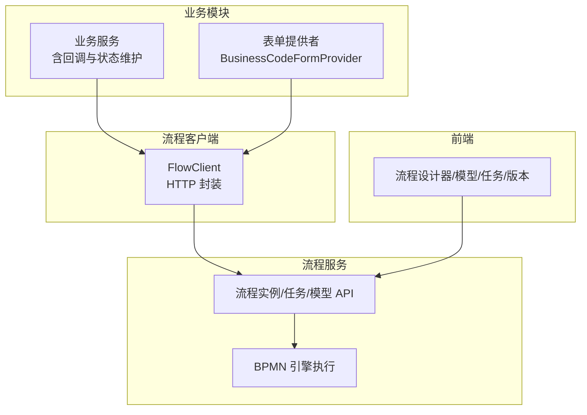
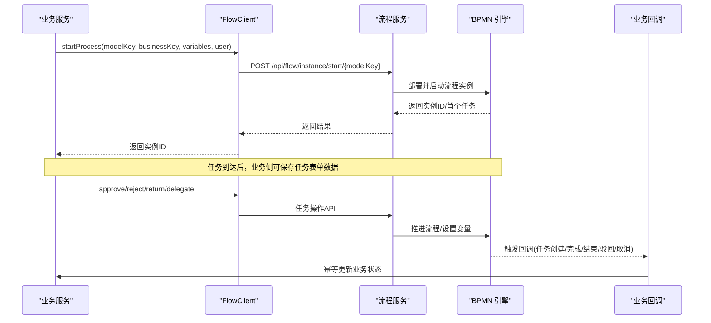
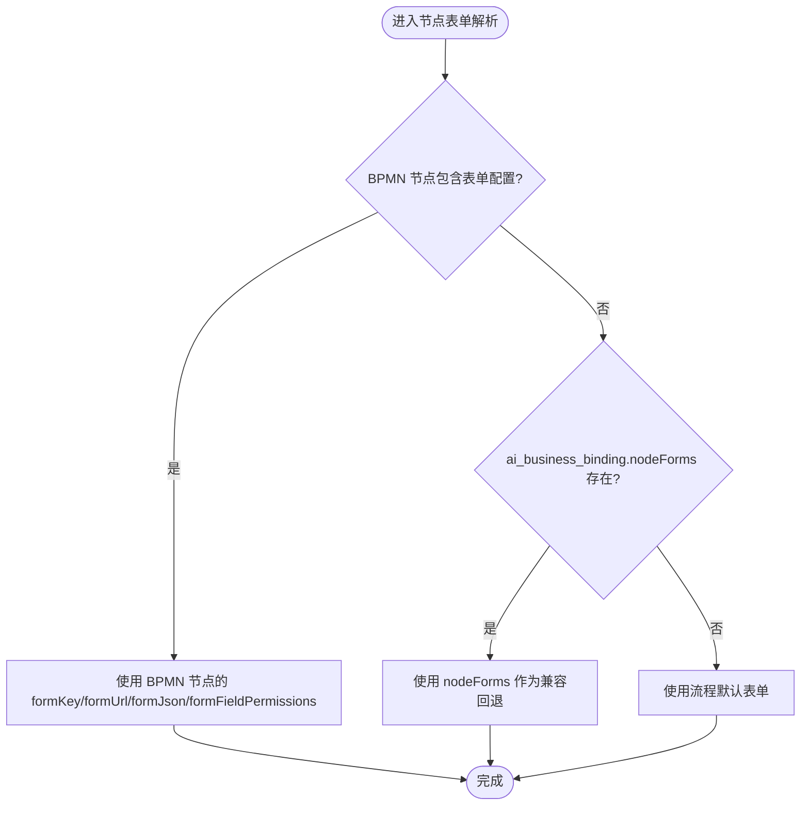
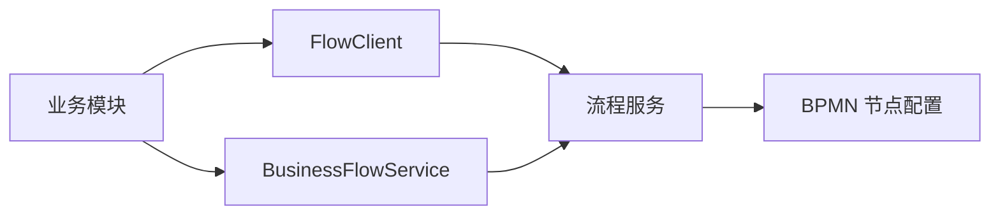

# 业务流程配置

<cite>
**本文引用的文件**
- [SKILL.md](file://.agents/skills/forge-business-flow-development/SKILL.md)
- [bpmn-configuration.md](file://.agents/skills/forge-business-flow-development/references/bpmn-configuration.md)
- [code-first-workflow.md](file://.agents/skills/forge-business-flow-development/references/code-first-workflow.md)
- [lowcode-workflow.md](file://.agents/skills/forge-business-flow-development/references/lowcode-workflow.md)
- [status-and-callbacks.md](file://.agents/skills/forge-business-flow-development/references/status-and-callbacks.md)
- [FlowClient.java](file://forge-server/forge-flow/forge-flow-client/src/main/java/com/mdframe/forge/flow/client/FlowClient.java)
- [BusinessFlowService.java](file://forge-server/forge-framework/forge-plugin-parent/forge-plugin-generator/src/main/java/com/mdframe/forge/plugin/generator/service/businessapp/BusinessFlowService.java)
</cite>

## 目录
1. [简介](#简介)
2. [项目结构](#项目结构)
3. [核心组件](#核心组件)
4. [架构总览](#架构总览)
5. [详细组件分析](#详细组件分析)
6. [依赖关系分析](#依赖关系分析)
7. [性能考虑](#性能考虑)
8. [故障排查指南](#故障排查指南)
9. [结论](#结论)
10. [附录](#附录)

## 简介
本文件面向“业务流程配置”能力，系统性说明如何将工作流引擎集成到应用中，涵盖流程定义、节点配置、条件分支、流程面板使用（BPMN导入、可视化编辑、版本管理）、流程与业务对象关联机制（数据传递、状态同步、事件触发），以及企业级最佳实践（流程优化、异常处理、监控追踪）。文档基于仓库中的技能参考与客户端实现进行提炼，确保可操作且可追溯。

## 项目结构
围绕业务流程配置，仓库提供了两类落地路径：
- 代码优先（Code-First）：适用于复杂业务模块，需要自定义服务逻辑、表结构与表单。
- 低代码（Low-Code）：适用于由动态 CRUD 驱动的业务对象，通过平台运行时与绑定配置完成流程编排。

同时提供统一的流程客户端 FlowClient，供业务模块以 HTTP 方式调用流程服务；并提供前端流程管理视图（模型、任务、版本等）。

图表来源
- [FlowClient.java:73-514](file://forge-server/forge-flow/forge-flow-client/src/main/java/com/mdframe/forge/flow/client/FlowClient.java#L73-L514)
- [code-first-workflow.md:19-58](file://.agents/skills/forge-business-flow-development/references/code-first-workflow.md#L19-L58)
- [lowcode-workflow.md:6-35](file://.agents/skills/forge-business-flow-development/references/lowcode-workflow.md#L6-L35)

章节来源
- [SKILL.md:12-38](file://.agents/skills/forge-business-flow-development/SKILL.md#L12-L38)
- [code-first-workflow.md:1-95](file://.agents/skills/forge-business-flow-development/references/code-first-workflow.md#L1-L95)
- [lowcode-workflow.md:1-43](file://.agents/skills/forge-business-flow-development/references/lowcode-workflow.md#L1-L43)

## 核心组件
- 流程客户端 FlowClient：统一封装对流程服务的发起流程、任务审批、变量查询、模型管理等 HTTP 调用，支持令牌透传与内部调用头。
- 业务流服务 BusinessFlowService：低代码场景下，负责按租户+业务键加锁启动流程、写入流程实例关联记录，避免重复启动。
- BPMN 节点配置：在真实流程设计器中维护节点表单、字段权限、审批策略、退回/拒绝/会签等行为与表达式。
- 状态与回调：业务模块通过枚举维护状态，并在任务创建/完成、流程结束、驳回、取消等回调中幂等更新业务状态。

章节来源
- [FlowClient.java:73-514](file://forge-server/forge-flow/forge-flow-client/src/main/java/com/mdframe/forge/flow/client/FlowClient.java#L73-L514)
- [BusinessFlowService.java](file://forge-server/forge-framework/forge-plugin-parent/forge-plugin-generator/src/main/java/com/mdframe/forge/plugin/generator/service/businessapp/BusinessFlowService.java)
- [bpmn-configuration.md:1-106](file://.agents/skills/forge-business-flow-development/references/bpmn-configuration.md#L1-L106)
- [status-and-callbacks.md:1-92](file://.agents/skills/forge-business-flow-development/references/status-and-callbacks.md#L1-L92)

## 架构总览
下图展示从业务侧发起流程到任务流转、再到状态同步的端到端链路。

图表来源
- [FlowClient.java:88-124](file://forge-server/forge-flow/forge-flow-client/src/main/java/com/mdframe/forge/flow/client/FlowClient.java#L88-L124)
- [FlowClient.java:323-409](file://forge-server/forge-flow/forge-flow-client/src/main/java/com/mdframe/forge/flow/client/FlowClient.java#L323-L409)
- [status-and-callbacks.md:32-78](file://.agents/skills/forge-business-flow-development/references/status-and-callbacks.md#L32-L78)

## 详细组件分析

### 流程定义与节点配置（BPMN）
- 节点表单解析优先级：BPMN 节点 formKey/formUrl/formJson/formFieldPermissions > ai_business_binding.nodeForms 兼容回退 > 流程默认表单。
- 用户任务属性：assignee 表达式、formKey/formUrl/formJson、字段读写/必填、允许的操作（审批/拒绝/转办/退回/终止）、是否必须填写意见。
- 变量与表达式：assignee 使用 ${var} 形式；多实例会签使用 multiInstanceLoopCharacteristics 与 completionCondition；条件分支使用 conditionExpression；网关默认分支不应附加条件表达式。
- 模型初始化规则：不存在则创建并部署；存在但 XML 为空则写入默认并部署；存在且非空则保留用户编辑内容，仅按需部署未发布的模型。
- 表单资产规则：代码优先使用 BUSINESS_CODE_FORM + Provider；低代码使用 BUSINESS_OBJECT_FORM + 发布后的运行时配置；外部 URL 为高级回退。

图表来源
- [bpmn-configuration.md:5-15](file://.agents/skills/forge-business-flow-development/references/bpmn-configuration.md#L5-L15)
- [bpmn-configuration.md:17-98](file://.agents/skills/forge-business-flow-development/references/bpmn-configuration.md#L17-L98)

章节来源
- [bpmn-configuration.md:1-106](file://.agents/skills/forge-business-flow-development/references/bpmn-configuration.md#L1-L106)

### 代码优先工作流（Code-First）
- 业务契约：对象编码、模型 Key、业务 Key 格式、标准状态集。
- 数据库与字典：迁移脚本包含业务键、流程实例 ID、审批/备注字段、审计与租户字段，唯一索引与字典。
- 后端分层：Entity/Mapper/Service/Controller/Provider/FlowDefinition/FlowBpmn/VO/DTO。
- FlowDefinition：集中常量与默认表单元数据，暴露构建上下文、任务保存 DTO、业务 Key、模型负载等方法。
- BusinessCodeFormProvider：实现表单上下文构建与保存，将任务保存转换为业务 DTO 并调用 Service 校验状态与节点键。
- 启动流程：仅允许草稿提交；构造 BPMN 所需变量；调用 FlowClient.startProcess；成功后在同一事务内持久化业务键与流程实例 ID，并更新状态。
- 回调注册：@FlowBind/@FlowCallback 覆盖任务创建/完成、流程完成/驳回/取消；回调需幂等，结合页面查询做活跃任务修复。
- 应用中心与绑定：插入套件/对象/应用种子数据与 ai_business_binding，保持 nodeForms 仅为兼容回退。
- 前端：仅在必要时定制页面；使用字典标签；Long ID 以字符串传递。

章节来源
- [code-first-workflow.md:1-95](file://.agents/skills/forge-business-flow-development/references/code-first-workflow.md#L1-L95)

### 低代码工作流（Low-Code）
- 业务对象与运行时：通过 AiCrudPage 或 /ai/crud/{configKey} 访问；文档配置标识状态字段、负责人、标题字段与默认流程。
- 流程绑定：ai_business_binding 中 target_type=OBJECT，必需键包括 flowModelKey、titleTemplate、businessBinding、variableMapping；所有 assignee/condition 需有对应变量映射。
- 启动流程：使用平台内置 START_FLOW；后端 BusinessFlowService 按 tenantId + businessKey 加锁并写入 ai_business_flow_instance_link；避免重复自定义启动。
- 节点表单：在真实流程设计器中选择业务表单资产，配置字段权限并保存到 BPMN 节点属性；nodeForms 仅为兼容回退。
- 审批动作：待办/已办/历史表单上下文获取与保存；平台动作端点调用 FlowClient.approve/reject 并同步实例链接与文档状态。
- 回调与副作用：仅在终端结果时使用 callbackActions 执行领域动作；库存/财务/数量变更应走平台服务并保证幂等。

章节来源
- [lowcode-workflow.md:1-43](file://.agents/skills/forge-business-flow-development/references/lowcode-workflow.md#L1-L43)
- [BusinessFlowService.java](file://forge-server/forge-framework/forge-plugin-parent/forge-plugin-generator/src/main/java/com/mdframe/forge/plugin/generator/service/businessapp/BusinessFlowService.java)

### 状态与回调（Status & Callbacks）
- 状态集：DRAFT、IN_PROCESS、NEED_MODIFY、APPROVED、REJECTED、CANCELED；通过枚举 getCode()/matches() 比较，禁止硬编码字符串。
- 业务表字段：至少包含 status、business_key、process_instance_id；可选审批人/备注字段用于检索/报表。
- 回调职责：任务创建修复当前活动节点对应的业务状态；任务完成复制必要变量并推进状态；完成/驳回/取消分别设置终态与原因。
- 修复规则：任务创建时根据活动节点修正 IN_PROCESS/NEED_MODIFY；任务表单保存时双向修复；页面详情查询时基于活跃任务反推并持久化修复后的状态。
- 变量安全：完成任务前写入审批变量；终态事件合并运行态与历史变量；回调容忍缺失变量；前端保持 recordId/businessKey/userId 为字符串。
- 幂等性：启动以 tenantId + businessKey 保护；低代码平台已加锁；代码优先服务需防止重复提交；终态领域副作用需独立幂等键。

章节来源
- [status-and-callbacks.md:1-92](file://.agents/skills/forge-business-flow-development/references/status-and-callbacks.md#L1-L92)

### 流程面板使用（导入、编辑、版本）
- 模型管理：通过流程客户端获取模型列表、按 Key 获取详情、创建/更新/发布模型。
- 任务管理：待办/已办/我发起的任务列表、任务详情、签收、催办、评论历史。
- 表单信息：根据 taskId 或 processInstanceId/businessKey/taskDefKey 获取任务表单信息（含 formKey/formUrl/formFieldPermissions）。
- 流程图：获取 PNG 流程图字节数组用于可视化展示。
- 版本管理：通过模型列表与详情查看已部署模型，结合发布接口完成版本演进；设计器保存时应避免在网关默认分支引入条件表达式。

章节来源
- [FlowClient.java:221-461](file://forge-server/forge-flow/forge-flow-client/src/main/java/com/mdframe/forge/flow/client/FlowClient.java#L221-L461)
- [FlowClient.java:465-514](file://forge-server/forge-flow/forge-flow-client/src/main/java/com/mdframe/forge/flow/client/FlowClient.java#L465-L514)
- [bpmn-configuration.md:71-106](file://.agents/skills/forge-business-flow-development/references/bpmn-configuration.md#L71-L106)

### 流程与业务对象的关联机制
- 数据传递：启动时传入 variables 供 BPMN 表达式与任务表单使用；任务完成前写入审批变量以便后续网关与回调读取。
- 状态同步：业务状态由业务模块维护，回调与页面查询共同保障一致性；避免仅依赖流程屏幕推断状态。
- 事件触发：任务创建/完成、流程完成/驳回/取消等回调驱动状态迁移；必要时在页面查询阶段做活跃任务修复。
- 绑定配置：低代码场景通过 ai_business_binding 将对象与流程模型绑定，要求变量映射完整；代码优先场景通过 FlowDefinition 与 Provider 完成表单与变量映射。

章节来源
- [lowcode-workflow.md:11-35](file://.agents/skills/forge-business-flow-development/references/lowcode-workflow.md#L11-L35)
- [code-first-workflow.md:26-58](file://.agents/skills/forge-business-flow-development/references/code-first-workflow.md#L26-L58)
- [status-and-callbacks.md:32-92](file://.agents/skills/forge-business-flow-development/references/status-and-callbacks.md#L32-L92)

## 依赖关系分析
- 业务模块依赖 FlowClient 调用流程服务，避免直接耦合流程服务端点。
- 低代码场景依赖 BusinessFlowService 提供的启动与关联写入能力，确保并发安全与幂等。
- BPMN 节点配置是运行时表单与权限的唯一权威来源，设计器保存需遵循规则以避免回退失效。

图表来源
- [FlowClient.java:73-514](file://forge-server/forge-flow/forge-flow-client/src/main/java/com/mdframe/forge/flow/client/FlowClient.java#L73-L514)
- [BusinessFlowService.java](file://forge-server/forge-framework/forge-plugin-parent/forge-plugin-generator/src/main/java/com/mdframe/forge/plugin/generator/service/businessapp/BusinessFlowService.java)
- [bpmn-configuration.md:1-15](file://.agents/skills/forge-business-flow-development/references/bpmn-configuration.md#L1-L15)

章节来源
- [FlowClient.java:73-514](file://forge-server/forge-flow/forge-flow-client/src/main/java/com/mdframe/forge/flow/client/FlowClient.java#L73-L514)
- [BusinessFlowService.java](file://forge-server/forge-framework/forge-plugin-parent/forge-plugin-generator/src/main/java/com/mdframe/forge/plugin/generator/service/businessapp/BusinessFlowService.java)
- [bpmn-configuration.md:1-106](file://.agents/skills/forge-business-flow-development/references/bpmn-configuration.md#L1-L106)

## 性能考虑
- 批量查询：Provider 的 buildSummaries 应使用批量查询避免 N+1 问题，提升待办/已办列表性能。
- 变量与表达式：减少复杂表达式计算，合理拆分条件分支，避免在网关默认分支附加条件表达式导致重复任务。
- 回调幂等：所有回调与终态副作用需具备幂等键，防止重试或重复触发造成额外开销。
- 前端 ID 类型：保持 Long ID 为字符串，避免 JavaScript Number 精度损失导致的重复请求或缓存失效。

[本节为通用指导，不直接分析具体文件]

## 故障排查指南
- 表单解析失败：检查 BPMN 节点 formKey/formUrl/formJson/formFieldPermissions 是否存在且无首尾空格；确认变量映射完整。
- 重复任务/分支错误：检查网关默认分支是否误加了条件表达式；排查是否存在同源同目的重复顺序流。
- 状态不一致：在 TASK_CREATED 回调、任务表单保存、页面详情查询三处增加修复逻辑；确保回调幂等。
- 启动重复：低代码场景依赖 BusinessFlowService 的加锁；代码优先场景需校验状态与已有 business_key/process_instance_id。
- 变量缺失：完成任务前写入审批变量；终态回调合并运行态与历史变量；回调容忍缺失变量。

章节来源
- [bpmn-configuration.md:99-106](file://.agents/skills/forge-business-flow-development/references/bpmn-configuration.md#L99-L106)
- [status-and-callbacks.md:62-92](file://.agents/skills/forge-business-flow-development/references/status-and-callbacks.md#L62-L92)
- [lowcode-workflow.md:16-20](file://.agents/skills/forge-business-flow-development/references/lowcode-workflow.md#L16-L20)

## 结论
通过 FlowClient 统一调用流程服务、在 BPMN 节点中权威配置表单与权限、在业务模块中以枚举维护状态并通过回调幂等同步，Forge 提供了从代码优先到低代码的完整业务流程配置能力。配合设计器的可视化编辑与版本管理，可满足企业级流程编排、异常处理与监控追踪需求。

[本节为总结，不直接分析具体文件]

## 附录
- 最佳实践清单
  - 始终使用真实流程设计器维护节点配置，不在应用中心自建节点配置工作台。
  - 业务状态通过枚举比较，禁止硬编码字符串或数字。
  - Flyway 脚本可重复或带 NOT EXISTS 保护；租户数据使用 tenant_id = 1。
  - 复杂 SQL 放入 Mapper XML；Controller 写接口使用强类型 DTO。
  - 低代码场景避免在 AiCrudPage 自定义动作中重复实现启动流程。
  - 终态领域副作用使用独立幂等键，避免不可逆操作放在前端处理器。

章节来源
- [SKILL.md:26-61](file://.agents/skills/forge-business-flow-development/SKILL.md#L26-L61)
- [code-first-workflow.md:13-58](file://.agents/skills/forge-business-flow-development/references/code-first-workflow.md#L13-L58)
- [lowcode-workflow.md:11-35](file://.agents/skills/forge-business-flow-development/references/lowcode-workflow.md#L11-L35)
- [status-and-callbacks.md:1-92](file://.agents/skills/forge-business-flow-development/references/status-and-callbacks.md#L1-L92)