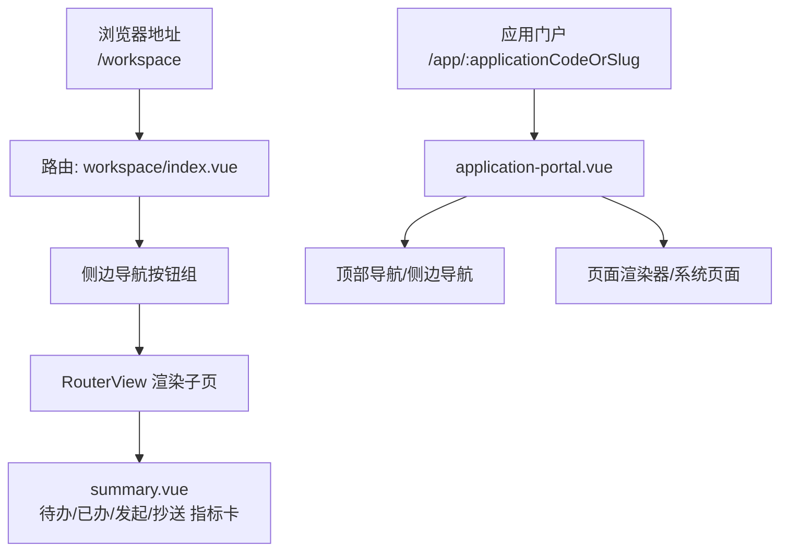
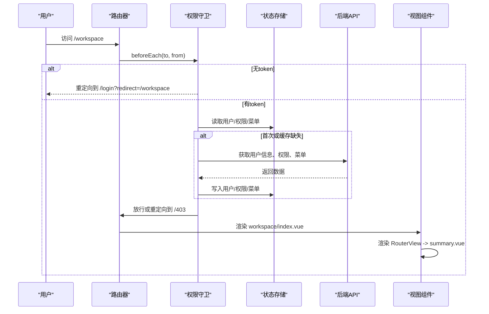
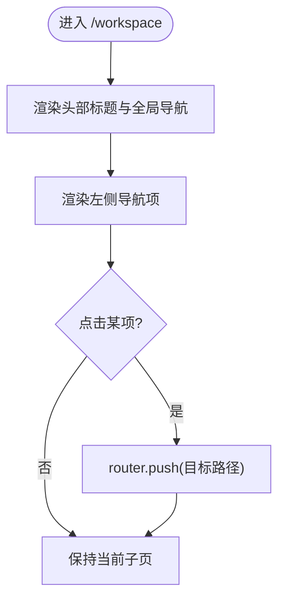
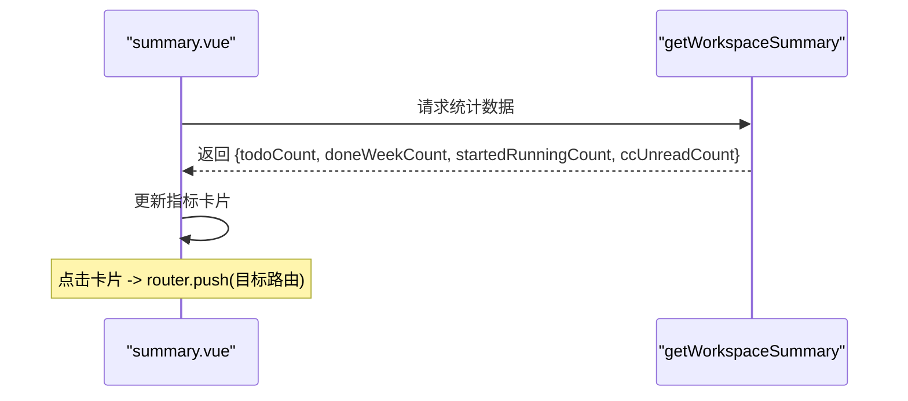
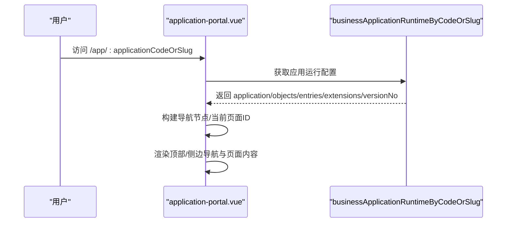
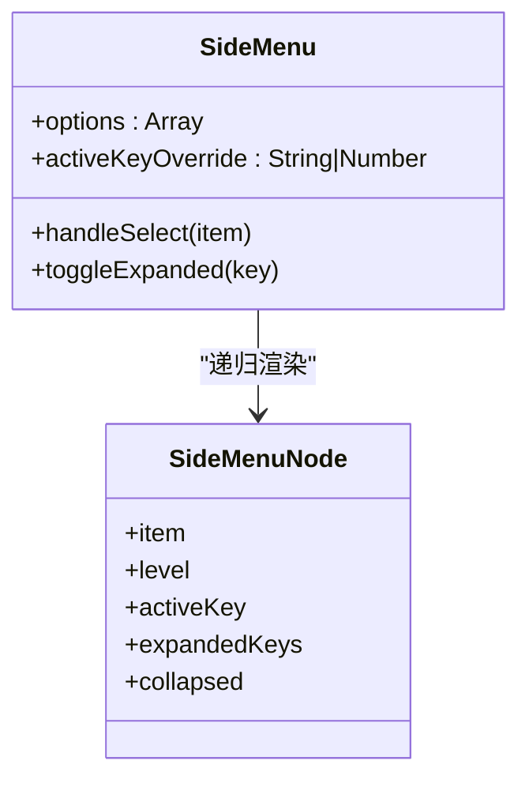
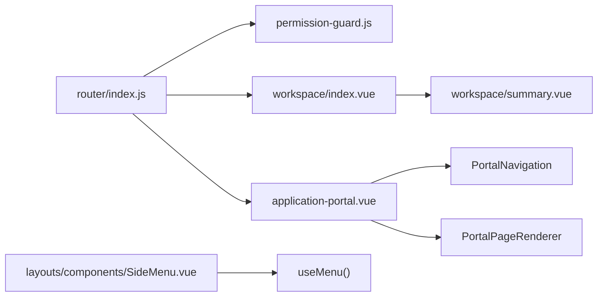

# 工作空间概览

<cite>
**本文引用的文件**
- [路由配置](file://forge-admin-ui/src/router/index.js)
- [权限守卫](file://forge-admin-ui/src/router/guards/permission-guard.js)
- [工作台外壳页面](file://forge-admin-ui/src/views/workspace/index.vue)
- [工作台首页（汇总）](file://forge-admin-ui/src/views/workspace/summary.vue)
- [应用门户容器](file://forge-admin-ui/src/layouts/app-portal/index.vue)
- [Bento 布局](file://forge-admin-ui/src/layouts/bento/index.vue)
- [侧边菜单组件](file://forge-admin-ui/src/layouts/components/SideMenu.vue)
- [应用门户主视图](file://forge-admin-ui/src/views/app-center/application-portal.vue)
</cite>

## 目录
1. [简介](#简介)
2. [项目结构](#项目结构)
3. [核心组件](#核心组件)
4. [架构总览](#架构总览)
5. [详细组件分析](#详细组件分析)
6. [依赖关系分析](#依赖关系分析)
7. [性能考虑](#性能考虑)
8. [故障排查指南](#故障排查指南)
9. [结论](#结论)
10. [附录：使用指南与最佳实践](#附录使用指南与最佳实践)

## 简介
本文件面向“应用工作空间的概览界面”，系统性说明头部导航、侧边栏菜单与整体布局结构；解释工作空间初始化流程、用户权限验证与业务域切换机制；梳理各面板入口点与功能映射（应用概览、对象绑定、权限管理、流程配置等）；并提供快速上手路径与最佳实践建议，帮助读者高效定位和使用工作空间能力。

## 项目结构
工作空间相关的前端实现集中在 forge-admin-ui 中，关键位置如下：
- 路由定义与重定向：router/index.js
- 路由守卫与权限校验：router/guards/permission-guard.js
- 工作空间外壳与子页：views/workspace/index.vue、views/workspace/summary.vue
- 应用门户与业务域容器：layouts/app-portal/index.vue、views/app-center/application-portal.vue
- 通用布局与侧边菜单：layouts/bento/index.vue、layouts/components/SideMenu.vue

图表来源
- [路由配置:205-242](file://forge-admin-ui/src/router/index.js#L205-L242)
- [工作台外壳页面:1-37](file://forge-admin-ui/src/views/workspace/index.vue#L1-L37)
- [工作台首页（汇总）:1-42](file://forge-admin-ui/src/views/workspace/summary.vue#L1-L42)
- [应用门户主视图:1-145](file://forge-admin-ui/src/views/app-center/application-portal.vue#L1-L145)

章节来源
- [路由配置:205-242](file://forge-admin-ui/src/router/index.js#L205-L242)
- [工作台外壳页面:1-37](file://forge-admin-ui/src/views/workspace/index.vue#L1-L37)
- [应用门户主视图:1-145](file://forge-admin-ui/src/views/app-center/application-portal.vue#L1-L145)

## 核心组件
- 工作台外壳（Workspace Shell）
  - 职责：提供头部标题与全局顶部导航，左侧固定导航项，右侧 RouterView 承载具体子页。
  - 关键点：通过本地路由数组驱动侧边导航，点击即 push 到对应 /workspace/* 路由。
- 工作台首页（Summary）
  - 职责：聚合展示待办、本周已办、发起中、未读抄送四项指标，支持刷新与跳转。
  - 关键点：调用工作空间统计接口，错误时降级显示提示。
- 应用门户（Application Portal）
  - 职责：按 applicationCodeOrSlug 加载应用运行态，渲染顶部/侧边导航与页面内容，支持系统内置页面与工作区页面。
  - 关键点：根据导航样式（side/top/collapsed）切换布局；移动端自动切换为顶部导航。
- 侧边菜单（SideMenu）
  - 职责：渲染多级菜单，处理展开/收起、激活态、折叠模式下的交互。
  - 关键点：基于 useMenu 计算当前激活键与展开键，兼容外部 options 注入。
- 布局容器
  - app-portal：极简容器，用于特定场景的无壳页面。
  - bento：带顶部 Tab 与主内容区的通用布局，适用于任务列表等全屏场景。

章节来源
- [工作台外壳页面:1-101](file://forge-admin-ui/src/views/workspace/index.vue#L1-L101)
- [工作台首页（汇总）:44-132](file://forge-admin-ui/src/views/workspace/summary.vue#L44-L132)
- [应用门户主视图:147-327](file://forge-admin-ui/src/views/app-center/application-portal.vue#L147-L327)
- [侧边菜单组件:1-100](file://forge-admin-ui/src/layouts/components/SideMenu.vue#L1-L100)
- [Bento 布局:1-35](file://forge-admin-ui/src/layouts/bento/index.vue#L1-L35)
- [应用门户容器:1-25](file://forge-admin-ui/src/layouts/app-portal/index.vue#L1-L25)

## 架构总览
工作空间由“路由 + 守卫 + 布局 + 页面”四层构成：
- 路由层：集中声明 /workspace 及其子路由，以及应用门户 /app/:applicationCodeOrSlug。
- 守卫层：统一进行登录态校验、用户信息/权限/菜单加载、租户配置应用与强制改密拦截。
- 布局层：工作台外壳与应用门户分别承担不同场景的导航与内容组织。
- 页面层：summary/todo/done/started/cc 等子页负责各自数据与交互。

图表来源
- [权限守卫:87-266](file://forge-admin-ui/src/router/guards/permission-guard.js#L87-L266)
- [路由配置:205-242](file://forge-admin-ui/src/router/index.js#L205-L242)
- [工作台外壳页面:1-37](file://forge-admin-ui/src/views/workspace/index.vue#L1-L37)

章节来源
- [权限守卫:87-266](file://forge-admin-ui/src/router/guards/permission-guard.js#L87-L266)
- [路由配置:205-242](file://forge-admin-ui/src/router/index.js#L205-L242)

## 详细组件分析

### 工作台外壳（Workspace Shell）
- 结构与职责
  - 顶部：标题与全局顶部导航（BusinessTopNav）。
  - 左侧：导航按钮组，包含“工作台首页、我的待办、我的已办、我发起的、抄送我、我的草稿（禁用）”。
  - 右侧：RouterView 渲染子页面。
- 交互要点
  - 通过 route.path 匹配高亮当前项。
  - 点击非当前项执行 router.push 跳转。
- 可访问性与响应式
  - 小屏下侧边改为网格布局，保证可用性。

图表来源
- [工作台外壳页面:1-101](file://forge-admin-ui/src/views/workspace/index.vue#L1-L101)

章节来源
- [工作台外壳页面:1-101](file://forge-admin-ui/src/views/workspace/index.vue#L1-L101)

### 工作台首页（Summary）
- 数据流
  - 挂载时调用 getWorkspaceSummary，将结果映射为四个指标卡片。
  - 失败时设置错误提示并清空指标。
- 交互
  - 每个卡片点击跳转到对应列表页（支持外部传入 routeTargets 覆盖默认路由）。
  - 提供“刷新”按钮重新拉取数据。

图表来源
- [工作台首页（汇总）:44-132](file://forge-admin-ui/src/views/workspace/summary.vue#L44-L132)

章节来源
- [工作台首页（汇总）:44-132](file://forge-admin-ui/src/views/workspace/summary.vue#L44-L132)

### 应用门户（Application Portal）
- 初始化流程
  - 监听路由参数 applicationCodeOrSlug，调用 businessApplicationRuntimeByCodeOrSlug 获取应用运行态。
  - 解析 portalConfig、navigationNodes、currentPageId，选择渲染系统页面或自定义页面。
- 导航与布局
  - 支持 side/top/collapsed 三种导航样式，移动端自动切换为顶部导航。
  - 顶部包含品牌、消息通知、用户头像等常用操作。
- 水印与国际化
  - 根据配置生成水印文本与样式，支持全局或内容级水印。
- 错误与空态
  - 根据错误信息分类展示 forbidden/unavailable/error 空态。

图表来源
- [应用门户主视图:147-327](file://forge-admin-ui/src/views/app-center/application-portal.vue#L147-L327)

章节来源
- [应用门户主视图:147-327](file://forge-admin-ui/src/views/app-center/application-portal.vue#L147-L327)

### 侧边菜单（SideMenu）
- 行为特性
  - 支持多级菜单展开/收起，自动展开父级以高亮当前项。
  - 折叠模式下，点击直接导航，不展开子菜单。
  - 支持外部 options 注入，便于在不同布局中复用。
- 视觉反馈
  - 悬停、激活、父子激活态均有明确样式区分。
  - 滚动区域与滚动条样式适配暗色主题。

图表来源
- [侧边菜单组件:1-100](file://forge-admin-ui/src/layouts/components/SideMenu.vue#L1-L100)

章节来源
- [侧边菜单组件:1-100](file://forge-admin-ui/src/layouts/components/SideMenu.vue#L1-L100)

### 布局容器（App Portal & Bento）
- App Portal
  - 极简容器，用于需要独立背景与最小化装饰的场景。
- Bento
  - 顶部 Tab 栏 + 主内容区，针对任务列表等全屏场景优化滚动与留白。

章节来源
- [应用门户容器:1-25](file://forge-admin-ui/src/layouts/app-portal/index.vue#L1-L25)
- [Bento 布局:1-35](file://forge-admin-ui/src/layouts/bento/index.vue#L1-L35)

## 依赖关系分析
- 路由与守卫
  - 路由注册了 /workspace 及其子路由，并在根路径重定向到 /home。
  - 权限守卫在每次路由切换前校验 token、用户信息、权限与菜单，必要时强制改密或重定向到 403。
- 组件耦合
  - workspace/index.vue 依赖 BusinessTopNav 与 RouterView。
  - summary.vue 依赖 @/api/workspace 的统计接口。
  - application-portal.vue 依赖业务应用运行时接口与内部导航/渲染组件。
  - SideMenu.vue 依赖 useMenu 组合式函数与 appStore 折叠状态。

图表来源
- [路由配置:205-242](file://forge-admin-ui/src/router/index.js#L205-L242)
- [权限守卫:87-266](file://forge-admin-ui/src/router/guards/permission-guard.js#L87-L266)
- [工作台外壳页面:1-37](file://forge-admin-ui/src/views/workspace/index.vue#L1-L37)
- [应用门户主视图:147-327](file://forge-admin-ui/src/views/app-center/application-portal.vue#L147-L327)
- [侧边菜单组件:1-100](file://forge-admin-ui/src/layouts/components/SideMenu.vue#L1-L100)

章节来源
- [路由配置:205-242](file://forge-admin-ui/src/router/index.js#L205-L242)
- [权限守卫:87-266](file://forge-admin-ui/src/router/guards/permission-guard.js#L87-L266)

## 性能考虑
- 路由守卫
  - 首次进入会并发拉取用户信息与权限，减少多次往返；成功后再拉取菜单数据。
  - 对重复访问进行缓存（store），避免重复请求。
- 页面渲染
  - 工作台首页按需加载统计指标，失败时快速降级。
  - 应用门户根据导航样式与设备类型动态切换布局，减少不必要的 DOM。
- 滚动与交互
  - 侧边菜单与页面内容采用独立滚动区域，避免整页抖动。
  - 小屏下自适应布局，降低重排成本。

[本节为通用性能建议，不直接引用具体代码]

## 故障排查指南
- 无法进入工作空间
  - 检查是否已登录且拥有相应权限；若被重定向到 /403，确认权限列表中是否包含 /workspace 或其子路径。
  - 若出现强制改密提示，前往个人中心完成密码修改后再试。
- 工作台首页指标为空
  - 检查网络请求是否成功；查看控制台是否有错误提示；尝试点击“刷新”重试。
- 应用门户空白或报错
  - 确认 applicationCodeOrSlug 是否正确；查看错误分类（forbidden/unavailable/error）并据此调整权限或发布状态。
- 侧边菜单异常
  - 检查 useMenu 返回的菜单数据格式；确认当前路由 key 是否在菜单中存在；折叠模式下点击是否期望直接导航。

章节来源
- [权限守卫:87-266](file://forge-admin-ui/src/router/guards/permission-guard.js#L87-L266)
- [工作台首页（汇总）:106-132](file://forge-admin-ui/src/views/workspace/summary.vue#L106-L132)
- [应用门户主视图:261-327](file://forge-admin-ui/src/views/app-center/application-portal.vue#L261-L327)

## 结论
工作空间以清晰的路由与守卫体系为基础，结合工作台外壳与应用门户两种布局，实现了从“个人事务中心”到“业务域门户”的完整体验。通过统一的权限校验与菜单加载机制，确保用户在正确的上下文中访问所需功能；同时提供简洁直观的入口与导航，提升日常操作效率。

[本节为总结性内容，不直接引用具体代码]

## 附录：使用指南与最佳实践
- 快速定位功能
  - 工作台首页：进入 /workspace 后，优先查看“工作台首页”指标卡，点击即可直达对应列表。
  - 我的待办/已办/发起/抄送：通过左侧导航快速切换，关注数字变化与筛选条件。
  - 应用门户：访问 /app/:applicationCodeOrSlug，根据导航样式（侧边/顶部/折叠）选择合适布局。
- 常用操作路径
  - 对象绑定：在应用门户内通过页面渲染器进入对象相关页面（如设计器、运行时）。
  - 权限管理：在工作台或应用门户的系统页面中，通过 system:* 路由进入权限相关页面。
  - 流程配置：在应用门户中切换到流程相关页面，或在 /app-center/business-process/:processId 进行流程设计。
- 最佳实践
  - 首次进入先刷新工作台首页，确保指标数据最新。
  - 遇到权限问题优先检查角色与菜单授权，必要时联系管理员。
  - 在移动端优先使用顶部导航，获得更佳的触控体验。
  - 频繁切换页面时，利用 Tab 标签（bento 布局）减少重复加载。

[本节为使用指导，不直接引用具体代码]