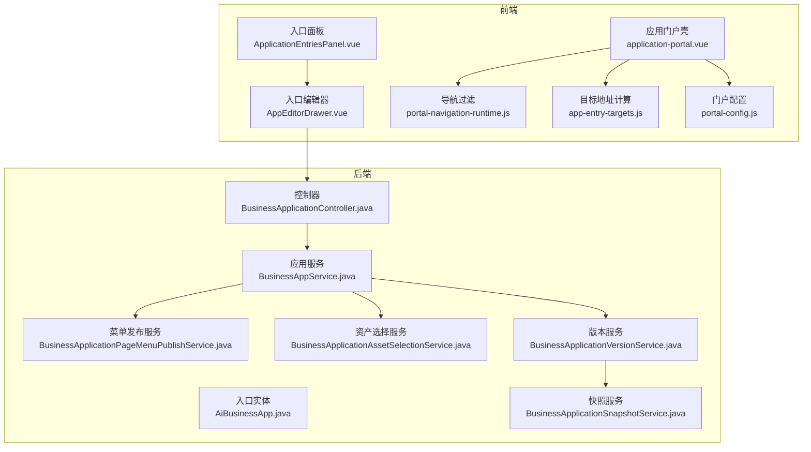
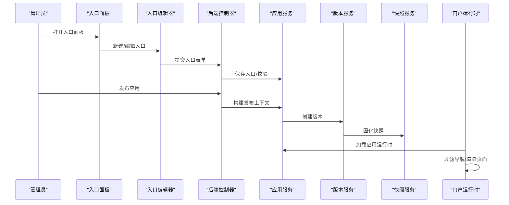
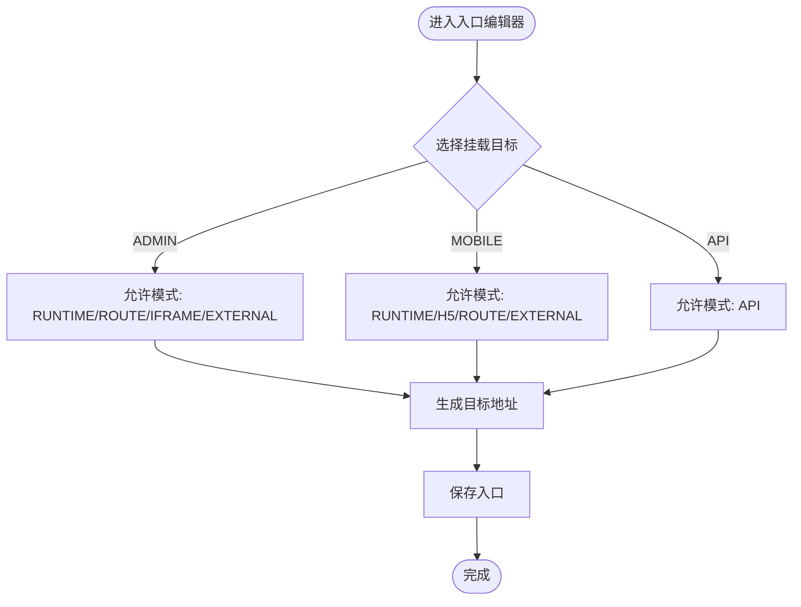
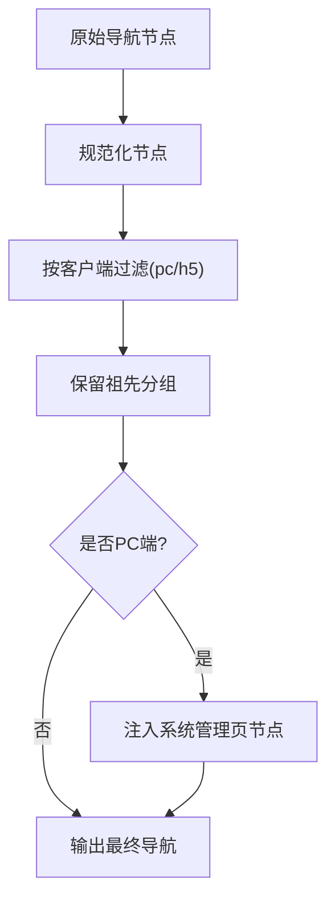
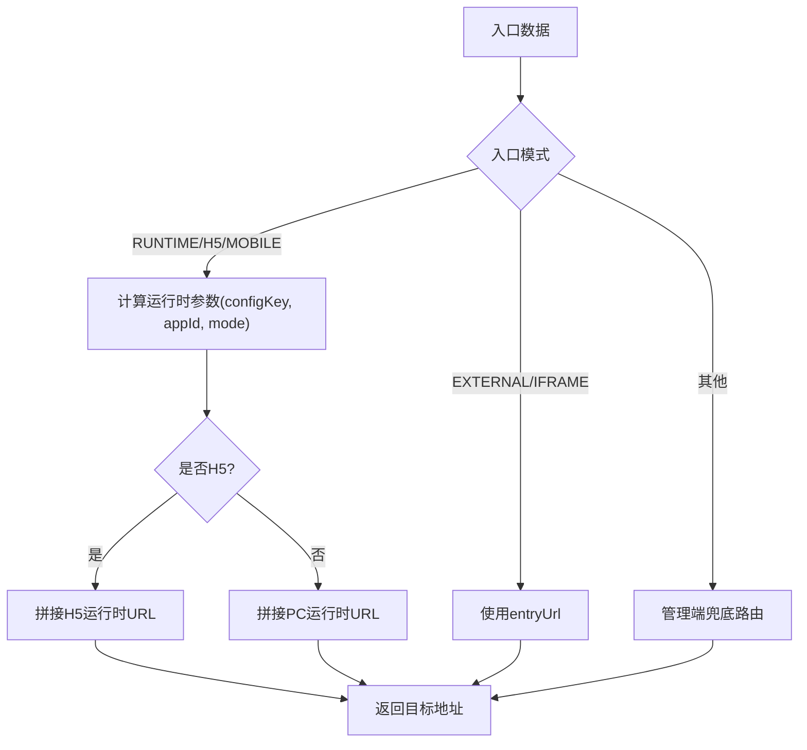
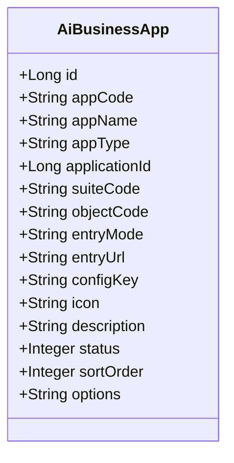
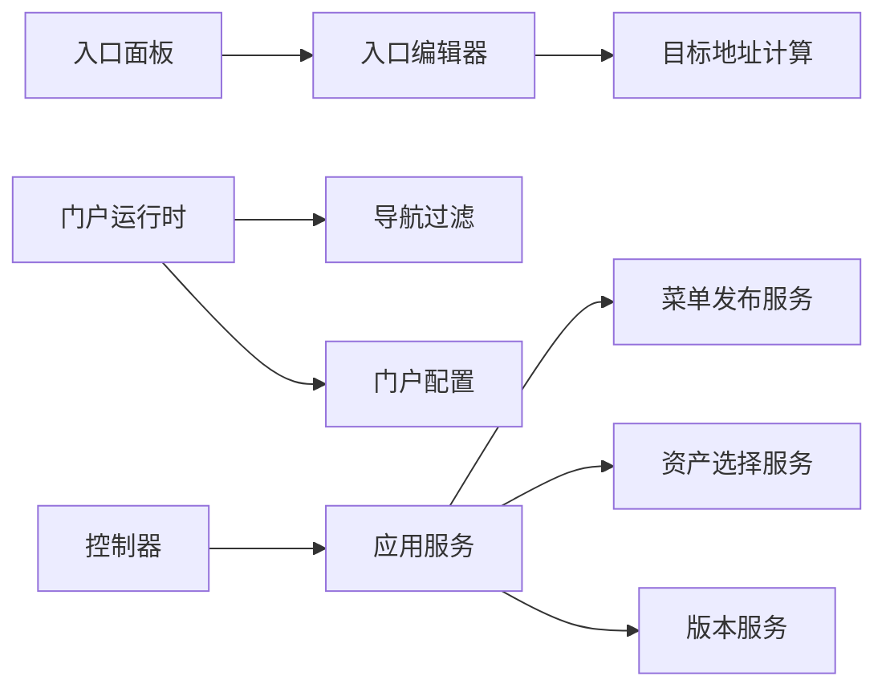

# 应用入口管理

<cite>
**本文引用的文件**
- [ApplicationEntriesPanel.vue](file://forge-admin-ui/src/views/app-center/application-workspace/ApplicationEntriesPanel.vue)
- [app-entry-targets.js](file://forge-admin-ui/src/views/app-center/components/app-entry-targets.js)
- [portal-navigation-runtime.js](file://forge-admin-ui/src/views/app-center/components/portal/portal-navigation-runtime.js)
- [portal-config.js](file://forge-admin-ui/src/views/app-center/components/portal/portal-config.js)
- [application-portal.vue](file://forge-admin-ui/src/views/app-center/application-portal.vue)
- [AppEditorDrawer.vue](file://forge-admin-ui/src/views/app-center/components/AppEditorDrawer.vue)
- [AiBusinessApp.java](file://forge-server/forge-framework/forge-plugin-parent/forge-plugin-generator/src/main/java/com/mdframe/forge/plugin/generator/domain/entity/AiBusinessApp.java)
- [BusinessAppService.java](file://forge-server/forge-framework/forge-plugin-parent/forge-plugin-generator/src/main/java/com/mdframe/forge/plugin/generator/service/businessapp/BusinessAppService.java)
- [BusinessApplicationPageMenuPublishService.java](file://forge-server/forge-framework/forge-plugin-parent/forge-plugin-generator/src/main/java/com/mdframe/forge/plugin/generator/service/businessapp/BusinessApplicationPageMenuPublishService.java)
- [BusinessApplicationAssetSelectionService.java](file://forge-server/forge-framework/forge-plugin-parent/forge-plugin-generator/src/main/java/com/mdframe/forge/plugin/generator/service/businessapp/BusinessApplicationAssetSelectionService.java)
- [BusinessApplicationController.java](file://forge-server/forge-framework/forge-plugin-parent/forge-plugin-generator/src/main/java/com/mdframe/forge/plugin/generator/controller/BusinessApplicationController.java)
- [BusinessApplicationVersionService.java](file://forge-server/forge-framework/forge-plugin-parent/forge-plugin-generator/src/main/java/com/mdframe/forge/plugin/generator/service/businessapp/BusinessApplicationVersionService.java)
- [BusinessApplicationSnapshotService.java](file://forge-server/forge-framework/forge-plugin-parent/forge-plugin-generator/src/main/java/com/mdframe/forge/plugin/generator/service/businessapp/BusinessApplicationSnapshotService.java)
- [wecom.js](file://forge-admin-ui/src/utils/wecom.js)
</cite>

## 目录
1. [简介](#简介)
2. [项目结构](#项目结构)
3. [核心组件](#核心组件)
4. [架构总览](#架构总览)
5. [详细组件分析](#详细组件分析)
6. [依赖关系分析](#依赖关系分析)
7. [性能考虑](#性能考虑)
8. [故障排查指南](#故障排查指南)
9. [结论](#结论)
10. [附录：配置与案例](#附录配置与案例)

## 简介
本文件面向“应用入口管理”能力，覆盖以下主题：
- 入口概念与作用：统一承载 PC 端、移动端 H5、第三方集成等访问入口。
- 入口面板使用：创建入口、路由配置、权限绑定、预览与打开。
- 生命周期管理：启用/禁用、版本控制、下线清理。
- 企业级最佳实践：用户体验优化、性能与安全策略。
- 实际配置案例与常见问题解决方案。

## 项目结构
围绕应用入口的前后端关键位置如下：
- 前端入口面板与工作区：用于创建、编辑、预览与管理入口。
- 门户运行时：渲染应用门户、导航与页面。
- 后端实体与服务：定义入口数据模型、发布快照、菜单路径解析、权限校验等。

**图示来源**
- [ApplicationEntriesPanel.vue:1-40](file://forge-admin-ui/src/views/app-center/application-workspace/ApplicationEntriesPanel.vue#L1-L40)
- [AppEditorDrawer.vue:334-847](file://forge-admin-ui/src/views/app-center/components/AppEditorDrawer.vue#L334-L847)
- [application-portal.vue:1-200](file://forge-admin-ui/src/views/app-center/application-portal.vue#L1-L200)
- [portal-navigation-runtime.js:1-108](file://forge-admin-ui/src/views/app-center/components/portal/portal-navigation-runtime.js#L1-L108)
- [app-entry-targets.js:1-190](file://forge-admin-ui/src/views/app-center/components/app-entry-targets.js#L1-L190)
- [portal-config.js:1-256](file://forge-admin-ui/src/views/app-center/components/portal/portal-config.js#L1-L256)
- [AiBusinessApp.java:1-63](file://forge-server/forge-framework/forge-plugin-parent/forge-plugin-generator/src/main/java/com/mdframe/forge/plugin/generator/domain/entity/AiBusinessApp.java#L1-L63)
- [BusinessAppService.java:499-526](file://forge-server/forge-framework/forge-plugin-parent/forge-plugin-generator/src/main/java/com/mdframe/forge/plugin/generator/service/businessapp/BusinessAppService.java#L499-L526)
- [BusinessApplicationPageMenuPublishService.java:288-314](file://forge-server/forge-framework/forge-plugin-parent/forge-plugin-generator/src/main/java/com/mdframe/forge/plugin/generator/service/businessapp/BusinessApplicationPageMenuPublishService.java#L288-L314)
- [BusinessApplicationAssetSelectionService.java:59-79](file://forge-server/forge-framework/forge-plugin-parent/forge-plugin-generator/src/main/java/com/mdframe/forge/plugin/generator/service/businessapp/BusinessApplicationAssetSelectionService.java#L59-L79)
- [BusinessApplicationController.java:148-175](file://forge-server/forge-framework/forge-plugin-parent/forge-plugin-generator/src/main/java/com/mdframe/forge/plugin/generator/controller/BusinessApplicationController.java#L148-L175)
- [BusinessApplicationVersionService.java:1-29](file://forge-server/forge-framework/forge-plugin-parent/forge-plugin-generator/src/main/java/com/mdframe/forge/plugin/generator/service/businessapp/BusinessApplicationVersionService.java#L1-L29)
- [BusinessApplicationSnapshotService.java:158-168](file://forge-server/forge-framework/forge-plugin-parent/forge-plugin-generator/src/main/java/com/mdframe/forge/plugin/generator/service/businessapp/BusinessApplicationSnapshotService.java#L158-L168)

**章节来源**
- [ApplicationEntriesPanel.vue:1-40](file://forge-admin-ui/src/views/app-center/application-workspace/ApplicationEntriesPanel.vue#L1-L40)
- [AppEditorDrawer.vue:334-847](file://forge-admin-ui/src/views/app-center/components/AppEditorDrawer.vue#L334-L847)
- [application-portal.vue:1-200](file://forge-admin-ui/src/views/app-center/application-portal.vue#L1-L200)
- [AiBusinessApp.java:1-63](file://forge-server/forge-framework/forge-plugin-parent/forge-plugin-generator/src/main/java/com/mdframe/forge/plugin/generator/domain/entity/AiBusinessApp.java#L1-L63)

## 核心组件
- 入口面板（工作区）：展示当前应用的访问入口列表，支持新增、打开、编辑、删除等操作。
- 入口编辑器：按挂载目标（PC/移动/API）限制可用入口模式，并生成对应路由或外部链接。
- 门户运行时：根据客户端类型（pc/h5）过滤导航节点，渲染系统页或用户编排页。
- 目标地址计算：根据入口模式与配置，生成 PC 运行时、H5 运行时、外部 URL 或管理端兜底路径。
- 后端实体与服务：维护入口元数据、发布快照、菜单路径解析、权限与可见性控制。

**章节来源**
- [ApplicationEntriesPanel.vue:1-40](file://forge-admin-ui/src/views/app-center/application-workspace/ApplicationEntriesPanel.vue#L1-L40)
- [AppEditorDrawer.vue:334-847](file://forge-admin-ui/src/views/app-center/components/AppEditorDrawer.vue#L334-L847)
- [portal-navigation-runtime.js:1-108](file://forge-admin-ui/src/views/app-center/components/portal/portal-navigation-runtime.js#L1-L108)
- [app-entry-targets.js:1-190](file://forge-admin-ui/src/views/app-center/components/app-entry-targets.js#L1-L190)
- [AiBusinessApp.java:1-63](file://forge-server/forge-framework/forge-plugin-parent/forge-plugin-generator/src/main/java/com/mdframe/forge/plugin/generator/domain/entity/AiBusinessApp.java#L1-L63)

## 架构总览
入口从创建到运行的端到端流程：
- 管理员在入口面板创建/编辑入口，选择挂载目标与入口模式。
- 保存后，后端持久化入口实体；发布时生成不可变版本快照。
- 门户运行时加载应用快照，按客户端类型过滤导航节点。
- 点击入口时，前端计算目标地址并跳转至 PC/H5 运行时或外部站点。

**图示来源**
- [ApplicationEntriesPanel.vue:1-40](file://forge-admin-ui/src/views/app-center/application-workspace/ApplicationEntriesPanel.vue#L1-L40)
- [AppEditorDrawer.vue:334-847](file://forge-admin-ui/src/views/app-center/components/AppEditorDrawer.vue#L334-L847)
- [BusinessApplicationController.java:148-175](file://forge-server/forge-framework/forge-plugin-parent/forge-plugin-generator/src/main/java/com/mdframe/forge/plugin/generator/controller/BusinessApplicationController.java#L148-L175)
- [BusinessApplicationVersionService.java:1-29](file://forge-server/forge-framework/forge-plugin-parent/forge-plugin-generator/src/main/java/com/mdframe/forge/plugin/generator/service/businessapp/BusinessApplicationVersionService.java#L1-L29)
- [BusinessApplicationSnapshotService.java:158-168](file://forge-server/forge-framework/forge-plugin-parent/forge-plugin-generator/src/main/java/com/mdframe/forge/plugin/generator/service/businessapp/BusinessApplicationSnapshotService.java#L158-L168)
- [application-portal.vue:1-200](file://forge-admin-ui/src/views/app-center/application-portal.vue#L1-L200)

## 详细组件分析

### 入口面板与工作区
- 功能要点：
  - 列表展示入口名称、类型、业务对象、状态、更新时间。
  - 提供“新增访问入口”、“打开”、“编辑”等操作。
  - 空态引导创建第一个入口。
- 交互建议：
  - 批量操作前进行二次确认。
  - 对未启用或未配置完成的入口给出提示。

**章节来源**
- [ApplicationEntriesPanel.vue:1-40](file://forge-admin-ui/src/views/app-center/application-workspace/ApplicationEntriesPanel.vue#L1-L40)

### 入口编辑器（创建/路由/权限）
- 挂载目标与入口模式：
  - 管理端（ADMIN）：支持 RUNTIME、ROUTE、IFRAME、EXTERNAL。
  - 移动端（MOBILE）：支持 RUNTIME、H5、ROUTE、EXTERNAL。
  - API（INTEGRATION）：仅支持 API 模式。
- 路由与目标地址：
  - RUNTIME/H5：通过 configKey 与 runtimeOpenMode 生成运行时路径。
  - EXTERNAL/IFRAME：直接写入 entryUrl。
  - 兜底：回退到管理端应用路由。
- 权限绑定：
  - 可通过 options.permissionCode 关联权限码。
  - 门户可见性由 portalConfig.permission 控制（角色/部门/用户）。

**图示来源**
- [AppEditorDrawer.vue:334-847](file://forge-admin-ui/src/views/app-center/components/AppEditorDrawer.vue#L334-L847)
- [app-entry-targets.js:1-190](file://forge-admin-ui/src/views/app-center/components/app-entry-targets.js#L1-L190)

**章节来源**
- [AppEditorDrawer.vue:334-847](file://forge-admin-ui/src/views/app-center/components/AppEditorDrawer.vue#L334-L847)
- [app-entry-targets.js:1-190](file://forge-admin-ui/src/views/app-center/components/app-entry-targets.js#L1-L190)

### 门户运行时与导航过滤
- 客户端识别：
  - pc：管理门户。
  - h5/mobile：移动端 H5。
- 导航过滤：
  - 根据 mountTarget 将节点映射为 pc/h5 可见集合。
  - 保留可见页面的祖先分组，确保层级完整。
- 系统页注入：
  - PC 端会在用户页面之前插入系统管理页节点。

**图示来源**
- [portal-navigation-runtime.js:1-108](file://forge-admin-ui/src/views/app-center/components/portal/portal-navigation-runtime.js#L1-L108)
- [application-portal.vue:1-200](file://forge-admin-ui/src/views/app-center/application-portal.vue#L1-L200)

**章节来源**
- [portal-navigation-runtime.js:1-108](file://forge-admin-ui/src/views/app-center/components/portal/portal-navigation-runtime.js#L1-L108)
- [application-portal.vue:1-200](file://forge-admin-ui/src/views/app-center/application-portal.vue#L1-L200)

### 目标地址计算（PC/H5/外部）
- 规则摘要：
  - H5/移动：拼接 H5 Base URL + /#/pages/lowcode-runtime?configKey=...&appId=...&mode=...
  - WEB 运行时：/ai/crud-page/:configKey?runtimeOpenMode=...&pageKey=...
  - 外部/看板：直接使用 entryUrl。
  - 兜底：/app-center/app/:id。
- 预览与打开：
  - 编辑器内可预览目标地址。
  - 入口面板“打开”按钮调用同一套计算逻辑。

**图示来源**
- [app-entry-targets.js:1-190](file://forge-admin-ui/src/views/app-center/components/app-entry-targets.js#L1-L190)

**章节来源**
- [app-entry-targets.js:1-190](file://forge-admin-ui/src/views/app-center/components/app-entry-targets.js#L1-L190)

### 后端实体与发布链路
- 入口实体字段：
  - appType：BUSINESS/EMBEDDED/MOBILE/INTEGRATION。
  - entryMode：RUNTIME/ROUTE/IFRAME/EXTERNAL/H5/API。
  - entryUrl/configKey/icon/description/status/sortOrder/options。
- 发布与版本：
  - 发布时构建上下文，过滤未启用或未配置完成的入口。
  - 生成不可变版本快照，标记设计状态与版本号。
- 菜单路径解析：
  - PC：优先解析桌面页路径，否则以 pageId 查询。
  - H5：低代码运行时路径带 configKey 与 appId。

**图示来源**
- [AiBusinessApp.java:1-63](file://forge-server/forge-framework/forge-plugin-parent/forge-plugin-generator/src/main/java/com/mdframe/forge/plugin/generator/domain/entity/AiBusinessApp.java#L1-L63)

**章节来源**
- [AiBusinessApp.java:1-63](file://forge-server/forge-framework/forge-plugin-parent/forge-plugin-generator/src/main/java/com/mdframe/forge/plugin/generator/domain/entity/AiBusinessApp.java#L1-L63)
- [BusinessApplicationAssetSelectionService.java:59-79](file://forge-server/forge-framework/forge-plugin-parent/forge-plugin-generator/src/main/java/com/mdframe/forge/plugin/generator/service/businessapp/BusinessApplicationAssetSelectionService.java#L59-L79)
- [BusinessApplicationPageMenuPublishService.java:288-314](file://forge-server/forge-framework/forge-plugin-parent/forge-plugin-generator/src/main/java/com/mdframe/forge/plugin/generator/service/businessapp/BusinessApplicationPageMenuPublishService.java#L288-L314)
- [BusinessApplicationVersionService.java:1-29](file://forge-server/forge-framework/forge-plugin-parent/forge-plugin-generator/src/main/java/com/mdframe/forge/plugin/generator/service/businessapp/BusinessApplicationVersionService.java#L1-L29)
- [BusinessApplicationSnapshotService.java:158-168](file://forge-server/forge-framework/forge-plugin-parent/forge-plugin-generator/src/main/java/com/mdframe/forge/plugin/generator/service/businessapp/BusinessApplicationSnapshotService.java#L158-L168)

### 门户配置与可见性
- 门户配置项：
  - 主题、导航样式、水印、国际化、缓存策略、分发范围等。
  - 权限可见性：all/roles/departments/users，支持管理员白名单。
- 运行时目标解析：
  - 根据页面节点或对象引用推导 configKey/pageKey/formKey。
  - 生成 PC 独立运行时 URL 与 H5 URL。

**章节来源**
- [portal-config.js:1-256](file://forge-admin-ui/src/views/app-center/components/portal/portal-config.js#L1-L256)
- [application-portal.vue:1-200](file://forge-admin-ui/src/views/app-center/application-portal.vue#L1-L200)

## 依赖关系分析
- 前端模块耦合：
  - 入口面板依赖编辑器与 API。
  - 门户运行时依赖导航过滤与配置工具。
  - 目标地址计算被编辑器与门户共用。
- 前后端契约：
  - 控制器暴露 slug 校验与门户配置保存接口。
  - 服务层负责入口选择、路径解析与版本快照。

**图示来源**
- [ApplicationEntriesPanel.vue:1-40](file://forge-admin-ui/src/views/app-center/application-workspace/ApplicationEntriesPanel.vue#L1-L40)
- [AppEditorDrawer.vue:334-847](file://forge-admin-ui/src/views/app-center/components/AppEditorDrawer.vue#L334-L847)
- [portal-navigation-runtime.js:1-108](file://forge-admin-ui/src/views/app-center/components/portal/portal-navigation-runtime.js#L1-L108)
- [portal-config.js:1-256](file://forge-admin-ui/src/views/app-center/components/portal/portal-config.js#L1-L256)
- [BusinessApplicationController.java:148-175](file://forge-server/forge-framework/forge-plugin-parent/forge-plugin-generator/src/main/java/com/mdframe/forge/plugin/generator/controller/BusinessApplicationController.java#L148-L175)

**章节来源**
- [BusinessApplicationController.java:148-175](file://forge-server/forge-framework/forge-plugin-parent/forge-plugin-generator/src/main/java/com/mdframe/forge/plugin/generator/controller/BusinessApplicationController.java#L148-L175)

## 性能考虑
- 导航节点过滤：
  - 在渲染前按客户端过滤，避免无效节点参与构建。
- 运行时 URL 计算：
  - 复用统一计算函数，减少重复解析与拼接开销。
- 版本快照：
  - 发布生成不可变快照，读取时避免重复计算。
- 缓存策略：
  - 门户配置支持缓存策略与版本保留数量，降低频繁刷新成本。

[本节为通用指导，不直接分析具体文件]

## 故障排查指南
- 入口无法打开：
  - 检查入口模式与配置是否匹配（RUNTIME 需 configKey）。
  - 查看目标地址计算结果是否符合预期。
- 移动端无法显示：
  - 确认 mountTarget 是否为 MOBILE/H5。
  - 检查导航过滤是否正确保留该页面及其父分组。
- 发布后菜单缺失：
  - 检查资产选择是否包含该入口。
  - 确认菜单路径解析是否生成正确路径。
- 企微免登异常：
  - 检查是否在企微环境且已开启连接码。
  - 观察控制台诊断信息，确认授权流程是否触发。

**章节来源**
- [app-entry-targets.js:1-190](file://forge-admin-ui/src/views/app-center/components/app-entry-targets.js#L1-L190)
- [portal-navigation-runtime.js:1-108](file://forge-admin-ui/src/views/app-center/components/portal/portal-navigation-runtime.js#L1-L108)
- [BusinessApplicationAssetSelectionService.java:59-79](file://forge-server/forge-framework/forge-plugin-parent/forge-plugin-generator/src/main/java/com/mdframe/forge/plugin/generator/service/businessapp/BusinessApplicationAssetSelectionService.java#L59-L79)
- [BusinessApplicationPageMenuPublishService.java:288-314](file://forge-server/forge-framework/forge-plugin-parent/forge-plugin-generator/src/main/java/com/mdframe/forge/plugin/generator/service/businessapp/BusinessApplicationPageMenuPublishService.java#L288-L314)
- [wecom.js:60-83](file://forge-admin-ui/src/utils/wecom.js#L60-L83)

## 结论
应用入口管理通过统一的入口模型与多端适配，实现了 PC、移动端与第三方集成的集中治理。结合版本快照与门户配置，既保证了运行时的稳定性，又提供了灵活的体验定制能力。遵循本文的最佳实践，可在企业环境中安全、高效地管理与演进应用入口。

## 附录：配置与案例
- 典型入口类型与配置要点：
  - PC 端运行时入口：设置 entryMode=RUNTIME，填写 configKey，选择 runtimeOpenMode（列表/新增/详情）。
  - 移动端 H5 入口：entryMode=H5 或 appType=MOBILE，配置 H5 Base URL 与 configKey。
  - 外部页面/看板：entryMode=EXTERNAL/IFRAME，填写 entryUrl。
  - 第三方集成：entryMode=API，entryUrl 使用 api:// 协议指向集成资源。
- 权限与可见性：
  - 门户可见性设置为 roles/departments/users，并配置相应 ID 列表。
  - 可将管理员加入 administrators 白名单，绕过可见性限制。
- 版本与下线：
  - 发布生成新版本快照；下线时禁用入口或删除，并确保无活跃引用。
  - 若存在启用的访问入口，应用删除将被阻止。

**章节来源**
- [AppEditorDrawer.vue:334-847](file://forge-admin-ui/src/views/app-center/components/AppEditorDrawer.vue#L334-L847)
- [portal-config.js:1-256](file://forge-admin-ui/src/views/app-center/components/portal/portal-config.js#L1-L256)
- [BusinessApplicationAssetSelectionService.java:59-79](file://forge-server/forge-framework/forge-plugin-parent/forge-plugin-generator/src/main/java/com/mdframe/forge/plugin/generator/service/businessapp/BusinessApplicationAssetSelectionService.java#L59-L79)
- [BusinessApplicationVersionService.java:1-29](file://forge-server/forge-framework/forge-plugin-parent/forge-plugin-generator/src/main/java/com/mdframe/forge/plugin/generator/service/businessapp/BusinessApplicationVersionService.java#L1-L29)
- [BusinessApplicationSnapshotService.java:158-168](file://forge-server/forge-framework/forge-plugin-parent/forge-plugin-generator/src/main/java/com/mdframe/forge/plugin/generator/service/businessapp/BusinessApplicationSnapshotService.java#L158-L168)