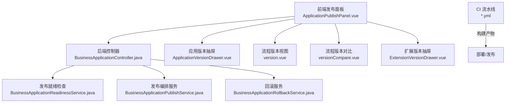
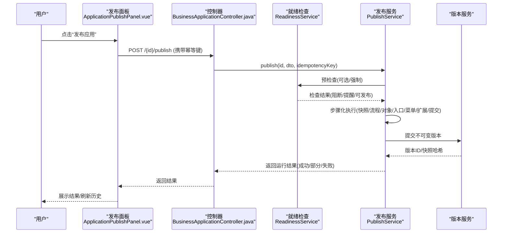
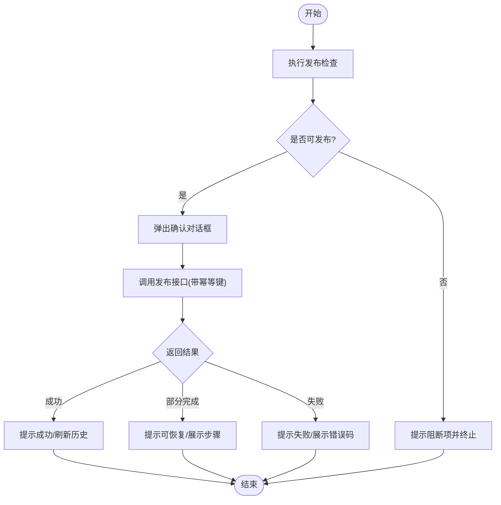
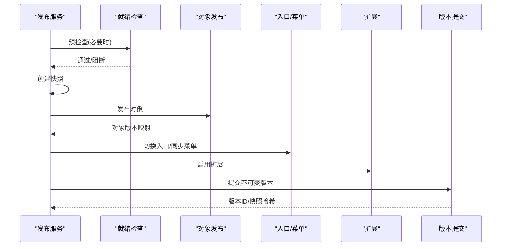
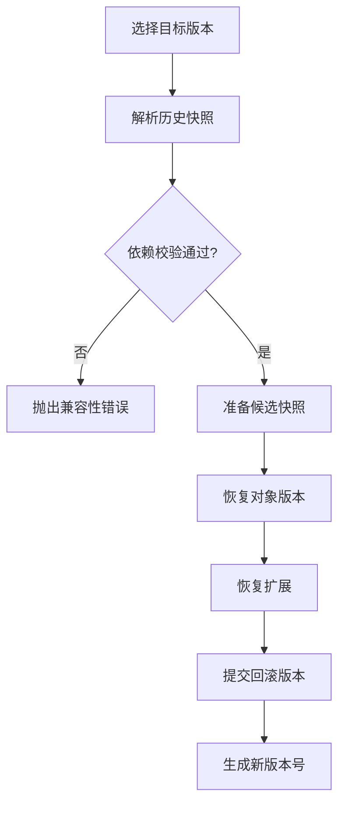
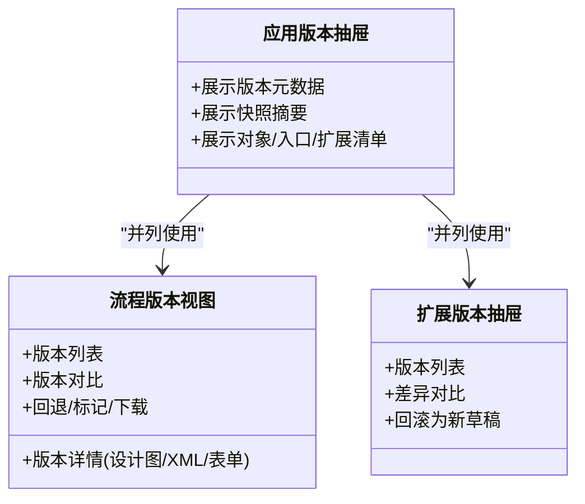
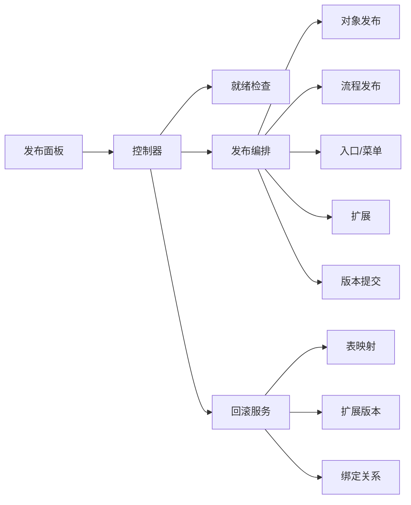

# 应用发布

<cite>
**本文引用的文件**
- [ApplicationPublishPanel.vue](file://forge-admin-ui/src/views/app-center/application-workspace/ApplicationPublishPanel.vue)
- [BusinessApplicationController.java](file://forge-server/forge-framework/forge-plugin-parent/forge-plugin-generator/src/main/java/com/mdframe/forge/plugin/generator/controller/BusinessApplicationController.java)
- [BusinessApplicationPublishService.java](file://forge-server/forge-framework/forge-plugin-parent/forge-plugin-generator/src/main/java/com/mdframe/forge/plugin/generator/service/businessapp/BusinessApplicationPublishService.java)
- [BusinessApplicationReadinessService.java](file://forge-server/forge-framework/forge-plugin-parent/forge-plugin-generator/src/main/java/com/mdframe/forge/plugin/generator/service/businessapp/BusinessApplicationReadinessService.java)
- [BusinessApplicationRollbackService.java](file://forge-server/forge-framework/forge-plugin-parent/forge-plugin-generator/src/main/java/com/mdframe/forge/plugin/generator/service/businessapp/BusinessApplicationRollbackService.java)
- [ApplicationVersionDrawer.vue](file://forge-admin-ui/src/views/app-center/application-workspace/ApplicationVersionDrawer.vue)
- [version.vue](file://forge-admin-ui/src/views/flow/version.vue)
- [versionCompare.vue](file://forge-admin-ui/src/views/flow/versionCompare.vue)
- [ExtensionVersionDrawer.vue](file://forge-admin-ui/src/views/app-center/application-workspace/ExtensionVersionDrawer.vue)
- [branch-pipeline.yml](file://forge-report-ui/.workflow/branch-pipeline.yml)
- [master-pipeline.yml](file://forge-report-ui/.workflow/master-pipeline.yml)
- [pr-pipeline.yml](file://forge-report-ui/.workflow/pr-pipeline.yml)
</cite>

## 目录
1. [简介](#简介)
2. [项目结构](#项目结构)
3. [核心组件](#核心组件)
4. [架构总览](#架构总览)
5. [详细组件分析](#详细组件分析)
6. [依赖关系分析](#依赖关系分析)
7. [性能与稳定性](#性能与稳定性)
8. [故障排查指南](#故障排查指南)
9. [最佳实践](#最佳实践)
10. [结论](#结论)

## 简介
本文件面向“应用发布”能力，覆盖从版本管理、依赖检查、构建打包到部署上线的完整链路；说明发布面板的使用方法（发布配置、环境选择、灰度发布等高级特性）；解释版本抽屉的功能（版本对比、回滚操作、历史查看）；并提供企业级发布策略（自动化发布、持续集成、蓝绿部署）、故障排查与性能优化建议。

## 项目结构
围绕应用发布的前后端关键位置如下：
- 前端发布面板：位于应用工作区，提供发布检查、发布执行、运行记录、版本详情与回滚入口。
- 后端发布服务：提供发布预检查、协调发布、版本快照、步骤化推进与失败恢复。
- 流程版本管理：提供版本列表、详情、对比、回退与标记能力。
- 扩展版本管理：提供版本差异对比与基于历史版本的草稿生成（回滚为草稿）。
- 持续集成流水线：提供分支、PR、主干的构建与制品发布流程。

**图表来源**
- [ApplicationPublishPanel.vue:1-120](file://forge-admin-ui/src/views/app-center/application-workspace/ApplicationPublishPanel.vue#L1-L120)
- [BusinessApplicationController.java:395-419](file://forge-server/forge-framework/forge-plugin-parent/forge-plugin-generator/src/main/java/com/mdframe/forge/plugin/generator/controller/BusinessApplicationController.java#L395-L419)
- [BusinessApplicationReadinessService.java:69-92](file://forge-server/forge-framework/forge-plugin-parent/forge-plugin-generator/src/main/java/com/mdframe/forge/plugin/generator/service/businessapp/BusinessApplicationReadinessService.java#L69-L92)
- [BusinessApplicationPublishService.java:115-181](file://forge-server/forge-framework/forge-plugin-parent/forge-plugin-generator/src/main/java/com/mdframe/forge/plugin/generator/service/businessapp/BusinessApplicationPublishService.java#L115-L181)
- [BusinessApplicationRollbackService.java:63-168](file://forge-server/forge-framework/forge-plugin-parent/forge-plugin-generator/src/main/java/com/mdframe/forge/plugin/generator/service/businessapp/BusinessApplicationRollbackService.java#L63-L168)

**章节来源**
- [ApplicationPublishPanel.vue:1-120](file://forge-admin-ui/src/views/app-center/application-workspace/ApplicationPublishPanel.vue#L1-L120)
- [BusinessApplicationController.java:395-419](file://forge-server/forge-framework/forge-plugin-parent/forge-plugin-generator/src/main/java/com/mdframe/forge/plugin/generator/controller/BusinessApplicationController.java#L395-L419)

## 核心组件
- 发布检查与状态展示：支持“阻断/提醒/可发布”三类结果，并自动提示依赖补齐信息。
- 发布编排：按步骤推进（预检查、快照、业务流程、业务对象、页面入口、菜单同步、扩展启用、提交版本），支持部分成功后的恢复继续。
- 版本抽屉：展示不可变版本元数据、快照摘要与资产清单（对象、入口、扩展）。
- 流程版本管理：版本列表、详情（设计图/XML/表单）、对比、回退、标记、下载。
- 扩展版本抽屉：版本列表、差异对比、回滚为新草稿。
- 持续集成：分支/PR/主干三套流水线，统一构建与制品发布。

**章节来源**
- [ApplicationPublishPanel.vue:18-114](file://forge-admin-ui/src/views/app-center/application-workspace/ApplicationPublishPanel.vue#L18-L114)
- [ApplicationVersionDrawer.vue:1-64](file://forge-admin-ui/src/views/app-center/application-workspace/ApplicationVersionDrawer.vue#L1-L64)
- [version.vue:1-187](file://forge-admin-ui/src/views/flow/version.vue#L1-L187)
- [versionCompare.vue:1-83](file://forge-admin-ui/src/views/flow/versionCompare.vue#L1-L83)
- [ExtensionVersionDrawer.vue:1-62](file://forge-admin-ui/src/views/app-center/application-workspace/ExtensionVersionDrawer.vue#L1-L62)
- [branch-pipeline.yml:1-51](file://forge-report-ui/.workflow/branch-pipeline.yml#L1-L51)
- [master-pipeline.yml:1-49](file://forge-report-ui/.workflow/master-pipeline.yml#L1-L49)
- [pr-pipeline.yml:1-36](file://forge-report-ui/.workflow/pr-pipeline.yml#L1-L36)

## 架构总览
发布链路从前端的“发布检查/发布/回滚”动作出发，经控制器路由到服务层，由就绪检查评估风险，再由发布服务分步执行并发布不可变版本；回滚则基于历史快照生成新的回滚版本，不反向执行破坏性变更。

**图表来源**
- [BusinessApplicationController.java:395-419](file://forge-server/forge-framework/forge-plugin-parent/forge-plugin-generator/src/main/java/com/mdframe/forge/plugin/generator/controller/BusinessApplicationController.java#L395-L419)
- [BusinessApplicationReadinessService.java:69-92](file://forge-server/forge-framework/forge-plugin-parent/forge-plugin-generator/src/main/java/com/mdframe/forge/plugin/generator/service/businessapp/BusinessApplicationReadinessService.java#L69-L92)
- [BusinessApplicationPublishService.java:115-181](file://forge-server/forge-framework/forge-plugin-parent/forge-plugin-generator/src/main/java/com/mdframe/forge/plugin/generator/service/businessapp/BusinessApplicationPublishService.java#L115-L181)
- [ApplicationPublishPanel.vue:258-337](file://forge-admin-ui/src/views/app-center/application-workspace/ApplicationPublishPanel.vue#L258-L337)

## 详细组件分析

### 发布面板（ApplicationPublishPanel）
- 功能要点
  - 发布检查：显示阻断项与提醒项，支持重新检查；若存在阻断项将阻止发布。
  - 发布执行：调用发布接口，使用幂等键避免重复提交；成功后触发事件并刷新历史。
  - 运行记录：展示各次运行的目标版本、类型、当前步骤、尝试次数；支持“恢复”从失败点继续。
  - 版本列表：展示不可变版本、状态、发布时间与摘要；支持查看详情与回滚。
  - 错误处理：对超时、网络异常等进行友好提示，避免误导用户重复发布。
- 交互流程
  - 准备发布 → 确认弹窗 → 发起发布 → 处理结果 → 刷新历史。

**图表来源**
- [ApplicationPublishPanel.vue:226-337](file://forge-admin-ui/src/views/app-center/application-workspace/ApplicationPublishPanel.vue#L226-L337)

**章节来源**
- [ApplicationPublishPanel.vue:18-114](file://forge-admin-ui/src/views/app-center/application-workspace/ApplicationPublishPanel.vue#L18-L114)
- [ApplicationPublishPanel.vue:226-337](file://forge-admin-ui/src/views/app-center/application-workspace/ApplicationPublishPanel.vue#L226-L337)

### 后端发布编排（PublishService）
- 步骤化发布
  - 预检查：必要时强制重新检查，依据就绪检查结果决定是否继续。
  - 快照：固化本次发布的上下文与资产选择。
  - 业务流程：固定流程版本并更新快照。
  - 业务对象：发布对象并更新已发布对象映射。
  - 页面入口/菜单：切换入口并同步菜单。
  - 扩展：启用业务扩展。
  - 提交：提交不可变应用版本。
- 失败恢复：每步完成后持久化快照，失败后可从失败步骤恢复继续执行。

**图表来源**
- [BusinessApplicationPublishService.java:115-181](file://forge-server/forge-framework/forge-plugin-parent/forge-plugin-generator/src/main/java/com/mdframe/forge/plugin/generator/service/businessapp/BusinessApplicationPublishService.java#L115-L181)
- [BusinessApplicationReadinessService.java:69-92](file://forge-server/forge-framework/forge-plugin-parent/forge-plugin-generator/src/main/java/com/mdframe/forge/plugin/generator/service/businessapp/BusinessApplicationReadinessService.java#L69-L92)

**章节来源**
- [BusinessApplicationPublishService.java:115-181](file://forge-server/forge-framework/forge-plugin-parent/forge-plugin-generator/src/main/java/com/mdframe/forge/plugin/generator/service/businessapp/BusinessApplicationPublishService.java#L115-L181)

### 回滚机制（RollbackService）
- 安全约束
  - 不回滚破坏性 DDL 或业务数据；仅恢复设计与运行配置。
  - 校验历史版本依赖的表/字段/扩展/挂接是否存在，否则拒绝回滚。
- 执行路径
  - 解析历史快照 → 准备候选快照 → 恢复对象版本 → 恢复扩展 → 提交新的回滚版本。
- 界面联动
  - 应用工作台支持对非最新版本进行回滚；流程与扩展也提供各自回滚/草稿生成能力。

**图表来源**
- [BusinessApplicationRollbackService.java:63-168](file://forge-server/forge-framework/forge-plugin-parent/forge-plugin-generator/src/main/java/com/mdframe/forge/plugin/generator/service/businessapp/BusinessApplicationRollbackService.java#L63-L168)
- [BusinessApplicationRollbackService.java:186-248](file://forge-server/forge-framework/forge-plugin-parent/forge-plugin-generator/src/main/java/com/mdframe/forge/plugin/generator/service/businessapp/BusinessApplicationRollbackService.java#L186-L248)

**章节来源**
- [BusinessApplicationRollbackService.java:63-168](file://forge-server/forge-framework/forge-plugin-parent/forge-plugin-generator/src/main/java/com/mdframe/forge/plugin/generator/service/businessapp/BusinessApplicationRollbackService.java#L63-L168)
- [BusinessApplicationRollbackService.java:186-248](file://forge-server/forge-framework/forge-plugin-parent/forge-plugin-generator/src/main/java/com/mdframe/forge/plugin/generator/service/businessapp/BusinessApplicationRollbackService.java#L186-L248)

### 版本抽屉与流程版本管理
- 应用版本抽屉：展示版本状态、时间、发布人、快照哈希，以及对象/入口/扩展清单；对回滚版本给出明确提示。
- 流程版本视图：版本列表、详情（设计图、BPMN XML、表单配置）、版本对比、回退、标记、下载。
- 扩展版本抽屉：版本列表、差异对比、回滚为新草稿（生成新草稿而不覆盖历史）。

**图表来源**
- [ApplicationVersionDrawer.vue:1-64](file://forge-admin-ui/src/views/app-center/application-workspace/ApplicationVersionDrawer.vue#L1-L64)
- [version.vue:1-187](file://forge-admin-ui/src/views/flow/version.vue#L1-L187)
- [versionCompare.vue:1-83](file://forge-admin-ui/src/views/flow/versionCompare.vue#L1-L83)
- [ExtensionVersionDrawer.vue:1-62](file://forge-admin-ui/src/views/app-center/application-workspace/ExtensionVersionDrawer.vue#L1-L62)

**章节来源**
- [ApplicationVersionDrawer.vue:1-64](file://forge-admin-ui/src/views/app-center/application-workspace/ApplicationVersionDrawer.vue#L1-L64)
- [version.vue:1-187](file://forge-admin-ui/src/views/flow/version.vue#L1-L187)
- [versionCompare.vue:1-83](file://forge-admin-ui/src/views/flow/versionCompare.vue#L1-L83)
- [ExtensionVersionDrawer.vue:1-62](file://forge-admin-ui/src/views/app-center/application-workspace/ExtensionVersionDrawer.vue#L1-L62)

### 持续集成与构建打包
- 分支流水线：Node 构建 → 上传制品 → 可选发布制品。
- PR 流水线：用于合并前验证，构建并暂存制品。
- 主干流水线：构建 → 制品发布，支持版本号自增。
- 建议：在发布前增加质量门禁（静态扫描、单元测试、集成测试、制品签名），并在发布阶段引入环境参数注入与灰度开关。

**章节来源**
- [branch-pipeline.yml:1-51](file://forge-report-ui/.workflow/branch-pipeline.yml#L1-L51)
- [pr-pipeline.yml:1-36](file://forge-report-ui/.workflow/pr-pipeline.yml#L1-L36)
- [master-pipeline.yml:1-49](file://forge-report-ui/.workflow/master-pipeline.yml#L1-L49)

## 依赖关系分析
- 前端依赖
  - 发布面板依赖后端发布/检查/版本/回滚接口。
  - 版本抽屉依赖版本详情接口。
  - 流程版本视图依赖版本列表/详情/对比/回退/下载接口。
- 后端依赖
  - 控制器依赖就绪检查、发布编排、回滚服务。
  - 发布编排依赖对象发布、流程发布、入口/菜单发布、扩展发布、版本提交。
  - 回滚服务依赖对象版本、表映射、扩展版本、绑定关系等。

**图表来源**
- [BusinessApplicationController.java:395-419](file://forge-server/forge-framework/forge-plugin-parent/forge-plugin-generator/src/main/java/com/mdframe/forge/plugin/generator/controller/BusinessApplicationController.java#L395-L419)
- [BusinessApplicationPublishService.java:115-181](file://forge-server/forge-framework/forge-plugin-parent/forge-plugin-generator/src/main/java/com/mdframe/forge/plugin/generator/service/businessapp/BusinessApplicationPublishService.java#L115-L181)
- [BusinessApplicationRollbackService.java:63-168](file://forge-server/forge-framework/forge-plugin-parent/forge-plugin-generator/src/main/java/com/mdframe/forge/plugin/generator/service/businessapp/BusinessApplicationRollbackService.java#L63-L168)

**章节来源**
- [BusinessApplicationController.java:395-419](file://forge-server/forge-framework/forge-plugin-parent/forge-plugin-generator/src/main/java/com/mdframe/forge/plugin/generator/controller/BusinessApplicationController.java#L395-L419)
- [BusinessApplicationPublishService.java:115-181](file://forge-server/forge-framework/forge-plugin-parent/forge-plugin-generator/src/main/java/com/mdframe/forge/plugin/generator/service/businessapp/BusinessApplicationPublishService.java#L115-L181)
- [BusinessApplicationRollbackService.java:63-168](file://forge-server/forge-framework/forge-plugin-parent/forge-plugin-generator/src/main/java/com/mdframe/forge/plugin/generator/service/businessapp/BusinessApplicationRollbackService.java#L63-L168)

## 性能与稳定性
- 幂等发布：前端为每次发布请求生成唯一幂等键，避免重复提交导致的多份运行记录。
- 步骤化与快照：每步完成后持久化快照，失败可恢复，降低长耗时任务的风险。
- 轻量加载：发布历史采用轻量加载策略，减少首屏压力。
- 超时与重试：对超时场景给出明确提示，避免用户误触重复发布。
- 建议
  - 在 CI 中缓存依赖与构建产物，缩短构建时间。
  - 对大对象/流程发布拆分批次，结合灰度逐步放量。
  - 对版本对比与详情查询增加分页与懒加载。

**章节来源**
- [ApplicationPublishPanel.vue:276-337](file://forge-admin-ui/src/views/app-center/application-workspace/ApplicationPublishPanel.vue#L276-L337)
- [BusinessApplicationPublishService.java:115-181](file://forge-server/forge-framework/forge-plugin-parent/forge-plugin-generator/src/main/java/com/mdframe/forge/plugin/generator/service/businessapp/BusinessApplicationPublishService.java#L115-L181)

## 故障排查指南
- 发布被阻断
  - 现象：发布检查返回“阻断”，无法发布。
  - 处理：根据阻断项定位问题（如依赖缺失、权限不足、对象未发布），修复后重新检查并发布。
- 发布部分完成
  - 现象：运行记录显示“部分完成”，可从失败步骤恢复。
  - 处理：点击“恢复”，系统会从失败步骤继续执行；若仍失败，查看错误码与日志。
- 发布超时
  - 现象：前端提示超时，但后台可能仍在处理。
  - 处理：刷新发布记录确认结果，不要连续重复发布。
- 回滚失败
  - 现象：回滚时报错“历史版本依赖不存在”。
  - 处理：检查物理表、字段、扩展版本、应用挂接是否存在；确保依赖完整后再试。
- 流程版本回退
  - 现象：回退后正在运行的实例仍按旧版本执行。
  - 处理：确认新版本的生效范围与实例迁移策略，必要时重启相关服务。

**章节来源**
- [ApplicationPublishPanel.vue:299-337](file://forge-admin-ui/src/views/app-center/application-workspace/ApplicationPublishPanel.vue#L299-L337)
- [BusinessApplicationRollbackService.java:186-248](file://forge-server/forge-framework/forge-plugin-parent/forge-plugin-generator/src/main/java/com/mdframe/forge/plugin/generator/service/businessapp/BusinessApplicationRollbackService.java#L186-L248)

## 最佳实践
- 自动化发布
  - 在 CI 中完成构建、测试、制品归档；在主干合并后触发发布流水线。
  - 使用环境变量注入不同环境的配置，避免硬编码。
- 持续集成
  - 分支流水线用于日常开发验证；PR 流水线用于合并前质量门禁；主干流水线用于正式发布。
  - 制品命名规范包含版本号与构建号，便于追溯。
- 灰度发布
  - 先向小流量用户开放新版本，观察指标（错误率、延迟、资源占用）后再全量。
  - 结合发布检查中的“提醒”项，提前发现潜在风险。
- 蓝绿部署
  - 维护两套相同环境，通过网关/路由切换流量；发布新版本至绿色环境，验证通过后切流。
  - 配合版本抽屉快速回滚到上一个稳定版本。
- 版本管理
  - 所有发布均生成不可变版本，保留快照与摘要，便于审计与回溯。
  - 对重要版本打标签，便于检索与对比。
- 回滚策略
  - 优先回滚到最近稳定版本；回滚只恢复设计与运行配置，不反向执行破坏性变更。
  - 对流程与扩展分别提供回滚/草稿能力，降低影响面。

[本节为通用指导，不直接引用具体代码文件]

## 结论
本方案以“检查—编排—快照—提交”为核心，实现了可观测、可恢复、可回滚的应用发布体系。前端提供直观的发布面板与版本管理能力，后端通过步骤化服务保证复杂发布的可靠性。结合 CI 流水线与灰度/蓝绿策略，可满足企业级发布的质量与效率要求。