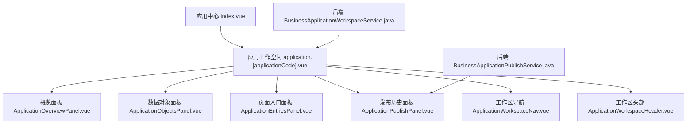
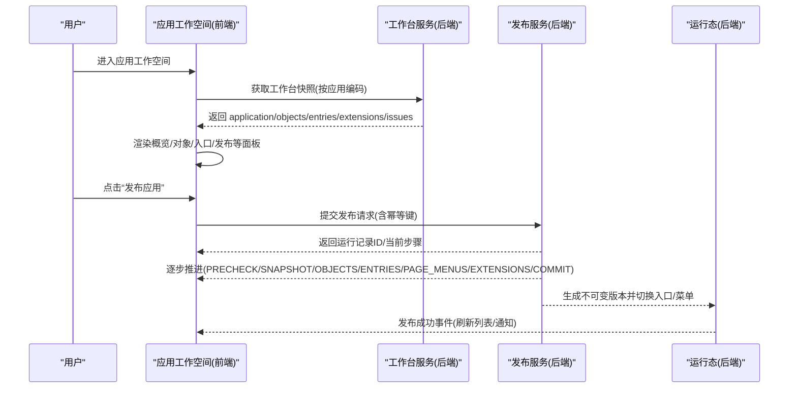
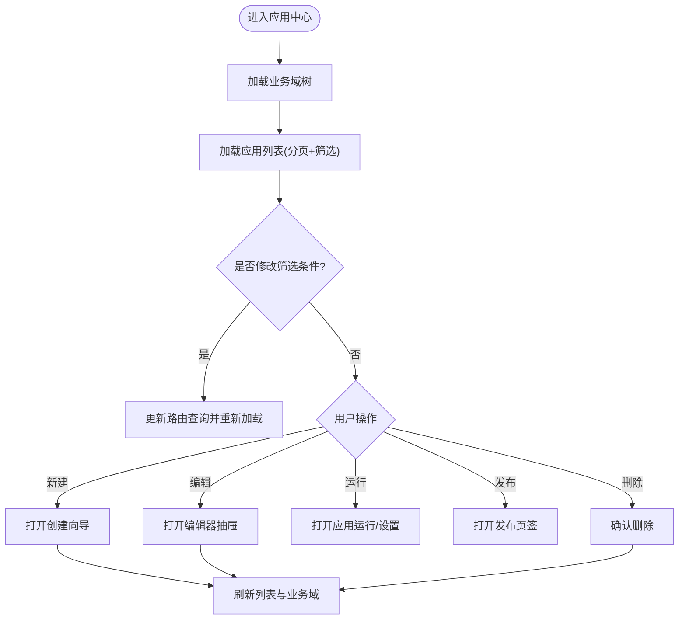
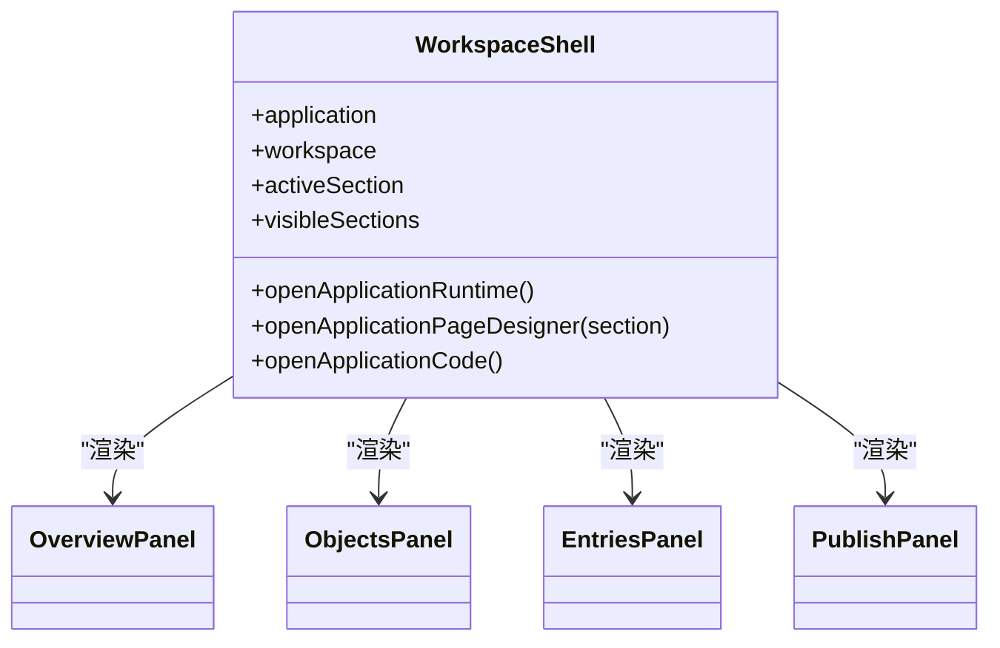
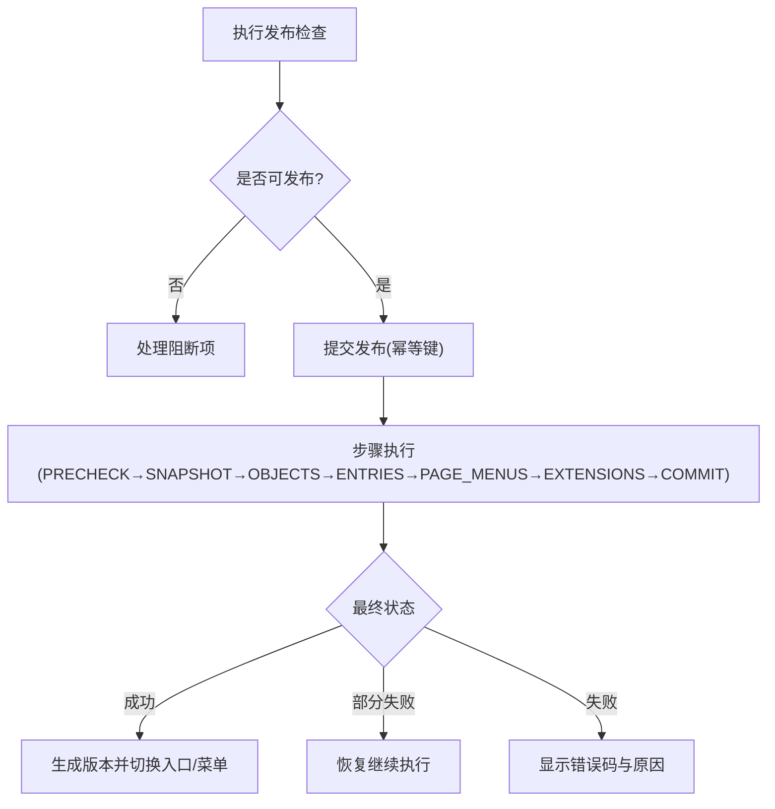
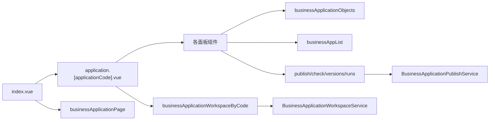

# 应用工作空间

<cite>
**本文引用的文件**
- [application.[applicationCode].vue](file://forge-admin-ui/src/views/app-center/application.[applicationCode].vue)
- [index.vue](file://forge-admin-ui/src/views/app-center/index.vue)
- [ApplicationOverviewPanel.vue](file://forge-admin-ui/src/views/app-center/application-workspace/ApplicationOverviewPanel.vue)
- [ApplicationObjectsPanel.vue](file://forge-admin-ui/src/views/app-center/application-workspace/ApplicationObjectsPanel.vue)
- [ApplicationEntriesPanel.vue](file://forge-admin-ui/src/views/app-center/application-workspace/ApplicationEntriesPanel.vue)
- [ApplicationPublishPanel.vue](file://forge-admin-ui/src/views/app-center/application-workspace/ApplicationPublishPanel.vue)
- [ApplicationWorkspaceHeader.vue](file://forge-admin-ui/src/views/app-center/application-workspace/ApplicationWorkspaceHeader.vue)
- [ApplicationWorkspaceNav.vue](file://forge-admin-ui/src/views/app-center/application-workspace/ApplicationWorkspaceNav.vue)
- [BusinessApplicationWorkspaceService.java](file://forge-server/forge-framework/forge-plugin-parent/forge-plugin-generator/src/main/java/com/mdframe/forge/plugin/generator/service/businessapp/BusinessApplicationWorkspaceService.java)
- [BusinessApplicationPublishService.java](file://forge-server/forge-framework/forge-plugin-parent/forge-plugin-generator/src/main/java/com/mdframe/forge/plugin/generator/service/businessapp/BusinessApplicationPublishService.java)
- [BusinessApplicationPublishRunService.java](file://forge-server/forge-framework/forge-plugin-parent/forge-plugin-generator/src/main/java/com/mdframe/forge/plugin/generator/service/businessapp/BusinessApplicationPublishRunService.java)
- [application-runtime.[applicationCode].vue](file://forge-admin-ui/src/views/app-center/application-runtime.[applicationCode].vue)
- [application-publish.[applicationCode].vue](file://forge-admin-ui/src/views/app-center/application-publish.[applicationCode].vue)
- [access-control.js](file://forge-h5-ui/src/utils/access-control.js)
- [application-permission-utils.js](file://forge-admin-ui/src/views/app-center/application-permission-utils.js)
</cite>

## 目录
1. [简介](#简介)
2. [项目结构](#项目结构)
3. [核心组件](#核心组件)
4. [架构总览](#架构总览)
5. [详细组件分析](#详细组件分析)
6. [依赖关系分析](#依赖关系分析)
7. [性能与体验优化](#性能与体验优化)
8. [故障排查指南](#故障排查指南)
9. [结论](#结论)
10. [附录：操作手册与最佳实践](#附录操作手册与最佳实践)

## 简介
本文件为 Forge Admin 的“应用工作空间”提供完整、可操作的文档。内容覆盖界面布局、功能模块、交互流程，以及企业级业务应用的创建、编辑、发布、运行等全生命周期管理。重点说明：
- 应用列表展示、筛选过滤、分页查询
- 业务域树形结构管理
- 应用状态管理与发布版本控制
- 权限控制机制（角色授权、数据范围、页面可见性）
- 工作流指导与最佳实践

## 项目结构
应用工作空间由前端视图与后端服务共同构成：
- 前端视图层：应用中心入口、应用工作空间容器、各功能面板（概览、对象、入口、发布等）
- 后端服务层：工作台快照聚合、发布编排、运行态快照与权限过滤

图表来源
- [index.vue:1-235](file://forge-admin-ui/src/views/app-center/index.vue#L1-L235)
- [application.[applicationCode].vue:1-84](file://forge-admin-ui/src/views/app-center/application.[applicationCode].vue#L1-L84)
- [ApplicationOverviewPanel.vue:1-68](file://forge-admin-ui/src/views/app-center/application-workspace/ApplicationOverviewPanel.vue#L1-L68)
- [ApplicationObjectsPanel.vue:1-108](file://forge-admin-ui/src/views/app-center/application-workspace/ApplicationObjectsPanel.vue#L1-L108)
- [ApplicationEntriesPanel.vue:1-68](file://forge-admin-ui/src/views/app-center/application-workspace/ApplicationEntriesPanel.vue#L1-L68)
- [ApplicationPublishPanel.vue:1-139](file://forge-admin-ui/src/views/app-center/application-workspace/ApplicationPublishPanel.vue#L1-L139)
- [ApplicationWorkspaceNav.vue:1-53](file://forge-admin-ui/src/views/app-center/application-workspace/ApplicationWorkspaceNav.vue#L1-L53)
- [ApplicationWorkspaceHeader.vue:73-123](file://forge-admin-ui/src/views/app-center/application-workspace/ApplicationWorkspaceHeader.vue#L73-L123)
- [BusinessApplicationWorkspaceService.java:67-86](file://forge-server/forge-framework/forge-plugin-parent/forge-plugin-generator/src/main/java/com/mdframe/forge/plugin/generator/service/businessapp/BusinessApplicationWorkspaceService.java#L67-L86)
- [BusinessApplicationPublishService.java:115-199](file://forge-server/forge-framework/forge-plugin-parent/forge-plugin-generator/src/main/java/com/mdframe/forge/plugin/generator/service/businessapp/BusinessApplicationPublishService.java#L115-L199)

章节来源
- [index.vue:1-235](file://forge-admin-ui/src/views/app-center/index.vue#L1-L235)
- [application.[applicationCode].vue:1-84](file://forge-admin-ui/src/views/app-center/application.[applicationCode].vue#L1-L84)

## 核心组件
- 应用中心（应用列表、业务域树、筛选与分页）
- 应用工作空间容器（路由驱动的面板切换、能力引导、运行时跳转）
- 概览面板（配置进度、待处理事项、就绪度提示）
- 数据对象面板（对象绑定、角色分配、同步状态、设计器联动）
- 页面入口面板（入口增删改查、启用停用、打开与设计器联动）
- 发布历史面板（发布检查、版本与运行记录、回滚与恢复）
- 工作区导航与头部（分区导航、就绪度、快捷操作）

章节来源
- [ApplicationOverviewPanel.vue:1-292](file://forge-admin-ui/src/views/app-center/application-workspace/ApplicationOverviewPanel.vue#L1-L292)
- [ApplicationObjectsPanel.vue:1-553](file://forge-admin-ui/src/views/app-center/application-workspace/ApplicationObjectsPanel.vue#L1-L553)
- [ApplicationEntriesPanel.vue:1-370](file://forge-admin-ui/src/views/app-center/application-workspace/ApplicationEntriesPanel.vue#L1-L370)
- [ApplicationPublishPanel.vue:1-729](file://forge-admin-ui/src/views/app-center/application-workspace/ApplicationPublishPanel.vue#L1-L729)
- [ApplicationWorkspaceNav.vue:1-53](file://forge-admin-ui/src/views/app-center/application-workspace/ApplicationWorkspaceNav.vue#L1-L53)
- [ApplicationWorkspaceHeader.vue:73-123](file://forge-admin-ui/src/views/app-center/application-workspace/ApplicationWorkspaceHeader.vue#L73-L123)

## 架构总览
应用工作空间采用“前端多面板 + 后端工作台快照 + 发布编排”的分层架构：
- 前端通过路由参数选择面板，按需加载并渲染；KeepAlive 缓存提升切换体验
- 后端聚合应用元信息、对象、入口、扩展、问题清单，形成“工作台快照”，供前端统一消费
- 发布流程以步骤化编排执行，支持部分失败恢复与不可变版本回滚

图表来源
- [application.[applicationCode].vue:209-241](file://forge-admin-ui/src/views/app-center/application.[applicationCode].vue#L209-L241)
- [ApplicationPublishPanel.vue:226-297](file://forge-admin-ui/src/views/app-center/application-workspace/ApplicationPublishPanel.vue#L226-L297)
- [BusinessApplicationPublishService.java:115-199](file://forge-server/forge-framework/forge-plugin-parent/forge-plugin-generator/src/main/java/com/mdframe/forge/plugin/generator/service/businessapp/BusinessApplicationPublishService.java#L115-L199)
- [BusinessApplicationPublishRunService.java:159-180](file://forge-server/forge-framework/forge-plugin-parent/forge-plugin-generator/src/main/java/com/mdframe/forge/plugin/generator/service/businessapp/BusinessApplicationPublishRunService.java#L159-L180)

## 详细组件分析

### 应用中心（应用列表、业务域树、筛选与分页）
- 左侧业务域树：支持展开/收起、统计汇总、新增/编辑/启用/停用/删除
- 右侧应用列表：支持“我的应用/市场”切换、“我创建的/我有权限的/最近使用”范围筛选、关键词搜索、套件/设计状态/运行状态过滤
- 分页：页码与每页条数变更时同步到路由查询，保证可分享与可回溯
- 新建应用：支持空白模板或已有模板，交付模式可选在线或源码

图表来源
- [index.vue:432-466](file://forge-admin-ui/src/views/app-center/index.vue#L432-L466)
- [index.vue:486-519](file://forge-admin-ui/src/views/app-center/index.vue#L486-L519)
- [index.vue:521-618](file://forge-admin-ui/src/views/app-center/index.vue#L521-L618)

章节来源
- [index.vue:1-800](file://forge-admin-ui/src/views/app-center/index.vue#L1-L800)

### 应用工作空间容器（路由驱动的面板切换）
- 顶部头部：显示应用名称、就绪度、刷新、打开设计器/运行/代码面板、发布入口
- 左侧导航：根据后端返回的 sections 动态渲染，支持问题计数与资产数量提示
- 主内容区：基于 KeepAlive 缓存的面板切换，支持“设计器归属能力”的引导跳转
- 运行时跳转：优先使用已配置的首页或首个可用入口，否则提示先配置

图表来源
- [application.[applicationCode].vue:1-84](file://forge-admin-ui/src/views/app-center/application.[applicationCode].vue#L1-L84)
- [application.[applicationCode].vue:141-204](file://forge-admin-ui/src/views/app-center/application.[applicationCode].vue#L141-L204)
- [ApplicationWorkspaceNav.vue:1-53](file://forge-admin-ui/src/views/app-center/application-workspace/ApplicationWorkspaceNav.vue#L1-L53)
- [ApplicationWorkspaceHeader.vue:73-123](file://forge-admin-ui/src/views/app-center/application-workspace/ApplicationWorkspaceHeader.vue#L73-L123)

章节来源
- [application.[applicationCode].vue:1-535](file://forge-admin-ui/src/views/app-center/application.[applicationCode].vue#L1-L535)

### 概览面板（配置进度与待处理事项）
- 配置进度：列出各分区（对象、入口、自动化、增强、权限、发布历史），展示资产数与问题数
- 待处理事项：按阻断/提醒分类，点击可直接跳转到对应分区处理
- 就绪度：根据阻断/提醒数量给出“就绪/提醒/阻断”三种状态

章节来源
- [ApplicationOverviewPanel.vue:1-292](file://forge-admin-ui/src/views/app-center/application-workspace/ApplicationOverviewPanel.vue#L1-L292)

### 数据对象面板（对象绑定与角色管理）
- 支持从数据库导入、关联已有对象、新建空白对象
- 对象在应用内可设置 PRIMARY/SHARED 角色，影响默认行为与排序
- 显示数据源/物理表、结构同步状态（同步中/失败/未同步/缺失表等）
- 一键跳转对象设计器进行字段/表单/详情配置

章节来源
- [ApplicationObjectsPanel.vue:1-553](file://forge-admin-ui/src/views/app-center/application-workspace/ApplicationObjectsPanel.vue#L1-L553)

### 页面入口面板（访问入口管理）
- 集中管理表单、列表、详情、外部页面和移动端等入口
- 支持启用/停用、打开运行、进入设计器、编辑与删除
- 入口打开逻辑：若未关联可运行页面，提示先发布业务单元

章节来源
- [ApplicationEntriesPanel.vue:1-370](file://forge-admin-ui/src/views/app-center/application-workspace/ApplicationEntriesPanel.vue#L1-L370)

### 发布历史面板（检查、版本与运行记录）
- 发布检查：可提前执行检查，展示阻断/提醒项与自动补齐依赖提示
- 版本管理：不可变版本列表，支持查看详情与回滚（生成新版本）
- 运行记录：分步执行状态，支持查看步骤、失败恢复
- 幂等与容错：发布请求带幂等键，超时或失败有友好提示

图表来源
- [ApplicationPublishPanel.vue:226-397](file://forge-admin-ui/src/views/app-center/application-workspace/ApplicationPublishPanel.vue#L226-L397)
- [BusinessApplicationPublishService.java:115-199](file://forge-server/forge-framework/forge-plugin-parent/forge-plugin-generator/src/main/java/com/mdframe/forge/plugin/generator/service/businessapp/BusinessApplicationPublishService.java#L115-L199)
- [BusinessApplicationPublishRunService.java:159-180](file://forge-server/forge-framework/forge-plugin-parent/forge-plugin-generator/src/main/java/com/mdframe/forge/plugin/generator/service/businessapp/BusinessApplicationPublishRunService.java#L159-L180)

章节来源
- [ApplicationPublishPanel.vue:1-729](file://forge-admin-ui/src/views/app-center/application-workspace/ApplicationPublishPanel.vue#L1-L729)

### 权限控制机制
- 角色综合授权：支持资源ID、模块数据范围等维度授权
- 运行态权限过滤：正式运行接口仅返回已启用且具备权限的应用与页面，无权页面从导航与页面定义中移除
- 模式匹配：支持通配符模式匹配权限标识，便于批量授权

章节来源
- [application-permission-utils.js:1-59](file://forge-admin-ui/src/views/app-center/application-permission-utils.js#L1-L59)
- [access-control.js:51-64](file://forge-h5-ui/src/utils/access-control.js#L51-L64)
- [application-runtime.[applicationCode].vue:4465-4512](file://forge-admin-ui/src/views/app-center/application-runtime.[applicationCode].vue#L4465-L4512)

## 依赖关系分析
- 前端依赖：
  - 路由与状态：Vue Router、响应式状态、KeepAlive 缓存
  - UI 组件：Naive UI、图标库、字典标签/选择器等
  - API 调用：应用工作台、对象、入口、发布、版本、运行记录等
- 后端依赖：
  - 工作台快照：聚合应用、对象、入口、扩展、问题清单
  - 发布编排：步骤化执行、快照持久化、菜单与入口切换、扩展启用
  - 运行态：基于发布快照的只读视图与权限过滤

图表来源
- [index.vue:432-466](file://forge-admin-ui/src/views/app-center/index.vue#L432-L466)
- [application.[applicationCode].vue:209-241](file://forge-admin-ui/src/views/app-center/application.[applicationCode].vue#L209-L241)
- [ApplicationObjectsPanel.vue:188-214](file://forge-admin-ui/src/views/app-center/application-workspace/ApplicationObjectsPanel.vue#L188-L214)
- [ApplicationEntriesPanel.vue:132-143](file://forge-admin-ui/src/views/app-center/application-workspace/ApplicationEntriesPanel.vue#L132-L143)
- [ApplicationPublishPanel.vue:209-224](file://forge-admin-ui/src/views/app-center/application-workspace/ApplicationPublishPanel.vue#L209-L224)
- [BusinessApplicationWorkspaceService.java:67-86](file://forge-server/forge-framework/forge-plugin-parent/forge-plugin-generator/src/main/java/com/mdframe/forge/plugin/generator/service/businessapp/BusinessApplicationWorkspaceService.java#L67-L86)
- [BusinessApplicationPublishService.java:115-199](file://forge-server/forge-framework/forge-plugin-parent/forge-plugin-generator/src/main/java/com/mdframe/forge/plugin/generator/service/businessapp/BusinessApplicationPublishService.java#L115-L199)

章节来源
- [index.vue:432-466](file://forge-admin-ui/src/views/app-center/index.vue#L432-L466)
- [application.[applicationCode].vue:209-241](file://forge-admin-ui/src/views/app-center/application.[applicationCode].vue#L209-L241)

## 性能与体验优化
- 列表与分页
  - 将筛选、分页、视图状态同步到路由查询，避免重复请求与状态丢失
  - 使用防抖/节流减少频繁搜索带来的抖动（建议结合输入框实现）
- 工作区面板
  - 使用 KeepAlive 缓存活跃面板，减少重复渲染与数据加载
  - 懒加载非首屏面板组件，降低首屏体积
- 发布流程
  - 幂等键防止重复提交；超时与部分失败场景提供恢复入口
  - 预检查前置阻断项定位，减少无效发布尝试
- 权限与运行态
  - 运行态基于发布快照，避免草稿对生产的影响
  - 权限过滤后保留必要父节点，确保导航可用性

[本节为通用优化建议，不直接引用具体文件]

## 故障排查指南
- 发布检查失败
  - 查看“发布检查”中的阻断项，逐项修复后再试
  - 若出现“自动补齐依赖”提示，按提示补齐后再检查
- 发布部分失败
  - 在“发布运行记录”中查看当前步骤，点击“恢复”继续执行
  - 查看步骤弹窗中的错误码与消息，定位失败环节
- 无法打开入口
  - 确认入口已启用且关联了可运行的页面配置
  - 若无首页，优先使用首个可用入口；否则提示先配置
- 权限导致页面不可见
  - 检查角色授权与数据范围配置
  - 运行态会基于权限过滤页面，必要时调整授权策略

章节来源
- [ApplicationPublishPanel.vue:226-397](file://forge-admin-ui/src/views/app-center/application-workspace/ApplicationPublishPanel.vue#L226-L397)
- [ApplicationEntriesPanel.vue:155-174](file://forge-admin-ui/src/views/app-center/application-workspace/ApplicationEntriesPanel.vue#L155-L174)
- [application-runtime.[applicationCode].vue:4465-4512](file://forge-admin-ui/src/views/app-center/application-runtime.[applicationCode].vue#L4465-L4512)

## 结论
应用工作空间围绕“工作台快照 + 面板化编辑 + 发布编排”构建，提供了从对象建模、入口编排、权限控制到发布运维的一站式能力。通过清晰的分区导航、就绪度提示与发布检查，帮助团队高效管理企业级业务应用，并在运行态保障安全与稳定。

[本节为总结性内容，不直接引用具体文件]

## 附录：操作手册与最佳实践

### 创建工作流
- 新建应用
  - 在应用中心点击“新建应用”，选择空白或模板，设置交付模式
  - 创建完成后自动进入应用工作空间或运行态（视交付模式而定）
- 配置数据对象
  - 在“数据对象”面板添加对象，设置角色与数据源
  - 通过“编辑字段”进入对象设计器完善字段、表单与详情
- 配置页面入口
  - 在“页面入口”面板新增入口，绑定对象或页面
  - 启用入口后可直接打开运行预览
- 发布与运行
  - 在“发布历史”面板执行发布检查，处理阻断项后发布
  - 发布成功后可在运行态验证效果，必要时回滚至历史版本

章节来源
- [index.vue:521-618](file://forge-admin-ui/src/views/app-center/index.vue#L521-L618)
- [ApplicationObjectsPanel.vue:221-271](file://forge-admin-ui/src/views/app-center/application-workspace/ApplicationObjectsPanel.vue#L221-L271)
- [ApplicationEntriesPanel.vue:145-181](file://forge-admin-ui/src/views/app-center/application-workspace/ApplicationEntriesPanel.vue#L145-L181)
- [ApplicationPublishPanel.vue:240-337](file://forge-admin-ui/src/views/app-center/application-workspace/ApplicationPublishPanel.vue#L240-L337)

### 权限与数据范围最佳实践
- 明确角色与资源边界，最小权限原则
- 使用模块数据范围控制数据可见性，避免越权访问
- 运行态严格基于发布快照，草稿与生产隔离

章节来源
- [application-permission-utils.js:1-59](file://forge-admin-ui/src/views/app-center/application-permission-utils.js#L1-L59)
- [access-control.js:51-64](file://forge-h5-ui/src/utils/access-control.js#L51-L64)

### 性能与体验优化建议
- 列表分页与路由同步，提升可分享性与可回溯性
- 面板懒加载与 KeepAlive 缓存，提升切换流畅度
- 发布前预检查与幂等提交，降低失败成本与重复风险
- 运行态权限过滤，保障生产环境安全与一致性

[本节为通用建议，不直接引用具体文件]