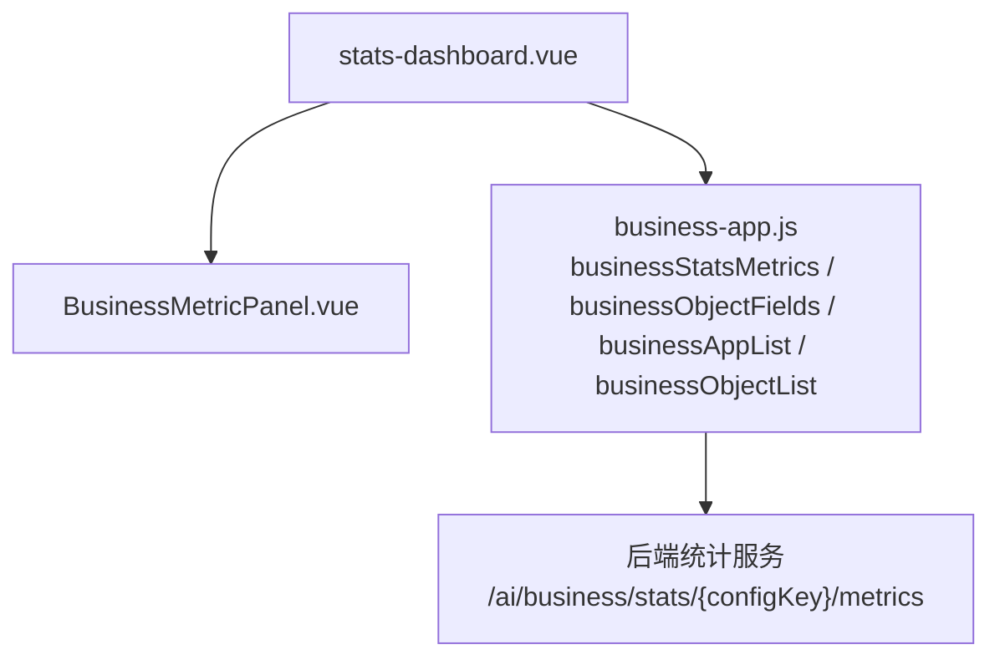
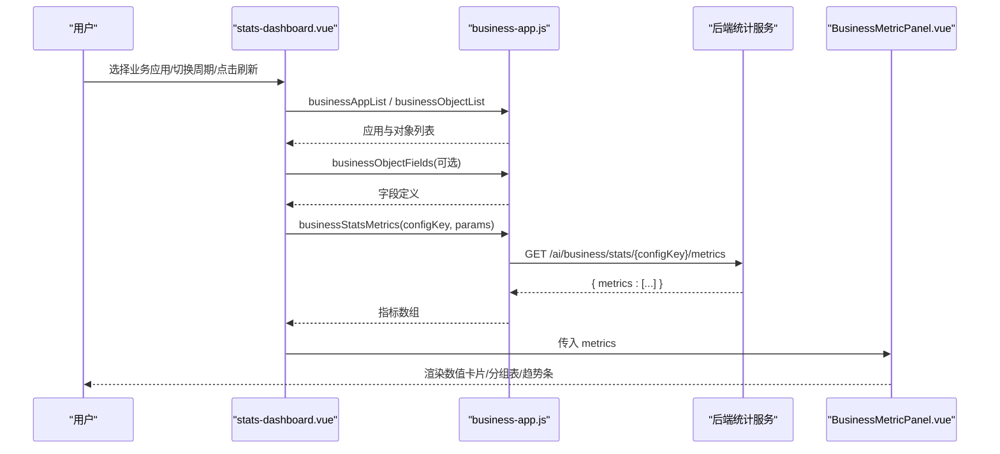
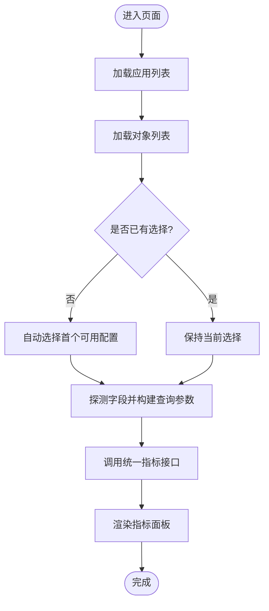
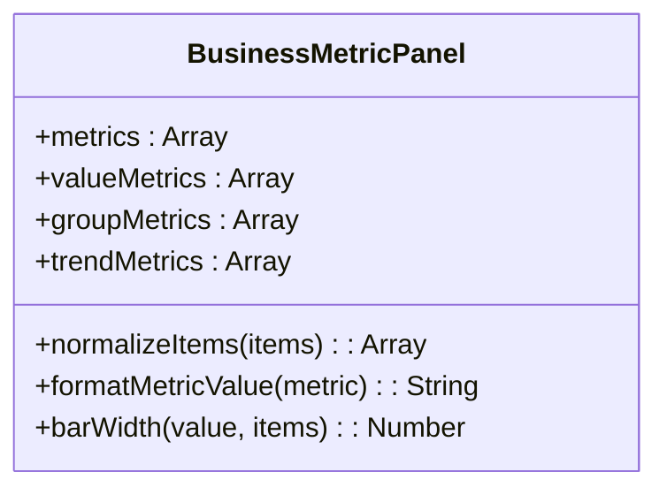
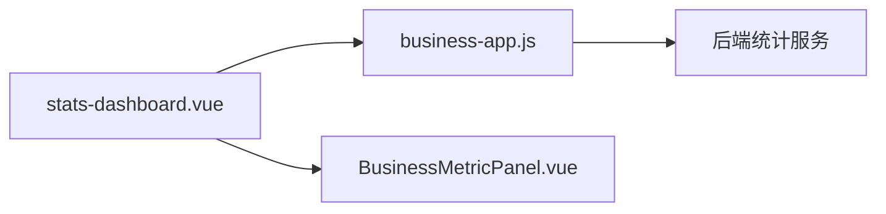

# 应用概览

<cite>
**本文引用的文件**
- [stats-dashboard.vue](file://forge-admin-ui/src/views/app-center/stats-dashboard.vue)
- [BusinessMetricPanel.vue](file://forge-admin-ui/src/views/app-center/components/BusinessMetricPanel.vue)
- [business-app.js](file://forge-admin-ui/src/api/business-app.js)
</cite>

## 目录
1. [简介](#简介)
2. [项目结构](#项目结构)
3. [核心组件](#核心组件)
4. [架构总览](#架构总览)
5. [详细组件分析](#详细组件分析)
6. [依赖关系分析](#依赖关系分析)
7. [性能与缓存策略](#性能与缓存策略)
8. [故障排查指南](#故障排查指南)
9. [结论](#结论)
10. [附录：指标含义与使用建议](#附录指标含义与使用建议)

## 简介
本章节面向“应用概览”功能，聚焦业务报表看板（位于应用中心）的设计与实现。该面板以“业务应用/对象”为维度，聚合数量、阶段分布、金额汇总、流程结果与新增趋势等关键指标，帮助用户快速掌握应用健康度与使用情况。文档将说明数据来源、更新机制、图表指标含义、定制扩展方式以及最佳实践。

## 项目结构
应用概览由前端页面与指标展示组件构成，并通过统一的业务 API 获取数据：
- 页面入口：stats-dashboard.vue，负责选择业务应用、构建查询参数、加载并渲染指标。
- 指标面板：BusinessMetricPanel.vue，按类型分组渲染数值卡片、分组表格与趋势条。
- 数据接口：business-app.js，封装统计相关接口，包括概览、分组、趋势与统一指标聚合接口。

图示来源
- [stats-dashboard.vue:1-43](file://forge-admin-ui/src/views/app-center/stats-dashboard.vue#L1-L43)
- [BusinessMetricPanel.vue:1-43](file://forge-admin-ui/src/views/app-center/components/BusinessMetricPanel.vue#L1-L43)
- [business-app.js:585-611](file://forge-admin-ui/src/api/business-app.js#L585-L611)

章节来源
- [stats-dashboard.vue:1-43](file://forge-admin-ui/src/views/app-center/stats-dashboard.vue#L1-L43)
- [business-app.js:585-611](file://forge-admin-ui/src/api/business-app.js#L585-L611)

## 核心组件
- 业务报表看板（stats-dashboard.vue）
  - 提供“业务应用”下拉选择、时间粒度切换（天/周/月）、刷新按钮。
  - 自动解析路由参数 configKey/objectCode，完成初始选择与数据加载。
  - 通过字段探测（状态、阶段、金额）动态构造指标查询。
- 业务指标面板（BusinessMetricPanel.vue）
  - 将指标按 metricType 分类渲染：COUNT/SUM 数值卡片、GROUP 分组表格、TREND 趋势列表。
  - 对金额单位进行元转换与本地化格式化；趋势条宽度基于最大值归一化。

章节来源
- [stats-dashboard.vue:45-195](file://forge-admin-ui/src/views/app-center/stats-dashboard.vue#L45-L195)
- [BusinessMetricPanel.vue:45-101](file://forge-admin-ui/src/views/app-center/components/BusinessMetricPanel.vue#L45-L101)

## 架构总览
概览面板采用“页面容器 + 指标展示组件 + API 封装”的分层结构。页面负责交互与参数组装，组件专注渲染，API 层屏蔽网络细节。统计指标通过统一聚合接口一次性返回多种类型，减少请求次数。

图示来源
- [stats-dashboard.vue:95-152](file://forge-admin-ui/src/views/app-center/stats-dashboard.vue#L95-L152)
- [business-app.js:585-611](file://forge-admin-ui/src/api/business-app.js#L585-L611)
- [BusinessMetricPanel.vue:1-43](file://forge-admin-ui/src/views/app-center/components/BusinessMetricPanel.vue#L1-L43)

## 详细组件分析

### 业务报表看板（stats-dashboard.vue）
- 数据加载流程
  - 初始化时并行加载应用列表与对象列表，并解析路由参数确定默认选择。
  - 根据所选对象字段智能推断状态、阶段、金额字段，构建指标查询参数。
  - 调用统一指标接口获取多类型指标，渲染到子组件。
- 关键逻辑
  - 字段匹配：优先按字段编码匹配，其次按字段名称包含关键词匹配。
  - 指标类型：OVERVIEW、TREND、FLOW_RESULT、SUM（当存在金额字段时启用）。
  - 时间粒度：day/week/month，影响后端趋势聚合。
- 错误处理
  - 字段加载失败降级为空列表，不影响整体渲染。
  - 指标加载异常清空数据并停止加载态。

图示来源
- [stats-dashboard.vue:95-152](file://forge-admin-ui/src/views/app-center/stats-dashboard.vue#L95-L152)
- [stats-dashboard.vue:169-195](file://forge-admin-ui/src/views/app-center/stats-dashboard.vue#L169-L195)

章节来源
- [stats-dashboard.vue:95-152](file://forge-admin-ui/src/views/app-center/stats-dashboard.vue#L95-L152)
- [stats-dashboard.vue:169-195](file://forge-admin-ui/src/views/app-center/stats-dashboard.vue#L169-L195)

### 业务指标面板（BusinessMetricPanel.vue）
- 指标分类与渲染
  - 数值型（COUNT/SUM）：以卡片形式展示总量或合计值，金额按元格式化。
  - 分组型（GROUP）：以表格展示分组键与对应数量。
  - 趋势型（TREND）：以条形图展示各时间点或分组的相对大小。
- 数据处理
  - normalizeItems：统一 label/value 字段名，确保空值兜底。
  - barWidth：基于最大值计算百分比宽度，避免除零。
- 可访问性与体验
  - 无数据时显示空状态提示。
  - 小尺寸表格与紧凑布局，适合信息密度较高的概览场景。

图示来源
- [BusinessMetricPanel.vue:45-101](file://forge-admin-ui/src/views/app-center/components/BusinessMetricPanel.vue#L45-L101)

章节来源
- [BusinessMetricPanel.vue:1-101](file://forge-admin-ui/src/views/app-center/components/BusinessMetricPanel.vue#L1-L101)

### API 封装（business-app.js）
- 统计相关接口
  - 概览：businessStatsOverview
  - 分组：businessStatsGroup
  - 趋势：businessStatsTrend
  - 统一指标聚合：businessStatsMetrics（推荐用于概览面板）
- 其他支撑接口
  - 应用/对象列表与详情、字段定义、运行时信息等，供页面完成选择与字段探测。

章节来源
- [business-app.js:585-611](file://forge-admin-ui/src/api/business-app.js#L585-L611)
- [business-app.js:108-118](file://forge-admin-ui/src/api/business-app.js#L108-L118)
- [business-app.js:50-59](file://forge-admin-ui/src/api/business-app.js#L50-L59)
- [business-app.js:271-273](file://forge-admin-ui/src/api/business-app.js#L271-L273)

## 依赖关系分析
- 组件耦合
  - stats-dashboard.vue 依赖 business-app.js 的多个接口，并通过 props 向 BusinessMetricPanel.vue 传递指标数据。
  - BusinessMetricPanel.vue 仅依赖传入的 metrics，内部无外部副作用，内聚度高。
- 外部依赖
  - 后端统计服务提供 /ai/business/stats/{configKey}/... 系列接口，统一指标聚合降低前端请求复杂度。
- 潜在循环依赖
  - 当前为单向依赖，无循环引用风险。

图示来源
- [stats-dashboard.vue:45-152](file://forge-admin-ui/src/views/app-center/stats-dashboard.vue#L45-L152)
- [business-app.js:585-611](file://forge-admin-ui/src/api/business-app.js#L585-L611)

章节来源
- [stats-dashboard.vue:45-152](file://forge-admin-ui/src/views/app-center/stats-dashboard.vue#L45-L152)
- [business-app.js:585-611](file://forge-admin-ui/src/api/business-app.js#L585-L611)

## 性能与缓存策略
- 请求合并
  - 使用统一指标聚合接口一次获取多种类型指标，减少往返次数。
- 字段探测优化
  - 仅在必要时拉取字段定义，且失败时降级继续渲染，避免阻塞主流程。
- 渲染优化
  - 指标面板按类型分组渲染，避免重复计算；趋势条宽度基于已归一化数据计算。
- 缓存建议（可扩展）
  - 应用/对象列表变化频率低，可在内存中缓存一段时间或使用浏览器缓存策略。
  - 指标数据可按 configKey + period 作为缓存键，结合短 TTL 提升二次打开速度。
  - 对于大对象字段列表，可考虑分页或按需加载。

[本节为通用性能建议，不直接分析具体文件]

## 故障排查指南
- 无法加载应用/对象列表
  - 检查路由参数 suiteCode/objectCode 是否正确传递。
  - 确认 businessAppList / businessObjectList 接口可达。
- 指标为空或异常
  - 检查 selectedConfig 是否为空；确认 businessStatsMetrics 参数完整。
  - 若字段探测失败，确认后端字段定义接口正常返回。
- 金额显示异常
  - 检查 metric.unit 是否为“分”，面板会将其转换为元并格式化。
- 趋势条宽度异常
  - 检查 normalizeItems 后的 value 是否为数字；确保至少有一个非零值以计算比例。

章节来源
- [stats-dashboard.vue:135-167](file://forge-admin-ui/src/views/app-center/stats-dashboard.vue#L135-L167)
- [BusinessMetricPanel.vue:72-100](file://forge-admin-ui/src/views/app-center/components/BusinessMetricPanel.vue#L72-L100)

## 结论
应用概览面板通过“统一指标聚合 + 智能字段探测 + 分类渲染”的方式，提供了直观、高效的应用运行与使用状况视图。其设计兼顾了易用性与扩展性，支持按业务单元灵活查看数量、阶段、金额、流程结果与趋势。建议在现有基础上引入轻量缓存与更细粒度的权限控制，以满足更大规模与更复杂场景的监控需求。

[本节为总结性内容，不直接分析具体文件]

## 附录：指标含义与使用建议
- OVERVIEW：总体概览指标，常用于展示关键总数或综合评分。
- COUNT：记录数量统计，适用于单据量、任务量等计数场景。
- SUM：金额或数值合计，适用于合同额、费用总额等汇总场景。
- GROUP：按某字段分组统计，如按阶段、部门、渠道等维度拆解数量。
- TREND：时间序列或分组趋势，用于观察新增或变化趋势。
- FLOW_RESULT：流程结果分布，帮助评估审批通过率、退回率等。

使用建议
- 首次进入优先关注 OVERVIEW 与 COUNT，快速把握体量。
- 结合 GROUP 定位瓶颈环节（如某阶段积压较多）。
- 用 TREND 观察周期性波动与异常峰值。
- 将 FLOW_RESULT 与 GROUP 联动分析，识别流程卡点。

[本节为概念性说明，不直接分析具体文件]