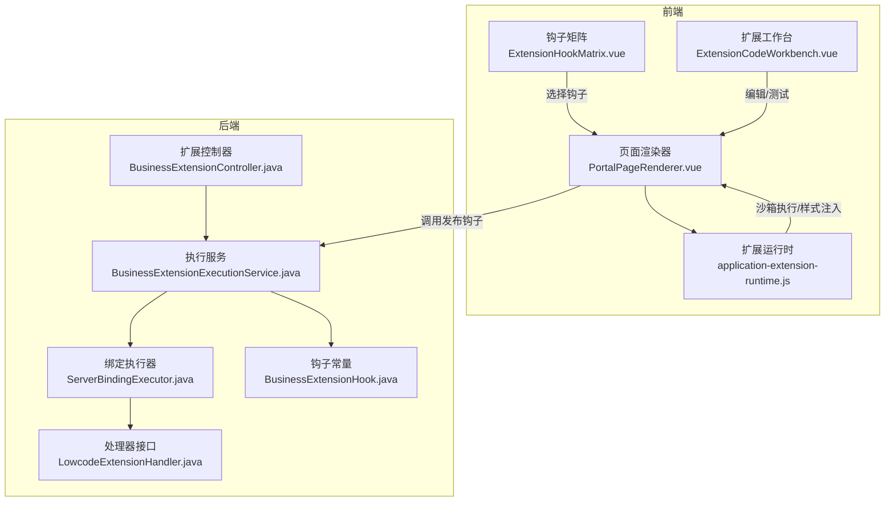
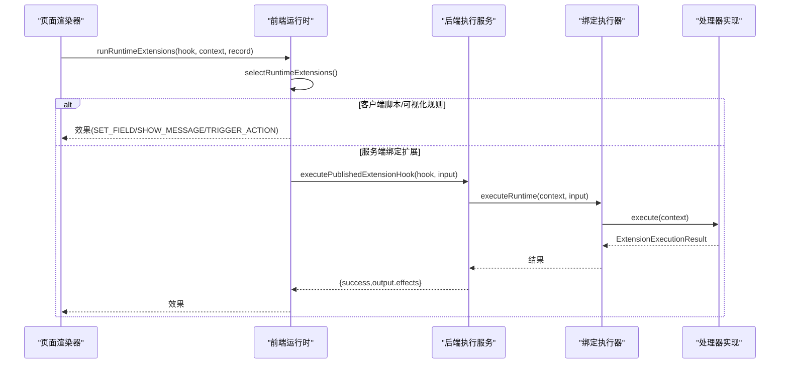
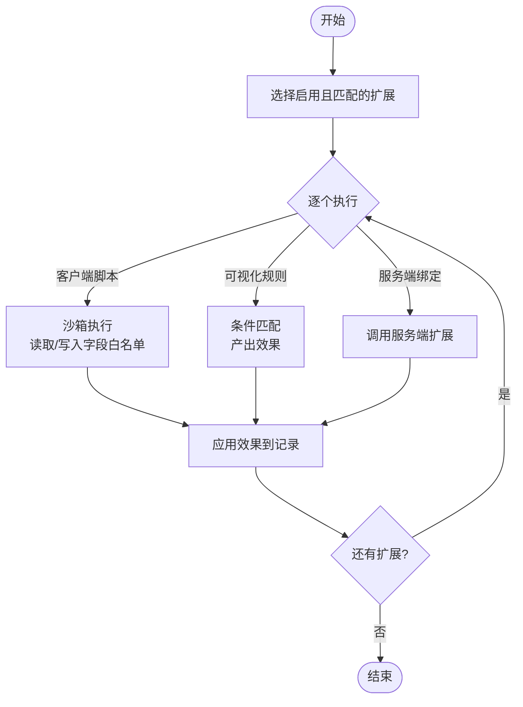
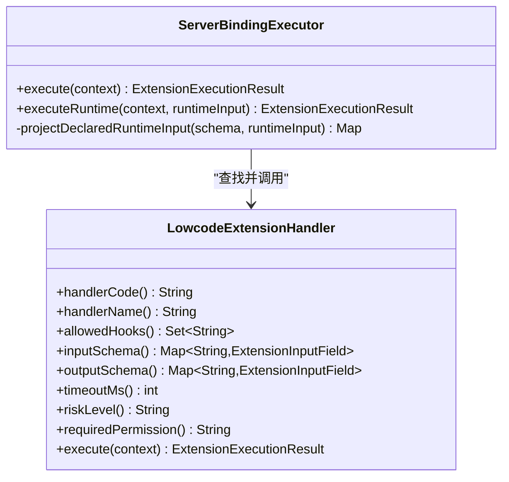
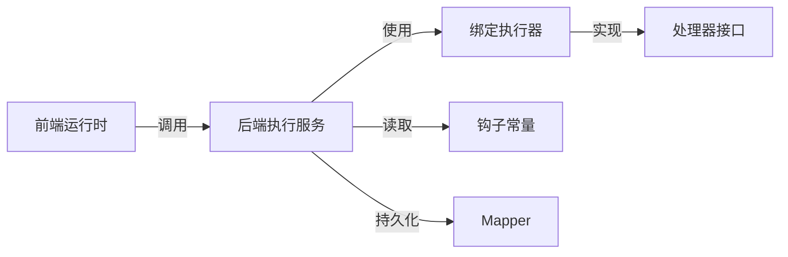

# 扩展管理

<cite>
**本文引用的文件**
- [application-extension-runtime.js](file://forge-admin-ui/src/components/lowcode-extension/runtime/application-extension-runtime.js)
- [PortalPageRenderer.vue](file://forge-admin-ui/src/views/app-center/components/portal/PortalPageRenderer.vue)
- [ExtensionHookMatrix.vue](file://forge-admin-ui/src/views/app-center/application-workspace/ExtensionHookMatrix.vue)
- [ExtensionCodeWorkbench.vue](file://forge-admin-ui/src/components/lowcode-extension/ExtensionCodeWorkbench.vue)
- [BusinessExtensionExecutionService.java](file://forge-server/forge-framework/forge-plugin-parent/forge-plugin-generator/src/main/java/com/mdframe/forge/plugin/generator/service/businessapp/BusinessExtensionExecutionService.java)
- [LowcodeExtensionHandler.java](file://forge-server/forge-framework/forge-plugin-parent/forge-plugin-generator/src/main/java/com/mdframe/forge/plugin/generator/service/businessapp/extension/LowcodeExtensionHandler.java)
- [ServerBindingExecutor.java](file://forge-server/forge-framework/forge-plugin-parent/forge-plugin-generator/src/main/java/com/mdframe/forge/plugin/generator/service/businessapp/extension/ServerBindingExecutor.java)
- [BusinessExtensionController.java](file://forge-server/forge-framework/forge-plugin-parent/forge-plugin-generator/src/main/java/com/mdframe/forge/plugin/generator/controller/BusinessExtensionController.java)
- [BusinessExtensionHook.java](file://forge-server/forge-framework/forge-plugin-parent/forge-plugin-generator/src/main/java/com/mdframe/forge/plugin/generator/constant/BusinessExtensionHook.java)
- [pom.xml（插件父工程）](file://forge-server/forge-framework/forge-plugin-parent/pom.xml)
</cite>

## 目录
1. [简介](#简介)
2. [项目结构](#项目结构)
3. [核心组件](#核心组件)
4. [架构总览](#架构总览)
5. [详细组件分析](#详细组件分析)
6. [依赖关系分析](#依赖关系分析)
7. [性能与可靠性](#性能与可靠性)
8. [故障排查指南](#故障排查指南)
9. [结论](#结论)
10. [附录：钩子矩阵与最佳实践](#附录：钩子矩阵与最佳实践)

## 简介
本文件面向“应用扩展管理”能力，系统性说明扩展系统的架构设计、钩子机制、插件体系、生命周期管理、扩展编辑器工作流、钩子矩阵使用方法、企业级开发最佳实践，以及常见问题解决方案。文档以代码为依据，覆盖前端运行时、服务端执行编排、处理器注册与校验、发布态安全边界等关键环节。

## 项目结构
扩展系统由前后端协同组成：
- 前端负责扩展选择、沙箱执行、样式注入、可视化规则处理、与服务端交互触发已发布扩展。
- 后端负责扩展版本管理、状态机流转、输入输出校验、处理器调度、超时与审计、发布态范围校验。
- 插件体系通过 Maven 多模块组织，扩展相关能力集中在生成器插件中，并通过控制器暴露管理能力。

**图表来源**
- [PortalPageRenderer.vue:328-364](file://forge-admin-ui/src/views/app-center/components/portal/PortalPageRenderer.vue#L328-L364)
- [application-extension-runtime.js:49-94](file://forge-admin-ui/src/components/lowcode-extension/runtime/application-extension-runtime.js#L49-L94)
- [ExtensionHookMatrix.vue:70-111](file://forge-admin-ui/src/views/app-center/application-workspace/ExtensionHookMatrix.vue#L70-L111)
- [BusinessExtensionExecutionService.java:124-178](file://forge-server/forge-framework/forge-plugin-parent/forge-plugin-generator/src/main/java/com/mdframe/forge/plugin/generator/service/businessapp/BusinessExtensionExecutionService.java#L124-L178)
- [LowcodeExtensionHandler.java:9-36](file://forge-server/forge-framework/forge-plugin-parent/forge-plugin-generator/src/main/java/com/mdframe/forge/plugin/generator/service/businessapp/extension/LowcodeExtensionHandler.java#L9-L36)
- [ServerBindingExecutor.java:73-98](file://forge-server/forge-framework/forge-plugin-parent/forge-plugin-generator/src/main/java/com/mdframe/forge/plugin/generator/service/businessapp/extension/ServerBindingExecutor.java#L73-L98)
- [BusinessExtensionHook.java:10-22](file://forge-server/forge-framework/forge-plugin-parent/forge-plugin-generator/src/main/java/com/mdframe/forge/plugin/generator/constant/BusinessExtensionHook.java#L10-L22)

**章节来源**
- [PortalPageRenderer.vue:328-364](file://forge-admin-ui/src/views/app-center/components/portal/PortalPageRenderer.vue#L328-L364)
- [application-extension-runtime.js:49-94](file://forge-admin-ui/src/components/lowcode-extension/runtime/application-extension-runtime.js#L49-L94)
- [BusinessExtensionExecutionService.java:124-178](file://forge-server/forge-framework/forge-plugin-parent/forge-plugin-generator/src/main/java/com/mdframe/forge/plugin/generator/service/businessapp/BusinessExtensionExecutionService.java#L124-L178)

## 核心组件
- 前端扩展运行时：负责按钩子筛选启用扩展、作用域匹配、顺序执行、效果合并与安全过滤、失败策略控制。
- 页面渲染器：在页面块级别触发钩子，组装上下文并调用运行时或已发布的服务端扩展。
- 钩子矩阵：提供可视化的触发时机选择，限制当前类型可绑定的钩子集合。
- 扩展工作台：提供代码编写、片段插入、全屏编辑、上下文提示等体验。
- 后端执行服务：负责扩展校验、受限测试、启停、服务端钩子执行编排、发布态范围校验、审计记录。
- 处理器接口与执行器：定义处理器契约、声明允许钩子、输入输出 Schema、超时与风险等级；执行器进行参数投影、白名单校验、超时保护。
- 钩子常量：集中定义客户端页面、样式、全量钩子集合，并按扩展类型限定可用钩子。

**章节来源**
- [application-extension-runtime.js:5-13](file://forge-admin-ui/src/components/lowcode-extension/runtime/application-extension-runtime.js#L5-L13)
- [application-extension-runtime.js:49-94](file://forge-admin-ui/src/components/lowcode-extension/runtime/application-extension-runtime.js#L49-L94)
- [PortalPageRenderer.vue:328-364](file://forge-admin-ui/src/views/app-center/components/portal/PortalPageRenderer.vue#L328-L364)
- [ExtensionHookMatrix.vue:70-111](file://forge-admin-ui/src/views/app-center/application-workspace/ExtensionHookMatrix.vue#L70-L111)
- [ExtensionCodeWorkbench.vue:1-19](file://forge-admin-ui/src/components/lowcode-extension/ExtensionCodeWorkbench.vue#L1-L19)
- [BusinessExtensionExecutionService.java:46-122](file://forge-server/forge-framework/forge-plugin-parent/forge-plugin-generator/src/main/java/com/mdframe/forge/plugin/generator/service/businessapp/BusinessExtensionExecutionService.java#L46-L122)
- [LowcodeExtensionHandler.java:9-36](file://forge-server/forge-framework/forge-plugin-parent/forge-plugin-generator/src/main/java/com/mdframe/forge/plugin/generator/service/businessapp/extension/LowcodeExtensionHandler.java#L9-L36)
- [ServerBindingExecutor.java:73-98](file://forge-server/forge-framework/forge-plugin-parent/forge-plugin-generator/src/main/java/com/mdframe/forge/plugin/generator/service/businessapp/extension/ServerBindingExecutor.java#L73-L98)
- [BusinessExtensionHook.java:10-22](file://forge-server/forge-framework/forge-plugin-parent/forge-plugin-generator/src/main/java/com/mdframe/forge/plugin/generator/constant/BusinessExtensionHook.java#L10-L22)

## 架构总览
扩展系统采用“前端运行时 + 后端执行编排 + 处理器注册”的分层架构：
- 前端运行时根据钩子码与作用域筛选扩展，依次执行客户端脚本、可视化规则或服务端绑定扩展，统一产出“效果”并应用到数据模型。
- 页面渲染器在关键业务点（如提交、列表查询、行操作）触发钩子，将上下文、记录、字段目录传入运行时。
- 后端执行服务从数据库加载已启用扩展，按版本快照执行 Java 处理器，严格校验输入输出、超时、权限与范围，并记录审计日志。
- 处理器通过接口声明允许的钩子、输入输出 Schema、超时、风险等级与所需权限，执行器基于 Schema 对输入做最小化投影，避免不可信数据进入处理器。

**图表来源**
- [PortalPageRenderer.vue:328-364](file://forge-admin-ui/src/views/app-center/components/portal/PortalPageRenderer.vue#L328-L364)
- [application-extension-runtime.js:49-94](file://forge-admin-ui/src/components/lowcode-extension/runtime/application-extension-runtime.js#L49-L94)
- [BusinessExtensionExecutionService.java:153-178](file://forge-server/forge-framework/forge-plugin-parent/forge-plugin-generator/src/main/java/com/mdframe/forge/plugin/generator/service/businessapp/BusinessExtensionExecutionService.java#L153-L178)
- [ServerBindingExecutor.java:73-98](file://forge-server/forge-framework/forge-plugin-parent/forge-plugin-generator/src/main/java/com/mdframe/forge/plugin/generator/service/businessapp/extension/ServerBindingExecutor.java#L73-L98)

## 详细组件分析

### 前端扩展运行时
- 扩展选择：按状态启用、钩子码匹配、作用域匹配（应用/页面/对象/入口），并按排序稳定排序。
- 执行流程：遍历扩展，执行客户端脚本、可视化规则或服务端绑定扩展，收集效果，应用至记录。
- 安全与治理：仅允许受控效果类型；字段写入需满足可写白名单；敏感信息脱敏；错误按失败策略阻断或告警。
- 样式注入：针对 SCOPED_CSS 在 PAGE_INIT 阶段注入隔离样式，替换作用域标识。

**图表来源**
- [application-extension-runtime.js:5-13](file://forge-admin-ui/src/components/lowcode-extension/runtime/application-extension-runtime.js#L5-L13)
- [application-extension-runtime.js:49-94](file://forge-admin-ui/src/components/lowcode-extension/runtime/application-extension-runtime.js#L49-L94)
- [application-extension-runtime.js:96-129](file://forge-admin-ui/src/components/lowcode-extension/runtime/application-extension-runtime.js#L96-L129)
- [application-extension-runtime.js:131-160](file://forge-admin-ui/src/components/lowcode-extension/runtime/application-extension-runtime.js#L131-L160)

**章节来源**
- [application-extension-runtime.js:5-13](file://forge-admin-ui/src/components/lowcode-extension/runtime/application-extension-runtime.js#L5-L13)
- [application-extension-runtime.js:49-94](file://forge-admin-ui/src/components/lowcode-extension/runtime/application-extension-runtime.js#L49-L94)
- [application-extension-runtime.js:96-129](file://forge-admin-ui/src/components/lowcode-extension/runtime/application-extension-runtime.js#L96-L129)
- [application-extension-runtime.js:131-160](file://forge-admin-ui/src/components/lowcode-extension/runtime/application-extension-runtime.js#L131-L160)

### 页面渲染器与钩子触发
- 在块级别构建上下文（应用、对象、入口），调用运行时执行对应钩子。
- 对于服务端扩展，调用发布态执行接口，传入记录与可选动作信息。
- 解析块入口 ID，确保作用域正确传递。

**章节来源**
- [PortalPageRenderer.vue:328-364](file://forge-admin-ui/src/views/app-center/components/portal/PortalPageRenderer.vue#L328-L364)

### 钩子矩阵
- 提供分组视图：数据写入、读取、交换、页面交互。
- 每个操作支持“执行前/执行后”按钮，或单一触发点。
- 根据扩展类型与处理器声明的 allowedHooks 限制可选项，未支持的钩子置灰。

**章节来源**
- [ExtensionHookMatrix.vue:70-111](file://forge-admin-ui/src/views/app-center/application-workspace/ExtensionHookMatrix.vue#L70-L111)
- [BusinessExtensionHook.java:10-22](file://forge-server/forge-framework/forge-plugin-parent/forge-plugin-generator/src/main/java/com/mdframe/forge/plugin/generator/constant/BusinessExtensionHook.java#L10-L22)

### 扩展工作台
- 展示当前模式标题、钩子引导文案、增强范围摘要。
- 支持全屏编辑、片段插入、清空编辑器等操作，提升编码效率。

**章节来源**
- [ExtensionCodeWorkbench.vue:1-19](file://forge-admin-ui/src/components/lowcode-extension/ExtensionCodeWorkbench.vue#L1-L19)
- [ExtensionCodeWorkbench.vue:306-348](file://forge-admin-ui/src/components/lowcode-extension/ExtensionCodeWorkbench.vue#L306-L348)

### 后端执行服务
- 校验与测试：校验草稿版本内容，必要时运行受限测试，更新测试结果与生命周期状态。
- 启停控制：基于状态机允许启用/停用，标记应用变更。
- 钩子执行：按应用、对象、入口与钩子码加载已启用扩展，仅执行服务端绑定类型，按失败策略决定是否中断。
- 发布态执行：校验发布快照中的扩展类型、版本、钩子与作用域，应用运行时元数据后执行处理器。
- 审计记录：记录执行结果、耗时、错误码与摘要。

**章节来源**
- [BusinessExtensionExecutionService.java:46-122](file://forge-server/forge-framework/forge-plugin-parent/forge-plugin-generator/src/main/java/com/mdframe/forge/plugin/generator/service/businessapp/BusinessExtensionExecutionService.java#L46-L122)
- [BusinessExtensionExecutionService.java:124-178](file://forge-server/forge-framework/forge-plugin-parent/forge-plugin-generator/src/main/java/com/mdframe/forge/plugin/generator/service/businessapp/BusinessExtensionExecutionService.java#L124-L178)
- [BusinessExtensionExecutionService.java:180-202](file://forge-server/forge-framework/forge-plugin-parent/forge-plugin-generator/src/main/java/com/mdframe/forge/plugin/generator/service/businessapp/BusinessExtensionExecutionService.java#L180-L202)
- [BusinessExtensionExecutionService.java:226-307](file://forge-server/forge-framework/forge-plugin-parent/forge-plugin-generator/src/main/java/com/mdframe/forge/plugin/generator/service/businessapp/BusinessExtensionExecutionService.java#L226-L307)

### 处理器接口与执行器
- 处理器接口：声明处理器编码、名称、允许钩子、输入输出 Schema、超时、风险等级、所需权限，并提供执行方法。
- 执行器：验证可信上下文，按处理器声明的输入 Schema 对运行时输入进行投影，仅暴露必要字段；支持超时取消与脱敏错误；拒绝未知字段与非法钩子。

**图表来源**
- [LowcodeExtensionHandler.java:9-36](file://forge-server/forge-framework/forge-plugin-parent/forge-plugin-generator/src/main/java/com/mdframe/forge/plugin/generator/service/businessapp/extension/LowcodeExtensionHandler.java#L9-L36)
- [ServerBindingExecutor.java:73-98](file://forge-server/forge-framework/forge-plugin-parent/forge-plugin-generator/src/main/java/com/mdframe/forge/plugin/generator/service/businessapp/extension/ServerBindingExecutor.java#L73-L98)

**章节来源**
- [LowcodeExtensionHandler.java:9-36](file://forge-server/forge-framework/forge-plugin-parent/forge-plugin-generator/src/main/java/com/mdframe/forge/plugin/generator/service/businessapp/extension/LowcodeExtensionHandler.java#L9-L36)
- [ServerBindingExecutor.java:73-98](file://forge-server/forge-framework/forge-plugin-parent/forge-plugin-generator/src/main/java/com/mdframe/forge/plugin/generator/service/businessapp/extension/ServerBindingExecutor.java#L73-L98)

### 控制器与能力暴露
- 控制器将处理器元数据（允许钩子、输入输出 Schema、超时、风险等级、权限）转换为 VO 返回给前端，用于界面展示与校验。
- 插件父工程聚合多个插件模块，扩展能力位于生成器插件中。

**章节来源**
- [BusinessExtensionController.java:216-240](file://forge-server/forge-framework/forge-plugin-parent/forge-plugin-generator/src/main/java/com/mdframe/forge/plugin/generator/controller/BusinessExtensionController.java#L216-L240)
- [pom.xml（插件父工程）:18-30](file://forge-server/forge-framework/forge-plugin-parent/pom.xml#L18-L30)

## 依赖关系分析
- 前端依赖运行时库与页面渲染器，运行时依赖沙箱与服务端执行桥接。
- 后端执行服务依赖映射器、状态机、校验服务、执行器与对象转换器。
- 执行器依赖处理器注册表与处理器接口，按 Schema 约束输入。
- 钩子常量集中管理可用钩子集合，并与前端矩阵联动。

**图表来源**
- [application-extension-runtime.js:49-94](file://forge-admin-ui/src/components/lowcode-extension/runtime/application-extension-runtime.js#L49-L94)
- [BusinessExtensionExecutionService.java:124-178](file://forge-server/forge-framework/forge-plugin-parent/forge-plugin-generator/src/main/java/com/mdframe/forge/plugin/generator/service/businessapp/BusinessExtensionExecutionService.java#L124-L178)
- [ServerBindingExecutor.java:73-98](file://forge-server/forge-framework/forge-plugin-parent/forge-plugin-generator/src/main/java/com/mdframe/forge/plugin/generator/service/businessapp/extension/ServerBindingExecutor.java#L73-L98)
- [BusinessExtensionHook.java:10-22](file://forge-server/forge-framework/forge-plugin-parent/forge-plugin-generator/src/main/java/com/mdframe/forge/plugin/generator/constant/BusinessExtensionHook.java#L10-L22)

**章节来源**
- [application-extension-runtime.js:49-94](file://forge-admin-ui/src/components/lowcode-extension/runtime/application-extension-runtime.js#L49-L94)
- [BusinessExtensionExecutionService.java:124-178](file://forge-server/forge-framework/forge-plugin-parent/forge-plugin-generator/src/main/java/com/mdframe/forge/plugin/generator/service/businessapp/BusinessExtensionExecutionService.java#L124-L178)

## 性能与可靠性
- 前端执行顺序稳定：按 sortOrder 与 extensionCode 排序，保证可预测的执行顺序。
- 字段写入白名单：仅允许修改可写字段，减少副作用与冲突。
- 服务端超时保护：处理器可配置超时，执行器在超时时取消并返回脱敏错误。
- 失败策略：BLOCK 中断流程，WARN 记录告警继续执行，便于渐进式引入。
- 审计追踪：每次执行记录结果、耗时、错误码与摘要，便于问题定位。

[本节为通用指导，不直接分析具体文件]

## 故障排查指南
- 扩展未生效
  - 检查扩展状态是否启用、钩子码是否匹配、作用域是否匹配（应用/页面/对象/入口）。
  - 确认前端运行时是否正确选择扩展并执行。
- 字段无法写入
  - 检查字段目录中该字段是否为可写字段，避免写入只读或隐藏字段。
- 服务端扩展失败
  - 查看执行服务记录的错误码与摘要，确认处理器返回失败原因。
  - 若失败策略为 BLOCK，流程会被中断；若为 WARN，流程继续但会记录告警。
- 输入字段被拒绝
  - 执行器仅允许处理器声明的输入字段，未知字段将被拒绝。
- 钩子不可用
  - 前端矩阵会根据扩展类型与处理器声明的 allowedHooks 禁用不支持的钩子。

**章节来源**
- [application-extension-runtime.js:96-129](file://forge-admin-ui/src/components/lowcode-extension/runtime/application-extension-runtime.js#L96-L129)
- [application-extension-runtime.js:131-160](file://forge-admin-ui/src/components/lowcode-extension/runtime/application-extension-runtime.js#L131-L160)
- [BusinessExtensionExecutionService.java:124-178](file://forge-server/forge-framework/forge-plugin-parent/forge-plugin-generator/src/main/java/com/mdframe/forge/plugin/generator/service/businessapp/BusinessExtensionExecutionService.java#L124-L178)
- [ServerBindingExecutor.java:73-98](file://forge-server/forge-framework/forge-plugin-parent/forge-plugin-generator/src/main/java/com/mdframe/forge/plugin/generator/service/businessapp/extension/ServerBindingExecutor.java#L73-L98)

## 结论
扩展系统通过清晰的前后端职责划分、严格的输入输出校验、稳定的执行顺序与完善的审计机制，提供了可扩展、可观测、可治理的企业级扩展能力。钩子矩阵与工作台降低了扩展开发门槛，而处理器接口与执行器确保了安全性与可控性。建议在实际项目中遵循最佳实践，逐步引入扩展，配合失败策略与审计日志持续优化。

[本节为总结，不直接分析具体文件]

## 附录：钩子矩阵与最佳实践

### 钩子矩阵使用方法
- 数据写入：新增、修改、删除的“执行前/执行后”。
- 数据读取：列表、详情、汇总的“执行前/执行后”。
- 数据交换：导入、导出的“执行前/执行后”。
- 页面交互：页面初始化、字段变化、表单提交、列表行操作。
- 选择规则：同一增强只绑定一个触发点；前端矩阵根据扩展类型与处理器声明的 allowedHooks 限制可选项。

**章节来源**
- [ExtensionHookMatrix.vue:70-111](file://forge-admin-ui/src/views/app-center/application-workspace/ExtensionHookMatrix.vue#L70-L111)
- [BusinessExtensionHook.java:10-22](file://forge-server/forge-framework/forge-plugin-parent/forge-plugin-generator/src/main/java/com/mdframe/forge/plugin/generator/constant/BusinessExtensionHook.java#L10-L22)

### 扩展开发最佳实践
- 代码规范
  - 明确声明处理器编码、名称、允许钩子、输入输出 Schema、超时与风险等级。
  - 前端脚本仅访问白名单字段与动作，避免越权写入。
- 性能优化
  - 合理设置超时，避免长时间阻塞；尽量在前端完成轻量计算。
  - 服务端扩展仅投影必要字段，减少数据传输与处理开销。
- 错误处理
  - 使用失败策略控制流程中断或告警；记录错误码与摘要以便追踪。
  - 前端运行时对敏感信息进行脱敏，避免泄露。
- 安全与合规
  - 发布态执行时校验作用域，防止跨应用/对象/入口误用。
  - 仅允许受控效果类型，避免任意 DOM 或状态篡改。

[本节为通用指导，不直接分析具体文件]