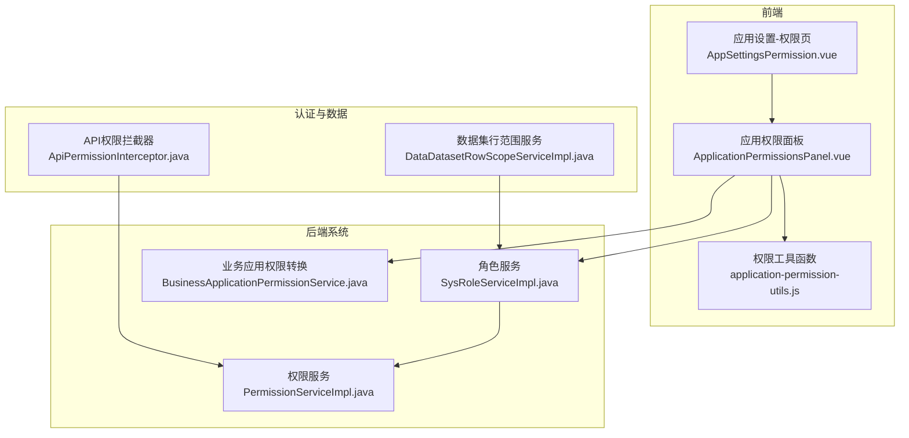
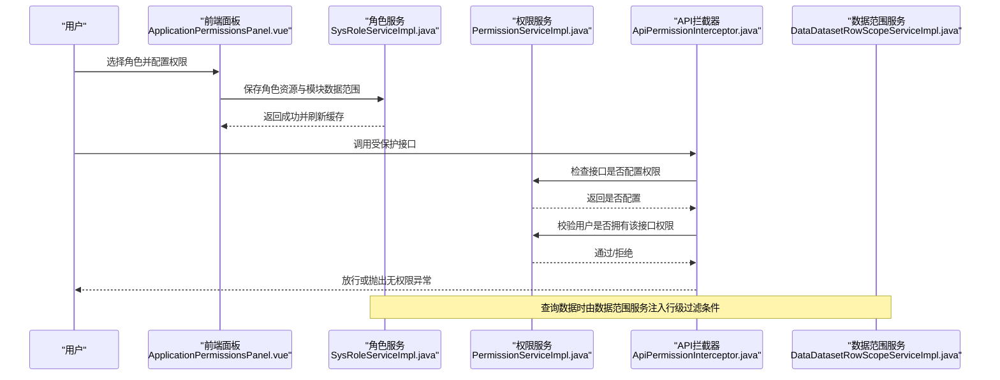
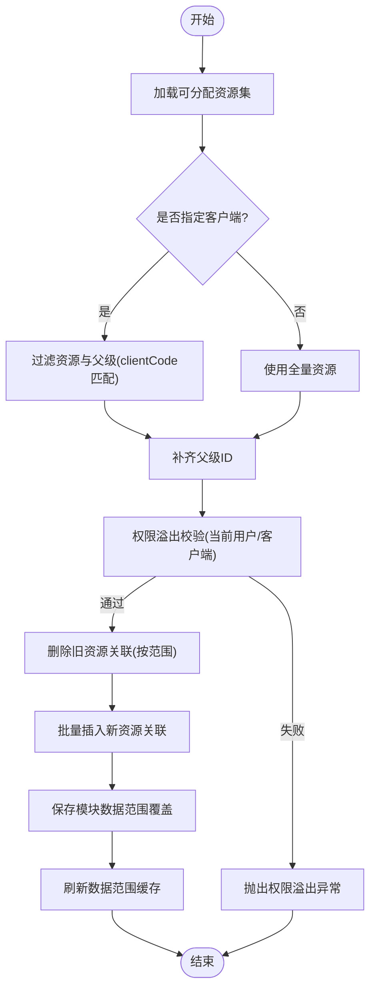
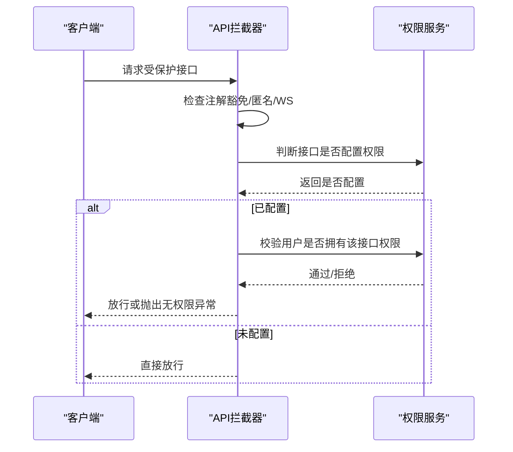
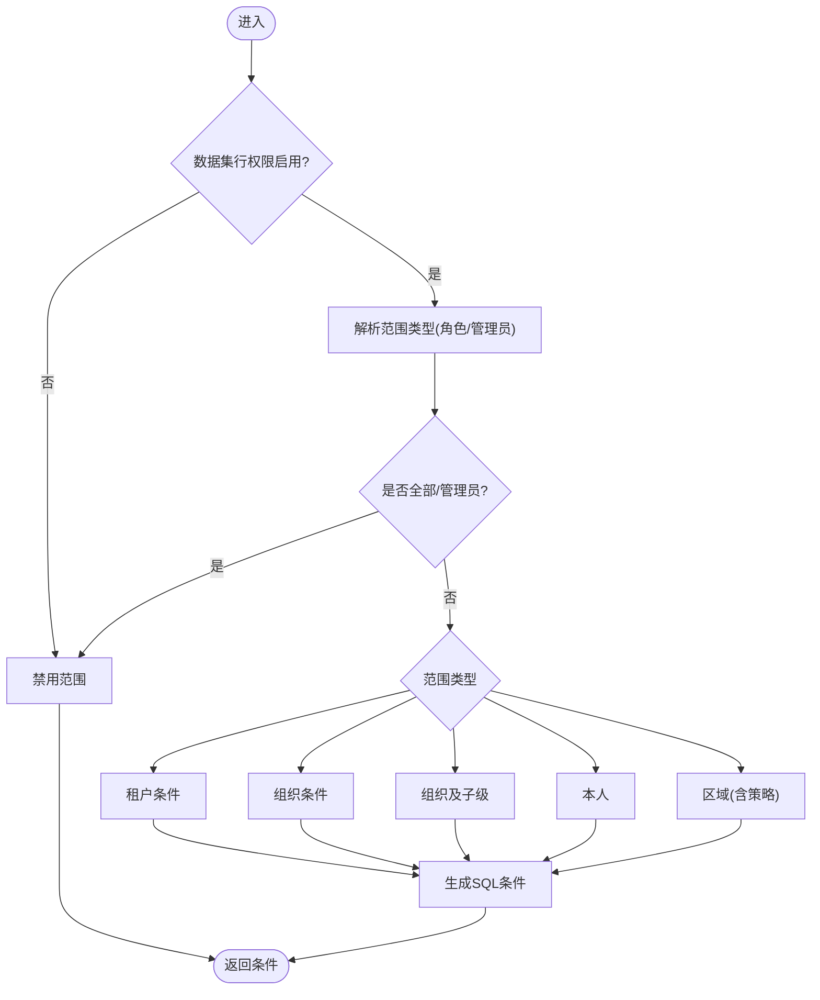
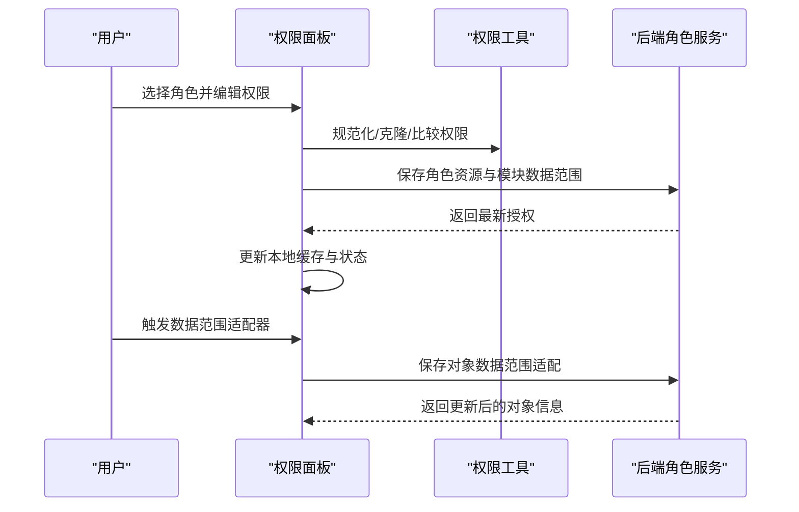
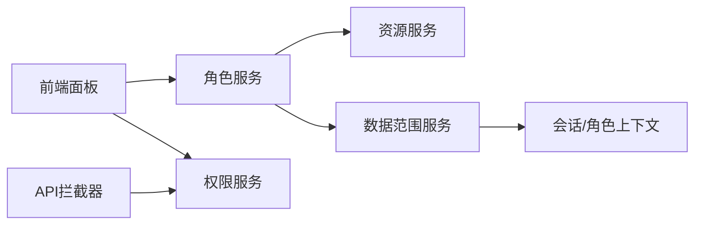

# 权限管理

<cite>
**本文引用的文件**
- [SysRoleServiceImpl.java](file://forge-server/forge-framework/forge-plugin-parent/forge-plugin-system/src/main/java/com/mdframe/forge/plugin/system/service/impl/SysRoleServiceImpl.java)
- [PermissionServiceImpl.java](file://forge-server/forge-framework/forge-plugin-parent/forge-plugin-system/src/main/java/com/mdframe/forge/plugin/system/service/impl/PermissionServiceImpl.java)
- [ApiPermissionInterceptor.java](file://forge-server/forge-framework/forge-starter-parent/forge-starter-auth/src/main/java/com/mdframe/forge/starter/auth/interceptor/ApiPermissionInterceptor.java)
- [DataDatasetRowScopeServiceImpl.java](file://forge-server/forge-framework/forge-plugin-parent/forge-plugin-data/src/main/java/com/mdframe/forge/plugin/data/service/impl/DataDatasetRowScopeServiceImpl.java)
- [ApplicationPermissionsPanel.vue](file://forge-admin-ui/src/views/app-center/application-workspace/ApplicationPermissionsPanel.vue)
- [application-permission-utils.js](file://forge-admin-ui/src/views/app-center/application-permission-utils.js)
- [AppSettingsPermission.vue](file://forge-admin-ui/src/views/app-center/components/settings/AppSettingsPermission.vue)
- [BusinessApplicationPermissionService.java](file://forge-server/forge-framework/forge-plugin-parent/forge-plugin-generator/src/main/java/com/mdframe/forge/plugin/generator/service/businessapp/BusinessApplicationPermissionService.java)
- [BusinessApplicationRuntimeServiceTest.java](file://forge-server/forge-framework/forge-plugin-parent/forge-plugin-generator/src/test/java/com/mdframe/forge/plugin/generator/service/businessapp/BusinessApplicationRuntimeServiceTest.java)
- [config-center.vue](file://forge-admin-ui/src/views/system/config-center.vue)
</cite>

## 目录
1. [简介](#简介)
2. [项目结构](#项目结构)
3. [核心组件](#核心组件)
4. [架构总览](#架构总览)
5. [详细组件分析](#详细组件分析)
6. [依赖关系分析](#依赖关系分析)
7. [性能考虑](#性能考虑)
8. [故障排查指南](#故障排查指南)
9. [结论](#结论)
10. [附录](#附录)

## 简介
本文件面向应用工作空间中的权限管理功能，系统性阐述基于 RBAC（角色-资源）的权限模型在前后端的实现方式，覆盖角色定义、菜单/按钮/API 权限分配、数据范围控制与适配机制。文档同时提供权限面板使用方法、数据范围适配器的工作流程、以及最小权限、权限继承、动态授权等安全最佳实践建议。

## 项目结构
权限能力横跨前端工作台、后端系统服务、认证拦截器与数据行级范围控制：
- 前端工作台：应用权限面板负责选择角色、配置页面入口、对象数据范围和功能权限，并持久化到后端。
- 后端系统服务：角色资源绑定、模块级数据范围覆盖、权限溢出校验、缓存刷新。
- 认证与API鉴权：拦截器根据接口配置与用户权限进行访问控制。
- 数据范围适配器：按数据集维度注入行级过滤条件，支持租户、组织、区域、本人等多策略。

**图表来源**
- [ApplicationPermissionsPanel.vue:1-118](file://forge-admin-ui/src/views/app-center/application-workspace/ApplicationPermissionsPanel.vue#L1-L118)
- [application-permission-utils.js:16-59](file://forge-admin-ui/src/views/app-center/application-permission-utils.js#L16-L59)
- [SysRoleServiceImpl.java:174-391](file://forge-server/forge-framework/forge-plugin-parent/forge-plugin-system/src/main/java/com/mdframe/forge/plugin/system/service/impl/SysRoleServiceImpl.java#L174-L391)
- [PermissionServiceImpl.java:36-138](file://forge-server/forge-framework/forge-plugin-parent/forge-plugin-system/src/main/java/com/mdframe/forge/plugin/system/service/impl/PermissionServiceImpl.java#L36-L138)
- [ApiPermissionInterceptor.java:44-113](file://forge-server/forge-framework/forge-starter-parent/forge-starter-auth/src/main/java/com/mdframe/forge/starter/auth/interceptor/ApiPermissionInterceptor.java#L44-L113)
- [DataDatasetRowScopeServiceImpl.java:58-84](file://forge-server/forge-framework/forge-plugin-parent/forge-plugin-data/src/main/java/com/mdframe/forge/plugin/data/service/impl/DataDatasetRowScopeServiceImpl.java#L58-L84)
- [BusinessApplicationPermissionService.java:293-317](file://forge-server/forge-framework/forge-plugin-parent/forge-plugin-generator/src/main/java/com/mdframe/forge/plugin/generator/service/businessapp/BusinessApplicationPermissionService.java#L293-L317)

**章节来源**
- [ApplicationPermissionsPanel.vue:1-118](file://forge-admin-ui/src/views/app-center/application-workspace/ApplicationPermissionsPanel.vue#L1-L118)
- [SysRoleServiceImpl.java:174-391](file://forge-server/forge-framework/forge-plugin-parent/forge-plugin-system/src/main/java/com/mdframe/forge/plugin/system/service/impl/SysRoleServiceImpl.java#L174-L391)
- [PermissionServiceImpl.java:36-138](file://forge-server/forge-framework/forge-plugin-parent/forge-plugin-system/src/main/java/com/mdframe/forge/plugin/system/service/impl/PermissionServiceImpl.java#L36-L138)
- [ApiPermissionInterceptor.java:44-113](file://forge-server/forge-framework/forge-starter-parent/forge-starter-auth/src/main/java/com/mdframe/forge/starter/auth/interceptor/ApiPermissionInterceptor.java#L44-L113)
- [DataDatasetRowScopeServiceImpl.java:58-84](file://forge-server/forge-framework/forge-plugin-parent/forge-plugin-data/src/main/java/com/mdframe/forge/plugin/data/service/impl/DataDatasetRowScopeServiceImpl.java#L58-L84)
- [BusinessApplicationPermissionService.java:293-317](file://forge-server/forge-framework/forge-plugin-parent/forge-plugin-generator/src/main/java/com/mdframe/forge/plugin/generator/service/businessapp/BusinessApplicationPermissionService.java#L293-L317)

## 核心组件
- 角色与资源绑定：支持按客户端隔离、自动补齐父节点、权限溢出校验、批量写入与回滚。
- 模块级数据范围覆盖：为每个业务模块单独设置默认数据范围或覆盖值。
- API 权限校验：基于已登录用户的权限列表与接口路径匹配，支持方法级与全局通配。
- 数据集行级范围：按租户、组织、区域、本人等策略生成 SQL 条件，保障数据隔离。
- 应用工作空间权限面板：可视化配置角色在特定应用内的页面入口、功能权限与数据范围。

**章节来源**
- [SysRoleServiceImpl.java:174-391](file://forge-server/forge-framework/forge-plugin-parent/forge-plugin-system/src/main/java/com/mdframe/forge/plugin/system/service/impl/SysRoleServiceImpl.java#L174-L391)
- [PermissionServiceImpl.java:36-138](file://forge-server/forge-framework/forge-plugin-parent/forge-plugin-system/src/main/java/com/mdframe/forge/plugin/system/service/impl/PermissionServiceImpl.java#L36-L138)
- [DataDatasetRowScopeServiceImpl.java:58-84](file://forge-server/forge-framework/forge-plugin-parent/forge-plugin-data/src/main/java/com/mdframe/forge/plugin/data/service/impl/DataDatasetRowScopeServiceImpl.java#L58-L84)
- [ApplicationPermissionsPanel.vue:1-118](file://forge-admin-ui/src/views/app-center/application-workspace/ApplicationPermissionsPanel.vue#L1-L118)

## 架构总览
下图展示从前端操作到后端鉴权与数据隔离的完整链路：

**图表来源**
- [ApplicationPermissionsPanel.vue:251-363](file://forge-admin-ui/src/views/app-center/application-workspace/ApplicationPermissionsPanel.vue#L251-L363)
- [SysRoleServiceImpl.java:326-391](file://forge-server/forge-framework/forge-plugin-parent/forge-plugin-system/src/main/java/com/mdframe/forge/plugin/system/service/impl/SysRoleServiceImpl.java#L326-L391)
- [ApiPermissionInterceptor.java:70-113](file://forge-server/forge-framework/forge-starter-parent/forge-starter-auth/src/main/java/com/mdframe/forge/starter/auth/interceptor/ApiPermissionInterceptor.java#L70-L113)
- [PermissionServiceImpl.java:59-138](file://forge-server/forge-framework/forge-plugin-parent/forge-plugin-system/src/main/java/com/mdframe/forge/plugin/system/service/impl/PermissionServiceImpl.java#L59-L138)
- [DataDatasetRowScopeServiceImpl.java:58-84](file://forge-server/forge-framework/forge-plugin-parent/forge-plugin-data/src/main/java/com/mdframe/forge/plugin/data/service/impl/DataDatasetRowScopeServiceImpl.java#L58-L84)

## 详细组件分析

### 角色与资源绑定（RBAC 核心）
- 资源树与客户端隔离：支持按 clientCode 限定可分配资源，避免跨客户端越权。
- 父节点自动补齐：为保证菜单树渲染正确，自动补充父级资源ID。
- 权限溢出防护：非管理员仅能分配自身拥有的资源；禁止分配其他客户端父级资源。
- 批量写入与事务：删除旧关联后批量插入新关联，失败回滚。
- 模块数据范围覆盖：为指定模块设置数据范围，支持清空与去重校验。

**图表来源**
- [SysRoleServiceImpl.java:174-391](file://forge-server/forge-framework/forge-plugin-parent/forge-plugin-system/src/main/java/com/mdframe/forge/plugin/system/service/impl/SysRoleServiceImpl.java#L174-L391)

**章节来源**
- [SysRoleServiceImpl.java:174-391](file://forge-server/forge-framework/forge-plugin-parent/forge-plugin-system/src/main/java/com/mdframe/forge/plugin/system/service/impl/SysRoleServiceImpl.java#L174-L391)

### API 权限校验（接口级）
- 前置检查：忽略注解豁免、匿名接口、WebSocket 路径。
- 配置判定：仅对已配置权限资源的接口进行校验。
- 权限匹配：支持全局通配与方法级匹配（如“GET /api”）。
- 强制改密：未修改初始密码的用户被限制访问非白名单接口。

**图表来源**
- [ApiPermissionInterceptor.java:44-113](file://forge-server/forge-framework/forge-starter-parent/forge-starter-auth/src/main/java/com/mdframe/forge/starter/auth/interceptor/ApiPermissionInterceptor.java#L44-L113)
- [PermissionServiceImpl.java:59-138](file://forge-server/forge-framework/forge-plugin-parent/forge-plugin-system/src/main/java/com/mdframe/forge/plugin/system/service/impl/PermissionServiceImpl.java#L59-L138)

**章节来源**
- [ApiPermissionInterceptor.java:44-113](file://forge-server/forge-framework/forge-starter-parent/forge-starter-auth/src/main/java/com/mdframe/forge/starter/auth/interceptor/ApiPermissionInterceptor.java#L44-L113)
- [PermissionServiceImpl.java:59-138](file://forge-server/forge-framework/forge-plugin-parent/forge-plugin-system/src/main/java/com/mdframe/forge/plugin/system/service/impl/PermissionServiceImpl.java#L59-L138)

### 数据集行级范围（数据范围适配器）
- 策略类型：全部、租户全部、组织、组织及子级、本人、区域（含层级策略）。
- 构建条件：根据登录用户身份与角色最小数据范围，生成 SQL 过滤片段。
- 安全兜底：未配置字段或未启用时禁用或拒绝所有。
- 区域策略：支持本级、本级及直属下级、本级及所有下级。

**图表来源**
- [DataDatasetRowScopeServiceImpl.java:58-84](file://forge-server/forge-framework/forge-plugin-parent/forge-plugin-data/src/main/java/com/mdframe/forge/plugin/data/service/impl/DataDatasetRowScopeServiceImpl.java#L58-L84)
- [DataDatasetRowScopeServiceImpl.java:116-183](file://forge-server/forge-framework/forge-plugin-parent/forge-plugin-data/src/main/java/com/mdframe/forge/plugin/data/service/impl/DataDatasetRowScopeServiceImpl.java#L116-L183)

**章节来源**
- [DataDatasetRowScopeServiceImpl.java:58-84](file://forge-server/forge-framework/forge-plugin-parent/forge-plugin-data/src/main/java/com/mdframe/forge/plugin/data/service/impl/DataDatasetRowScopeServiceImpl.java#L58-L84)
- [DataDatasetRowScopeServiceImpl.java:116-183](file://forge-server/forge-framework/forge-plugin-parent/forge-plugin-data/src/main/java/com/mdframe/forge/plugin/data/service/impl/DataDatasetRowScopeServiceImpl.java#L116-L183)

### 应用工作空间权限面板（前端）
- 角色选择与概览：显示角色默认数据范围、页面入口数量、功能权限数量、对象范围覆盖数。
- 权限编辑：维护 resourceIds（页面/动作）与 moduleScopes（对象数据范围），支持去重、排序与对比。
- 保存与缓存：提交前构造 payload，成功后更新本地缓存并重载。
- 数据范围适配器：通过辅助动作打开弹窗，针对具体对象配置数据范围映射。

**图表来源**
- [ApplicationPermissionsPanel.vue:251-436](file://forge-admin-ui/src/views/app-center/application-workspace/ApplicationPermissionsPanel.vue#L251-L436)
- [application-permission-utils.js:16-59](file://forge-admin-ui/src/views/app-center/application-permission-utils.js#L16-L59)
- [SysRoleServiceImpl.java:326-391](file://forge-server/forge-framework/forge-plugin-parent/forge-plugin-system/src/main/java/com/mdframe/forge/plugin/system/service/impl/SysRoleServiceImpl.java#L326-L391)

**章节来源**
- [ApplicationPermissionsPanel.vue:1-118](file://forge-admin-ui/src/views/app-center/application-workspace/ApplicationPermissionsPanel.vue#L1-L118)
- [ApplicationPermissionsPanel.vue:251-436](file://forge-admin-ui/src/views/app-center/application-workspace/ApplicationPermissionsPanel.vue#L251-L436)
- [application-permission-utils.js:16-59](file://forge-admin-ui/src/views/app-center/application-permission-utils.js#L16-L59)

### 权限设计与最佳实践
- 最小权限原则：仅授予完成工作所需的最小资源集合，避免宽泛授权。
- 权限继承：利用父节点自动补齐机制，确保菜单树完整性，但需配合溢出校验防止越权。
- 动态权限控制：结合运行时上下文（租户、组织、区域）与数据集行级范围，实现细粒度数据隔离。
- 客户端隔离：在多客户端场景下，严格限制可分配资源与父级，避免跨客户端权限泄露。
- 管理员豁免：管理员可绕过页面角色限制，便于运维与调试，但应谨慎使用。

**章节来源**
- [SysRoleServiceImpl.java:239-291](file://forge-server/forge-framework/forge-plugin-parent/forge-plugin-system/src/main/java/com/mdframe/forge/plugin/system/service/impl/SysRoleServiceImpl.java#L239-L291)
- [BusinessApplicationRuntimeServiceTest.java:253-300](file://forge-server/forge-framework/forge-plugin-parent/forge-plugin-generator/src/test/java/com/mdframe/forge/plugin/generator/service/businessapp/BusinessApplicationRuntimeServiceTest.java#L253-L300)

## 依赖关系分析
- 前端依赖后端角色服务与应用权限服务，用于加载工作空间、角色授权与保存。
- 后端角色服务依赖资源服务、数据范围服务与租户上下文，保证一致性。
- API 拦截器依赖权限服务与接口配置管理器，形成统一的鉴权入口。
- 数据范围服务依赖会话与角色信息，生成安全的 SQL 条件。

**图表来源**
- [ApplicationPermissionsPanel.vue:251-363](file://forge-admin-ui/src/views/app-center/application-workspace/ApplicationPermissionsPanel.vue#L251-L363)
- [SysRoleServiceImpl.java:174-391](file://forge-server/forge-framework/forge-plugin-parent/forge-plugin-system/src/main/java/com/mdframe/forge/plugin/system/service/impl/SysRoleServiceImpl.java#L174-L391)
- [ApiPermissionInterceptor.java:70-113](file://forge-server/forge-framework/forge-starter-parent/forge-starter-auth/src/main/java/com/mdframe/forge/starter/auth/interceptor/ApiPermissionInterceptor.java#L70-L113)
- [DataDatasetRowScopeServiceImpl.java:58-84](file://forge-server/forge-framework/forge-plugin-parent/forge-plugin-data/src/main/java/com/mdframe/forge/plugin/data/service/impl/DataDatasetRowScopeServiceImpl.java#L58-L84)

**章节来源**
- [SysRoleServiceImpl.java:174-391](file://forge-server/forge-framework/forge-plugin-parent/forge-plugin-system/src/main/java/com/mdframe/forge/plugin/system/service/impl/SysRoleServiceImpl.java#L174-L391)
- [ApiPermissionInterceptor.java:70-113](file://forge-server/forge-framework/forge-starter-parent/forge-starter-auth/src/main/java/com/mdframe/forge/starter/auth/interceptor/ApiPermissionInterceptor.java#L70-L113)
- [DataDatasetRowScopeServiceImpl.java:58-84](file://forge-server/forge-framework/forge-plugin-parent/forge-plugin-data/src/main/java/com/mdframe/forge/plugin/data/service/impl/DataDatasetRowScopeServiceImpl.java#L58-L84)

## 性能考虑
- 权限资源配置缓存：接口权限资源配置采用短 TTL 缓存，减少重复查询。
- 数据范围缓存：角色数据范围变更后在事务提交后刷新缓存，避免脏读。
- 批量操作：资源与模块数据范围采用批量插入与删除，降低数据库交互次数。
- 前端去重与排序：权限 ID 与模块编码进行去重与稳定排序，提升比较与序列化效率。

**章节来源**
- [PermissionServiceImpl.java:74-92](file://forge-server/forge-framework/forge-plugin-parent/forge-plugin-system/src/main/java/com/mdframe/forge/plugin/system/service/impl/PermissionServiceImpl.java#L74-L92)
- [SysRoleServiceImpl.java:690-712](file://forge-server/forge-framework/forge-plugin-parent/forge-plugin-system/src/main/java/com/mdframe/forge/plugin/system/service/impl/SysRoleServiceImpl.java#L690-L712)
- [application-permission-utils.js:1-14](file://forge-admin-ui/src/views/app-center/application-permission-utils.js#L1-L14)

## 故障排查指南
- 权限溢出错误：检查是否尝试分配未拥有的资源或跨客户端父级资源。
- 接口无权限：确认接口是否已配置权限资源，且用户具备对应权限；检查是否启用了 API 权限校验。
- 数据范围不生效：确认数据集行权限已启用并配置了必要字段；检查角色最小数据范围与用户身份。
- 强制改密拦截：若用户标记强制改密，仅允许访问白名单路径。

**章节来源**
- [SysRoleServiceImpl.java:239-291](file://forge-server/forge-framework/forge-plugin-parent/forge-plugin-system/src/main/java/com/mdframe/forge/plugin/system/service/impl/SysRoleServiceImpl.java#L239-L291)
- [ApiPermissionInterceptor.java:70-113](file://forge-server/forge-framework/forge-starter-parent/forge-starter-auth/src/main/java/com/mdframe/forge/starter/auth/interceptor/ApiPermissionInterceptor.java#L70-L113)
- [DataDatasetRowScopeServiceImpl.java:58-84](file://forge-server/forge-framework/forge-plugin-parent/forge-plugin-data/src/main/java/com/mdframe/forge/plugin/data/service/impl/DataDatasetRowScopeServiceImpl.java#L58-L84)
- [config-center.vue:518-551](file://forge-admin-ui/src/views/system/config-center.vue#L518-L551)

## 结论
本权限体系以 RBAC 为核心，结合客户端隔离、父节点继承、权限溢出防护与模块级数据范围覆盖，实现了灵活而安全的权限控制。API 层通过拦截器统一鉴权，数据层通过行级范围实现租户、组织、区域与本人等多维隔离。前端面板提供直观的配置体验，配合工具函数确保数据一致性与高效保存。遵循最小权限、继承与动态控制的最佳实践，可在复杂多租户环境中保障数据安全与可维护性。

## 附录
- 权限面板使用要点：
  - 选择角色后，先配置页面入口（resourceIds），再按需设置对象数据范围（moduleScopes）。
  - 保存前注意未保存提示，避免误切换导致修改丢失。
  - 通过辅助动作打开数据范围适配器，为具体对象配置字段映射与策略。
- 配置开关：
  - 可在认证配置中开启/关闭 API 权限校验，并配置排除路径。

**章节来源**
- [ApplicationPermissionsPanel.vue:1-118](file://forge-admin-ui/src/views/app-center/application-workspace/ApplicationPermissionsPanel.vue#L1-L118)
- [AppSettingsPermission.vue:74-115](file://forge-admin-ui/src/views/app-center/components/settings/AppSettingsPermission.vue#L74-L115)
- [config-center.vue:518-551](file://forge-admin-ui/src/views/system/config-center.vue#L518-L551)