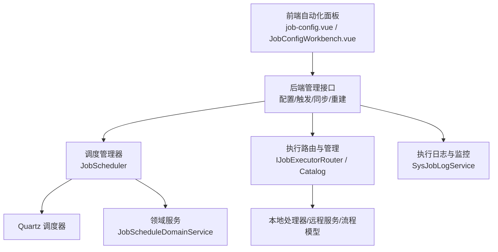
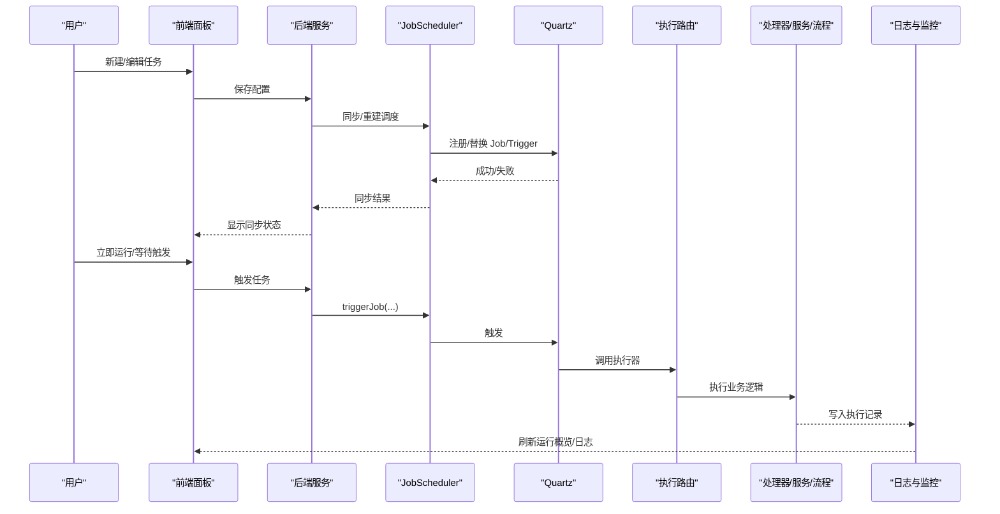
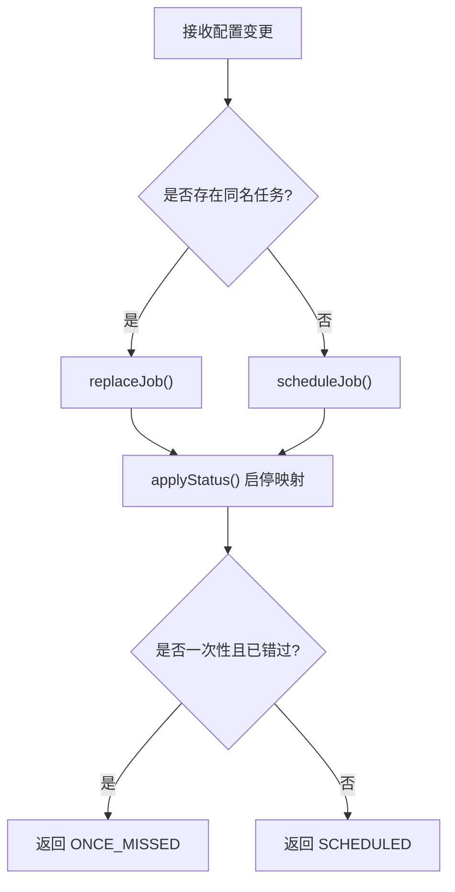
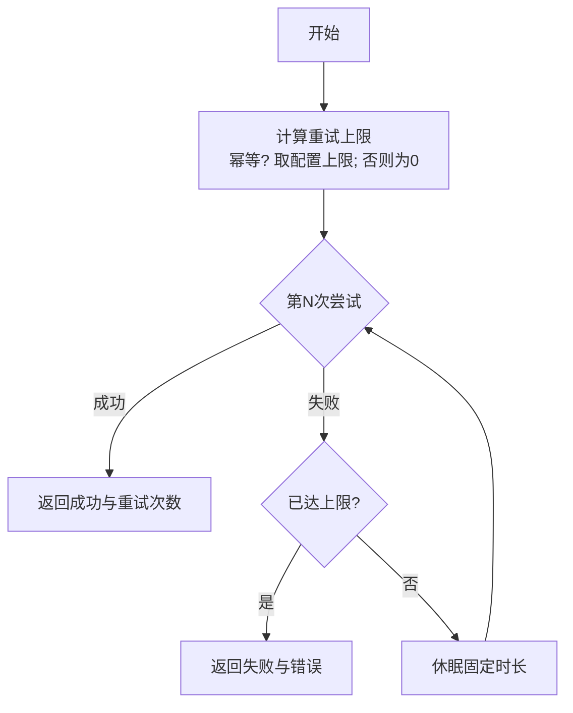
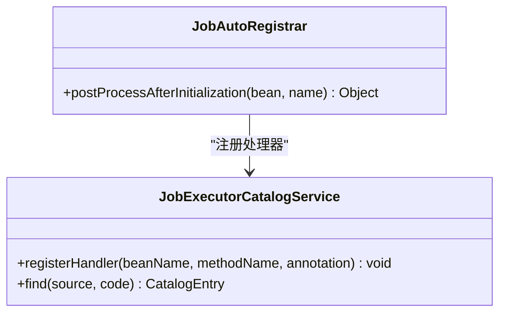
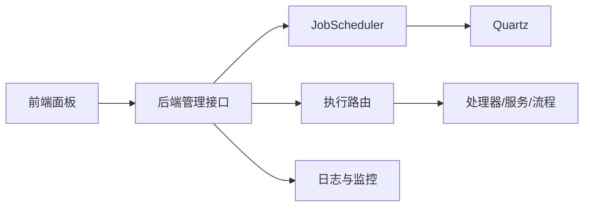

# 自动化配置

<cite>
**本文引用的文件**
- [JobAutoConfiguration.java](file://forge-server/forge-framework/forge-plugin-parent/forge-plugin-job/src/main/java/com/mdframe/forge/plugin/job/config/JobAutoConfiguration.java)
- [JobScheduler.java](file://forge-server/forge-framework/forge-plugin-parent/forge-plugin-job/src/main/java/com/mdframe/forge/plugin/job/scheduler/JobScheduler.java)
- [JobRetryExecutor.java](file://forge-server/forge-framework/forge-plugin-parent/forge-plugin-job/src/main/java/com/mdframe/forge/plugin/job/service/JobRetryExecutor.java)
- [JobConfigWorkbench.vue](file://forge-admin-ui/src/views/system/job-config/components/JobConfigWorkbench.vue)
- [job-config.vue](file://forge-admin-ui/src/views/system/job-config.vue)
- [JobScheduleException.java](file://forge-server/forge-framework/forge-plugin-parent/forge-plugin-job/src/main/java/com/mdframe/forge/plugin/job/scheduler/JobScheduleException.java)
- [JobExecutorCatalogService.java](file://forge-server/forge-framework/forge-plugin-parent/forge-plugin-job/src/main/java/com/mdframe/forge/plugin/job/service/JobExecutorCatalogService.java)
- [JobAutoRegistrar.java](file://forge-server/forge-framework/forge-plugin-parent/forge-plugin-job/src/main/java/com/mdframe/forge/plugin/job/registry/JobAutoRegistrar.java)
- [spec.md](file://code-copilot/changes/定时任务并发重试治理/spec.md)
- [execution-log.md（并发重试治理）](file://code-copilot/changes/定时任务并发重试治理/execution-log.md)
- [execution-log.md（可靠性加固）](file://code-copilot/changes/定时任务可靠性加固/execution-log.md)
</cite>

## 目录
1. [简介](#简介)
2. [项目结构](#项目结构)
3. [核心组件](#核心组件)
4. [架构总览](#架构总览)
5. [详细组件分析](#详细组件分析)
6. [依赖关系分析](#依赖关系分析)
7. [性能与容量规划](#性能与容量规划)
8. [故障排查指南](#故障排查指南)
9. [结论](#结论)
10. [附录：最佳实践与案例](#附录最佳实践与案例)

## 简介
本文件面向“应用自动化配置”能力，围绕定时任务、数据同步、消息通知等常见自动化场景，系统说明自动化面板的使用方法、任务的执行机制（调度、队列、重试、异常处理）、以及企业级最佳实践。文档同时结合代码仓库中的实际实现，给出可操作的配置建议与排错指引。

## 项目结构
自动化能力由前后端共同构成：
- 前端提供“自动化面板”，包括任务列表、运行概览、任务编辑工作台、日志查看与操作入口。
- 后端以插件化方式集成 Quartz 调度器，提供任务配置的持久化、调度同步、执行编排、重试与告警等能力。

**图表来源**
- [JobScheduler.java:19-411](file://forge-server/forge-framework/forge-plugin-parent/forge-plugin-job/src/main/java/com/mdframe/forge/plugin/job/scheduler/JobScheduler.java#L19-L411)
- [JobConfigWorkbench.vue:1-800](file://forge-admin-ui/src/views/system/job-config/components/JobConfigWorkbench.vue#L1-L800)
- [job-config.vue:1-800](file://forge-admin-ui/src/views/system/job-config.vue#L1-L800)

**章节来源**
- [JobAutoConfiguration.java:1-27](file://forge-server/forge-framework/forge-plugin-parent/forge-plugin-job/src/main/java/com/mdframe/forge/plugin/job/config/JobAutoConfiguration.java#L1-L27)
- [JobScheduler.java:19-411](file://forge-server/forge-framework/forge-plugin-parent/forge-plugin-job/src/main/java/com/mdframe/forge/plugin/job/scheduler/JobScheduler.java#L19-L411)
- [JobConfigWorkbench.vue:1-800](file://forge-admin-ui/src/views/system/job-config/components/JobConfigWorkbench.vue#L1-L800)
- [job-config.vue:1-800](file://forge-admin-ui/src/views/system/job-config.vue#L1-L800)

## 核心组件
- 自动配置与扫描：启用任务插件的自动装配与组件扫描。
- 调度管理器：封装对 Quartz 的增删改查、状态同步、Cron 热更新、一次性任务与 Misfire 策略。
- 重试执行器：为幂等任务提供有限次数、固定退避的重试，非幂等任务禁止重试。
- 处理器目录：自动发现并注册标注的任务处理器，供前端选择与绑定。
- 前端工作区：可视化创建/编辑任务、预览计划、设置并发与重试策略、查看运行概览与日志。

**章节来源**
- [JobAutoConfiguration.java:1-27](file://forge-server/forge-framework/forge-plugin-parent/forge-plugin-job/src/main/java/com/mdframe/forge/plugin/job/config/JobAutoConfiguration.java#L1-L27)
- [JobScheduler.java:19-411](file://forge-server/forge-framework/forge-plugin-parent/forge-plugin-job/src/main/java/com/mdframe/forge/plugin/job/scheduler/JobScheduler.java#L19-L411)
- [JobRetryExecutor.java:1-67](file://forge-server/forge-framework/forge-plugin-parent/forge-plugin-job/src/main/java/com/mdframe/forge/plugin/job/service/JobRetryExecutor.java#L1-L67)
- [JobExecutorCatalogService.java:1-45](file://forge-server/forge-framework/forge-plugin-parent/forge-plugin-job/src/main/java/com/mdframe/forge/plugin/job/service/JobExecutorCatalogService.java#L1-L45)
- [JobConfigWorkbench.vue:1-800](file://forge-admin-ui/src/views/system/job-config/components/JobConfigWorkbench.vue#L1-L800)

## 架构总览
下图展示从用户操作到任务执行的端到端流程，包括调度同步、执行编排、重试与日志记录。

**图表来源**
- [JobScheduler.java:35-201](file://forge-server/forge-framework/forge-plugin-parent/forge-plugin-job/src/main/java/com/mdframe/forge/plugin/job/scheduler/JobScheduler.java#L35-L201)
- [JobConfigWorkbench.vue:463-566](file://forge-admin-ui/src/views/system/job-config/components/JobConfigWorkbench.vue#L463-L566)
- [job-config.vue:506-566](file://forge-admin-ui/src/views/system/job-config.vue#L506-L566)

## 详细组件分析

### 调度管理器 JobScheduler
职责
- 提供任务的添加、更新、删除、暂停、恢复、触发、Cron 热更新。
- 将数据库期望状态与 Quartz 运行态进行幂等同步，支持“重建调度”。
- 处理一次性任务与 Misfire 策略，保证错过触发时的行为符合配置。

关键路径
- 添加/更新：校验存在性、构建 JobDetail/Trigger、应用启停状态。
- 同步/重建：必要时删除 Quartz 状态后重新注册，避免脏状态。
- 触发：携带触发类型与可选预留执行 ID，便于执行链路追踪。
- Cron 热更新：仅替换 Trigger 并保留时区与 Misfire 策略。

**图表来源**
- [JobScheduler.java:35-115](file://forge-server/forge-framework/forge-plugin-parent/forge-plugin-job/src/main/java/com/mdframe/forge/plugin/job/scheduler/JobScheduler.java#L35-L115)
- [JobScheduler.java:271-379](file://forge-server/forge-framework/forge-plugin-parent/forge-plugin-job/src/main/java/com/mdframe/forge/plugin/job/scheduler/JobScheduler.java#L271-L379)

**章节来源**
- [JobScheduler.java:19-411](file://forge-server/forge-framework/forge-plugin-parent/forge-plugin-job/src/main/java/com/mdframe/forge/plugin/job/scheduler/JobScheduler.java#L19-L411)

### 重试执行器 JobRetryExecutor
设计要点
- 仅对声明为幂等的任务开启重试；非幂等任务强制不重试。
- 固定退避时间、最大重试次数受平台上限约束。
- 每次尝试在同一执行记录中累计次数与最终结果。

**图表来源**
- [JobRetryExecutor.java:24-44](file://forge-server/forge-framework/forge-plugin-parent/forge-plugin-job/src/main/java/com/mdframe/forge/plugin/job/service/JobRetryExecutor.java#L24-L44)

**章节来源**
- [JobRetryExecutor.java:1-67](file://forge-server/forge-framework/forge-plugin-parent/forge-plugin-job/src/main/java/com/mdframe/forge/plugin/job/service/JobRetryExecutor.java#L1-L67)

### 处理器目录与自动注册
- 通过注解扫描自动发现本地任务处理器，生成可供前端选择的目录项。
- 支持类级别与方法级别的处理器注册，区分 BEAN/HANDLER 模式。

**图表来源**
- [JobAutoRegistrar.java:33-44](file://forge-server/forge-framework/forge-plugin-parent/forge-plugin-job/src/main/java/com/mdframe/forge/plugin/job/registry/JobAutoRegistrar.java#L33-L44)
- [JobExecutorCatalogService.java:17-45](file://forge-server/forge-framework/forge-plugin-parent/forge-plugin-job/src/main/java/com/mdframe/forge/plugin/job/service/JobExecutorCatalogService.java#L17-L45)

**章节来源**
- [JobExecutorCatalogService.java:1-45](file://forge-server/forge-framework/forge-plugin-parent/forge-plugin-job/src/main/java/com/mdframe/forge/plugin/job/service/JobExecutorCatalogService.java#L1-L45)
- [JobAutoRegistrar.java:33-44](file://forge-server/forge-framework/forge-plugin-parent/forge-plugin-job/src/main/java/com/mdframe/forge/plugin/job/registry/JobAutoRegistrar.java#L33-L44)

### 前端自动化面板
功能覆盖
- 任务列表：搜索、筛选、分页、批量管理（清理日志、开放 API 凭证）。
- 运行概览：近 24 小时执行次数、成功率、失败率、运行中数量、连续失败任务提示。
- 任务编辑工作台：分步向导（基本信息、执行内容、执行计划、运行策略），实时预览未来执行时间，保存后支持“重新同步/重建调度”。
- 日志查看：弹窗查看某任务的运行日志，支持刷新。

交互要点
- 保存后若调度同步失败，页面会提示“配置已保存，调度同步失败”，并提供返回任务列表查看失败原因与“重新同步”入口。
- 一次性任务过期后保存会提示“该一次性计划已结束”，默认停用以避免误触发。

**章节来源**
- [job-config.vue:1-800](file://forge-admin-ui/src/views/system/job-config.vue#L1-L800)
- [JobConfigWorkbench.vue:1-800](file://forge-admin-ui/src/views/system/job-config/components/JobConfigWorkbench.vue#L1-L800)

## 依赖关系分析
- 前端依赖后端提供的任务配置、触发、同步、重建、日志与监控接口。
- 后端调度层依赖 Quartz，并通过领域服务解析时区与一次性时间。
- 执行层通过路由选择本地处理器、远程服务或流程模型执行。
- 日志与监控贯穿执行全生命周期，支撑运行概览与问题定位。

**图表来源**
- [JobScheduler.java:19-411](file://forge-server/forge-framework/forge-plugin-parent/forge-plugin-job/src/main/java/com/mdframe/forge/plugin/job/scheduler/JobScheduler.java#L19-L411)
- [JobConfigWorkbench.vue:463-566](file://forge-admin-ui/src/views/system/job-config/components/JobConfigWorkbench.vue#L463-L566)
- [job-config.vue:506-566](file://forge-admin-ui/src/views/system/job-config.vue#L506-L566)

**章节来源**
- [JobScheduler.java:19-411](file://forge-server/forge-framework/forge-plugin-parent/forge-plugin-job/src/main/java/com/mdframe/forge/plugin/job/scheduler/JobScheduler.java#L19-L411)
- [JobConfigWorkbench.vue:1-800](file://forge-admin-ui/src/views/system/job-config/components/JobConfigWorkbench.vue#L1-L800)
- [job-config.vue:1-800](file://forge-admin-ui/src/views/system/job-config.vue#L1-L800)

## 性能与容量规划
- 并发控制：使用任务级分布式锁，上一轮未完成时本轮直接跳过，避免排队放大。
- 重试策略：固定退避与最大次数限制，非幂等任务禁止重试，防止雪崩。
- Misfire 策略：CRON 与 ONCE 分别采用不同策略，减少补偿风暴。
- 资源隔离：按分组与处理器维度组织任务，避免热点任务争用。
- 监控观测：基于运行概览与日志快速定位瓶颈与失败根因。

[本节为通用指导，无需特定文件引用]

## 故障排查指南
常见问题与定位步骤
- 调度同步失败
  - 现象：保存后提示“配置已保存，调度同步失败”。
  - 处理：返回任务列表查看失败原因，点击“重新同步”或“重建调度”。
  - 依据：协调器按 JobKey 幂等同步，失败写 FAILED，删除失败保留 DELETE_PENDING。
- 一次性任务错过
  - 现象：一次性任务已过时，无法再触发。
  - 处理：修改执行时间后保存即可重新计划；为避免误触发，保存后默认停用。
- 任务未执行或重复执行
  - 检查并发策略是否为 SKIP_IF_RUNNING；确认分布式锁可用。
  - 检查重试策略与幂等标记，非幂等任务不应开启重试。
- 日志缺失或异常
  - 在任务列表打开“运行日志”，核对最近结果与连续失败次数。
  - 关注 Misfire 策略与下次触发时间是否正确。

**章节来源**
- [execution-log.md（可靠性加固）:40-47](file://code-copilot/changes/定时任务可靠性加固/execution-log.md#L40-L47)
- [execution-log.md（并发重试治理）:23-30](file://code-copilot/changes/定时任务并发重试治理/execution-log.md#L23-L30)
- [JobConfigWorkbench.vue:63-82](file://forge-admin-ui/src/views/system/job-config/components/JobConfigWorkbench.vue#L63-L82)
- [job-config.vue:451-466](file://forge-admin-ui/src/views/system/job-config.vue#L451-L466)

## 结论
本自动化配置方案以“配置即调度、执行可观测、失败可恢复”为核心目标，通过可视化的前端面板与稳健的后端调度/重试/告警机制，满足定时任务、数据同步、消息通知等企业级自动化需求。建议在业务侧遵循幂等设计、合理设置并发与重试策略，并结合运行概览与日志持续优化。

[本节为总结性内容，无需特定文件引用]

## 附录：最佳实践与案例

### 典型自动化场景
- 定时任务
  - 适用：日结、报表生成、指标聚合。
  - 建议：使用 CRON 周期执行，开启 Misfire 的“忽略错过”策略，配合运行概览观察成功率。
- 数据同步
  - 适用：跨库/跨系统增量同步。
  - 建议：确保幂等，开启有限重试；大体积数据分批处理，避免长事务。
- 消息通知
  - 适用：失败告警、审批提醒。
  - 建议：配置多渠道通知（站内信、邮件），并在任务失败时统一收敛通知。

### 配置与调优建议
- 并发策略
  - 高竞争任务优先使用“跳过运行中”，避免重复执行。
- 重试策略
  - 仅对幂等任务开启重试；重试次数建议 0~5，退避固定 1s。
- 时区与一次性任务
  - 明确任务时区；一次性任务过期后需重新计划。
- 监控与告警
  - 关注“连续失败任务数”；对关键任务开启失败通知。

### 参考实现与验证
- 并发与重试治理：明确语义、测试覆盖、Misfire 适配。
- 可靠性加固：调度异常统一抛出、协调器幂等同步、删除意图保留。

**章节来源**
- [spec.md:10-30](file://code-copilot/changes/定时任务并发重试治理/spec.md#L10-L30)
- [execution-log.md（并发重试治理）:23-30](file://code-copilot/changes/定时任务并发重试治理/execution-log.md#L23-L30)
- [execution-log.md（可靠性加固）:40-47](file://code-copilot/changes/定时任务可靠性加固/execution-log.md#L40-L47)