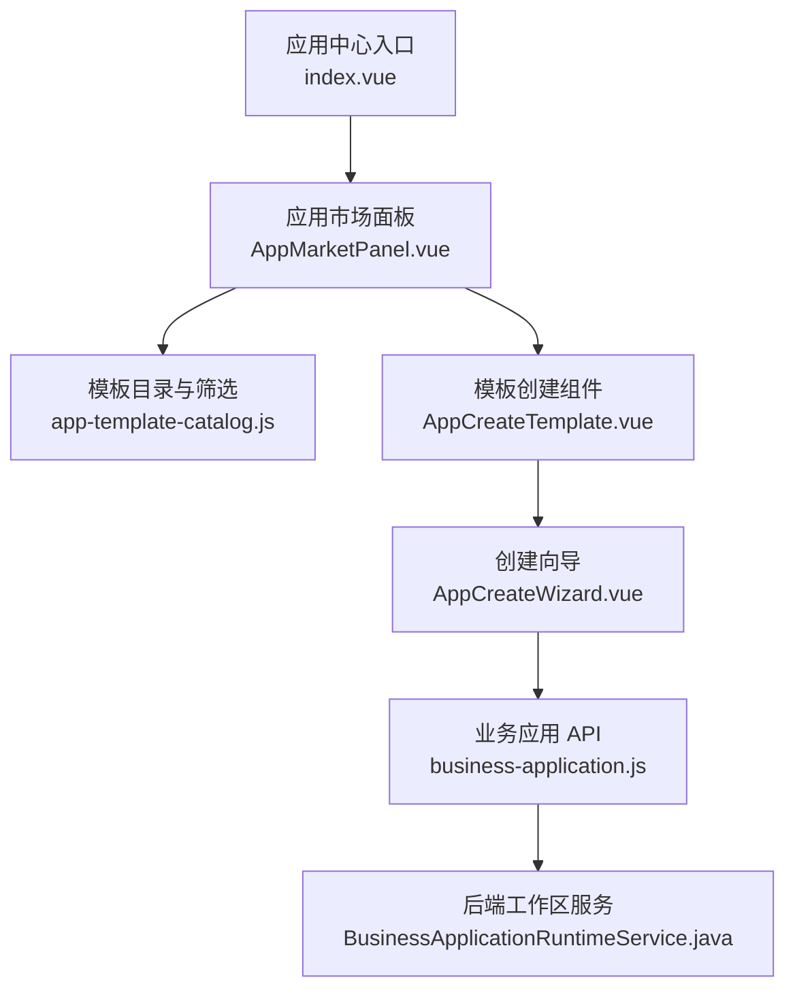
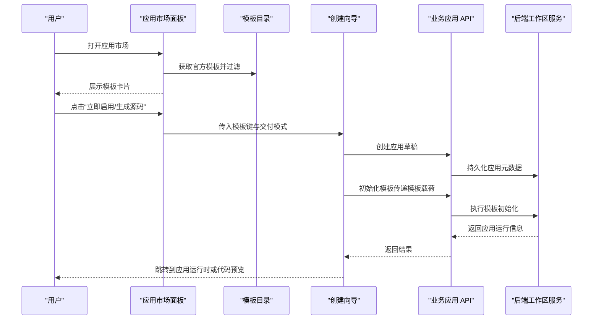
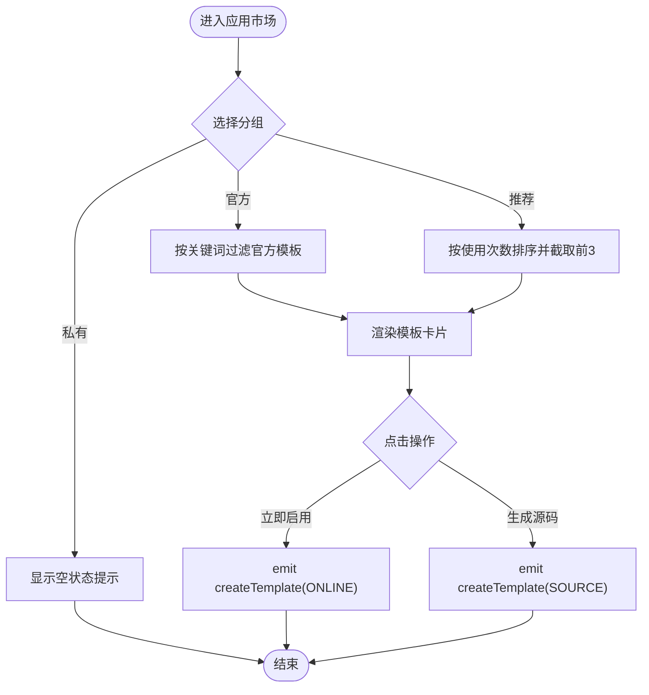
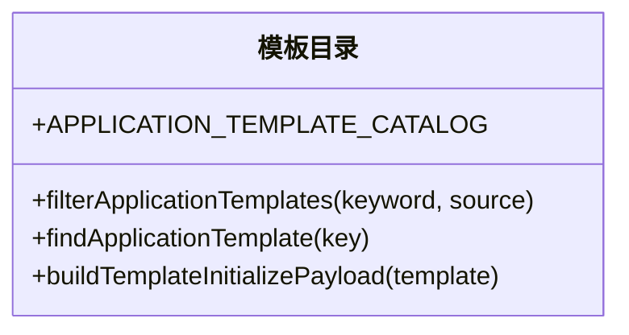
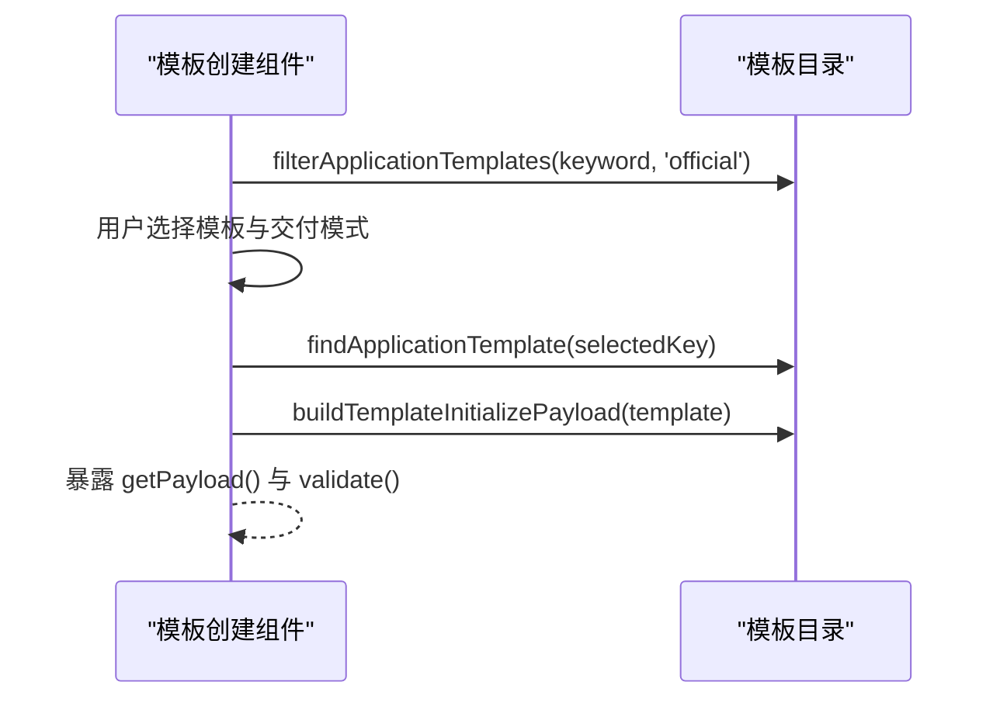
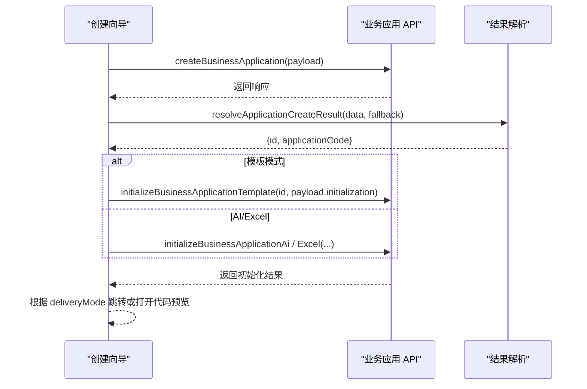
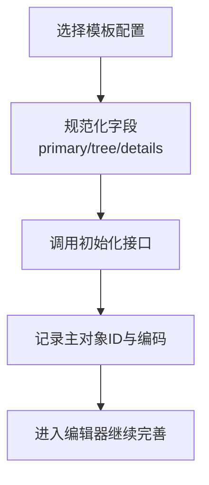
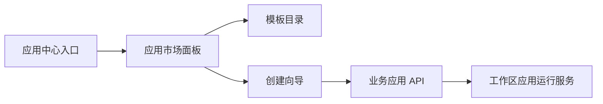

# 应用市场

<cite>
**本文引用的文件**
- [应用中心入口](file://forge-admin-ui/src/views/app-center/index.vue)
- [应用市场面板](file://forge-admin-ui/src/views/app-center/components/AppMarketPanel.vue)
- [模板目录与筛选](file://forge-admin-ui/src/views/app-center/components/create/app-template-catalog.js)
- [模板创建组件](file://forge-admin-ui/src/views/app-center/components/create/AppCreateTemplate.vue)
- [创建向导](file://forge-admin-ui/src/views/app-center/components/AppCreateWizard.vue)
- [业务应用 API](file://forge-admin-ui/src/api/business-application.js)
- [应用创建结果解析](file://forge-admin-ui/src/views/app-center/components/application-create-result.js)
- [编辑器抽屉初始化模板](file://forge-admin-ui/src/views/app-center/components/ApplicationEditorDrawer.vue)
- [路由配置（应用运行时）](file://forge-admin-ui/src/router/index.js)
- [工作区应用运行服务](file://forge-server/forge-framework/forge-plugin-parent/forge-plugin-generator/src/main/java/com/mdframe/forge/plugin/generator/service/businessapp/BusinessApplicationRuntimeService.java)
</cite>

## 目录
1. [简介](#简介)
2. [项目结构](#项目结构)
3. [核心组件](#核心组件)
4. [架构总览](#架构总览)
5. [详细组件分析](#详细组件分析)
6. [依赖关系分析](#依赖关系分析)
7. [性能考量](#性能考量)
8. [故障排查指南](#故障排查指南)
9. [结论](#结论)
10. [附录](#附录)

## 简介
本文件为 Forge Admin 的“应用市场”功能提供完整文档，覆盖界面设计、功能特性、技术实现与使用指导。重点包括：
- 应用模板浏览、搜索过滤、详情查看、一键部署（在线启用/生成源码）
- 官方模板分类、标签与使用次数等社区化指标
- 模板标准化规范、兼容性检查、依赖管理的技术路径
- 市场使用流程与贡献模板的最佳实践
- 企业级应用模板分享与复用的案例说明

## 项目结构
应用市场位于“应用中心”页面中，通过顶部 Tab 切换至“应用市场”。市场面板展示官方模板卡片，支持关键词搜索与推荐排序；点击“立即启用”或“生成源码”进入创建向导，完成应用的初始化与交付。

**图表来源**
- [应用中心入口:1-200](file://forge-admin-ui/src/views/app-center/index.vue#L1-L200)
- [应用市场面板:1-124](file://forge-admin-ui/src/views/app-center/components/AppMarketPanel.vue#L1-L124)
- [模板目录与筛选:1-99](file://forge-admin-ui/src/views/app-center/components/create/app-template-catalog.js#L1-L99)
- [模板创建组件:1-102](file://forge-admin-ui/src/views/app-center/components/create/AppCreateTemplate.vue#L1-L102)
- [创建向导:78-258](file://forge-admin-ui/src/views/app-center/components/AppCreateWizard.vue#L78-L258)
- [业务应用 API:76-110](file://forge-admin-ui/src/api/business-application.js#L76-L110)
- [工作区应用运行服务:49-74](file://forge-server/forge-framework/forge-plugin-parent/forge-plugin-generator/src/main/java/com/mdframe/forge/plugin/generator/service/businessapp/BusinessApplicationRuntimeService.java#L49-L74)

**章节来源**
- [应用中心入口:1-200](file://forge-admin-ui/src/views/app-center/index.vue#L1-L200)

## 核心组件
- 应用市场面板：负责模板列表渲染、分组（官方/组织私有/推荐）、关键词搜索、空状态提示与卡片交互。
- 模板目录与筛选：维护官方模板清单、按名称/分类/描述进行本地过滤、根据模板键查找模板、构建初始化载荷。
- 模板创建组件：在向导内展示模板选择、交付模式（在线/源码）切换、校验与载荷组装。
- 创建向导：编排空白/AI/Excel/模板四种创建模式，调用后端接口完成应用创建与初始化。
- 业务应用 API：封装应用创建、模板初始化、AI 初始化、Excel 初始化等接口。
- 应用创建结果解析：统一处理服务端返回的应用 ID 与编码，保证跳转与后续流程稳定。
- 编辑器抽屉初始化模板：在编辑器侧将模板配置规范化并调用模板初始化接口。

**章节来源**
- [应用市场面板:1-124](file://forge-admin-ui/src/views/app-center/components/AppMarketPanel.vue#L1-L124)
- [模板目录与筛选:1-99](file://forge-admin-ui/src/views/app-center/components/create/app-template-catalog.js#L1-L99)
- [模板创建组件:1-102](file://forge-admin-ui/src/views/app-center/components/create/AppCreateTemplate.vue#L1-L102)
- [创建向导:78-258](file://forge-admin-ui/src/views/app-center/components/AppCreateWizard.vue#L78-L258)
- [业务应用 API:76-110](file://forge-admin-ui/src/api/business-application.js#L76-L110)
- [应用创建结果解析:1-10](file://forge-admin-ui/src/views/app-center/components/application-create-result.js#L1-L10)
- [编辑器抽屉初始化模板:471-500](file://forge-admin-ui/src/views/app-center/components/ApplicationEditorDrawer.vue#L471-L500)

## 架构总览
应用市场的前端以“面板 + 目录 + 向导 + API”的分层方式组织，后端通过工作区应用运行服务提供运行时能力与发布快照能力，确保应用可被正确分发到工作台。

**图表来源**
- [应用市场面板:1-124](file://forge-admin-ui/src/views/app-center/components/AppMarketPanel.vue#L1-L124)
- [模板目录与筛选:75-99](file://forge-admin-ui/src/views/app-center/components/create/app-template-catalog.js#L75-L99)
- [创建向导:212-242](file://forge-admin-ui/src/views/app-center/components/AppCreateWizard.vue#L212-L242)
- [业务应用 API:104-110](file://forge-admin-ui/src/api/business-application.js#L104-L110)
- [工作区应用运行服务:49-74](file://forge-server/forge-framework/forge-plugin-parent/forge-plugin-generator/src/main/java/com/mdframe/forge/plugin/generator/service/businessapp/BusinessApplicationRuntimeService.java#L49-L74)

## 详细组件分析

### 应用市场面板（AppMarketPanel.vue）
- 功能要点
  - 分组切换：官方模板、组织私有模板、推荐应用
  - 关键词搜索：对模板名称、分类、描述进行本地模糊匹配
  - 推荐排序：按 useCount 降序取前 3 项
  - 卡片展示：图标、布局类型、描述、启用次数、交付模式提示
  - 交互：点击按钮触发“创建模板”事件，携带 deliveryMode 与 template
- 关键逻辑
  - visibleTemplates 计算属性决定当前可见模板集合
  - emptyDescription 根据分组显示不同空态文案
  - layoutLabel 将模板代码映射为中文布局名
  - templateAccent 为不同模板设置主题色变量

**图表来源**
- [应用市场面板:1-124](file://forge-admin-ui/src/views/app-center/components/AppMarketPanel.vue#L1-L124)

**章节来源**
- [应用市场面板:1-124](file://forge-admin-ui/src/views/app-center/components/AppMarketPanel.vue#L1-L124)

### 模板目录与筛选（app-template-catalog.js）
- 数据结构
  - APPLICATION_TEMPLATE_CATALOG：定义官方模板清单，包含 key、name、category、source、icon、description、useCount、templateCode、initialization
- 工具函数
  - filterApplicationTemplates：按 source 与 keyword 过滤模板
  - findApplicationTemplate：按 key 查找模板
  - buildTemplateInitializePayload：从模板构建初始化载荷（保留 templateCode 与 initialization）

**图表来源**
- [模板目录与筛选:1-99](file://forge-admin-ui/src/views/app-center/components/create/app-template-catalog.js#L1-L99)

**章节来源**
- [模板目录与筛选:1-99](file://forge-admin-ui/src/views/app-center/components/create/app-template-catalog.js#L1-L99)

### 模板创建组件（AppCreateTemplate.vue）
- 功能要点
  - 搜索与选择模板
  - 交付模式切换：在线使用 / 生成源码
  - 校验：必须选择有效模板
  - 载荷组装：返回 template、initialization、deliveryMode
- 与目录的关系
  - 复用 filterApplicationTemplates、findApplicationTemplate、buildTemplateInitializePayload

**图表来源**
- [模板创建组件:1-102](file://forge-admin-ui/src/views/app-center/components/create/AppCreateTemplate.vue#L1-L102)
- [模板目录与筛选:75-99](file://forge-admin-ui/src/views/app-center/components/create/app-template-catalog.js#L75-L99)

**章节来源**
- [模板创建组件:1-102](file://forge-admin-ui/src/views/app-center/components/create/AppCreateTemplate.vue#L1-L102)

### 创建向导（AppCreateWizard.vue）
- 功能要点
  - 多模式创建：空白、AI、Excel、模板
  - 创建草稿：调用 createBusinessApplication
  - 初始化：根据模式调用 initializeBusinessApplicationTemplate / Ai / Excel
  - 结果处理：resolveApplicationCreateResult 提取 id 与 applicationCode
- 与 API 的协作
  - 通过 business-application.js 发起请求
  - 模板初始化时传递由模板目录构建的初始化载荷

**图表来源**
- [创建向导:212-242](file://forge-admin-ui/src/views/app-center/components/AppCreateWizard.vue#L212-L242)
- [业务应用 API:104-110](file://forge-admin-ui/src/api/business-application.js#L104-L110)
- [应用创建结果解析:1-10](file://forge-admin-ui/src/views/app-center/components/application-create-result.js#L1-L10)

**章节来源**
- [创建向导:212-242](file://forge-admin-ui/src/views/app-center/components/AppCreateWizard.vue#L212-L242)
- [业务应用 API:104-110](file://forge-admin-ui/src/api/business-application.js#L104-L110)
- [应用创建结果解析:1-10](file://forge-admin-ui/src/views/app-center/components/application-create-result.js#L1-L10)

### 编辑器抽屉初始化模板（ApplicationEditorDrawer.vue）
- 功能要点
  - 将模板配置规范化（primarySource、treeSource、details 等）
  - 调用 initializeBusinessApplicationTemplate 完成对象与关系初始化
  - 记录创建的 primaryObjectId 与 primaryObjectCode 以便后续编辑

**图表来源**
- [编辑器抽屉初始化模板:471-500](file://forge-admin-ui/src/views/app-center/components/ApplicationEditorDrawer.vue#L471-L500)

**章节来源**
- [编辑器抽屉初始化模板:471-500](file://forge-admin-ui/src/views/app-center/components/ApplicationEditorDrawer.vue#L471-L500)

## 依赖关系分析
- 前端依赖链
  - index.vue 引入 AppMarketPanel 作为“应用市场”视图
  - AppMarketPanel 依赖 app-template-catalog.js 进行本地过滤与展示
  - AppCreateTemplate 与 AppCreateWizard 共同完成模板选择的交互与后端调用
  - business-application.js 封装所有与后端相关的 HTTP 请求
- 后端依赖点
  - BusinessApplicationRuntimeService 提供工作区应用分发与运行时读取能力，保障应用可见性与可达首页

**图表来源**
- [应用中心入口:1-200](file://forge-admin-ui/src/views/app-center/index.vue#L1-L200)
- [应用市场面板:1-124](file://forge-admin-ui/src/views/app-center/components/AppMarketPanel.vue#L1-L124)
- [模板目录与筛选:1-99](file://forge-admin-ui/src/views/app-center/components/create/app-template-catalog.js#L1-L99)
- [创建向导:212-242](file://forge-admin-ui/src/views/app-center/components/AppCreateWizard.vue#L212-L242)
- [业务应用 API:104-110](file://forge-admin-ui/src/api/business-application.js#L104-L110)
- [工作区应用运行服务:49-74](file://forge-server/forge-framework/forge-plugin-parent/forge-plugin-generator/src/main/java/com/mdframe/forge/plugin/generator/service/businessapp/BusinessApplicationRuntimeService.java#L49-L74)

**章节来源**
- [应用中心入口:1-200](file://forge-admin-ui/src/views/app-center/index.vue#L1-L200)
- [工作区应用运行服务:49-74](file://forge-server/forge-framework/forge-plugin-parent/forge-plugin-generator/src/main/java/com/mdframe/forge/plugin/generator/service/businessapp/BusinessApplicationRuntimeService.java#L49-L74)

## 性能考量
- 本地过滤与排序
  - 模板数量较小，采用前端本地过滤与排序，减少网络开销
  - 推荐应用仅取前 3 条，避免不必要的渲染
- 懒加载与异步组件
  - 创建向导中的子模块按需加载，降低首屏体积
- 空状态与骨架屏
  - 合理展示空状态与加载中反馈，提升感知性能
- 建议优化
  - 当模板规模增长时，考虑分页或虚拟滚动
  - 对关键词搜索增加防抖，减少频繁重算
  - 对 useCount 排序可在后端预聚合，前端直接取已排序结果

[本节为通用性能建议，不直接分析具体文件]

## 故障排查指南
- 未返回应用编码
  - 现象：创建成功后无法跳转
  - 定位：application-create-result.js 会抛出明确错误
  - 处理：检查后端返回结构与前端解析逻辑
- 未选择模板
  - 现象：提交时报错
  - 定位：AppCreateTemplate.validate 会校验 selectedKey
  - 处理：确保用户已选择有效模板
- 组织私有模板为空
  - 现象：切换到“组织私有模板”显示空状态
  - 定位：AppMarketPanel 当前未接入持久化协议，不会展示虚构数据
  - 处理：等待组织模板持久化协议接入后生效
- 路由跳转异常
  - 现象：应用运行时页面无法访问
  - 定位：router/index.js 中对 applicationCode 的校验与重定向
  - 处理：确认 applicationCode 非空且存在对应应用

**章节来源**
- [应用创建结果解析:1-10](file://forge-admin-ui/src/views/app-center/components/application-create-result.js#L1-L10)
- [模板创建组件:86-90](file://forge-admin-ui/src/views/app-center/components/create/AppCreateTemplate.vue#L86-L90)
- [应用市场面板:64-100](file://forge-admin-ui/src/views/app-center/components/AppMarketPanel.vue#L64-L100)
- [路由配置（应用运行时）:143-176](file://forge-admin-ui/src/router/index.js#L143-L176)

## 结论
应用市场以“官方模板为主、组织私有待接入”的方式提供开箱即用的业务应用模板。通过本地筛选、可视化卡片与向导式创建，用户可以快速发现、评估并一键部署模板应用。结合后端工作区应用运行服务，确保应用在工作台的可见性与可用性。未来可逐步扩展组织私有模板的持久化、评分评价、标签体系与社区生态机制，进一步提升模板共享与复用效率。

[本节为总结性内容，不直接分析具体文件]

## 附录

### 使用指导：如何发现与选择合适的业务应用模板
- 打开“应用中心”，切换到“应用市场”
- 使用关键词搜索模板名称、分类或场景
- 在“官方模板”中浏览卡片信息（图标、布局类型、描述、启用次数）
- 如需优先尝试热门模板，切换到“推荐应用”
- 点击“立即启用”在线创建，或“生成源码”下载源码进行二次开发

**章节来源**
- [应用中心入口:1-200](file://forge-admin-ui/src/views/app-center/index.vue#L1-L200)
- [应用市场面板:1-124](file://forge-admin-ui/src/views/app-center/components/AppMarketPanel.vue#L1-L124)

### 技术实现：模板标准化规范、兼容性检查、依赖管理
- 标准化规范
  - 模板条目包含 key、name、category、source、icon、description、useCount、templateCode、initialization
  - templateCode 区分单表 CRUD、左树右表、主从协作等布局类型
- 兼容性检查
  - 前端在创建向导中进行基础校验（如必须选择模板）
  - 后端通过工作区应用运行服务校验应用可见范围与可达首页
- 依赖管理
  - 主从关系通过 details 数组声明外键字段与关系名
  - 树形结构通过 treeKeyField、treeLabelField、treeParentField、primaryTreeField 等字段声明

**章节来源**
- [模板目录与筛选:1-99](file://forge-admin-ui/src/views/app-center/components/create/app-template-catalog.js#L1-L99)
- [编辑器抽屉初始化模板:471-500](file://forge-admin-ui/src/views/app-center/components/ApplicationEditorDrawer.vue#L471-L500)
- [工作区应用运行服务:49-74](file://forge-server/forge-framework/forge-plugin-parent/forge-plugin-generator/src/main/java/com/mdframe/forge/plugin/generator/service/businessapp/BusinessApplicationRuntimeService.java#L49-L74)

### 社区化功能：分类、标签、评分评价
- 分类管理
  - 模板通过 category 字段进行分类（如客户经营、进销存、项目管理）
- 标签系统
  - 当前以 category 与 templateCode 作为主要标识，可扩展 tag 字段用于更细粒度标签
- 评分评价
  - 当前使用 useCount 作为热度指标，可在此基础上扩展评分与评论机制

**章节来源**
- [模板目录与筛选:1-99](file://forge-admin-ui/src/views/app-center/components/create/app-template-catalog.js#L1-L99)
- [应用市场面板:1-124](file://forge-admin-ui/src/views/app-center/components/AppMarketPanel.vue#L1-L124)

### 最佳实践：企业级应用模板分享与复用
- 模板命名与描述
  - 使用清晰的 name 与 description，便于搜索与理解
- 布局选择
  - 根据业务复杂度选择 SINGLE_CRUD、TREE_TABLE、MASTER_DETAIL
- 初始化载荷
  - 明确 primaryObjectCode、primaryKeyField、details 的外键与关系名
- 交付模式
  - 在线启用适合快速验证与演示；生成源码适合深度定制与集成
- 复用机制
  - 通过统一模板目录与初始化载荷，确保跨团队一致性与可维护性

**章节来源**
- [模板目录与筛选:1-99](file://forge-admin-ui/src/views/app-center/components/create/app-template-catalog.js#L1-L99)
- [模板创建组件:1-102](file://forge-admin-ui/src/views/app-center/components/create/AppCreateTemplate.vue#L1-L102)
- [创建向导:212-242](file://forge-admin-ui/src/views/app-center/components/AppCreateWizard.vue#L212-L242)