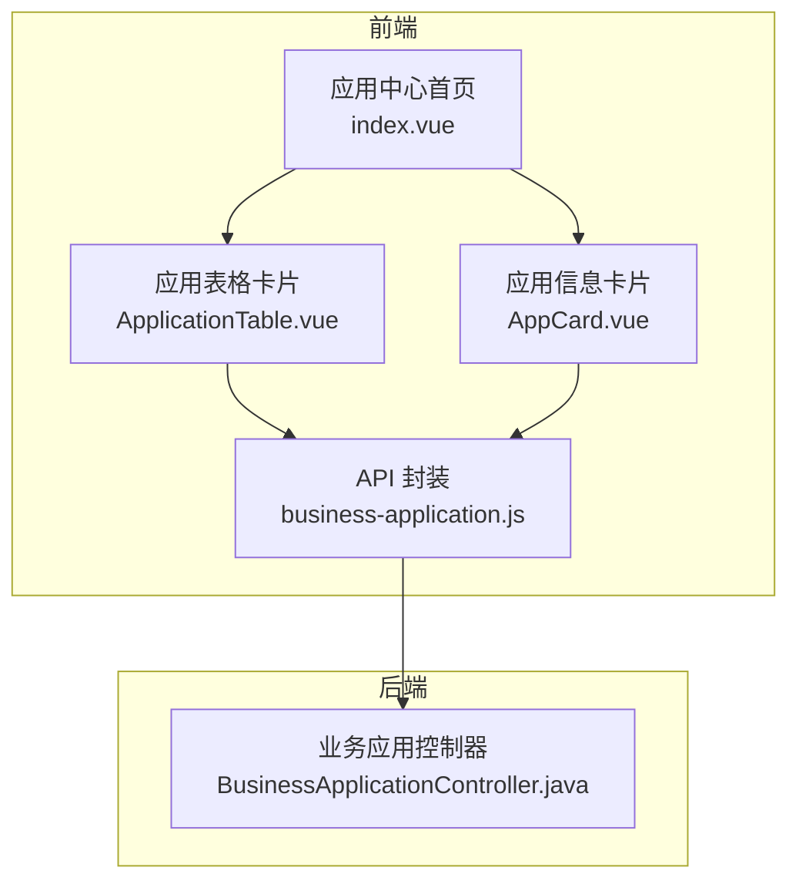
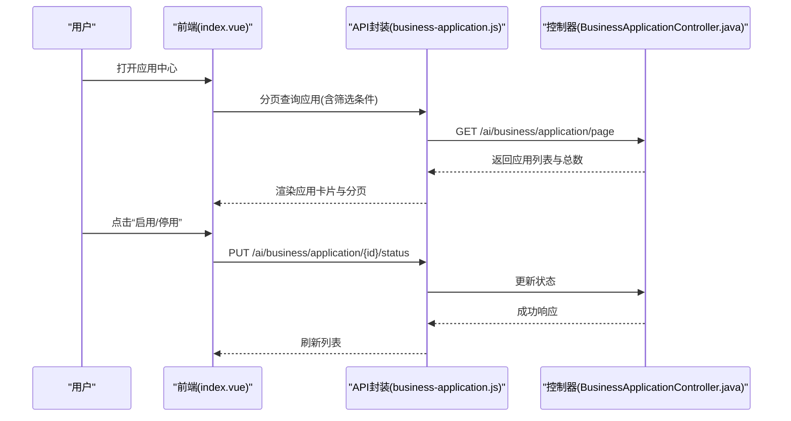
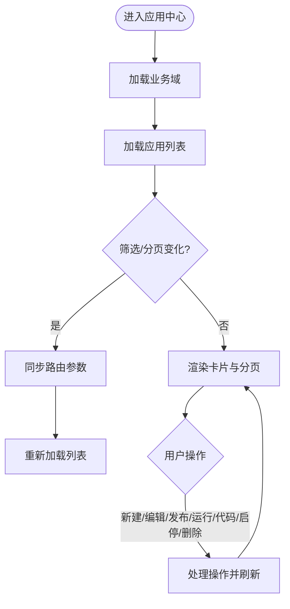
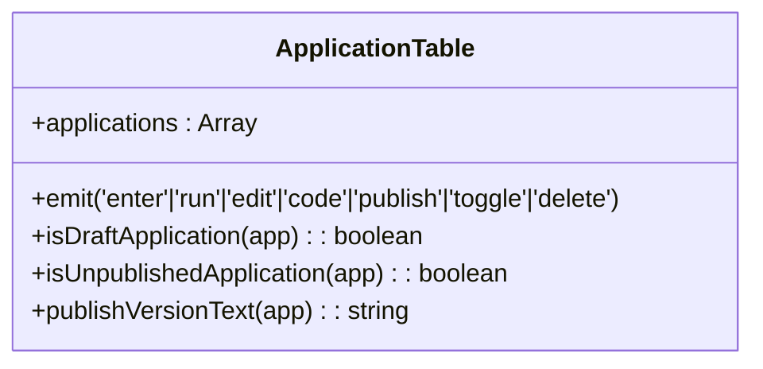
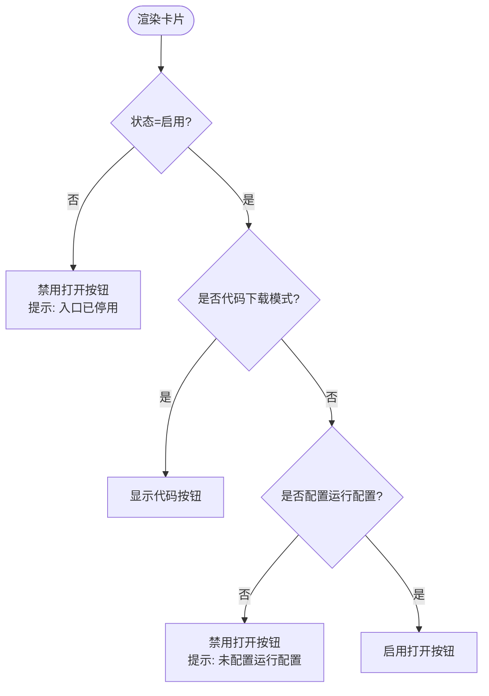
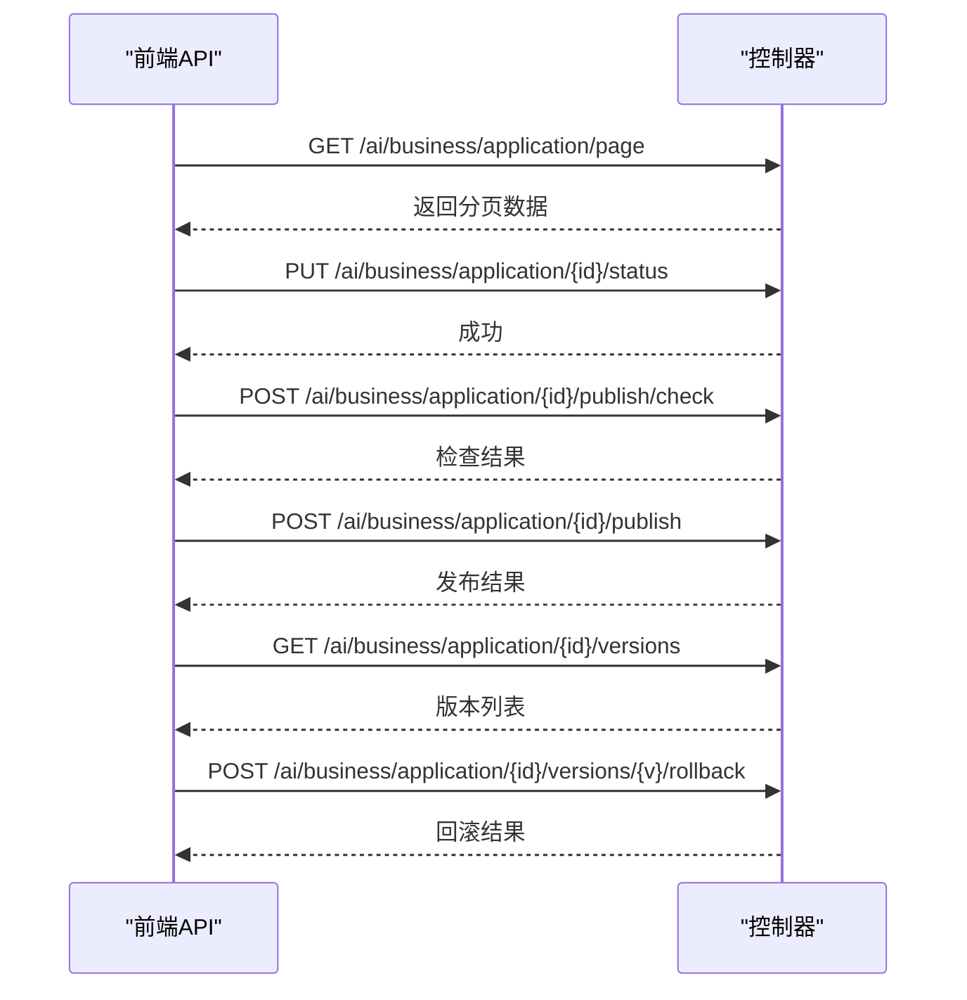
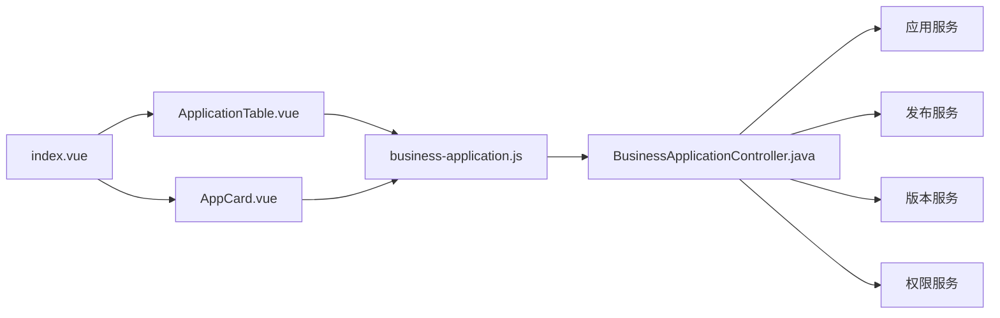

# 应用管理

<cite>
**本文引用的文件**
- [index.vue](file://forge-admin-ui/src/views/app-center/index.vue)
- [AppCard.vue](file://forge-admin-ui/src/views/app-center/components/AppCard.vue)
- [ApplicationTable.vue](file://forge-admin-ui/src/views/app-center/components/ApplicationTable.vue)
- [business-application.js](file://forge-admin-ui/src/api/business-application.js)
- [BusinessApplicationController.java](file://forge-server/forge-framework/forge-plugin-parent/forge-plugin-generator/src/main/java/com/mdframe/forge/plugin/generator/controller/BusinessApplicationController.java)
</cite>

## 目录
1. [简介](#简介)
2. [项目结构](#项目结构)
3. [核心组件](#核心组件)
4. [架构总览](#架构总览)
5. [详细组件分析](#详细组件分析)
6. [依赖关系分析](#依赖关系分析)
7. [性能与可用性](#性能与可用性)
8. [故障排查指南](#故障排查指南)
9. [结论](#结论)
10. [附录：企业级管理流程](#附录企业级管理流程)

## 简介
本文件面向 Forge Admin 的“应用管理”能力，覆盖应用的查看、编辑、删除、启用/停用、发布与版本回滚、权限配置、代码下载等全生命周期管理。文档从前端页面与卡片组件、后端接口与权限控制、版本管理与发布流水线、以及企业级批量操作与导入导出等方面，提供端到端的说明与实践建议，帮助高效维护大量业务应用。

## 项目结构
应用管理在前端位于应用中心视图，包含列表页、筛选栏、应用卡片与抽屉式编辑器；在后端由统一的控制器暴露分页查询、详情、状态变更、发布与版本管理等接口。

**图表来源**
- [index.vue:1-235](file://forge-admin-ui/src/views/app-center/index.vue#L1-L235)
- [ApplicationTable.vue:1-107](file://forge-admin-ui/src/views/app-center/components/ApplicationTable.vue#L1-L107)
- [AppCard.vue:1-46](file://forge-admin-ui/src/views/app-center/components/AppCard.vue#L1-L46)
- [business-application.js:15-86](file://forge-admin-ui/src/api/business-application.js#L15-L86)
- [BusinessApplicationController.java:76-101](file://forge-server/forge-framework/forge-plugin-parent/forge-plugin-generator/src/main/java/com/mdframe/forge/plugin/generator/controller/BusinessApplicationController.java#L76-L101)

**章节来源**
- [index.vue:1-235](file://forge-admin-ui/src/views/app-center/index.vue#L1-L235)
- [ApplicationTable.vue:1-107](file://forge-admin-ui/src/views/app-center/components/ApplicationTable.vue#L1-L107)
- [AppCard.vue:1-46](file://forge-admin-ui/src/views/app-center/components/AppCard.vue#L1-L46)
- [business-application.js:15-86](file://forge-admin-ui/src/api/business-application.js#L15-L86)
- [BusinessApplicationController.java:76-101](file://forge-server/forge-framework/forge-plugin-parent/forge-plugin-generator/src/main/java/com/mdframe/forge/plugin/generator/controller/BusinessApplicationController.java#L76-L101)

## 核心组件
- 应用中心首页（index.vue）
  - 负责业务域导航、应用筛选（关键词、设计状态、运行状态）、分页加载、新建/编辑/发布/运行/代码面板等入口。
  - 通过路由参数同步状态，支持“我的应用/应用市场”双视图。
- 应用表格（ApplicationTable.vue）
  - 以卡片网格展示应用，显示设计状态、发布版本、页面数量、更新时间等元信息。
  - 提供“编辑/运行/发布/预览与下载代码/启用或停用/删除”等操作。
- 应用信息卡片（AppCard.vue）
  - 展示应用图标、名称、描述、类型标签、绑定能力数、是否可下载代码等。
  - 根据运行模式与状态控制“打开/代码”按钮可用性与提示。
- API 封装（business-application.js）
  - 统一封装分页、详情、状态更新、删除、发布检查与执行、版本查询与回滚、代码下载等接口。
  - 对敏感请求进行加密传输，为耗时操作设置超时与全局加载提示。
- 后端控制器（BusinessApplicationController.java）
  - 提供分页查询、详情、门户地址校验、AI助理配置、分发工作台、发布与版本、运行时等聚合接口。
  - 使用权限注解与操作日志注解保障安全与审计。

**章节来源**
- [index.vue:105-235](file://forge-admin-ui/src/views/app-center/index.vue#L105-L235)
- [ApplicationTable.vue:1-180](file://forge-admin-ui/src/views/app-center/components/ApplicationTable.vue#L1-L180)
- [AppCard.vue:1-133](file://forge-admin-ui/src/views/app-center/components/AppCard.vue#L1-L133)
- [business-application.js:15-310](file://forge-admin-ui/src/api/business-application.js#L15-L310)
- [BusinessApplicationController.java:76-200](file://forge-server/forge-framework/forge-plugin-parent/forge-plugin-generator/src/main/java/com/mdframe/forge/plugin/generator/controller/BusinessApplicationController.java#L76-L200)

## 架构总览
应用管理采用前后端分离架构：前端通过受控的 API 层调用后端控制器，控制器再委派给服务层完成数据访问与业务编排。关键交互包括：
- 列表与筛选：前端发起分页查询，后端返回应用集合与总数。
- 状态切换：前端触发启用/停用，后端更新应用状态并记录日志。
- 发布与版本：前端发起发布检查与执行，后端生成版本记录与发布运行记录，支持回滚与恢复。
- 权限控制：接口通过权限注解限制访问范围，结合角色与数据范围实现细粒度控制。

**图表来源**
- [index.vue:443-466](file://forge-admin-ui/src/views/app-center/index.vue#L443-L466)
- [business-application.js:15-86](file://forge-admin-ui/src/api/business-application.js#L15-L86)
- [BusinessApplicationController.java:103-131](file://forge-server/forge-framework/forge-plugin-parent/forge-plugin-generator/src/main/java/com/mdframe/forge/plugin/generator/controller/BusinessApplicationController.java#L103-L131)

## 详细组件分析

### 应用中心首页（index.vue）
- 功能要点
  - 视图切换：我的应用/应用市场。
  - 筛选与分页：关键词、设计状态、运行状态、业务域、最近使用、页码与每页条数。
  - 应用操作：新建、编辑、运行、发布、代码面板、启用/停用、删除。
  - 状态同步：将筛选与分页状态同步到路由查询参数，支持分享与回退。
  - 事件监听：页面可见性变化时刷新；监听发布事件后刷新列表。
- 关键流程
  - 加载业务域与应用列表，构建树形业务域与统计。
  - 切换筛选或分页时重置页码并重新加载。
  - 打开应用运行时，根据初始化模式决定是否进入编辑流程。
  - 启用/停用与删除前弹出确认框，成功后刷新列表与业务域计数。

**图表来源**
- [index.vue:407-466](file://forge-admin-ui/src/views/app-center/index.vue#L407-L466)
- [index.vue:468-519](file://forge-admin-ui/src/views/app-center/index.vue#L468-L519)
- [index.vue:521-648](file://forge-admin-ui/src/views/app-center/index.vue#L521-L648)

**章节来源**
- [index.vue:1-235](file://forge-admin-ui/src/views/app-center/index.vue#L1-L235)
- [index.vue:407-648](file://forge-admin-ui/src/views/app-center/index.vue#L407-L648)

### 应用表格（ApplicationTable.vue）
- UI元素
  - 头部：应用图标、名称与编码、设计状态标签。
  - 标签区：业务域、页面数量。
  - 主体：发布状态（已发布/未发布/有变更未发布）、描述。
  - 底部：更新时间、版本号、操作按钮（编辑/运行/发布/更多）。
- 行为逻辑
  - 根据设计状态判断是否为草稿或未发布，动态显示“发布”或“运行”。
  - 更多菜单包含“预览与下载代码”“应用设置”“启用/停用”“删除”。
  - 键盘可达性：支持回车键触发进入。

**图表来源**
- [ApplicationTable.vue:1-180](file://forge-admin-ui/src/views/app-center/components/ApplicationTable.vue#L1-L180)

**章节来源**
- [ApplicationTable.vue:1-180](file://forge-admin-ui/src/views/app-center/components/ApplicationTable.vue#L1-L180)

### 应用信息卡片（AppCard.vue）
- UI元素
  - 图标区域：优先显示自定义图标，否则默认图标。
  - 标题行：应用名与启用/停用状态标签。
  - 描述与标签：类型、入口模式、是否可下载代码、关联对象、能力绑定数。
  - 操作区：“打开/代码”按钮与“更多”下拉菜单（配置入口、功能代码、启用/停用、删除）。
- 行为逻辑
  - 根据运行模式与状态禁用“打开”按钮，提示“入口已停用”或“未配置运行配置”。
  - 当为“代码下载”模式时，“打开”按钮变为“代码”，并允许查看功能代码。

**图表来源**
- [AppCard.vue:62-81](file://forge-admin-ui/src/views/app-center/components/AppCard.vue#L62-L81)
- [AppCard.vue:83-115](file://forge-admin-ui/src/views/app-center/components/AppCard.vue#L83-L115)

**章节来源**
- [AppCard.vue:1-133](file://forge-admin-ui/src/views/app-center/components/AppCard.vue#L1-L133)

### API 封装与后端接口
- 前端 API
  - 分页与列表：businessApplicationPage、businessApplicationList。
  - 详情与查找：businessApplicationDetail、by-code、by-slug。
  - 状态与删除：updateBusinessApplicationStatus、deleteBusinessApplication。
  - 发布与版本：checkBusinessApplicationPublish、publishBusinessApplication、versions、versionDetail、rollback。
  - 代码下载：downloadBusinessApplicationCode（带鉴权头与全局加载）。
- 后端控制器
  - 分页查询、列表、工作台应用、详情、门户地址校验、AI助理配置、分发工作台、发布检查与执行、版本与回滚、运行时等。
  - 使用权限注解（如 ai:businessApplication:list/edit/portal）与操作日志注解。

**图表来源**
- [business-application.js:15-310](file://forge-admin-ui/src/api/business-application.js#L15-L310)
- [BusinessApplicationController.java:103-200](file://forge-server/forge-framework/forge-plugin-parent/forge-plugin-generator/src/main/java/com/mdframe/forge/plugin/generator/controller/BusinessApplicationController.java#L103-L200)

**章节来源**
- [business-application.js:15-310](file://forge-admin-ui/src/api/business-application.js#L15-L310)
- [BusinessApplicationController.java:103-200](file://forge-server/forge-framework/forge-plugin-parent/forge-plugin-generator/src/main/java/com/mdframe/forge/plugin/generator/controller/BusinessApplicationController.java#L103-L200)

## 依赖关系分析
- 前端依赖
  - index.vue 依赖 ApplicationTable、AppCard、过滤栏、创建向导、编辑器抽屉、代码面板等子组件。
  - 所有子组件通过 business-application.js 调用后端接口。
- 后端依赖
  - BusinessApplicationController 组合多个服务：应用服务、对象服务、表单数据服务、页面设计服务、模板服务、AI初始化服务、工作空间服务、权限服务、发布服务、版本服务、发布运行服务、回滚服务、运行时服务、代码生成服务。
- 耦合与内聚
  - 控制器作为聚合入口，保持高内聚的业务编排；各服务专注单一职责。
  - 前端通过明确的 API 边界解耦 UI 与后端实现。

**图表来源**
- [index.vue:237-266](file://forge-admin-ui/src/views/app-center/index.vue#L237-L266)
- [business-application.js:15-310](file://forge-admin-ui/src/api/business-application.js#L15-L310)
- [BusinessApplicationController.java:86-101](file://forge-server/forge-framework/forge-plugin-parent/forge-plugin-generator/src/main/java/com/mdframe/forge/plugin/generator/controller/BusinessApplicationController.java#L86-L101)

**章节来源**
- [index.vue:237-266](file://forge-admin-ui/src/views/app-center/index.vue#L237-L266)
- [business-application.js:15-310](file://forge-admin-ui/src/api/business-application.js#L15-L310)
- [BusinessApplicationController.java:86-101](file://forge-server/forge-framework/forge-plugin-parent/forge-plugin-generator/src/main/java/com/mdframe/forge/plugin/generator/controller/BusinessApplicationController.java#L86-L101)

## 性能与可用性
- 列表加载优化
  - 使用分页与筛选减少单次数据量；路由参数同步便于缓存与分享。
  - 页面可见性变化时自动刷新，保证数据新鲜度。
- 发布与版本
  - 发布检查与执行分别设置超时，避免长时间阻塞；发布执行期间显示全局加载提示。
  - 版本查询与回滚接口独立，便于快速定位问题与恢复。
- 代码下载
  - 下载接口携带鉴权头与唯一标识，防止重复下载；全局加载提升用户体验。
- 前端交互
  - 卡片悬停与聚焦反馈增强可发现性；禁用态与提示文案降低误操作。

[本节为通用指导，不直接分析具体文件]

## 故障排查指南
- 常见问题
  - 应用无法打开：检查应用状态是否为启用；若为 RUNTIME 入口，需配置运行配置（configKey 或 entryUrl）。
  - 发布失败：先调用发布检查接口获取问题清单，修复后再执行发布；关注超时与网络错误。
  - 版本回滚异常：确认目标版本存在且未被删除；回滚前备份当前配置。
- 定位步骤
  - 查看应用中心列表的设计状态与发布版本，确认是否存在未发布的变更。
  - 通过 API 封装中的版本与发布运行接口，查看历史发布记录与错误信息。
  - 检查权限注解是否满足当前用户角色；必要时调整角色与数据范围。
- 日志与审计
  - 后端控制器使用操作日志注解记录关键操作，便于审计与回溯。

**章节来源**
- [AppCard.vue:62-81](file://forge-admin-ui/src/views/app-center/components/AppCard.vue#L62-L81)
- [business-application.js:250-294](file://forge-admin-ui/src/api/business-application.js#L250-L294)
- [BusinessApplicationController.java:103-200](file://forge-server/forge-framework/forge-plugin-parent/forge-plugin-generator/src/main/java/com/mdframe/forge/plugin/generator/controller/BusinessApplicationController.java#L103-L200)

## 结论
Forge Admin 的应用管理提供了完整的前后端能力，覆盖应用的创建、编辑、运行、发布、版本回滚、权限配置与代码下载。通过清晰的分层架构、完善的权限控制与良好的用户体验设计，能够支撑企业级的大量业务应用维护与管理需求。建议在生产环境中结合发布检查、版本管理与审计日志，建立稳定的应用交付与运维流程。

[本节为总结，不直接分析具体文件]

## 附录：企业级管理流程
- 批量操作
  - 在应用中心通过筛选与分页批量启用/停用或删除应用；注意删除前确认无启用入口依赖。
- 导入导出
  - Excel 初始化与预览接口可用于批量导入应用表单数据；导出可通过代码下载功能获取应用源码。
- 备份恢复
  - 利用版本管理与发布运行记录进行备份与恢复；回滚至稳定版本并验证运行状态。
- 权限与数据范围
  - 通过权限工作区与角色权限接口配置细粒度访问控制；结合数据范围适配器实现行级数据隔离。
- 最佳实践
  - 发布前执行检查，确保依赖与配置完整；发布后验证运行入口与关键流程。
  - 对耗时操作（发布、代码下载）提供明确的全局加载与超时提示，提升用户体验。
  - 定期审查应用状态与设计状态，清理长期未使用的草稿与废弃应用。

[本节为通用指导，不直接分析具体文件]