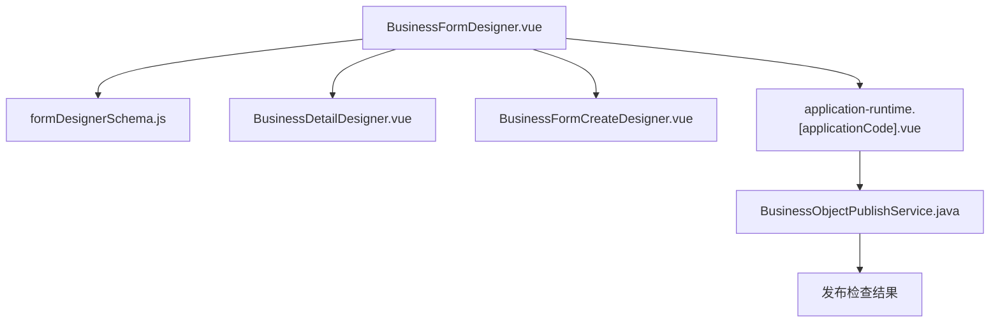
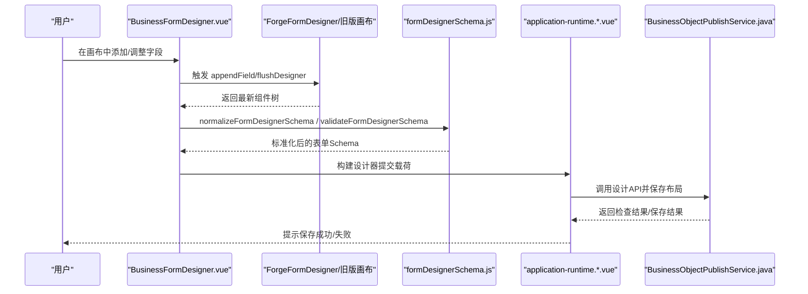
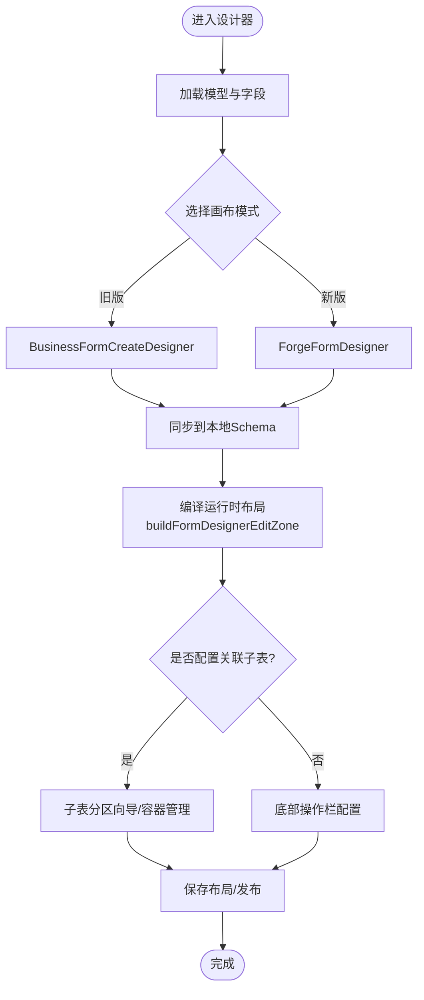
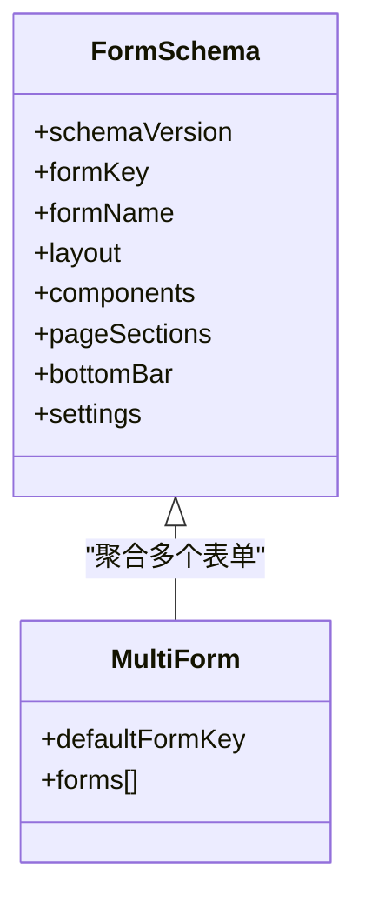
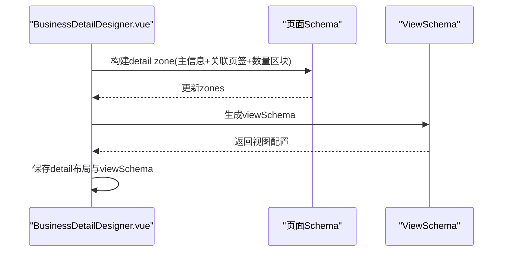
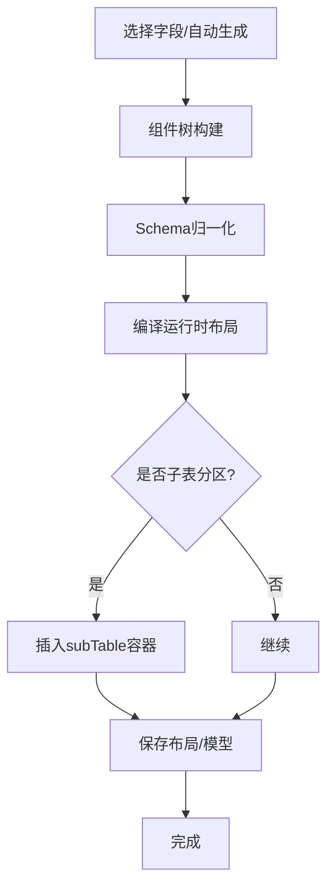
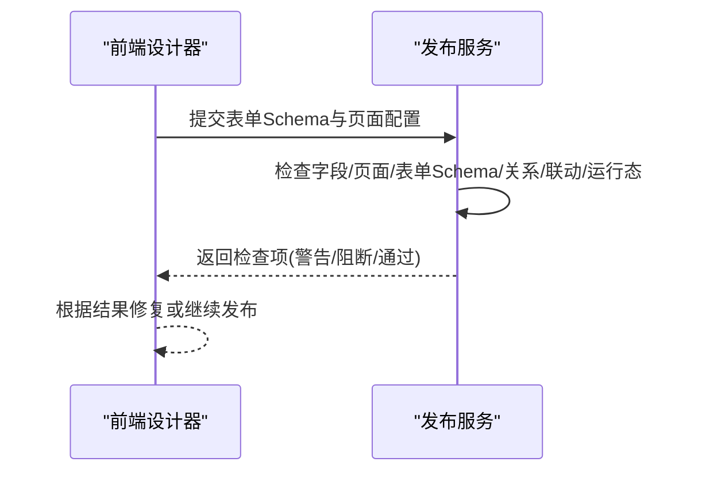
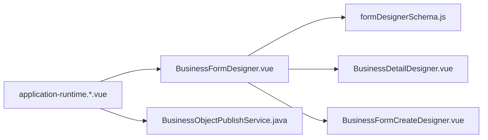

# 业务表单设计器

<cite>
**本文引用的文件**
- [BusinessFormDesigner.vue](file://forge-admin-ui/src/views/app-center/components/designer/BusinessFormDesigner.vue)
- [formDesignerSchema.js](file://forge-admin-ui/src/views/app-center/components/designer/form-first/formDesignerSchema.js)
- [BusinessDetailDesigner.vue](file://forge-admin-ui/src/views/app-center/components/designer/BusinessDetailDesigner.vue)
- [BusinessFormCreateDesigner.vue](file://forge-admin-ui/src/views/app-center/components/designer/BusinessFormCreateDesigner.vue)
- [application-runtime.[applicationCode].vue](file://forge-admin-ui/src/views/app-center/application-runtime.[applicationCode].vue)
- [BusinessObjectPublishService.java](file://forge-server/forge-framework/forge-plugin-parent/forge-plugin-generator/src/main/java/com/mdframe/forge/plugin/generator/service/businessapp/BusinessObjectPublishService.java)
- [BusinessApplicationPageDesignServiceTest.java](file://forge-server/forge-framework/forge-plugin-parent/forge-plugin-generator/src/test/java/com/mdframe/forge/plugin/generator/service/businessapp/BusinessApplicationPageDesignServiceTest.java)
</cite>

## 目录
1. [简介](#简介)
2. [项目结构](#项目结构)
3. [核心组件](#核心组件)
4. [架构总览](#架构总览)
5. [详细组件分析](#详细组件分析)
6. [依赖关系分析](#依赖关系分析)
7. [性能考虑](#性能考虑)
8. [故障排查指南](#故障排查指南)
9. [结论](#结论)
10. [附录](#附录)

## 简介
本文件面向“业务表单设计器”的完整实现与使用，围绕 BusinessFormDesigner 主组件展开，系统说明表单创建流程、高级配置选项、页面设置面板、业务对象绑定、权限控制、发布检查等关键能力。文档同时提供可视化架构图、数据流图与流程图，帮助读者快速理解并高效完成复杂业务表单的设计与集成。

## 项目结构
业务表单设计器由前端设计器与后端发布校验共同构成：
- 前端设计器
  - BusinessFormDesigner.vue：主容器，协调表单画布、关联子表、详情设置、底部操作栏等。
  - formDesignerSchema.js：表单 Schema 规范、归一化、校验、多表单资产聚合等。
  - BusinessDetailDesigner.vue：详情页设置面板（主信息展示、关联页签、数量区块等）。
  - BusinessFormCreateDesigner.vue：旧版“按字段生成”表单画布入口。
  - application-runtime.[applicationCode].vue：应用运行时保存当前表单设计并发布到后端。
- 后端发布校验
  - BusinessObjectPublishService.java：发布前检查（字段、页面、表单 Schema、关系、联动、运行态配置、单据模式等）。
  - BusinessApplicationPageDesignServiceTest.java：页面设计请求与 Schema 构造示例。

图表来源
- [BusinessFormDesigner.vue:1-300](file://forge-admin-ui/src/views/app-center/components/designer/BusinessFormDesigner.vue#L1-L300)
- [formDesignerSchema.js:341-384](file://forge-admin-ui/src/views/app-center/components/designer/form-first/formDesignerSchema.js#L341-L384)
- [BusinessDetailDesigner.vue:1-120](file://forge-admin-ui/src/views/app-center/components/designer/BusinessDetailDesigner.vue#L1-L120)
- [application-runtime.[applicationCode].vue:4353-4391](file://forge-admin-ui/src/views/app-center/application-runtime.[applicationCode].vue#L4353-L4391)
- [BusinessObjectPublishService.java:160-179](file://forge-server/forge-framework/forge-plugin-parent/forge-plugin-generator/src/main/java/com/mdframe/forge/plugin/generator/service/businessapp/BusinessObjectPublishService.java#L160-L179)

章节来源
- [BusinessFormDesigner.vue:1-300](file://forge-admin-ui/src/views/app-center/components/designer/BusinessFormDesigner.vue#L1-L300)
- [formDesignerSchema.js:341-384](file://forge-admin-ui/src/views/app-center/components/designer/form-first/formDesignerSchema.js#L341-L384)
- [BusinessDetailDesigner.vue:1-120](file://forge-admin-ui/src/views/app-center/components/designer/BusinessDetailDesigner.vue#L1-L120)
- [application-runtime.[applicationCode].vue:4353-4391](file://forge-admin-ui/src/views/app-center/application-runtime.[applicationCode].vue#L4353-L4391)
- [BusinessObjectPublishService.java:160-179](file://forge-server/forge-framework/forge-plugin-parent/forge-plugin-generator/src/main/java/com/mdframe/forge/plugin/generator/service/businessapp/BusinessObjectPublishService.java#L160-L179)

## 核心组件
- BusinessFormDesigner.vue
  - 统一编排主表单与关联子表表单；维护本地 schema、视图 schema、联动规则；将画布变更同步至编辑区 zone 与运行时布局。
  - 支持旧版“按字段生成”与新版 ForgeFormDesigner 双模式切换。
  - 管理底部操作栏 actions、子表分区向导、关联字段选择与排序。
- formDesignerSchema.js
  - 定义表单 Schema 版本、组件分类、默认布局、多表单资产聚合、校验规则、字段到组件映射等。
- BusinessDetailDesigner.vue
  - 详情页设置：主信息复用表单布局、关联页签预览、附加开关（操作日志/审批记录）、数量区块（余额/流水/锁定）配置。
- BusinessFormCreateDesigner.vue
  - 旧版表单画布，用于从字段库拖拽生成表单，并与业务对象字段资产同步。
- application-runtime.[applicationCode].vue
  - 构建设计器提交载荷，调用后端设计 API，完成表单布局与模型同步保存。

章节来源
- [BusinessFormDesigner.vue:303-700](file://forge-admin-ui/src/views/app-center/components/designer/BusinessFormDesigner.vue#L303-L700)
- [formDesignerSchema.js:341-384](file://forge-admin-ui/src/views/app-center/components/designer/form-first/formDesignerSchema.js#L341-L384)
- [BusinessDetailDesigner.vue:188-340](file://forge-admin-ui/src/views/app-center/components/designer/BusinessDetailDesigner.vue#L188-L340)
- [BusinessFormCreateDesigner.vue:1-34](file://forge-admin-ui/src/views/app-center/components/designer/BusinessFormCreateDesigner.vue#L1-L34)
- [application-runtime.[applicationCode].vue:4353-4391](file://forge-admin-ui/src/views/app-center/application-runtime.[applicationCode].vue#L4353-L4391)

## 架构总览
下图展示了从用户在设计器中操作到最终保存发布的整体链路，包括前端状态同步、Schema 归一化、后端发布检查。

图表来源
- [BusinessFormDesigner.vue:650-706](file://forge-admin-ui/src/views/app-center/components/designer/BusinessFormDesigner.vue#L650-L706)
- [formDesignerSchema.js:657-690](file://forge-admin-ui/src/views/app-center/components/designer/form-first/formDesignerSchema.js#L657-L690)
- [application-runtime.[applicationCode].vue:4353-4391](file://forge-admin-ui/src/views/app-center/application-runtime.[applicationCode].vue#L4353-L4391)
- [BusinessObjectPublishService.java:160-179](file://forge-server/forge-framework/forge-plugin-parent/forge-plugin-generator/src/main/java/com/mdframe/forge/plugin/generator/service/businessapp/BusinessObjectPublishService.java#L160-L179)

## 详细组件分析

### BusinessFormDesigner.vue 主组件
职责与关键点
- 双模式画布：旧版“按字段生成”与新版 ForgeFormDesigner 可切换；通过 useLegacyFormCreateDesigner 控制。
- 主表单与关联子表：
  - 主表单：维护主对象字段与布局，支持补齐未使用字段、列数、标签宽度、尺寸等。
  - 关联子表：基于 pageModelRefs 与 relations 计算分组，支持选择/清空/排序字段，并在编辑区 fieldRefs 中持久化。
- 运行时布局编译：
  - buildFormDesignerEditZone：将表单 Schema 编译为运行时 edit zone，注入 formCreateRule/options、fieldSettings、formLayout、打开方式等。
  - buildRuntimeFormLayoutNodes：将组件树转换为运行时节点（行/列/卡片/标签/折叠/按钮/表格/CRUD区块/小部件等）。
- 子表分区与底部操作栏：
  - ChildTableSectionWizard：新增/编辑子表分区，自动在画布插入 subTable 容器，并按 relationKey 幂等 upsert。
  - bottomBar.actions：通过 ButtonActionConfig 配置底部动作，支持显示条件、确认文案、成功消息等。
- 脏标记与同步：
  - watch 监听 modelValue/formDesignerSchema/viewSchema，差异时发出 update/dirtyChange。
  - syncDesignerDraft：对比基线，增量更新 fieldsUpdated 与 dirty 状态。

图表来源
- [BusinessFormDesigner.vue:84-128](file://forge-admin-ui/src/views/app-center/components/designer/BusinessFormDesigner.vue#L84-L128)
- [BusinessFormDesigner.vue:650-706](file://forge-admin-ui/src/views/app-center/components/designer/BusinessFormDesigner.vue#L650-L706)
- [BusinessFormDesigner.vue:1062-1181](file://forge-admin-ui/src/views/app-center/components/designer/BusinessFormDesigner.vue#L1062-L1181)

章节来源
- [BusinessFormDesigner.vue:303-700](file://forge-admin-ui/src/views/app-center/components/designer/BusinessFormDesigner.vue#L303-L700)
- [BusinessFormDesigner.vue:800-1599](file://forge-admin-ui/src/views/app-center/components/designer/BusinessFormDesigner.vue#L800-L1599)
- [BusinessFormDesigner.vue:1600-2399](file://forge-admin-ui/src/views/app-center/components/designer/BusinessFormDesigner.vue#L1600-L2399)

### formDesignerSchema.js 表单 Schema 规范
要点
- 版本与键：FORM_DESIGNER_SCHEMA_VERSION/FORM_DESIGNER_MULTI_SCHEMA_VERSION、FORM_DESIGNER_SCHEMA_KEY。
- 组件分类：字段组件、布局组件、虚拟组件、全宽组件等集合，用于识别与处理。
- 默认创建：createDefaultFormDesignerSchema 根据字段生成初始组件树与布局。
- 归一化：normalizeFormDesignerSchema 清理/补全 layout、components、pageSections、bottomBar、settings。
- 多表单资产：normalizeMultiFormDesignerSchema 聚合 forms 与 settings.formAssets，形成多表单集。
- 保存前处理：normalizeFormDesignerSchemaForSave 输出 active form 与 assets。
- 校验：validateFormDesignerSchema 检查 formKey/formName、组件 id 唯一性、字段绑定完整性。
- 字段到组件：createComponentFromField 将业务字段转为表单组件，含绑定、验证、可见性等。

图表来源
- [formDesignerSchema.js:341-384](file://forge-admin-ui/src/views/app-center/components/designer/form-first/formDesignerSchema.js#L341-L384)
- [formDesignerSchema.js:579-655](file://forge-admin-ui/src/views/app-center/components/designer/form-first/formDesignerSchema.js#L579-L655)
- [formDesignerSchema.js:657-690](file://forge-admin-ui/src/views/app-center/components/designer/form-first/formDesignerSchema.js#L657-L690)

章节来源
- [formDesignerSchema.js:341-384](file://forge-admin-ui/src/views/app-center/components/designer/form-first/formDesignerSchema.js#L341-L384)
- [formDesignerSchema.js:579-655](file://forge-admin-ui/src/views/app-center/components/designer/form-first/formDesignerSchema.js#L579-L655)
- [formDesignerSchema.js:657-690](file://forge-admin-ui/src/views/app-center/components/designer/form-first/formDesignerSchema.js#L657-L690)

### BusinessDetailDesigner.vue 页面设置面板
功能
- 主信息展示：复用表单设计布局，只读展示主对象字段。
- 关联数据页签：读取关系配置，展示 tabTitle、筛选、是否可在编辑表单维护。
- 附加页签：操作日志/审批记录开关。
- 数量区块：余额/流水/锁定三类区块，支持查询参数映射与展示字段配置。
- 保存：将 detail zone 与 viewSchema 持久化。

图表来源
- [BusinessDetailDesigner.vue:585-622](file://forge-admin-ui/src/views/app-center/components/designer/BusinessDetailDesigner.vue#L585-L622)
- [BusinessDetailDesigner.vue:651-679](file://forge-admin-ui/src/views/app-center/components/designer/BusinessDetailDesigner.vue#L651-L679)

章节来源
- [BusinessDetailDesigner.vue:188-340](file://forge-admin-ui/src/views/app-center/components/designer/BusinessDetailDesigner.vue#L188-L340)
- [BusinessDetailDesigner.vue:585-679](file://forge-admin-ui/src/views/app-center/components/designer/BusinessDetailDesigner.vue#L585-L679)

### 表单创建流程（从字段到运行时）
步骤
- 从字段库添加字段或从业务对象字段自动生成组件。
- 组件树经 normalizeFormDesignerSchema 归一化。
- 编译为运行时 edit zone（包含 rules/options/fieldSettings/formLayout）。
- 若启用子表分区，自动插入 subTable 容器并维护 relationKey。
- 保存布局与模型，必要时触发字段资产同步。

图表来源
- [BusinessFormDesigner.vue:650-706](file://forge-admin-ui/src/views/app-center/components/designer/BusinessFormDesigner.vue#L650-L706)
- [BusinessFormDesigner.vue:1108-1134](file://forge-admin-ui/src/views/app-center/components/designer/BusinessFormDesigner.vue#L1108-L1134)
- [formDesignerSchema.js:341-384](file://forge-admin-ui/src/views/app-center/components/designer/form-first/formDesignerSchema.js#L341-L384)

章节来源
- [BusinessFormDesigner.vue:650-706](file://forge-admin-ui/src/views/app-center/components/designer/BusinessFormDesigner.vue#L650-L706)
- [BusinessFormDesigner.vue:1108-1134](file://forge-admin-ui/src/views/app-center/components/designer/BusinessFormDesigner.vue#L1108-L1134)
- [formDesignerSchema.js:341-384](file://forge-admin-ui/src/views/app-center/components/designer/form-first/formDesignerSchema.js#L341-L384)

### 业务对象绑定与字段资产同步
- 主对象字段与组件绑定：通过 fieldBinding.fieldCode 建立绑定，支持 locked/createIfMissing/source 等元数据。
- 字段资产合并：mergeBusinessFieldAsset/mergeFieldWithFormComponent 将组件属性回填到字段资产（如 dictType/reference 等）。
- 模板字段代码重写：normalizeGeneratedTemplateFieldCodes 避免重复与冲突，保证生成的字段名稳定。
- 运行时可见性与必填：visibility.hidden/readonly 与 validation.required 影响运行时渲染与校验。

章节来源
- [BusinessFormDesigner.vue:1557-1631](file://forge-admin-ui/src/views/app-center/components/designer/BusinessFormDesigner.vue#L1557-L1631)
- [BusinessFormDesigner.vue:1823-1903](file://forge-admin-ui/src/views/app-center/components/designer/BusinessFormDesigner.vue#L1823-L1903)
- [formDesignerSchema.js:692-727](file://forge-admin-ui/src/views/app-center/components/designer/form-first/formDesignerSchema.js#L692-L727)

### 权限控制与发布检查
- 前端：运行时可见性规则（hidden/readonly）与联动规则（runtimeRules）控制字段显示与交互。
- 后端：发布前检查覆盖字段、页面、表单 Schema、关系、联动、运行态配置、应用入口、文档模式等。
- 文档模式：启用后必须配置状态字段，否则阻断发布。

图表来源
- [BusinessObjectPublishService.java:160-179](file://forge-server/forge-framework/forge-plugin-parent/forge-plugin-generator/src/main/java/com/mdframe/forge/plugin/generator/service/businessapp/BusinessObjectPublishService.java#L160-L179)
- [BusinessObjectPublishService.java:1250-1269](file://forge-server/forge-framework/forge-plugin-parent/forge-plugin-generator/src/main/java/com/mdframe/forge/plugin/generator/service/businessapp/BusinessObjectPublishService.java#L1250-L1269)
- [BusinessObjectPublishService.java:1841-1859](file://forge-server/forge-framework/forge-plugin-parent/forge-plugin-generator/src/main/java/com/mdframe/forge/plugin/generator/service/businessapp/BusinessObjectPublishService.java#L1841-L1859)

章节来源
- [BusinessObjectPublishService.java:160-179](file://forge-server/forge-framework/forge-plugin-parent/forge-plugin-generator/src/main/java/com/mdframe/forge/plugin/generator/service/businessapp/BusinessObjectPublishService.java#L160-L179)
- [BusinessObjectPublishService.java:1250-1269](file://forge-server/forge-framework/forge-plugin-parent/forge-plugin-generator/src/main/java/com/mdframe/forge/plugin/generator/service/businessapp/BusinessObjectPublishService.java#L1250-L1269)
- [BusinessObjectPublishService.java:1841-1859](file://forge-server/forge-framework/forge-plugin-parent/forge-plugin-generator/src/main/java/com/mdframe/forge/plugin/generator/service/businessapp/BusinessObjectPublishService.java#L1841-L1859)

### 发布检查与页面设计请求
- 页面设计请求结构：包含 pageId/pageType/formAssetId/objectId/objectCode/objectName/fields/formDesignerSchema/builder。
- 测试用例展示了如何构造字段与表单 Schema，便于集成第三方组件与复杂场景。

章节来源
- [BusinessApplicationPageDesignServiceTest.java:232-291](file://forge-server/forge-framework/forge-plugin-parent/forge-plugin-generator/src/test/java/com/mdframe/forge/plugin/generator/service/businessapp/BusinessApplicationPageDesignServiceTest.java#L232-L291)

## 依赖关系分析
- 组件耦合
  - BusinessFormDesigner 依赖 formDesignerSchema 进行 Schema 归一化与校验；依赖 BusinessDetailDesigner 完成详情页设置；依赖子表分区向导与底部动作配置。
  - application-runtime 负责将设计器状态封装为后端接口所需载荷。
- 外部依赖
  - Naive UI 组件用于交互与布局。
  - 低代码构建器工具函数（model-schema/page-schema）用于页面与模型同步。
- 潜在循环
  - 通过事件与 props 解耦，未见直接循环依赖；watch 仅单向驱动状态更新。

图表来源
- [BusinessFormDesigner.vue:1-300](file://forge-admin-ui/src/views/app-center/components/designer/BusinessFormDesigner.vue#L1-L300)
- [application-runtime.[applicationCode].vue:4353-4391](file://forge-admin-ui/src/views/app-center/application-runtime.[applicationCode].vue#L4353-L4391)
- [BusinessObjectPublishService.java:160-179](file://forge-server/forge-framework/forge-plugin-parent/forge-plugin-generator/src/main/java/com/mdframe/forge/plugin/generator/service/businessapp/BusinessObjectPublishService.java#L160-L179)

章节来源
- [BusinessFormDesigner.vue:1-300](file://forge-admin-ui/src/views/app-center/components/designer/BusinessFormDesigner.vue#L1-L300)
- [application-runtime.[applicationCode].vue:4353-4391](file://forge-admin-ui/src/views/app-center/application-runtime.[applicationCode].vue#L4353-L4391)
- [BusinessObjectPublishService.java:160-179](file://forge-server/forge-framework/forge-plugin-parent/forge-plugin-generator/src/main/java/com/mdframe/forge/plugin/generator/service/businessapp/BusinessObjectPublishService.java#L160-L179)

## 性能考虑
- 组件树遍历与编译
  - collectRuntimeFieldComponents/buildRuntimeFormLayoutNodes 采用深度优先遍历，注意大表单场景下的递归开销。建议合理拆分分区与标签页，减少单屏节点数量。
- 状态同步
  - watch 对 modelValue/formDesignerSchema/viewSchema 的深度监听可能带来频繁重算。尽量使用 isSameSchema 比较后再赋值，避免不必要的更新。
- 运行时布局
  - gridColumns 与 span 计算需限制范围，避免过大网格导致渲染压力。
- 发布检查
  - 后端批量检查项较多，建议在提交前在前端做基础校验，减少无效请求。

[本节为通用指导，不直接分析具体文件]

## 故障排查指南
常见问题与定位
- 字段未绑定或 ID 重复
  - 现象：保存时报错或运行时字段缺失。
  - 定位：validateFormDesignerSchema 会报告 components[].id 重复与字段绑定缺失。
  - 解决：确保每个组件有唯一 id，并为字段组件设置 fieldBinding.fieldCode。
- 表单打开方式异常
  - 现象：弹窗/抽屉/平铺/多页签行为不符合预期。
  - 定位：normalizeFormOpenMode/normalizeFormOpenModePatch 决定 formOpenMode/modalType。
  - 解决：在布局中设置正确的 formOpenMode/modalType。
- 子表分区未生效
  - 现象：新增/编辑子表无容器或关系丢失。
  - 定位：upsertSubTableContainer 与 collectSubTableRelationKeys 维护 relationKey 与容器。
  - 解决：确保 relationKey 存在且一致，删除容器时会同步清理分区配置。
- 发布被阻断
  - 现象：发布检查返回阻断项。
  - 定位：BusinessObjectPublishService 的检查项（字段规则、文档状态字段等）。
  - 解决：根据提示修复字段规则或配置单据状态字段。

章节来源
- [formDesignerSchema.js:657-690](file://forge-admin-ui/src/views/app-center/components/designer/form-first/formDesignerSchema.js#L657-L690)
- [BusinessFormDesigner.vue:1025-1037](file://forge-admin-ui/src/views/app-center/components/designer/BusinessFormDesigner.vue#L1025-L1037)
- [BusinessFormDesigner.vue:1108-1134](file://forge-admin-ui/src/views/app-center/components/designer/BusinessFormDesigner.vue#L1108-L1134)
- [BusinessObjectPublishService.java:1250-1269](file://forge-server/forge-framework/forge-plugin-parent/forge-plugin-generator/src/main/java/com/mdframe/forge/plugin/generator/service/businessapp/BusinessObjectPublishService.java#L1250-L1269)
- [BusinessObjectPublishService.java:1841-1859](file://forge-server/forge-framework/forge-plugin-parent/forge-plugin-generator/src/main/java/com/mdframe/forge/plugin/generator/service/businessapp/BusinessObjectPublishService.java#L1841-L1859)

## 结论
BusinessFormDesigner 提供了完整的业务表单设计能力：从字段到组件、从画布到运行时布局、从主表单到关联子表、从详情页设置到发布检查。结合 formDesignerSchema 的强规范与后端发布校验，能够支撑复杂业务场景的稳定交付。建议在设计阶段遵循 Schema 规范、合理使用分区与标签页、完善字段绑定与可见性规则，以提升可维护性与运行性能。

## 附录
- 最佳实践
  - 使用多表单资产（forms/settings.formAssets）区分不同用途的表单（新增/编辑/详情/入口）。
  - 将复杂布局拆分为卡片/标签/折叠，降低单屏复杂度。
  - 为字典/引用类字段配置必要的 basicProps/advancedProps，避免降级为文本。
  - 在详情页启用数量区块时，明确查询参数映射与展示字段，提升可读性。
  - 发布前利用前端校验与后端检查项，提前发现并修复问题。
- 集成第三方组件
  - 通过 formDesignerSchema 的组件分类与 createComponentFromField，可将自定义组件纳入表单 Schema。
  - 在运行时布局编译时，确保组件 key 与类型映射正确，必要时扩展 normalizeRuntimeComponentType。
  - 使用 application-runtime 的保存流程，将自定义组件配置随表单 Schema 一并持久化。

[本节为通用指导，不直接分析具体文件]