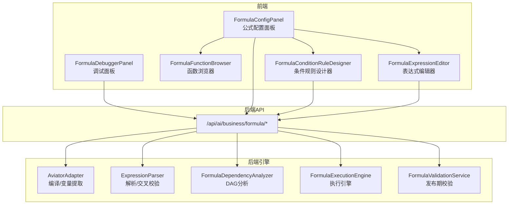
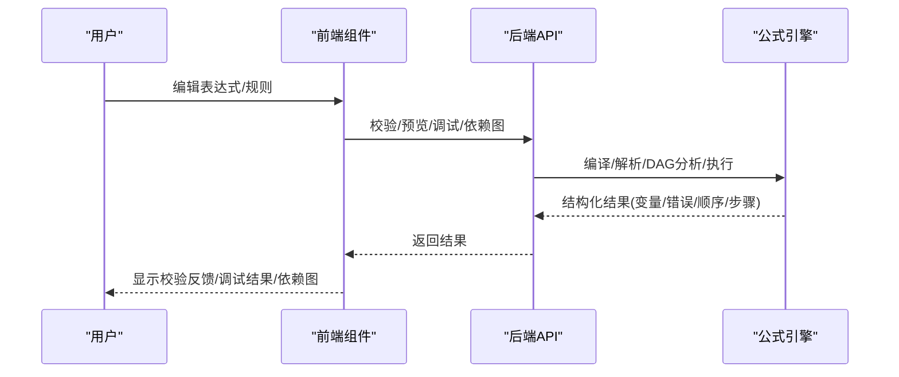
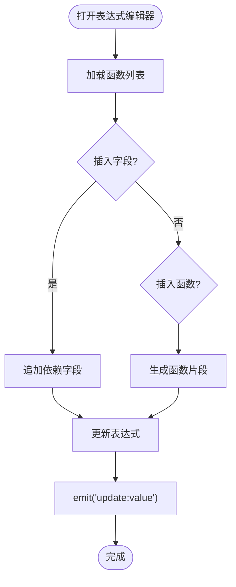
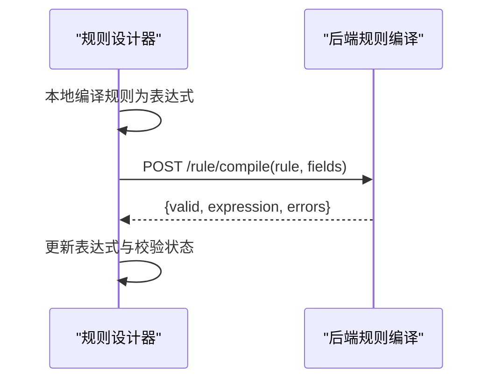
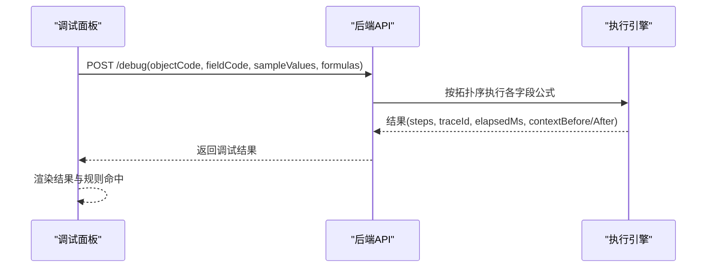
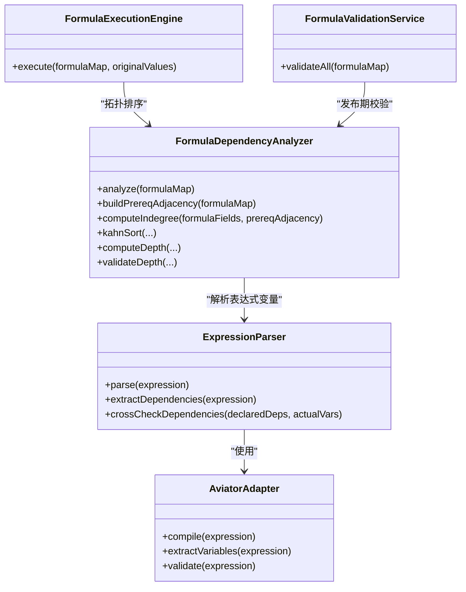

# 公式编辑器

<cite>
**本文引用的文件**
- [FormulaConfigPanel.vue](file://forge-admin-ui/src/views/app-center/components/designer/formula/FormulaConfigPanel.vue)
- [FormulaExpressionEditor.vue](file://forge-admin-ui/src/views/app-center/components/designer/formula/FormulaExpressionEditor.vue)
- [FormulaFunctionBrowser.vue](file://forge-admin-ui/src/views/app-center/components/designer/formula/FormulaFunctionBrowser.vue)
- [FormulaConditionRuleDesigner.vue](file://forge-admin-ui/src/views/app-center/components/designer/formula/FormulaConditionRuleDesigner.vue)
- [FormulaDebuggerPanel.vue](file://forge-admin-ui/src/views/app-center/components/designer/formula/FormulaDebuggerPanel.vue)
- [formula.js](file://forge-admin-ui/src/api/formula.js)
- [AviatorAdapter.java](file://forge-server/forge-framework/forge-plugin-parent/forge-plugin-generator/src/main/java/com/mdframe/forge/plugin/generator/domain/formula/AviatorAdapter.java)
- [ExpressionParser.java](file://forge-server/forge-framework/forge-plugin-parent/forge-plugin-generator/src/main/java/com/mdframe/forge/plugin/generator/domain/formula/ExpressionParser.java)
- [FormulaDependencyAnalyzer.java](file://forge-server/forge-framework/forge-plugin-parent/forge-plugin-generator/src/main/java/com/mdframe/forge/plugin/generator/domain/formula/FormulaDependencyAnalyzer.java)
- [FormulaExecutionEngine.java](file://forge-server/forge-framework/forge-plugin-parent/forge-plugin-generator/src/main/java/com/mdframe/forge/plugin/generator/service/formula/FormulaExecutionEngine.java)
- [FormulaValidationService.java](file://forge-server/forge-framework/forge-plugin-parent/forge-plugin-generator/src/main/java/com/mdframe/forge/plugin/generator/service/formula/FormulaValidationService.java)
- [tech-formula-engine-aviator-dag.md](file://code-copilot/knowledge/tech-formula-engine-aviator-dag.md)
</cite>

## 目录
1. [简介](#简介)
2. [项目结构](#项目结构)
3. [核心组件](#核心组件)
4. [架构总览](#架构总览)
5. [详细组件分析](#详细组件分析)
6. [依赖关系分析](#依赖关系分析)
7. [性能考量](#性能考量)
8. [故障排查指南](#故障排查指南)
9. [结论](#结论)
10. [附录](#附录)

## 简介
本文件为表单公式编辑器的完整技术文档，覆盖可视化公式编辑、函数浏览与插入、条件规则设计器、调试面板等前端能力，以及后端表达式解析、语义校验、依赖图构建、执行引擎与可观测性。目标是帮助开发者快速理解并扩展公式体系，安全地实现复杂计算逻辑。

## 项目结构
公式编辑器由前后端协同构成：
- 前端位于低代码应用中心的设计器中，提供表达式工作区、函数库、条件规则树、调试与日志等交互界面。
- 后端基于 Aviator 表达式引擎，提供语法校验、依赖分析（DAG）、执行与调试接口，并通过统一 API 暴露给前端。

图表来源
- [FormulaConfigPanel.vue:1-122](file://forge-admin-ui/src/views/app-center/components/designer/formula/FormulaConfigPanel.vue#L1-L122)
- [FormulaExpressionEditor.vue:1-228](file://forge-admin-ui/src/views/app-center/components/designer/formula/FormulaExpressionEditor.vue#L1-L228)
- [FormulaFunctionBrowser.vue:1-115](file://forge-admin-ui/src/views/app-center/components/designer/formula/FormulaFunctionBrowser.vue#L1-L115)
- [FormulaConditionRuleDesigner.vue:1-30](file://forge-admin-ui/src/views/app-center/components/designer/formula/FormulaConditionRuleDesigner.vue#L1-L30)
- [FormulaDebuggerPanel.vue:1-111](file://forge-admin-ui/src/views/app-center/components/designer/formula/FormulaDebuggerPanel.vue#L1-L111)
- [formula.js:1-84](file://forge-admin-ui/src/api/formula.js#L1-L84)
- [AviatorAdapter.java:13-25](file://forge-server/forge-framework/forge-plugin-parent/forge-plugin-generator/src/main/java/com/mdframe/forge/plugin/generator/domain/formula/AviatorAdapter.java#L13-L25)
- [ExpressionParser.java:6-17](file://forge-server/forge-framework/forge-plugin-parent/forge-plugin-generator/src/main/java/com/mdframe/forge/plugin/generator/domain/formula/ExpressionParser.java#L6-L17)
- [FormulaDependencyAnalyzer.java:6-18](file://forge-server/forge-framework/forge-plugin-parent/forge-plugin-generator/src/main/java/com/mdframe/forge/plugin/generator/domain/formula/FormulaDependencyAnalyzer.java#L6-L18)
- [FormulaExecutionEngine.java:126-150](file://forge-server/forge-framework/forge-plugin-parent/forge-plugin-generator/src/main/java/com/mdframe/forge/plugin/generator/service/formula/FormulaExecutionEngine.java#L126-L150)
- [FormulaValidationService.java:148-172](file://forge-server/forge-framework/forge-plugin-parent/forge-plugin-generator/src/main/java/com/mdframe/forge/plugin/generator/service/formula/FormulaValidationService.java#L148-L172)

章节来源
- [tech-formula-engine-aviator-dag.md:1-37](file://code-copilot/knowledge/tech-formula-engine-aviator-dag.md#L1-L37)

## 核心组件
- 公式配置面板：负责启用/禁用公式、选择类型（基础运算、聚合、条件、LOOKUP）、触发方式、保存/预览/校验/调试/依赖图入口，以及条件模式切换（表达式/规则）。
- 表达式编辑器：三栏布局（字段浏览、表达式输入、函数浏览），支持格式化、清空、自动补全、依赖字段管理、函数片段插入与参数提示。
- 函数浏览器：按分类检索函数，展示签名、说明、示例，支持一键插入到表达式。
- 条件规则设计器：可视化构建 AND/OR 树，本地编译为表达式快照，异步调用后端进行强校验，输出错误信息。
- 调试面板：收集样例值，调用后端调试接口，展示结果、TraceId、耗时、步骤追踪与条件命中明细。

章节来源
- [FormulaConfigPanel.vue:14-122](file://forge-admin-ui/src/views/app-center/components/designer/formula/FormulaConfigPanel.vue#L14-L122)
- [FormulaExpressionEditor.vue:24-228](file://forge-admin-ui/src/views/app-center/components/designer/formula/FormulaExpressionEditor.vue#L24-L228)
- [FormulaFunctionBrowser.vue:1-115](file://forge-admin-ui/src/views/app-center/components/designer/formula/FormulaFunctionBrowser.vue#L1-L115)
- [FormulaConditionRuleDesigner.vue:1-30](file://forge-admin-ui/src/views/app-center/components/designer/formula/FormulaConditionRuleDesigner.vue#L1-L30)
- [FormulaDebuggerPanel.vue:1-111](file://forge-admin-ui/src/views/app-center/components/designer/formula/FormulaDebuggerPanel.vue#L1-L111)

## 架构总览
公式系统采用“前端可视化 + 后端引擎”的分层架构：
- 前端聚焦于“可编辑、可预览、可调试”的交互体验，通过统一的 formula.js 调用后端 API。
- 后端以 Aviator 为表达式内核，提供编译期校验、依赖图分析与执行期调度，保证安全性与可观测性。

图表来源
- [FormulaConfigPanel.vue:58-122](file://forge-admin-ui/src/views/app-center/components/designer/formula/FormulaConfigPanel.vue#L58-L122)
- [FormulaDebuggerPanel.vue:218-244](file://forge-admin-ui/src/views/app-center/components/designer/formula/FormulaDebuggerPanel.vue#L218-L244)
- [formula.js:5-84](file://forge-admin-ui/src/api/formula.js#L5-L84)
- [FormulaExecutionEngine.java:126-150](file://forge-server/forge-framework/forge-plugin-parent/forge-plugin-generator/src/main/java/com/mdframe/forge/plugin/generator/service/formula/FormulaExecutionEngine.java#L126-L150)
- [FormulaValidationService.java:148-172](file://forge-server/forge-framework/forge-plugin-parent/forge-plugin-generator/src/main/java/com/mdframe/forge/plugin/generator/service/formula/FormulaValidationService.java#L148-L172)

## 详细组件分析

### 表达式编辑器（FormulaExpressionEditor）
- 功能要点
  - 左侧字段分组浏览，点击插入字段并自动追加依赖。
  - 中间表达式文本框，支持格式化、清空、运算符快捷插入、字符串字面量插入。
  - 右侧函数库，按分类过滤，双击或点击插入函数片段，自动生成占位参数。
  - 底部依赖条展示当前依赖字段集合，支持移除。
- 数据流
  - 字段/函数列表通过 getFormulaFunctions 拉取。
  - 依赖字段通过 props.dependsOn 双向绑定，插入字段时追加，删除时移除。
  - 表达式变更通过 update:value 事件回传父组件。

图表来源
- [FormulaExpressionEditor.vue:231-684](file://forge-admin-ui/src/views/app-center/components/designer/formula/FormulaExpressionEditor.vue#L231-L684)

章节来源
- [FormulaExpressionEditor.vue:231-684](file://forge-admin-ui/src/views/app-center/components/designer/formula/FormulaExpressionEditor.vue#L231-L684)
- [formula.js:50-53](file://forge-admin-ui/src/api/formula.js#L50-L53)

### 函数浏览器（FormulaFunctionBrowser）
- 功能要点
  - 搜索与分类筛选，展示函数名称、类别、返回类型、说明、示例。
  - 支持将函数片段插入到上层编辑器。
- 数据流
  - 通过 getFormulaFunctions 获取函数元数据，规范化后渲染。
  - 选中函数后，根据 argumentSchema 生成插入文本。

章节来源
- [FormulaFunctionBrowser.vue:117-247](file://forge-admin-ui/src/views/app-center/components/designer/formula/FormulaFunctionBrowser.vue#L117-L247)
- [formula.js:50-53](file://forge-admin-ui/src/api/formula.js#L50-L53)

### 条件规则设计器（FormulaConditionRuleDesigner）
- 功能要点
  - 可视化构建 AND/OR 条件树，节点包含字段、操作符、值。
  - 本地编译为表达式快照，异步调用后端 compileConditionRule 做强校验。
  - 实时反馈错误信息，并将最终表达式同步到公式配置。
- 关键流程
  - 监听规则变化 → 本地编译 → 防抖调用后端 → 更新状态与表达式。

图表来源
- [FormulaConditionRuleDesigner.vue:75-159](file://forge-admin-ui/src/views/app-center/components/designer/formula/FormulaConditionRuleDesigner.vue#L75-L159)
- [formula.js:40-48](file://forge-admin-ui/src/api/formula.js#L40-L48)

章节来源
- [FormulaConditionRuleDesigner.vue:32-159](file://forge-admin-ui/src/views/app-center/components/designer/formula/FormulaConditionRuleDesigner.vue#L32-L159)
- [formula.js:40-48](file://forge-admin-ui/src/api/formula.js#L40-L48)

### 调试面板（FormulaDebuggerPanel）
- 功能要点
  - 自动识别目标字段及其依赖变量，生成样例值输入控件。
  - 调用 debugFormula 执行调试，展示成功/失败、TraceId、耗时、步骤追踪。
  - 对 CONDITIONAL 类型，展示条件命中明细（AND/OR 分支及叶子条件）。
- 数据流
  - 从字段定义与公式配置中提取依赖变量。
  - 组装 formulas 列表与 sampleValues 提交后端。
  - 渲染步骤与规则命中结果。

图表来源
- [FormulaDebuggerPanel.vue:218-244](file://forge-admin-ui/src/views/app-center/components/designer/formula/FormulaDebuggerPanel.vue#L218-L244)
- [FormulaExecutionEngine.java:126-150](file://forge-server/forge-framework/forge-plugin-parent/forge-plugin-generator/src/main/java/com/mdframe/forge/plugin/generator/service/formula/FormulaExecutionEngine.java#L126-L150)
- [formula.js:20-23](file://forge-admin-ui/src/api/formula.js#L20-L23)

章节来源
- [FormulaDebuggerPanel.vue:113-451](file://forge-admin-ui/src/views/app-center/components/designer/formula/FormulaDebuggerPanel.vue#L113-L451)
- [formula.js:20-23](file://forge-admin-ui/src/api/formula.js#L20-L23)

### 公式配置面板（FormulaConfigPanel）
- 功能要点
  - 公式开关、名称、类型、触发方式（实时/保存时/手动预留）。
  - 表达式/条件/聚合/LOOKUP 多模式切换。
  - 工具栏：保存、校验、预览、调试、日志、依赖图。
  - 条件模式：表达式 vs 规则设计器；条件成立/不成立值设置。
- 集成点
  - 通过 emit 向父组件传递动作（保存/校验/预览/打开调试器等）。
  - 条件模式切换时联动 FormulaConditionRuleDesigner。

章节来源
- [FormulaConfigPanel.vue:1-122](file://forge-admin-ui/src/views/app-center/components/designer/formula/FormulaConfigPanel.vue#L1-L122)
- [FormulaConfigPanel.vue:193-254](file://forge-admin-ui/src/views/app-center/components/designer/formula/FormulaConfigPanel.vue#L193-L254)
- [FormulaConfigPanel.vue:275-395](file://forge-admin-ui/src/views/app-center/components/designer/formula/FormulaConfigPanel.vue#L275-L395)

## 依赖关系分析
后端依赖分析使用 DAG（有向无环图）确保公式按正确顺序计算，并检测循环依赖与嵌套深度超限。

图表来源
- [ExpressionParser.java:6-17](file://forge-server/forge-framework/forge-plugin-parent/forge-plugin-generator/src/main/java/com/mdframe/forge/plugin/generator/domain/formula/ExpressionParser.java#L6-L17)
- [AviatorAdapter.java:13-25](file://forge-server/forge-framework/forge-plugin-parent/forge-plugin-generator/src/main/java/com/mdframe/forge/plugin/generator/domain/formula/AviatorAdapter.java#L13-L25)
- [FormulaDependencyAnalyzer.java:6-18](file://forge-server/forge-framework/forge-plugin-parent/forge-plugin-generator/src/main/java/com/mdframe/forge/plugin/generator/domain/formula/FormulaDependencyAnalyzer.java#L6-L18)
- [FormulaExecutionEngine.java:126-150](file://forge-server/forge-framework/forge-plugin-parent/forge-plugin-generator/src/main/java/com/mdframe/forge/plugin/generator/service/formula/FormulaExecutionEngine.java#L126-L150)
- [FormulaValidationService.java:148-172](file://forge-server/forge-framework/forge-plugin-parent/forge-plugin-generator/src/main/java/com/mdframe/forge/plugin/generator/service/formula/FormulaValidationService.java#L148-L172)

章节来源
- [FormulaDependencyAnalyzer.java:46-95](file://forge-server/forge-framework/forge-plugin-parent/forge-plugin-generator/src/main/java/com/mdframe/forge/plugin/generator/domain/formula/FormulaDependencyAnalyzer.java#L46-L95)
- [FormulaDependencyAnalyzer.java:101-166](file://forge-server/forge-framework/forge-plugin-parent/forge-plugin-generator/src/main/java/com/mdframe/forge/plugin/generator/domain/formula/FormulaDependencyAnalyzer.java#L101-L166)
- [FormulaDependencyAnalyzer.java:172-222](file://forge-server/forge-framework/forge-plugin-parent/forge-plugin-generator/src/main/java/com/mdframe/forge/plugin/generator/domain/formula/FormulaDependencyAnalyzer.java#L172-L222)
- [FormulaDependencyAnalyzer.java:301-332](file://forge-server/forge-framework/forge-plugin-parent/forge-plugin-generator/src/main/java/com/mdframe/forge/plugin/generator/domain/formula/FormulaDependencyAnalyzer.java#L301-L332)

## 性能考量
- 表达式编译缓存：Aviator 默认开启优化级别，生产环境建议启用 LRU 缓存以减少重复编译开销。
- 依赖分析复杂度：Kahn 算法时间复杂度 O(V+E)，适合大规模字段公式的拓扑排序。
- 前端防抖：条件规则编译采用防抖策略，避免频繁请求后端。
- 批量预取：虚拟模式（VIRTUAL）下建议批量预取关联数据，避免 N+1 查询。
- 金额精度：金额统一使用 long（单位分），避免浮点误差。

章节来源
- [AviatorAdapter.java:32-36](file://forge-server/forge-framework/forge-plugin-parent/forge-plugin-generator/src/main/java/com/mdframe/forge/plugin/generator/domain/formula/AviatorAdapter.java#L32-L36)
- [FormulaDependencyAnalyzer.java:172-222](file://forge-server/forge-framework/forge-plugin-parent/forge-plugin-generator/src/main/java/com/mdframe/forge/plugin/generator/domain/formula/FormulaDependencyAnalyzer.java#L172-L222)
- [FormulaConditionRuleDesigner.vue:101-107](file://forge-admin-ui/src/views/app-center/components/designer/formula/FormulaConditionRuleDesigner.vue#L101-L107)
- [tech-formula-engine-aviator-dag.md:12-19](file://code-copilot/knowledge/tech-formula-engine-aviator-dag.md#L12-L19)

## 故障排查指南
- 表达式语法错误
  - 现象：校验失败，显示行号与列号。
  - 定位：查看 AviatorAdapter.validate 返回的错误位置与消息。
  - 处理：修正语法后再试。
- 依赖缺失或多余
  - 现象：dependsOn 与实际变量不一致，出现警告。
  - 定位：ExpressionParser.crossCheckDependencies 输出告警。
  - 处理：对齐 dependsOn 与表达式实际变量。
- 循环依赖
  - 现象：发布期校验失败，提示检测到循环依赖。
  - 定位：FormulaDependencyAnalyzer.kahnSort 检测未处理节点，回溯环路。
  - 处理：调整依赖方向或拆分计算链。
- 嵌套深度超限
  - 现象：字段公式嵌套深度超过最大限制。
  - 定位：FormulaDependencyAnalyzer.validateDepth 报错。
  - 处理：降低依赖层级或拆分子公式。
- 条件规则编译失败
  - 现象：规则设计器显示错误信息。
  - 定位：后端 compileConditionRule 返回 errors。
  - 处理：检查字段、操作符与值合法性。
- 调试执行失败
  - 现象：调试面板显示失败与错误步骤。
  - 定位：查看 steps 与 errors，结合上下文 before/after。
  - 处理：修正表达式或样例值。

章节来源
- [AviatorAdapter.java:97-113](file://forge-server/forge-framework/forge-plugin-parent/forge-plugin-generator/src/main/java/com/mdframe/forge/plugin/generator/domain/formula/AviatorAdapter.java#L97-L113)
- [ExpressionParser.java:75-96](file://forge-server/forge-framework/forge-plugin-parent/forge-plugin-generator/src/main/java/com/mdframe/forge/plugin/generator/domain/formula/ExpressionParser.java#L75-L96)
- [FormulaDependencyAnalyzer.java:172-222](file://forge-server/forge-framework/forge-plugin-parent/forge-plugin-generator/src/main/java/com/mdframe/forge/plugin/generator/domain/formula/FormulaDependencyAnalyzer.java#L172-L222)
- [FormulaDependencyAnalyzer.java:322-332](file://forge-server/forge-framework/forge-plugin-parent/forge-plugin-generator/src/main/java/com/mdframe/forge/plugin/generator/domain/formula/FormulaDependencyAnalyzer.java#L322-L332)
- [FormulaConditionRuleDesigner.vue:123-153](file://forge-admin-ui/src/views/app-center/components/designer/formula/FormulaConditionRuleDesigner.vue#L123-L153)
- [FormulaDebuggerPanel.vue:218-244](file://forge-admin-ui/src/views/app-center/components/designer/formula/FormulaDebuggerPanel.vue#L218-L244)

## 结论
该公式编辑器以可视化驱动、引擎保障为核心，实现了从表达式编辑、函数库集成、条件规则设计到调试与可观测性的完整闭环。通过 Aviator 表达式引擎与 DAG 依赖分析，既保证了计算的正确性与性能，又提供了强大的排障能力。建议在业务场景中优先使用内置函数与规则设计器，必要时通过自定义函数扩展能力，并严格遵循依赖规范与深度限制。

## 附录

### 公式开发工作流程
- 选择公式类型与触发方式，编写表达式或配置条件规则。
- 使用函数浏览器插入函数片段，维护依赖字段。
- 运行校验与预览，确认语法与依赖正确。
- 打开调试面板，填入样例值执行调试，查看步骤与命中情况。
- 发布前进行依赖图检查，确保无循环且深度合规。

章节来源
- [FormulaConfigPanel.vue:14-122](file://forge-admin-ui/src/views/app-center/components/designer/formula/FormulaConfigPanel.vue#L14-L122)
- [FormulaDebuggerPanel.vue:218-244](file://forge-admin-ui/src/views/app-center/components/designer/formula/FormulaDebuggerPanel.vue#L218-L244)
- [FormulaDependencyAnalyzer.java:46-95](file://forge-server/forge-framework/forge-plugin-parent/forge-plugin-generator/src/main/java/com/mdframe/forge/plugin/generator/domain/formula/FormulaDependencyAnalyzer.java#L46-L95)

### 函数库使用指南
- 在表达式编辑器右侧函数面板中搜索并选择函数。
- 查看函数签名、参数说明与示例，双击插入。
- 如需新增函数，可通过函数市场安装或注册自定义函数。

章节来源
- [FormulaExpressionEditor.vue:148-228](file://forge-admin-ui/src/views/app-center/components/designer/formula/FormulaExpressionEditor.vue#L148-L228)
- [formula.js:50-84](file://forge-admin-ui/src/api/formula.js#L50-L84)

### 调试工具使用方法
- 打开调试面板，自动列出依赖变量并填充样例值。
- 点击执行调试，查看结果、TraceId、耗时与步骤。
- 对于条件公式，查看规则命中明细，定位问题分支。

章节来源
- [FormulaDebuggerPanel.vue:21-111](file://forge-admin-ui/src/views/app-center/components/designer/formula/FormulaDebuggerPanel.vue#L21-L111)
- [FormulaDebuggerPanel.vue:218-244](file://forge-admin-ui/src/views/app-center/components/designer/formula/FormulaDebuggerPanel.vue#L218-L244)

### 自定义函数开发方案
- 在后端注册自定义函数，暴露函数元数据（名称、类别、返回类型、参数 schema、示例）。
- 前端通过 getFormulaFunctions 获取并展示，支持插入片段。
- 发布后可在表达式编辑器中使用，配合调试面板验证行为。

章节来源
- [formula.js:50-84](file://forge-admin-ui/src/api/formula.js#L50-L84)
- [FormulaExpressionEditor.vue:506-523](file://forge-admin-ui/src/views/app-center/components/designer/formula/FormulaExpressionEditor.vue#L506-L523)