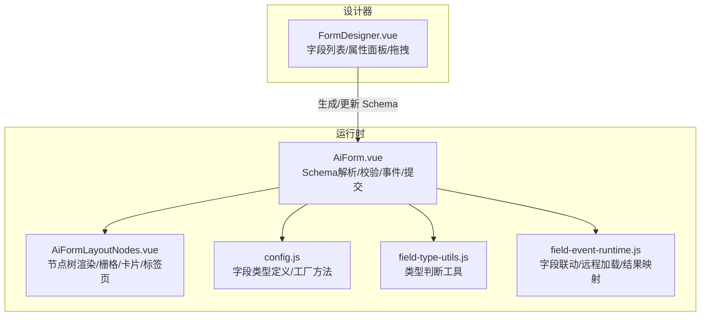
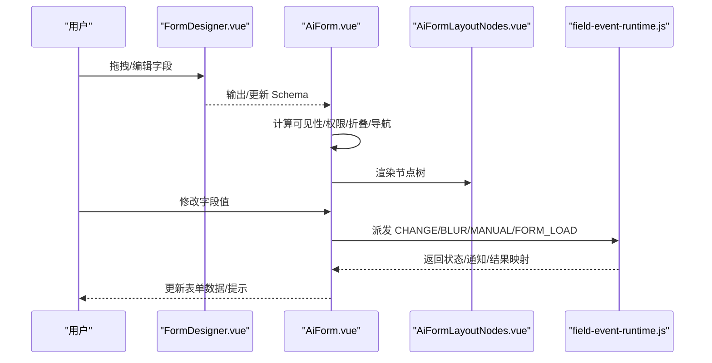
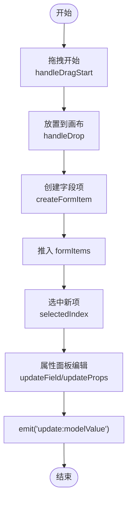
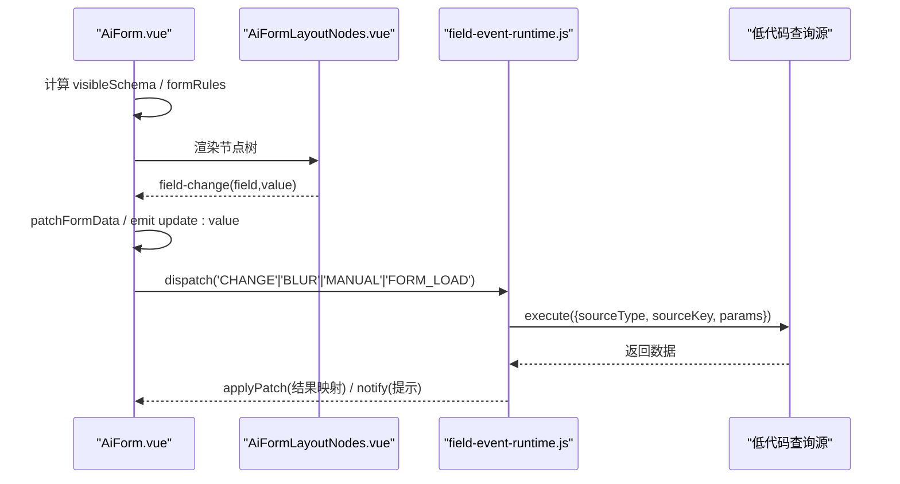
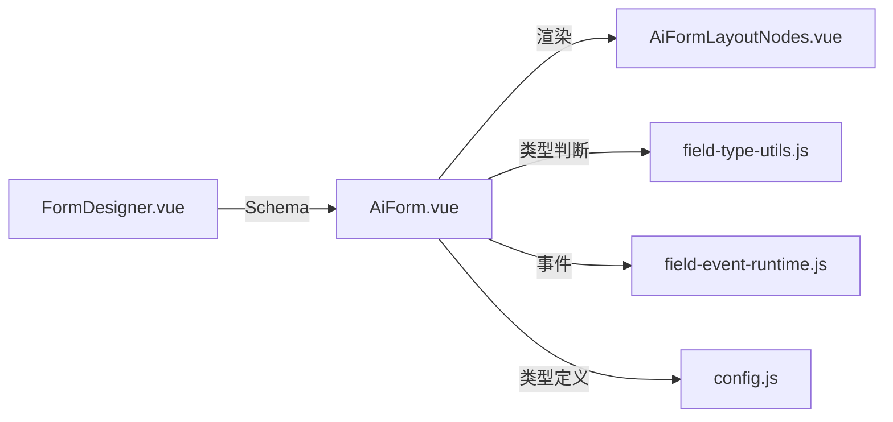

# 字段管理系统

<cite>
**本文引用的文件**
- [FormDesigner.vue](file://forge-admin-ui/src/components/form-designer/FormDesigner.vue)
- [AiForm.vue](file://forge-admin-ui/src/components/ai-form/AiForm.vue)
- [config.js](file://forge-admin-ui/src/components/ai-form/config.js)
- [field-type-utils.js](file://forge-admin-ui/src/components/ai-form/field-type-utils.js)
- [AiFormLayoutNodes.vue](file://forge-admin-ui/src/components/ai-form/AiFormLayoutNodes.vue)
- [field-event-runtime.js](file://forge-admin-ui/src/components/ai-form/field-event-runtime.js)
</cite>

## 目录
1. [简介](#简介)
2. [项目结构](#项目结构)
3. [核心组件](#核心组件)
4. [架构总览](#架构总览)
5. [详细组件分析](#详细组件分析)
6. [依赖关系分析](#依赖关系分析)
7. [性能考量](#性能考量)
8. [故障排查指南](#故障排查指南)
9. [结论](#结论)
10. [附录](#附录)

## 简介
本文件面向表单字段管理系统的开发者与使用者，系统化阐述字段管理器、属性面板、字段列表等核心组件的设计与实现。重点覆盖：
- 字段注册机制与类型扩展
- 属性配置系统与校验规则体系
- 字段生命周期管理与联动事件
- 复杂交互逻辑与自定义字段类型的落地实践

通过可视化架构图与流程图，帮助读者快速理解从“设计器”到“运行时渲染”的完整链路，并掌握在现有能力基础上进行二次开发的方法。

## 项目结构
本项目围绕“表单设计器 + 表单运行时”的双端模式组织代码：
- 设计器侧：提供拖拽式布局、字段属性编辑、预览与导出能力
- 运行时代码：基于 JSON Schema 动态渲染表单，支持权限控制、折叠导航、联动事件、数据校验与提交

图表来源
- [FormDesigner.vue:1-754](file://forge-admin-ui/src/components/form-designer/FormDesigner.vue#L1-L754)
- [AiForm.vue:1-800](file://forge-admin-ui/src/components/ai-form/AiForm.vue#L1-L800)
- [config.js:1-316](file://forge-admin-ui/src/components/ai-form/config.js#L1-L316)
- [field-type-utils.js:1-33](file://forge-admin-ui/src/components/ai-form/field-type-utils.js#L1-L33)
- [AiFormLayoutNodes.vue:1-200](file://forge-admin-ui/src/components/ai-form/AiFormLayoutNodes.vue#L1-L200)
- [field-event-runtime.js:1-200](file://forge-admin-ui/src/components/ai-form/field-event-runtime.js#L1-L200)

章节来源
- [FormDesigner.vue:1-754](file://forge-admin-ui/src/components/form-designer/FormDesigner.vue#L1-L754)
- [AiForm.vue:1-800](file://forge-admin-ui/src/components/ai-form/AiForm.vue#L1-L800)

## 核心组件
- 字段管理器（FormDesigner）
  - 左侧组件面板：基础字段、高级字段、布局组件分组展示
  - 中间画布：可拖拽排序、复制、删除；选中项高亮
  - 右侧属性面板：通用属性（字段名、标签、占位、默认值、必填/禁用）、组件特有属性（如选项、日期格式、上传限制）、校验提示
  - 工具栏：清空、预览、导出JSON、保存
- 运行时表单（AiForm）
  - 接收 JSON Schema，计算可见性、权限、折叠、导航
  - 统一校验规则生成与触发策略
  - 字段事件运行时：CHANGE/BLUR/MANUAL/FORM_LOAD 等触发器，远程数据加载与结果映射
  - 操作区：提交、重置、取消，以及弹窗表单
- 布局节点渲染（AiFormLayoutNodes）
  - 递归渲染行/列/卡片/标签页/折叠/按钮/表格等布局节点
  - 透传字段变更与节点动作事件
- 字段类型与工厂（config.js, field-type-utils.js）
  - 字段类型枚举与快捷创建工厂
  - 数字/输入类类型识别，用于校验与默认行为

章节来源
- [FormDesigner.vue:1-754](file://forge-admin-ui/src/components/form-designer/FormDesigner.vue#L1-L754)
- [AiForm.vue:1-800](file://forge-admin-ui/src/components/ai-form/AiForm.vue#L1-L800)
- [AiFormLayoutNodes.vue:1-200](file://forge-admin-ui/src/components/ai-form/AiFormLayoutNodes.vue#L1-L200)
- [config.js:1-316](file://forge-admin-ui/src/components/ai-form/config.js#L1-L316)
- [field-type-utils.js:1-33](file://forge-admin-ui/src/components/ai-form/field-type-utils.js#L1-L33)

## 架构总览
设计器负责“生产 Schema”，运行时负责“消费 Schema”。两者通过统一的字段模型解耦：
- 字段模型包含：type、field、label、props、rules、validation、visibility、layout 等
- 运行时根据 visibility 与权限过滤后渲染，同时挂载校验与事件

图表来源
- [FormDesigner.vue:1-754](file://forge-admin-ui/src/components/form-designer/FormDesigner.vue#L1-L754)
- [AiForm.vue:1-800](file://forge-admin-ui/src/components/ai-form/AiForm.vue#L1-L800)
- [AiFormLayoutNodes.vue:1-200](file://forge-admin-ui/src/components/ai-form/AiFormLayoutNodes.vue#L1-L200)
- [field-event-runtime.js:1-200](file://forge-admin-ui/src/components/ai-form/field-event-runtime.js#L1-L200)

## 详细组件分析

### 字段管理器（FormDesigner）
- 职责
  - 维护 formItems 数组（字段列表），支持拖拽排序、复制、删除
  - 维护 selectedIndex 与 currentItem 副本，避免直接修改源数据
  - 右侧属性面板按 type 分支渲染对应属性编辑器
  - 导出 JSON 与保存回调
- 关键流程
  - 拖拽开始：将组件元信息写入 dataTransfer
  - 放置：createFormItem 生成标准字段对象并追加到列表
  - 属性更新：updateField/updateProps/updateOption 同步到 formItems
  - 校验消息：updateRuleMessage 初始化或更新 rules[0].message
- 扩展点
  - 新增字段类型：在 basicComponents/advancedComponents/layoutComponents 中注册
  - 属性面板：为新增 type 增加 v-if 分支与 updateProps 键

图表来源
- [FormDesigner.vue:456-558](file://forge-admin-ui/src/components/form-designer/FormDesigner.vue#L456-L558)

章节来源
- [FormDesigner.vue:1-754](file://forge-admin-ui/src/components/form-designer/FormDesigner.vue#L1-L754)

### 运行时表单（AiForm）
- 职责
  - 接收 schema/value/context，计算 visibleSchema、formRules
  - 处理字段变化、提交、重置、取消
  - 集成字段事件运行时，支持远程数据加载与结果映射
  - 支持折叠、导航、权限控制、弹窗表单
- 校验规则
  - 收集 field.rules 与 validation，规范化为统一规则集
  - 针对数字/日期/选择类类型，注入空值校验以避免误判
  - 必填时自动附加 required 规则
- 字段事件
  - 监听 CHANGE/BLUR/MANUAL/FORM_LOAD
  - 支持防抖、跳过空值、清除目标、结果映射、状态与通知

图表来源
- [AiForm.vue:298-700](file://forge-admin-ui/src/components/ai-form/AiForm.vue#L298-L700)
- [field-event-runtime.js:99-200](file://forge-admin-ui/src/components/ai-form/field-event-runtime.js#L99-L200)

章节来源
- [AiForm.vue:1-800](file://forge-admin-ui/src/components/ai-form/AiForm.vue#L1-L800)
- [field-event-runtime.js:1-200](file://forge-admin-ui/src/components/ai-form/field-event-runtime.js#L1-L200)

### 布局节点渲染（AiFormLayoutNodes）
- 职责
  - 递归渲染行/列/卡片/标签页/折叠/按钮/表格等布局节点
  - 将字段节点委托给 AiFormItem 渲染，透传 formValue 与 context
  - 透传 field-change 与 node-action 事件至父级
- 关键点
  - 栅格列数与间距由 props/gridCols/xGap/yGap 控制
  - 不同布局节点具备独立的样式与行为（如 tabs placement、collapse accordion）

章节来源
- [AiFormLayoutNodes.vue:1-200](file://forge-admin-ui/src/components/ai-form/AiFormLayoutNodes.vue#L1-L200)

### 字段类型与工厂（config.js, field-type-utils.js）
- 字段类型枚举
  - 覆盖输入、选择、日期时间、上传、级联、树选择、穿梭框、插槽、文本、自定义下拉等
- 工厂方法
  - FieldFactory 提供常用字段的快速创建，内置 placeholder、options、min/max 等默认值
- 类型判断
  - isNumberFieldType/isInputLikeFieldType 用于校验与默认行为（如必填提示文案、触发时机）

章节来源
- [config.js:1-316](file://forge-admin-ui/src/components/ai-form/config.js#L1-L316)
- [field-type-utils.js:1-33](file://forge-admin-ui/src/components/ai-form/field-type-utils.js#L1-L33)

## 依赖关系分析
- FormDesigner.vue
  - 依赖：vuedraggable、Naive UI 组件、FormItemRender、FormPreview
  - 输出：formItems（字段数组）
- AiForm.vue
  - 依赖：AiFormLayoutNodes、field-event-runtime、field-type-utils、权限与验证工具
  - 输出：表单数据 value、事件（submit/reset/cancel/nodeAction/fieldEvent）
- AiFormLayoutNodes.vue
  - 依赖：Naive UI 栅格/卡片/标签/折叠/按钮等
  - 输出：field-change、node-action
- field-event-runtime.js
  - 依赖：外部查询源执行函数、上下文与路由信息
  - 输出：状态、通知、结果映射补丁

图表来源
- [FormDesigner.vue:1-754](file://forge-admin-ui/src/components/form-designer/FormDesigner.vue#L1-L754)
- [AiForm.vue:1-800](file://forge-admin-ui/src/components/ai-form/AiForm.vue#L1-L800)
- [AiFormLayoutNodes.vue:1-200](file://forge-admin-ui/src/components/ai-form/AiFormLayoutNodes.vue#L1-L200)
- [field-type-utils.js:1-33](file://forge-admin-ui/src/components/ai-form/field-type-utils.js#L1-L33)
- [field-event-runtime.js:1-200](file://forge-admin-ui/src/components/ai-form/field-event-runtime.js#L1-L200)
- [config.js:1-316](file://forge-admin-ui/src/components/ai-form/config.js#L1-L316)

## 性能考量
- 渲染优化
  - 仅对 visibleSchema 进行渲染，减少不必要的 DOM 节点
  - 布局节点递归渲染时，合理设置 grid-cols/gap，避免过度嵌套
- 事件与网络
  - 使用防抖（CHANGE 触发）降低高频输入导致的请求压力
  - 支持 AbortController 取消未完成的请求，避免竞态
  - 结果映射按需更新字段，减少全量刷新
- 校验优化
  - 针对数字/日期/选择类类型注入空值校验，避免误报与重复校验
  - 单字段重验仅在必要时触发，不阻断用户继续填写

## 故障排查指南
- 字段不显示
  - 检查 visibility/vIf 与权限控制是否隐藏了字段
  - 确认 schema 中 field 唯一且未被布局节点过滤
- 校验不生效
  - 检查 rules 与 validation 是否正确传入
  - 对于数字/日期/选择类类型，确认已启用空值校验
- 联动无响应
  - 确认 field-event-runtime 已正确 setRules，且 trigger/sourceField 匹配
  - 检查 skipWhenEmpty/clearTargetsOnTrigger 配置是否符合预期
- 远程数据未回填
  - 检查 resultMappings 的 from/to 路径是否正确
  - 查看 onNotify 是否有错误提示，必要时开启调试日志

章节来源
- [AiForm.vue:348-477](file://forge-admin-ui/src/components/ai-form/AiForm.vue#L348-L477)
- [field-event-runtime.js:99-200](file://forge-admin-ui/src/components/ai-form/field-event-runtime.js#L99-L200)

## 结论
本系统以“设计器 + 运行时”的清晰分层实现了强大的表单字段管理能力：
- 设计器侧提供直观的拖拽与属性编辑体验
- 运行时代码基于统一 Schema 完成渲染、校验、权限、联动与提交
- 通过字段类型工厂与事件运行时，轻松扩展字段类型与复杂交互

建议在实际项目中：
- 优先使用 FieldFactory 快速构建字段
- 利用 visibility/validation/rules 组合实现灵活的控制与校验
- 借助 field-event-runtime 实现跨字段联动与远程数据加载

## 附录

### 如何添加自定义字段类型
步骤概览：
- 在设计器中注册新类型
  - 在组件列表中新增一项，指定 type/name/icon/defaultProps
  - 在属性面板中为该 type 增加 v-if 分支，绑定 props 更新
- 在运行时代码中支持该类型
  - 若需要特殊校验或行为，扩展 field-type-utils 的类型判断
  - 在 AiFormLayoutNodes 中为该类型添加渲染分支（如需）
  - 在 config.js 中补充 FIELD_TYPES 与 FieldFactory 方法

参考位置
- 设计器组件列表与属性面板：[FormDesigner.vue:332-361](file://forge-admin-ui/src/components/form-designer/FormDesigner.vue#L332-L361)、[FormDesigner.vue:173-289](file://forge-admin-ui/src/components/form-designer/FormDesigner.vue#L173-L289)
- 运行时类型判断：[field-type-utils.js:1-33](file://forge-admin-ui/src/components/ai-form/field-type-utils.js#L1-L33)
- 类型定义与工厂：[config.js:25-316](file://forge-admin-ui/src/components/ai-form/config.js#L25-L316)

### 复杂字段交互示例（思路）
场景：选择“部门”后，自动填充“负责人”和“联系方式”
- 在字段事件中配置：
  - 触发器：CHANGE（源字段：部门）
  - 参数映射：从表单字段读取部门ID
  - 数据源：EXTERNAL_API/DATASET
  - 结果映射：将返回的负责人与联系方式映射到对应字段
  - 可选：clearTargetsOnTrigger 确保切换部门时清空旧值
- 在 AiForm 中：
  - 监听 fieldEvent 状态，展示加载与提示
  - 使用 patchFormData 更新表单值

参考位置
- 事件运行时：[field-event-runtime.js:99-200](file://forge-admin-ui/src/components/ai-form/field-event-runtime.js#L99-L200)
- 表单事件派发与状态：[AiForm.vue:589-670](file://forge-admin-ui/src/components/ai-form/AiForm.vue#L589-L670)