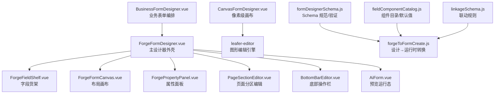
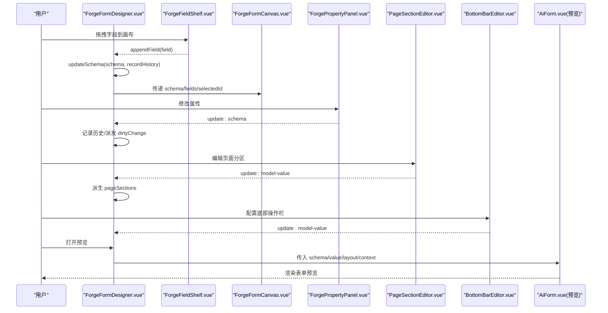
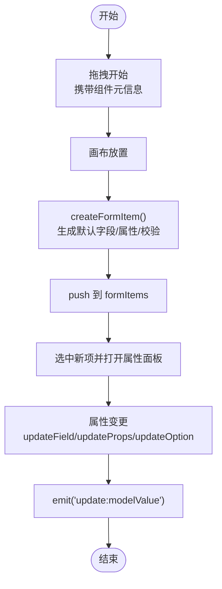
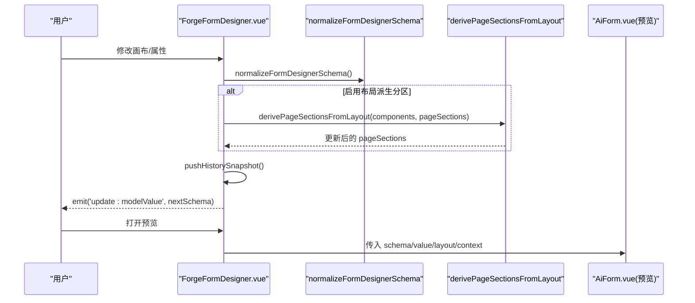
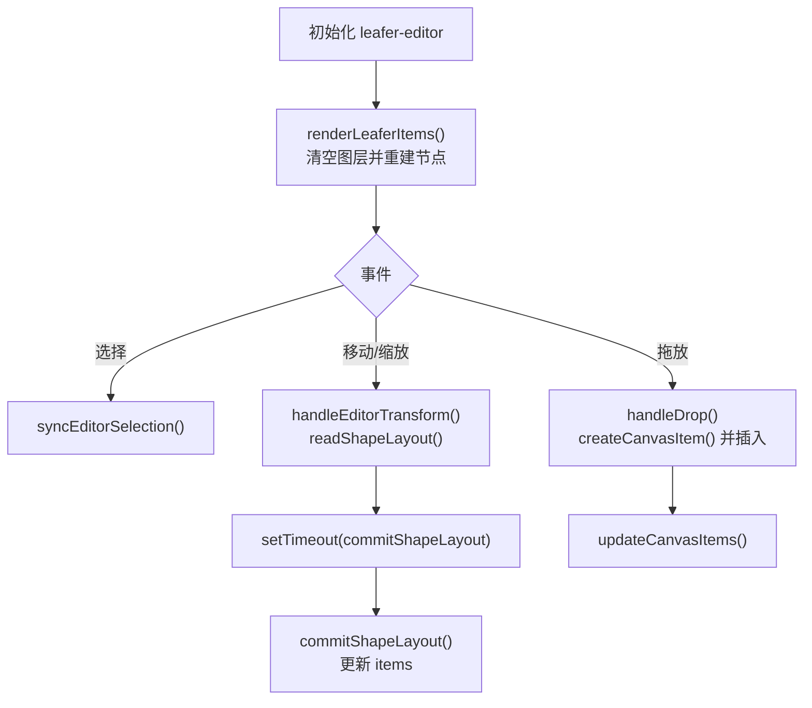
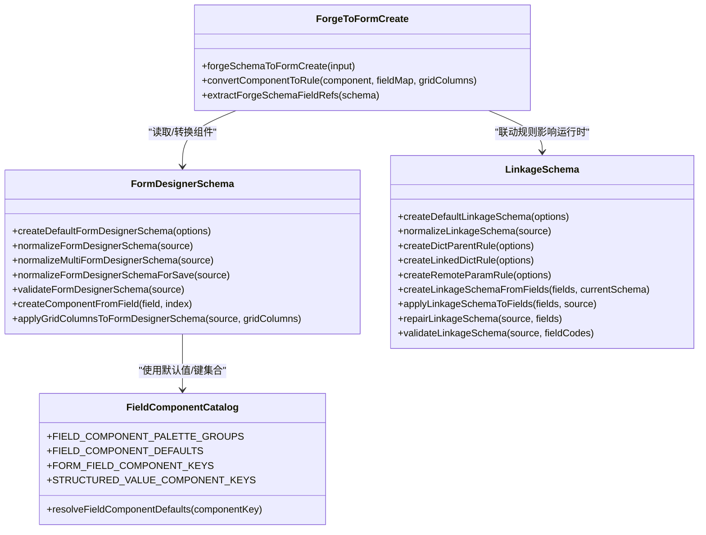
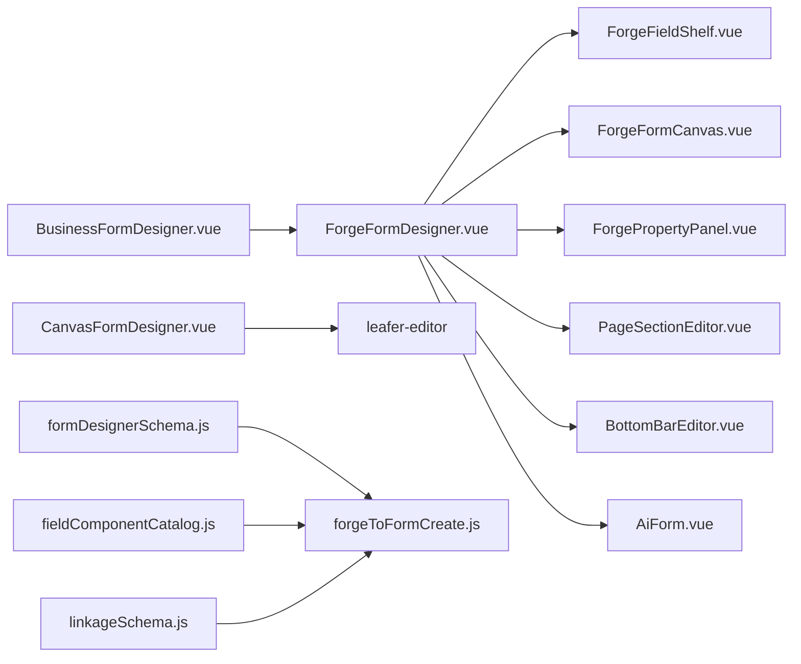

# 表单设计器

<cite>
**本文引用的文件**
- [FormDesigner.vue](file://forge-admin-ui/src/components/form-designer/FormDesigner.vue)
- [ForgeFormDesigner.vue](file://forge-admin-ui/src/views/app-center/components/designer/forge-form-designer/ForgeFormDesigner.vue)
- [BusinessFormDesigner.vue](file://forge-admin-ui/src/views/app-center/components/designer/BusinessFormDesigner.vue)
- [CanvasFormDesigner.vue](file://forge-admin-ui/src/components/lowcode-builder/page/CanvasFormDesigner.vue)
- [formDesignerSchema.js](file://forge-admin-ui/src/views/app-center/components/designer/form-first/formDesignerSchema.js)
- [fieldComponentCatalog.js](file://forge-admin-ui/src/views/app-center/components/designer/form-first/fieldComponentCatalog.js)
- [forgeToFormCreate.js](file://forge-admin-ui/src/views/app-center/components/designer/form-first/forgeToFormCreate.js)
- [linkageSchema.js](file://forge-admin-ui/src/views/app-center/components/designer/form-first/linkageSchema.js)
</cite>

## 目录
1. [简介](#简介)
2. [项目结构](#项目结构)
3. [核心组件](#核心组件)
4. [架构总览](#架构总览)
5. [详细组件分析](#详细组件分析)
6. [依赖关系分析](#依赖关系分析)
7. [性能考量](#性能考量)
8. [故障排查指南](#故障排查指南)
9. [结论](#结论)
10. [附录](#附录)

## 简介
本文件面向 Forge Admin 的可视化表单设计器，系统性阐述其设计理念、组件体系、布局系统、交互逻辑与渲染引擎。内容覆盖：
- 拖拽式画布、属性面板、预览与导出
- 表单 Schema 规范化、多表单资产、页面分区与底部操作栏
- 字段组件目录与默认值、校验规则、联动配置
- 从设计器 Schema 到运行时表单规则的转换
- 自定义组件扩展方案与复杂业务实现路径

## 项目结构
围绕表单设计器的关键代码分布在以下位置：
- 轻量级表单设计器（基础版）：左侧组件库 + 中间画布 + 右侧属性面板
- 企业级表单设计器（新版）：支持多表单资产、页面分区、详情设置、撤销重做、底部操作栏等
- 画布编辑器（自由布局）：基于 leafer-editor 的像素级拖拽与自动排列
- 表单 Schema 工具集：规范化、验证、转换、联动规则

图表来源
- [ForgeFormDesigner.vue:194-237](file://forge-admin-ui/src/views/app-center/components/designer/forge-form-designer/ForgeFormDesigner.vue#L194-L237)
- [CanvasFormDesigner.vue:172-222](file://forge-admin-ui/src/components/lowcode-builder/page/CanvasFormDesigner.vue#L172-L222)
- [formDesignerSchema.js:341-384](file://forge-admin-ui/src/views/app-center/components/designer/form-first/formDesignerSchema.js#L341-L384)
- [forgeToFormCreate.js:4-12](file://forge-admin-ui/src/views/app-center/components/designer/form-first/forgeToFormCreate.js#L4-L12)
- [fieldComponentCatalog.js:1-29](file://forge-admin-ui/src/views/app-center/components/designer/form-first/fieldComponentCatalog.js#L1-L29)
- [linkageSchema.js:15-31](file://forge-admin-ui/src/views/app-center/components/designer/form-first/linkageSchema.js#L15-L31)

章节来源
- [BusinessFormDesigner.vue:84-128](file://forge-admin-ui/src/views/app-center/components/designer/BusinessFormDesigner.vue#L84-L128)
- [ForgeFormDesigner.vue:498-550](file://forge-admin-ui/src/views/app-center/components/designer/forge-form-designer/ForgeFormDesigner.vue#L498-L550)
- [CanvasFormDesigner.vue:1-87](file://forge-admin-ui/src/components/lowcode-builder/page/CanvasFormDesigner.vue#L1-L87)

## 核心组件
- 轻量设计器 FormDesigner.vue
  - 三栏布局：组件库、画布、属性面板
  - 拖拽新增、选中编辑、复制删除、清空、预览、导出 JSON
  - 内置基础/高级/布局三类组件，支持选项编辑、日期类型、上传参数、校验提示
- 企业级设计器 ForgeFormDesigner.vue
  - 多表单资产切换、页面分区视图、详情设置插槽
  - 撤销/重做历史栈、画布聚焦模式、更多操作菜单
  - 预览弹窗：支持新增/编辑/详情三种运行态
- 画布编辑器 CanvasFormDesigner.vue
  - 基于 leafer-editor 的自由拖拽、缩放、对齐网格
  - 自动排列、列布局一键应用、尺寸调整
- Schema 工具集
  - formDesignerSchema.js：Schema 版本、布局组件集合、规范化、多表单合并、保存前清洗、校验
  - fieldComponentCatalog.js：字段组件目录与默认值映射
  - forgeToFormCreate.js：设计器 Schema → 运行时表单规则（含列宽、校验、选项、元信息）
  - linkageSchema.js：联动规则模型、创建/归一化/校验、与字段级联双向同步

章节来源
- [FormDesigner.vue:1-311](file://forge-admin-ui/src/components/form-designer/FormDesigner.vue#L1-L311)
- [ForgeFormDesigner.vue:1-238](file://forge-admin-ui/src/views/app-center/components/designer/forge-form-designer/ForgeFormDesigner.vue#L1-L238)
- [CanvasFormDesigner.vue:1-87](file://forge-admin-ui/src/components/lowcode-builder/page/CanvasFormDesigner.vue#L1-L87)
- [formDesignerSchema.js:341-384](file://forge-admin-ui/src/views/app-center/components/designer/form-first/formDesignerSchema.js#L341-L384)
- [fieldComponentCatalog.js:1-29](file://forge-admin-ui/src/views/app-center/components/designer/form-first/fieldComponentCatalog.js#L1-L29)
- [forgeToFormCreate.js:4-12](file://forge-admin-ui/src/views/app-center/components/designer/form-first/forgeToFormCreate.js#L4-L12)
- [linkageSchema.js:15-31](file://forge-admin-ui/src/views/app-center/components/designer/form-first/linkageSchema.js#L15-L31)

## 架构总览
设计器采用“数据驱动 + 组件化”的架构：
- 设计期：以 Schema 为中心，统一由 formDesignerSchema.js 进行归一化与校验
- 运行期：通过 forgeToFormCreate.js 将 Schema 转换为 AiForm 可消费的 rules/options
- 交互层：ForgeFormDesigner 组合 FieldShelf、Canvas、PropertyPanel、PageSectionEditor、BottomBarEditor
- 画布层：CanvasFormDesigner 提供像素级编辑能力，与表单布局协同

图表来源
- [ForgeFormDesigner.vue:663-680](file://forge-admin-ui/src/views/app-center/components/designer/forge-form-designer/ForgeFormDesigner.vue#L663-L680)
- [ForgeFormDesigner.vue:194-237](file://forge-admin-ui/src/views/app-center/components/designer/forge-form-designer/ForgeFormDesigner.vue#L194-L237)
- [ForgeFormDesigner.vue:254-402](file://forge-admin-ui/src/views/app-center/components/designer/forge-form-designer/ForgeFormDesigner.vue#L254-L402)

章节来源
- [ForgeFormDesigner.vue:596-680](file://forge-admin-ui/src/views/app-center/components/designer/forge-form-designer/ForgeFormDesigner.vue#L596-L680)

## 详细组件分析

### 轻量设计器 FormDesigner.vue
- 组件体系
  - 左侧：基础/高级/布局三类组件列表，支持拖拽
  - 中间：vuedraggable 驱动的画布，支持排序、复制、删除、选中高亮
  - 右侧：动态属性面板，按组件类型渲染不同属性组
- 交互逻辑
  - 拖拽开始：携带组件元信息
  - 放置：生成表单项并追加到画布，自动选中
  - 属性更新：深拷贝当前项，实时回写 formItems
  - 预览：弹出 FormPreview 展示
  - 导出：下载 form-schema.json
- 数据校验
  - 每个组件默认包含 rules 数组，支持必填提示文案编辑
- 复杂度
  - 时间复杂度：拖拽插入 O(1)，属性更新 O(1)
  - 空间复杂度：formItems 线性增长

图表来源
- [FormDesigner.vue:456-488](file://forge-admin-ui/src/components/form-designer/FormDesigner.vue#L456-L488)
- [FormDesigner.vue:399-448](file://forge-admin-ui/src/components/form-designer/FormDesigner.vue#L399-L448)

章节来源
- [FormDesigner.vue:1-311](file://forge-admin-ui/src/components/form-designer/FormDesigner.vue#L1-L311)
- [FormDesigner.vue:313-575](file://forge-admin-ui/src/components/form-designer/FormDesigner.vue#L313-L575)

### 企业级设计器 ForgeFormDesigner.vue
- 功能要点
  - 多表单资产：tab 切换、复制、新建空白表单
  - 视图切换：布局 / 页面分区 / 详情设置
  - 撤销/重做：历史栈限制长度，避免内存泄漏
  - 预览：根据 layout.gridColumns 计算预览列数，注入运行时上下文
  - 底部操作栏：弹窗编辑并即时写回
- 数据流
  - updateSchema：归一化 Schema、可选派生 pageSections、写入历史、派发事件
  - appendField：从字段资产生成组件并应用栅格列数
  - 更多操作：重置为字段、修复引用、打开底部操作栏

图表来源
- [ForgeFormDesigner.vue:663-680](file://forge-admin-ui/src/views/app-center/components/designer/forge-form-designer/ForgeFormDesigner.vue#L663-L680)
- [ForgeFormDesigner.vue:731-741](file://forge-admin-ui/src/views/app-center/components/designer/forge-form-designer/ForgeFormDesigner.vue#L731-L741)
- [ForgeFormDesigner.vue:254-402](file://forge-admin-ui/src/views/app-center/components/designer/forge-form-designer/ForgeFormDesigner.vue#L254-L402)

章节来源
- [ForgeFormDesigner.vue:498-800](file://forge-admin-ui/src/views/app-center/components/designer/forge-form-designer/ForgeFormDesigner.vue#L498-L800)

### 画布编辑器 CanvasFormDesigner.vue
- 能力概览
  - 初始化 leafer-editor，监听选择/移动/缩放事件
  - 渲染组件卡片：按钮、查询集、表格、详情、表单字段等
  - 自动排列：按列数或按钮/字段分组布局
  - 拖放新增：解析 dataTransfer 中的低代码组件协议，计算坐标后插入
- 性能优化
  - 使用 Map 缓存 shape，减少重复查找
  - 防抖提交布局变更，降低频繁写盘

图表来源
- [CanvasFormDesigner.vue:172-222](file://forge-admin-ui/src/components/lowcode-builder/page/CanvasFormDesigner.vue#L172-L222)
- [CanvasFormDesigner.vue:224-267](file://forge-admin-ui/src/components/lowcode-builder/page/CanvasFormDesigner.vue#L224-L267)
- [CanvasFormDesigner.vue:646-704](file://forge-admin-ui/src/components/lowcode-builder/page/CanvasFormDesigner.vue#L646-L704)
- [CanvasFormDesigner.vue:706-744](file://forge-admin-ui/src/components/lowcode-builder/page/CanvasFormDesigner.vue#L706-L744)

章节来源
- [CanvasFormDesigner.vue:1-800](file://forge-admin-ui/src/components/lowcode-builder/page/CanvasFormDesigner.vue#L1-L800)

### Schema 与运行时转换
- 组件目录与默认值
  - 通过 designer-core 桥接生成字段组件调色板与默认值，补充历史兼容
- 设计器 Schema 规范
  - 版本控制、布局组件集合、虚拟组件集合、标签映射
  - 规范化流程：组件 ID 去重、布局/分区/底部操作栏归一化
  - 多表单合并：forms 与 settings.formAssets 统一处理
  - 保存前清洗：提取 active form 与 assets
- 设计→运行时转换
  - convertComponentToRule：字段类型映射、列宽换算、校验与选项、子节点递归
  - buildFormCreateOptions：表单全局样式、反馈、占位等
  - extractForgeSchemaFieldRefs：收集所有字段引用用于权限/可见性判断

图表来源
- [formDesignerSchema.js:341-384](file://forge-admin-ui/src/views/app-center/components/designer/form-first/formDesignerSchema.js#L341-L384)
- [formDesignerSchema.js:579-655](file://forge-admin-ui/src/views/app-center/components/designer/form-first/formDesignerSchema.js#L579-L655)
- [fieldComponentCatalog.js:1-29](file://forge-admin-ui/src/views/app-center/components/designer/form-first/fieldComponentCatalog.js#L1-L29)
- [forgeToFormCreate.js:4-12](file://forge-admin-ui/src/views/app-center/components/designer/form-first/forgeToFormCreate.js#L4-L12)
- [linkageSchema.js:15-31](file://forge-admin-ui/src/views/app-center/components/designer/form-first/linkageSchema.js#L15-L31)

章节来源
- [formDesignerSchema.js:1-800](file://forge-admin-ui/src/views/app-center/components/designer/form-first/formDesignerSchema.js#L1-L800)
- [forgeToFormCreate.js:1-338](file://forge-admin-ui/src/views/app-center/components/designer/form-first/forgeToFormCreate.js#L1-L338)
- [linkageSchema.js:1-353](file://forge-admin-ui/src/views/app-center/components/designer/form-first/linkageSchema.js#L1-L353)

## 依赖关系分析
- 组件耦合
  - BusinessFormDesigner 聚合 ForgeFormDesigner 与旧版设计器，负责对象/关系/视图的多维编排
  - ForgeFormDesigner 组合 FieldShelf/Canvas/PropertyPanel/PageSectionEditor/BottomBarEditor，并通过事件通信
  - CanvasFormDesigner 独立于表单 Schema，专注像素级布局，通过 zone props 与上层协作
- 外部依赖
  - leafer-editor：画布图形编辑
  - vuedraggable：轻量设计器画布排序
  - naive-ui：通用 UI 控件
- 潜在循环依赖
  - 通过事件与 props 解耦，未见直接循环 import；Schema 工具模块无 UI 依赖，安全

图表来源
- [BusinessFormDesigner.vue:84-128](file://forge-admin-ui/src/views/app-center/components/designer/BusinessFormDesigner.vue#L84-L128)
- [ForgeFormDesigner.vue:194-237](file://forge-admin-ui/src/views/app-center/components/designer/forge-form-designer/ForgeFormDesigner.vue#L194-L237)
- [CanvasFormDesigner.vue:172-222](file://forge-admin-ui/src/components/lowcode-builder/page/CanvasFormDesigner.vue#L172-L222)
- [formDesignerSchema.js:341-384](file://forge-admin-ui/src/views/app-center/components/designer/form-first/formDesignerSchema.js#L341-L384)
- [forgeToFormCreate.js:4-12](file://forge-admin-ui/src/views/app-center/components/designer/form-first/forgeToFormCreate.js#L4-L12)
- [linkageSchema.js:15-31](file://forge-admin-ui/src/views/app-center/components/designer/form-first/linkageSchema.js#L15-L31)

章节来源
- [BusinessFormDesigner.vue:303-800](file://forge-admin-ui/src/views/app-center/components/designer/BusinessFormDesigner.vue#L303-L800)
- [ForgeFormDesigner.vue:498-800](file://forge-admin-ui/src/views/app-center/components/designer/forge-form-designer/ForgeFormDesigner.vue#L498-L800)

## 性能考量
- 撤销/重做历史栈限制长度，避免无限增长
- 画布编辑使用防抖提交布局变更，减少频繁写盘
- 组件树遍历与规范化仅在必要时执行（如 updateSchema、预览构建）
- 预览时复用同一 gridColumns 计算逻辑，确保设计与预览一致

[本节为通用指导，不直接分析具体文件]

## 故障排查指南
- 画布无法拖入组件
  - 检查 dataTransfer 协议是否匹配，确认 createCanvasItem 调用路径
  - 参考：[CanvasFormDesigner.vue:706-744](file://forge-admin-ui/src/components/lowcode-builder/page/CanvasFormDesigner.vue#L706-L744)
- 属性修改未生效
  - 确认 currentItem 深拷贝与 formItems 同步逻辑，检查 selectedIndex 是否正确
  - 参考：[FormDesigner.vue:389-448](file://forge-admin-ui/src/components/form-designer/FormDesigner.vue#L389-L448)
- 预览与画布布局不一致
  - 检查 layout.gridColumns 与 previewGridCols 计算是否同源
  - 参考：[ForgeFormDesigner.vue:601-607](file://forge-admin-ui/src/views/app-center/components/designer/forge-form-designer/ForgeFormDesigner.vue#L601-L607)
- 联动规则无效
  - 校验 ruleId/sourceField/targetField 是否存在且唯一
  - 参考：[linkageSchema.js:167-206](file://forge-admin-ui/src/views/app-center/components/designer/form-first/linkageSchema.js#L167-L206)

章节来源
- [CanvasFormDesigner.vue:706-744](file://forge-admin-ui/src/components/lowcode-builder/page/CanvasFormDesigner.vue#L706-L744)
- [FormDesigner.vue:389-448](file://forge-admin-ui/src/components/form-designer/FormDesigner.vue#L389-L448)
- [ForgeFormDesigner.vue:601-607](file://forge-admin-ui/src/views/app-center/components/designer/forge-form-designer/ForgeFormDesigner.vue#L601-L607)
- [linkageSchema.js:167-206](file://forge-admin-ui/src/views/app-center/components/designer/form-first/linkageSchema.js#L167-L206)

## 结论
Forge Admin 的表单设计器以 Schema 为核心，兼顾易用性与可扩展性：
- 轻量设计器适合快速搭建简单表单
- 企业级设计器提供多表单、分区、详情、底部操作栏等完整能力
- 画布编辑器满足复杂布局需求
- Schema 工具链保障一致性、可维护性与向前兼容
- 通过 forgeToFormCreate 与 linkageSchema，设计器与运行态无缝衔接

[本节为总结，不直接分析具体文件]

## 附录

### 表单设计工作流程
- 新建/导入：从字段资产生成默认 Schema 或导入已有 Schema
- 拖拽布局：在画布中拖入字段与布局容器，调整 span/对齐
- 属性配置：在右侧面板设置字段名、标签、默认值、校验、选项等
- 联动配置：通过 linkageSchema 配置级联、远程参数、组织范围等
- 预览调试：切换新增/编辑/详情模式，验证交互与校验
- 发布保存：导出/保存 Schema，供运行态 AiForm 消费

[本节为概念性说明，不直接分析具体文件]

### 组件使用指南
- 基础字段：输入框、文本域、数字输入、下拉、单选、复选、日期/时间、开关、滑块
- 高级字段：文件上传、富文本、级联、树选择、颜色、评分
- 布局组件：分割线、标题、描述文本
- 使用方式：从左侧组件库拖拽至画布，右侧面板配置属性

章节来源
- [FormDesigner.vue:332-361](file://forge-admin-ui/src/components/form-designer/FormDesigner.vue#L332-L361)

### 高级配置选项
- 表单布局：labelPlacement/labelAlign/labelWidth/size/gridColumns/rowGap/columnGap
- 多表单资产：forms/settings.formAssets/defaultFormKey
- 页面分区：pageSections（card/child_table），显示模式与折叠行为
- 底部操作栏：actions（type/label/actionCode/displayCondition/confirmText/successMessage）

章节来源
- [formDesignerSchema.js:341-384](file://forge-admin-ui/src/views/app-center/components/designer/form-first/formDesignerSchema.js#L341-L384)
- [formDesignerSchema.js:386-446](file://forge-admin-ui/src/views/app-center/components/designer/form-first/formDesignerSchema.js#L386-L446)
- [formDesignerSchema.js:579-655](file://forge-admin-ui/src/views/app-center/components/designer/form-first/formDesignerSchema.js#L579-L655)

### 自定义组件开发方案
- 注册组件默认值：在 fieldComponentCatalog 中补充默认值映射
- 设计器识别：确保 componentKey 在 FORM_FIELD_COMPONENT_KEYS 或布局/虚拟集合中
- 运行时转换：在 forgeToFormCreate 中完善类型映射与 props 处理
- 联动支持：如需联动，遵循 linkageSchema 的规则结构

章节来源
- [fieldComponentCatalog.js:1-29](file://forge-admin-ui/src/views/app-center/components/designer/form-first/fieldComponentCatalog.js#L1-L29)
- [forgeToFormCreate.js:137-164](file://forge-admin-ui/src/views/app-center/components/designer/form-first/forgeToFormCreate.js#L137-L164)
- [linkageSchema.js:15-31](file://forge-admin-ui/src/views/app-center/components/designer/form-first/linkageSchema.js#L15-L31)