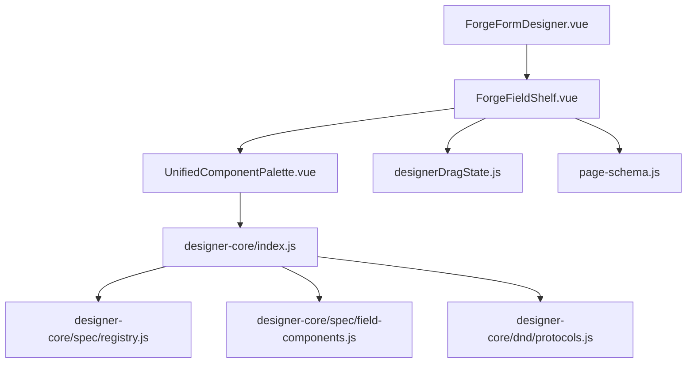
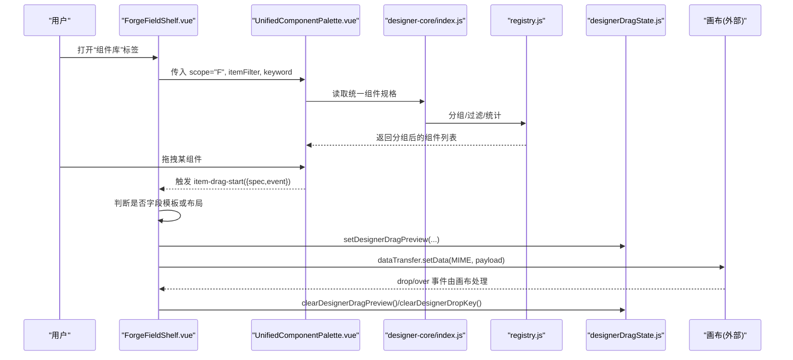
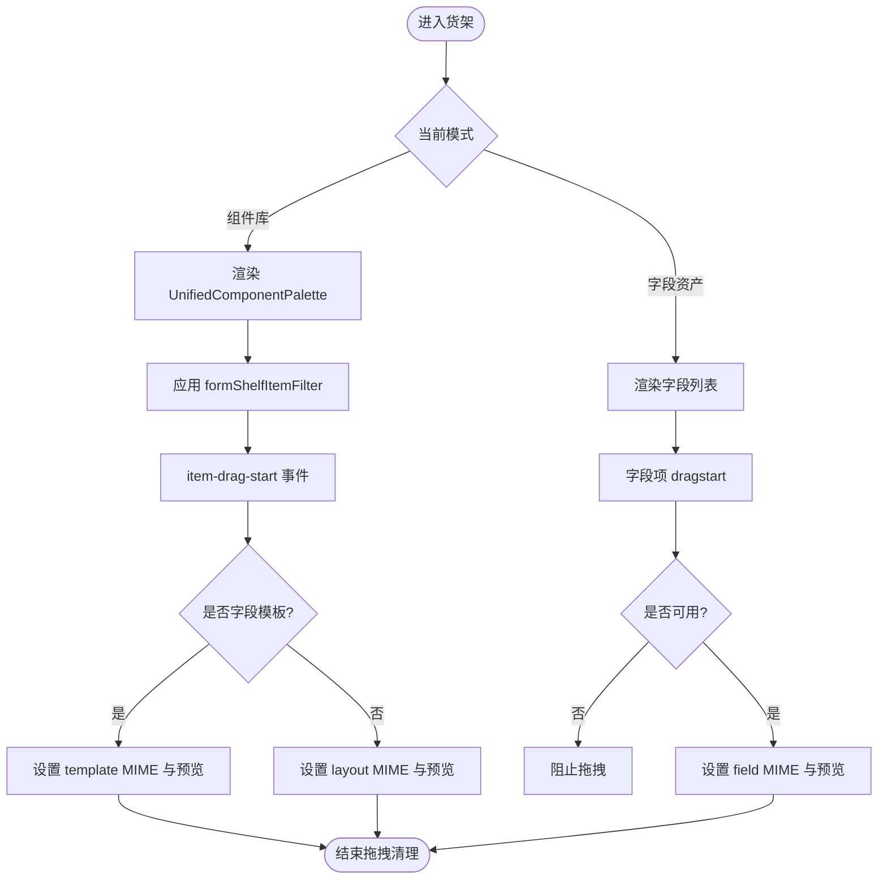
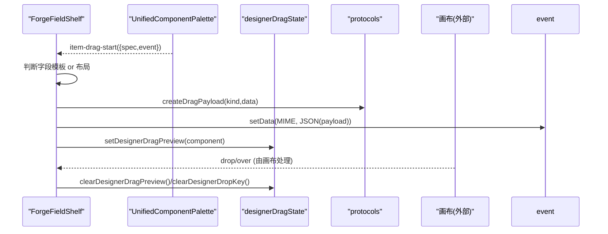
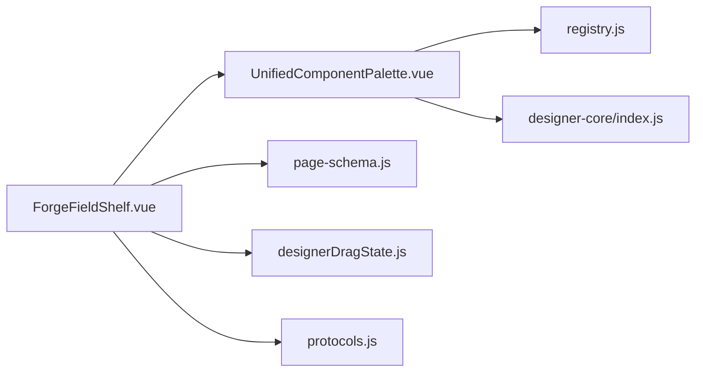

# 字段货架组件

<cite>
**本文引用的文件**
- [ForgeFieldShelf.vue](file://forge-admin-ui/src/views/app-center/components/designer/forge-form-designer/ForgeFieldShelf.vue)
- [ForgeFormDesigner.vue](file://forge-admin-ui/src/views/app-center/components/designer/forge-form-designer/ForgeFormDesigner.vue)
- [designerDragState.js](file://forge-admin-ui/src/views/app-center/components/designer/forge-form-designer/designerDragState.js)
- [UnifiedComponentPalette.vue](file://forge-admin-ui/src/components/lowcode-builder/designer-core/panel/UnifiedComponentPalette.vue)
- [field-components.js](file://forge-admin-ui/src/components/lowcode-builder/designer-core/spec/field-components.js)
- [registry.js](file://forge-admin-ui/src/components/lowcode-builder/designer-core/spec/registry.js)
- [index.js](file://forge-admin-ui/src/components/lowcode-builder/designer-core/index.js)
- [protocols.js](file://forge-admin-ui/src/components/lowcode-builder/designer-core/dnd/protocols.js)
- [page-schema.js](file://forge-admin-ui/src/components/lowcode-builder/page/page-schema.js)
</cite>

## 目录
1. [简介](#简介)
2. [项目结构](#项目结构)
3. [核心组件](#核心组件)
4. [架构总览](#架构总览)
5. [详细组件分析](#详细组件分析)
6. [依赖关系分析](#依赖关系分析)
7. [性能考量](#性能考量)
8. [故障排查指南](#故障排查指南)
9. [结论](#结论)
10. [附录：扩展与自定义指南](#附录：扩展与自定义指南)

## 简介
本文件围绕表单设计器的“字段货架”能力，系统性说明 ForgeFieldShelf 组件的设计模式与实现要点，覆盖字段分类管理、拖拽源定义、字段模板渲染、字段类型注册机制、拖拽交互流程、字段预配置等。同时提供完整的扩展接口与自定义字段类型开发指南，并给出添加新字段类型与自定义拖拽行为的实践路径（以代码片段路径引用为主）。

## 项目结构
字段货架位于表单设计器左侧面板，负责展示两类内容：
- 统一组件物料面板（designer-core）：布局与业务组件，按 scope 过滤后呈现。
- 字段资产面板：当前模型字段列表，支持未使用/已使用/系统字段分组与搜索。

图表来源
- [ForgeFormDesigner.vue:16-37](file://forge-admin-ui/src/views/app-center/components/designer/forge-form-designer/ForgeFormDesigner.vue#L16-L37)
- [ForgeFieldShelf.vue:1-116](file://forge-admin-ui/src/views/app-center/components/designer/forge-form-designer/ForgeFieldShelf.vue#L1-L116)
- [UnifiedComponentPalette.vue:45-71](file://forge-admin-ui/src/components/lowcode-builder/designer-core/panel/UnifiedComponentPalette.vue#L45-L71)
- [designerDragState.js:1-52](file://forge-admin-ui/src/views/app-center/components/designer/forge-form-designer/designerDragState.js#L1-L52)
- [page-schema.js:86-107](file://forge-admin-ui/src/components/lowcode-builder/page/page-schema.js#L86-L107)
- [index.js:1-67](file://forge-admin-ui/src/components/lowcode-builder/designer-core/index.js#L1-L67)
- [registry.js:1-169](file://forge-admin-ui/src/components/lowcode-builder/designer-core/spec/registry.js#L1-L169)
- [field-components.js:1-541](file://forge-admin-ui/src/components/lowcode-builder/designer-core/spec/field-components.js#L1-L541)
- [protocols.js:1-81](file://forge-admin-ui/src/components/lowcode-builder/designer-core/dnd/protocols.js#L1-L81)

章节来源
- [ForgeFormDesigner.vue:16-37](file://forge-admin-ui/src/views/app-center/components/designer/forge-form-designer/ForgeFormDesigner.vue#L16-L37)
- [ForgeFieldShelf.vue:1-116](file://forge-admin-ui/src/views/app-center/components/designer/forge-form-designer/ForgeFieldShelf.vue#L1-L116)

## 核心组件
- ForgeFieldShelf.vue：字段货架主容器，负责双模式切换（组件库/字段资产）、搜索过滤、拖拽源设置、状态清理。
- UnifiedComponentPalette.vue：统一组件物料面板，基于 designer-core 注册表进行分组、过滤、图标映射与拖拽事件派发。
- designerDragState.js：设计器全局拖拽状态（预览、源、落点键、错误提示）。
- page-schema.js：字段可见性与系统字段判定逻辑（用于区分系统字段与业务字段）。
- designer-core/index.js：统一导出入口，首次导入时自动注册全部组件 spec。
- registry.js：统一组件注册表，提供注册、查询、别名解析、分组、统计等 API。
- field-components.js：字段组件 spec 集合（输入/选择/业务），包含 propsSchema、fieldDefaults、数据源声明等。
- protocols.js：跨设计器拖拽协议（MIME 类型、载荷创建与解析）。

章节来源
- [ForgeFieldShelf.vue:109-251](file://forge-admin-ui/src/views/app-center/components/designer/forge-form-designer/ForgeFieldShelf.vue#L109-L251)
- [UnifiedComponentPalette.vue:45-71](file://forge-admin-ui/src/components/lowcode-builder/designer-core/panel/UnifiedComponentPalette.vue#L45-L71)
- [designerDragState.js:1-52](file://forge-admin-ui/src/views/app-center/components/designer/forge-form-designer/designerDragState.js#L1-L52)
- [page-schema.js:86-107](file://forge-admin-ui/src/components/lowcode-builder/page/page-schema.js#L86-L107)
- [index.js:1-67](file://forge-admin-ui/src/components/lowcode-builder/designer-core/index.js#L1-L67)
- [registry.js:1-169](file://forge-admin-ui/src/components/lowcode-builder/designer-core/spec/registry.js#L1-L169)
- [field-components.js:1-541](file://forge-admin-ui/src/components/lowcode-builder/designer-core/spec/field-components.js#L1-L541)
- [protocols.js:1-81](file://forge-admin-ui/src/components/lowcode-builder/designer-core/dnd/protocols.js#L1-L81)

## 架构总览
字段货架通过“统一注册表 + 接入方过滤 + 拖拽协议”的解耦方式，将“组件物料”和“字段资产”统一到同一交互范式下：
- 统一注册表：所有组件 spec 在 designer-core 中集中管理与分发。
- 接入方过滤：表单侧通过 formShelfItemFilter 控制哪些组件可出现在货架上。
- 拖拽协议：货架与画布之间通过 dataTransfer 的 MIME 类型传递载荷，配合全局拖拽状态完成预览与落点处理。

图表来源
- [ForgeFieldShelf.vue:139-200](file://forge-admin-ui/src/views/app-center/components/designer/forge-form-designer/ForgeFieldShelf.vue#L139-L200)
- [UnifiedComponentPalette.vue:45-71](file://forge-admin-ui/src/components/lowcode-builder/designer-core/panel/UnifiedComponentPalette.vue#L45-L71)
- [index.js:1-67](file://forge-admin-ui/src/components/lowcode-builder/designer-core/index.js#L1-L67)
- [registry.js:85-125](file://forge-admin-ui/src/components/lowcode-builder/designer-core/spec/registry.js#L85-L125)
- [designerDragState.js:1-52](file://forge-admin-ui/src/views/app-center/components/designer/forge-form-designer/designerDragState.js#L1-L52)

## 详细组件分析

### ForgeFieldShelf 组件
职责
- 双模式切换：组件库 vs 字段资产。
- 搜索与过滤：关键字匹配字段名称、编码、类型等；组件库侧通过 itemFilter 控制显示。
- 拖拽源定义：为“组件库”与“字段资产”分别设置不同的 MIME 类型与载荷。
- 状态管理：记录当前拖拽项 key，并在拖拽结束时清理预览、源与落点键。

关键逻辑
- 组件库白名单过滤：formShelfItemFilter 根据 FORM_CANVAS_LAYOUT_KEYS、FORM_FIELD_TEMPLATE_TYPES、FORM_CANVAS_WIDGET_KEYS 决定显示。
- 字段模板识别：toFieldPaletteGroups 汇总字段模板类型，transfer 作为双重身份走 template 链路。
- 字段资产分组：基于 isReadonlySystemField 区分系统字段与业务字段，再按 used/unused/system 三栏展示。
- 拖拽行为：handleUnifiedShelfDragStart 与 handleFieldDragStart 分别写入不同 MIME 与预览信息，finishDragging 统一清理。

图表来源
- [ForgeFieldShelf.vue:139-200](file://forge-admin-ui/src/views/app-center/components/designer/forge-form-designer/ForgeFieldShelf.vue#L139-L200)
- [ForgeFieldShelf.vue:202-251](file://forge-admin-ui/src/views/app-center/components/designer/forge-form-designer/ForgeFieldShelf.vue#L202-L251)

章节来源
- [ForgeFieldShelf.vue:1-251](file://forge-admin-ui/src/views/app-center/components/designer/forge-form-designer/ForgeFieldShelf.vue#L1-L251)

### UnifiedComponentPalette 组件
职责
- 基于 designer-core 注册表，按 scope 过滤并分组展示组件。
- 提供统一的搜索、禁用原因、点击与拖拽事件。
- 维护图标映射与分组顺序，保证 UI 一致性。

关键点
- 作用域过滤：scope='F' 仅显示表单可用的组件。
- 接入方过滤：itemFilter 允许上层按需隐藏/限制组件（如包装节点、子表无关系时隐藏）。
- 拖拽事件：emit item-drag-start，由父组件（ForgeFieldShelf）决定具体 MIME 与载荷。

章节来源
- [UnifiedComponentPalette.vue:45-71](file://forge-admin-ui/src/components/lowcode-builder/designer-core/panel/UnifiedComponentPalette.vue#L45-L71)
- [UnifiedComponentPalette.vue:181-200](file://forge-admin-ui/src/components/lowcode-builder/designer-core/panel/UnifiedComponentPalette.vue#L181-L200)

### 字段类型注册机制
- 集中注册：designer-core/index.js 在首次 import 时调用 registerComponents(allComponentSpecs)，将字段、布局、业务、页面、媒体、控件、区域动作等全部注册到 registry。
- 字段 spec：field-components.js 定义每个字段的 type、aliases、group、category、propsSchema、dataSources、fieldDefaults 等元数据。
- 注册表 API：registry.js 提供 registerComponent/registerComponents、getComponentSpec、resolveComponentType、listComponentsByCategory、groupComponents、getRegistryStats 等。

扩展建议
- 新增字段类型：在 field-components.js 中新增 spec，并确保 fieldDefaults 与 propsSchema 完整；或通过 registerComponent 动态注册。
- 别名兼容：通过 aliases 保持历史键名兼容。
- 作用域控制：通过 scope 控制是否对表单/列表可见。

章节来源
- [index.js:1-67](file://forge-admin-ui/src/components/lowcode-builder/designer-core/index.js#L1-L67)
- [field-components.js:1-541](file://forge-admin-ui/src/components/lowcode-builder/designer-core/spec/field-components.js#L1-L541)
- [registry.js:1-169](file://forge-admin-ui/src/components/lowcode-builder/designer-core/spec/registry.js#L1-L169)

### 拖拽交互实现
- 组件库拖拽：ForgeFieldShelf.handleUnifiedShelfDragStart 根据是否为字段模板设置不同 MIME 类型（template/layout），并通过 setDesignerDragPreview 设置预览。
- 字段资产拖拽：handleFieldDragStart 校验可用性后设置 field MIME 与预览。
- 全局状态：designerDragState.js 提供 preview/sourceId/dropKey/error 的全局 ref 管理，确保多设计器间一致。
- 协议规范：dnd/protocols.js 定义了跨设计器的 MIME 常量与载荷创建/解析工具，便于未来扩展。

图表来源
- [ForgeFieldShelf.vue:188-200](file://forge-admin-ui/src/views/app-center/components/designer/forge-form-designer/ForgeFieldShelf.vue#L188-L200)
- [ForgeFieldShelf.vue:232-251](file://forge-admin-ui/src/views/app-center/components/designer/forge-form-designer/ForgeFieldShelf.vue#L232-L251)
- [designerDragState.js:1-52](file://forge-admin-ui/src/views/app-center/components/designer/forge-form-designer/designerDragState.js#L1-L52)
- [protocols.js:1-81](file://forge-admin-ui/src/components/lowcode-builder/designer-core/dnd/protocols.js#L1-L81)

章节来源
- [ForgeFieldShelf.vue:188-251](file://forge-admin-ui/src/views/app-center/components/designer/forge-form-designer/ForgeFieldShelf.vue#L188-L251)
- [designerDragState.js:1-52](file://forge-admin-ui/src/views/app-center/components/designer/forge-form-designer/designerDragState.js#L1-L52)
- [protocols.js:1-81](file://forge-admin-ui/src/components/lowcode-builder/designer-core/dnd/protocols.js#L1-L81)

### 字段预配置
- 字段默认值：field-components.js 中的 fieldDefaults 定义了每种字段的业务字段类型、数据类型、组件类型、长度、精度、查询类型等。
- 系统字段保护：page-schema.js 的 isReadonlySystemField 用于识别系统字段（如 id、createBy、createTime 等），货架中将其标记为“系统”且不可用。
- 可见性控制：isPageFieldVisible 与相关过滤函数用于在不同区域（search/edit/detail/table）控制字段可见性。

章节来源
- [field-components.js:12-528](file://forge-admin-ui/src/components/lowcode-builder/designer-core/spec/field-components.js#L12-L528)
- [page-schema.js:86-107](file://forge-admin-ui/src/components/lowcode-builder/page/page-schema.js#L86-L107)

## 依赖关系分析
- ForgeFieldShelf 依赖 UnifiedComponentPalette 提供统一物料面板，依赖 designer-core 暴露的桥接函数（toFieldPaletteGroups、toPageWidgetCatalog、FORM_COMPONENT_KEY_OVERRIDES）。
- UnifiedComponentPalette 依赖 registry 提供的分组与过滤能力。
- 拖拽流程依赖 protocols 定义的 MIME 与载荷工具，以及 designerDragState 的全局状态。
- 字段资产面板依赖 page-schema 的系统字段判定与可见性逻辑。

图表来源
- [ForgeFieldShelf.vue:109-200](file://forge-admin-ui/src/views/app-center/components/designer/forge-form-designer/ForgeFieldShelf.vue#L109-L200)
- [UnifiedComponentPalette.vue:45-71](file://forge-admin-ui/src/components/lowcode-builder/designer-core/panel/UnifiedComponentPalette.vue#L45-L71)
- [registry.js:85-125](file://forge-admin-ui/src/components/lowcode-builder/designer-core/spec/registry.js#L85-L125)
- [index.js:1-67](file://forge-admin-ui/src/components/lowcode-builder/designer-core/index.js#L1-L67)
- [protocols.js:1-81](file://forge-admin-ui/src/components/lowcode-builder/designer-core/dnd/protocols.js#L1-L81)

章节来源
- [ForgeFieldShelf.vue:109-200](file://forge-admin-ui/src/views/app-center/components/designer/forge-form-designer/ForgeFieldShelf.vue#L109-L200)
- [UnifiedComponentPalette.vue:45-71](file://forge-admin-ui/src/components/lowcode-builder/designer-core/panel/UnifiedComponentPalette.vue#L45-L71)
- [registry.js:85-125](file://forge-admin-ui/src/components/lowcode-builder/designer-core/spec/registry.js#L85-L125)
- [index.js:1-67](file://forge-admin-ui/src/components/lowcode-builder/designer-core/index.js#L1-L67)
- [protocols.js:1-81](file://forge-admin-ui/src/components/lowcode-builder/designer-core/dnd/protocols.js#L1-L81)

## 性能考量
- 分组与过滤：registry.groupComponents 与 listComponentsByCategory 在内存中进行分组与过滤，适合中等规模组件集；若组件数量增长，可考虑懒加载分组或虚拟滚动。
- 搜索优化：keyword 过滤在计算属性中执行，避免重复计算；对于大量字段，可引入防抖或分页。
- 拖拽预览：setDesignerDragPreview 仅在拖拽开始时设置，结束时清理，减少不必要的重渲染。
- 白名单过滤：formShelfItemFilter 提前隐藏不支持的组件，降低无效交互带来的开销。

[本节为通用性能建议，不直接分析具体文件]

## 故障排查指南
常见问题与定位
- 组件未显示：检查 UnifiedComponentPalette 的 scope 与 itemFilter；确认 registry 中已注册对应 spec。
- 拖拽无效：确认 handleUnifiedShelfDragStart/handleFieldDragStart 正确设置 MIME 与预览；检查 finishDragging 是否被调用。
- 系统字段不可拖拽：确认 isReadonlySystemField 判定是否符合预期；如需调整，修改 page-schema.js 中的系统字段集合。
- 预览不消失：检查 designerDragState 的 clearDesignerDragPreview/clearDesignerDropKey 是否在拖拽结束时调用。

章节来源
- [ForgeFieldShelf.vue:188-251](file://forge-admin-ui/src/views/app-center/components/designer/forge-form-designer/ForgeFieldShelf.vue#L188-L251)
- [designerDragState.js:1-52](file://forge-admin-ui/src/views/app-center/components/designer/forge-form-designer/designerDragState.js#L1-L52)
- [page-schema.js:86-107](file://forge-admin-ui/src/components/lowcode-builder/page/page-schema.js#L86-L107)

## 结论
ForgeFieldShelf 通过统一注册表、接入方过滤与标准化拖拽协议，实现了表单设计器中“组件库”与“字段资产”的统一交互体验。其设计具备良好的可扩展性：新增字段类型只需在 spec 中声明，货架即可自动呈现；自定义拖拽行为可通过拦截 item-drag-start 与设置 MIME 载荷实现。结合 page-schema 的系统字段保护与可见性控制，保证了配置的合理性与安全性。

[本节为总结性内容，不直接分析具体文件]

## 附录：扩展与自定义指南

### 添加新的字段类型
步骤
- 在 field-components.js 中新增 spec，包含 type、aliases、group、category、propsSchema、dataSources、fieldDefaults。
- 若需对外暴露别名，填写 aliases 数组。
- 若需限定作用域，设置 scope 为 'F' 或 'F+L'。
- 重新运行应用，货架将自动显示新字段。

参考路径
- [字段 spec 示例（输入类）:12-27](file://forge-admin-ui/src/components/lowcode-builder/designer-core/spec/field-components.js#L12-L27)
- [字段 spec 示例（选择类）:147-161](file://forge-admin-ui/src/components/lowcode-builder/designer-core/spec/field-components.js#L147-L161)
- [字段 spec 示例（业务类）:409-421](file://forge-admin-ui/src/components/lowcode-builder/designer-core/spec/field-components.js#L409-L421)

章节来源
- [field-components.js:12-528](file://forge-admin-ui/src/components/lowcode-builder/designer-core/spec/field-components.js#L12-L528)

### 自定义拖拽行为
目标
- 在货架中为特定组件或字段定制拖拽时的 MIME 类型与载荷内容。
- 在拖拽开始/结束时注入额外状态（如预览、源标识、落点键）。

实现要点
- 在 ForgeFieldShelf 的 handleUnifiedShelfDragStart 中，根据 spec.type 或 componentKey 分支设置不同 MIME 与 payload。
- 使用 setDesignerDragPreview 设置拖拽预览，finishDragging 中清理状态。
- 如需跨设计器共享协议，遵循 protocols.js 的 DESIGNER_MIME 与 createDragPayload/parseDragPayload。

参考路径
- [组件库拖拽处理:188-200](file://forge-admin-ui/src/views/app-center/components/designer/forge-form-designer/ForgeFieldShelf.vue#L188-L200)
- [字段资产拖拽处理:232-244](file://forge-admin-ui/src/views/app-center/components/designer/forge-form-designer/ForgeFieldShelf.vue#L232-L244)
- [拖拽协议定义:1-81](file://forge-admin-ui/src/components/lowcode-builder/designer-core/dnd/protocols.js#L1-81)
- [拖拽状态管理:1-52](file://forge-admin-ui/src/views/app-center/components/designer/forge-form-designer/designerDragState.js#L1-52)

章节来源
- [ForgeFieldShelf.vue:188-244](file://forge-admin-ui/src/views/app-center/components/designer/forge-form-designer/ForgeFieldShelf.vue#L188-L244)
- [protocols.js:1-81](file://forge-admin-ui/src/components/lowcode-builder/designer-core/dnd/protocols.js#L1-L81)
- [designerDragState.js:1-52](file://forge-admin-ui/src/views/app-center/components/designer/forge-form-designer/designerDragState.js#L1-L52)

### 扩展字段货架的显示与过滤
- 通过 UnifiedComponentPalette 的 itemFilter 钩子，对 spec 进行细粒度过滤（如隐藏包装节点、在无关系时隐藏 subTable）。
- 通过 toFieldPaletteGroups 与 toPageWidgetCatalog 获取字段模板与挂件键名，完善白名单逻辑。

参考路径
- [货架过滤逻辑:171-186](file://forge-admin-ui/src/views/app-center/components/designer/forge-form-designer/ForgeFieldShelf.vue#L171-L186)
- [统一物料面板过滤:185-200](file://forge-admin-ui/src/components/lowcode-builder/designer-core/panel/UnifiedComponentPalette.vue#L185-L200)

章节来源
- [ForgeFieldShelf.vue:171-186](file://forge-admin-ui/src/views/app-center/components/designer/forge-form-designer/ForgeFieldShelf.vue#L171-L186)
- [UnifiedComponentPalette.vue:185-200](file://forge-admin-ui/src/components/lowcode-builder/designer-core/panel/UnifiedComponentPalette.vue#L185-L200)