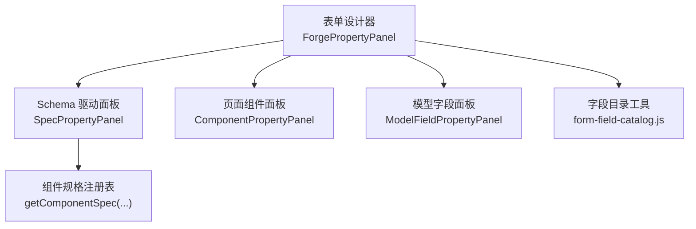
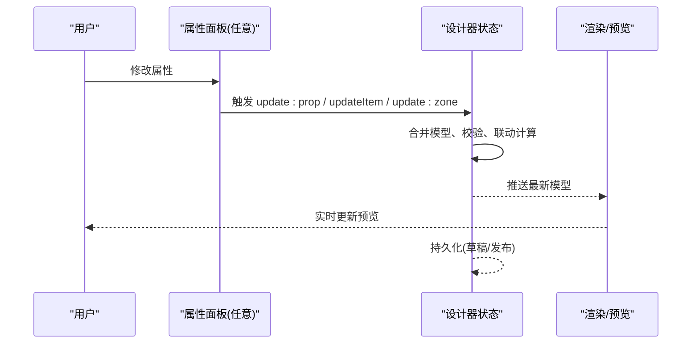
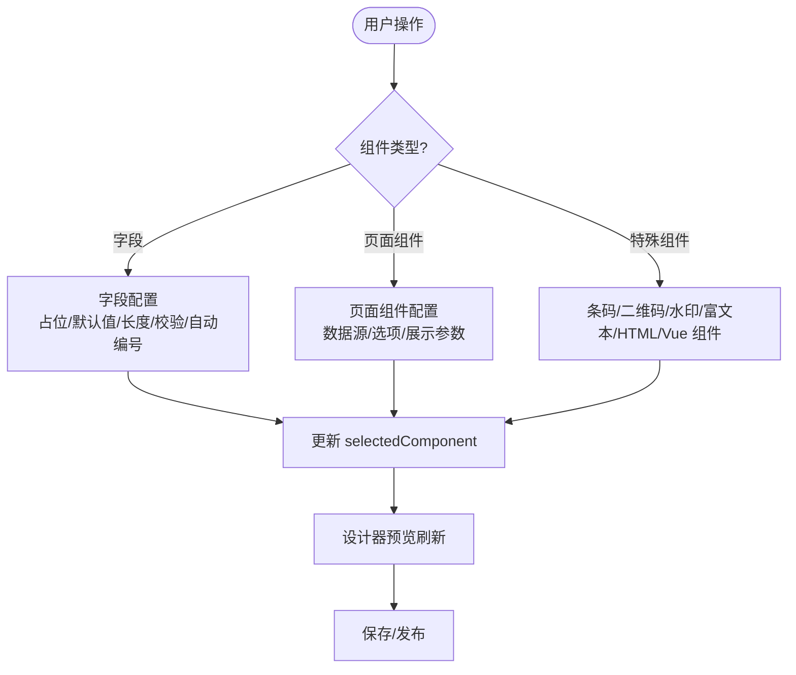
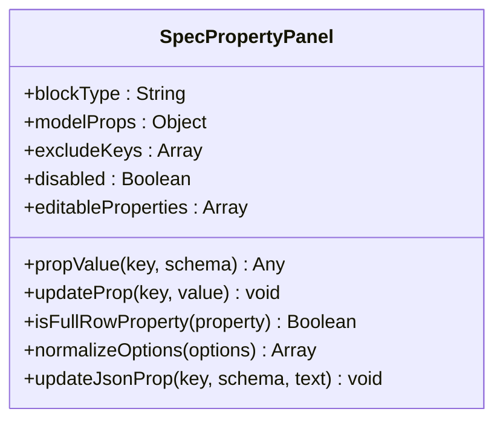
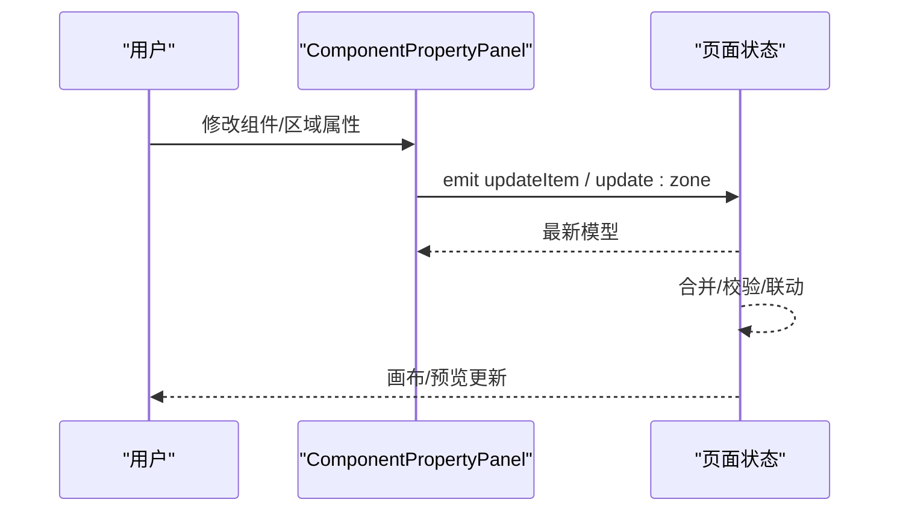
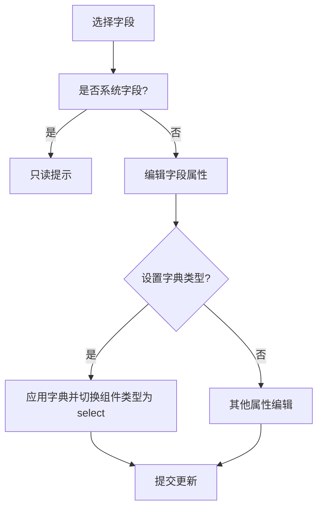
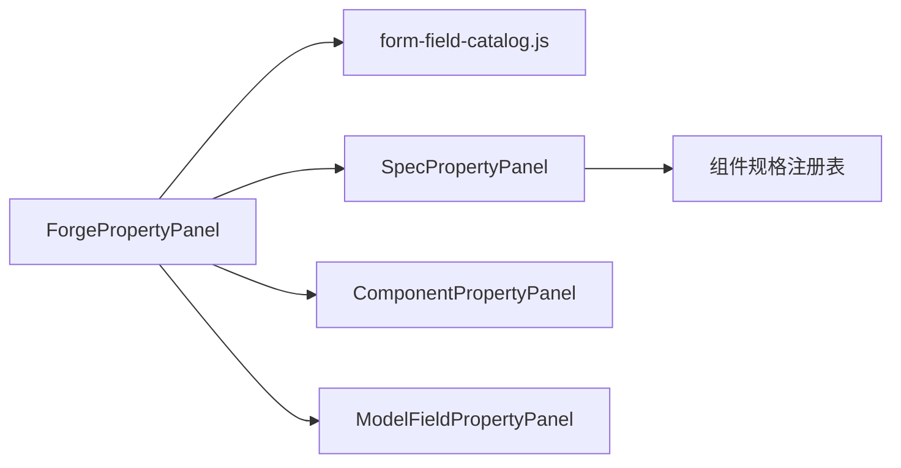

# 属性面板系统

<cite>
**本文引用的文件**
- [ForgePropertyPanel.vue](file://forge-admin-ui/src/views/app-center/components/designer/forge-form-designer/ForgePropertyPanel.vue)
- [SpecPropertyPanel.vue](file://forge-admin-ui/src/components/lowcode-builder/designer-core/panel/SpecPropertyPanel.vue)
- [ComponentPropertyPanel.vue](file://forge-admin-ui/src/components/lowcode-builder/page/ComponentPropertyPanel.vue)
- [ModelFieldPropertyPanel.vue](file://forge-admin-ui/src/components/lowcode-builder/model/ModelFieldPropertyPanel.vue)
- [form-field-catalog.js](file://forge-admin-ui/src/views/flow/utils/form-field-catalog.js)
</cite>

## 目录
1. [简介](#简介)
2. [项目结构](#项目结构)
3. [核心组件](#核心组件)
4. [架构总览](#架构总览)
5. [详细组件分析](#详细组件分析)
6. [依赖关系分析](#依赖关系分析)
7. [性能考量](#性能考量)
8. [故障排查指南](#故障排查指南)
9. [结论](#结论)
10. [附录：扩展与自定义指南](#附录：扩展与自定义指南)

## 简介
本文件面向表单设计器“属性面板系统”，围绕 ForgePropertyPanel 组件及其周边能力，系统化说明属性配置管理、动态表单生成、实时预览、字段联动、验证机制、配置持久化等关键实现。同时提供属性面板扩展接口与自定义编辑器开发指南，并给出添加新属性与自定义编辑控件的实践路径（以代码片段路径引用形式呈现）。

## 项目结构
属性面板系统由三类面板协同工作：
- 表单设计器属性面板：以区块/字段为粒度，提供标识、布局、校验、默认值、自动编号、数据绑定等丰富配置。
- Schema 驱动的统一属性面板：基于 spec 声明自动生成 UI，支持 section、boolean、number、select、color、textarea/json 等类型，统一两列紧凑网格布局。
- 页面/模型属性面板：针对页面区域与业务模型字段，提供基础元数据、字典与安全策略等配置。

图表来源
- [ForgePropertyPanel.vue:1-800](file://forge-admin-ui/src/views/app-center/components/designer/forge-form-designer/ForgePropertyPanel.vue#L1-L800)
- [SpecPropertyPanel.vue:1-288](file://forge-admin-ui/src/components/lowcode-builder/designer-core/panel/SpecPropertyPanel.vue#L1-L288)
- [ComponentPropertyPanel.vue:1-563](file://forge-admin-ui/src/components/lowcode-builder/page/ComponentPropertyPanel.vue#L1-L563)
- [ModelFieldPropertyPanel.vue:1-283](file://forge-admin-ui/src/components/lowcode-builder/model/ModelFieldPropertyPanel.vue#L1-L283)
- [form-field-catalog.js:1-133](file://forge-admin-ui/src/views/flow/utils/form-field-catalog.js#L1-L133)

章节来源
- [ForgePropertyPanel.vue:1-800](file://forge-admin-ui/src/views/app-center/components/designer/forge-form-designer/ForgePropertyPanel.vue#L1-L800)
- [SpecPropertyPanel.vue:1-288](file://forge-admin-ui/src/components/lowcode-builder/designer-core/panel/SpecPropertyPanel.vue#L1-L288)
- [ComponentPropertyPanel.vue:1-563](file://forge-admin-ui/src/components/lowcode-builder/page/ComponentPropertyPanel.vue#L1-L563)
- [ModelFieldPropertyPanel.vue:1-283](file://forge-admin-ui/src/components/lowcode-builder/model/ModelFieldPropertyPanel.vue#L1-L283)
- [form-field-catalog.js:1-133](file://forge-admin-ui/src/views/flow/utils/form-field-catalog.js#L1-L133)

## 核心组件
- ForgePropertyPanel：表单设计器的主体属性面板，负责选中区块/字段的综合配置，包括标识、栅格、字段约束、默认值、自动编号、数据源绑定、富文本/二维码/水印等可视化配置，以及搜索定位与标签页分组。
- SpecPropertyPanel：schema 驱动的通用属性面板，根据组件规格（propsSchema）动态渲染属性编辑控件，支持 section 分组、布尔开关内联、长内容占满整行、JSON 输入与校验等。
- ComponentPropertyPanel：页面区域与组件的属性面板，支持组件名称、类型、字段绑定、多字段选择与排序、布局坐标与样式、列表能力与树形导航配置等。
- ModelFieldPropertyPanel：模型字段属性面板，提供数据库映射、主键/系统字段标记、字典类型、敏感类型与加密算法等安全与元数据配置，并内置推荐建议应用。
- form-field-catalog.js：从表单 schema 中抽取字段目录，推断数据类型、必填、选项来源等，用于属性面板的字段联动与默认组件推导。

章节来源
- [ForgePropertyPanel.vue:1-800](file://forge-admin-ui/src/views/app-center/components/designer/forge-form-designer/ForgePropertyPanel.vue#L1-L800)
- [SpecPropertyPanel.vue:1-288](file://forge-admin-ui/src/components/lowcode-builder/designer-core/panel/SpecPropertyPanel.vue#L1-L288)
- [ComponentPropertyPanel.vue:1-563](file://forge-admin-ui/src/components/lowcode-builder/page/ComponentPropertyPanel.vue#L1-L563)
- [ModelFieldPropertyPanel.vue:1-283](file://forge-admin-ui/src/components/lowcode-builder/model/ModelFieldPropertyPanel.vue#L1-L283)
- [form-field-catalog.js:1-133](file://forge-admin-ui/src/views/flow/utils/form-field-catalog.js#L1-L133)

## 架构总览
属性面板系统采用“声明式 + 事件驱动”的架构：
- 声明式：通过 propsSchema/spec 声明属性类型、默认值、提示、范围等，SpecPropertyPanel 据此自动生成 UI。
- 事件驱动：所有属性变更通过 update:prop / updateItem / update:zone / emit('update:field') 等事件向上传递，由上层设计器状态管理进行合并与持久化。
- 数据流：用户交互 → 属性面板更新局部 props → 触发事件 → 父级合并模型 → 同步到画布/预览 → 保存至存储。

图表来源
- [SpecPropertyPanel.vue:46-85](file://forge-admin-ui/src/components/lowcode-builder/designer-core/panel/SpecPropertyPanel.vue#L46-L85)
- [ComponentPropertyPanel.vue:424-451](file://forge-admin-ui/src/components/lowcode-builder/page/ComponentPropertyPanel.vue#L424-L451)
- [ModelFieldPropertyPanel.vue:140-172](file://forge-admin-ui/src/components/lowcode-builder/model/ModelFieldPropertyPanel.vue#L140-L172)

## 详细组件分析

### ForgePropertyPanel 分析
- 属性配置管理：通过 n-tabs/n-collapse 组织“标识/栅格/字段组件/数据源/校验/自动编号”等分组；支持关键字搜索快速定位属性项。
- 动态表单生成：根据 selectedComponent.componentKey 条件渲染不同配置区（如 watermark、barcode/qrcode、rich-text/markdown/vue-component 等），并维护 dataBinding、optionSource 等运行时配置。
- 实时预览：属性变更直接回写 selectedComponent.props/layout/validation，配合设计器预览刷新。
- 字段联动逻辑：切换组件类型时联动 fieldBinding、默认组件类型、可见性；数据源切换时联动 API/method/dataPath/paramsText 等。
- 验证机制：常用校验预设 + 正则表达式；自动编号规则预览与错误提示；字段最大长度与计数显示。
- 配置持久化：所有更新通过 updateComponent/updatePageWidgetDataBinding/updateGenerationConfig 等方法将变更写入当前组件节点，最终由设计器统一保存。

图表来源
- [ForgePropertyPanel.vue:30-543](file://forge-admin-ui/src/views/app-center/components/designer/forge-form-designer/ForgePropertyPanel.vue#L30-L543)
- [ForgePropertyPanel.vue:629-800](file://forge-admin-ui/src/views/app-center/components/designer/forge-form-designer/ForgePropertyPanel.vue#L629-L800)

章节来源
- [ForgePropertyPanel.vue:1-800](file://forge-admin-ui/src/views/app-center/components/designer/forge-form-designer/ForgePropertyPanel.vue#L1-L800)

### SpecPropertyPanel 分析
- Schema 驱动：读取 getComponentSpec(blockType).propsSchema.properties，过滤 excludeKeys，按顺序渲染可编辑属性。
- 控件映射：boolean→switch；number→input-number；select→select；color→color-picker；json/textarea/html→textarea（JSON 在 blur/change 时解析并回写）。
- 布局策略：section 标题占满整行；长内容属性占满整行；常规控件两列网格；布尔开关一行式。
- 占位与提示：优先使用 property.placeholder，否则以 default 字符串作为 placeholder；支持 desc 提示。
- 扩展点：复杂编辑器可通过 customEditor 挂载（由接入方决定），当前覆盖常见属性类型。

图表来源
- [SpecPropertyPanel.vue:14-85](file://forge-admin-ui/src/components/lowcode-builder/designer-core/panel/SpecPropertyPanel.vue#L14-L85)
- [SpecPropertyPanel.vue:88-199](file://forge-admin-ui/src/components/lowcode-builder/designer-core/panel/SpecPropertyPanel.vue#L88-L199)

章节来源
- [SpecPropertyPanel.vue:1-288](file://forge-admin-ui/src/components/lowcode-builder/designer-core/panel/SpecPropertyPanel.vue#L1-L288)

### ComponentPropertyPanel 分析
- 页面区域与组件属性：支持启用/禁用区域、组件名称与类型、单/多字段绑定与排序、布局坐标与样式、列表能力开关、树形导航配置等。
- 多字段支持：query-set/data-table 等组件支持多选字段与拖拽排序，内部维护 selectedFieldRefs 与 selectedFieldRows。
- 树形导航：当 layoutType=tree-crud 且 zoneKey=table 时，自动初始化 treeConfig（enabled/keyField/parentField/labelField/childrenField/treeTitle/loadMode）。

图表来源
- [ComponentPropertyPanel.vue:266-451](file://forge-admin-ui/src/components/lowcode-builder/page/ComponentPropertyPanel.vue#L266-L451)

章节来源
- [ComponentPropertyPanel.vue:1-563](file://forge-admin-ui/src/components/lowcode-builder/page/ComponentPropertyPanel.vue#L1-L563)

### ModelFieldPropertyPanel 分析
- 数据库映射：列名、主键、系统字段标记（只读保护）。
- 字典与安全：字典类型选择；敏感类型与加密算法；基于 domainSchema 的推荐建议（字典/脱敏）一键应用。
- 联动：设置 dictType 时自动将 componentType 设为 select；系统字段不可编辑。

图表来源
- [ModelFieldPropertyPanel.vue:105-172](file://forge-admin-ui/src/components/lowcode-builder/model/ModelFieldPropertyPanel.vue#L105-L172)

章节来源
- [ModelFieldPropertyPanel.vue:1-283](file://forge-admin-ui/src/components/lowcode-builder/model/ModelFieldPropertyPanel.vue#L1-L283)

### 字段目录与联动（form-field-catalog.js）
- 作用：从表单 schema 中提取字段目录，推断 dataType、required、optionSource 等，供属性面板做字段联动与默认组件推导。
- 关键点：支持数组/对象/字符串三种 schema 输入；递归收集字段；去重合并；label 与 required 的多源解析。

章节来源
- [form-field-catalog.js:1-133](file://forge-admin-ui/src/views/flow/utils/form-field-catalog.js#L1-L133)

## 依赖关系分析
- 组件耦合：
  - ForgePropertyPanel 依赖页面/区块模型与字段目录，负责具体业务属性的编辑与联动。
  - SpecPropertyPanel 依赖组件规格注册表（getComponentSpec），解耦 UI 与属性定义。
  - ComponentPropertyPanel 与 ModelFieldPropertyPanel 分别面向页面与模型维度，与上层设计器状态紧密协作。
- 外部依赖：
  - N 系列 UI 组件（n-input、n-select、n-switch、n-color-picker、n-tabs、n-collapse 等）。
  - 拖拽库（vuedraggable）用于字段排序。
- 潜在循环依赖：无直接循环；通过事件与状态层解耦。

图表来源
- [ForgePropertyPanel.vue:1-800](file://forge-admin-ui/src/views/app-center/components/designer/forge-form-designer/ForgePropertyPanel.vue#L1-L800)
- [SpecPropertyPanel.vue:1-288](file://forge-admin-ui/src/components/lowcode-builder/designer-core/panel/SpecPropertyPanel.vue#L1-L288)
- [ComponentPropertyPanel.vue:1-563](file://forge-admin-ui/src/components/lowcode-builder/page/ComponentPropertyPanel.vue#L1-L563)
- [ModelFieldPropertyPanel.vue:1-283](file://forge-admin-ui/src/components/lowcode-builder/model/ModelFieldPropertyPanel.vue#L1-L283)
- [form-field-catalog.js:1-133](file://forge-admin-ui/src/views/flow/utils/form-field-catalog.js#L1-L133)

章节来源
- [ForgePropertyPanel.vue:1-800](file://forge-admin-ui/src/views/app-center/components/designer/forge-form-designer/ForgePropertyPanel.vue#L1-L800)
- [SpecPropertyPanel.vue:1-288](file://forge-admin-ui/src/components/lowcode-builder/designer-core/panel/SpecPropertyPanel.vue#L1-L288)
- [ComponentPropertyPanel.vue:1-563](file://forge-admin-ui/src/components/lowcode-builder/page/ComponentPropertyPanel.vue#L1-L563)
- [ModelFieldPropertyPanel.vue:1-283](file://forge-admin-ui/src/components/lowcode-builder/model/ModelFieldPropertyPanel.vue#L1-L283)
- [form-field-catalog.js:1-133](file://forge-admin-ui/src/views/flow/utils/form-field-catalog.js#L1-L133)

## 性能考量
- 渲染优化：
  - 使用 v-if/v-show 按需渲染特定组件的配置区，减少初始渲染开销。
  - 长内容属性（JSON/textarea）仅在必要时展开，避免频繁大对象序列化。
- 交互优化：
  - 搜索定位仅对当前可见属性进行匹配，降低 DOM 遍历成本。
  - JSON 输入延迟解析（blur/change），避免每次按键都触发解析与回写。
- 数据更新：
  - 属性变更通过最小化 patch 合并，减少重绘范围。
  - 字段目录构建采用 Map 去重，提升大数据量下的性能。

[本节为通用指导，不直接分析具体文件]

## 故障排查指南
- JSON 解析失败：
  - 现象：SpecPropertyPanel 中 JSON 输入非法时不回写。
  - 处理：检查 JSON 语法，确保格式正确后再提交。
  - 参考路径：[SpecPropertyPanel.vue:74-85](file://forge-admin-ui/src/components/lowcode-builder/designer-core/panel/SpecPropertyPanel.vue#L74-L85)
- 字段只读：
  - 现象：系统字段无法修改。
  - 处理：确认是否为系统字段；如需调整，请在模型层开放权限或迁移为非系统字段。
  - 参考路径：[ModelFieldPropertyPanel.vue:16-49](file://forge-admin-ui/src/components/lowcode-builder/model/ModelFieldPropertyPanel.vue#L16-L49)
- 自动编号预览错误：
  - 现象：预览显示错误或空值。
  - 处理：检查所选规则模板与上下文变量；查看错误提示并修正。
  - 参考路径：[ForgePropertyPanel.vue:731-800](file://forge-admin-ui/src/views/app-center/components/designer/forge-form-designer/ForgePropertyPanel.vue#L731-L800)
- 字段联动异常：
  - 现象：切换组件类型后字段绑定未更新。
  - 处理：确认 fieldStructureLocked 状态与业务数据锁定；检查默认组件推导逻辑。
  - 参考路径：[ForgePropertyPanel.vue:46-64](file://forge-admin-ui/src/views/app-center/components/designer/forge-form-designer/ForgePropertyPanel.vue#L46-L64)

章节来源
- [SpecPropertyPanel.vue:74-85](file://forge-admin-ui/src/components/lowcode-builder/designer-core/panel/SpecPropertyPanel.vue#L74-L85)
- [ModelFieldPropertyPanel.vue:16-49](file://forge-admin-ui/src/components/lowcode-builder/model/ModelFieldPropertyPanel.vue#L16-L49)
- [ForgePropertyPanel.vue:731-800](file://forge-admin-ui/src/views/app-center/components/designer/forge-form-designer/ForgePropertyPanel.vue#L731-L800)
- [ForgePropertyPanel.vue:46-64](file://forge-admin-ui/src/views/app-center/components/designer/forge-form-designer/ForgePropertyPanel.vue#L46-L64)

## 结论
属性面板系统通过“声明式规格 + 事件驱动更新”的方式，实现了高内聚、低耦合的可扩展属性编辑体验。ForgePropertyPanel 承担复杂业务场景的精细化配置，SpecPropertyPanel 提供通用能力的快速扩展，ComponentPropertyPanel 与 ModelFieldPropertyPanel 分别覆盖页面与模型维度的元数据管理。整体架构清晰、扩展性强，适合持续演进与生态集成。

[本节为总结性内容，不直接分析具体文件]

## 附录：扩展与自定义指南

### 新增属性配置（Schema 驱动）
- 步骤：
  1) 在组件规格中添加 propsSchema.properties 条目，指定 type/format/default/min/max/options/desc 等。
  2) 若需排除已有手写属性，传入 excludeKeys。
  3) 在 SpecPropertyPanel 中即可自动渲染对应控件。
- 参考路径：
  - [SpecPropertyPanel.vue:28-37](file://forge-admin-ui/src/components/lowcode-builder/designer-core/panel/SpecPropertyPanel.vue#L28-L37)
  - [SpecPropertyPanel.vue:147-194](file://forge-admin-ui/src/components/lowcode-builder/designer-core/panel/SpecPropertyPanel.vue#L147-L194)

### 自定义属性编辑器（复杂场景）
- 适用场景：公式、联动、CRUD 分区等超出通用控件的能力。
- 方式：通过 customEditor 挂载到 SpecPropertyPanel（由接入方实现），或在 ForgePropertyPanel 中以条件渲染方式嵌入专用编辑器。
- 参考路径：
  - [SpecPropertyPanel.vue:1-9](file://forge-admin-ui/src/components/lowcode-builder/designer-core/panel/SpecPropertyPanel.vue#L1-L9)
  - [ForgePropertyPanel.vue:30-543](file://forge-admin-ui/src/views/app-center/components/designer/forge-form-designer/ForgePropertyPanel.vue#L30-L543)

### 添加新的属性配置示例（以“水印字体大小”为例）
- 目标：在水印组件中新增“字体大小”属性，并在属性面板中提供数字输入。
- 步骤：
  1) 在组件规格中添加 number 类型属性，设置 min/max/step/default。
  2) 在 SpecPropertyPanel 中自动渲染 input-number。
  3) 通过 update:prop 事件将值回写到 modelProps。
- 参考路径：
  - [SpecPropertyPanel.vue:147-159](file://forge-admin-ui/src/components/lowcode-builder/designer-core/panel/SpecPropertyPanel.vue#L147-L159)
  - [SpecPropertyPanel.vue:46-50](file://forge-admin-ui/src/components/lowcode-builder/designer-core/panel/SpecPropertyPanel.vue#L46-L50)

### 自定义编辑控件示例（以“远程数据源”为例）
- 目标：为页面组件提供远程数据源配置（API/method/dataPath/paramsText）。
- 步骤：
  1) 在 ForgePropertyPanel 中增加条件渲染区块，绑定 selectedComponent.props.dataBinding。
  2) 使用 n-input/n-select/textarea 组合编辑各子属性。
  3) 通过 updatePageWidgetDataBinding 方法将变更写入模型。
- 参考路径：
  - [ForgePropertyPanel.vue:82-179](file://forge-admin-ui/src/views/app-center/components/designer/forge-form-designer/ForgePropertyPanel.vue#L82-L179)

### 字段联动与默认组件推导
- 目标：根据字段目录推断默认组件类型与选项来源。
- 步骤：
  1) 使用 buildLocalFormFieldCatalog 解析 schema，得到字段目录。
  2) 在属性面板中根据 dataType/optionSource 设置默认组件类型与选项。
- 参考路径：
  - [form-field-catalog.js:1-133](file://forge-admin-ui/src/views/flow/utils/form-field-catalog.js#L1-L133)
  - [ComponentPropertyPanel.vue:375-382](file://forge-admin-ui/src/components/lowcode-builder/page/ComponentPropertyPanel.vue#L375-L382)

### 配置持久化与版本管理
- 机制：所有属性变更通过事件上报，由设计器状态层合并并持久化（草稿/发布）。
- 建议：
  - 对大型 JSON 配置进行压缩与增量保存。
  - 对关键属性变更记录审计日志。
- 参考路径：
  - [SpecPropertyPanel.vue:46-50](file://forge-admin-ui/src/components/lowcode-builder/designer-core/panel/SpecPropertyPanel.vue#L46-L50)
  - [ComponentPropertyPanel.vue:424-451](file://forge-admin-ui/src/components/lowcode-builder/page/ComponentPropertyPanel.vue#L424-L451)