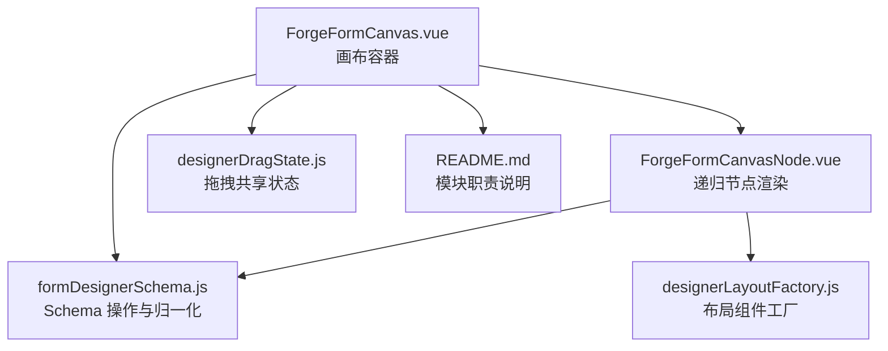
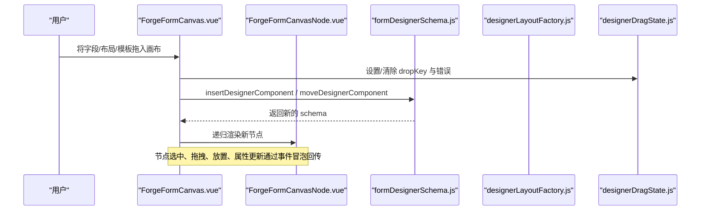
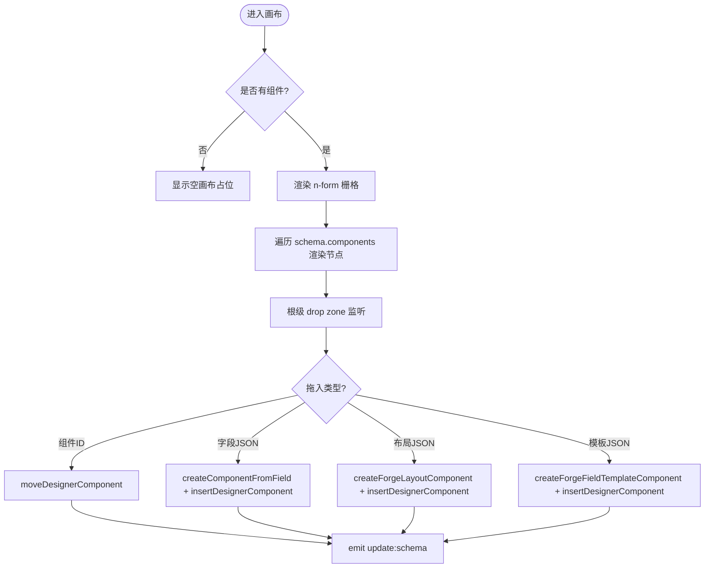
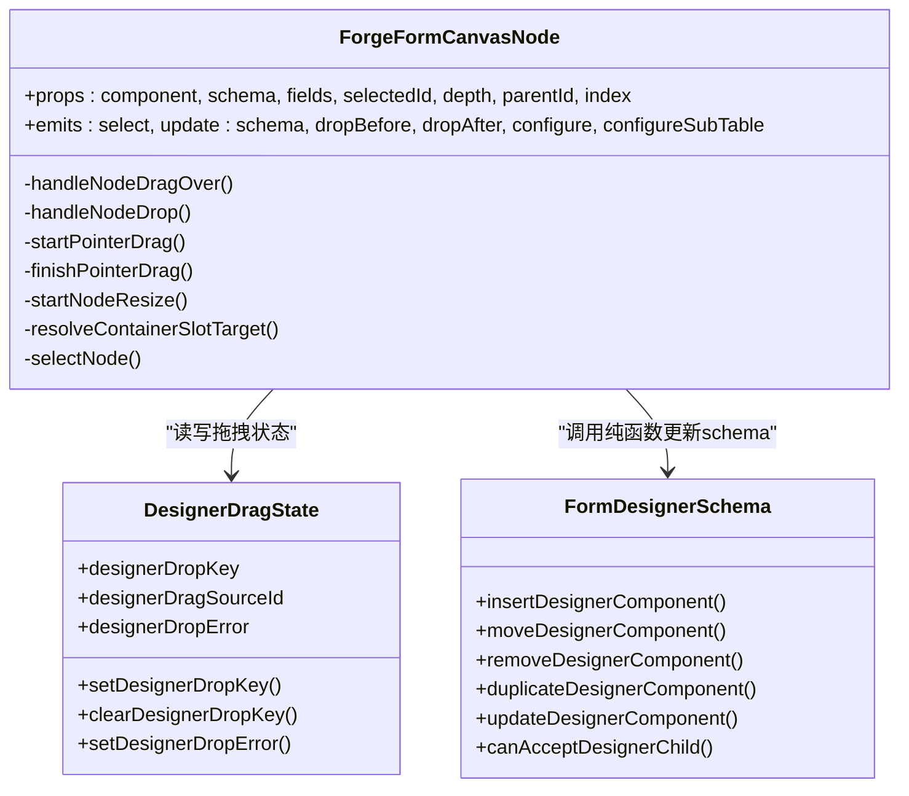
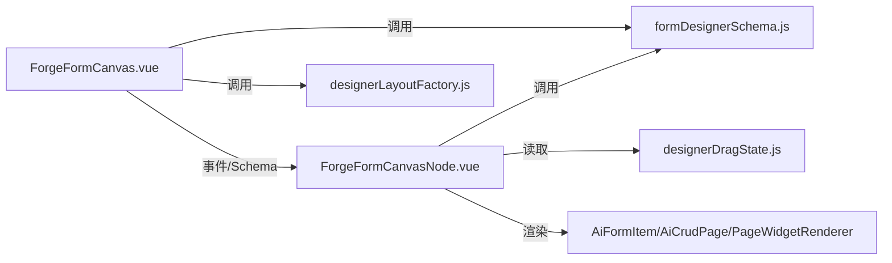

# 画布渲染引擎

<cite>
**本文引用的文件**
- [ForgeFormCanvas.vue](file://forge-admin-ui/src/views/app-center/components/designer/forge-form-designer/ForgeFormCanvas.vue)
- [ForgeFormCanvasNode.vue](file://forge-admin-ui/src/views/app-center/components/designer/forge-form-designer/ForgeFormCanvasNode.vue)
- [formDesignerSchema.js](file://forge-admin-ui/src/views/app-center/components/designer/form-first/formDesignerSchema.js)
- [designerLayoutFactory.js](file://forge-admin-ui/src/views/app-center/components/designer/forge-form-designer/designerLayoutFactory.js)
- [designerDragState.js](file://forge-admin-ui/src/views/app-center/components/designer/forge-form-designer/designerDragState.js)
- [README.md](file://forge-admin-ui/src/views/app-center/components/designer/forge-form-designer/README.md)
</cite>

## 目录
1. [简介](#简介)
2. [项目结构](#项目结构)
3. [核心组件](#核心组件)
4. [架构总览](#架构总览)
5. [详细组件分析](#详细组件分析)
6. [依赖关系分析](#依赖关系分析)
7. [性能考量](#性能考量)
8. [故障排查指南](#故障排查指南)
9. [结论](#结论)
10. [附录：扩展与自定义示例](#附录：扩展与自定义示例)

## 简介
本文件面向表单设计器画布渲染引擎，聚焦 ForgeFormCanvas 组件及其递归节点渲染器 ForgeFormCanvasNode，系统性说明画布节点树管理、组件渲染机制、布局算法实现、拖拽交互处理、选择状态管理、缩放与视口切换、事件冒泡与数据绑定方案，并提供扩展画布功能与自定义渲染逻辑的实践指引。

## 项目结构
画布渲染引擎由以下关键文件构成：
- 画布容器：负责根级网格、空画布提示、根落点、缩放与视口工具栏、滚轮缩放等。
- 递归节点渲染：负责单个节点的选中、快捷操作、内部/外部拖放、子容器渲染（卡片、标签页、折叠面板、表格布局、CRUD 区块等）。
- 模式与数据层：提供 Schema 的归一化、插入/移动/删除/复制/更新等纯函数能力。
- 布局工厂：根据组件类型生成默认节点结构（行/列、卡片、标签页、折叠面板、表格、CRUD 区块等）。
- 拖拽共享状态：集中维护当前拖拽源、目标位置键、错误提示等跨组件状态。

图表来源
- [ForgeFormCanvas.vue:1-216](file://forge-admin-ui/src/views/app-center/components/designer/forge-form-designer/ForgeFormCanvas.vue#L1-L216)
- [ForgeFormCanvasNode.vue:402-471](file://forge-admin-ui/src/views/app-center/components/designer/forge-form-designer/ForgeFormCanvasNode.vue#L402-L471)
- [formDesignerSchema.js:367-384](file://forge-admin-ui/src/views/app-center/components/designer/form-first/formDesignerSchema.js#L367-L384)
- [designerLayoutFactory.js:11-247](file://forge-admin-ui/src/views/app-center/components/designer/forge-form-designer/designerLayoutFactory.js#L11-L247)
- [designerDragState.js:1-52](file://forge-admin-ui/src/views/app-center/components/designer/forge-form-designer/designerDragState.js#L1-L52)
- [README.md:1-13](file://forge-admin-ui/src/views/app-center/components/designer/forge-form-designer/README.md#L1-L13)

章节来源
- [README.md:1-13](file://forge-admin-ui/src/views/app-center/components/designer/forge-form-designer/README.md#L1-L13)

## 核心组件
- ForgeFormCanvas.vue
  - 职责：承载画布滚动区域、根级栅格、空画布占位、根级拖放入口、缩放与视口工具栏、预览模式样式控制。
  - 关键点：通过 transform: scale 实现缩放；通过 gridTemplateColumns 控制根级栅格列数；通过 dataTransfer MIME 区分拖入类型并调用插入/移动方法。
- ForgeFormCanvasNode.vue
  - 职责：递归渲染节点，处理节点选中、快捷操作（必填、复制、删除）、拖拽排序、容器内放置、尺寸调整手柄、子容器渲染。
  - 关键点：使用 Pointer Events 实现平滑拖拽与尺寸调整；通过 ResizeObserver 同步节点高度以计算插入指示线高度；按组件类型分发到不同渲染分支。
- formDesignerSchema.js
  - 职责：提供 Schema 归一化、组件查找/插入/移动/删除/复制/更新、布局列数协调、可接受子项校验等纯函数。
  - 关键点：所有变更均返回新对象，保证不可变更新；统一 ID/字段码分配与冲突避免。
- designerLayoutFactory.js
  - 职责：根据组件 key 创建默认节点结构（行/列、卡片、标签页、折叠面板、表格、CRUD 区块、分隔线、按钮等）。
  - 关键点：为复杂容器预置子节点（如 tabs 默认一个 tabPane），并为 CRUD 区块预设 API 配置与选项。
- designerDragState.js
  - 职责：维护全局拖拽相关响应式状态（当前拖拽源、目标位置键、错误提示、预览组件等）。
  - 关键点：集中管理 dropKey、dragSourceId、dropError，配合 UI 高亮与错误提示。

章节来源
- [ForgeFormCanvas.vue:217-417](file://forge-admin-ui/src/views/app-center/components/designer/forge-form-designer/ForgeFormCanvas.vue#L217-L417)
- [ForgeFormCanvasNode.vue:440-537](file://forge-admin-ui/src/views/app-center/components/designer/forge-form-designer/ForgeFormCanvasNode.vue#L440-L537)
- [formDesignerSchema.js:826-941](file://forge-admin-ui/src/views/app-center/components/designer/form-first/formDesignerSchema.js#L826-L941)
- [designerLayoutFactory.js:11-247](file://forge-admin-ui/src/views/app-center/components/designer/forge-form-designer/designerLayoutFactory.js#L11-L247)
- [designerDragState.js:1-52](file://forge-admin-ui/src/views/app-center/components/designer/forge-form-designer/designerDragState.js#L1-L52)

## 架构总览
画布渲染引擎采用“容器 + 递归节点”的分层架构：
- 顶层容器负责整体布局、缩放、视口与根级拖放。
- 每个节点既是渲染单元也是交互单元，支持自身作为容器时接收子节点。
- 数据层通过纯函数对 Schema 进行不可变更新，确保视图与模型一致。
- 布局工厂在需要时生成标准节点结构，降低样板代码。
- 拖拽状态集中在独立模块，便于跨组件协作。

图表来源
- [ForgeFormCanvas.vue:323-386](file://forge-admin-ui/src/views/app-center/components/designer/forge-form-designer/ForgeFormCanvas.vue#L323-L386)
- [formDesignerSchema.js:826-856](file://forge-admin-ui/src/views/app-center/components/designer/form-first/formDesignerSchema.js#L826-L856)
- [designerLayoutFactory.js:249-286](file://forge-admin-ui/src/views/app-center/components/designer/forge-form-designer/designerLayoutFactory.js#L249-L286)
- [designerDragState.js:9-35](file://forge-admin-ui/src/views/app-center/components/designer/forge-form-designer/designerDragState.js#L9-L35)

## 详细组件分析

### 画布容器：ForgeFormCanvas.vue
- 节点树管理
  - 根级 components 数组驱动 v-for 渲染，每个元素对应一个 ForgeFormCanvasNode。
  - 空画布时显示占位区，支持拖入根级落点。
- 组件渲染机制
  - 使用 n-form 作为表单容器，传递 labelPlacement、labelWidth、labelAlign、size 等布局属性。
  - 通过 gridStyle 动态设置 gridTemplateColumns、columnGap、rowGap。
- 布局算法实现
  - 根级栅格列数受 schema.layout.gridColumns 限制，最大 24 列。
  - 子节点 span 由父级或 schema 决定，col 节点继承父 row 的 columns。
- 拖拽交互处理
  - 根级 dragover/drop 拦截，解析 dataTransfer 中的 MIME 类型，分别处理组件移动、字段插入、布局插入、模板插入。
  - 顶部 root-drop-zone 用于“插入到第一个之前”的高亮与落点判定。
- 组件选择状态管理
  - 点击空白处清空 selectedId；节点点击/聚焦触发 select 事件冒泡至父级更新。
- 缩放与平移
  - 通过 canvasZoom 控制 transform: scale，结合 canvasDesignWidth 控制舞台宽度。
  - Ctrl/⌘ + 滚轮缩放，支持预设视口模式（桌面/窄屏/弹窗/抽屉/移动）自动设置宽度与缩放。
- 事件冒泡与数据绑定
  - 通过 update:schema、update:selectedId、configure、configureSubTable 等事件向上传递变更。
  - previewModel 作为预览表单的数据载体，仅用于设计态预览。

图表来源
- [ForgeFormCanvas.vue:20-66](file://forge-admin-ui/src/views/app-center/components/designer/forge-form-designer/ForgeFormCanvas.vue#L20-L66)
- [ForgeFormCanvas.vue:323-386](file://forge-admin-ui/src/views/app-center/components/designer/forge-form-designer/ForgeFormCanvas.vue#L323-L386)
- [formDesignerSchema.js:826-856](file://forge-admin-ui/src/views/app-center/components/designer/form-first/formDesignerSchema.js#L826-L856)
- [designerLayoutFactory.js:249-286](file://forge-admin-ui/src/views/app-center/components/designer/forge-form-designer/designerLayoutFactory.js#L249-L286)

章节来源
- [ForgeFormCanvas.vue:1-417](file://forge-admin-ui/src/views/app-center/components/designer/forge-form-designer/ForgeFormCanvas.vue#L1-L417)

### 递归节点：ForgeFormCanvasNode.vue
- 节点树管理
  - 通过 depth、parentId、index 定位节点在树中的位置。
  - 子容器（card/tabs/collapse/table/grid）递归渲染自身，透传 props 与事件。
- 组件渲染机制
  - 按 componentKey 分支渲染：字段、标题、分隔线、子表、按钮、CRUD 区块、卡片、标签页、折叠面板、页面部件等。
  - 字段使用 AiFormItem 预览，CRUD 区块使用 AiCrudPage 预览。
- 布局算法实现
  - 行/表格布局通过 childrenGridStyle 动态设置 gridTemplateColumns、gutter、rowGap。
  - col 节点 span 基于父 row 的 columns 与自身 layout.span 计算。
- 拖拽交互处理
  - 节点前后插入指示线（before/after）与容器内放置（inside）通过 designerDropKey 高亮。
  - 使用 Pointer Events 实现拖拽排序与尺寸调整，挂载自定义拖拽图像，监听 pointermove/pointerup/pointercancel。
  - 容器内放置通过 resolveContainerSlotTarget 判断目标槽位（col/tableGrid/tabPane/collapseItem）。
- 组件选择状态管理
  - 选中节点时显示快捷操作菜单与尺寸调整手柄。
  - Tab Pane 选中时向上冒泡其父 Tabs 的 id，以便属性面板正确显示。
- 生命周期与清理
  - onMounted 中通过 ResizeObserver 同步节点高度；onBeforeUnmount 中释放指针捕获、移除监听、清理拖拽图像。
- 事件冒泡与数据绑定
  - 通过 select、update:schema、dropBefore、dropAfter、configure、configureSubTable 事件与父级通信。
  - 节点菜单操作（复制、删除、设为必填等）调用 formDesignerSchema 的纯函数更新 schema。

图表来源
- [ForgeFormCanvasNode.vue:440-537](file://forge-admin-ui/src/views/app-center/components/designer/forge-form-designer/ForgeFormCanvasNode.vue#L440-L537)
- [ForgeFormCanvasNode.vue:756-800](file://forge-admin-ui/src/views/app-center/components/designer/forge-form-designer/ForgeFormCanvasNode.vue#L756-L800)
- [ForgeFormCanvasNode.vue:1194-1231](file://forge-admin-ui/src/views/app-center/components/designer/forge-form-designer/ForgeFormCanvasNode.vue#L1194-L1231)
- [designerDragState.js:1-52](file://forge-admin-ui/src/views/app-center/components/designer/forge-form-designer/designerDragState.js#L1-L52)
- [formDesignerSchema.js:826-941](file://forge-admin-ui/src/views/app-center/components/designer/form-first/formDesignerSchema.js#L826-L941)

章节来源
- [ForgeFormCanvasNode.vue:1-800](file://forge-admin-ui/src/views/app-center/components/designer/forge-form-designer/ForgeFormCanvasNode.vue#L1-L800)

### 数据与布局：formDesignerSchema.js 与 designerLayoutFactory.js
- Schema 归一化与变更
  - normalizeFormDesignerSchema 统一版本、formKey、layout、components、pageSections、bottomBar、settings。
  - insert/move/remove/duplicate/update 均为不可变更新，返回新 schema。
  - canAcceptDesignerChild 定义容器可接受的子组件类型（tabs→tabPane，collapse→collapseItem，table→tableGrid 等）。
- 布局工厂
  - createForgeLayoutComponent 根据组件 key 生成默认节点结构，包括行/列、卡片、标签页、折叠面板、表格、CRUD 区块、分隔线、按钮等。
  - createForgeFieldTemplateComponent 从模板生成字段节点，预留 fieldCode、id、默认 props、验证与可见性。
  - 内置默认 API Base 与 CRUD 选项，便于快速预览。

章节来源
- [formDesignerSchema.js:367-384](file://forge-admin-ui/src/views/app-center/components/designer/form-first/formDesignerSchema.js#L367-L384)
- [formDesignerSchema.js:826-941](file://forge-admin-ui/src/views/app-center/components/designer/form-first/formDesignerSchema.js#L826-L941)
- [designerLayoutFactory.js:11-247](file://forge-admin-ui/src/views/app-center/components/designer/forge-form-designer/designerLayoutFactory.js#L11-L247)
- [designerLayoutFactory.js:249-286](file://forge-admin-ui/src/views/app-center/components/designer/forge-form-designer/designerLayoutFactory.js#L249-L286)

## 依赖关系分析
- 组件耦合
  - ForgeFormCanvas 与 ForgeFormCanvasNode 通过事件解耦，节点树更新通过 emit(update:schema) 上抛。
  - 拖拽状态集中在 designerDragState，避免在多个组件间传递复杂状态。
- 直接依赖
  - Canvas 依赖 formDesignerSchema 的插入/移动方法与 designerLayoutFactory 的组件创建。
  - Node 依赖 formDesignerSchema 的路径查找、插入/移动/删除/复制/更新与 canAcceptDesignerChild。
- 间接依赖
  - 通过 AiFormItem/AiCrudPage 等运行时组件完成预览渲染。
  - 通过 PageWidgetRenderer 渲染页面部件。
- 外部集成点
  - 与左侧字段库、右侧属性面板通过事件与 Schema 同步。
  - 与预览模式、源码查看、专注画布等上层功能通过事件暴露能力。

图表来源
- [ForgeFormCanvas.vue:210-216](file://forge-admin-ui/src/views/app-center/components/designer/forge-form-designer/ForgeFormCanvas.vue#L210-L216)
- [ForgeFormCanvasNode.vue:402-434](file://forge-admin-ui/src/views/app-center/components/designer/forge-form-designer/ForgeFormCanvasNode.vue#L402-L434)
- [formDesignerSchema.js:826-941](file://forge-admin-ui/src/views/app-center/components/designer/form-first/formDesignerSchema.js#L826-L941)
- [designerLayoutFactory.js:11-247](file://forge-admin-ui/src/views/app-center/components/designer/forge-form-designer/designerLayoutFactory.js#L11-L247)
- [designerDragState.js:1-52](file://forge-admin-ui/src/views/app-center/components/designer/forge-form-designer/designerDragState.js#L1-L52)

章节来源
- [ForgeFormCanvas.vue:210-216](file://forge-admin-ui/src/views/app-center/components/designer/forge-form-designer/ForgeFormCanvas.vue#L210-L216)
- [ForgeFormCanvasNode.vue:402-434](file://forge-admin-ui/src/views/app-center/components/designer/forge-form-designer/ForgeFormCanvasNode.vue#L402-L434)

## 性能考量
- 渲染优化
  - 使用 v-for key 为 component.id，提升列表更新效率。
  - 通过 computed 缓存样式与布局参数（gridStyle、childrenGridStyle、nodeWrapStyle 等）。
- 交互优化
  - 使用 ResizeObserver 仅在节点尺寸变化时更新高度，减少频繁计算。
  - Pointer Events 替代鼠标事件，提高拖拽与缩放手柄的流畅度。
- 缩放与视口
  - 通过 CSS transform 缩放而非重排，减少重绘成本。
  - 预设视口模式快速切换宽度与缩放，避免手动输入误差。
- 数据层
  - 所有 Schema 变更返回新对象，便于 Vue 精确追踪与最小化更新。
  - 插入/移动前进行合法性校验（canAcceptDesignerChild、isDescendantTarget），避免无效更新。

[本节为通用性能建议，不直接分析具体文件]

## 故障排查指南
- 拖拽失败或无高亮
  - 检查 designerDropKey 是否正确设置与清除。
  - 确认 hasForgeDragType 能识别正确的 MIME 类型。
  - 查看 setDesignerDropError 是否被调用并显示错误提示。
- 节点无法放入容器
  - 检查 canAcceptDesignerChild 是否允许该子组件类型。
  - 确认 resolveContainerSlotTarget 是否能找到目标槽位（col/tableGrid/tabPane/collapseItem）。
- 缩放异常
  - 确认 previewMode 下会禁用缩放与编辑控件。
  - 检查 clamp 范围是否在 0.67~1.25 之间。
- 节点高度错位
  - 确认 ResizeObserver 已正确观察 nodeRef，并在卸载时断开。
  - 检查 --forge-designer-drag-height 变量是否被设置与清理。

章节来源
- [designerDragState.js:9-35](file://forge-admin-ui/src/views/app-center/components/designer/forge-form-designer/designerDragState.js#L9-L35)
- [ForgeFormCanvas.vue:388-400](file://forge-admin-ui/src/views/app-center/components/designer/forge-form-designer/ForgeFormCanvas.vue#L388-L400)
- [formDesignerSchema.js:943-959](file://forge-admin-ui/src/views/app-center/components/designer/form-first/formDesignerSchema.js#L943-L959)
- [ForgeFormCanvasNode.vue:734-748](file://forge-admin-ui/src/views/app-center/components/designer/forge-form-designer/ForgeFormCanvasNode.vue#L734-L748)

## 结论
ForgeFormCanvas 与 ForgeFormCanvasNode 构成了表单设计器画布渲染引擎的核心：前者负责宏观布局与交互入口，后者负责微观节点渲染与交互。通过不可变的 Schema 操作与布局工厂，系统实现了可扩展、可维护、高性能的可视化编排体验。拖拽状态集中管理、事件冒泡清晰、预览与编辑分离，为后续扩展提供了稳固基础。

[本节为总结性内容，不直接分析具体文件]

## 附录：扩展与自定义示例
- 扩展画布功能
  - 新增拖入类型：在 Canvas 与 Node 中注册新的 MIME 类型，并在 applyDropPayload 或 handleNodeDrop 中处理。
  - 新增容器类型：在 designerLayoutFactory 中实现 createForgeLayoutComponent 分支，并在 canAcceptDesignerChild 中声明可接受子项。
  - 新增节点类型：在 Node 的渲染分支中添加对应渲染逻辑，并通过事件与 Schema 层联动。
- 自定义渲染逻辑
  - 针对特定 componentKey 定制预览渲染（如替换 AiFormItem 为自定义组件）。
  - 在 Node 的 nodeCustomStyle 中注入设计态样式变量，实现主题化边框、背景、圆角等。
- 数据绑定方案
  - 字段预览值通过 previewValue 与 previewFormData 绑定，仅用于设计态展示。
  - 业务数据绑定通过 fieldBinding.fieldCode 与运行时表单数据映射。
- 事件冒泡机制
  - 节点通过 select、update:schema、dropBefore、dropAfter、configure、configureSubTable 等事件向上传递变更。
  - 上层组件（如三栏主编排）订阅这些事件并同步到属性面板与字段库。

章节来源
- [ForgeFormCanvas.vue:323-386](file://forge-admin-ui/src/views/app-center/components/designer/forge-form-designer/ForgeFormCanvas.vue#L323-L386)
- [ForgeFormCanvasNode.vue:533-537](file://forge-admin-ui/src/views/app-center/components/designer/forge-form-designer/ForgeFormCanvasNode.vue#L533-L537)
- [formDesignerSchema.js:943-959](file://forge-admin-ui/src/views/app-center/components/designer/form-first/formDesignerSchema.js#L943-L959)
- [designerLayoutFactory.js:11-247](file://forge-admin-ui/src/views/app-center/components/designer/forge-form-designer/designerLayoutFactory.js#L11-L247)