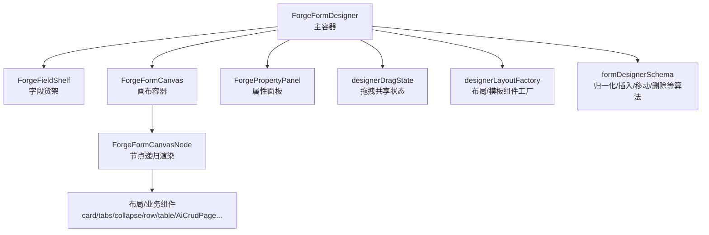
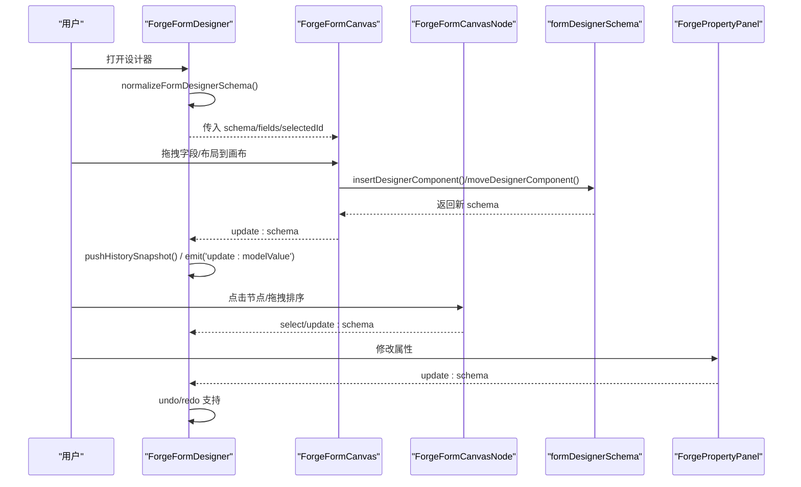
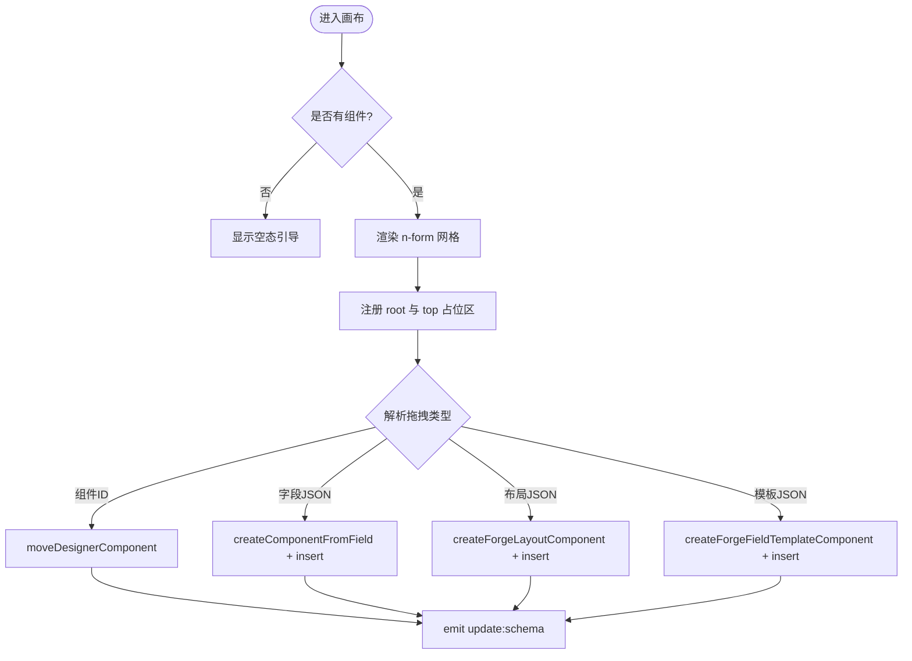
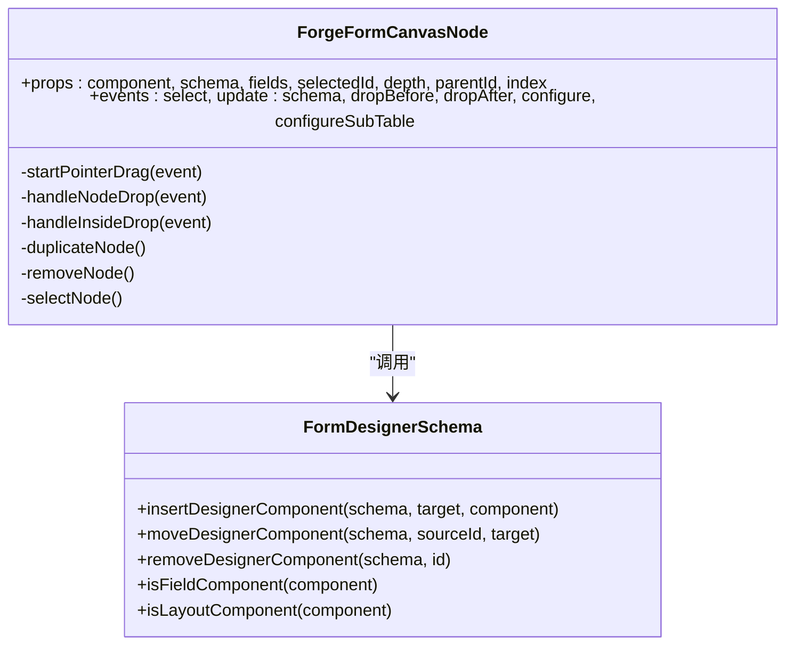
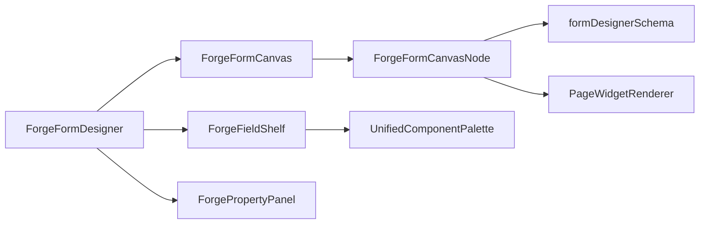

# 表单设计器核心

<cite>
**本文引用的文件**
- [ForgeFormDesigner.vue](file://forge-admin-ui/src/views/app-center/components/designer/forge-form-designer/ForgeFormDesigner.vue)
- [ForgeFormCanvas.vue](file://forge-admin-ui/src/views/app-center/components/designer/forge-form-designer/ForgeFormCanvas.vue)
- [ForgeFormCanvasNode.vue](file://forge-admin-ui/src/views/app-center/components/designer/forge-form-designer/ForgeFormCanvasNode.vue)
- [ForgeFieldShelf.vue](file://forge-admin-ui/src/views/app-center/components/designer/forge-form-designer/ForgeFieldShelf.vue)
- [ForgePropertyPanel.vue](file://forge-admin-ui/src/views/app-center/components/designer/forge-form-designer/ForgePropertyPanel.vue)
- [designerDragState.js](file://forge-admin-ui/src/views/app-center/components/designer/forge-form-designer/designerDragState.js)
- [designerLayoutFactory.js](file://forge-admin-ui/src/views/app-center/components/designer/forge-form-designer/designerLayoutFactory.js)
- [formDesignerSchema.js](file://forge-admin-ui/src/views/app-center/components/designer/form-first/formDesignerSchema.js)
</cite>

## 目录
1. [简介](#简介)
2. [项目结构](#项目结构)
3. [核心组件](#核心组件)
4. [架构总览](#架构总览)
5. [详细组件分析](#详细组件分析)
6. [依赖关系分析](#依赖关系分析)
7. [性能考量](#性能考量)
8. [故障排查指南](#故障排查指南)
9. [结论](#结论)
10. [附录：扩展与自定义示例](#附录：扩展与自定义示例)

## 简介
本文件面向“表单设计器核心模块”，聚焦 ForgeFormDesigner 主组件及其画布渲染引擎、属性面板系统、字段货架管理等关键能力。文档从架构、数据流、交互机制、状态管理、布局算法、生命周期与事件处理等维度进行系统化说明，并提供可落地的扩展点与自定义交互实践路径。

## 项目结构
表单设计器采用“三栏式”布局：左侧为字段货架（组件库与字段资产），中间为画布（可视化编辑区域），右侧为属性面板（配置当前选中节点）。顶层容器负责视图切换、撤销重做、预览、底部操作栏等全局能力；画布层负责拖拽放置、缩放、视口模式；节点层递归渲染并承载内部容器的子节点；属性面板提供细粒度配置；货架提供统一物料入口与字段资产选择。

图表来源
- [ForgeFormDesigner.vue:1-238](file://forge-admin-ui/src/views/app-center/components/designer/forge-form-designer/ForgeFormDesigner.vue#L1-L238)
- [ForgeFormCanvas.vue:1-207](file://forge-admin-ui/src/views/app-center/components/designer/forge-form-designer/ForgeFormCanvas.vue#L1-L207)
- [ForgeFormCanvasNode.vue:1-400](file://forge-admin-ui/src/views/app-center/components/designer/forge-form-designer/ForgeFormCanvasNode.vue#L1-L400)
- [ForgeFieldShelf.vue:1-107](file://forge-admin-ui/src/views/app-center/components/designer/forge-form-designer/ForgeFieldShelf.vue#L1-L107)
- [ForgePropertyPanel.vue:1-800](file://forge-admin-ui/src/views/app-center/components/designer/forge-form-designer/ForgePropertyPanel.vue#L1-L800)
- [designerDragState.js:1-52](file://forge-admin-ui/src/views/app-center/components/designer/forge-form-designer/designerDragState.js#L1-L52)
- [designerLayoutFactory.js:1-247](file://forge-admin-ui/src/views/app-center/components/designer/forge-form-designer/designerLayoutFactory.js#L1-L247)
- [formDesignerSchema.js:1-200](file://forge-admin-ui/src/views/app-center/components/designer/form-first/formDesignerSchema.js#L1-L200)

章节来源
- [ForgeFormDesigner.vue:1-238](file://forge-admin-ui/src/views/app-center/components/designer/forge-form-designer/ForgeFormDesigner.vue#L1-L238)
- [ForgeFormCanvas.vue:1-207](file://forge-admin-ui/src/views/app-center/components/designer/forge-form-designer/ForgeFormCanvas.vue#L1-L207)
- [ForgeFormCanvasNode.vue:1-400](file://forge-admin-ui/src/views/app-center/components/designer/forge-form-designer/ForgeFormCanvasNode.vue#L1-L400)
- [ForgeFieldShelf.vue:1-107](file://forge-admin-ui/src/views/app-center/components/designer/forge-form-designer/ForgeFieldShelf.vue#L1-L107)
- [ForgePropertyPanel.vue:1-800](file://forge-admin-ui/src/views/app-center/components/designer/forge-form-designer/ForgePropertyPanel.vue#L1-L800)
- [designerDragState.js:1-52](file://forge-admin-ui/src/views/app-center/components/designer/forge-form-designer/designerDragState.js#L1-L52)
- [designerLayoutFactory.js:1-247](file://forge-admin-ui/src/views/app-center/components/designer/forge-form-designer/designerLayoutFactory.js#L1-L247)
- [formDesignerSchema.js:1-200](file://forge-admin-ui/src/views/app-center/components/designer/form-first/formDesignerSchema.js#L1-L200)

## 核心组件
- ForgeFormDesigner：主容器，负责 schema 归一化、多表单页签、撤销/重做、预览、分区视图切换、底部操作栏、与外部宿主的数据绑定与事件派发。
- ForgeFieldShelf：字段货架，整合统一组件物料面板与字段资产列表，支持搜索、过滤、拖拽到画布。
- ForgeFormCanvas：画布容器，负责根级拖放、视口缩放、设备预览模式、空态提示、网格样式计算。
- ForgeFormCanvasNode：节点渲染器，递归渲染所有组件与布局容器，实现节点选择、快速操作、拖拽排序、尺寸调整、CRUD 区块预览等。
- ForgePropertyPanel：属性面板，按选中节点类型动态展示配置项，支持栅格快捷配置、字段约束、自动编号、页面挂件数据源映射等。
- designerDragState：跨组件的拖拽共享状态（目标位置、错误提示、拖拽源、预览组件等）。
- designerLayoutFactory：布局与模板组件工厂，生成 card/tabs/collapse/row/table/AiCrudPage/subTable/title 等默认结构与 props。
- formDesignerSchema：schema 归一化、组件识别、插入/移动/复制/删除、字段代码与 ID 冲突解决、列数限制等核心算法。

章节来源
- [ForgeFormDesigner.vue:476-800](file://forge-admin-ui/src/views/app-center/components/designer/forge-form-designer/ForgeFormDesigner.vue#L476-L800)
- [ForgeFieldShelf.vue:109-252](file://forge-admin-ui/src/views/app-center/components/designer/forge-form-designer/ForgeFieldShelf.vue#L109-L252)
- [ForgeFormCanvas.vue:209-418](file://forge-admin-ui/src/views/app-center/components/designer/forge-form-designer/ForgeFormCanvas.vue#L209-L418)
- [ForgeFormCanvasNode.vue:402-800](file://forge-admin-ui/src/views/app-center/components/designer/forge-form-designer/ForgeFormCanvasNode.vue#L402-L800)
- [ForgePropertyPanel.vue:1-800](file://forge-admin-ui/src/views/app-center/components/designer/forge-form-designer/ForgePropertyPanel.vue#L1-L800)
- [designerDragState.js:1-52](file://forge-admin-ui/src/views/app-center/components/designer/forge-form-designer/designerDragState.js#L1-L52)
- [designerLayoutFactory.js:1-247](file://forge-admin-ui/src/views/app-center/components/designer/forge-form-designer/designerLayoutFactory.js#L1-L247)
- [formDesignerSchema.js:1-200](file://forge-admin-ui/src/views/app-center/components/designer/form-first/formDesignerSchema.js#L1-L200)

## 架构总览
设计器以“单例 schema + 事件驱动”为核心：
- 顶层维护 normalizedSchema 并通过 updateSchema 触发更新，同时记录历史快照用于撤销/重做。
- 画布通过 drag-and-drop 将字段、布局、模板或已有组件插入/移动到指定位置，调用 formDesignerSchema 中的插入/移动方法。
- 属性面板直接修改选中节点的 props/layout/validation 等，再回写 schema。
- 货架提供统一物料入口，区分“组件库”和“字段资产”，并以不同 MIME 类型传递 payload。
- 节点递归渲染，支持复杂容器（tabs/collapse/card/row/table）与业务区块（AiCrudPage/subTable）。

图表来源
- [ForgeFormDesigner.vue:600-710](file://forge-admin-ui/src/views/app-center/components/designer/forge-form-designer/ForgeFormDesigner.vue#L600-L710)
- [ForgeFormCanvas.vue:323-386](file://forge-admin-ui/src/views/app-center/components/designer/forge-form-designer/ForgeFormCanvas.vue#L323-L386)
- [ForgeFormCanvasNode.vue:756-800](file://forge-admin-ui/src/views/app-center/components/designer/forge-form-designer/ForgeFormCanvasNode.vue#L756-L800)
- [formDesignerSchema.js:1-200](file://forge-admin-ui/src/views/app-center/components/designer/form-first/formDesignerSchema.js#L1-L200)

## 详细组件分析

### 画布渲染引擎（ForgeFormCanvas）
- 视口与缩放：支持桌面/窄屏/弹窗/抽屉/移动等预览形态，以及缩放比例控制；通过 CSS transform 与宽度计算实现。
- 网格布局：根据 schema.layout.gridColumns 动态设置 gridTemplateColumns，并支持行列间距配置。
- 拖拽放置：根级 drop 与顶部占位区（rootTopActive）共同决定插入位置；解析 dataTransfer 中的不同 MIME 类型，分别走字段、布局、模板或组件移动逻辑。
- 空态与交互：无组件时显示引导文案；空白点击清空选中；预览模式下隐藏编辑相关 UI。

图表来源
- [ForgeFormCanvas.vue:1-207](file://forge-admin-ui/src/views/app-center/components/designer/forge-form-designer/ForgeFormCanvas.vue#L1-L207)
- [ForgeFormCanvas.vue:323-386](file://forge-admin-ui/src/views/app-center/components/designer/forge-form-designer/ForgeFormCanvas.vue#L323-L386)
- [designerLayoutFactory.js:11-247](file://forge-admin-ui/src/views/app-center/components/designer/forge-form-designer/designerLayoutFactory.js#L11-L247)
- [formDesignerSchema.js:1-200](file://forge-admin-ui/src/views/app-center/components/designer/form-first/formDesignerSchema.js#L1-L200)

章节来源
- [ForgeFormCanvas.vue:209-418](file://forge-admin-ui/src/views/app-center/components/designer/forge-form-designer/ForgeFormCanvas.vue#L209-L418)

### 节点递归渲染与交互（ForgeFormCanvasNode）
- 节点选择与高亮：通过 selectedId 匹配，TabPane 等特殊结构会向上冒泡选择父容器以避免误配。
- 快速操作：必填开关、复制、删除、菜单（背景/边框/移入等）。
- 拖拽排序：使用 Pointer Events 实现平滑拖拽，挂载拖拽图片，监听 window 级 move/up/cancel，更新 drop 指示器与最终插入位置。
- 尺寸调整：八向 resize 锚点，结合 ResizeObserver 同步节点高度，影响占位线高度。
- 布局容器：card/tabs/collapse/row/table 等容器递归渲染子节点，并透传 drop-before/drop-after 事件。
- CRUD 区块预览：基于 AiCrudPage 构建查询、表格、编辑表单的预览配置，支持 API 配置与列映射。

图表来源
- [ForgeFormCanvasNode.vue:402-800](file://forge-admin-ui/src/views/app-center/components/designer/forge-form-designer/ForgeFormCanvasNode.vue#L402-L800)
- [formDesignerSchema.js:1-200](file://forge-admin-ui/src/views/app-center/components/designer/form-first/formDesignerSchema.js#L1-L200)

章节来源
- [ForgeFormCanvasNode.vue:402-800](file://forge-admin-ui/src/views/app-center/components/designer/forge-form-designer/ForgeFormCanvasNode.vue#L402-L800)

### 字段货架（ForgeFieldShelf）
- 统一组件物料面板：复用 lowcode-builder 的 UnifiedComponentPalette，支持分组、搜索、过滤。
- 字段资产面板：未使用/已使用/系统字段三类视图，支持关键字搜索与禁用态（已用/锁定）。
- 拖拽协议：字段与模板走 template MIME，布局与通用组件走 layout MIME；设置预览组件信息以便拖拽反馈。
- 白名单过滤：仅暴露画布支持的布局键名与页面挂件键名，避免无效配置。

章节来源
- [ForgeFieldShelf.vue:109-252](file://forge-admin-ui/src/views/app-center/components/designer/forge-form-designer/ForgeFieldShelf.vue#L109-L252)

### 属性面板（ForgePropertyPanel）
- 动态表单：根据选中节点类型渲染不同配置区，如标识、字段组件、栅格快捷配置、校验、自动编号、页面挂件数据源映射等。
- 栅格快捷配置：行/列的总列数、格子数量、span 调节，实时写入 props/layout。
- 页面挂件数据源：支持静态、上下文、远程接口三种来源，并可配置请求参数、响应路径、字段映射。
- 自动编号：规则选择、填充策略、触发时机、运行态只读、隐藏与预览。

章节来源
- [ForgePropertyPanel.vue:1-800](file://forge-admin-ui/src/views/app-center/components/designer/forge-form-designer/ForgePropertyPanel.vue#L1-L800)

### 主容器（ForgeFormDesigner）
- Schema 归一化：normalizeFormDesignerSchema 保证结构一致性与兼容性。
- 多表单页签：支持主表单与多个子表单，切换时更新 selectedId 与 schema。
- 撤销/重做：维护 undoStack/redoStack，限制历史长度；快捷键 Ctrl/Cmd+Z/Y 支持。
- 预览：在模态框中按新增/编辑/详情模式渲染运行时表单，保持与设计器一致的列数与布局。
- 分区视图：可选 deriveSectionsFromLayout，随布局派生 pageSections。
- 底部操作栏：弹窗编辑 bottomBar 并即时写回。

章节来源
- [ForgeFormDesigner.vue:476-800](file://forge-admin-ui/src/views/app-center/components/designer/forge-form-designer/ForgeFormDesigner.vue#L476-L800)

## 依赖关系分析
- 组件耦合：
  - ForgeFormDesigner 聚合 Canvas、Shelf、PropertyPanel，并通过事件通信。
  - Canvas 依赖 Node 递归渲染，Node 依赖 formDesignerSchema 进行增删改查。
  - Shelf 与 Canvas 通过 MIME 协议解耦拖拽语义。
  - PropertyPanel 直接修改 schema 片段，由 Designer 统一持久化。
- 外部依赖：
  - lowcode-builder 的 UnifiedComponentPalette 与 PageWidgetRenderer 提供统一物料与页面挂件能力。
  - Naive UI 提供基础 UI 控件。
- 潜在循环：未发现直接循环引用；跨组件状态通过 designe rDragState 集中管理。

图表来源
- [ForgeFormDesigner.vue:1-238](file://forge-admin-ui/src/views/app-center/components/designer/forge-form-designer/ForgeFormDesigner.vue#L1-L238)
- [ForgeFormCanvas.vue:209-418](file://forge-admin-ui/src/views/app-center/components/designer/forge-form-designer/ForgeFormCanvas.vue#L209-L418)
- [ForgeFormCanvasNode.vue:402-800](file://forge-admin-ui/src/views/app-center/components/designer/forge-form-designer/ForgeFormCanvasNode.vue#L402-L800)
- [ForgeFieldShelf.vue:109-252](file://forge-admin-ui/src/views/app-center/components/designer/forge-form-designer/ForgeFieldShelf.vue#L109-L252)
- [ForgePropertyPanel.vue:1-800](file://forge-admin-ui/src/views/app-center/components/designer/forge-form-designer/ForgePropertyPanel.vue#L1-L800)

章节来源
- [ForgeFormDesigner.vue:1-238](file://forge-admin-ui/src/views/app-center/components/designer/forge-form-designer/ForgeFormDesigner.vue#L1-L238)
- [ForgeFormCanvas.vue:209-418](file://forge-admin-ui/src/views/app-center/components/designer/forge-form-designer/ForgeFormCanvas.vue#L209-L418)
- [ForgeFormCanvasNode.vue:402-800](file://forge-admin-ui/src/views/app-center/components/designer/forge-form-designer/ForgeFormCanvasNode.vue#L402-L800)
- [ForgeFieldShelf.vue:109-252](file://forge-admin-ui/src/views/app-center/components/designer/forge-form-designer/ForgeFieldShelf.vue#L109-L252)
- [ForgePropertyPanel.vue:1-800](file://forge-admin-ui/src/views/app-center/components/designer/forge-form-designer/ForgePropertyPanel.vue#L1-L800)

## 性能考量
- 递归渲染优化：节点深度较大时，建议按需展开容器（如 tabs/collapse）以减少初始渲染压力。
- 拖拽性能：Pointer Events 配合 document 级监听减少重复绑定；拖拽图片仅在必要时挂载。
- 历史栈限制：HISTORY_LIMIT 控制撤销栈大小，避免内存占用过高。
- 网格列数限制：MAX_FORM_GRID_COLUMNS=24，防止过度分栏导致布局抖动。
- 预览模式：预览时隐藏编辑相关 DOM，降低渲染开销。

[本节为通用指导，不直接分析具体文件]

## 故障排查指南
- 拖拽失败或无法插入：
  - 检查 dataTransfer 的 MIME 类型是否被正确设置与读取。
  - 确认目标区域是否启用了 dragover/drop 事件且 preventDefault 未被阻止。
  - 查看 designerDragState 中的 dropKey 与错误提示。
- 节点无法删除：
  - 若字段存在业务数据（fieldBinding.locked），将被禁止删除；需在属性面板解除锁定或迁移数据。
- 栅格错位：
  - 检查 row/column 的 columns/span 是否超出 MAX_FORM_GRID_COLUMNS。
  - 确认父容器是否为 row/fcRow，否则 col 的 span 可能无效。
- 属性面板不生效：
  - 确认 selectedId 指向的组件是否存在；某些结构型节点（如 tabPane）会向上冒泡选择父容器。

章节来源
- [designerDragState.js:1-52](file://forge-admin-ui/src/views/app-center/components/designer/forge-form-designer/designerDragState.js#L1-L52)
- [ForgeFormCanvasNode.vue:533-537](file://forge-admin-ui/src/views/app-center/components/designer/forge-form-designer/ForgeFormCanvasNode.vue#L533-L537)
- [ForgeFormCanvasNode.vue:539-552](file://forge-admin-ui/src/views/app-center/components/designer/forge-form-designer/ForgeFormCanvasNode.vue#L539-L552)
- [ForgeFormDesigner.vue:619-629](file://forge-admin-ui/src/views/app-center/components/designer/forge-form-designer/ForgeFormDesigner.vue#L619-L629)

## 结论
ForgeFormDesigner 通过清晰的三栏架构、统一的 schema 模型与事件驱动机制，实现了强大的可视化表单设计能力。画布渲染引擎、节点递归渲染、属性面板系统与字段货架各司其职，配合拖拽状态管理与布局工厂，形成可扩展、可维护的设计器核心。未来可在节点能力、预览一致性、性能优化等方面持续演进。

[本节为总结性内容，不直接分析具体文件]

## 附录：扩展与自定义示例
- 扩展画布功能
  - 在 designerLayoutFactory 中新增布局组件的默认结构与 props，并在 ForgeFormCanvasNode 中添加对应渲染分支。
  - 参考路径：[designerLayoutFactory.js:11-247](file://forge-admin-ui/src/views/app-center/components/designer/forge-form-designer/designerLayoutFactory.js#L11-L247)、[ForgeFormCanvasNode.vue:194-392](file://forge-admin-ui/src/views/app-center/components/designer/forge-form-designer/ForgeFormCanvasNode.vue#L194-L392)
- 自定义拖拽交互
  - 在 ForgeFieldShelf 中定义新的 MIME 类型与 payload，并在 ForgeFormCanvas 的 applyDropPayload 中解析处理。
  - 参考路径：[ForgeFieldShelf.vue:188-200](file://forge-admin-ui/src/views/app-center/components/designer/forge-form-designer/ForgeFieldShelf.vue#L188-L200)、[ForgeFormCanvas.vue:355-386](file://forge-admin-ui/src/views/app-center/components/designer/forge-form-designer/ForgeFormCanvas.vue#L355-L386)
- 扩展属性面板
  - 在 ForgePropertyPanel 中为新组件添加专属配置区，通过 updateComponent 写回 props。
  - 参考路径：[ForgePropertyPanel.vue:1-800](file://forge-admin-ui/src/views/app-center/components/designer/forge-form-designer/ForgePropertyPanel.vue#L1-L800)
- 扩展节点行为
  - 在 ForgeFormCanvasNode 中增加新的快速操作或菜单项，调用 formDesignerSchema 的方法完成增删改。
  - 参考路径：[ForgeFormCanvasNode.vue:582-610](file://forge-admin-ui/src/views/app-center/components/designer/forge-form-designer/ForgeFormCanvasNode.vue#L582-L610)、[formDesignerSchema.js:1-200](file://forge-admin-ui/src/views/app-center/components/designer/form-first/formDesignerSchema.js#L1-L200)

章节来源
- [designerLayoutFactory.js:11-247](file://forge-admin-ui/src/views/app-center/components/designer/forge-form-designer/designerLayoutFactory.js#L11-L247)
- [ForgeFormCanvasNode.vue:194-392](file://forge-admin-ui/src/views/app-center/components/designer/forge-form-designer/ForgeFormCanvasNode.vue#L194-L392)
- [ForgeFieldShelf.vue:188-200](file://forge-admin-ui/src/views/app-center/components/designer/forge-form-designer/ForgeFieldShelf.vue#L188-L200)
- [ForgeFormCanvas.vue:355-386](file://forge-admin-ui/src/views/app-center/components/designer/forge-form-designer/ForgeFormCanvas.vue#L355-L386)
- [ForgePropertyPanel.vue:1-800](file://forge-admin-ui/src/views/app-center/components/designer/forge-form-designer/ForgePropertyPanel.vue#L1-L800)
- [ForgeFormCanvasNode.vue:582-610](file://forge-admin-ui/src/views/app-center/components/designer/forge-form-designer/ForgeFormCanvasNode.vue#L582-L610)
- [formDesignerSchema.js:1-200](file://forge-admin-ui/src/views/app-center/components/designer/form-first/formDesignerSchema.js#L1-L200)