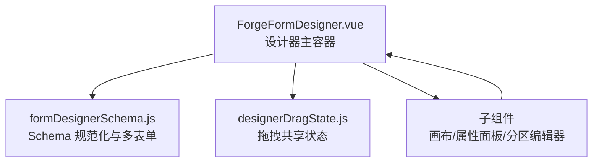
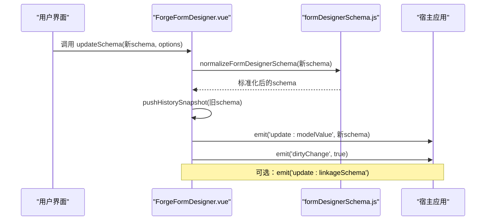
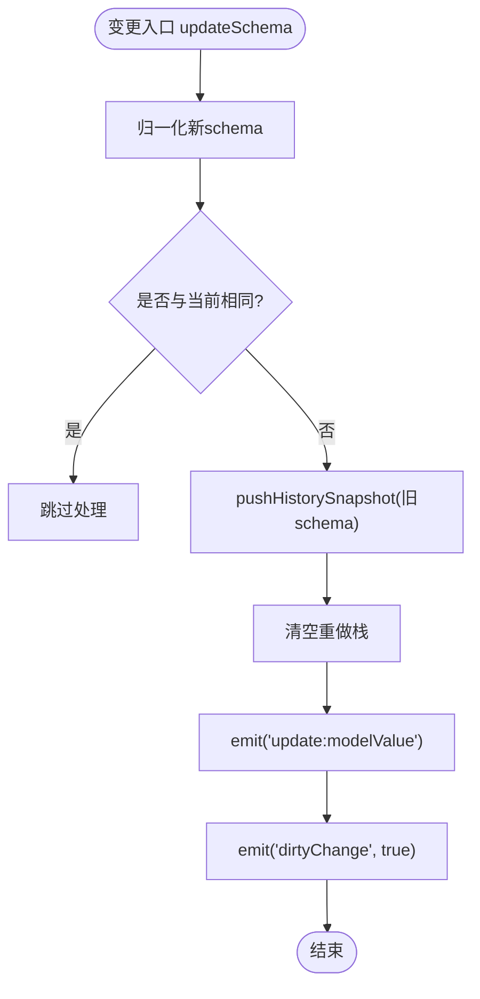
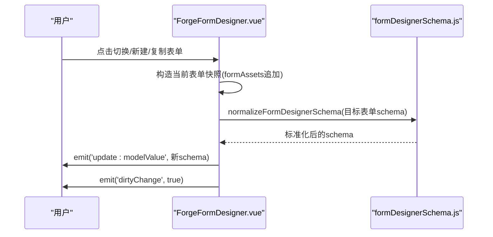
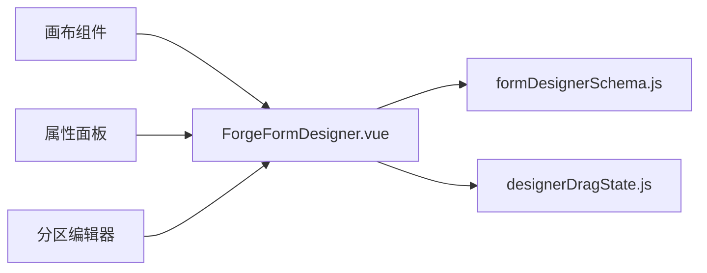

# 设计器状态管理

<cite>
**本文引用的文件**
- [ForgeFormDesigner.vue](file://forge-admin-ui/src/views/app-center/components/designer/forge-form-designer/ForgeFormDesigner.vue)
- [formDesignerSchema.js](file://forge-admin-ui/src/views/app-center/components/designer/form-first/formDesignerSchema.js)
- [designerDragState.js](file://forge-admin-ui/src/views/app-center/components/designer/forge-form-designer/designerDragState.js)
</cite>

## 目录
1. [简介](#简介)
2. [项目结构](#项目结构)
3. [核心组件](#核心组件)
4. [架构总览](#架构总览)
5. [详细组件分析](#详细组件分析)
6. [依赖关系分析](#依赖关系分析)
7. [性能考量](#性能考量)
8. [故障排查指南](#故障排查指南)
9. [结论](#结论)
10. [附录：API与扩展指南](#附录api与扩展指南)

## 简介
本文件面向表单设计器的全局状态管理，围绕撤销重做、脏标记、多表单状态同步、历史快照、状态持久化等能力进行系统化说明。文档以代码级实现为依据，提供架构图、时序图、流程图与类图，帮助读者快速理解并扩展设计器的状态管理能力。

## 项目结构
与状态管理直接相关的核心文件包括：
- 设计器主容器：负责撤销/重做栈、脏标记、多表单切换、画布视图切换、底部栏与分区协议更新等。
- 表单 Schema 规范化模块：负责单表单/多表单结构的归一化、校验、默认值生成、保存前压缩等。
- 拖拽共享状态：跨组件的拖拽源、预览、错误提示等临时状态。

图表来源
- [ForgeFormDesigner.vue:502-684](file://forge-admin-ui/src/views/app-center/components/designer/forge-form-designer/ForgeFormDesigner.vue#L502-L684)
- [formDesignerSchema.js:341-655](file://forge-admin-ui/src/views/app-center/components/designer/form-first/formDesignerSchema.js#L341-L655)
- [designerDragState.js:1-52](file://forge-admin-ui/src/views/app-center/components/designer/forge-form-designer/designerDragState.js#L1-L52)

章节来源
- [ForgeFormDesigner.vue:502-684](file://forge-admin-ui/src/views/app-center/components/designer/forge-form-designer/ForgeFormDesigner.vue#L502-L684)
- [formDesignerSchema.js:341-655](file://forge-admin-ui/src/views/app-center/components/designer/form-first/formDesignerSchema.js#L341-L655)
- [designerDragState.js:1-52](file://forge-admin-ui/src/views/app-center/components/designer/forge-form-designer/designerDragState.js#L1-L52)

## 核心组件
- 设计器主容器（ForgeFormDesigner.vue）
  - 维护撤销/重做栈、最大历史长度限制、快捷键监听。
  - 统一变更入口 updateSchema，负责记录历史、派发 dirtyChange、联动 linkageSchema。
  - 多表单资产（formAssets）的创建、复制、切换；页面分区协议与底部操作栏的即时写回。
  - 暴露 flushDesigner 等对外 API，供宿主保存或导出。
- Schema 规范化模块（formDesignerSchema.js）
  - 单表单/多表单结构归一化、校验、默认值生成、保存前压缩。
  - 兼容旧交互规则迁移、字段绑定、布局列数约束等。
- 拖拽共享状态（designerDragState.js）
  - 跨组件共享的拖拽源、预览节点、拖放错误提示等临时状态。

章节来源
- [ForgeFormDesigner.vue:576-710](file://forge-admin-ui/src/views/app-center/components/designer/forge-form-designer/ForgeFormDesigner.vue#L576-L710)
- [formDesignerSchema.js:341-655](file://forge-admin-ui/src/views/app-center/components/designer/form-first/formDesignerSchema.js#L341-L655)
- [designerDragState.js:1-52](file://forge-admin-ui/src/views/app-center/components/designer/forge-form-designer/designerDragState.js#L1-L52)

## 架构总览
设计器采用“单一变更入口 + 双栈历史”的状态管理模式：所有画布与配置变更均通过 updateSchema 进入，内部完成 Schema 归一化、历史快照入栈、脏标记触发、联动 Schema 同步等。多表单资产在 settings.formAssets 中集中管理，切换时仅替换当前活动表单的 schema，同时保留其他表单的完整历史上下文。

图表来源
- [ForgeFormDesigner.vue:667-684](file://forge-admin-ui/src/views/app-center/components/designer/forge-form-designer/ForgeFormDesigner.vue#L667-L684)
- [formDesignerSchema.js:367-384](file://forge-admin-ui/src/views/app-center/components/designer/form-first/formDesignerSchema.js#L367-L384)

## 详细组件分析

### 撤销/重做机制
- 数据结构
  - undoStack：撤销栈，存储历史快照。
  - redoStack：重做栈，存储可重做的快照。
  - HISTORY_LIMIT：最大历史长度（默认 50）。
- 关键流程
  - 每次有效变更通过 pushHistorySnapshot 将当前快照压入撤销栈，并清空重做栈。
  - 撤销时从撤销栈弹出上一快照，将当前快照压入重做栈，再调用 updateSchema 写入（禁止重复记录历史）。
  - 重做时从重做栈取出下一快照，将当前快照压入撤销栈，再调用 updateSchema 写入。
  - 快捷键支持 Ctrl/Cmd+Z 撤销，Ctrl/Cmd+Shift+Z 或 Y 重做，忽略输入框场景。

图表来源
- [ForgeFormDesigner.vue:667-684](file://forge-admin-ui/src/views/app-center/components/designer/forge-form-designer/ForgeFormDesigner.vue#L667-L684)
- [ForgeFormDesigner.vue:686-710](file://forge-admin-ui/src/views/app-center/components/designer/forge-form-designer/ForgeFormDesigner.vue#L686-L710)

章节来源
- [ForgeFormDesigner.vue:576-729](file://forge-admin-ui/src/views/app-center/components/designer/forge-form-designer/ForgeFormDesigner.vue#L576-L729)

### 脏标记管理
- 触发点：每次成功写入新 schema 后，统一 emit('dirtyChange', true)。
- 使用建议：宿主可在监听 dirtyChange 时启用“未保存提示”、禁用关闭页签、高亮保存按钮等。
- 注意：清空画布、重命名表单等操作同样走 updateSchema，因此会正确触发脏标记。

章节来源
- [ForgeFormDesigner.vue:667-684](file://forge-admin-ui/src/views/app-center/components/designer/forge-form-designer/ForgeFormDesigner.vue#L667-L684)

### 多表单状态同步
- 数据模型：settings.formAssets 为多表单数组，每个元素包含 formKey、formName、schema。
- 切换逻辑：switchFormAsset 将当前表单快照推入 formAssets，并切换到目标表单 schema。
- 新建/复制：createBlankFormAsset、duplicateCurrentFormAsset 用于新增空白表单或复制当前表单。
- 保存输出：flushDesigner 合并 sourceSchema 与当前 normalizedSchema，输出 defaultFormKey、forms、settings.formAssets 等。

图表来源
- [ForgeFormDesigner.vue:841-940](file://forge-admin-ui/src/views/app-center/components/designer/forge-form-designer/ForgeFormDesigner.vue#L841-L940)
- [formDesignerSchema.js:579-655](file://forge-admin-ui/src/views/app-center/components/designer/form-first/formDesignerSchema.js#L579-L655)

章节来源
- [ForgeFormDesigner.vue:841-940](file://forge-admin-ui/src/views/app-center/components/designer/forge-form-designer/ForgeFormDesigner.vue#L841-L940)
- [formDesignerSchema.js:579-655](file://forge-admin-ui/src/views/app-center/components/designer/form-first/formDesignerSchema.js#L579-L655)

### 历史快照管理
- 快照策略：JSON 深拷贝当前 schema 作为快照，避免引用污染。
- 容量控制：撤销/重做栈均按 HISTORY_LIMIT 截断，防止内存增长。
- 防抖优化：isSameDesignerSchema 比较新旧 schema 是否一致，避免无意义历史记录。

章节来源
- [ForgeFormDesigner.vue:686-733](file://forge-admin-ui/src/views/app-center/components/designer/forge-form-designer/ForgeFormDesigner.vue#L686-L733)

### 状态持久化
- 推荐方式：宿主在监听 'update:modelValue' 时进行本地缓存（如 localStorage/sessionStorage），并在需要时恢复。
- 保存出口：flushDesigner 返回最终可落库的结构，包含 defaultFormKey、forms、settings.formAssets 等。
- 注意事项：持久化前应确保已完成必要的 Schema 归一化与校验。

章节来源
- [ForgeFormDesigner.vue:971-984](file://forge-admin-ui/src/views/app-center/components/designer/forge-form-designer/ForgeFormDesigner.vue#L971-L984)
- [formDesignerSchema.js:638-655](file://forge-admin-ui/src/views/app-center/components/designer/form-first/formDesignerSchema.js#L638-L655)

### 自定义状态处理器开发指南
- 接入点：在宿主层监听 'update:modelValue' 与 'dirtyChange'，实现自定义持久化、协同、审计等逻辑。
- 扩展点：通过 extraMoreOptions 注入更多菜单项，结合 moreSelect 事件执行自定义操作。
- 示例思路：
  - 增量同步：基于 update:modelValue 的 diff 计算，推送最小变更到服务端。
  - 协作锁定：在 dirtyChange 时申请编辑锁，提交成功后释放。
  - 版本快照：在关键操作（如清空画布、复制表单）前额外记录业务级快照。

章节来源
- [ForgeFormDesigner.vue:556-566](file://forge-admin-ui/src/views/app-center/components/designer/forge-form-designer/ForgeFormDesigner.vue#L556-L566)
- [ForgeFormDesigner.vue:594-618](file://forge-admin-ui/src/views/app-center/components/designer/forge-form-designer/ForgeFormDesigner.vue#L594-L618)

### 拖拽相关状态
- 共享状态：designerDropKey、designerDragSourceId、designerDragPreviewComponent、designerDropError。
- 生命周期：设置/清除方法成对出现，错误提示带自动清理定时器。
- 使用建议：画布与属性面板之间通过该模块传递拖拽上下文，避免组件间强耦合。

章节来源
- [designerDragState.js:1-52](file://forge-admin-ui/src/views/app-center/components/designer/forge-form-designer/designerDragState.js#L1-L52)

## 依赖关系分析
- ForgeFormDesigner.vue 依赖 formDesignerSchema.js 提供的 Schema 归一化、多表单处理、校验与默认值生成能力。
- 子组件（画布、属性面板、分区编辑器）通过 props/emits 与主容器通信，不直接持有历史栈。
- designerDragState.js 作为轻量共享状态，被多个组件读取/写入，降低耦合度。

图表来源
- [ForgeFormDesigner.vue:502-684](file://forge-admin-ui/src/views/app-center/components/designer/forge-form-designer/ForgeFormDesigner.vue#L502-L684)
- [formDesignerSchema.js:341-655](file://forge-admin-ui/src/views/app-center/components/designer/form-first/formDesignerSchema.js#L341-L655)
- [designerDragState.js:1-52](file://forge-admin-ui/src/views/app-center/components/designer/forge-form-designer/designerDragState.js#L1-L52)

章节来源
- [ForgeFormDesigner.vue:502-684](file://forge-admin-ui/src/views/app-center/components/designer/forge-form-designer/ForgeFormDesigner.vue#L502-L684)
- [formDesignerSchema.js:341-655](file://forge-admin-ui/src/views/app-center/components/designer/form-first/formDesignerSchema.js#L341-L655)
- [designerDragState.js:1-52](file://forge-admin-ui/src/views/app-center/components/designer/forge-form-designer/designerDragState.js#L1-L52)

## 性能考量
- 历史栈大小限制：HISTORY_LIMIT 控制最大历史条目，避免内存占用过高。
- 深度克隆成本：pushHistorySnapshot 使用 JSON.parse(JSON.stringify(...))，建议在大数据量场景下评估是否需要更高效的快照策略（如结构化克隆或增量快照）。
- 去重判断：isSameDesignerSchema 通过字符串化对比减少无效历史，但复杂对象比较可能带来开销，可按需优化为结构化比较。
- 多表单规模：formAssets 较大时，切换与渲染成本上升，建议按需懒加载或分页展示。

[本节为通用性能建议，不直接分析具体文件]

## 故障排查指南
- 撤销/重做无效
  - 检查是否多次触发 updateSchema 且传入相同 schema，导致 isSameDesignerSchema 判定为相同而跳过。
  - 确认 HISTORY_LIMIT 未被意外修改，导致历史过早截断。
- 脏标记未触发
  - 确认变更路径是否经过 updateSchema，而非直接修改 modelValue。
- 多表单切换异常
  - 检查 formAssets 结构是否正确，formKey 是否唯一。
  - 确认 normalizeFormDesignerSchema 能正确处理目标表单 schema。
- 拖拽状态残留
  - 检查 designerDragState 的 clear 方法是否被调用，避免遗留状态影响后续操作。

章节来源
- [ForgeFormDesigner.vue:667-733](file://forge-admin-ui/src/views/app-center/components/designer/forge-form-designer/ForgeFormDesigner.vue#L667-L733)
- [designerDragState.js:1-52](file://forge-admin-ui/src/views/app-center/components/designer/forge-form-designer/designerDragState.js#L1-L52)

## 结论
本设计器采用“单一变更入口 + 双栈历史”的状态管理模式，配合 Schema 规范化与多表单资产结构，实现了健壮的撤销重做、脏标记、多表单同步与持久化能力。通过清晰的 API 与扩展点，宿主可轻松集成自定义状态处理器，满足复杂业务场景需求。

[本节为总结性内容，不直接分析具体文件]

## 附录：API与扩展指南

### 对外暴露的方法（defineExpose）
- flushDesigner：返回最终可保存的 Schema 结构，包含 defaultFormKey、forms、settings.formAssets。
- openPageSections：打开页面分区视图（若启用）。
- resetFromFields：根据字段资产重置画布。
- repairRefs：修复失效字段引用。
- appendField：向画布追加字段组件。

章节来源
- [ForgeFormDesigner.vue:1007-1013](file://forge-admin-ui/src/views/app-center/components/designer/forge-form-designer/ForgeFormDesigner.vue#L1007-L1013)

### 事件（emits）
- update:modelValue：Schema 变更回调，宿主应据此持久化或同步。
- update:linkageSchema：当存在 fieldLinkages 时，派生并回传旧版联动 Schema。
- dirtyChange：脏标记回调，用于提示未保存或锁定操作。
- moreSelect：更多菜单选择回调，可用于扩展自定义功能。
- fieldAssetUpdated、configureBottomAction、editSubTableContainer、editChildTableSection、removeChildTableSection：与子组件交互的专用事件。

章节来源
- [ForgeFormDesigner.vue:556-566](file://forge-admin-ui/src/views/app-center/components/designer/forge-form-designer/ForgeFormDesigner.vue#L556-L566)

### 常用工具函数（formDesignerSchema.js）
- createDefaultFormDesignerSchema：根据字段资产生成默认 Schema。
- normalizeFormDesignerSchema：单表单 Schema 归一化。
- normalizeMultiFormDesignerSchema：多表单 Schema 归一化。
- normalizeFormDesignerSchemaForSave：保存前压缩输出。
- validateFormDesignerSchema：Schema 校验。
- applyGridColumnsToFormDesignerSchema：应用栅格列数到 Schema。

章节来源
- [formDesignerSchema.js:341-655](file://forge-admin-ui/src/views/app-center/components/designer/form-first/formDesignerSchema.js#L341-L655)

### 拖拽共享状态（designerDragState.js）
- setDesignerDropKey / clearDesignerDropKey：设置/清除拖放键。
- setDesignerDragSource / clearDesignerDragSource：设置/清除拖拽源。
- setDesignerDragPreview / clearDesignerDragPreview：设置/清除拖拽预览。
- setDesignerDropError / clearDesignerDropError：设置/清除拖放错误提示（含自动清理）。

章节来源
- [designerDragState.js:1-52](file://forge-admin-ui/src/views/app-center/components/designer/forge-form-designer/designerDragState.js#L1-L52)