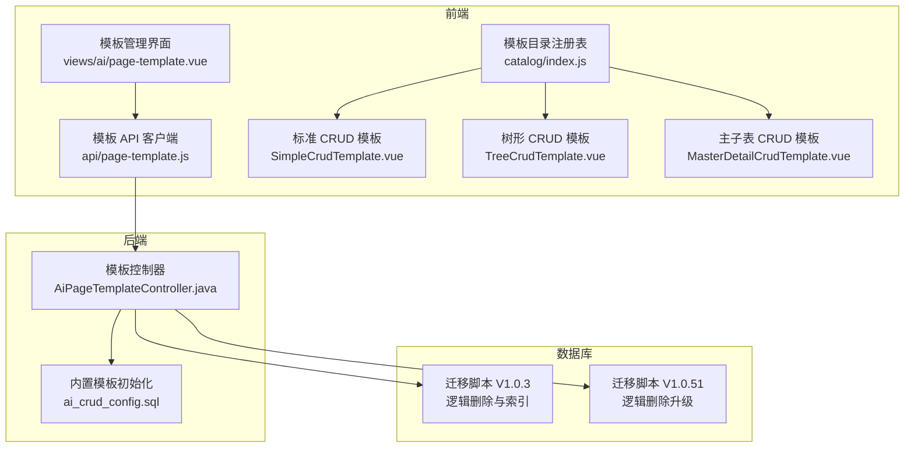
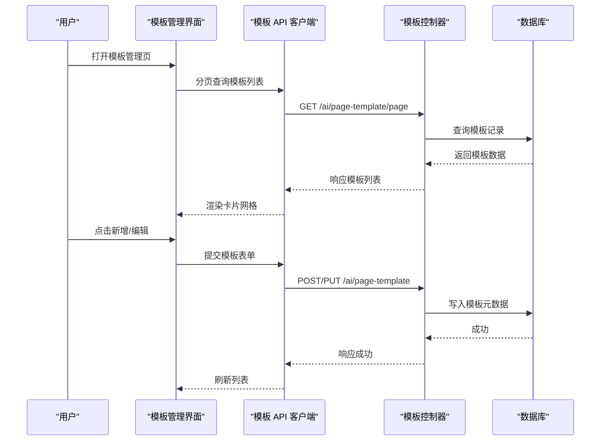
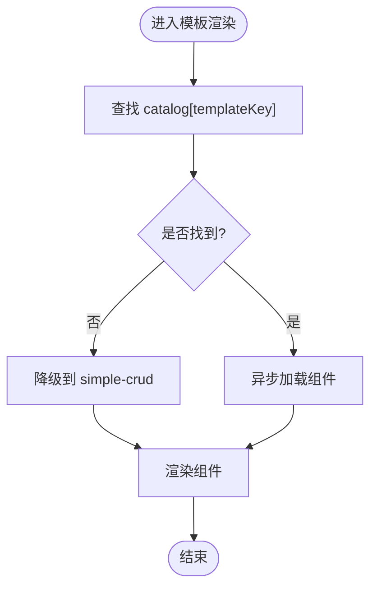
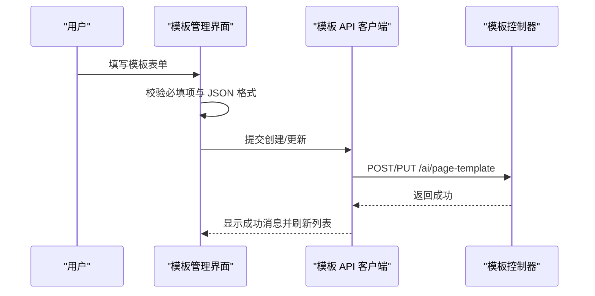
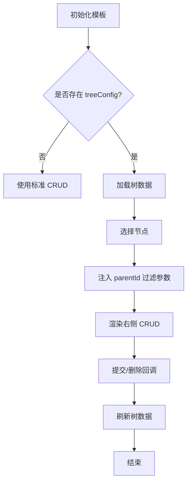
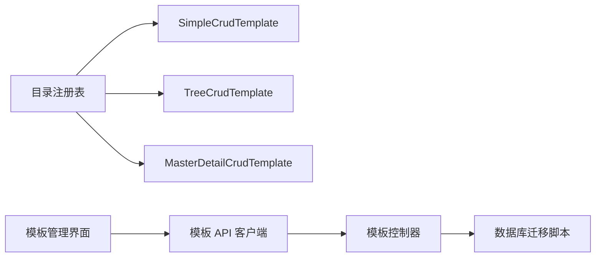

# 页面模板管理

<cite>
**本文引用的文件**
- [前端模板目录注册表](file://forge-admin-ui/src/catalog/index.js)
- [页面模板管理界面](file://forge-admin-ui/src/views/ai/page-template.vue)
- [页面模板 API 客户端](file://forge-admin-ui/src/api/page-template.js)
- [标准 CRUD 模板组件](file://forge-admin-ui/src/components/page-templates/SimpleCrudTemplate.vue)
- [树形 CRUD 模板组件](file://forge-admin-ui/src/components/page-templates/TreeCrudTemplate.vue)
- [主子表 CRUD 模板组件](file://forge-admin-ui/src/components/page-templates/MasterDetailCrudTemplate.vue)
- [内置模板初始数据脚本](file://forge-server/forge-framework/forge-plugin-parent/forge-plugin-generator/src/main/resources/sql/ai_crud_config.sql)
- [页面模板控制器](file://forge-server/forge-framework/forge-plugin-parent/forge-plugin-generator/src/main/java/com/mdframe/forge/plugin/generator/controller/AiPageTemplateController.java)
- [逻辑删除与唯一索引迁移脚本（一）](file://forge-server/db/migration/V1.0.3__add_logic_delete_to_platform_internal_tables.sql)
- [逻辑删除与唯一索引迁移脚本（二）](file://forge-server/db/migration/V1.0.51__replace_logic_delete_generated_columns.sql)
</cite>

## 目录
1. [简介](#简介)
2. [项目结构](#项目结构)
3. [核心组件](#核心组件)
4. [架构总览](#架构总览)
5. [详细组件分析](#详细组件分析)
6. [依赖关系分析](#依赖关系分析)
7. [性能考量](#性能考量)
8. [故障排查指南](#故障排查指南)
9. [结论](#结论)
10. [附录](#附录)

## 简介
本文件面向 Forge Admin 的页面模板管理系统，系统性说明其设计理念、模板分类体系、模板注册机制、生命周期管理与开发规范。该系统通过“后端模板元数据 + 前端渲染组件”的方式，将 AI 生成的页面配置与具体 UI 渲染解耦：后端维护模板标识、提示词约束、默认配置等元信息；前端根据 templateKey 动态加载对应渲染组件，实现可插拔的模板扩展能力。

## 项目结构
页面模板管理涉及前后端协作：
- 前端负责模板渲染组件的注册与选择，以及模板管理的可视化操作。
- 后端提供模板的增删改查接口，并维护模板元数据与内置模板数据。
- 数据库层通过迁移脚本保障模板表结构与唯一性约束。

图表来源
- [前端模板目录注册表:1-62](file://forge-admin-ui/src/catalog/index.js#L1-L62)
- [页面模板管理界面:1-782](file://forge-admin-ui/src/views/ai/page-template.vue#L1-L782)
- [页面模板 API 客户端:1-41](file://forge-admin-ui/src/api/page-template.js#L1-L41)
- [页面模板控制器:37-75](file://forge-server/forge-framework/forge-plugin-parent/forge-plugin-generator/src/main/java/com/mdframe/forge/plugin/generator/controller/AiPageTemplateController.java#L37-L75)
- [内置模板初始数据脚本:216-243](file://forge-server/forge-framework/forge-plugin-parent/forge-plugin-generator/src/main/resources/sql/ai_crud_config.sql#L216-L243)
- [逻辑删除与唯一索引迁移脚本（一）:48-74](file://forge-server/db/migration/V1.0.3__add_logic_delete_to_platform_internal_tables.sql#L48-L74)
- [逻辑删除与唯一索引迁移脚本（二）:1153-1192](file://forge-server/db/migration/V1.0.51__replace_logic_delete_generated_columns.sql#L1153-L1192)

章节来源
- [前端模板目录注册表:1-62](file://forge-admin-ui/src/catalog/index.js#L1-L62)
- [页面模板管理界面:1-782](file://forge-admin-ui/src/views/ai/page-template.vue#L1-L782)
- [页面模板 API 客户端:1-41](file://forge-admin-ui/src/api/page-template.js#L1-L41)
- [页面模板控制器:37-75](file://forge-server/forge-framework/forge-plugin-parent/forge-plugin-generator/src/main/java/com/mdframe/forge/plugin/generator/controller/AiPageTemplateController.java#L37-L75)
- [内置模板初始数据脚本:216-243](file://forge-server/forge-framework/forge-plugin-parent/forge-plugin-generator/src/main/resources/sql/ai_crud_config.sql#L216-L243)
- [逻辑删除与唯一索引迁移脚本（一）:48-74](file://forge-server/db/migration/V1.0.3__add_logic_delete_to_platform_internal_tables.sql#L48-L74)
- [逻辑删除与唯一索引迁移脚本（二）:1153-1192](file://forge-server/db/migration/V1.0.51__replace_logic_delete_generated_columns.sql#L1153-L1192)

## 核心组件
- 模板目录注册表：集中声明可用的渲染组件与映射关系，支持懒加载与降级策略。
- 模板管理界面：提供模板列表、新增/编辑、启用/停用、删除等操作。
- 模板 API 客户端：封装后端模板相关接口调用。
- 模板渲染组件：针对不同业务场景的标准 CRUD、树形 CRUD、主子表 CRUD。
- 后端控制器：暴露模板的查询、创建、更新、删除等 REST 接口。
- 内置模板数据：预置常用模板元数据，便于开箱即用。
- 数据库迁移：确保模板表结构与唯一性约束的正确演进。

章节来源
- [前端模板目录注册表:1-62](file://forge-admin-ui/src/catalog/index.js#L1-L62)
- [页面模板管理界面:1-782](file://forge-admin-ui/src/views/ai/page-template.vue#L1-L782)
- [页面模板 API 客户端:1-41](file://forge-admin-ui/src/api/page-template.js#L1-L41)
- [标准 CRUD 模板组件:1-30](file://forge-admin-ui/src/components/page-templates/SimpleCrudTemplate.vue#L1-L30)
- [树形 CRUD 模板组件:1-200](file://forge-admin-ui/src/components/page-templates/TreeCrudTemplate.vue#L1-L200)
- [主子表 CRUD 模板组件:1-31](file://forge-admin-ui/src/components/page-templates/MasterDetailCrudTemplate.vue#L1-L31)
- [页面模板控制器:37-75](file://forge-server/forge-framework/forge-plugin-parent/forge-plugin-generator/src/main/java/com/mdframe/forge/plugin/generator/controller/AiPageTemplateController.java#L37-L75)
- [内置模板初始数据脚本:216-243](file://forge-server/forge-framework/forge-plugin-parent/forge-plugin-generator/src/main/resources/sql/ai_crud_config.sql#L216-L243)
- [逻辑删除与唯一索引迁移脚本（一）:48-74](file://forge-server/db/migration/V1.0.3__add_logic_delete_to_platform_internal_tables.sql#L48-L74)
- [逻辑删除与唯一索引迁移脚本（二）:1153-1192](file://forge-server/db/migration/V1.0.51__replace_logic_delete_generated_columns.sql#L1153-L1192)

## 架构总览
系统采用“元数据驱动 + 组件化渲染”的架构：
- 后端维护模板元数据（templateKey、名称、描述、图标、AI 提示词约束、Schema 约束、默认配置、排序、启用状态、是否内置等）。
- 前端通过目录注册表将 templateKey 映射到具体渲染组件，运行时按 templateKey 动态加载组件。
- 模板管理界面提供对模板元数据的可视化管理，API 客户端与后端控制器交互完成持久化。

图表来源
- [页面模板管理界面:273-433](file://forge-admin-ui/src/views/ai/page-template.vue#L273-L433)
- [页面模板 API 客户端:7-41](file://forge-admin-ui/src/api/page-template.js#L7-L41)
- [页面模板控制器:37-75](file://forge-server/forge-framework/forge-plugin-parent/forge-plugin-generator/src/main/java/com/mdframe/forge/plugin/generator/controller/AiPageTemplateController.java#L37-L75)

## 详细组件分析

### 模板目录注册表
- 职责：定义 templateKey 到渲染组件的映射，提供获取组件与模板列表的能力。
- 关键点：
  - 使用懒加载方式引入组件，减少首屏体积。
  - 未找到模板时降级为默认模板，提升鲁棒性。
  - 提供本地 fallback 列表，用于后端数据加载前的展示。

图表来源
- [前端模板目录注册表:36-59](file://forge-admin-ui/src/catalog/index.js#L36-L59)

章节来源
- [前端模板目录注册表:1-62](file://forge-admin-ui/src/catalog/index.js#L1-L62)

### 模板管理界面
- 职责：提供模板的可视化 CRUD、启用/停用、删除等操作。
- 关键点：
  - 表单包含模板标识、名称、描述、图标、排序、启用状态、默认配置 JSON、Schema 约束 JSON、AI 提示词约束。
  - 提交前进行 JSON 格式校验，避免非法配置。
  - 列表支持分页，卡片展示模板元信息与预览。

图表来源
- [页面模板管理界面:315-406](file://forge-admin-ui/src/views/ai/page-template.vue#L315-L406)
- [页面模板 API 客户端:27-35](file://forge-admin-ui/src/api/page-template.js#L27-L35)
- [页面模板控制器:58-68](file://forge-server/forge-framework/forge-plugin-parent/forge-plugin-generator/src/main/java/com/mdframe/forge/plugin/generator/controller/AiPageTemplateController.java#L58-L68)

章节来源
- [页面模板管理界面:1-782](file://forge-admin-ui/src/views/ai/page-template.vue#L1-L782)
- [页面模板 API 客户端:1-41](file://forge-admin-ui/src/api/page-template.js#L1-L41)

### 标准 CRUD 模板组件
- 职责：针对平坦型数据的增删改查页面，直接复用通用 CRUD 页面组件。
- 关键点：
  - 接收统一的 crudProps，透传给底层组件。
  - 暴露 showAdd、showDetail、refresh 等方法供外部调用。

章节来源
- [标准 CRUD 模板组件:1-30](file://forge-admin-ui/src/components/page-templates/SimpleCrudTemplate.vue#L1-L30)

### 树形 CRUD 模板组件
- 职责：左树右表的层级数据管理，支持全量或懒加载模式。
- 关键点：
  - 从 options.treeConfig 读取树形配置，包括 keyField、parentField、labelField、loadMode 等。
  - 自动注入 parentId 过滤参数，支持 includeChildren。
  - 监听提交/删除事件后刷新树数据。
  - 无树形配置时降级为标准 CRUD。

图表来源
- [树形 CRUD 模板组件:57-106](file://forge-admin-ui/src/components/page-templates/TreeCrudTemplate.vue#L57-L106)
- [树形 CRUD 模板组件:108-169](file://forge-admin-ui/src/components/page-templates/TreeCrudTemplate.vue#L108-L169)

章节来源
- [树形 CRUD 模板组件:1-200](file://forge-admin-ui/src/components/page-templates/TreeCrudTemplate.vue#L1-L200)

### 主子表 CRUD 模板组件
- 职责：主记录与明细行组合的编辑体验。
- 关键点：
  - 开启详情加载模式，调整弹窗宽度。
  - 合并 childrenConfig 以支持子表配置。

章节来源
- [主子表 CRUD 模板组件:1-31](file://forge-admin-ui/src/components/page-templates/MasterDetailCrudTemplate.vue#L1-L31)

### 后端控制器与内置模板
- 控制器暴露模板的查询、创建、更新、删除接口，服务于前端管理界面与生成器。
- 内置模板初始数据提供开箱即用的模板元信息，包括提示词约束与默认配置。

章节来源
- [页面模板控制器:37-75](file://forge-server/forge-framework/forge-plugin-parent/forge-plugin-generator/src/main/java/com/mdframe/forge/plugin/generator/controller/AiPageTemplateController.java#L37-L75)
- [内置模板初始数据脚本:216-243](file://forge-server/forge-framework/forge-plugin-parent/forge-plugin-generator/src/main/resources/sql/ai_crud_config.sql#L216-L243)

## 依赖关系分析
- 前端目录注册表依赖各模板组件，并通过懒加载按需引入。
- 模板管理界面依赖 API 客户端，后者再依赖后端控制器。
- 后端控制器依赖数据库迁移脚本保证表结构与约束正确。
- 树形模板依赖 apiConfig.tree/list 接口与 treeConfig 配置。

图表来源
- [前端模板目录注册表:13-34](file://forge-admin-ui/src/catalog/index.js#L13-L34)
- [页面模板管理界面:273-433](file://forge-admin-ui/src/views/ai/page-template.vue#L273-L433)
- [页面模板 API 客户端:7-41](file://forge-admin-ui/src/api/page-template.js#L7-L41)
- [页面模板控制器:37-75](file://forge-server/forge-framework/forge-plugin-parent/forge-plugin-generator/src/main/java/com/mdframe/forge/plugin/generator/controller/AiPageTemplateController.java#L37-L75)
- [逻辑删除与唯一索引迁移脚本（一）:48-74](file://forge-server/db/migration/V1.0.3__add_logic_delete_to_platform_internal_tables.sql#L48-L74)
- [逻辑删除与唯一索引迁移脚本（二）:1153-1192](file://forge-server/db/migration/V1.0.51__replace_logic_delete_generated_columns.sql#L1153-L1192)

章节来源
- [前端模板目录注册表:1-62](file://forge-admin-ui/src/catalog/index.js#L1-L62)
- [页面模板管理界面:1-782](file://forge-admin-ui/src/views/ai/page-template.vue#L1-L782)
- [页面模板 API 客户端:1-41](file://forge-admin-ui/src/api/page-template.js#L1-L41)
- [页面模板控制器:37-75](file://forge-server/forge-framework/forge-plugin-parent/forge-plugin-generator/src/main/java/com/mdframe/forge/plugin/generator/controller/AiPageTemplateController.java#L37-L75)
- [逻辑删除与唯一索引迁移脚本（一）:48-74](file://forge-server/db/migration/V1.0.3__add_logic_delete_to_platform_internal_tables.sql#L48-L74)
- [逻辑删除与唯一索引迁移脚本（二）:1153-1192](file://forge-server/db/migration/V1.0.51__replace_logic_delete_generated_columns.sql#L1153-L1192)

## 性能考量
- 组件懒加载：目录注册表使用异步 import，降低首屏体积。
- 树形数据懒加载：树形模板支持 lazy 模式，按需加载子节点，减少一次性请求压力。
- 列表分页：模板管理界面采用分页加载，避免大数据量导致的渲染卡顿。
- 降级策略：未找到模板时回退到默认模板，提高可用性。

## 故障排查指南
- 模板未找到：检查 catalog 中是否注册了对应 templateKey，若缺失会降级到默认模板。
- JSON 配置错误：模板管理界面在提交前校验 defaultConfig 与 schemaHint 的 JSON 格式，失败时会提示并阻止提交。
- 树形数据加载失败：确认 apiConfig 中 tree/list 接口可用，treeConfig 配置正确；查看控制台警告定位问题。
- 唯一键冲突：模板标识需满足唯一性约束，迁移脚本已建立基于 template_key 与逻辑删除标记的唯一索引，重复创建会触发约束异常。

章节来源
- [前端模板目录注册表:36-59](file://forge-admin-ui/src/catalog/index.js#L36-L59)
- [页面模板管理界面:371-379](file://forge-admin-ui/src/views/ai/page-template.vue#L371-L379)
- [树形 CRUD 模板组件:108-169](file://forge-admin-ui/src/components/page-templates/TreeCrudTemplate.vue#L108-L169)
- [逻辑删除与唯一索引迁移脚本（一）:65-74](file://forge-server/db/migration/V1.0.3__add_logic_delete_to_platform_internal_tables.sql#L65-L74)
- [逻辑删除与唯一索引迁移脚本（二）:1175-1192](file://forge-server/db/migration/V1.0.51__replace_logic_delete_generated_columns.sql#L1175-L1192)

## 结论
页面模板管理系统通过清晰的职责划分与模块化设计，实现了模板元数据与渲染组件的解耦。借助目录注册表与后端模板服务，系统具备良好的可扩展性与可维护性。结合内置模板与迁移脚本，平台提供了开箱即用的能力与稳定的数据一致性保障。

## 附录

### 模板生命周期
- 创建：在前端模板管理界面填写模板元数据并提交，后端持久化到数据库。
- 编辑：修改模板名称、描述、图标、排序、启用状态、默认配置、Schema 约束与 AI 提示词约束。
- 发布：模板启用后即可被生成器与运行态使用；内置模板默认启用。
- 版本管理：模板本身不维护多版本快照，但可通过启用/停用与迁移脚本控制生效范围；应用级版本管理由其他模块负责。
- 删除：非内置模板可删除，内置模板不可删除。

章节来源
- [页面模板管理界面:273-433](file://forge-admin-ui/src/views/ai/page-template.vue#L273-L433)
- [页面模板控制器:37-75](file://forge-server/forge-framework/forge-plugin-parent/forge-plugin-generator/src/main/java/com/mdframe/forge/plugin/generator/controller/AiPageTemplateController.java#L37-L75)
- [内置模板初始数据脚本:216-243](file://forge-server/forge-framework/forge-plugin-parent/forge-plugin-generator/src/main/resources/sql/ai_crud_config.sql#L216-L243)

### 模板开发指南
- 模板结构规范：
  - 新增模板组件置于 src/components/page-templates/ 下。
  - 在目录注册表中注册 templateKey 与组件映射。
  - 在后端插入模板元数据记录，确保 templateKey 一致。
- 组件使用约定：
  - 统一接收 crudProps，遵循 AiCrudPage 的参数约定。
  - 树形模板需配置 treeConfig 与 apiConfig.tree/list。
  - 主子表模板需合并 childrenConfig 并设置合适的弹窗宽度。
- 样式定制方案：
  - 通过 crudProps.options 与模板默认配置调整布局与交互。
  - 利用模板组件暴露的方法进行外部控制（如 showAdd、showDetail、refresh）。
- 集成到应用中心：
  - 使用模板元数据中的 templateKey 与默认配置，在应用构建时绑定到页面。
  - 确保模板启用且未被逻辑删除，以便生成器与运行态正常加载。

章节来源
- [前端模板目录注册表:1-62](file://forge-admin-ui/src/catalog/index.js#L1-L62)
- [标准 CRUD 模板组件:1-30](file://forge-admin-ui/src/components/page-templates/SimpleCrudTemplate.vue#L1-L30)
- [树形 CRUD 模板组件:1-200](file://forge-admin-ui/src/components/page-templates/TreeCrudTemplate.vue#L1-L200)
- [主子表 CRUD 模板组件:1-31](file://forge-admin-ui/src/components/page-templates/MasterDetailCrudTemplate.vue#L1-L31)
- [内置模板初始数据脚本:216-243](file://forge-server/forge-framework/forge-plugin-parent/forge-plugin-generator/src/main/resources/sql/ai_crud_config.sql#L216-L243)