# 员工管理模块

<cite>
**本文档引用的文件**
- [EmployeeController.java](file://forge/forge-admin-server/src/main/java/com/mdframe/forge/employee/controller/EmployeeController.java)
- [IEmployeeService.java](file://forge/forge-admin-server/src/main/java/com/mdframe/forge/employee/service/IEmployeeService.java)
- [Employee.java](file://forge/forge-admin-server/src/main/java/com/mdframe/forge/employee/entity/Employee.java)
- [EmployeeDTO.java](file://forge/forge-admin-server/src/main/java/com/mdframe/forge/employee/dto/EmployeeDTO.java)
- [EmployeeQuery.java](file://forge/forge-admin-server/src/main/java/com/mdframe/forge/employee/dto/EmployeeQuery.java)
- [application.yml](file://forge/forge-admin-server/src/main/resources/application.yml)
- [index.vue](file://forge/forge-admin-ui/src/views/employee/index.vue)
</cite>

## 目录
1. [简介](#简介)
2. [项目结构](#项目结构)
3. [核心组件](#核心组件)
4. [架构概览](#架构概览)
5. [详细组件分析](#详细组件分析)
6. [数据模型分析](#数据模型分析)
7. [前端集成分析](#前端集成分析)
8. [安全与加密机制](#安全与加密机制)
9. [性能考虑](#性能考虑)
10. [故障排除指南](#故障排除指南)
11. [总结](#总结)

## 简介

员工管理模块是Forge框架中的一个核心业务模块，基于Spring Boot和Vue.js技术栈构建，提供了完整的员工信息管理功能。该模块采用前后端分离架构，通过RESTful API进行数据交互，支持员工信息的增删改查、分页查询、字典翻译等功能。

模块特点：
- **全栈技术栈**：后端使用Java Spring Boot，前端使用Vue.js
- **安全加密**：内置API加解密和敏感信息脱敏功能
- **字典翻译**：支持多语言字典数据的自动翻译
- **权限控制**：集成了Sa-Token认证框架
- **响应式设计**：提供现代化的用户界面体验

## 项目结构

员工管理模块在整体项目中的组织结构如下：

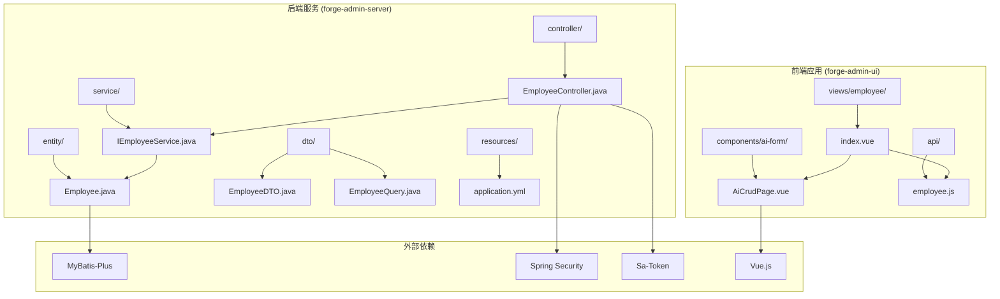

**图表来源**
- [EmployeeController.java:1-103](file://forge/forge-admin-server/src/main/java/com/mdframe/forge/employee/controller/EmployeeController.java#L1-L103)
- [IEmployeeService.java:1-55](file://forge/forge-admin-server/src/main/java/com/mdframe/forge/employee/service/IEmployeeService.java#L1-L55)
- [index.vue:1-233](file://forge/forge-admin-ui/src/views/employee/index.vue#L1-L233)

**章节来源**
- [EmployeeController.java:1-103](file://forge/forge-admin-server/src/main/java/com/mdframe/forge/employee/controller/EmployeeController.java#L1-L103)
- [IEmployeeService.java:1-55](file://forge/forge-admin-server/src/main/java/com/mdframe/forge/employee/service/IEmployeeService.java#L1-L55)
- [index.vue:1-233](file://forge/forge-admin-ui/src/views/employee/index.vue#L1-L233)

## 核心组件

### 控制器层 (Controller Layer)

EmployeeController作为RESTful API的入口点，提供了完整的员工管理接口：

| 接口方法 | HTTP方法 | 路径 | 功能描述 |
|---------|---------|------|----------|
| page | GET | `/employee/page` | 分页查询员工列表 |
| list | GET | `/employee/list` | 获取员工列表 |
| getById | POST | `/employee/getById` | 根据ID查询员工详情 |
| add | POST | `/employee/add` | 新增员工信息 |
| edit | POST | `/employee/edit` | 修改员工信息 |
| remove | POST | `/employee/remove/{id}` | 删除员工信息 |
| removeBatch | POST | `/employee/removeBatch` | 批量删除员工信息 |

### 服务层 (Service Layer)

IEmployeeService定义了业务逻辑接口，继承自MyBatis-Plus的IService：

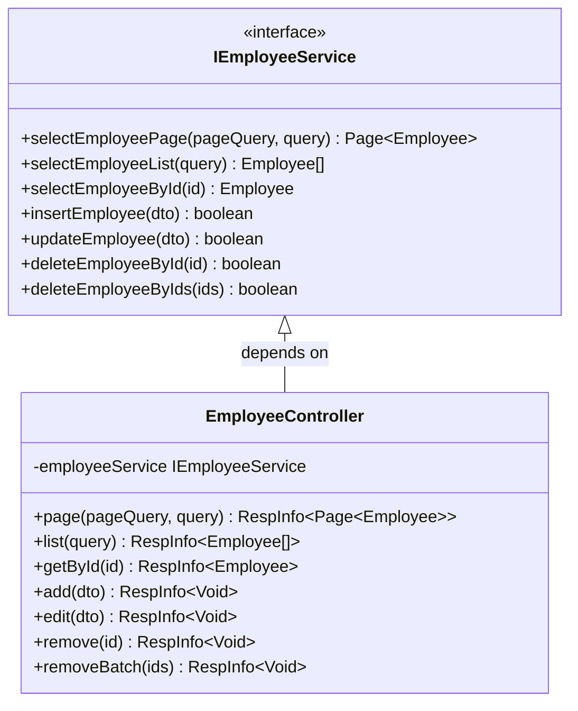

**图表来源**
- [IEmployeeService.java:18-54](file://forge/forge-admin-server/src/main/java/com/mdframe/forge/employee/service/IEmployeeService.java#L18-L54)
- [EmployeeController.java:30-102](file://forge/forge-admin-server/src/main/java/com/mdframe/forge/employee/controller/EmployeeController.java#L30-L102)

### 数据传输对象 (DTO)

模块包含三个核心DTO类：

1. **EmployeeDTO**：用于员工信息的新增和修改操作
2. **EmployeeQuery**：用于员工信息的查询条件
3. **Employee**：数据库实体映射类

**章节来源**
- [EmployeeController.java:19-102](file://forge/forge-admin-server/src/main/java/com/mdframe/forge/employee/controller/EmployeeController.java#L19-L102)
- [IEmployeeService.java:12-54](file://forge/forge-admin-server/src/main/java/com/mdframe/forge/employee/service/IEmployeeService.java#L12-L54)

## 架构概览

员工管理模块采用经典的三层架构模式：

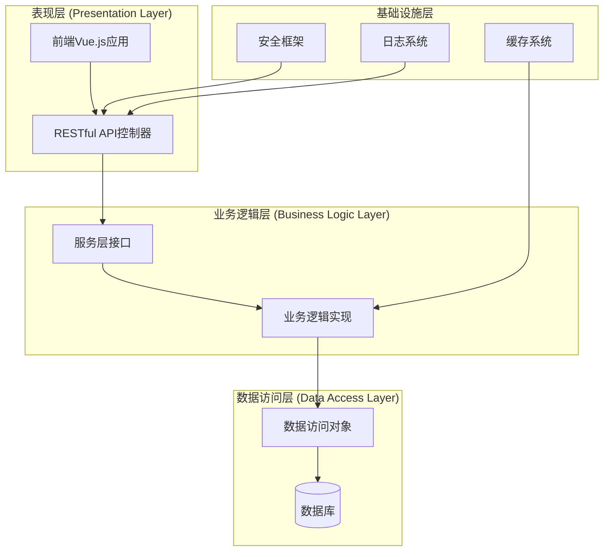

**图表来源**
- [EmployeeController.java:25-30](file://forge/forge-admin-server/src/main/java/com/mdframe/forge/employee/controller/EmployeeController.java#L25-L30)
- [IEmployeeService.java:18](file://forge/forge-admin-server/src/main/java/com/mdframe/forge/employee/service/IEmployeeService.java#L18)

### 数据流处理

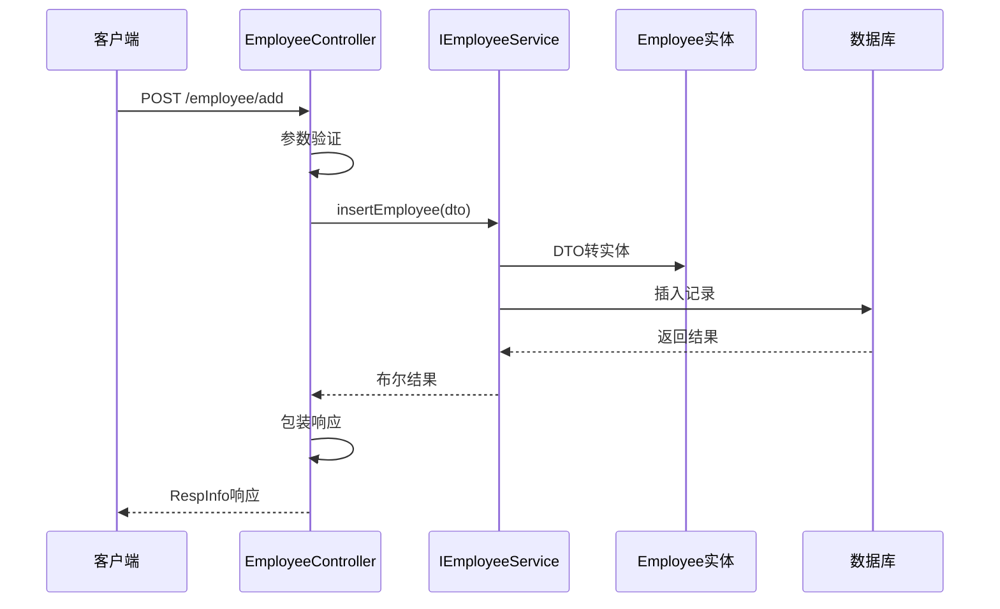

**图表来源**
- [EmployeeController.java:66-71](file://forge/forge-admin-server/src/main/java/com/mdframe/forge/employee/controller/EmployeeController.java#L66-L71)
- [IEmployeeService.java:38](file://forge/forge-admin-server/src/main/java/com/mdframe/forge/employee/service/IEmployeeService.java#L38)

**章节来源**
- [application.yml:1-107](file://forge/forge-admin-server/src/main/resources/application.yml#L1-L107)

## 详细组件分析

### 员工实体模型

Employee实体类定义了员工信息的核心字段和业务规则：

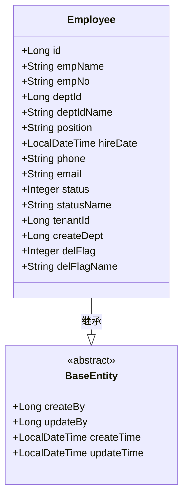

**图表来源**
- [Employee.java:24-104](file://forge/forge-admin-server/src/main/java/com/mdframe/forge/employee/entity/Employee.java#L24-L104)

#### 敏感信息保护

模块实现了多层次的敏感信息保护机制：

| 敏感字段 | 脱敏策略 | 脱敏类型 |
|---------|---------|---------|
| empName | 姓名脱敏 | NAME |
| phone | 手机号脱敏 | PHONE |
| email | 邮箱脱敏 | EMAIL |

#### 字典翻译支持

通过注解实现自动字典翻译：

```java
@TransField(dictType = "sys_dept")  // 部门名称翻译
private Long deptId;

@TransField(dictType = "sys_normal_disable")  // 状态名称翻译
private Integer status;
```

**章节来源**
- [Employee.java:37-74](file://forge/forge-admin-server/src/main/java/com/mdframe/forge/employee/entity/Employee.java#L37-L74)
- [Employee.java:48-83](file://forge/forge-admin-server/src/main/java/com/mdframe/forge/employee/entity/Employee.java#L48-L83)

### 前端页面组件

前端采用Vue.js和Element Plus构建响应式界面：

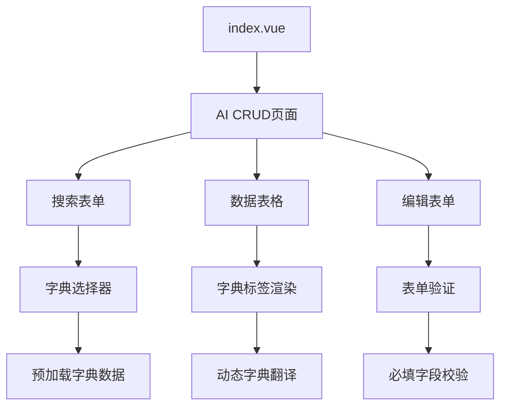

**图表来源**
- [index.vue:8-15](file://forge/forge-admin-ui/src/views/employee/index.vue#L8-L15)
- [index.vue:42-69](file://forge/forge-admin-ui/src/views/employee/index.vue#L42-L69)

#### 字典系统集成

前端实现了智能的字典数据管理系统：

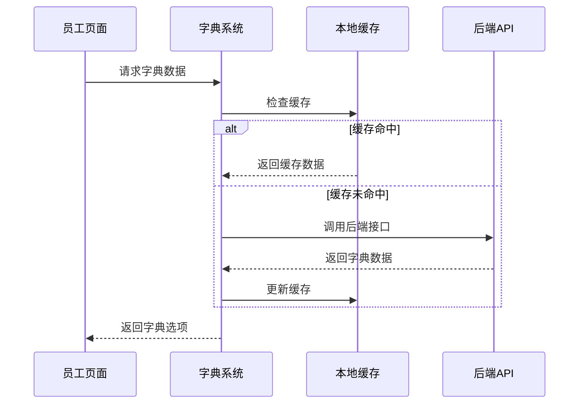

**图表来源**
- [index.vue:182-194](file://forge/forge-admin-ui/src/views/employee/index.vue#L182-L194)
- [index.vue:218-228](file://forge/forge-admin-ui/src/views/employee/index.vue#L218-L228)

**章节来源**
- [index.vue:19-233](file://forge/forge-admin-ui/src/views/employee/index.vue#L19-L233)

## 数据模型分析

### 数据库表结构

员工信息表采用标准的关系型数据库设计：

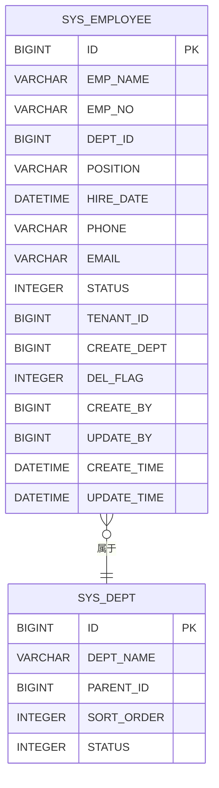

### 字段约束与业务规则

| 字段名 | 类型 | 约束 | 说明 |
|-------|-----|------|------|
| id | BIGINT | 主键, 自增 | 员工唯一标识 |
| emp_name | VARCHAR(50) | NOT NULL | 员工姓名 |
| emp_no | VARCHAR(20) | UNIQUE | 员工工号 |
| dept_id | BIGINT | NOT NULL | 所属部门ID |
| position | VARCHAR(100) | NOT NULL | 职位名称 |
| hire_date | DATE | NOT NULL | 入职日期 |
| phone | VARCHAR(20) | | 手机号码 |
| email | VARCHAR(100) | | 邮箱地址 |
| status | TINYINT | DEFAULT 1 | 状态：1正常/0停用 |
| del_flag | TINYINT | DEFAULT 0 | 删除标志：0未删除/1已删除 |

**章节来源**
- [Employee.java:31-104](file://forge/forge-admin-server/src/main/java/com/mdframe/forge/employee/entity/Employee.java#L31-L104)

## 前端集成分析

### AI CRUD页面组件

模块使用了AI驱动的CRUD页面生成器：

```mermaid
graph LR
A[AiCrudPage] --> B[API配置]
A --> C[搜索schema]
A --> D[表格列配置]
A --> E[编辑schema]
B --> F[/employee/page]
B --> G[/employee/getById]
B --> H[/employee/add]
B --> I[/employee/edit]
B --> J[/employee/remove/:id]
C --> K[姓名/工号/部门/状态]
D --> L[基础信息+状态显示]
E --> M[完整表单字段]
```

**图表来源**
- [index.vue:30-36](file://forge/forge-admin-ui/src/views/employee/index.vue#L30-L36)
- [index.vue:42-179](file://forge/forge-admin-ui/src/views/employee/index.vue#L42-L179)

### 响应式布局设计

前端实现了灵活的响应式布局：

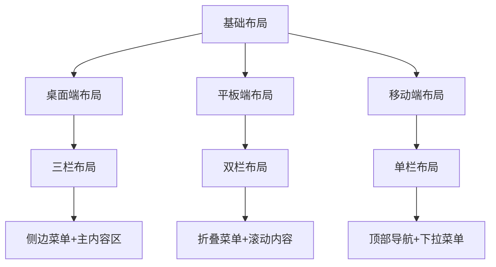

**章节来源**
- [index.vue:1-233](file://forge/forge-admin-ui/src/views/employee/index.vue#L1-L233)

## 安全与加密机制

### API安全防护

模块集成了多重安全防护机制：

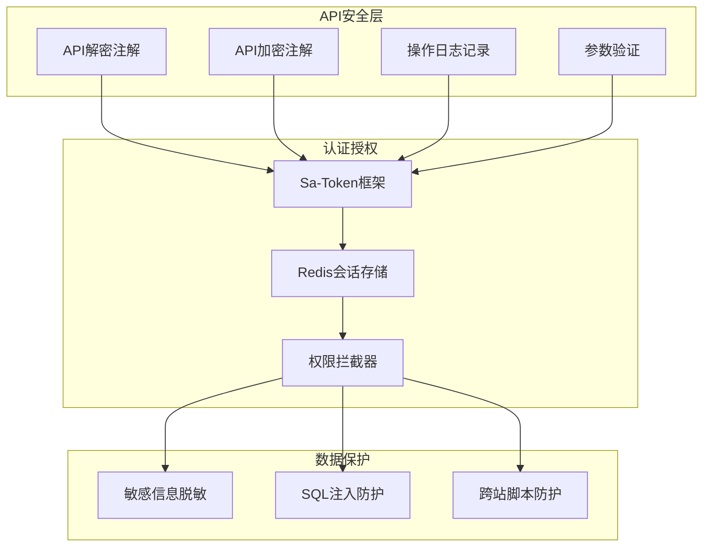

**图表来源**
- [EmployeeController.java:8-29](file://forge/forge-admin-server/src/main/java/com/mdframe/forge/employee/controller/EmployeeController.java#L8-L29)

### 敏感数据脱敏

实现了智能的敏感数据脱敏策略：

| 字段类型 | 脱敏规则 | 示例 |
|---------|---------|------|
| 姓名 | 保留首字符，其余星号 | 张** |
| 手机号 | 保留前3位和后4位 | 138****1234 |
| 邮箱 | 邮箱前缀脱敏，保留域名 | zhang***@company.com |

**章节来源**
- [EmployeeController.java:8-29](file://forge/forge-admin-server/src/main/java/com/mdframe/forge/employee/controller/EmployeeController.java#L8-L29)
- [Employee.java:37-74](file://forge/forge-admin-server/src/main/java/com/mdframe/forge/employee/entity/Employee.java#L37-L74)

## 性能考虑

### 数据库优化

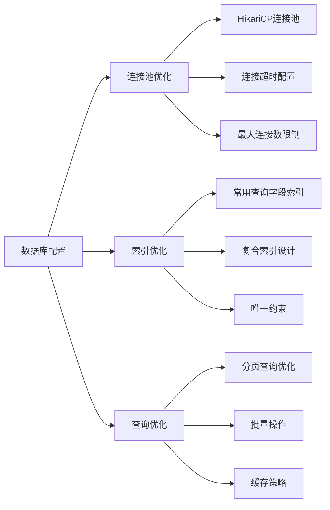

### 前端性能优化

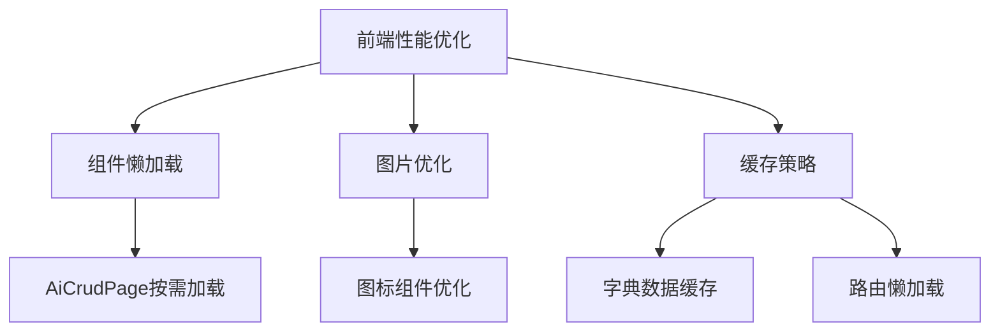

## 故障排除指南

### 常见问题诊断

| 问题类型 | 症状 | 可能原因 | 解决方案 |
|---------|------|---------|---------|
| API调用失败 | HTTP 500错误 | 服务端异常 | 检查服务日志，验证数据库连接 |
| 数据脱敏异常 | 敏感信息未脱敏 | 脱敏注解配置错误 | 检查@Entity注解配置 |
| 字典翻译失效 | 下拉框显示ID而非名称 | 字典数据未加载 | 验证字典接口和缓存机制 |
| 分页查询异常 | 查询结果不正确 | 分页参数错误 | 检查PageQuery参数传递 |

### 调试工具使用

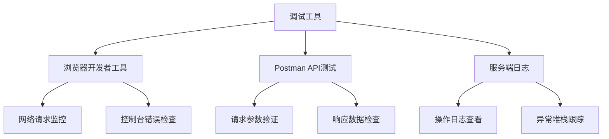

**章节来源**
- [application.yml:23-30](file://forge/forge-admin-server/src/main/resources/application.yml#L23-L30)

## 总结

员工管理模块是一个功能完整、架构清晰的企业级应用模块。其主要优势包括：

### 技术优势
- **全栈技术栈**：前后端分离架构，技术选型合理
- **安全防护完善**：多层安全机制保障数据安全
- **开发效率高**：AI驱动的CRUD页面生成功能
- **可扩展性强**：模块化设计便于功能扩展

### 业务价值
- **用户体验优秀**：响应式设计适配多终端设备
- **数据治理规范**：完善的字典翻译和脱敏机制
- **运维友好**：详细的日志记录和监控支持

### 改进建议
- 可以考虑增加数据导入导出功能
- 建议添加员工档案的版本历史追踪
- 可以优化大数据量场景下的查询性能

该模块为Forge框架提供了优秀的员工管理解决方案，具备良好的可维护性和扩展性。