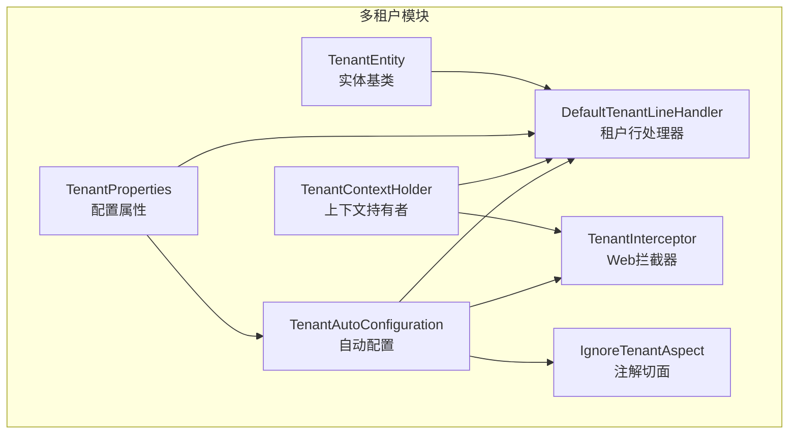
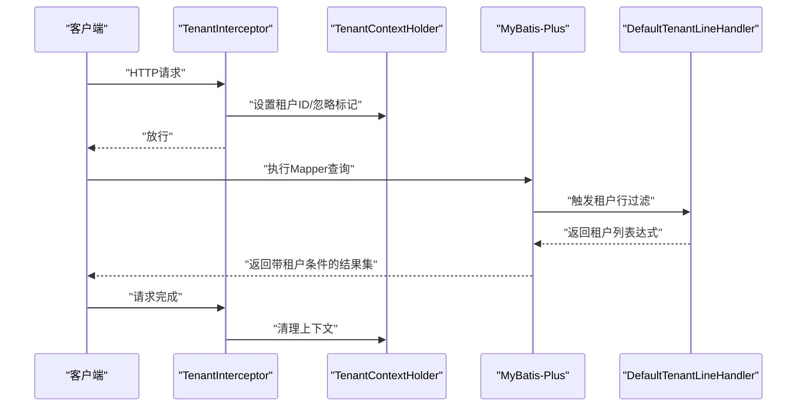
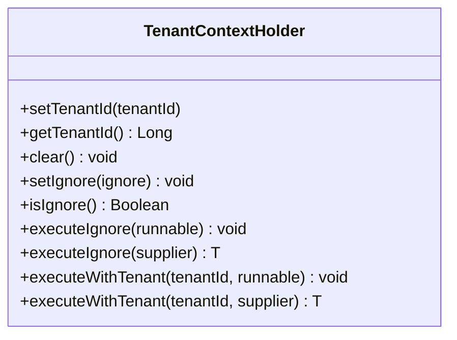
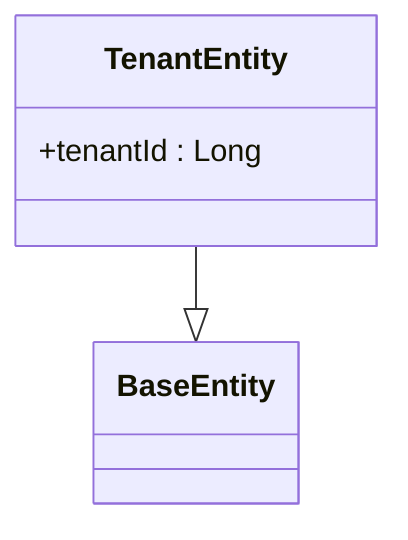
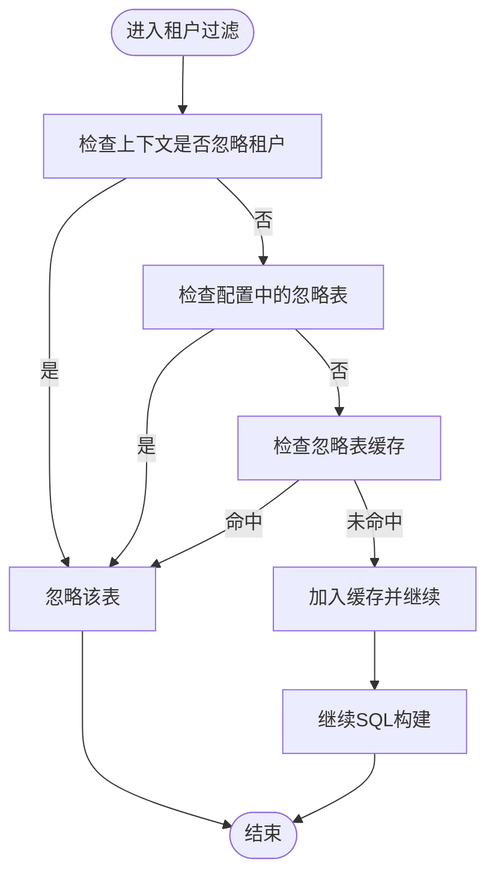
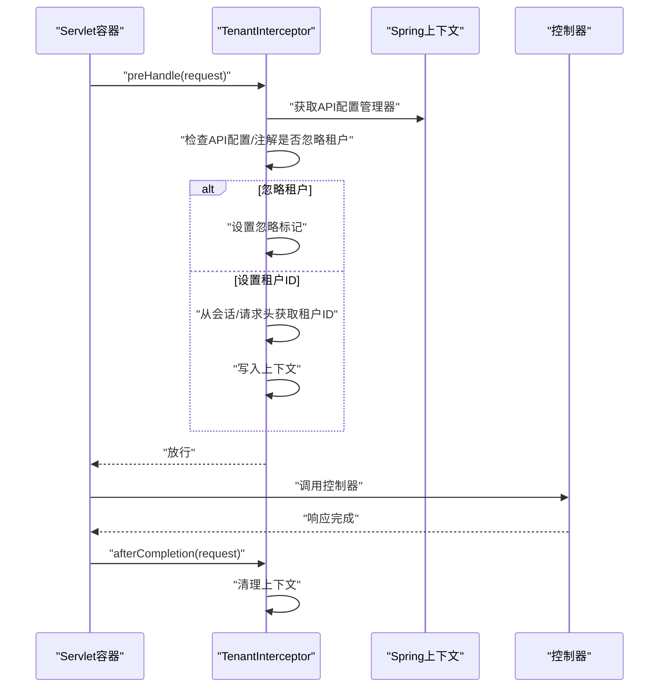
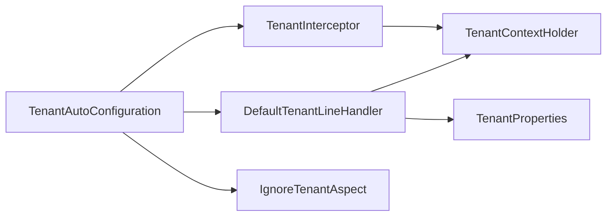

# 多租户管理

<cite>
**本文引用的文件**
- [TenantContextHolder.java](file://forge/forge-framework/forge-starter-parent/forge-starter-tenant/src/main/java/com/mdframe/forge/starter/tenant/context/TenantContextHolder.java)
- [TenantAutoConfiguration.java](file://forge/forge-framework/forge-starter-parent/forge-starter-tenant/src/main/java/com/mdframe/forge/starter/tenant/config/TenantAutoConfiguration.java)
- [TenantProperties.java](file://forge/forge-framework/forge-starter-parent/forge-starter-tenant/src/main/java/com/mdframe/forge/starter/tenant/config/TenantProperties.java)
- [TenantEntity.java](file://forge/forge-framework/forge-starter-parent/forge-starter-tenant/src/main/java/com/mdframe/forge/starter/tenant/core/TenantEntity.java)
- [DefaultTenantLineHandler.java](file://forge/forge-framework/forge-starter-parent/forge-starter-tenant/src/main/java/com/mdframe/forge/starter/tenant/handler/DefaultTenantLineHandler.java)
- [TenantInterceptor.java](file://forge/forge-framework/forge-starter-parent/forge-starter-tenant/src/main/java/com/mdframe/forge/starter/tenant/interceptor/TenantInterceptor.java)
- [IgnoreTenantAspect.java](file://forge/forge-framework/forge-starter-parent/forge-starter-tenant/src/main/java/com/mdframe/forge/starter/tenant/aspect/IgnoreTenantAspect.java)
- [TenantUtil.java](file://forge/forge-framework/forge-starter-parent/forge-starter-tenant/src/main/java/com/mdframe/forge/starter/tenant/util/TenantUtil.java)
- [README.md（多租户模块）](file://forge/forge-framework/forge-starter-parent/forge-starter-tenant/README.md)
- [TENANT_USAGE.md（多租户使用说明）](file://forge/forge-framework/forge-starter-parent/forge-starter-tenant/TENANT_USAGE.md)
</cite>

## 目录
1. [简介](#简介)
2. [项目结构](#项目结构)
3. [核心组件](#核心组件)
4. [架构总览](#架构总览)
5. [详细组件分析](#详细组件分析)
6. [依赖关系分析](#依赖关系分析)
7. [性能考量](#性能考量)
8. [故障排查指南](#故障排查指南)
9. [结论](#结论)
10. [附录](#附录)

## 简介
本文件面向Forge框架的多租户管理能力，系统性阐述其设计理念与实现方案，覆盖租户隔离策略、数据范围控制、租户上下文管理、动态SQL过滤、跨租户查询与租户切换机制等核心主题。文档同时提供完整的开发指南、配置示例、最佳实践与性能优化建议，帮助开发者构建安全可靠的多租户应用。

## 项目结构
多租户能力位于“forge-starter-tenant”模块，采用“starter”风格的自动装配与可插拔扩展设计，围绕以下关键点组织：
- 自动配置：负责注册租户处理器、Web拦截器、忽略注解切面等
- 上下文管理：提供线程本地的租户ID与忽略标记，支持异步传递
- SQL过滤：基于MyBatis-Plus的租户行级过滤器，自动注入WHERE条件
- 拦截器链：在Web层从会话或请求头提取租户ID，建立运行期上下文
- 配置中心：集中管理租户字段、忽略表、严格模式等参数

图表来源
- [TenantAutoConfiguration.java](file://forge/forge-framework/forge-starter-parent/forge-starter-tenant/src/main/java/com/mdframe/forge/starter/tenant/config/TenantAutoConfiguration.java#L1-L88)
- [DefaultTenantLineHandler.java](file://forge/forge-framework/forge-starter-parent/forge-starter-tenant/src/main/java/com/mdframe/forge/starter/tenant/handler/DefaultTenantLineHandler.java#L1-L88)
- [TenantInterceptor.java](file://forge/forge-framework/forge-starter-parent/forge-starter-tenant/src/main/java/com/mdframe/forge/starter/tenant/interceptor/TenantInterceptor.java#L1-L98)
- [TenantContextHolder.java](file://forge/forge-framework/forge-starter-parent/forge-starter-tenant/src/main/java/com/mdframe/forge/starter/tenant/context/TenantContextHolder.java#L1-L147)
- [TenantProperties.java](file://forge/forge-framework/forge-starter-parent/forge-starter-tenant/src/main/java/com/mdframe/forge/starter/tenant/config/TenantProperties.java#L1-L67)
- [TenantEntity.java](file://forge/forge-framework/forge-starter-parent/forge-starter-tenant/src/main/java/com/mdframe/forge/starter/tenant/core/TenantEntity.java#L1-L19)

章节来源
- [TenantAutoConfiguration.java](file://forge/forge-framework/forge-starter-parent/forge-starter-tenant/src/main/java/com/mdframe/forge/starter/tenant/config/TenantAutoConfiguration.java#L1-L88)
- [TenantProperties.java](file://forge/forge-framework/forge-starter-parent/forge-starter-tenant/src/main/java/com/mdframe/forge/starter/tenant/config/TenantProperties.java#L1-L67)

## 核心组件
- 租户上下文持有者：提供线程本地的租户ID与忽略标记，支持在异步线程中传递；提供“在忽略租户模式下执行”和“在指定租户下执行”的便捷方法族
- 租户实体基类：统一在实体中声明租户字段，便于ORM映射与默认过滤
- 租户行处理器：实现MyBatis-Plus的租户行级过滤接口，按配置生成租户列表达式与忽略表判定
- Web拦截器：在请求进入时从会话或请求头解析租户ID，写入上下文；请求结束时清理上下文
- 自动配置：注册租户处理器、Web拦截器、注解切面；将租户SQL拦截器交由ORM配置统一注册
- 配置属性：集中定义租户开关、租户字段、忽略表、忽略SQL关键字、严格模式等
- 忽略租户注解切面：对标注@IgnoreTenant的方法或类进行环绕处理，临时忽略租户过滤
- 租户工具类：对外暴露简洁API，封装上下文设置、忽略与切换逻辑

章节来源
- [TenantContextHolder.java](file://forge/forge-framework/forge-starter-parent/forge-starter-tenant/src/main/java/com/mdframe/forge/starter/tenant/context/TenantContextHolder.java#L1-L147)
- [TenantEntity.java](file://forge/forge-framework/forge-starter-parent/forge-starter-tenant/src/main/java/com/mdframe/forge/starter/tenant/core/TenantEntity.java#L1-L19)
- [DefaultTenantLineHandler.java](file://forge/forge-framework/forge-starter-parent/forge-starter-tenant/src/main/java/com/mdframe/forge/starter/tenant/handler/DefaultTenantLineHandler.java#L1-L88)
- [TenantInterceptor.java](file://forge/forge-framework/forge-starter-parent/forge-starter-tenant/src/main/java/com/mdframe/forge/starter/tenant/interceptor/TenantInterceptor.java#L1-L98)
- [TenantAutoConfiguration.java](file://forge/forge-framework/forge-starter-parent/forge-starter-tenant/src/main/java/com/mdframe/forge/starter/tenant/config/TenantAutoConfiguration.java#L1-L88)
- [TenantProperties.java](file://forge/forge-framework/forge-starter-parent/forge-starter-tenant/src/main/java/com/mdframe/forge/starter/tenant/config/TenantProperties.java#L1-L67)
- [IgnoreTenantAspect.java](file://forge/forge-framework/forge-starter-parent/forge-starter-tenant/src/main/java/com/mdframe/forge/starter/tenant/aspect/IgnoreTenantAspect.java)
- [TenantUtil.java](file://forge/forge-framework/forge-starter-parent/forge-starter-tenant/src/main/java/com/mdframe/forge/starter/tenant/util/TenantUtil.java)

## 架构总览
多租户在请求生命周期内的工作流如下：
- 请求进入：Web拦截器从会话或请求头提取租户ID，写入上下文
- SQL执行：MyBatis-Plus拦截器触发租户行处理器，自动在WHERE子句追加租户条件
- 跨租户场景：通过工具类或上下文持有者在忽略模式或指定租户模式下执行
- 请求结束：清理上下文，避免线程复用导致的污染

图表来源
- [TenantInterceptor.java](file://forge/forge-framework/forge-starter-parent/forge-starter-tenant/src/main/java/com/mdframe/forge/starter/tenant/interceptor/TenantInterceptor.java#L1-L98)
- [TenantContextHolder.java](file://forge/forge-framework/forge-starter-parent/forge-starter-tenant/src/main/java/com/mdframe/forge/starter/tenant/context/TenantContextHolder.java#L1-L147)
- [DefaultTenantLineHandler.java](file://forge/forge-framework/forge-starter-parent/forge-starter-tenant/src/main/java/com/mdframe/forge/starter/tenant/handler/DefaultTenantLineHandler.java#L1-L88)

## 详细组件分析

### 租户上下文管理（TenantContextHolder）
- 设计要点
  - 使用可在线程池传递的上下文容器，保证异步场景下的租户可见性
  - 提供“忽略租户”标记位，支持在特定业务场景下临时关闭租户过滤
  - 提供“在忽略模式下执行”和“在指定租户下执行”的便捷方法族，简化调用方代码
- 关键行为
  - 设置/获取/清空租户ID
  - 设置/判断/临时覆盖忽略标记
  - 在指定租户或忽略模式下执行回调，自动恢复状态

图表来源
- [TenantContextHolder.java](file://forge/forge-framework/forge-starter-parent/forge-starter-tenant/src/main/java/com/mdframe/forge/starter/tenant/context/TenantContextHolder.java#L1-L147)

章节来源
- [TenantContextHolder.java](file://forge/forge-framework/forge-starter-parent/forge-starter-tenant/src/main/java/com/mdframe/forge/starter/tenant/context/TenantContextHolder.java#L1-L147)

### 租户实体基类（TenantEntity）
- 设计要点
  - 统一继承基础实体，内建租户字段，便于ORM映射与默认过滤
  - 业务实体只需继承该基类即可参与默认的租户过滤
- 使用建议
  - 所有需要按租户隔离的持久化实体均应继承该基类
  - 对于无需参与租户过滤的系统表，可通过配置或注解方式排除

图表来源
- [TenantEntity.java](file://forge/forge-framework/forge-starter-parent/forge-starter-tenant/src/main/java/com/mdframe/forge/starter/tenant/core/TenantEntity.java#L1-L19)

章节来源
- [TenantEntity.java](file://forge/forge-framework/forge-starter-parent/forge-starter-tenant/src/main/java/com/mdframe/forge/starter/tenant/core/TenantEntity.java#L1-L19)

### 租户行处理器（DefaultTenantLineHandler）
- 设计要点
  - 实现租户行过滤接口，负责生成租户列表达式与忽略表判定
  - 支持从上下文读取租户ID，若无则返回空值（可在严格模式下配合其他策略）
  - 内置忽略表集合与缓存，减少重复判定开销
- 关键行为
  - 获取租户ID表达式
  - 获取租户列名
  - 判定是否忽略某张表（支持上下文忽略、配置忽略、缓存命中）

图表来源
- [DefaultTenantLineHandler.java](file://forge/forge-framework/forge-starter-parent/forge-starter-tenant/src/main/java/com/mdframe/forge/starter/tenant/handler/DefaultTenantLineHandler.java#L1-L88)

章节来源
- [DefaultTenantLineHandler.java](file://forge/forge-framework/forge-starter-parent/forge-starter-tenant/src/main/java/com/mdframe/forge/starter/tenant/handler/DefaultTenantLineHandler.java#L1-L88)

### Web拦截器（TenantInterceptor）
- 设计要点
  - 在请求到达控制器前，从会话或请求头解析租户ID并写入上下文
  - 支持API配置与注解双维度决定是否忽略租户
  - 请求完成后清理上下文，避免线程复用导致的状态泄露
- 关键行为
  - 解析API配置决定是否忽略租户
  - 检查方法/类上的@IgnoreTenant注解
  - 从会话或请求头设置租户ID
  - 清理上下文

图表来源
- [TenantInterceptor.java](file://forge/forge-framework/forge-starter-parent/forge-starter-tenant/src/main/java/com/mdframe/forge/starter/tenant/interceptor/TenantInterceptor.java#L1-L98)

章节来源
- [TenantInterceptor.java](file://forge/forge-framework/forge-starter-parent/forge-starter-tenant/src/main/java/com/mdframe/forge/starter/tenant/interceptor/TenantInterceptor.java#L1-L98)

### 自动配置（TenantAutoConfiguration）
- 设计要点
  - 条件化启用：仅当配置开启时生效
  - 低耦合注册：将租户SQL拦截器交由ORM配置统一注册，避免重复注册
  - Web拦截器注册：在Web容器中注册租户拦截器，设置合理优先级
  - 注解切面：提供@IgnoreTenant的切面支持
- 关键Bean
  - 租户处理器
  - 租户SQL拦截器
  - 租户Web拦截器
  - 忽略租户注解切面

章节来源
- [TenantAutoConfiguration.java](file://forge/forge-framework/forge-starter-parent/forge-starter-tenant/src/main/java/com/mdframe/forge/starter/tenant/config/TenantAutoConfiguration.java#L1-L88)

### 配置属性（TenantProperties）
- 设计要点
  - 集中管理租户字段、忽略表、忽略SQL关键字、严格模式等
  - 默认忽略大量系统表，降低误过滤风险
- 关键项
  - enabled：是否启用多租户
  - column：租户字段名
  - ignoreTables：忽略表列表
  - ignoreSqlKeywords：忽略SQL关键字
  - strictMode：严格模式

章节来源
- [TenantProperties.java](file://forge/forge-framework/forge-starter-parent/forge-starter-tenant/src/main/java/com/mdframe/forge/starter/tenant/config/TenantProperties.java#L1-L67)

### 忽略租户注解与切面（@IgnoreTenant 与 IgnoreTenantAspect）
- 设计要点
  - 通过注解在方法或类级别声明忽略租户
  - 切面在执行前后设置/恢复上下文的忽略标记
- 使用场景
  - 系统级查询、跨租户统计、后台管理操作等

章节来源
- [IgnoreTenantAspect.java](file://forge/forge-framework/forge-starter-parent/forge-starter-tenant/src/main/java/com/mdframe/forge/starter/tenant/aspect/IgnoreTenantAspect.java)

### 租户工具类（TenantUtil）
- 设计要点
  - 对外提供简洁API，封装上下文设置、忽略与切换逻辑
  - 与上下文持有者配合，简化调用方代码

章节来源
- [TenantUtil.java](file://forge/forge-framework/forge-starter-parent/forge-starter-tenant/src/main/java/com/mdframe/forge/starter/tenant/util/TenantUtil.java)

## 依赖关系分析
- 组件耦合
  - TenantInterceptor依赖会话辅助类与API配置管理器，实现租户ID解析与忽略判定
  - DefaultTenantLineHandler依赖TenantContextHolder与TenantProperties，实现租户过滤与忽略表判定
  - TenantAutoConfiguration统一注册各组件，避免重复装配
- 可能的循环依赖
  - 通过条件化与延迟装配避免循环依赖；Web拦截器与SQL拦截器分别在不同阶段生效
- 外部依赖
  - MyBatis-Plus租户插件
  - Spring MVC拦截器链
  - 可在线程池传递的上下文容器

图表来源
- [TenantAutoConfiguration.java](file://forge/forge-framework/forge-starter-parent/forge-starter-tenant/src/main/java/com/mdframe/forge/starter/tenant/config/TenantAutoConfiguration.java#L1-L88)
- [TenantInterceptor.java](file://forge/forge-framework/forge-starter-parent/forge-starter-tenant/src/main/java/com/mdframe/forge/starter/tenant/interceptor/TenantInterceptor.java#L1-L98)
- [DefaultTenantLineHandler.java](file://forge/forge-framework/forge-starter-parent/forge-starter-tenant/src/main/java/com/mdframe/forge/starter/tenant/handler/DefaultTenantLineHandler.java#L1-L88)
- [TenantContextHolder.java](file://forge/forge-framework/forge-starter-parent/forge-starter-tenant/src/main/java/com/mdframe/forge/starter/tenant/context/TenantContextHolder.java#L1-L147)
- [TenantProperties.java](file://forge/forge-framework/forge-starter-parent/forge-starter-tenant/src/main/java/com/mdframe/forge/starter/tenant/config/TenantProperties.java#L1-L67)
- [IgnoreTenantAspect.java](file://forge/forge-framework/forge-starter-parent/forge-starter-tenant/src/main/java/com/mdframe/forge/starter/tenant/aspect/IgnoreTenantAspect.java)

章节来源
- [TenantAutoConfiguration.java](file://forge/forge-framework/forge-starter-parent/forge-starter-tenant/src/main/java/com/mdframe/forge/starter/tenant/config/TenantAutoConfiguration.java#L1-L88)
- [TenantInterceptor.java](file://forge/forge-framework/forge-starter-parent/forge-starter-tenant/src/main/java/com/mdframe/forge/starter/tenant/interceptor/TenantInterceptor.java#L1-L98)
- [DefaultTenantLineHandler.java](file://forge/forge-framework/forge-starter-parent/forge-starter-tenant/src/main/java/com/mdframe/forge/starter/tenant/handler/DefaultTenantLineHandler.java#L1-L88)
- [TenantContextHolder.java](file://forge/forge-framework/forge-starter-parent/forge-starter-tenant/src/main/java/com/mdframe/forge/starter/tenant/context/TenantContextHolder.java#L1-L147)
- [TenantProperties.java](file://forge/forge-framework/forge-starter-parent/forge-starter-tenant/src/main/java/com/mdframe/forge/starter/tenant/config/TenantProperties.java#L1-L67)
- [IgnoreTenantAspect.java](file://forge/forge-framework/forge-starter-parent/forge-starter-tenant/src/main/java/com/mdframe/forge/starter/tenant/aspect/IgnoreTenantAspect.java)

## 性能考量
- 忽略表缓存
  - 租户处理器内部维护忽略表集合与缓存，减少重复判定开销
  - 建议将高频访问且无需租户过滤的系统表加入忽略列表
- 索引优化
  - 在租户字段上建立合适索引，显著降低过滤成本
- 异步线程传递
  - 使用可在线程池传递的上下文容器，避免异步场景下的重复设置
- 严格模式
  - 在严格模式下，缺失租户ID时可抛出异常，便于快速定位问题
- SQL关键字忽略
  - 通过忽略SQL关键字，避免对特定SQL添加租户条件，减少不必要的过滤

## 故障排查指南
- 现象：查询不到数据或返回全部数据
  - 排查步骤
    - 检查租户ID是否正确写入上下文（Web拦截器是否生效）
    - 确认租户字段是否正确配置
    - 检查是否误将目标表加入忽略列表
- 现象：定时任务或异步任务查询异常
  - 排查步骤
    - 在任务中显式设置租户ID或使用忽略模式
    - 确认任务线程是否正确传递租户上下文
- 现象：跨租户查询失败
  - 排查步骤
    - 使用工具类或上下文持有者的“在指定租户下执行”方法
    - 或使用注解/工具类的“忽略租户”模式进行一次性查询
- 现象：系统表被错误过滤
  - 排查步骤
    - 将系统表加入忽略列表
    - 检查是否误用了租户实体基类

章节来源
- [TenantInterceptor.java](file://forge/forge-framework/forge-starter-parent/forge-starter-tenant/src/main/java/com/mdframe/forge/starter/tenant/interceptor/TenantInterceptor.java#L1-L98)
- [DefaultTenantLineHandler.java](file://forge/forge-framework/forge-starter-parent/forge-starter-tenant/src/main/java/com/mdframe/forge/starter/tenant/handler/DefaultTenantLineHandler.java#L1-L88)
- [TenantContextHolder.java](file://forge/forge-framework/forge-starter-parent/forge-starter-tenant/src/main/java/com/mdframe/forge/starter/tenant/context/TenantContextHolder.java#L1-L147)
- [TenantProperties.java](file://forge/forge-framework/forge-starter-parent/forge-starter-tenant/src/main/java/com/mdframe/forge/starter/tenant/config/TenantProperties.java#L1-L67)

## 结论
Forge框架的多租户模块通过“上下文+拦截器+处理器+自动配置”的组合，实现了对租户隔离、数据范围控制与跨租户查询的完整支持。其设计强调可插拔、低耦合与高性能，既满足日常业务的透明隔离，又为系统级与跨租户场景提供了灵活的规避与切换手段。结合合理的配置与最佳实践，可有效保障多租户应用的安全性与稳定性。

## 附录
- 开发指南与使用示例
  - 请参考模块自述与使用说明文档，了解依赖引入、配置项、实体继承与常用API
- 配置清单
  - 启用开关、租户字段、忽略表、忽略SQL关键字、严格模式
- 最佳实践
  - 为租户字段建立索引
  - 将系统表加入忽略列表
  - 在异步与定时任务中显式设置租户上下文
  - 使用注解与工具类进行跨租户查询

章节来源
- [README.md（多租户模块）](file://forge/forge-framework/forge-starter-parent/forge-starter-tenant/README.md#L1-L139)
- [TENANT_USAGE.md（多租户使用说明）](file://forge/forge-framework/forge-starter-parent/forge-starter-tenant/TENANT_USAGE.md)