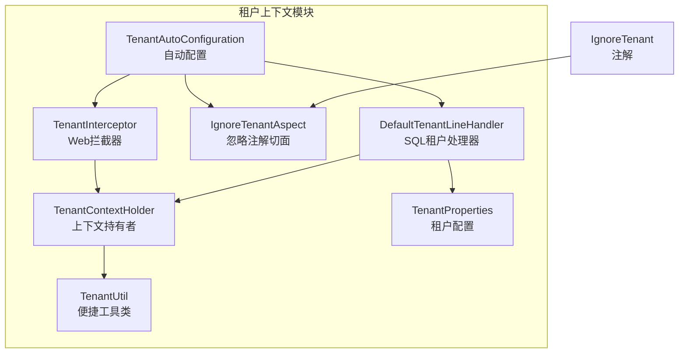
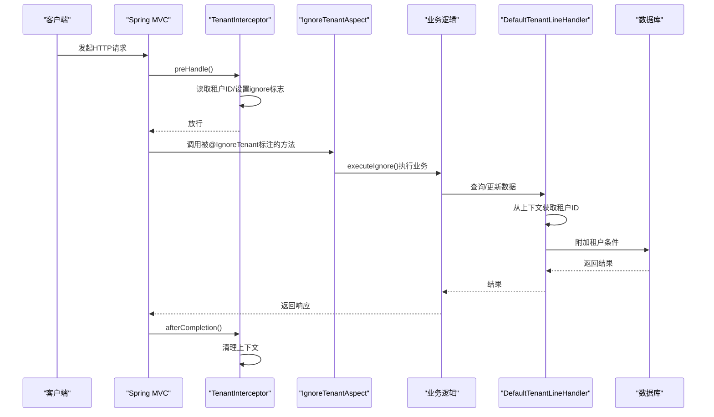
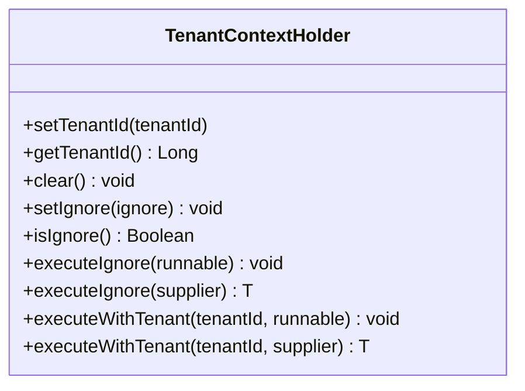
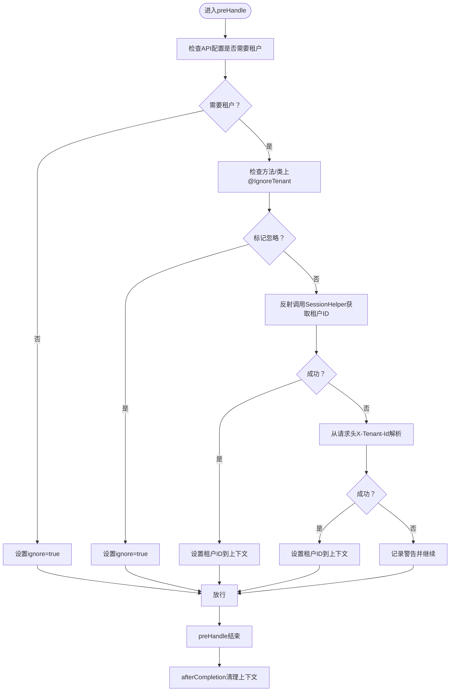
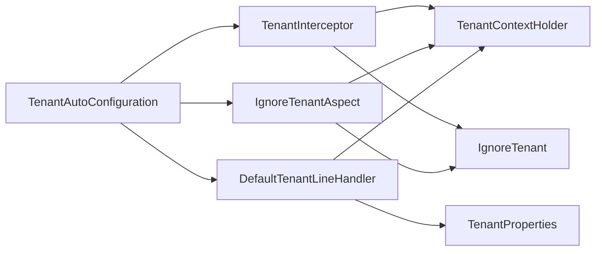

# 租户上下文管理

<cite>
**本文引用的文件**
- [TenantContextHolder.java](file://forge/forge-framework/forge-starter-parent/forge-starter-tenant/src/main/java/com/mdframe/forge/starter/tenant/context/TenantContextHolder.java)
- [TenantUtil.java](file://forge/forge-framework/forge-starter-parent/forge-starter-tenant/src/main/java/com/mdframe/forge/starter/tenant/util/TenantUtil.java)
- [TenantAutoConfiguration.java](file://forge/forge-framework/forge-starter-parent/forge-starter-tenant/src/main/java/com/mdframe/forge/starter/tenant/config/TenantAutoConfiguration.java)
- [TenantInterceptor.java](file://forge/forge-framework/forge-starter-parent/forge-starter-tenant/src/main/java/com/mdframe/forge/starter/tenant/interceptor/TenantInterceptor.java)
- [IgnoreTenantAspect.java](file://forge/forge-framework/forge-starter-parent/forge-starter-tenant/src/main/java/com/mdframe/forge/starter/tenant/aspect/IgnoreTenantAspect.java)
- [TenantProperties.java](file://forge/forge-framework/forge-starter-parent/forge-starter-tenant/src/main/java/com/mdframe/forge/starter/tenant/config/TenantProperties.java)
- [DefaultTenantLineHandler.java](file://forge/forge-framework/forge-starter-parent/forge-starter-tenant/src/main/java/com/mdframe/forge/starter/tenant/handler/DefaultTenantLineHandler.java)
- [IgnoreTenant.java](file://forge/forge-framework/forge-starter-parent/forge-starter-core/src/main/java/com/mdframe/forge/starter/core/annotation/tenant/IgnoreTenant.java)
- [org.springframework.boot.autoconfigure.AutoConfiguration.imports](file://forge/forge-framework/forge-starter-parent/forge-starter-tenant/src/main/resources/META-INF/spring/org.springframework.boot.autoconfigure.AutoConfiguration.imports)
</cite>

## 目录
1. [简介](#简介)
2. [项目结构](#项目结构)
3. [核心组件](#核心组件)
4. [架构总览](#架构总览)
5. [组件详解](#组件详解)
6. [依赖关系分析](#依赖关系分析)
7. [性能与内存优化](#性能与内存优化)
8. [故障排查指南](#故障排查指南)
9. [结论](#结论)
10. [附录](#附录)

## 简介
本技术文档围绕Forge框架的租户上下文管理能力展开，重点阐述TenantContextHolder的设计理念与实现机制，包括：
- 基于TransmittableThreadLocal的线程上下文传递
- 租户ID的设置、获取、清除与生命周期管理
- ignore租户模式的触发与使用场景
- 上下文切换方法executeIgnore与executeWithTenant的使用方式与最佳实践
- 异步线程场景下的上下文传递方案、内存泄漏防护与性能优化建议

## 项目结构
租户上下文相关代码主要位于forge-starter-tenant模块，配合核心注解、自动配置、拦截器与切面共同完成从Web请求到数据库访问的全链路租户上下文管理。

**图表来源**
- [TenantContextHolder.java](file://forge/forge-framework/forge-starter-parent/forge-starter-tenant/src/main/java/com/mdframe/forge/starter/tenant/context/TenantContextHolder.java#L1-L147)
- [TenantUtil.java](file://forge/forge-framework/forge-starter-parent/forge-starter-tenant/src/main/java/com/mdframe/forge/starter/tenant/util/TenantUtil.java#L1-L111)
- [TenantAutoConfiguration.java](file://forge/forge-framework/forge-starter-parent/forge-starter-tenant/src/main/java/com/mdframe/forge/starter/tenant/config/TenantAutoConfiguration.java#L1-L88)
- [TenantInterceptor.java](file://forge/forge-framework/forge-starter-parent/forge-starter-tenant/src/main/java/com/mdframe/forge/starter/tenant/interceptor/TenantInterceptor.java#L1-L98)
- [IgnoreTenantAspect.java](file://forge/forge-framework/forge-starter-parent/forge-starter-tenant/src/main/java/com/mdframe/forge/starter/tenant/aspect/IgnoreTenantAspect.java#L1-L53)
- [DefaultTenantLineHandler.java](file://forge/forge-framework/forge-starter-parent/forge-starter-tenant/src/main/java/com/mdframe/forge/starter/tenant/handler/DefaultTenantLineHandler.java#L1-L88)
- [TenantProperties.java](file://forge/forge-framework/forge-starter-parent/forge-starter-tenant/src/main/java/com/mdframe/forge/starter/tenant/config/TenantProperties.java#L1-L67)
- [IgnoreTenant.java](file://forge/forge-framework/forge-starter-parent/forge-starter-core/src/main/java/com/mdframe/forge/starter/core/annotation/tenant/IgnoreTenant.java#L1-L19)

**章节来源**
- [TenantAutoConfiguration.java](file://forge/forge-framework/forge-starter-parent/forge-starter-tenant/src/main/java/com/mdframe/forge/starter/tenant/config/TenantAutoConfiguration.java#L1-L88)
- [org.springframework.boot.autoconfigure.AutoConfiguration.imports](file://forge/forge-framework/forge-starter-parent/forge-starter-tenant/src/main/resources/META-INF/spring/org.springframework.boot.autoconfigure.AutoConfiguration.imports#L1-L2)

## 核心组件
- TenantContextHolder：基于TransmittableThreadLocal的租户上下文持有者，提供租户ID与ignore标志的设置、获取、清理，以及上下文切换执行方法。
- TenantUtil：对TenantContextHolder的便捷封装，提供静态方法以简化业务侧调用。
- TenantInterceptor：Web层拦截器，负责从会话或请求头提取租户ID并写入上下文，同时在请求完成后清理上下文。
- IgnoreTenantAspect：基于注解的切面，拦截带有@IgnoreTenant的方法，临时切换为忽略租户模式执行。
- DefaultTenantLineHandler：MyBatis-Plus租户行处理器，从上下文读取租户ID并生成SQL过滤条件，支持忽略表与缓存优化。
- TenantProperties：租户配置项，包括开关、租户字段名、忽略表与SQL关键字、严格模式等。
- IgnoreTenant：用于标注类或方法忽略租户的注解。

**章节来源**
- [TenantContextHolder.java](file://forge/forge-framework/forge-starter-parent/forge-starter-tenant/src/main/java/com/mdframe/forge/starter/tenant/context/TenantContextHolder.java#L1-L147)
- [TenantUtil.java](file://forge/forge-framework/forge-starter-parent/forge-starter-tenant/src/main/java/com/mdframe/forge/starter/tenant/util/TenantUtil.java#L1-L111)
- [TenantInterceptor.java](file://forge/forge-framework/forge-starter-parent/forge-starter-tenant/src/main/java/com/mdframe/forge/starter/tenant/interceptor/TenantInterceptor.java#L1-L98)
- [IgnoreTenantAspect.java](file://forge/forge-framework/forge-starter-parent/forge-starter-tenant/src/main/java/com/mdframe/forge/starter/tenant/aspect/IgnoreTenantAspect.java#L1-L53)
- [DefaultTenantLineHandler.java](file://forge/forge-framework/forge-starter-parent/forge-starter-tenant/src/main/java/com/mdframe/forge/starter/tenant/handler/DefaultTenantLineHandler.java#L1-L88)
- [TenantProperties.java](file://forge/forge-framework/forge-starter-parent/forge-starter-tenant/src/main/java/com/mdframe/forge/starter/tenant/config/TenantProperties.java#L1-L67)
- [IgnoreTenant.java](file://forge/forge-framework/forge-starter-parent/forge-starter-core/src/main/java/com/mdframe/forge/starter/core/annotation/tenant/IgnoreTenant.java#L1-L19)

## 架构总览
租户上下文贯穿Web请求、注解切面、业务执行与数据库访问四个层面，形成闭环的多租户隔离。

**图表来源**
- [TenantInterceptor.java](file://forge/forge-framework/forge-starter-parent/forge-starter-tenant/src/main/java/com/mdframe/forge/starter/tenant/interceptor/TenantInterceptor.java#L26-L96)
- [IgnoreTenantAspect.java](file://forge/forge-framework/forge-starter-parent/forge-starter-tenant/src/main/java/com/mdframe/forge/starter/tenant/aspect/IgnoreTenantAspect.java#L28-L51)
- [DefaultTenantLineHandler.java](file://forge/forge-framework/forge-starter-parent/forge-starter-tenant/src/main/java/com/mdframe/forge/starter/tenant/handler/DefaultTenantLineHandler.java#L30-L61)
- [TenantContextHolder.java](file://forge/forge-framework/forge-starter-parent/forge-starter-tenant/src/main/java/com/mdframe/forge/starter/tenant/context/TenantContextHolder.java#L26-L45)

## 组件详解

### TenantContextHolder：上下文持有者
- 设计要点
  - 使用TransmittableThreadLocal保存租户ID与ignore标志，支持在线程池与异步场景下自动传递。
  - 提供基础操作：设置租户ID、获取租户ID、清理上下文、设置/判断ignore标志。
  - 提供上下文切换执行方法：executeIgnore与executeWithTenant，均采用try-finally确保恢复原上下文。
- 生命周期
  - 设置：在Web拦截器中根据会话或请求头设置租户ID；也可手动设置。
  - 清理：在Web拦截器afterCompletion阶段统一清理，防止线程复用导致的内存泄漏。
- 上下文切换最佳实践
  - executeIgnore：适用于系统级操作或需要绕过租户过滤的场景，如定时任务、系统维护。
  - executeWithTenant：适用于跨租户代理执行或临时切换租户的场景，如报表聚合、迁移脚本。

**图表来源**
- [TenantContextHolder.java](file://forge/forge-framework/forge-starter-parent/forge-starter-tenant/src/main/java/com/mdframe/forge/starter/tenant/context/TenantContextHolder.java#L9-L147)

**章节来源**
- [TenantContextHolder.java](file://forge/forge-framework/forge-starter-parent/forge-starter-tenant/src/main/java/com/mdframe/forge/starter/tenant/context/TenantContextHolder.java#L11-L147)

### TenantUtil：便捷工具类
- 封装TenantContextHolder常用方法，提供静态入口，便于在业务代码中快速获取/设置租户ID、判断是否存在租户、执行忽略租户或指定租户的操作。
- 与TenantContextHolder保持一致的上下文语义与生命周期管理。

**章节来源**
- [TenantUtil.java](file://forge/forge-framework/forge-starter-parent/forge-starter-tenant/src/main/java/com/mdframe/forge/starter/tenant/util/TenantUtil.java#L11-L111)

### TenantInterceptor：Web拦截器
- 功能
  - 在preHandle阶段从会话或请求头提取租户ID并写入上下文；若API配置或注解标记忽略租户，则设置ignore标志。
  - 在afterCompletion阶段清理上下文，避免线程复用导致的数据污染与内存泄漏。
- 依赖
  - 通过反射调用SessionHelper获取租户ID；若未引入认证模块则回退到请求头X-Tenant-Id。
  - 与IgnoreTenant注解配合，支持方法/类级别忽略租户。

**图表来源**
- [TenantInterceptor.java](file://forge/forge-framework/forge-starter-parent/forge-starter-tenant/src/main/java/com/mdframe/forge/starter/tenant/interceptor/TenantInterceptor.java#L26-L96)

**章节来源**
- [TenantInterceptor.java](file://forge/forge-framework/forge-starter-parent/forge-starter-tenant/src/main/java/com/mdframe/forge/starter/tenant/interceptor/TenantInterceptor.java#L26-L96)

### IgnoreTenantAspect：忽略租户切面
- 功能
  - 拦截带有@IgnoreTenant注解的方法，临时将上下文切换为忽略租户模式执行，保证该方法内的所有数据访问不受租户过滤影响。
  - 使用环绕通知包装目标方法，异常时进行包装并抛出。
- 与TenantInterceptor的关系
  - 两者共同构成“声明式忽略租户”的能力：前者在Web层按API配置或注解生效，后者在业务层按方法注解生效。

**章节来源**
- [IgnoreTenantAspect.java](file://forge/forge-framework/forge-starter-parent/forge-starter-tenant/src/main/java/com/mdframe/forge/starter/tenant/aspect/IgnoreTenantAspect.java#L28-L51)
- [IgnoreTenant.java](file://forge/forge-framework/forge-starter-parent/forge-starter-core/src/main/java/com/mdframe/forge/starter/core/annotation/tenant/IgnoreTenant.java#L9-L19)

### DefaultTenantLineHandler：SQL租户处理器
- 功能
  - 从TenantContextHolder获取租户ID，生成租户条件表达式，注入到MyBatis-Plus的SQL中。
  - 支持ignoreTable策略：当上下文标记忽略租户或命中忽略表/关键字时跳过过滤。
  - 缓存忽略表集合，减少重复判断开销。
- 与TenantProperties的协作
  - 读取column作为租户字段名；结合ignoreTables与ignoreSqlKeywords决定是否应用租户过滤。

**章节来源**
- [DefaultTenantLineHandler.java](file://forge/forge-framework/forge-starter-parent/forge-starter-tenant/src/main/java/com/mdframe/forge/starter/tenant/handler/DefaultTenantLineHandler.java#L30-L86)
- [TenantProperties.java](file://forge/forge-framework/forge-starter-parent/forge-starter-tenant/src/main/java/com/mdframe/forge/starter/tenant/config/TenantProperties.java#L22-L43)

### TenantProperties：租户配置
- 关键配置项
  - enabled：是否启用租户功能
  - column：租户字段名，默认tenant_id
  - ignoreTables：忽略租户的表名列表
  - ignoreSqlKeywords：忽略租户的SQL关键字列表
  - strictMode：无租户ID时的行为策略（抛异常或警告）
- 默认忽略表覆盖常见系统表，避免对配置、字典、作业等表产生不必要的租户过滤。

**章节来源**
- [TenantProperties.java](file://forge/forge-framework/forge-starter-parent/forge-starter-tenant/src/main/java/com/mdframe/forge/starter/tenant/config/TenantProperties.java#L14-L66)

## 依赖关系分析
- 自动装配
  - 通过META-INF/spring/org.springframework.boot.autoconfigure.AutoConfiguration.imports声明自动配置类，确保TenantAutoConfiguration在应用启动时被加载。
- 组件耦合
  - TenantInterceptor依赖IgnoreTenant注解与API配置管理器，间接依赖会话辅助类。
  - DefaultTenantLineHandler依赖TenantContextHolder与TenantProperties。
  - IgnoreTenantAspect依赖TenantContextHolder与IgnoreTenant注解。
- 外部依赖
  - 使用TransmittableThreadLocal实现线程上下文传递，保障异步场景可用。
  - 与MyBatis-Plus租户插件集成，通过TenantLineInnerInterceptor与TenantLineHandler完成SQL过滤。

**图表来源**
- [TenantAutoConfiguration.java](file://forge/forge-framework/forge-starter-parent/forge-starter-tenant/src/main/java/com/mdframe/forge/starter/tenant/config/TenantAutoConfiguration.java#L30-L86)
- [TenantInterceptor.java](file://forge/forge-framework/forge-starter-parent/forge-starter-tenant/src/main/java/com/mdframe/forge/starter/tenant/interceptor/TenantInterceptor.java#L24-L96)
- [IgnoreTenantAspect.java](file://forge/forge-framework/forge-starter-parent/forge-starter-tenant/src/main/java/com/mdframe/forge/starter/tenant/aspect/IgnoreTenantAspect.java#L23-L51)
- [DefaultTenantLineHandler.java](file://forge/forge-framework/forge-starter-parent/forge-starter-tenant/src/main/java/com/mdframe/forge/starter/tenant/handler/DefaultTenantLineHandler.java#L21-L86)
- [IgnoreTenant.java](file://forge/forge-framework/forge-starter-parent/forge-starter-core/src/main/java/com/mdframe/forge/starter/core/annotation/tenant/IgnoreTenant.java#L12-L17)

**章节来源**
- [org.springframework.boot.autoconfigure.AutoConfiguration.imports](file://forge/forge-framework/forge-starter-parent/forge-starter-tenant/src/main/resources/META-INF/spring/org.springframework.boot.autoconfigure.AutoConfiguration.imports#L1-L2)

## 性能与内存优化
- 异步线程传递
  - 使用TransmittableThreadLocal替代普通ThreadLocal，确保在线程池与异步任务中租户上下文可正确传递，避免重复设置与丢失。
- SQL过滤优化
  - DefaultTenantLineHandler对忽略表集合进行缓存，减少重复判断成本；支持忽略SQL关键字，避免对特定查询强制加租户条件。
- 生命周期管理
  - TenantInterceptor在请求结束后统一清理上下文，防止线程复用导致的内存泄漏；建议在自定义异步任务中显式清理或使用上下文切换方法。
- 配置优化
  - 合理配置ignoreTables与ignoreSqlKeywords，减少不必要的租户过滤；在严格模式下尽早暴露问题，避免静默数据隔离失效。

[本节为通用指导，无需列出具体文件来源]

## 故障排查指南
- 现象：查询结果未按租户隔离
  - 排查点：确认TenantInterceptor是否正确设置租户ID；检查API配置是否标记需要租户；确认DefaultTenantLineHandler是否命中忽略表/关键字。
- 现象：定时任务或异步任务报无租户ID
  - 排查点：在异步任务中使用executeWithTenant或executeIgnore进行上下文切换；确保任务执行后清理上下文。
- 现象：内存占用持续增长
  - 排查点：确认请求结束时TenantInterceptor是否执行afterCompletion清理；避免在上下文外长期持有租户ID引用。
- 现象：@IgnoreTenant注解无效
  - 排查点：确认注解是否正确标注在目标方法或类上；确认AspectJ切面已生效且IgnoreTenantAspect优先级正确。

**章节来源**
- [TenantInterceptor.java](file://forge/forge-framework/forge-starter-parent/forge-starter-tenant/src/main/java/com/mdframe/forge/starter/tenant/interceptor/TenantInterceptor.java#L91-L96)
- [DefaultTenantLineHandler.java](file://forge/forge-framework/forge-starter-parent/forge-starter-tenant/src/main/java/com/mdframe/forge/starter/tenant/handler/DefaultTenantLineHandler.java#L47-L61)
- [IgnoreTenantAspect.java](file://forge/forge-framework/forge-starter-parent/forge-starter-tenant/src/main/java/com/mdframe/forge/starter/tenant/aspect/IgnoreTenantAspect.java#L28-L51)

## 结论
Forge框架通过TenantContextHolder为核心，结合Web拦截器、注解切面与SQL处理器，构建了完整的多租户上下文管理体系。借助TransmittableThreadLocal实现线程传递，配合严格的生命周期管理与性能优化策略，能够在复杂业务场景中稳定地实现租户隔离与灵活的上下文切换。

[本节为总结性内容，无需列出具体文件来源]

## 附录

### 上下文切换方法使用指南
- executeIgnore
  - 适用：系统级操作、维护任务、无需受租户过滤限制的场景
  - 最佳实践：在finally中确保上下文恢复；避免在长生命周期对象中缓存忽略状态
- executeWithTenant
  - 适用：跨租户代理执行、报表聚合、迁移脚本等
  - 最佳实践：仅在必要范围内使用；完成后及时清理或恢复原租户ID

**章节来源**
- [TenantContextHolder.java](file://forge/forge-framework/forge-starter-parent/forge-starter-tenant/src/main/java/com/mdframe/forge/starter/tenant/context/TenantContextHolder.java#L70-L145)