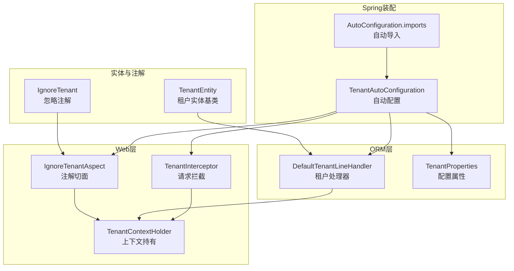
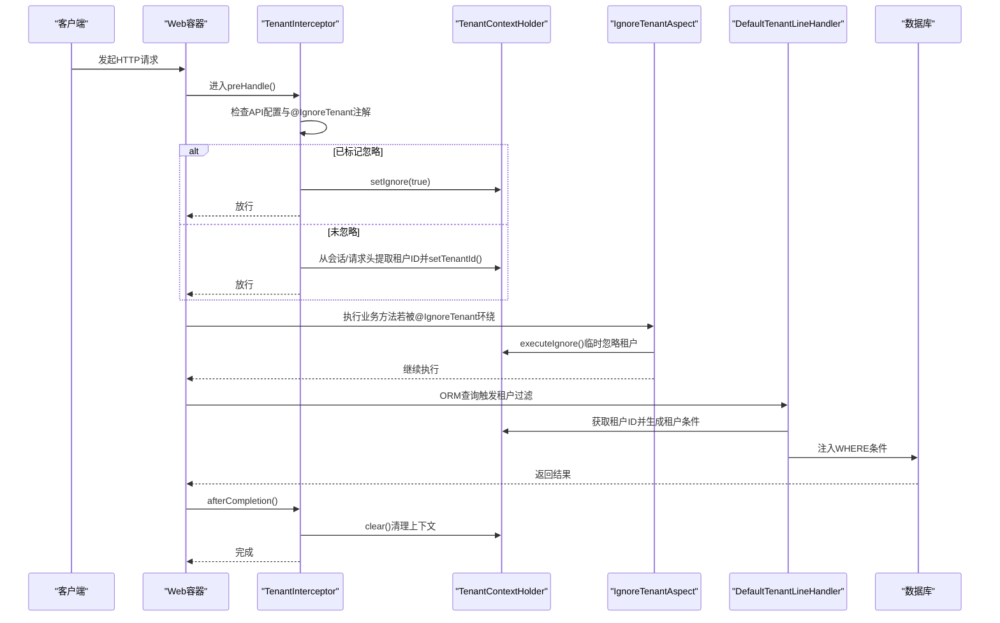
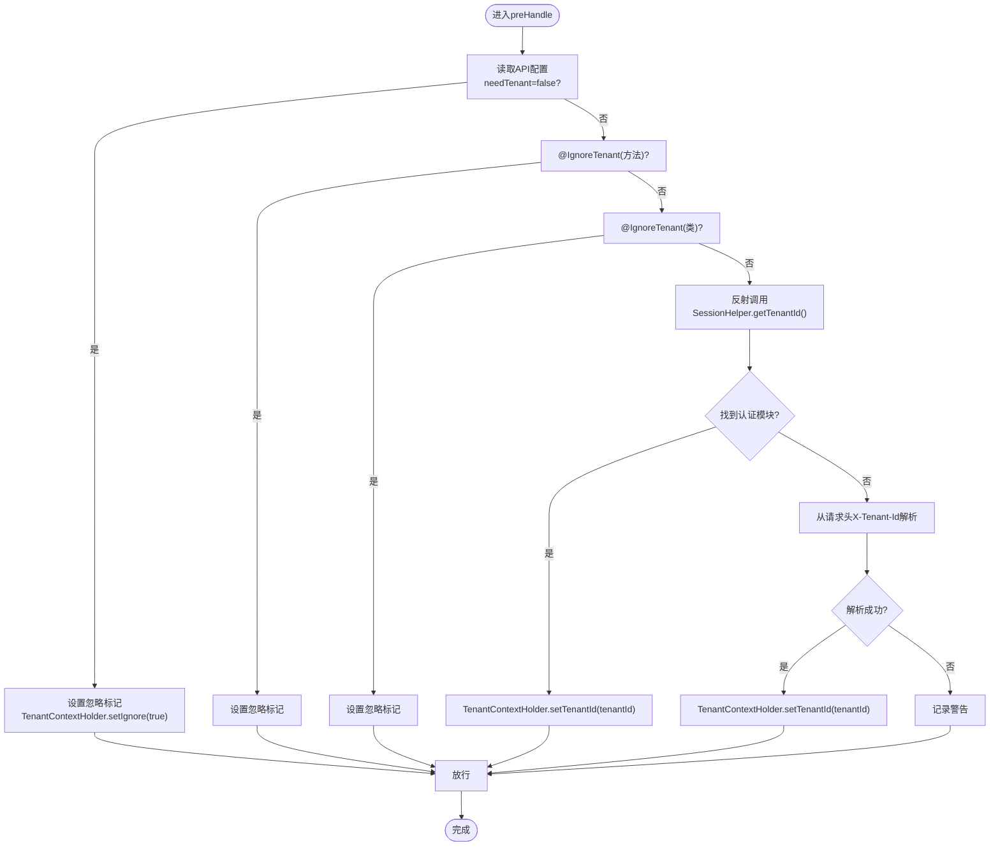
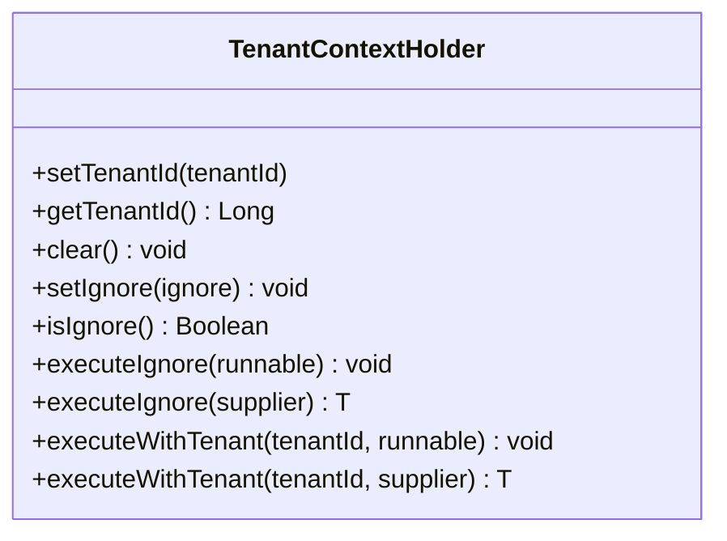
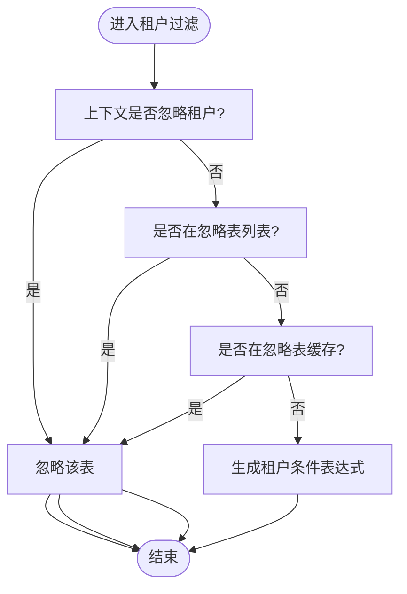
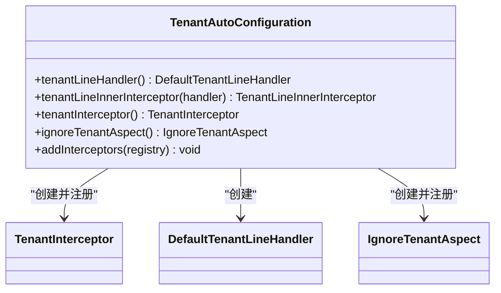
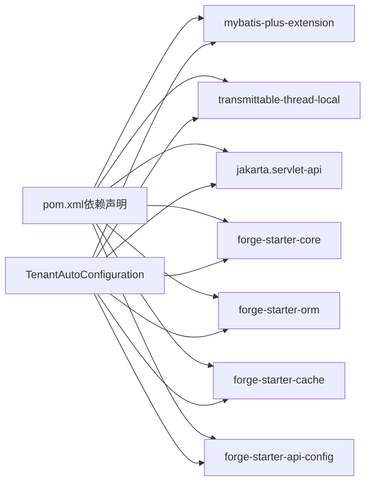

# 租户拦截器

<cite>
**本文引用的文件**
- [TenantInterceptor.java](file://forge/forge-framework/forge-starter-parent/forge-starter-tenant/src/main/java/com/mdframe/forge/starter/tenant/interceptor/TenantInterceptor.java)
- [TenantContextHolder.java](file://forge/forge-framework/forge-starter-parent/forge-starter-tenant/src/main/java/com/mdframe/forge/starter/tenant/context/TenantContextHolder.java)
- [TenantEntity.java](file://forge/forge-framework/forge-starter-parent/forge-starter-tenant/src/main/java/com/mdframe/forge/starter/tenant/core/TenantEntity.java)
- [DefaultTenantLineHandler.java](file://forge/forge-framework/forge-starter-parent/forge-starter-tenant/src/main/java/com/mdframe/forge/starter/tenant/handler/DefaultTenantLineHandler.java)
- [TenantAutoConfiguration.java](file://forge/forge-framework/forge-starter-parent/forge-starter-tenant/src/main/java/com/mdframe/forge/starter/tenant/config/TenantAutoConfiguration.java)
- [TenantProperties.java](file://forge/forge-framework/forge-starter-parent/forge-starter-tenant/src/main/java/com/mdframe/forge/starter/tenant/config/TenantProperties.java)
- [IgnoreTenantAspect.java](file://forge/forge-framework/forge-starter-parent/forge-starter-tenant/src/main/java/com/mdframe/forge/starter/tenant/aspect/IgnoreTenantAspect.java)
- [IgnoreTenant.java](file://forge/forge-framework/forge-starter-parent/forge-starter-core/src/main/java/com/mdframe/forge/starter/core/annotation/tenant/IgnoreTenant.java)
- [org.springframework.boot.autoconfigure.AutoConfiguration.imports](file://forge/forge-framework/forge-starter-parent/forge-starter-tenant/src/main/resources/META-INF/spring/org.springframework.boot.autoconfigure.AutoConfiguration.imports)
- [pom.xml](file://forge/forge-framework/forge-starter-parent/forge-starter-tenant/pom.xml)
</cite>

## 目录
1. [简介](#简介)
2. [项目结构](#项目结构)
3. [核心组件](#核心组件)
4. [架构总览](#架构总览)
5. [详细组件分析](#详细组件分析)
6. [依赖关系分析](#依赖关系分析)
7. [性能考量](#性能考量)
8. [故障排查指南](#故障排查指南)
9. [结论](#结论)
10. [附录](#附录)

## 简介
本技术文档围绕Forge框架的租户拦截器能力展开，系统性阐述TenantInterceptor的拦截机制与实现原理，覆盖请求拦截、租户识别、参数处理与响应清理的完整流程；同时深入解析TenantEntity实体接口的设计理念、租户字段的自动填充与数据持久化机制；并提供拦截器的注册配置、执行顺序控制、异常处理策略与性能监控方法，以及可扩展的自定义方案与调试诊断工具，帮助开发者按需定制租户隔离逻辑。

## 项目结构
租户相关能力主要位于forge-starter-tenant模块，核心文件包括：
- Web层拦截器：TenantInterceptor
- 上下文管理：TenantContextHolder
- ORM层租户处理器：DefaultTenantLineHandler
- 自动装配与注册：TenantAutoConfiguration
- 配置属性：TenantProperties
- 忽略注解与切面：IgnoreTenant、IgnoreTenantAspect
- 实体基类：TenantEntity
- Spring自动导入配置：META-INF/spring/org.springframework.boot.autoconfigure.AutoConfiguration.imports
- 依赖声明：pom.xml

图表来源
- [TenantInterceptor.java](file://forge/forge-framework/forge-starter-parent/forge-starter-tenant/src/main/java/com/mdframe/forge/starter/tenant/interceptor/TenantInterceptor.java#L1-L98)
- [TenantContextHolder.java](file://forge/forge-framework/forge-starter-parent/forge-starter-tenant/src/main/java/com/mdframe/forge/starter/tenant/context/TenantContextHolder.java#L1-L147)
- [DefaultTenantLineHandler.java](file://forge/forge-framework/forge-starter-parent/forge-starter-tenant/src/main/java/com/mdframe/forge/starter/tenant/handler/DefaultTenantLineHandler.java#L1-L88)
- [TenantAutoConfiguration.java](file://forge/forge-framework/forge-starter-parent/forge-starter-tenant/src/main/java/com/mdframe/forge/starter/tenant/config/TenantAutoConfiguration.java#L1-L88)
- [TenantProperties.java](file://forge/forge-framework/forge-starter-parent/forge-starter-tenant/src/main/java/com/mdframe/forge/starter/tenant/config/TenantProperties.java#L1-L67)
- [IgnoreTenantAspect.java](file://forge/forge-framework/forge-starter-parent/forge-starter-tenant/src/main/java/com/mdframe/forge/starter/tenant/aspect/IgnoreTenantAspect.java#L1-L53)
- [IgnoreTenant.java](file://forge/forge-framework/forge-starter-parent/forge-starter-core/src/main/java/com/mdframe/forge/starter/core/annotation/tenant/IgnoreTenant.java#L1-L19)
- [org.springframework.boot.autoconfigure.AutoConfiguration.imports](file://forge/forge-framework/forge-starter-parent/forge-starter-tenant/src/main/resources/META-INF/spring/org.springframework.boot.autoconfigure.AutoConfiguration.imports#L1-L2)

章节来源
- [TenantAutoConfiguration.java](file://forge/forge-framework/forge-starter-parent/forge-starter-tenant/src/main/java/com/mdframe/forge/starter/tenant/config/TenantAutoConfiguration.java#L1-L88)
- [org.springframework.boot.autoconfigure.AutoConfiguration.imports](file://forge/forge-framework/forge-starter-parent/forge-starter-tenant/src/main/resources/META-INF/spring/org.springframework.boot.autoconfigure.AutoConfiguration.imports#L1-L2)

## 核心组件
- TenantInterceptor：基于Spring MVC拦截器，负责在请求进入阶段识别租户上下文，并在完成后清理，确保线程安全与资源释放。
- TenantContextHolder：基于TransmittableThreadLocal的租户上下文持有者，支持异步线程传递，提供忽略租户与指定租户执行的便捷方法。
- DefaultTenantLineHandler：MyBatis-Plus租户处理器，依据上下文与配置动态注入租户条件，支持忽略表与关键字白名单。
- TenantAutoConfiguration：自动装配入口，注册Web拦截器、ORM拦截器与忽略注解切面，控制执行顺序与条件加载。
- TenantProperties：租户配置项，包含开关、租户字段名、忽略表与关键字、严格模式等。
- IgnoreTenantAspect：基于AOP的注解切面，拦截带有@IgnoreTenant的方法，临时忽略租户上下文。
- TenantEntity：实体基类，统一承载tenantId字段，便于ORM映射与持久化。
- IgnoreTenant：可标注在类或方法上，用于声明忽略租户隔离。

章节来源
- [TenantInterceptor.java](file://forge/forge-framework/forge-starter-parent/forge-starter-tenant/src/main/java/com/mdframe/forge/starter/tenant/interceptor/TenantInterceptor.java#L1-L98)
- [TenantContextHolder.java](file://forge/forge-framework/forge-starter-parent/forge-starter-tenant/src/main/java/com/mdframe/forge/starter/tenant/context/TenantContextHolder.java#L1-L147)
- [DefaultTenantLineHandler.java](file://forge/forge-framework/forge-starter-parent/forge-starter-tenant/src/main/java/com/mdframe/forge/starter/tenant/handler/DefaultTenantLineHandler.java#L1-L88)
- [TenantAutoConfiguration.java](file://forge/forge-framework/forge-starter-parent/forge-starter-tenant/src/main/java/com/mdframe/forge/starter/tenant/config/TenantAutoConfiguration.java#L1-L88)
- [TenantProperties.java](file://forge/forge-framework/forge-starter-parent/forge-starter-tenant/src/main/java/com/mdframe/forge/starter/tenant/config/TenantProperties.java#L1-L67)
- [IgnoreTenantAspect.java](file://forge/forge-framework/forge-starter-parent/forge-starter-tenant/src/main/java/com/mdframe/forge/starter/tenant/aspect/IgnoreTenantAspect.java#L1-L53)
- [IgnoreTenant.java](file://forge/forge-framework/forge-starter-parent/forge-starter-core/src/main/java/com/mdframe/forge/starter/core/annotation/tenant/IgnoreTenant.java#L1-L19)
- [TenantEntity.java](file://forge/forge-framework/forge-starter-parent/forge-starter-tenant/src/main/java/com/mdframe/forge/starter/tenant/core/TenantEntity.java#L1-L19)

## 架构总览
租户拦截器体系由“Web层拦截器 + ORM层处理器 + 上下文管理 + 自动装配”构成，形成请求级租户识别与SQL级租户过滤的双层保障。

图表来源
- [TenantInterceptor.java](file://forge/forge-framework/forge-starter-parent/forge-starter-tenant/src/main/java/com/mdframe/forge/starter/tenant/interceptor/TenantInterceptor.java#L26-L96)
- [TenantContextHolder.java](file://forge/forge-framework/forge-starter-parent/forge-starter-tenant/src/main/java/com/mdframe/forge/starter/tenant/context/TenantContextHolder.java#L26-L45)
- [IgnoreTenantAspect.java](file://forge/forge-framework/forge-starter-parent/forge-starter-tenant/src/main/java/com/mdframe/forge/starter/tenant/aspect/IgnoreTenantAspect.java#L28-L51)
- [DefaultTenantLineHandler.java](file://forge/forge-framework/forge-starter-parent/forge-starter-tenant/src/main/java/com/mdframe/forge/starter/tenant/handler/DefaultTenantLineHandler.java#L30-L61)

## 详细组件分析

### TenantInterceptor：请求拦截与上下文设置
- 功能职责
  - 在preHandle阶段检查API配置与@IgnoreTenant注解，决定是否忽略租户。
  - 优先通过认证模块提供的SessionHelper获取租户ID；若不可用则回退至请求头X-Tenant-Id。
  - 在afterCompletion阶段清理上下文，防止线程复用导致的数据泄露。
- 关键点
  - 注解优先级：方法级 > 类级；API配置的needTenant=false时同样忽略租户。
  - 异常处理：对反射调用与请求头解析进行容错，记录警告或错误日志。
  - 与认证模块的依赖：通过反射调用SessionHelper，避免强耦合。
- 典型路径
  - [preHandle主流程](file://forge/forge-framework/forge-starter-parent/forge-starter-tenant/src/main/java/com/mdframe/forge/starter/tenant/interceptor/TenantInterceptor.java#L26-L89)
  - [afterCompletion清理](file://forge/forge-framework/forge-starter-parent/forge-starter-tenant/src/main/java/com/mdframe/forge/starter/tenant/interceptor/TenantInterceptor.java#L91-L96)

图表来源
- [TenantInterceptor.java](file://forge/forge-framework/forge-starter-parent/forge-starter-tenant/src/main/java/com/mdframe/forge/starter/tenant/interceptor/TenantInterceptor.java#L26-L89)

章节来源
- [TenantInterceptor.java](file://forge/forge-framework/forge-starter-parent/forge-starter-tenant/src/main/java/com/mdframe/forge/starter/tenant/interceptor/TenantInterceptor.java#L1-L98)

### TenantContextHolder：上下文管理与异步传递
- 设计要点
  - 基于TransmittableThreadLocal，支持线程池场景下的上下文透传。
  - 提供setTenantId/getTenantId/clear等基础方法。
  - 提供executeIgnore/executeWithTenant等便捷执行上下文切换的工具方法。
- 关键路径
  - [上下文设置与获取](file://forge/forge-framework/forge-starter-parent/forge-starter-tenant/src/main/java/com/mdframe/forge/starter/tenant/context/TenantContextHolder.java#L26-L45)
  - [忽略租户执行](file://forge/forge-framework/forge-starter-parent/forge-starter-tenant/src/main/java/com/mdframe/forge/starter/tenant/context/TenantContextHolder.java#L70-L103)
  - [指定租户执行](file://forge/forge-framework/forge-starter-parent/forge-starter-tenant/src/main/java/com/mdframe/forge/starter/tenant/context/TenantContextHolder.java#L111-L145)

图表来源
- [TenantContextHolder.java](file://forge/forge-framework/forge-starter-parent/forge-starter-tenant/src/main/java/com/mdframe/forge/starter/tenant/context/TenantContextHolder.java#L1-L147)

章节来源
- [TenantContextHolder.java](file://forge/forge-framework/forge-starter-parent/forge-starter-tenant/src/main/java/com/mdframe/forge/starter/tenant/context/TenantContextHolder.java#L1-L147)

### DefaultTenantLineHandler：ORM层租户过滤
- 职责
  - 实现MyBatis-Plus的租户过滤逻辑，自动在SQL中注入租户条件。
  - 结合上下文与配置，判断是否忽略某张表或包含特定关键字的SQL。
- 优化
  - 缓存忽略表集合，减少重复判断开销。
  - 严格模式可通过配置控制无租户ID时的行为。
- 关键路径
  - [获取租户ID表达式](file://forge/forge-framework/forge-starter-parent/forge-starter-tenant/src/main/java/com/mdframe/forge/starter/tenant/handler/DefaultTenantLineHandler.java#L30-L44)
  - [忽略表判定与缓存](file://forge/forge-framework/forge-starter-parent/forge-starter-tenant/src/main/java/com/mdframe/forge/starter/tenant/handler/DefaultTenantLineHandler.java#L46-L86)

图表来源
- [DefaultTenantLineHandler.java](file://forge/forge-framework/forge-starter-parent/forge-starter-tenant/src/main/java/com/mdframe/forge/starter/tenant/handler/DefaultTenantLineHandler.java#L46-L86)

章节来源
- [DefaultTenantLineHandler.java](file://forge/forge-framework/forge-starter-parent/forge-starter-tenant/src/main/java/com/mdframe/forge/starter/tenant/handler/DefaultTenantLineHandler.java#L1-L88)

### TenantAutoConfiguration：自动装配与注册
- 自动装配
  - 条件加载：当配置forge.tenant.enabled=true时启用。
  - 优先级：高于ORM配置，确保在MyBatis-Plus拦截器注册前完成。
- Bean注册
  - DefaultTenantLineHandler：租户处理器。
  - TenantLineInnerInterceptor：ORM层租户拦截器（交由ORM配置统一注册）。
  - TenantInterceptor：Web层拦截器，注册路径/**，优先级低于认证拦截器。
  - IgnoreTenantAspect：注解切面，优先级较高，确保在其他切面之前执行。
- 关键路径
  - [自动配置与Bean定义](file://forge/forge-framework/forge-starter-parent/forge-starter-tenant/src/main/java/com/mdframe/forge/starter/tenant/config/TenantAutoConfiguration.java#L30-L86)

图表来源
- [TenantAutoConfiguration.java](file://forge/forge-framework/forge-starter-parent/forge-starter-tenant/src/main/java/com/mdframe/forge/starter/tenant/config/TenantAutoConfiguration.java#L30-L86)

章节来源
- [TenantAutoConfiguration.java](file://forge/forge-framework/forge-starter-parent/forge-starter-tenant/src/main/java/com/mdframe/forge/starter/tenant/config/TenantAutoConfiguration.java#L1-L88)

### TenantProperties：租户配置
- 主要配置项
  - enabled：是否启用租户功能。
  - column：租户字段名，默认tenant_id。
  - ignoreTables：忽略租户的表名列表（内置默认忽略系统表）。
  - ignoreSqlKeywords：忽略租户的关键字白名单。
  - strictMode：严格模式，无租户ID时是否抛出异常。
- 关键路径
  - [默认忽略表清单](file://forge/forge-framework/forge-starter-parent/forge-starter-tenant/src/main/java/com/mdframe/forge/starter/tenant/config/TenantProperties.java#L45-L65)

章节来源
- [TenantProperties.java](file://forge/forge-framework/forge-starter-parent/forge-starter-tenant/src/main/java/com/mdframe/forge/starter/tenant/config/TenantProperties.java#L1-L67)

### IgnoreTenantAspect：注解切面
- 功能
  - 拦截带有@IgnoreTenant注解的方法，临时设置忽略租户标记后执行目标方法。
  - 保证异常时的日志记录与异常向上抛出。
- 关键路径
  - [环绕通知与执行逻辑](file://forge/forge-framework/forge-starter-parent/forge-starter-tenant/src/main/java/com/mdframe/forge/starter/tenant/aspect/IgnoreTenantAspect.java#L28-L51)

章节来源
- [IgnoreTenantAspect.java](file://forge/forge-framework/forge-starter-parent/forge-starter-tenant/src/main/java/com/mdframe/forge/starter/tenant/aspect/IgnoreTenantAspect.java#L1-L53)

### IgnoreTenant：忽略注解
- 作用域：TYPE（类）与METHOD（方法）。
- 属性value：默认true，表示启用忽略租户。
- 关键路径
  - [注解定义](file://forge/forge-framework/forge-starter-parent/forge-starter-core/src/main/java/com/mdframe/forge/starter/core/annotation/tenant/IgnoreTenant.java#L12-L18)

章节来源
- [IgnoreTenant.java](file://forge/forge-framework/forge-starter-parent/forge-starter-core/src/main/java/com/mdframe/forge/starter/core/annotation/tenant/IgnoreTenant.java#L1-L19)

### TenantEntity：租户实体基类
- 设计理念
  - 统一继承BaseEntity，提供tenantId字段，便于ORM映射与持久化。
  - 简化业务实体对租户字段的重复定义。
- 关键路径
  - [租户字段定义](file://forge/forge-framework/forge-starter-parent/forge-starter-tenant/src/main/java/com/mdframe/forge/starter/tenant/core/TenantEntity.java#L14-L17)

章节来源
- [TenantEntity.java](file://forge/forge-framework/forge-starter-parent/forge-starter-tenant/src/main/java/com/mdframe/forge/starter/tenant/core/TenantEntity.java#L1-L19)

## 依赖关系分析
- Spring Boot自动装配
  - 通过META-INF/spring/org.springframework.boot.autoconfigure.AutoConfiguration.imports声明自动配置类，实现零配置启用。
- 外部依赖
  - MyBatis-Plus扩展：提供租户拦截器能力。
  - TransmittableThreadLocal：支持异步线程上下文传递。
  - Servlet API：Web拦截器运行环境。
  - forge-starter-api-config：用于API配置查询，辅助判断是否需要租户。
- 内部模块
  - forge-starter-core：提供注解与通用能力。
  - 可选依赖：forge-starter-orm、forge-starter-cache等。

图表来源
- [pom.xml](file://forge/forge-framework/forge-starter-parent/forge-starter-tenant/pom.xml#L15-L55)
- [TenantAutoConfiguration.java](file://forge/forge-framework/forge-starter-parent/forge-starter-tenant/src/main/java/com/mdframe/forge/starter/tenant/config/TenantAutoConfiguration.java#L1-L88)

章节来源
- [pom.xml](file://forge/forge-framework/forge-starter-parent/forge-starter-tenant/pom.xml#L1-L59)
- [org.springframework.boot.autoconfigure.AutoConfiguration.imports](file://forge/forge-framework/forge-starter-parent/forge-starter-tenant/src/main/resources/META-INF/spring/org.springframework.boot.autoconfigure.AutoConfiguration.imports#L1-L2)

## 性能考量
- 上下文传递成本
  - 使用TransmittableThreadLocal避免线程池场景下的上下文丢失，但需注意线程复用带来的潜在开销。
- SQL过滤缓存
  - DefaultTenantLineHandler对忽略表采用缓存，减少重复判断；建议合理配置ignoreTables，避免频繁变更导致缓存失效。
- 注解与反射
  - TenantInterceptor通过反射访问SessionHelper，存在少量反射开销；建议在有认证模块时优先使用会话方式，减少请求头解析。
- 执行顺序
  - Web拦截器优先级低于认证拦截器，确保租户ID在认证后可用；注解切面优先级较高，避免被其他切面覆盖忽略行为。

## 故障排查指南
- 现象：无租户ID，SQL未生效
  - 检查TenantContextHolder是否正确设置租户ID；确认TenantInterceptor是否被正确注册且执行顺序正确。
  - 若strictMode=false，系统仅记录警告；可调整为true以强制异常。
  - 参考路径：[租户ID为空处理](file://forge/forge-framework/forge-starter-parent/forge-starter-tenant/src/main/java/com/mdframe/forge/starter/tenant/handler/DefaultTenantLineHandler.java#L30-L44)
- 现象：方法未按预期忽略租户
  - 确认@IgnoreTenant注解是否正确标注在方法或类上；检查IgnoreTenantAspect是否生效。
  - 参考路径：[注解切面逻辑](file://forge/forge-framework/forge-starter-parent/forge-starter-tenant/src/main/java/com/mdframe/forge/starter/tenant/aspect/IgnoreTenantAspect.java#L28-L51)
- 现象：请求头X-Tenant-Id无效
  - 检查请求头格式是否为整数；确认TenantInterceptor的请求头解析分支是否被触发。
  - 参考路径：[请求头解析](file://forge/forge-framework/forge-starter-parent/forge-starter-tenant/src/main/java/com/mdframe/forge/starter/tenant/interceptor/TenantInterceptor.java#L74-L83)
- 现象：线程池场景上下文丢失
  - 确认使用TransmittableThreadLocal封装的上下文方法（如executeIgnore/executeWithTenant）。
  - 参考路径：[上下文工具方法](file://forge/forge-framework/forge-starter-parent/forge-starter-tenant/src/main/java/com/mdframe/forge/starter/tenant/context/TenantContextHolder.java#L70-L145)

章节来源
- [DefaultTenantLineHandler.java](file://forge/forge-framework/forge-starter-parent/forge-starter-tenant/src/main/java/com/mdframe/forge/starter/tenant/handler/DefaultTenantLineHandler.java#L30-L44)
- [IgnoreTenantAspect.java](file://forge/forge-framework/forge-starter-parent/forge-starter-tenant/src/main/java/com/mdframe/forge/starter/tenant/aspect/IgnoreTenantAspect.java#L28-L51)
- [TenantInterceptor.java](file://forge/forge-framework/forge-starter-parent/forge-starter-tenant/src/main/java/com/mdframe/forge/starter/tenant/interceptor/TenantInterceptor.java#L74-L83)
- [TenantContextHolder.java](file://forge/forge-framework/forge-starter-parent/forge-starter-tenant/src/main/java/com/mdframe/forge/starter/tenant/context/TenantContextHolder.java#L70-L145)

## 结论
Forge框架的租户拦截器通过“Web层拦截器 + ORM层处理器 + 上下文管理 + 自动装配”的协同设计，实现了请求级租户识别与SQL级租户过滤的闭环。其具备良好的可扩展性与性能表现，结合注解与配置可灵活适配不同业务场景；通过清晰的异常处理与调试工具，能够快速定位与解决问题。

## 附录
- 配置示例（描述性）
  - 启用租户：设置forge.tenant.enabled=true。
  - 自定义租户字段：forge.tenant.column=your_tenant_field。
  - 忽略表配置：forge.tenant.ignore-tables[0]=table_a。
  - 严格模式：forge.tenant.strict-mode=true。
- 扩展建议
  - 自定义租户识别源：可在TenantInterceptor中扩展新的识别策略（如Cookie、Token解析）。
  - 自定义ORM处理器：继承DefaultTenantLineHandler并重写ignoreTable策略。
  - 自定义上下文：通过TenantContextHolder扩展更多执行上下文切换方法。
- 调试建议
  - 开启DEBUG日志观察租户上下文设置与清理过程。
  - 使用executeIgnore/executeWithTenant进行局部上下文验证。
  - 对关键SQL开启MyBatis-Plus日志，核对租户条件注入情况。