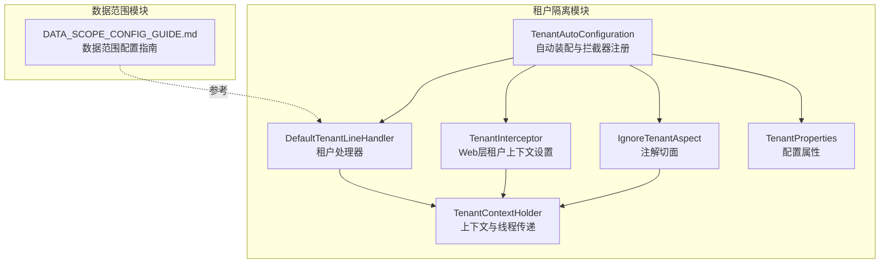
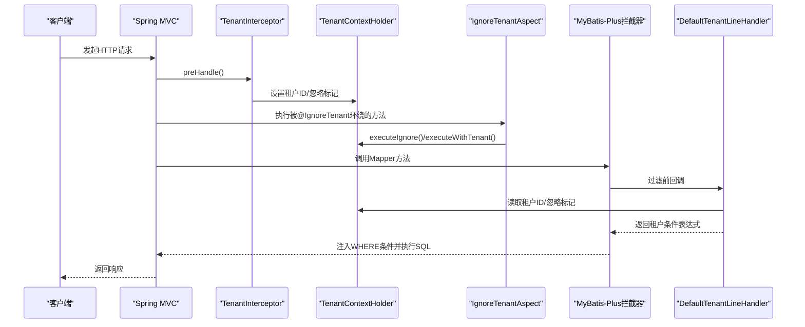
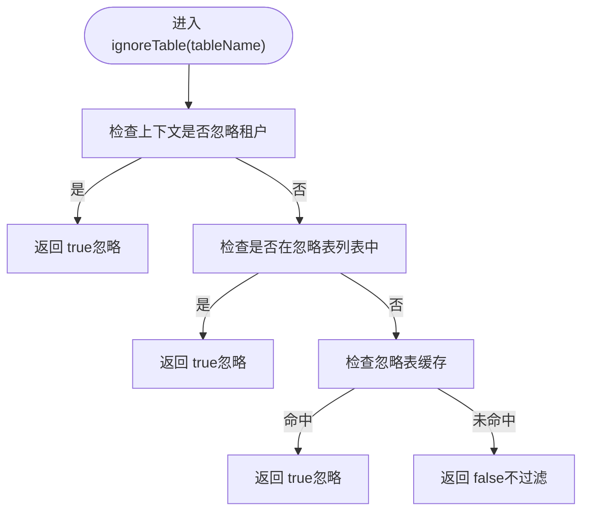
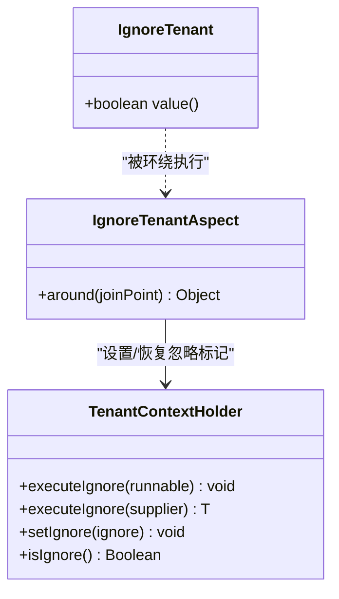
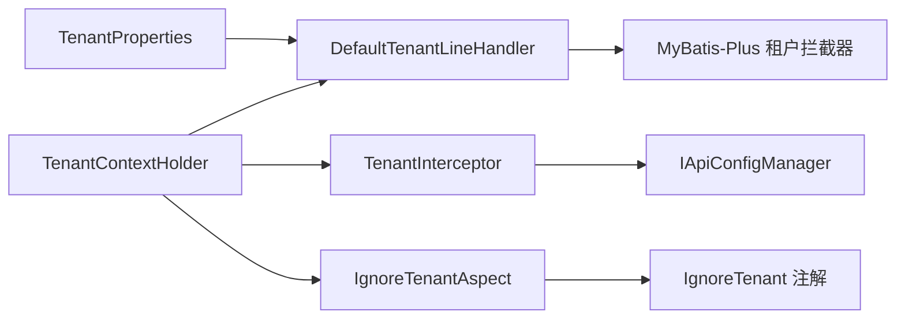

# 租户数据隔离

<cite>
**本文引用的文件**
- [TenantAutoConfiguration.java](file://forge/forge-framework/forge-starter-parent/forge-starter-tenant/src/main/java/com/mdframe/forge/starter/tenant/config/TenantAutoConfiguration.java)
- [DefaultTenantLineHandler.java](file://forge/forge-framework/forge-starter-parent/forge-starter-tenant/src/main/java/com/mdframe/forge/starter/tenant/handler/DefaultTenantLineHandler.java)
- [IgnoreTenantAspect.java](file://forge/forge-framework/forge-starter-parent/forge-starter-tenant/src/main/java/com/mdframe/forge/starter/tenant/aspect/IgnoreTenantAspect.java)
- [TenantContextHolder.java](file://forge/forge-framework/forge-starter-parent/forge-starter-tenant/src/main/java/com/mdframe/forge/starter/tenant/context/TenantContextHolder.java)
- [TenantProperties.java](file://forge/forge-framework/forge-starter-parent/forge-starter-tenant/src/main/java/com/mdframe/forge/starter/tenant/config/TenantProperties.java)
- [TenantInterceptor.java](file://forge/forge-framework/forge-starter-parent/forge-starter-tenant/src/main/java/com/mdframe/forge/starter/tenant/interceptor/TenantInterceptor.java)
- [IgnoreTenant.java](file://forge/forge-framework/forge-starter-parent/forge-starter-core/src/main/java/com/mdframe/forge/starter/core/annotation/tenant/IgnoreTenant.java)
- [DATA_SCOPE_CONFIG_GUIDE.md](file://forge/forge-framework/forge-starter-parent/forge-starter-datascope/DATA_SCOPE_CONFIG_GUIDE.md)
</cite>

## 目录
1. [简介](#简介)
2. [项目结构](#项目结构)
3. [核心组件](#核心组件)
4. [架构总览](#架构总览)
5. [组件详解](#组件详解)
6. [依赖关系分析](#依赖关系分析)
7. [性能与安全](#性能与安全)
8. [故障排查](#故障排查)
9. [结论](#结论)
10. [附录](#附录)

## 简介
本技术文档围绕Forge框架的租户数据隔离能力，系统阐述多租户的核心机制与实现策略，重点覆盖以下方面：
- DefaultTenantLineHandler的数据过滤逻辑、SQL自动注入与条件拼接
- IgnoreTenant注解的使用场景与IgnoreTenantAspect切面的实现原理
- 租户字段的自动识别机制与跨租户查询处理策略
- 数据范围控制的配置方法、SQL注入防护与性能优化技巧
- 完整配置示例、常见问题与调试技巧

## 项目结构
租户数据隔离能力主要集中在“forge-starter-tenant”模块，配合“forge-starter-datascope”模块实现更细粒度的数据范围控制。关键文件分布如下：
- 自动装配与拦截器注册：TenantAutoConfiguration
- 租户上下文与线程传递：TenantContextHolder
- 租户处理器与表/SQL忽略策略：DefaultTenantLineHandler
- Web层租户上下文设置：TenantInterceptor
- 忽略租户注解与切面：IgnoreTenant、IgnoreTenantAspect
- 配置属性：TenantProperties
- 数据范围配置参考：DATA_SCOPE_CONFIG_GUIDE.md

图表来源
- [TenantAutoConfiguration.java](file://forge/forge-framework/forge-starter-parent/forge-starter-tenant/src/main/java/com/mdframe/forge/starter/tenant/config/TenantAutoConfiguration.java#L20-L87)
- [DefaultTenantLineHandler.java](file://forge/forge-framework/forge-starter-parent/forge-starter-tenant/src/main/java/com/mdframe/forge/starter/tenant/handler/DefaultTenantLineHandler.java#L15-L87)
- [TenantInterceptor.java](file://forge/forge-framework/forge-starter-parent/forge-starter-tenant/src/main/java/com/mdframe/forge/starter/tenant/interceptor/TenantInterceptor.java#L18-L98)
- [IgnoreTenantAspect.java](file://forge/forge-framework/forge-starter-parent/forge-starter-tenant/src/main/java/com/mdframe/forge/starter/tenant/aspect/IgnoreTenantAspect.java#L15-L53)
- [TenantContextHolder.java](file://forge/forge-framework/forge-starter-parent/forge-starter-tenant/src/main/java/com/mdframe/forge/starter/tenant/context/TenantContextHolder.java#L1-L147)
- [TenantProperties.java](file://forge/forge-framework/forge-starter-parent/forge-starter-tenant/src/main/java/com/mdframe/forge/starter/tenant/config/TenantProperties.java#L1-L67)
- [DATA_SCOPE_CONFIG_GUIDE.md](file://forge/forge-framework/forge-starter-parent/forge-starter-datascope/DATA_SCOPE_CONFIG_GUIDE.md#L1-L291)

章节来源
- [TenantAutoConfiguration.java](file://forge/forge-framework/forge-starter-parent/forge-starter-tenant/src/main/java/com/mdframe/forge/starter/tenant/config/TenantAutoConfiguration.java#L20-L87)
- [TenantProperties.java](file://forge/forge-framework/forge-starter-parent/forge-starter-tenant/src/main/java/com/mdframe/forge/starter/tenant/config/TenantProperties.java#L1-L67)

## 核心组件
- 自动装配与拦截器注册：TenantAutoConfiguration负责按需创建租户处理器、Web拦截器与切面，并注册Web拦截器，确保在认证拦截器之后执行。
- 租户上下文：TenantContextHolder基于TransmittableThreadLocal实现租户ID与“忽略租户”标记的线程安全传递，支持异步场景。
- 租户处理器：DefaultTenantLineHandler实现租户过滤的核心逻辑，包括租户ID表达式生成、租户字段名获取、表级忽略策略与缓存优化。
- Web拦截器：TenantInterceptor从会话或请求头提取租户ID，设置到上下文；同时支持API配置与注解级别的“忽略租户”标记。
- 忽略租户注解与切面：IgnoreTenant注解用于方法/类级别声明忽略租户；IgnoreTenantAspect在方法执行前后设置/恢复上下文的“忽略租户”状态。
- 配置属性：TenantProperties集中管理租户开关、租户字段名、忽略表列表、忽略SQL关键字、严格模式等。

章节来源
- [TenantAutoConfiguration.java](file://forge/forge-framework/forge-starter-parent/forge-starter-tenant/src/main/java/com/mdframe/forge/starter/tenant/config/TenantAutoConfiguration.java#L20-L87)
- [TenantContextHolder.java](file://forge/forge-framework/forge-starter-parent/forge-starter-tenant/src/main/java/com/mdframe/forge/starter/tenant/context/TenantContextHolder.java#L1-L147)
- [DefaultTenantLineHandler.java](file://forge/forge-framework/forge-starter-parent/forge-starter-tenant/src/main/java/com/mdframe/forge/starter/tenant/handler/DefaultTenantLineHandler.java#L15-L87)
- [TenantInterceptor.java](file://forge/forge-framework/forge-starter-parent/forge-starter-tenant/src/main/java/com/mdframe/forge/starter/tenant/interceptor/TenantInterceptor.java#L18-L98)
- [IgnoreTenantAspect.java](file://forge/forge-framework/forge-starter-parent/forge-starter-tenant/src/main/java/com/mdframe/forge/starter/tenant/aspect/IgnoreTenantAspect.java#L15-L53)
- [IgnoreTenant.java](file://forge/forge-framework/forge-starter-parent/forge-starter-core/src/main/java/com/mdframe/forge/starter/core/annotation/tenant/IgnoreTenant.java#L1-L19)
- [TenantProperties.java](file://forge/forge-framework/forge-starter-parent/forge-starter-tenant/src/main/java/com/mdframe/forge/starter/tenant/config/TenantProperties.java#L1-L67)

## 架构总览
租户数据隔离的整体工作流如下：
- Web请求进入TenantInterceptor，依据API配置与注解决定是否忽略租户，并设置租户ID到上下文。
- MyBatis拦截链在执行SQL前调用DefaultTenantLineHandler，根据上下文与配置生成租户条件并注入WHERE子句。
- IgnoreTenantAspect在方法执行前后切换上下文的“忽略租户”标志，实现局部跨租户访问。

图表来源
- [TenantInterceptor.java](file://forge/forge-framework/forge-starter-parent/forge-starter-tenant/src/main/java/com/mdframe/forge/starter/tenant/interceptor/TenantInterceptor.java#L26-L98)
- [TenantContextHolder.java](file://forge/forge-framework/forge-starter-parent/forge-starter-tenant/src/main/java/com/mdframe/forge/starter/tenant/context/TenantContextHolder.java#L65-L103)
- [IgnoreTenantAspect.java](file://forge/forge-framework/forge-starter-parent/forge-starter-tenant/src/main/java/com/mdframe/forge/starter/tenant/aspect/IgnoreTenantAspect.java#L28-L51)
- [DefaultTenantLineHandler.java](file://forge/forge-framework/forge-starter-parent/forge-starter-tenant/src/main/java/com/mdframe/forge/starter/tenant/handler/DefaultTenantLineHandler.java#L30-L61)

## 组件详解

### DefaultTenantLineHandler：数据过滤与SQL注入
- 租户ID表达式生成：从TenantContextHolder读取租户ID，若为空则返回NULL值，避免误过滤或可选地结合严格模式处理。
- 租户字段名：来自TenantProperties.column，默认“tenant_id”。
- 表级忽略策略：优先检查上下文忽略标记；其次检查TenantProperties.ignoreTables；最后使用Set缓存加速判断。
- 缓存优化：对忽略表集合使用HashSet缓存，减少重复判断开销。
- 可扩展接口：提供add/remove/clear接口维护忽略表缓存。

图表来源
- [DefaultTenantLineHandler.java](file://forge/forge-framework/forge-starter-parent/forge-starter-tenant/src/main/java/com/mdframe/forge/starter/tenant/handler/DefaultTenantLineHandler.java#L46-L86)

章节来源
- [DefaultTenantLineHandler.java](file://forge/forge-framework/forge-starter-parent/forge-starter-tenant/src/main/java/com/mdframe/forge/starter/tenant/handler/DefaultTenantLineHandler.java#L15-L87)
- [TenantProperties.java](file://forge/forge-framework/forge-starter-parent/forge-starter-tenant/src/main/java/com/mdframe/forge/starter/tenant/config/TenantProperties.java#L21-L36)
- [TenantContextHolder.java](file://forge/forge-framework/forge-starter-parent/forge-starter-tenant/src/main/java/com/mdframe/forge/starter/tenant/context/TenantContextHolder.java#L1-L147)

### IgnoreTenant注解与IgnoreTenantAspect：跨租户访问控制
- 注解定义：IgnoreTenant支持标注在类或方法上，默认value=true表示忽略租户。
- 切面实现：Around通知拦截带注解的方法，调用TenantContextHolder.executeIgnore()临时设置忽略标记，执行完毕后恢复原状态。
- 适用场景：系统级操作、后台运维、报表统计等需要跨租户读取数据的场景。

图表来源
- [IgnoreTenant.java](file://forge/forge-framework/forge-starter-parent/forge-starter-core/src/main/java/com/mdframe/forge/starter/core/annotation/tenant/IgnoreTenant.java#L1-L19)
- [IgnoreTenantAspect.java](file://forge/forge-framework/forge-starter-parent/forge-starter-tenant/src/main/java/com/mdframe/forge/starter/tenant/aspect/IgnoreTenantAspect.java#L15-L53)
- [TenantContextHolder.java](file://forge/forge-framework/forge-starter-parent/forge-starter-tenant/src/main/java/com/mdframe/forge/starter/tenant/context/TenantContextHolder.java#L65-L103)

章节来源
- [IgnoreTenant.java](file://forge/forge-framework/forge-starter-parent/forge-starter-core/src/main/java/com/mdframe/forge/starter/core/annotation/tenant/IgnoreTenant.java#L1-L19)
- [IgnoreTenantAspect.java](file://forge/forge-framework/forge-starter-parent/forge-starter-tenant/src/main/java/com/mdframe/forge/starter/tenant/aspect/IgnoreTenantAspect.java#L15-L53)
- [TenantContextHolder.java](file://forge/forge-framework/forge-starter-parent/forge-starter-tenant/src/main/java/com/mdframe/forge/starter/tenant/context/TenantContextHolder.java#L65-L103)

### TenantInterceptor：Web层租户上下文设置
- API配置联动：通过IApiConfigManager读取API配置，若API明确不需要租户，则设置忽略标记。
- 注解优先：方法或类上存在@IgnoreTenant且value为true时，设置忽略标记并放行。
- 会话与请求头：优先反射调用SessionHelper获取租户ID；若未引入认证模块，则回退从请求头“X-Tenant-Id”解析。
- 生命周期清理：afterCompletion中清除上下文，防止内存泄漏。

章节来源
- [TenantInterceptor.java](file://forge/forge-framework/forge-starter-parent/forge-starter-tenant/src/main/java/com/mdframe/forge/starter/tenant/interceptor/TenantInterceptor.java#L18-L98)

### TenantAutoConfiguration：自动装配与拦截器注册
- 条件装配：当配置项forge.tenant.enabled为true时启用。
- Bean创建：默认租户处理器、Web拦截器、注解切面均按需创建。
- 注册顺序：Web拦截器注册优先级在认证拦截器之后，确保租户ID在拦截器执行时可用。

章节来源
- [TenantAutoConfiguration.java](file://forge/forge-framework/forge-starter-parent/forge-starter-tenant/src/main/java/com/mdframe/forge/starter/tenant/config/TenantAutoConfiguration.java#L20-L87)

### TenantProperties：租户配置
- enabled：是否启用租户隔离，默认true。
- column：租户字段名，默认“tenant_id”。
- ignoreTables：默认忽略表清单，覆盖系统配置、作业、生成器、ID序列等常用表。
- ignoreSqlKeywords：忽略包含特定关键字的SQL（如DDL、事务控制等）。
- strictMode：严格模式，未设置租户ID时的行为策略（可扩展为抛异常）。

章节来源
- [TenantProperties.java](file://forge/forge-framework/forge-starter-parent/forge-starter-tenant/src/main/java/com/mdframe/forge/starter/tenant/config/TenantProperties.java#L1-L67)

### TenantContextHolder：上下文与线程传递
- 租户ID与忽略标记均使用TransmittableThreadLocal存储，支持线程池场景下的上下文透传。
- 提供executeIgnore与executeWithTenant工具方法，保证在执行期间正确设置/恢复上下文。

章节来源
- [TenantContextHolder.java](file://forge/forge-framework/forge-starter-parent/forge-starter-tenant/src/main/java/com/mdframe/forge/starter/tenant/context/TenantContextHolder.java#L1-L147)

### 数据范围控制参考：DATA_SCOPE_CONFIG_GUIDE.md
- 与租户隔离协同：在数据范围模块中，可通过配置实现用户ID、组织ID与租户ID的组合条件，形成更细粒度的数据访问控制。
- 配置要点：资源编码、Mapper方法、表别名、字段配置（简单/复杂SQL模式）、启用状态等。
- 复杂SQL模式：支持以<sql>开头的复杂条件，使用#{userId}、#{tenantId}、#{orgIds}等占位符。

章节来源
- [DATA_SCOPE_CONFIG_GUIDE.md](file://forge/forge-framework/forge-starter-parent/forge-starter-datascope/DATA_SCOPE_CONFIG_GUIDE.md#L1-L291)

## 依赖关系分析
- 组件耦合与内聚
  - DefaultTenantLineHandler与TenantProperties高度内聚，职责单一：生成租户条件与表级忽略策略。
  - TenantInterceptor与API配置管理器耦合，用于动态控制是否应用租户过滤。
  - IgnoreTenantAspect与TenantContextHolder协作，实现方法级跨租户访问。
- 外部依赖
  - MyBatis-Plus租户拦截器接口：DefaultTenantLineHandler实现其接口以注入租户条件。
  - Spring MVC拦截器：TenantInterceptor实现HandlerInterceptor，接入Web层。
  - Spring AOP：IgnoreTenantAspect基于注解的Around通知实现方法级控制。
- 潜在循环依赖
  - 当前模块无明显循环依赖；注意在自定义扩展时避免反向依赖认证模块。

图表来源
- [DefaultTenantLineHandler.java](file://forge/forge-framework/forge-starter-parent/forge-starter-tenant/src/main/java/com/mdframe/forge/starter/tenant/handler/DefaultTenantLineHandler.java#L15-L87)
- [TenantInterceptor.java](file://forge/forge-framework/forge-starter-parent/forge-starter-tenant/src/main/java/com/mdframe/forge/starter/tenant/interceptor/TenantInterceptor.java#L18-L98)
- [IgnoreTenantAspect.java](file://forge/forge-framework/forge-starter-parent/forge-starter-tenant/src/main/java/com/mdframe/forge/starter/tenant/aspect/IgnoreTenantAspect.java#L15-L53)
- [TenantProperties.java](file://forge/forge-framework/forge-starter-parent/forge-starter-tenant/src/main/java/com/mdframe/forge/starter/tenant/config/TenantProperties.java#L1-L67)

## 性能与安全
- 性能优化
  - 表级忽略缓存：DefaultTenantLineHandler内部使用HashSet缓存忽略表，降低重复判断成本。
  - 配置默认忽略表：TenantProperties默认忽略系统表，减少不必要的过滤开销。
  - 线程本地存储：TenantContextHolder使用TransmittableThreadLocal，避免共享状态竞争。
- 安全防护
  - SQL注入防护：租户条件通过表达式对象注入，避免字符串拼接；建议配合白名单/参数化查询进一步加固。
  - 严格模式：可通过扩展strictMode实现未设置租户ID时抛异常，避免误过滤或越权。
  - 跨租户访问控制：仅在必要场景使用@IgnoreTenant与IgnoreTenantAspect，避免扩大权限面。

[本节为通用指导，不直接分析具体文件]

## 故障排查
- 现象：查询结果为空或越权访问
  - 排查点：确认租户ID是否正确设置（会话/请求头/X-Tenant-Id），检查API配置是否要求租户过滤。
  - 参考：TenantInterceptor预处理逻辑与TenantProperties默认忽略表。
- 现象：跨租户查询无效
  - 排查点：确认方法/类是否标注@IgnoreTenant且value为true；检查IgnoreTenantAspect是否生效。
- 现象：性能下降
  - 排查点：检查忽略表缓存是否命中；评估是否新增了大量忽略表；核对SQL关键字是否触发忽略。
- 现象：注解无效
  - 排查点：确认AOP代理生效；检查注解导入路径与编译打包是否包含注解定义。

章节来源
- [TenantInterceptor.java](file://forge/forge-framework/forge-starter-parent/forge-starter-tenant/src/main/java/com/mdframe/forge/starter/tenant/interceptor/TenantInterceptor.java#L26-L98)
- [IgnoreTenantAspect.java](file://forge/forge-framework/forge-starter-parent/forge-starter-tenant/src/main/java/com/mdframe/forge/starter/tenant/aspect/IgnoreTenantAspect.java#L28-L51)
- [DefaultTenantLineHandler.java](file://forge/forge-framework/forge-starter-parent/forge-starter-tenant/src/main/java/com/mdframe/forge/starter/tenant/handler/DefaultTenantLineHandler.java#L46-L86)
- [TenantProperties.java](file://forge/forge-framework/forge-starter-parent/forge-starter-tenant/src/main/java/com/mdframe/forge/starter/tenant/config/TenantProperties.java#L21-L36)

## 结论
Forge框架的租户数据隔离通过“Web层上下文设置 + MyBatis-Plus租户拦截 + 注解切面控制”的组合，实现了灵活、可配置、可扩展的数据隔离能力。DefaultTenantLineHandler承担核心过滤逻辑，TenantInterceptor与IgnoreTenantAspect分别负责运行时上下文与方法级跨租户控制，TenantProperties提供统一配置入口。结合数据范围模块的配置能力，可构建覆盖用户、组织、租户的多维数据权限体系。

[本节为总结性内容，不直接分析具体文件]

## 附录

### 配置示例与最佳实践
- 启用租户隔离
  - 在配置文件中设置forge.tenant.enabled=true（默认即为true）。
- 自定义租户字段
  - 设置forge.tenant.column为实际租户字段名。
- 忽略特定表
  - 在forge.tenant.ignore-tables中追加表名，避免对系统表施加租户过滤。
- 忽略SQL关键字
  - 在forge.tenant.ignore-sql-keywords中配置关键字，使匹配SQL不注入租户条件。
- 严格模式
  - 将forge.tenant.strict-mode设为true，未设置租户ID时抛异常（需扩展实现）。
- API级控制
  - 通过API配置管理器设置某接口不需要租户过滤，TenantInterceptor将自动设置忽略标记。
- 方法级跨租户
  - 在业务方法或类上标注@IgnoreTenant(value=true)，配合IgnoreTenantAspect实现局部跨租户访问。

章节来源
- [TenantProperties.java](file://forge/forge-framework/forge-starter-parent/forge-starter-tenant/src/main/java/com/mdframe/forge/starter/tenant/config/TenantProperties.java#L1-L67)
- [TenantInterceptor.java](file://forge/forge-framework/forge-starter-parent/forge-starter-tenant/src/main/java/com/mdframe/forge/starter/tenant/interceptor/TenantInterceptor.java#L26-L98)
- [IgnoreTenant.java](file://forge/forge-framework/forge-starter-parent/forge-starter-core/src/main/java/com/mdframe/forge/starter/core/annotation/tenant/IgnoreTenant.java#L1-L19)
- [IgnoreTenantAspect.java](file://forge/forge-framework/forge-starter-parent/forge-starter-tenant/src/main/java/com/mdframe/forge/starter/tenant/aspect/IgnoreTenantAspect.java#L28-L51)