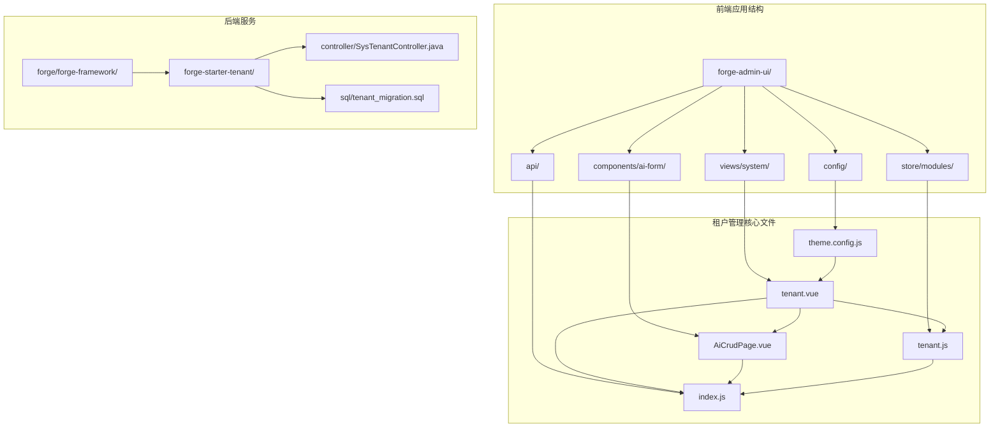
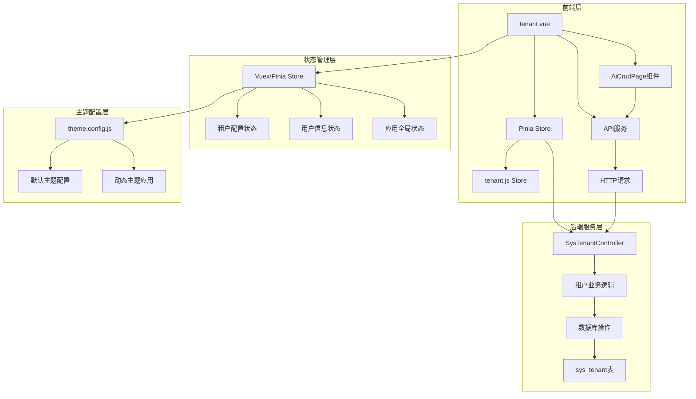
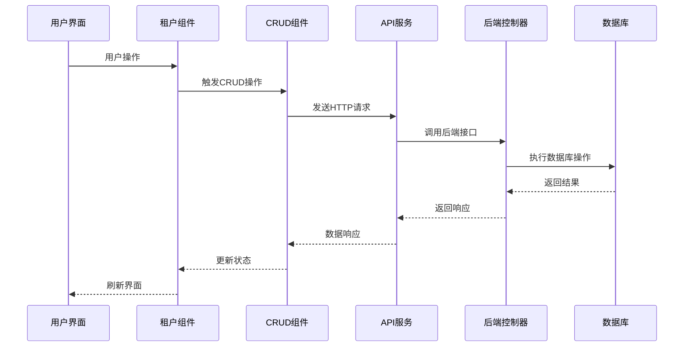
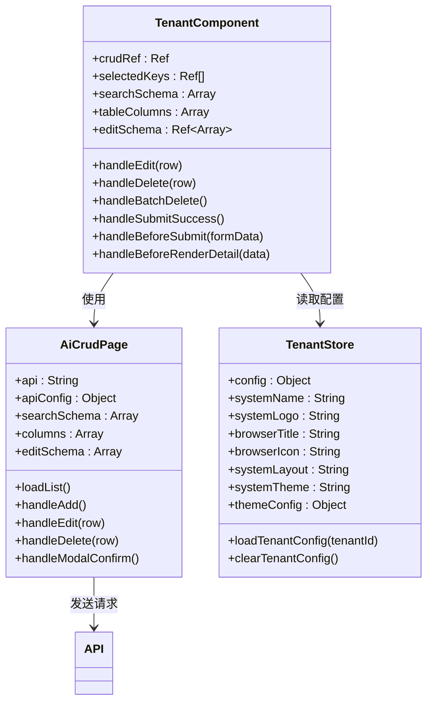
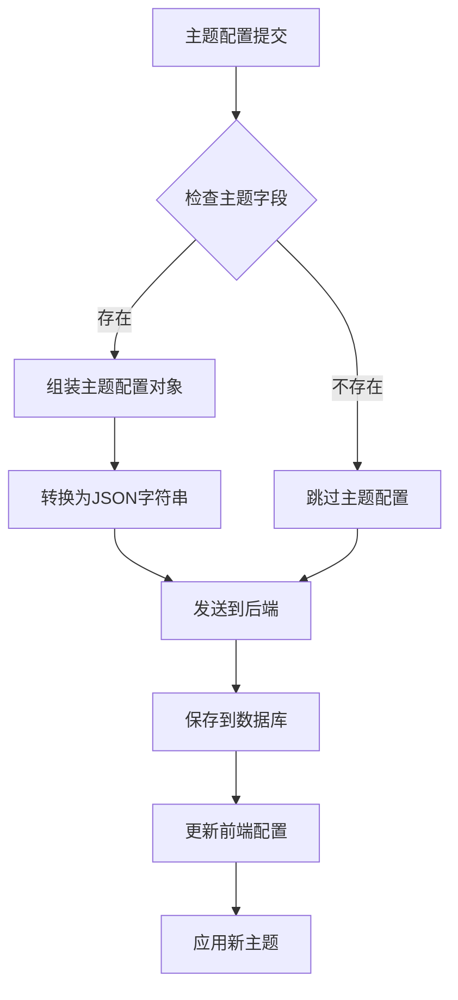
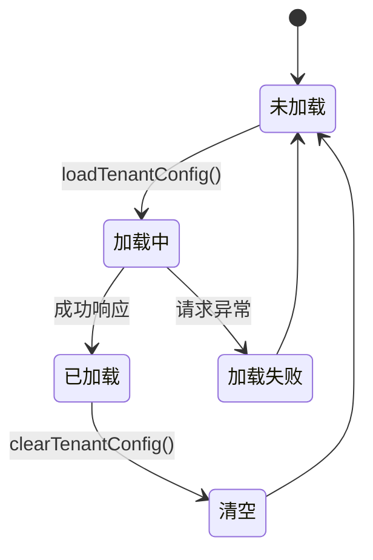
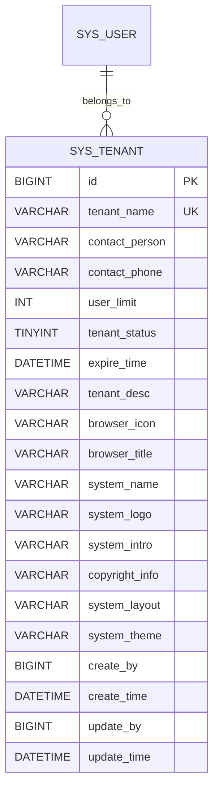
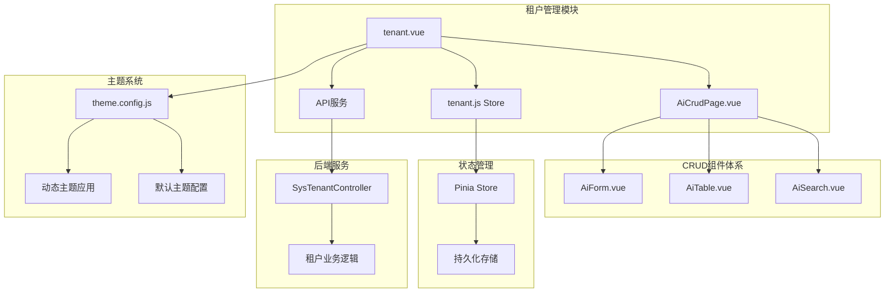

# 租户界面管理

<cite>
**本文档引用的文件**
- [tenant.vue](file://forge-admin-ui/src/views/system/tenant.vue)
- [tenant.js](file://forge-admin-ui/src/store/modules/tenant.js)
- [AiCrudPage.vue](file://forge-admin-ui/src/components/ai-form/AiCrudPage.vue)
- [AiCrudPageProps.js](file://forge-admin-ui/src/components/ai-form/AiCrudPageProps.js)
- [index.js](file://forge-admin-ui/src/api/index.js)
- [theme.config.js](file://forge-admin-ui/src/config/theme.config.js)
- [SysTenantController.java](file://forge/forge-framework/forge-starter-parent/forge-starter-tenant/src/main/java/com/mdframe/forge/plugin/system/controller/SysTenantController.java)
- [tenant_migration.sql](file://forge/forge-framework/forge-starter-parent/forge-starter-tenant/src/main/java/com/mdframe/forge/starter/tenant/config/TenantProperties.java)
- [tenant_migration.sql](file://forge/forge-framework/forge-starter-parent/forge-starter-tenant/src/main/resources/sql/tenant_migration.sql)
- [tenant.js](file://forge-admin-ui/src/store/modules/tenant.js)
</cite>

## 目录
1. [简介](#简介)
2. [项目结构](#项目结构)
3. [核心组件](#核心组件)
4. [架构概览](#架构概览)
5. [详细组件分析](#详细组件分析)
6. [依赖关系分析](#依赖关系分析)
7. [性能考虑](#性能考虑)
8. [故障排除指南](#故障排除指南)
9. [结论](#结论)

## 简介

Forge框架的租户界面管理功能是一个基于Vue 3和Naive UI的企业级管理系统，专门用于管理多租户环境下的租户配置。该功能提供了完整的CRUD操作、数据表格展示、搜索过滤、分页处理、表单验证、批量操作、主题配置和权限控制等特性。

系统采用现代化的前端架构，结合了Pinia状态管理、Axios HTTP客户端、自定义CRUD组件和企业级主题配置系统，为企业用户提供了一套完整的租户管理解决方案。

## 项目结构

Forge项目的租户管理功能主要分布在以下几个关键目录中：

**图表来源**
- [tenant.vue](file://forge-admin-ui/src/views/system/tenant.vue#L1-L802)
- [AiCrudPage.vue](file://forge-admin-ui/src/components/ai-form/AiCrudPage.vue#L1-L1380)
- [tenant.js](file://forge-admin-ui/src/store/modules/tenant.js#L1-L83)

**章节来源**
- [tenant.vue](file://forge-admin-ui/src/views/system/tenant.vue#L1-L802)
- [AiCrudPage.vue](file://forge-admin-ui/src/components/ai-form/AiCrudPage.vue#L1-L1380)

## 核心组件

### 租户管理主组件

租户管理界面的核心组件是`tenant.vue`，它基于自定义的`AiCrudPage`组件构建，提供了完整的租户管理功能。

#### 主要功能特性

1. **CRUD操作支持**
   - 新增租户功能
   - 编辑租户信息
   - 删除租户记录
   - 批量删除操作

2. **数据表格展示**
   - 支持分页显示
   - 可选中行进行批量操作
   - 动态列配置
   - 响应式布局

3. **搜索过滤**
   - 多字段搜索
   - 状态筛选
   - 实时搜索功能

4. **表单验证**
   - 必填字段验证
   - 手机号码格式验证
   - 自定义验证规则

**章节来源**
- [tenant.vue](file://forge-admin-ui/src/views/system/tenant.vue#L1-L802)

### AI CRUD页面组件

`AiCrudPage`是Forge框架的核心组件，提供了完整的CRUD功能封装。

#### 核心特性

1. **灵活的配置系统**
   - 支持动态表单配置
   - 可定制的表格列
   - 灵活的搜索表单

2. **完整的数据流**
   - 自动化的数据加载
   - 表单验证集成
   - 错误处理机制

3. **丰富的UI组件**
   - 搜索表单
   - 数据表格
   - 模态框表单
   - 工具栏操作

**章节来源**
- [AiCrudPage.vue](file://forge-admin-ui/src/components/ai-form/AiCrudPage.vue#L1-L1380)
- [AiCrudPageProps.js](file://forge-admin-ui/src/components/ai-form/AiCrudPageProps.js#L1-L90)

## 架构概览

### 整体架构设计

**图表来源**
- [tenant.vue](file://forge-admin-ui/src/views/system/tenant.vue#L1-L802)
- [tenant.js](file://forge-admin-ui/src/store/modules/tenant.js#L1-L83)
- [SysTenantController.java](file://forge/forge-framework/forge-starter-parent/forge-starter-tenant/src/main/java/com/mdframe/forge/plugin/system/controller/SysTenantController.java#L46-L90)

### 数据流架构

**图表来源**
- [tenant.vue](file://forge-admin-ui/src/views/system/tenant.vue#L500-L547)
- [AiCrudPage.vue](file://forge-admin-ui/src/components/ai-form/AiCrudPage.vue#L543-L642)

## 详细组件分析

### 租户管理组件详解

#### 组件配置分析

租户管理组件通过丰富的配置选项实现了高度定制化：

**图表来源**
- [tenant.vue](file://forge-admin-ui/src/views/system/tenant.vue#L83-L757)
- [AiCrudPage.vue](file://forge-admin-ui/src/components/ai-form/AiCrudPage.vue#L256-L1164)
- [tenant.js](file://forge-admin-ui/src/store/modules/tenant.js#L4-L82)

#### 表单验证机制

组件实现了多层次的表单验证机制：

| 验证类型 | 字段 | 验证规则 | 错误提示 |
|---------|------|----------|----------|
| 必填验证 | 租户名称 | required: true | 请输入租户名称 |
| 必填验证 | 负责人 | required: true | 请输入负责人 |
| 必填验证 | 联系电话 | required: true | 请输入联系电话 |
| 格式验证 | 联系电话 | 手机号码格式 | 请输入正确的手机号 |
| 数值验证 | 人员上限 | min: 0 | 请输入有效的数值 |

**章节来源**
- [tenant.vue](file://forge-admin-ui/src/views/system/tenant.vue#L240-L266)

#### 主题配置系统

系统提供了完整的主题配置功能，支持多种布局和样式定制：

**图表来源**
- [tenant.vue](file://forge-admin-ui/src/views/system/tenant.vue#L641-L716)

**章节来源**
- [tenant.vue](file://forge-admin-ui/src/views/system/tenant.vue#L641-L756)

### Vuex Store模块设计

#### 租户状态管理

租户Store模块实现了完整的状态管理功能：

**图表来源**
- [tenant.js](file://forge-admin-ui/src/store/modules/tenant.js#L48-L75)

#### Getter设计模式

Store模块使用Getter模式提供了便捷的状态访问：

| Getter名称 | 返回值类型 | 描述 |
|-----------|------------|------|
| systemName | String | 系统名称 |
| systemLogo | String | 系统Logo地址 |
| browserTitle | String | 浏览器标题 |
| browserIcon | String | 浏览器图标 |
| systemLayout | String | 系统布局类型 |
| systemTheme | String | 主题颜色 |
| systemIntro | String | 系统介绍 |
| copyrightInfo | String | 版权信息 |
| themeConfig | Object | 主题配置对象 |

**章节来源**
- [tenant.js](file://forge-admin-ui/src/store/modules/tenant.js#L9-L46)

### API集成与数据交互

#### 后端接口映射

组件通过API配置与后端服务进行交互：

| 组件属性 | API配置 | HTTP方法 | 描述 |
|---------|---------|----------|------|
| api | /system/tenant | GET | 基础API路径 |
| apiConfig.list | /system/tenant/page | GET | 分页查询 |
| apiConfig.detail | /system/tenant/getById | POST | 获取详情 |
| apiConfig.add | /system/tenant/add | POST | 新增租户 |
| apiConfig.update | /system/tenant/edit | POST | 更新租户 |
| apiConfig.delete | /system/tenant/remove | POST | 删除租户 |

**章节来源**
- [tenant.vue](file://forge-admin-ui/src/views/system/tenant.vue#L5-L12)
- [index.js](file://forge-admin-ui/src/api/index.js#L21-L22)

#### 数据模型设计

后端数据库设计采用了规范的表结构：

**图表来源**
- [tenant_migration.sql](file://forge/forge-framework/forge-starter-parent/forge-starter-tenant/src/main/resources/sql/tenant_migration.sql#L39-L63)

**章节来源**
- [tenant_migration.sql](file://forge/forge-framework/forge-starter-parent/forge-starter-tenant/src/main/resources/sql/tenant_migration.sql#L39-L63)

## 依赖关系分析

### 组件间依赖关系

**图表来源**
- [tenant.vue](file://forge-admin-ui/src/views/system/tenant.vue#L83-L88)
- [AiCrudPage.vue](file://forge-admin-ui/src/components/ai-form/AiCrudPage.vue#L265-L269)
- [tenant.js](file://forge-admin-ui/src/store/modules/tenant.js#L1-L3)

### 外部依赖分析

| 依赖包 | 版本 | 用途 |
|-------|------|------|
| Vue 3 | 最新版本 | 前端框架 |
| Naive UI | 最新版本 | UI组件库 |
| Pinia | 最新版本 | 状态管理 |
| Axios | 最新版本 | HTTP客户端 |
| Vite | 最新版本 | 构建工具 |

**章节来源**
- [tenant.vue](file://forge-admin-ui/src/views/system/tenant.vue#L83-L88)
- [AiCrudPage.vue](file://forge-admin-ui/src/components/ai-form/AiCrudPage.vue#L257-L270)

## 性能考虑

### 前端性能优化

1. **懒加载策略**
   - 组件按需加载
   - Store模块动态导入
   - 图片资源延迟加载

2. **状态缓存**
   - 租户配置sessionStorage缓存
   - 避免重复API调用
   - 增量更新策略

3. **虚拟滚动**
   - 大数据集优化
   - 滚动性能提升
   - 内存使用优化

### 后端性能优化

1. **数据库索引**
   - 唯一约束优化
   - 状态字段索引
   - 分页查询优化

2. **API优化**
   - 分页查询
   - 条件过滤
   - 结果集压缩

## 故障排除指南

### 常见问题诊断

#### 租户配置加载失败

**症状**: 租户主题配置无法正确应用

**可能原因**:
1. API请求失败
2. 数据库连接异常
3. Token过期

**解决步骤**:
1. 检查网络连接
2. 验证API可用性
3. 刷新页面重新加载

#### 表单验证错误

**症状**: 表单提交时报验证错误

**解决方法**:
1. 检查必填字段
2. 验证数据格式
3. 查看具体错误提示

#### 主题配置应用失败

**症状**: 更改主题后界面无变化

**排查步骤**:
1. 检查主题配置JSON格式
2. 验证颜色值有效性
3. 确认CSS变量应用

**章节来源**
- [tenant.vue](file://forge-admin-ui/src/views/system/tenant.vue#L554-L639)
- [tenant.js](file://forge-admin-ui/src/store/modules/tenant.js#L48-L69)

## 结论

Forge框架的租户界面管理功能展现了现代企业级应用开发的最佳实践。通过精心设计的组件架构、完善的状态管理和丰富的功能特性，为用户提供了高效、易用的租户管理体验。

### 主要优势

1. **模块化设计**: 清晰的组件分离和职责划分
2. **高度可定制**: 灵活的配置选项和扩展点
3. **用户体验优秀**: 响应式设计和流畅的交互体验
4. **技术栈先进**: 基于Vue 3和现代前端技术
5. **企业级特性**: 完善的权限控制和安全机制

### 扩展建议

1. **国际化支持**: 添加多语言切换功能
2. **审计日志**: 记录重要的租户操作
3. **监控告警**: 添加系统健康监控
4. **自动化测试**: 完善的测试覆盖率
5. **文档完善**: 详细的API文档和使用指南

该系统为企业用户提供了坚实的技术基础，可以根据具体需求进行进一步的定制和扩展。