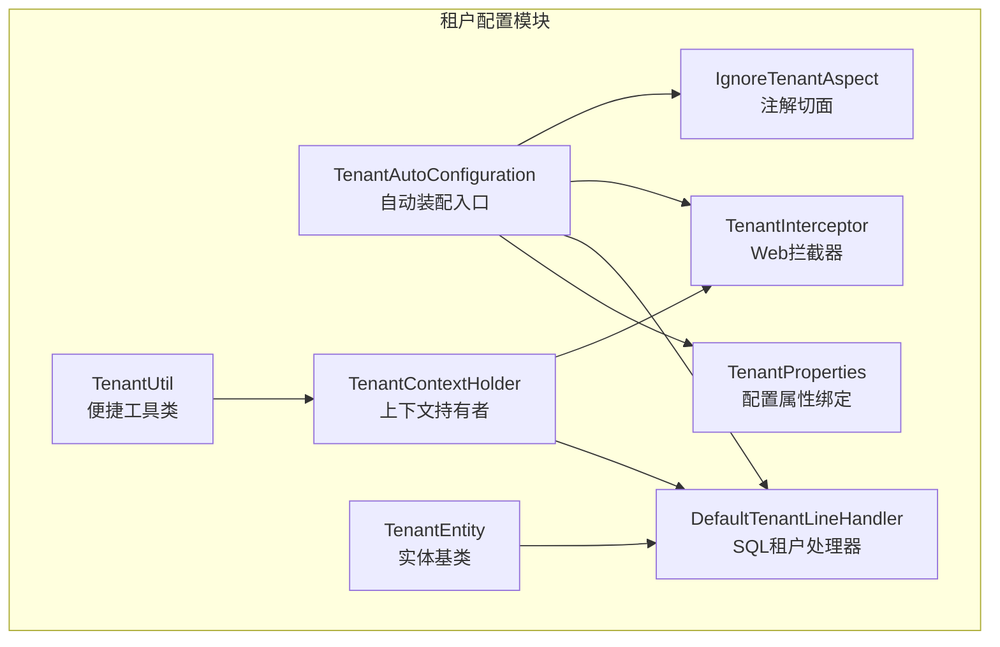
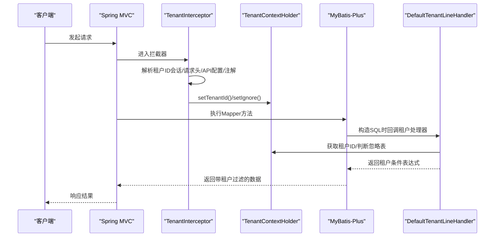
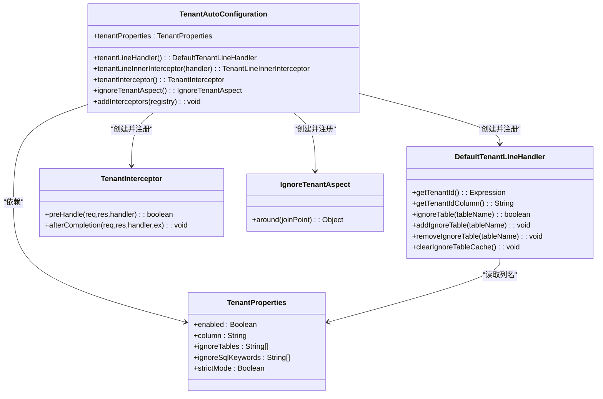
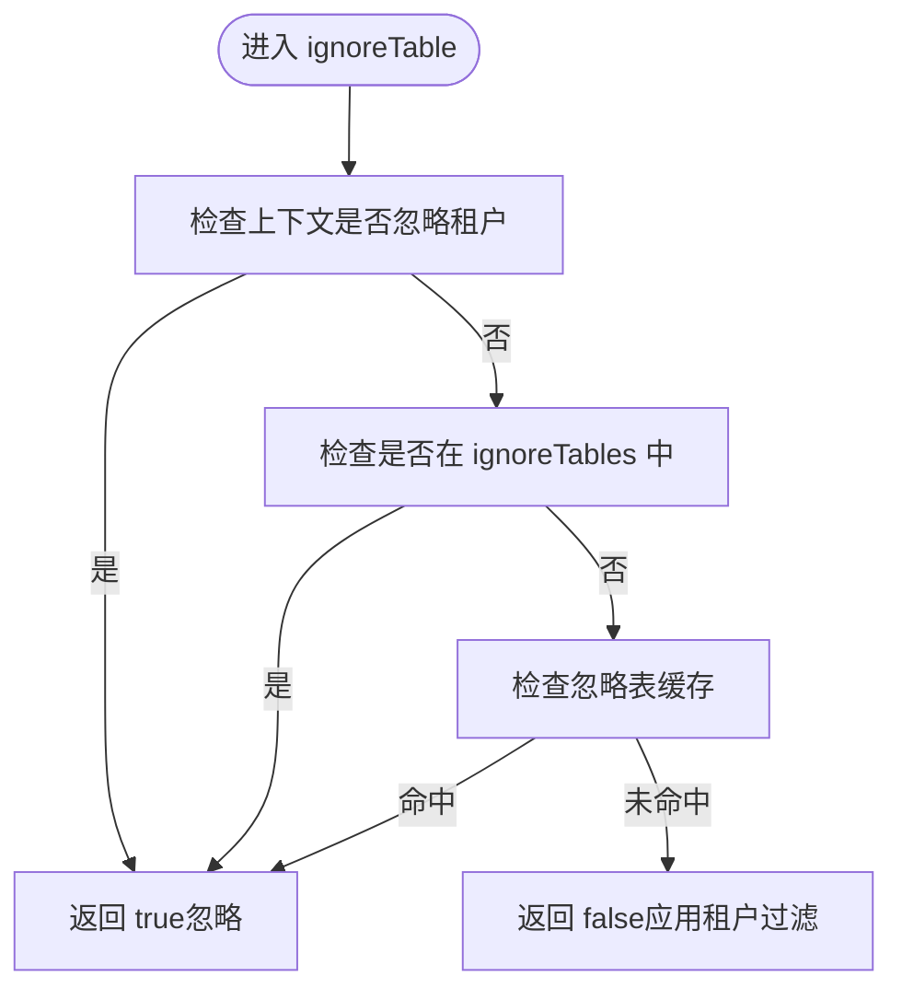
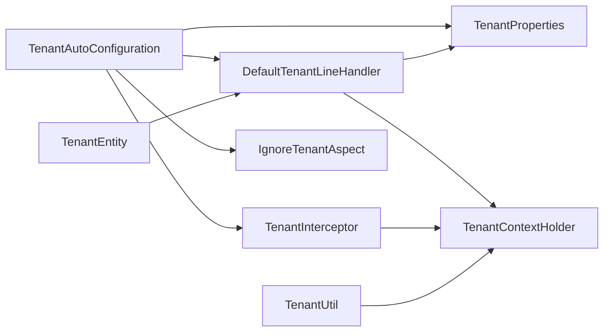

# 租户配置管理

<cite>
**本文引用的文件**
- [TenantAutoConfiguration.java](file://forge/forge-framework/forge-starter-parent/forge-starter-tenant/src/main/java/com/mdframe/forge/starter/tenant/config/TenantAutoConfiguration.java)
- [TenantProperties.java](file://forge/forge-framework/forge-starter-parent/forge-starter-tenant/src/main/java/com/mdframe/forge/starter/tenant/config/TenantProperties.java)
- [DefaultTenantLineHandler.java](file://forge/forge-framework/forge-starter-parent/forge-starter-tenant/src/main/java/com/mdframe/forge/starter/tenant/handler/DefaultTenantLineHandler.java)
- [TenantInterceptor.java](file://forge/forge-framework/forge-starter-parent/forge-starter-tenant/src/main/java/com/mdframe/forge/starter/tenant/interceptor/TenantInterceptor.java)
- [IgnoreTenantAspect.java](file://forge/forge-framework/forge-starter-parent/forge-starter-tenant/src/main/java/com/mdframe/forge/starter/tenant/aspect/IgnoreTenantAspect.java)
- [TenantContextHolder.java](file://forge/forge-framework/forge-starter-parent/forge-starter-tenant/src/main/java/com/mdframe/forge/starter/tenant/context/TenantContextHolder.java)
- [TenantUtil.java](file://forge/forge-framework/forge-starter-parent/forge-starter-tenant/src/main/java/com/mdframe/forge/starter/tenant/util/TenantUtil.java)
- [tenant-config-example.yml](file://forge/forge-framework/forge-starter-parent/forge-starter-tenant/src/main/resources/tenant-config-example.yml)
- [IgnoreTenant.java](file://forge/forge-framework/forge-starter-parent/forge-starter-core/src/main/java/com/mdframe/forge/starter/core/annotation/tenant/IgnoreTenant.java)
- [TenantEntity.java](file://forge/forge-framework/forge-starter-parent/forge-starter-tenant/src/main/java/com/mdframe/forge/starter/tenant/core/TenantEntity.java)
</cite>

## 目录
1. [简介](#简介)
2. [项目结构](#项目结构)
3. [核心组件](#核心组件)
4. [架构总览](#架构总览)
5. [详细组件分析](#详细组件分析)
6. [依赖关系分析](#依赖关系分析)
7. [性能考虑](#性能考虑)
8. [故障排查指南](#故障排查指南)
9. [结论](#结论)
10. [附录](#附录)

## 简介
本文件面向使用 Forge 框架进行多租户开发的工程师，系统性阐述租户配置管理的功能与实现。内容涵盖：
- 租户配置的核心概念与作用域
- 自动配置机制与属性绑定
- TenantAutoConfiguration 的配置加载流程
- TenantProperties 的属性定义、默认值与校验要点
- YAML 配置示例与环境变量覆盖策略
- 配置优先级、严格模式与忽略策略
- 常见问题排查与性能调优建议

## 项目结构
租户配置管理位于 forge-starter-tenant 模块，围绕 Spring Boot 自动装配、MyBatis-Plus 租户拦截、Web 层拦截与上下文传递展开。

图表来源
- [TenantAutoConfiguration.java](file://forge/forge-framework/forge-starter-parent/forge-starter-tenant/src/main/java/com/mdframe/forge/starter/tenant/config/TenantAutoConfiguration.java#L30-L86)
- [TenantProperties.java](file://forge/forge-framework/forge-starter-parent/forge-starter-tenant/src/main/java/com/mdframe/forge/starter/tenant/config/TenantProperties.java#L14-L66)
- [DefaultTenantLineHandler.java](file://forge/forge-framework/forge-starter-parent/forge-starter-tenant/src/main/java/com/mdframe/forge/starter/tenant/handler/DefaultTenantLineHandler.java#L21-L87)
- [TenantInterceptor.java](file://forge/forge-framework/forge-starter-parent/forge-starter-tenant/src/main/java/com/mdframe/forge/starter/tenant/interceptor/TenantInterceptor.java#L24-L97)
- [IgnoreTenantAspect.java](file://forge/forge-framework/forge-starter-parent/forge-starter-tenant/src/main/java/com/mdframe/forge/starter/tenant/aspect/IgnoreTenantAspect.java#L23-L52)
- [TenantContextHolder.java](file://forge/forge-framework/forge-starter-parent/forge-starter-tenant/src/main/java/com/mdframe/forge/starter/tenant/context/TenantContextHolder.java#L9-L146)
- [TenantUtil.java](file://forge/forge-framework/forge-starter-parent/forge-starter-tenant/src/main/java/com/mdframe/forge/starter/tenant/util/TenantUtil.java#L11-L110)
- [TenantEntity.java](file://forge/forge-framework/forge-starter-parent/forge-starter-tenant/src/main/java/com/mdframe/forge/starter/tenant/core/TenantEntity.java#L10-L18)

章节来源
- [TenantAutoConfiguration.java](file://forge/forge-framework/forge-starter-parent/forge-starter-tenant/src/main/java/com/mdframe/forge/starter/tenant/config/TenantAutoConfiguration.java#L20-L86)
- [TenantProperties.java](file://forge/forge-framework/forge-starter-parent/forge-starter-tenant/src/main/java/com/mdframe/forge/starter/tenant/config/TenantProperties.java#L9-L66)

## 核心组件
- TenantAutoConfiguration：Spring Boot 自动装配入口，负责注册租户处理器、SQL 拦截器、Web 拦截器与注解切面，并按优先级加载。
- TenantProperties：配置属性绑定类，承载租户开关、租户字段、忽略表、忽略 SQL 关键字、严格模式等。
- DefaultTenantLineHandler：实现 MyBatis-Plus 租户行级过滤，从上下文获取租户 ID 并决定是否忽略某张表。
- TenantInterceptor：Web 层拦截器，从会话或请求头解析租户 ID，设置到上下文；支持 API 配置与注解忽略。
- IgnoreTenantAspect：基于注解的环绕切面，处理 @IgnoreTenant 标记的方法。
- TenantContextHolder：租户上下文持有者，使用可在线程池传递的 ThreadLocal 存储租户 ID 与忽略标记。
- TenantUtil：对 TenantContextHolder 的封装，提供简洁的静态方法。
- TenantEntity：实体基类，统一在实体层携带 tenantId 字段。

章节来源
- [TenantAutoConfiguration.java](file://forge/forge-framework/forge-starter-parent/forge-starter-tenant/src/main/java/com/mdframe/forge/starter/tenant/config/TenantAutoConfiguration.java#L30-L86)
- [TenantProperties.java](file://forge/forge-framework/forge-starter-parent/forge-starter-tenant/src/main/java/com/mdframe/forge/starter/tenant/config/TenantProperties.java#L14-L66)
- [DefaultTenantLineHandler.java](file://forge/forge-framework/forge-starter-parent/forge-starter-tenant/src/main/java/com/mdframe/forge/starter/tenant/handler/DefaultTenantLineHandler.java#L21-L87)
- [TenantInterceptor.java](file://forge/forge-framework/forge-starter-parent/forge-starter-tenant/src/main/java/com/mdframe/forge/starter/tenant/interceptor/TenantInterceptor.java#L24-L97)
- [IgnoreTenantAspect.java](file://forge/forge-framework/forge-starter-parent/forge-starter-tenant/src/main/java/com/mdframe/forge/starter/tenant/aspect/IgnoreTenantAspect.java#L23-L52)
- [TenantContextHolder.java](file://forge/forge-framework/forge-starter-parent/forge-starter-tenant/src/main/java/com/mdframe/forge/starter/tenant/context/TenantContextHolder.java#L9-L146)
- [TenantUtil.java](file://forge/forge-framework/forge-starter-parent/forge-starter-tenant/src/main/java/com/mdframe/forge/starter/tenant/util/TenantUtil.java#L11-L110)
- [TenantEntity.java](file://forge/forge-framework/forge-starter-parent/forge-starter-tenant/src/main/java/com/mdframe/forge/starter/tenant/core/TenantEntity.java#L10-L18)

## 架构总览
租户配置管理通过“自动装配 + 属性绑定 + 上下文传递 + SQL/HTTP 双向拦截”的方式，实现对多租户的透明隔离。

图表来源
- [TenantInterceptor.java](file://forge/forge-framework/forge-starter-parent/forge-starter-tenant/src/main/java/com/mdframe/forge/starter/tenant/interceptor/TenantInterceptor.java#L27-L89)
- [DefaultTenantLineHandler.java](file://forge/forge-framework/forge-starter-parent/forge-starter-tenant/src/main/java/com/mdframe/forge/starter/tenant/handler/DefaultTenantLineHandler.java#L31-L61)
- [TenantContextHolder.java](file://forge/forge-framework/forge-starter-parent/forge-starter-tenant/src/main/java/com/mdframe/forge/starter/tenant/context/TenantContextHolder.java#L26-L63)

## 详细组件分析

### TenantAutoConfiguration：自动装配与加载顺序
- 职责
  - 启用配置属性绑定：将 forge.tenant 前缀的配置映射到 TenantProperties。
  - 条件装配：当 forge.tenant.enabled=true 时生效，默认开启。
  - 注册 Bean：
    - DefaultTenantLineHandler：租户行处理器。
    - TenantLineInnerInterceptor：MyBatis-Plus 内部拦截器（交由 ORM 配置统一注册）。
    - TenantInterceptor：Web 层拦截器，注册到 WebMvcConfigurer。
    - IgnoreTenantAspect：注解切面。
  - 加载顺序：设置较高优先级，确保在 ORM 配置之前完成装配。

图表来源
- [TenantAutoConfiguration.java](file://forge/forge-framework/forge-starter-parent/forge-starter-tenant/src/main/java/com/mdframe/forge/starter/tenant/config/TenantAutoConfiguration.java#L30-L86)
- [TenantProperties.java](file://forge/forge-framework/forge-starter-parent/forge-starter-tenant/src/main/java/com/mdframe/forge/starter/tenant/config/TenantProperties.java#L14-L66)
- [DefaultTenantLineHandler.java](file://forge/forge-framework/forge-starter-parent/forge-starter-tenant/src/main/java/com/mdframe/forge/starter/tenant/handler/DefaultTenantLineHandler.java#L21-L87)
- [TenantInterceptor.java](file://forge/forge-framework/forge-starter-parent/forge-starter-tenant/src/main/java/com/mdframe/forge/starter/tenant/interceptor/TenantInterceptor.java#L24-L97)
- [IgnoreTenantAspect.java](file://forge/forge-framework/forge-starter-parent/forge-starter-tenant/src/main/java/com/mdframe/forge/starter/tenant/aspect/IgnoreTenantAspect.java#L23-L52)

章节来源
- [TenantAutoConfiguration.java](file://forge/forge-framework/forge-starter-parent/forge-starter-tenant/src/main/java/com/mdframe/forge/starter/tenant/config/TenantAutoConfiguration.java#L24-L86)

### TenantProperties：属性定义、默认值与校验
- 属性清单
  - enabled：是否启用租户功能，默认 true。
  - column：租户字段名，默认 tenant_id。
  - ignoreTables：忽略租户过滤的表名列表，默认包含系统级表。
  - ignoreSqlKeywords：忽略租户过滤的 SQL 关键字列表（扩展能力）。
  - strictMode：严格模式，默认 false（宽松模式：无租户ID时记录警告；严格模式：抛出异常）。
- 默认值与行为
  - 默认忽略表覆盖范围广，包含租户表、Excel 导出配置、文件元数据、定时任务配置、生成器相关表、ID 序列、通知相关表、API 配置与配置分组等。
  - ignoreTables 会在处理器侧缓存，提升匹配性能。
- 校验与约束
  - 无强制校验逻辑，建议在实际环境中根据业务表结构补充 ignoreTables。
  - column 应与数据库表结构一致，否则 SQL 过滤无效。

章节来源
- [TenantProperties.java](file://forge/forge-framework/forge-starter-parent/forge-starter-tenant/src/main/java/com/mdframe/forge/starter/tenant/config/TenantProperties.java#L14-L66)

### DefaultTenantLineHandler：SQL 租户过滤实现
- 核心逻辑
  - 从 TenantContextHolder 获取租户 ID，若为空则返回 NULL 表达式（宽松模式），或结合严格模式策略处理。
  - 优先判断上下文是否标记忽略租户。
  - 检查是否在 ignoreTables 或缓存的忽略表集合中。
  - 返回租户字段名用于拼接 WHERE 条件。
- 性能优化
  - 使用 HashSet 缓存忽略表，降低重复判断成本。
  - 支持运行时动态增删忽略表，便于动态调整。

图表来源
- [DefaultTenantLineHandler.java](file://forge/forge-framework/forge-starter-parent/forge-starter-tenant/src/main/java/com/mdframe/forge/starter/tenant/handler/DefaultTenantLineHandler.java#L47-L61)

章节来源
- [DefaultTenantLineHandler.java](file://forge/forge-framework/forge-starter-parent/forge-starter-tenant/src/main/java/com/mdframe/forge/starter/tenant/handler/DefaultTenantLineHandler.java#L31-L87)

### TenantInterceptor：Web 层租户上下文注入
- 功能
  - 从会话辅助类获取租户 ID；若未引入认证模块，则回退从请求头 X-Tenant-Id 读取。
  - 结合 API 配置与 @IgnoreTenant 注解，决定是否忽略租户设置。
  - 在请求完成后清理上下文，防止内存泄漏。
- 依赖
  - 通过反射调用 SessionHelper 获取租户 ID（避免强依赖）。
  - 依赖 IApiConfigManager 查询接口是否需要租户隔离。

章节来源
- [TenantInterceptor.java](file://forge/forge-framework/forge-starter-parent/forge-starter-tenant/src/main/java/com/mdframe/forge/starter/tenant/interceptor/TenantInterceptor.java#L27-L97)

### IgnoreTenantAspect：注解驱动的租户忽略
- 功能
  - 对标注 @IgnoreTenant 的方法进行环绕，临时设置忽略租户标记后执行目标方法。
  - 保证异常可传播且不影响上下文清理。
- 顺序
  - 设置较高优先级，确保在其他切面之前执行。

章节来源
- [IgnoreTenantAspect.java](file://forge/forge-framework/forge-starter-parent/forge-starter-tenant/src/main/java/com/mdframe/forge/starter/tenant/aspect/IgnoreTenantAspect.java#L23-L52)

### TenantContextHolder 与 TenantUtil：上下文与工具
- TenantContextHolder
  - 使用可在线程池传递的 ThreadLocal 存储租户 ID 与忽略标记。
  - 提供 executeIgnore/executeWithTenant 等上下文切换方法。
- TenantUtil
  - 对 TenantContextHolder 的静态封装，提供 get/set/clear/isIgnore/with 等便捷方法。

章节来源
- [TenantContextHolder.java](file://forge/forge-framework/forge-starter-parent/forge-starter-tenant/src/main/java/com/mdframe/forge/starter/tenant/context/TenantContextHolder.java#L26-L145)
- [TenantUtil.java](file://forge/forge-framework/forge-starter-parent/forge-starter-tenant/src/main/java/com/mdframe/forge/starter/tenant/util/TenantUtil.java#L22-L110)

### TenantEntity：实体基类
- 为业务实体提供统一的 tenantId 字段，便于在实体层感知租户。

章节来源
- [TenantEntity.java](file://forge/forge-framework/forge-starter-parent/forge-starter-tenant/src/main/java/com/mdframe/forge/starter/tenant/core/TenantEntity.java#L10-L18)

## 依赖关系分析
- 组件耦合
  - TenantAutoConfiguration 作为装配中心，依赖 TenantProperties，并向 Spring 容器暴露多个 Bean。
  - DefaultTenantLineHandler 依赖 TenantProperties 与 TenantContextHolder。
  - TenantInterceptor 依赖 TenantContextHolder、API 配置与会话辅助类。
  - IgnoreTenantAspect 依赖 TenantContextHolder 与注解。
- 外部依赖
  - MyBatis-Plus 租户插件接口（TenantLineHandler、TenantLineInnerInterceptor）。
  - Spring MVC 拦截器链与 AOP 切面。
  - 可选的认证模块与 API 配置模块。

图表来源
- [TenantAutoConfiguration.java](file://forge/forge-framework/forge-starter-parent/forge-starter-tenant/src/main/java/com/mdframe/forge/starter/tenant/config/TenantAutoConfiguration.java#L30-L86)
- [TenantProperties.java](file://forge/forge-framework/forge-starter-parent/forge-starter-tenant/src/main/java/com/mdframe/forge/starter/tenant/config/TenantProperties.java#L14-L66)
- [DefaultTenantLineHandler.java](file://forge/forge-framework/forge-starter-parent/forge-starter-tenant/src/main/java/com/mdframe/forge/starter/tenant/handler/DefaultTenantLineHandler.java#L21-L87)
- [TenantInterceptor.java](file://forge/forge-framework/forge-starter-parent/forge-starter-tenant/src/main/java/com/mdframe/forge/starter/tenant/interceptor/TenantInterceptor.java#L24-L97)
- [IgnoreTenantAspect.java](file://forge/forge-framework/forge-starter-parent/forge-starter-tenant/src/main/java/com/mdframe/forge/starter/tenant/aspect/IgnoreTenantAspect.java#L23-L52)
- [TenantContextHolder.java](file://forge/forge-framework/forge-starter-parent/forge-starter-tenant/src/main/java/com/mdframe/forge/starter/tenant/context/TenantContextHolder.java#L9-L146)
- [TenantUtil.java](file://forge/forge-framework/forge-starter-parent/forge-starter-tenant/src/main/java/com/mdframe/forge/starter/tenant/util/TenantUtil.java#L11-L110)
- [TenantEntity.java](file://forge/forge-framework/forge-starter-parent/forge-starter-tenant/src/main/java/com/mdframe/forge/starter/tenant/core/TenantEntity.java#L10-L18)

## 性能考虑
- 忽略表缓存
  - DefaultTenantLineHandler 内部维护忽略表集合，减少重复判断开销。
  - 建议在启动阶段明确 ignoreTables，避免频繁变更导致缓存失效。
- 上下文传递
  - 使用可在线程池传递的 ThreadLocal，避免跨线程丢失租户上下文。
- SQL 拦截时机
  - 将 TenantAutoConfiguration 设置为高优先级，确保在 ORM 配置前完成装配，避免拦截器注册顺序导致的性能问题。
- 请求头回退
  - TenantInterceptor 在未引入认证模块时回退到请求头读取，注意网络传输与解析成本，建议在生产环境优先使用会话方案。

[本节为通用性能建议，无需特定文件引用]

## 故障排查指南
- 现象：查询结果未按租户隔离
  - 检查 forge.tenant.enabled 是否为 true。
  - 确认 column 与数据库表字段一致。
  - 核对 ignoreTables 是否包含了误忽略的表。
  - 若 strictMode=false，无租户 ID 仅记录警告；如需严格校验请开启严格模式。
- 现象：忽略租户注解无效
  - 确认 @IgnoreTenant 注解已正确引入（核心注解位于 core 模块）。
  - 检查 IgnoreTenantAspect 是否被加载（Spring AOP 启用）。
- 现象：Web 层未设置租户上下文
  - 若未引入认证模块，确认请求头 X-Tenant-Id 是否正确传递且为合法整数。
  - 检查 TenantInterceptor 的注册顺序与路径匹配。
- 现象：线程池场景上下文丢失
  - 确保使用 TenantContextHolder.executeWithTenant 或 TenantUtil.with 方法包裹异步任务。
- 现象：SQL 未生效
  - 确认 TenantLineInnerInterceptor 已被 MyBatis-Plus 配置统一注册。
  - 检查是否存在 ignoreSqlKeywords 导致的例外。

章节来源
- [TenantProperties.java](file://forge/forge-framework/forge-starter-parent/forge-starter-tenant/src/main/java/com/mdframe/forge/starter/tenant/config/TenantProperties.java#L14-L66)
- [DefaultTenantLineHandler.java](file://forge/forge-framework/forge-starter-parent/forge-starter-tenant/src/main/java/com/mdframe/forge/starter/tenant/handler/DefaultTenantLineHandler.java#L47-L87)
- [TenantInterceptor.java](file://forge/forge-framework/forge-starter-parent/forge-starter-tenant/src/main/java/com/mdframe/forge/starter/tenant/interceptor/TenantInterceptor.java#L61-L89)
- [IgnoreTenantAspect.java](file://forge/forge-framework/forge-starter-parent/forge-starter-tenant/src/main/java/com/mdframe/forge/starter/tenant/aspect/IgnoreTenantAspect.java#L28-L51)
- [TenantContextHolder.java](file://forge/forge-framework/forge-starter-parent/forge-starter-tenant/src/main/java/com/mdframe/forge/starter/tenant/context/TenantContextHolder.java#L105-L145)

## 结论
Forge 的租户配置管理通过自动装配与属性绑定，将租户隔离无缝集成到 SQL 与 Web 层。借助上下文持有者与注解切面，开发者可以灵活地在不同场景下启用或忽略租户过滤。合理配置 ignoreTables 与 column，结合严格模式与请求头回退策略，可在保证安全的同时兼顾灵活性与性能。

[本节为总结性内容，无需特定文件引用]

## 附录

### 配置项说明与默认值
- enabled：是否启用租户功能，默认 true。
- column：租户字段名，默认 tenant_id。
- ignoreTables：默认忽略系统级表（详见源码默认列表）。
- ignoreSqlKeywords：可选，包含该关键字的 SQL 不应用租户过滤。
- strictMode：严格模式，默认 false。

章节来源
- [TenantProperties.java](file://forge/forge-framework/forge-starter-parent/forge-starter-tenant/src/main/java/com/mdframe/forge/starter/tenant/config/TenantProperties.java#L14-L66)

### YAML 配置示例与默认值设置
- 示例文件提供了完整的配置项与注释，包括 enabled、column、strict-mode、ignore-tables、ignore-sql-keywords 等。
- 建议在不同环境（dev/prod/test）中通过 profiles 切换配置，并结合环境变量覆盖关键值。

章节来源
- [tenant-config-example.yml](file://forge/forge-framework/forge-starter-parent/forge-starter-tenant/src/main/resources/tenant-config-example.yml#L5-L51)

### 配置优先级与环境变量覆盖
- 配置优先级（从高到低）
  - 环境变量/系统属性
  - 命令行参数
  - 应用配置文件（application.yml）
  - 模块默认值（如 ignoreTables）
- 覆盖建议
  - 使用环境变量覆盖关键租户字段与开关，便于容器化部署。
  - 对 ignoreTables 建议在应用配置文件中显式声明，避免遗漏。

[本节为通用配置建议，无需特定文件引用]

### 常见配置问题与解决
- 问题：租户字段名与数据库不一致
  - 解决：修改 column 为数据库实际字段名。
- 问题：系统表未参与租户隔离
  - 解决：将对应表加入 ignoreTables。
- 问题：严格模式下无租户ID报错
  - 解决：在登录流程中正确设置租户上下文，或在方法上使用 @IgnoreTenant。

[本节为通用问题汇总，无需特定文件引用]