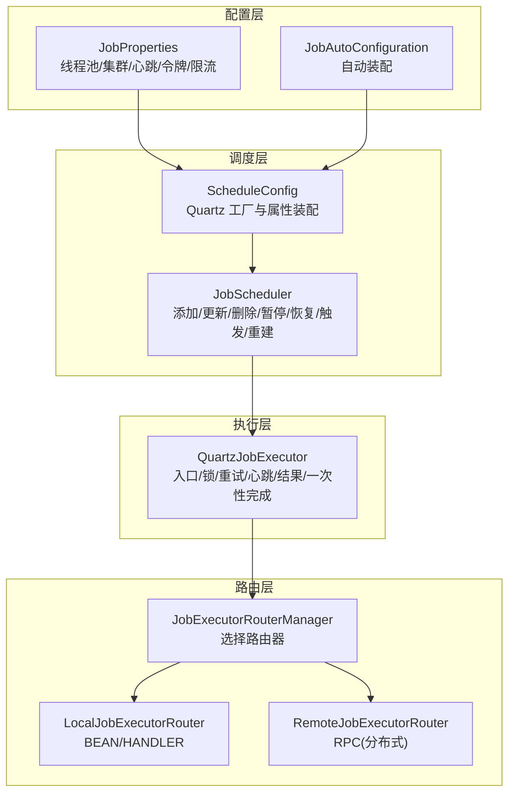
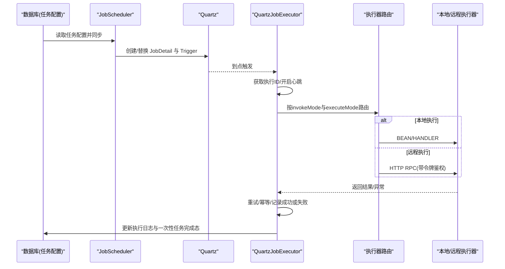
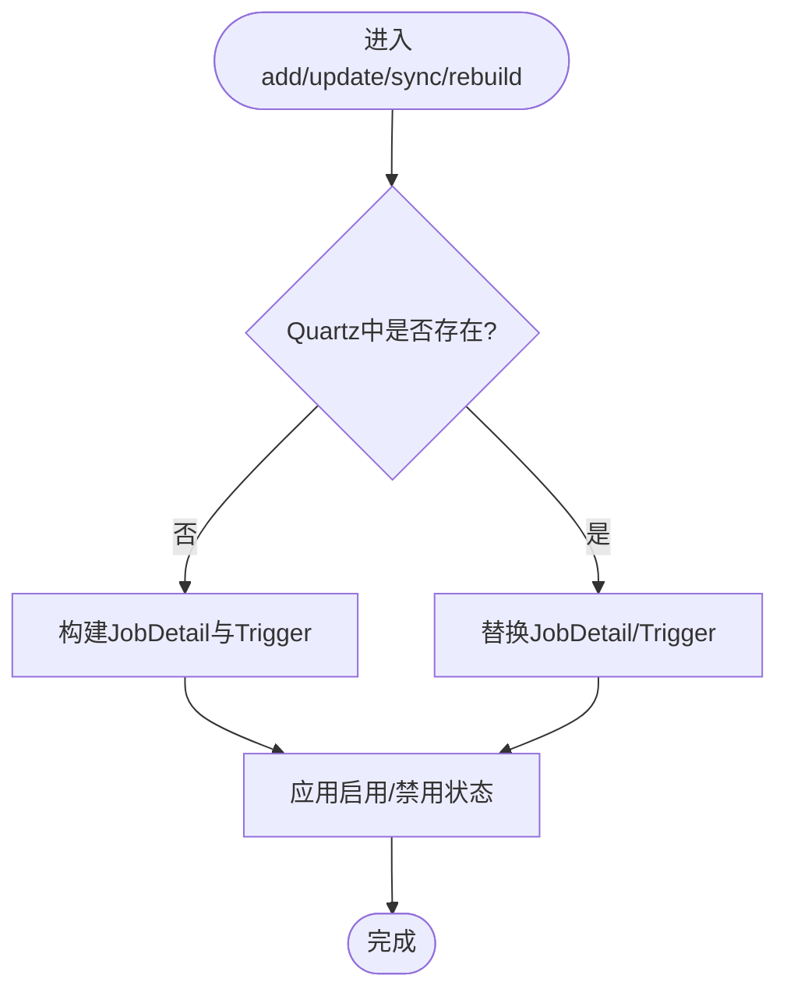
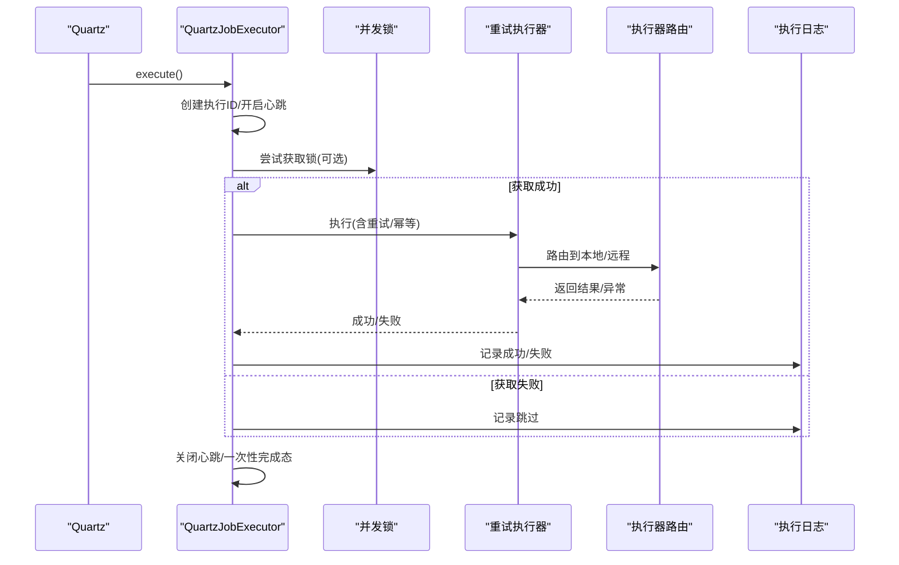
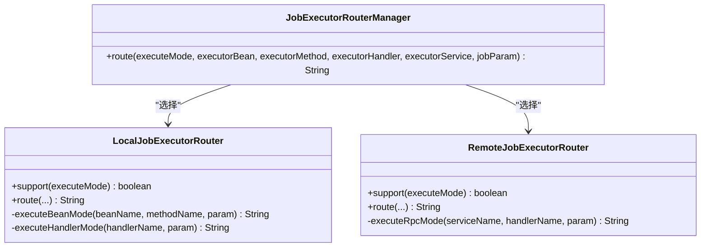
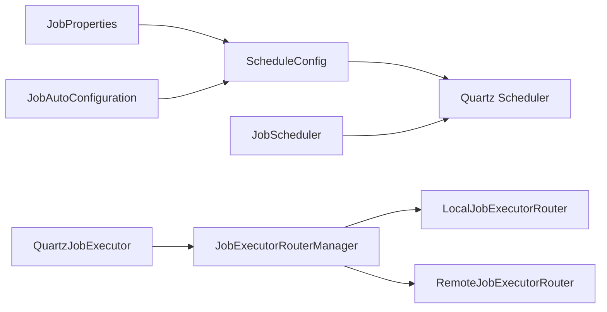

# 定时任务

<cite>
**本文引用的文件**
- [JobScheduler.java](file://forge-server/forge-framework/forge-plugin-parent/forge-plugin-job/src/main/java/com/mdframe/forge/plugin/job/scheduler/JobScheduler.java)
- [QuartzJobExecutor.java](file://forge-server/forge-framework/forge-plugin-parent/forge-plugin-job/src/main/java/com/mdframe/forge/plugin/job/scheduler/QuartzJobExecutor.java)
- [ScheduleConfig.java](file://forge-server/forge-framework/forge-plugin-parent/forge-plugin-job/src/main/java/com/mdframe/forge/plugin/job/config/ScheduleConfig.java)
- [JobProperties.java](file://forge-server/forge-framework/forge-plugin-parent/forge-plugin-job/src/main/java/com/mdframe/forge/plugin/job/config/JobProperties.java)
- [JobAutoConfiguration.java](file://forge-server/forge-framework/forge-plugin-parent/forge-plugin-job/src/main/java/com/mdframe/forge/plugin/job/config/JobAutoConfiguration.java)
- [JobExecutorRouterManager.java](file://forge-server/forge-framework/forge-plugin-parent/forge-plugin-job/src/main/java/com/mdframe/forge/plugin/job/executor/JobExecutorRouterManager.java)
- [LocalJobExecutorRouter.java](file://forge-server/forge-framework/forge-plugin-parent/forge-plugin-job/src/main/java/com/mdframe/forge/plugin/job/executor/impl/LocalJobExecutorRouter.java)
- [RemoteJobExecutorRouter.java](file://forge-server/forge-framework/forge-plugin-parent/forge-plugin-job/src/main/java/com/mdframe/forge/plugin/job/executor/impl/RemoteJobExecutorRouter.java)
</cite>

## 目录
1. [简介](#简介)
2. [项目结构](#项目结构)
3. [核心组件](#核心组件)
4. [架构总览](#架构总览)
5. [详细组件分析](#详细组件分析)
6. [依赖关系分析](#依赖关系分析)
7. [性能与并发调优](#性能与并发调优)
8. [监控、告警与日志](#监控告警与日志)
9. [故障排查指南](#故障排查指南)
10. [结论](#结论)
11. [附录：配置与操作要点](#附录配置与操作要点)

## 简介
本模块为 Forge Admin 的定时任务能力提供统一的调度、执行与治理。基于 Quartz 实现任务调度，支持单体与分布式部署模式；通过本地或远程执行器路由完成实际业务逻辑；内置失败重试、幂等控制、并发控制、一次性任务、Cron 热更新、时区处理、心跳恢复等机制；并提供开放 API 的安全令牌与限流能力。

## 项目结构
- 调度层：负责将数据库中的任务配置同步到 Quartz，管理 Job/Trigger 生命周期、状态切换、Cron 热更新、下次触发时间查询等。
- 执行层：Quartz 触发的统一入口，负责加锁、重试、心跳、结果落库、一次性任务完成态标记，以及按调用方式（单方法/流程）分发执行。
- 路由层：根据执行模式选择本地 Bean/Handler 或直接 RPC 调用远端服务执行。
- 配置层：集中管理线程池、集群、表前缀、心跳与恢复超时、开放 API 令牌与限流等。

图表来源
- [JobScheduler.java:20-411](file://forge-server/forge-framework/forge-plugin-parent/forge-plugin-job/src/main/java/com/mdframe/forge/plugin/job/scheduler/JobScheduler.java#L20-L411)
- [ScheduleConfig.java:17-107](file://forge-server/forge-framework/forge-plugin-parent/forge-plugin-job/src/main/java/com/mdframe/forge/plugin/job/config/ScheduleConfig.java#L17-L107)
- [QuartzJobExecutor.java:22-208](file://forge-server/forge-framework/forge-plugin-parent/forge-plugin-job/src/main/java/com/mdframe/forge/plugin/job/scheduler/QuartzJobExecutor.java#L22-L208)
- [JobExecutorRouterManager.java:10-42](file://forge-server/forge-framework/forge-plugin-parent/forge-plugin-job/src/main/java/com/mdframe/forge/plugin/job/executor/JobExecutorRouterManager.java#L10-L42)
- [LocalJobExecutorRouter.java:13-108](file://forge-server/forge-framework/forge-plugin-parent/forge-plugin-job/src/main/java/com/mdframe/forge/plugin/job/executor/impl/LocalJobExecutorRouter.java#L13-L108)
- [RemoteJobExecutorRouter.java:20-106](file://forge-server/forge-framework/forge-plugin-parent/forge-plugin-job/src/main/java/com/mdframe/forge/plugin/job/executor/impl/RemoteJobExecutorRouter.java#L20-L106)
- [JobProperties.java:8-215](file://forge-server/forge-framework/forge-plugin-parent/forge-plugin-job/src/main/java/com/mdframe/forge/plugin/job/config/JobProperties.java#L8-L215)
- [JobAutoConfiguration.java:8-27](file://forge-server/forge-framework/forge-plugin-parent/forge-plugin-job/src/main/java/com/mdframe/forge/plugin/job/config/JobAutoConfiguration.java#L8-L27)

章节来源
- [ScheduleConfig.java:20-64](file://forge-server/forge-framework/forge-plugin-parent/forge-plugin-job/src/main/java/com/mdframe/forge/plugin/job/config/ScheduleConfig.java#L20-L64)
- [JobProperties.java:11-215](file://forge-server/forge-framework/forge-plugin-parent/forge-plugin-job/src/main/java/com/mdframe/forge/plugin/job/config/JobProperties.java#L11-L215)

## 核心组件
- 任务调度管理器：封装对 Quartz 的增删改查、状态切换、Cron 热更新、一次性任务补偿策略、下次触发时间计算等。
- 任务执行入口：统一接入生命周期、并发锁、重试、心跳、结果记录、一次性任务完成态标记。
- 执行器路由：按执行模式选择本地 Bean/Handler 或远程 RPC 执行。
- 配置中心：线程池大小、集群开关、表前缀、心跳间隔、恢复超时、开放 API 令牌与限流等。

章节来源
- [JobScheduler.java:32-247](file://forge-server/forge-framework/forge-plugin-parent/forge-plugin-job/src/main/java/com/mdframe/forge/plugin/job/scheduler/JobScheduler.java#L32-L247)
- [QuartzJobExecutor.java:29-135](file://forge-server/forge-framework/forge-plugin-parent/forge-plugin-job/src/main/java/com/mdframe/forge/plugin/job/scheduler/QuartzJobExecutor.java#L29-L135)
- [JobExecutorRouterManager.java:18-42](file://forge-server/forge-framework/forge-plugin-parent/forge-plugin-job/src/main/java/com/mdframe/forge/plugin/job/executor/JobExecutorRouterManager.java#L18-L42)
- [JobProperties.java:11-215](file://forge-server/forge-framework/forge-plugin-parent/forge-plugin-job/src/main/java/com/mdframe/forge/plugin/job/config/JobProperties.java#L11-L215)

## 架构总览

图表来源
- [JobScheduler.java:35-235](file://forge-server/forge-framework/forge-plugin-parent/forge-plugin-job/src/main/java/com/mdframe/forge/plugin/job/scheduler/JobScheduler.java#L35-L235)
- [QuartzJobExecutor.java:29-135](file://forge-server/forge-framework/forge-plugin-parent/forge-plugin-job/src/main/java/com/mdframe/forge/plugin/job/scheduler/QuartzJobExecutor.java#L29-L135)
- [LocalJobExecutorRouter.java:24-78](file://forge-server/forge-framework/forge-plugin-parent/forge-plugin-job/src/main/java/com/mdframe/forge/plugin/job/executor/impl/LocalJobExecutorRouter.java#L24-L78)
- [RemoteJobExecutorRouter.java:35-104](file://forge-server/forge-framework/forge-plugin-parent/forge-plugin-job/src/main/java/com/mdframe/forge/plugin/job/executor/impl/RemoteJobExecutorRouter.java#L35-L104)

## 详细组件分析

### 任务调度引擎（JobScheduler）
- 能力清单
  - 添加/更新/删除任务：校验存在性、构建 JobDetail/Trigger 并注册到 Quartz。
  - 同步/重建：幂等地将数据库期望状态与 Quartz 运行态对齐，支持清理孤儿 Trigger。
  - 暂停/恢复/立即触发：控制任务运行态与手动触发。
  - Cron 热更新：在不重建 Job 的情况下替换 Trigger 的 Cron 表达式，并应用错过策略。
  - 一次性任务：支持“错过即不补偿”的策略，避免重复执行。
  - 下次触发时间：按任务时区解析下一次触发时间。
- 关键数据流
  - JobDataMap 携带执行器信息、参数、执行模式、并发策略、重试次数、幂等标志、流程信息等。
  - 触发器类型区分一次性与 Cron，分别使用 Simple/Cron ScheduleBuilder 并应用错过策略。
- 错误处理
  - 统一包装为调度异常，记录失败原因与 JobKey，便于定位。

图表来源
- [JobScheduler.java:35-115](file://forge-server/forge-framework/forge-plugin-parent/forge-plugin-job/src/main/java/com/mdframe/forge/plugin/job/scheduler/JobScheduler.java#L35-L115)
- [JobScheduler.java:271-355](file://forge-server/forge-framework/forge-plugin-parent/forge-plugin-job/src/main/java/com/mdframe/forge/plugin/job/scheduler/JobScheduler.java#L271-L355)

章节来源
- [JobScheduler.java:32-247](file://forge-server/forge-framework/forge-plugin-parent/forge-plugin-job/src/main/java/com/mdframe/forge/plugin/job/scheduler/JobScheduler.java#L32-L247)
- [JobScheduler.java:297-379](file://forge-server/forge-framework/forge-plugin-parent/forge-plugin-job/src/main/java/com/mdframe/forge/plugin/job/scheduler/JobScheduler.java#L297-L379)

### 执行入口与治理（QuartzJobExecutor）
- 职责
  - 接收 Quartz 触发，建立执行上下文与心跳。
  - 并发控制：当配置为“运行中跳过”时尝试获取分布式锁，未获取则标记跳过。
  - 重试与幂等：委托重试执行器，支持指定重试次数与幂等开关。
  - 调用方式：支持单次方法/流程两种调用模式；流程模式走编排服务，否则走执行器路由。
  - 结果记录：成功/失败/跳过均持久化执行日志，包含重试次数与错误信息。
  - 一次性任务完成：在计划触发时间匹配时标记一次性任务完成，防止重复。
- 关键路径
  - 接受执行 -> 开启心跳 -> 并发锁 -> 重试执行 -> 记录结果 -> 关闭心跳 -> 一次性完成态。

图表来源
- [QuartzJobExecutor.java:29-135](file://forge-server/forge-framework/forge-plugin-parent/forge-plugin-job/src/main/java/com/mdframe/forge/plugin/job/scheduler/QuartzJobExecutor.java#L29-L135)
- [QuartzJobExecutor.java:137-167](file://forge-server/forge-framework/forge-plugin-parent/forge-plugin-job/src/main/java/com/mdframe/forge/plugin/job/scheduler/QuartzJobExecutor.java#L137-L167)

章节来源
- [QuartzJobExecutor.java:29-135](file://forge-server/forge-framework/forge-plugin-parent/forge-plugin-job/src/main/java/com/mdframe/forge/plugin/job/scheduler/QuartzJobExecutor.java#L29-L135)
- [QuartzJobExecutor.java:137-167](file://forge-server/forge-framework/forge-plugin-parent/forge-plugin-job/src/main/java/com/mdframe/forge/plugin/job/scheduler/QuartzJobExecutor.java#L137-L167)

### 执行器路由（本地/远程）
- 本地路由
  - 支持 BEAN 模式：通过 Spring 容器查找 Bean 并反射调用方法（支持无参或 String 参数）。
  - 支持 HANDLER 模式：通过处理器目录解析具体 Handler Bean 并执行。
- 远程路由
  - 仅支持 RPC 模式，通过受控出站客户端发起 HTTP 请求，携带 Authorization 令牌。
  - 请求体包含 handlerName 与 param；响应需包含 code=200 表示成功。
  - 服务地址由服务名拼接得到，便于服务发现与负载均衡。

图表来源
- [JobExecutorRouterManager.java:18-42](file://forge-server/forge-framework/forge-plugin-parent/forge-plugin-job/src/main/java/com/mdframe/forge/plugin/job/executor/JobExecutorRouterManager.java#L18-L42)
- [LocalJobExecutorRouter.java:24-78](file://forge-server/forge-framework/forge-plugin-parent/forge-plugin-job/src/main/java/com/mdframe/forge/plugin/job/executor/impl/LocalJobExecutorRouter.java#L24-L78)
- [RemoteJobExecutorRouter.java:35-104](file://forge-server/forge-framework/forge-plugin-parent/forge-plugin-job/src/main/java/com/mdframe/forge/plugin/job/executor/impl/RemoteJobExecutorRouter.java#L35-L104)

章节来源
- [LocalJobExecutorRouter.java:24-108](file://forge-server/forge-framework/forge-plugin-parent/forge-plugin-job/src/main/java/com/mdframe/forge/plugin/job/executor/impl/LocalJobExecutorRouter.java#L24-L108)
- [RemoteJobExecutorRouter.java:35-106](file://forge-server/forge-framework/forge-plugin-parent/forge-plugin-job/src/main/java/com/mdframe/forge/plugin/job/executor/impl/RemoteJobExecutorRouter.java#L35-L106)

### 配置与启动（ScheduleConfig、JobProperties、JobAutoConfiguration）
- 线程池与集群
  - 线程池大小可配，默认 20，范围限制 1~100。
  - 支持集群模式与节点检查间隔、misfire 阈值、表前缀等。
- 启动恢复专用线程池
  - 单线程串行执行，避免任务量大阻塞主启动流程。
- 开放 API 与安全
  - 令牌 Pepper 长度校验、幂等有效期、最后使用时间节流、读取/触发限流等。
  - 执行器 Token 必须配置且长度校验，用于远程调用鉴权。
- 自动装配
  - 扫描任务插件包，启用配置属性绑定。

章节来源
- [ScheduleConfig.java:20-107](file://forge-server/forge-framework/forge-plugin-parent/forge-plugin-job/src/main/java/com/mdframe/forge/plugin/job/config/ScheduleConfig.java#L20-L107)
- [JobProperties.java:11-215](file://forge-server/forge-framework/forge-plugin-parent/forge-plugin-job/src/main/java/com/mdframe/forge/plugin/job/config/JobProperties.java#L11-L215)
- [JobAutoConfiguration.java:11-27](file://forge-server/forge-framework/forge-plugin-parent/forge-plugin-job/src/main/java/com/mdframe/forge/plugin/job/config/JobAutoConfiguration.java#L11-L27)

## 依赖关系分析
- 低耦合高内聚
  - 调度层只关注 Quartz 生命周期与状态同步，不关心具体执行细节。
  - 执行层专注执行治理（锁、重试、心跳、结果），通过路由解耦本地/远程实现。
  - 配置层集中管理运行时参数，便于环境差异与灰度发布。
- 外部依赖
  - Quartz：任务调度与持久化。
  - 受控出站客户端：远程执行器的安全 HTTP 调用。
  - Spring 容器：Bean 解析与反射调用。

图表来源
- [ScheduleConfig.java:20-64](file://forge-server/forge-framework/forge-plugin-parent/forge-plugin-job/src/main/java/com/mdframe/forge/plugin/job/config/ScheduleConfig.java#L20-L64)
- [JobScheduler.java:27-31](file://forge-server/forge-framework/forge-plugin-parent/forge-plugin-job/src/main/java/com/mdframe/forge/plugin/job/scheduler/JobScheduler.java#L27-L31)
- [QuartzJobExecutor.java:29-135](file://forge-server/forge-framework/forge-plugin-parent/forge-plugin-job/src/main/java/com/mdframe/forge/plugin/job/scheduler/QuartzJobExecutor.java#L29-L135)
- [JobExecutorRouterManager.java:18-42](file://forge-server/forge-framework/forge-plugin-parent/forge-plugin-job/src/main/java/com/mdframe/forge/plugin/job/executor/JobExecutorRouterManager.java#L18-L42)

章节来源
- [ScheduleConfig.java:20-107](file://forge-server/forge-framework/forge-plugin-parent/forge-plugin-job/src/main/java/com/mdframe/forge/plugin/job/config/ScheduleConfig.java#L20-L107)
- [JobProperties.java:11-215](file://forge-server/forge-framework/forge-plugin-parent/forge-plugin-job/src/main/java/com/mdframe/forge/plugin/job/config/JobProperties.java#L11-L215)

## 性能与并发调优
- 线程池
  - 合理设置线程池大小（默认 20，范围 1~100），结合 CPU/IO 特征调整。
  - 集群模式下确保各节点线程池一致，避免负载不均。
- 集群与误触发
  - 开启集群模式，设置合理的节点检查间隔与 misfire 阈值，降低抖动影响。
- 并发控制
  - 对长耗时任务建议开启“运行中跳过”，避免堆积。
  - 短耗时高频任务可适度放宽并发，但需配合限流与幂等。
- 重试与幂等
  - 重试次数与幂等开关按需配置，避免雪崩与重复副作用。
- 心跳与恢复
  - 心跳间隔建议 5s~5min，恢复超时必须大于心跳间隔的两倍，保证异常恢复准确性。
- 表前缀与隔离
  - 多实例或多租户场景可通过表前缀隔离 Quartz 表，减少锁竞争。

[本节为通用指导，不直接分析具体文件]

## 监控、告警与日志
- 执行日志
  - 每次执行都会记录成功/失败/跳过，包含重试次数与错误信息，便于回溯。
- 心跳与失联恢复
  - 执行期间周期性上报心跳；启动时可判定长时间无心跳的执行记录进行恢复。
- 一次性任务
  - 支持“错过即不补偿”，避免历史错过导致的重放问题。
- 开放 API 限流
  - 读取与触发接口支持每分钟限流，防止滥用。
- 令牌安全
  - 远程执行器调用需携带有效令牌，服务端会校验长度与有效性。

章节来源
- [QuartzJobExecutor.java:61-135](file://forge-server/forge-framework/forge-plugin-parent/forge-plugin-job/src/main/java/com/mdframe/forge/plugin/job/scheduler/QuartzJobExecutor.java#L61-L135)
- [JobProperties.java:51-116](file://forge-server/forge-framework/forge-plugin-parent/forge-plugin-job/src/main/java/com/mdframe/forge/plugin/job/config/JobProperties.java#L51-L116)
- [JobProperties.java:142-198](file://forge-server/forge-framework/forge-plugin-parent/forge-plugin-job/src/main/java/com/mdframe/forge/plugin/job/config/JobProperties.java#L142-L198)

## 故障排查指南
- 任务未触发
  - 检查 Quartz 中是否存在对应 Job/Trigger；确认任务状态是否被暂停。
  - 核对 Cron 表达式与时区设置是否正确。
- 任务重复执行
  - 检查并发策略是否为“运行中跳过”；确认一次性任务的错过策略与完成态。
- 远程执行失败
  - 检查令牌是否配置且长度满足要求；确认远端服务可达与响应格式正确。
- 执行卡住或丢失
  - 查看心跳间隔与恢复超时配置是否合理；检查是否有长时间无心跳的记录需要恢复。
- 限流拒绝
  - 检查开放 API 的读取/触发限流配置，必要时提升配额或优化调用频率。

章节来源
- [JobScheduler.java:127-247](file://forge-server/forge-framework/forge-plugin-parent/forge-plugin-job/src/main/java/com/mdframe/forge/plugin/job/scheduler/JobScheduler.java#L127-L247)
- [RemoteJobExecutorRouter.java:56-104](file://forge-server/forge-framework/forge-plugin-parent/forge-plugin-job/src/main/java/com/mdframe/forge/plugin/job/executor/impl/RemoteJobExecutorRouter.java#L56-L104)
- [JobProperties.java:80-116](file://forge-server/forge-framework/forge-plugin-parent/forge-plugin-job/src/main/java/com/mdframe/forge/plugin/job/config/JobProperties.java#L80-L116)

## 结论
本模块以 Quartz 为核心，结合执行治理与路由抽象，提供了稳定可靠的定时任务能力。通过配置化与可扩展的设计，既能满足单体快速开发，也能支撑分布式高可用场景。建议在上线前完成并发、重试、心跳、限流等关键参数的压测与调优，并完善监控与告警体系。

[本节为总结，不直接分析具体文件]

## 附录：配置与操作要点
- 任务创建与配置
  - 在数据库中维护任务配置（名称、分组、Cron/一次性时间、时区、执行模式、调用方式、并发策略、重试次数、幂等标志等）。
  - 通过调度器同步/重建，将配置生效至 Quartz。
- Cron 表达式与时区
  - Cron 表达式支持热更新；一次性任务支持指定时区与计划触发时间。
- 参数传递
  - 通过 JobDataMap 传递执行参数；本地 Bean/Handler 支持无参或 String 参数。
- 结果回调
  - 执行结果写入执行日志；流程模式返回编排结果。
- 开放 API 与令牌
  - 启用开放 API 后，需配置令牌 Pepper 与限流；远程执行调用需携带 Authorization 令牌。
- 运维操作
  - 支持暂停/恢复、立即触发、重建、删除等操作；列表展示失败不影响配置查询。

章节来源
- [JobScheduler.java:35-235](file://forge-server/forge-framework/forge-plugin-parent/forge-plugin-job/src/main/java/com/mdframe/forge/plugin/job/scheduler/JobScheduler.java#L35-L235)
- [QuartzJobExecutor.java:119-135](file://forge-server/forge-framework/forge-plugin-parent/forge-plugin-job/src/main/java/com/mdframe/forge/plugin/job/scheduler/QuartzJobExecutor.java#L119-L135)
- [JobProperties.java:51-116](file://forge-server/forge-framework/forge-plugin-parent/forge-plugin-job/src/main/java/com/mdframe/forge/plugin/job/config/JobProperties.java#L51-L116)
- [JobProperties.java:142-198](file://forge-server/forge-framework/forge-plugin-parent/forge-plugin-job/src/main/java/com/mdframe/forge/plugin/job/config/JobProperties.java#L142-L198)