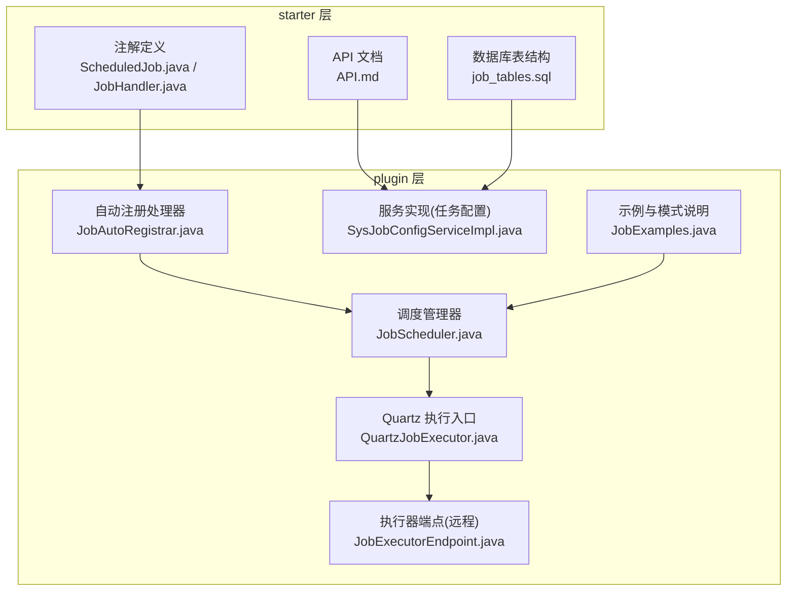
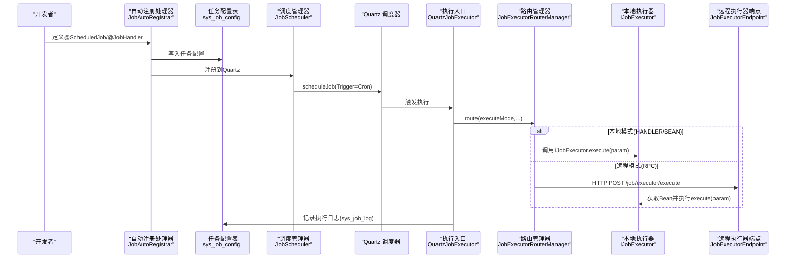
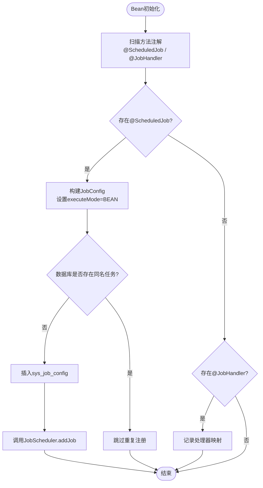
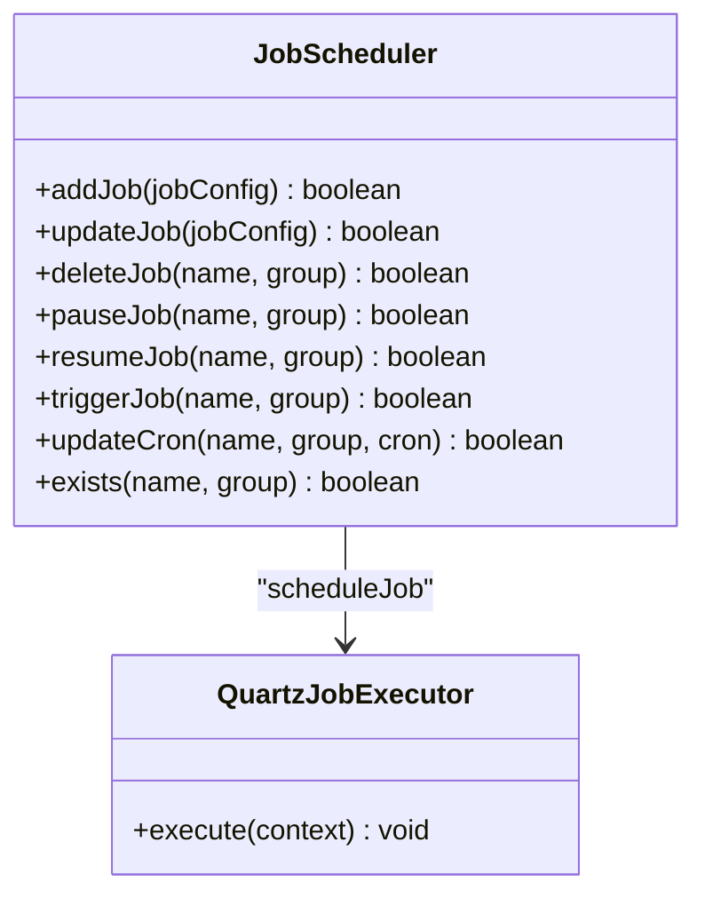
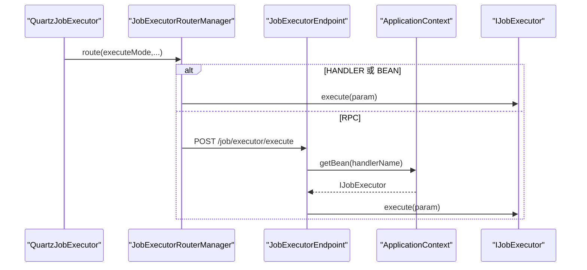
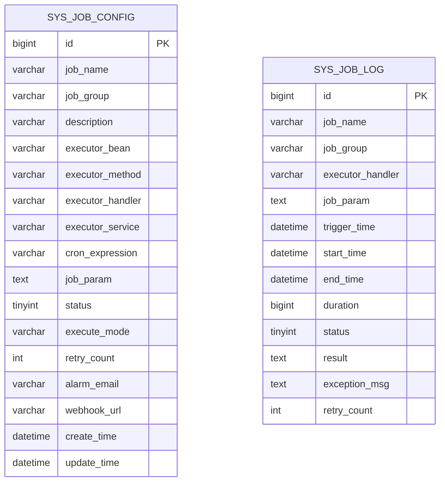
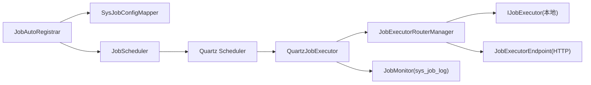

# 任务执行引擎

<cite>
**本文引用的文件**
- [ScheduledJob.java](file://forge/forge-framework/forge-starter-parent/forge-starter-job/src/main/java/com/mdframe/forge/starter/job/annotation/ScheduledJob.java)
- [JobHandler.java](file://forge/forge-framework/forge-starter-parent/forge-starter-job/src/main/java/com/mdframe/forge/starter/job/annotation/JobHandler.java)
- [API.md](file://forge/forge-framework/forge-starter-parent/forge-starter-job/API.md)
- [job_tables.sql](file://forge/forge-framework/forge-starter-parent/forge-starter-job/sql/job_tables.sql)
- [JobScheduler.java](file://forge/forge-framework/forge-plugin-parent/forge-plugin-job/src/main/java/com/mdframe/forge/plugin/job/scheduler/JobScheduler.java)
- [QuartzJobExecutor.java](file://forge/forge-framework/forge-plugin-parent/forge-plugin-job/src/main/java/com/mdframe/forge/plugin/job/scheduler/QuartzJobExecutor.java)
- [JobAutoRegistrar.java](file://forge/forge-framework/forge-plugin-parent/forge-plugin-job/src/main/java/com/mdframe/forge/plugin/job/registry/JobAutoRegistrar.java)
- [JobExecutorEndpoint.java](file://forge/forge-framework/forge-plugin-parent/forge-plugin-job/src/main/java/com/mdframe/forge/plugin/job/controller/JobExecutorEndpoint.java)
- [SysJobConfigServiceImpl.java](file://forge/forge-framework/forge-plugin-parent/forge-plugin-job/src/main/java/com/mdframe/forge/plugin/job/service/impl/SysJobConfigServiceImpl.java)
- [JobExamples.java](file://forge/forge-framework/forge-plugin-parent/forge-plugin-job/src/main/java/com/mdframe/forge/plugin/job/example/JobExamples.java)
</cite>

## 目录
1. [引言](#引言)
2. [项目结构](#项目结构)
3. [核心组件](#核心组件)
4. [架构总览](#架构总览)
5. [详细组件分析](#详细组件分析)
6. [依赖关系分析](#依赖关系分析)
7. [性能考虑](#性能考虑)
8. [故障排查指南](#故障排查指南)
9. [结论](#结论)
10. [附录](#附录)

## 引言
本技术文档围绕基于 Quartz 的任务执行引擎展开，系统性阐述任务执行器的注册、路由与调用流程，明确本地执行器与远程执行器的差异与适用场景，并覆盖任务执行上下文管理、异常处理、超时控制等关键能力。同时提供任务执行器开发指南、路由策略配置与性能优化建议，帮助开发者构建高效、可靠的任务执行系统。

## 项目结构
任务执行引擎主要分布在以下模块与包中：
- starter 层：定义注解与 API 文档，用于声明式任务与对外接口说明
- plugin 层：实现调度器封装、Quartz 执行入口、自动注册、执行器端点、示例与服务实现

图表来源
- [ScheduledJob.java](file://forge/forge-framework/forge-starter-parent/forge-starter-job/src/main/java/com/mdframe/forge/starter/job/annotation/ScheduledJob.java#L1-L39)
- [JobHandler.java](file://forge/forge-framework/forge-starter-parent/forge-starter-job/src/main/java/com/mdframe/forge/starter/job/annotation/JobHandler.java#L1-L29)
- [API.md](file://forge/forge-framework/forge-starter-parent/forge-starter-job/API.md#L1-L195)
- [job_tables.sql](file://forge/forge-framework/forge-starter-parent/forge-starter-job/sql/job_tables.sql#L1-L48)
- [JobScheduler.java](file://forge/forge-framework/forge-plugin-parent/forge-plugin-job/src/main/java/com/mdframe/forge/plugin/job/scheduler/JobScheduler.java#L1-L220)
- [QuartzJobExecutor.java](file://forge/forge-framework/forge-plugin-parent/forge-plugin-job/src/main/java/com/mdframe/forge/plugin/job/scheduler/QuartzJobExecutor.java#L1-L61)
- [JobAutoRegistrar.java](file://forge/forge-framework/forge-plugin-parent/forge-plugin-job/src/main/java/com/mdframe/forge/plugin/job/registry/JobAutoRegistrar.java#L1-L105)
- [JobExecutorEndpoint.java](file://forge/forge-framework/forge-plugin-parent/forge-plugin-job/src/main/java/com/mdframe/forge/plugin/job/controller/JobExecutorEndpoint.java#L1-L58)
- [SysJobConfigServiceImpl.java](file://forge/forge-framework/forge-plugin-parent/forge-plugin-job/src/main/java/com/mdframe/forge/plugin/job/service/impl/SysJobConfigServiceImpl.java#L49-L93)
- [JobExamples.java](file://forge/forge-framework/forge-plugin-parent/forge-plugin-job/src/main/java/com/mdframe/forge/plugin/job/example/JobExamples.java#L51-L96)

章节来源
- [ScheduledJob.java](file://forge/forge-framework/forge-starter-parent/forge-starter-job/src/main/java/com/mdframe/forge/starter/job/annotation/ScheduledJob.java#L1-L39)
- [JobHandler.java](file://forge/forge-framework/forge-starter-parent/forge-starter-job/src/main/java/com/mdframe/forge/starter/job/annotation/JobHandler.java#L1-L29)
- [API.md](file://forge/forge-framework/forge-starter-parent/forge-starter-job/API.md#L1-L195)
- [job_tables.sql](file://forge/forge-framework/forge-starter-parent/forge-starter-job/sql/job_tables.sql#L1-L48)

## 核心组件
- 注解层
  - ScheduledJob：用于方法级声明定时任务，自动注册到 Quartz
  - JobHandler：标记任务处理器，作为执行器唯一标识
- 调度层
  - JobScheduler：封装 Quartz 的任务 CRUD、启停、立即触发与 Cron 热更新
  - QuartzJobExecutor：Quartz 触发后的统一执行入口，负责路由与日志记录
- 注册与发现
  - JobAutoRegistrar：Bean 初始化后扫描注解，自动写入数据库并注册到调度器
- 执行器与远程端点
  - IJobExecutor 接口与 JobExecutorEndpoint：提供远程执行器端点，供调度中心调用本地 Handler
- 数据与日志
  - 任务配置表与日志表：持久化任务元数据与执行日志
- 示例与模式
  - JobExamples：展示本地 Handler 与 RPC 模式的使用方式

章节来源
- [JobScheduler.java](file://forge/forge-framework/forge-plugin-parent/forge-plugin-job/src/main/java/com/mdframe/forge/plugin/job/scheduler/JobScheduler.java#L1-L220)
- [QuartzJobExecutor.java](file://forge/forge-framework/forge-plugin-parent/forge-plugin-job/src/main/java/com/mdframe/forge/plugin/job/scheduler/QuartzJobExecutor.java#L1-L61)
- [JobAutoRegistrar.java](file://forge/forge-framework/forge-plugin-parent/forge-plugin-job/src/main/java/com/mdframe/forge/plugin/job/registry/JobAutoRegistrar.java#L1-L105)
- [JobExecutorEndpoint.java](file://forge/forge-framework/forge-plugin-parent/forge-plugin-job/src/main/java/com/mdframe/forge/plugin/job/controller/JobExecutorEndpoint.java#L1-L58)
- [job_tables.sql](file://forge/forge-framework/forge-starter-parent/forge-starter-job/sql/job_tables.sql#L1-L48)
- [JobExamples.java](file://forge/forge-framework/forge-plugin-parent/forge-plugin-job/src/main/java/com/mdframe/forge/plugin/job/example/JobExamples.java#L51-L96)

## 架构总览
下图展示了从注解到调度、执行、日志记录与远程执行的整体链路。

图表来源
- [JobAutoRegistrar.java](file://forge/forge-framework/forge-plugin-parent/forge-plugin-job/src/main/java/com/mdframe/forge/plugin/job/registry/JobAutoRegistrar.java#L68-L103)
- [JobScheduler.java](file://forge/forge-framework/forge-plugin-parent/forge-plugin-job/src/main/java/com/mdframe/forge/plugin/job/scheduler/JobScheduler.java#L23-L65)
- [QuartzJobExecutor.java](file://forge/forge-framework/forge-plugin-parent/forge-plugin-job/src/main/java/com/mdframe/forge/plugin/job/scheduler/QuartzJobExecutor.java#L20-L61)
- [JobExecutorEndpoint.java](file://forge/forge-framework/forge-plugin-parent/forge-plugin-job/src/main/java/com/mdframe/forge/plugin/job/controller/JobExecutorEndpoint.java#L28-L50)
- [job_tables.sql](file://forge/forge-framework/forge-starter-parent/forge-starter-job/sql/job_tables.sql#L24-L43)

## 详细组件分析

### 组件一：注解与自动注册
- ScheduledJob
  - 作用：声明方法级定时任务，包含 cron、name、group、description、enabled 等属性
  - 行为：被 JobAutoRegistrar 扫描后转换为 JobConfig 并注册到 Quartz
- JobHandler
  - 作用：标记任务处理器，value 作为唯一标识，配合 group 使用
  - 行为：JobAutoRegistrar 记录处理器与 Bean 的映射，必要时动态创建任务
- JobAutoRegistrar
  - 在 Bean 初始化后扫描方法注解，若任务未存在则写入数据库并调用 JobScheduler.addJob

图表来源
- [JobAutoRegistrar.java](file://forge/forge-framework/forge-plugin-parent/forge-plugin-job/src/main/java/com/mdframe/forge/plugin/job/registry/JobAutoRegistrar.java#L34-L103)
- [ScheduledJob.java](file://forge/forge-framework/forge-starter-parent/forge-starter-job/src/main/java/com/mdframe/forge/starter/job/annotation/ScheduledJob.java#L12-L38)
- [JobHandler.java](file://forge/forge-framework/forge-starter-parent/forge-starter-job/src/main/java/com/mdframe/forge/starter/job/annotation/JobHandler.java#L12-L28)

章节来源
- [ScheduledJob.java](file://forge/forge-framework/forge-starter-parent/forge-starter-job/src/main/java/com/mdframe/forge/starter/job/annotation/ScheduledJob.java#L1-L39)
- [JobHandler.java](file://forge/forge-framework/forge-starter-parent/forge-starter-job/src/main/java/com/mdframe/forge/starter/job/annotation/JobHandler.java#L1-L29)
- [JobAutoRegistrar.java](file://forge/forge-framework/forge-plugin-parent/forge-plugin-job/src/main/java/com/mdframe/forge/plugin/job/registry/JobAutoRegistrar.java#L1-L105)

### 组件二：调度管理器与 Quartz 执行入口
- JobScheduler
  - 提供任务的增删改查、启停、立即触发、Cron 热更新
  - 使用 CronTrigger，Misfire 策略为“不做任何处理”
  - 支持根据任务状态决定初始暂停
- QuartzJobExecutor
  - 从 JobDataMap 读取执行器参数（Handler/Bean/Method/Service/Mode/Param）
  - 通过 JobExecutorRouterManager 路由到本地或远程执行器
  - 使用 JobMonitor 记录执行日志（含异常、耗时、结果）

图表来源
- [JobScheduler.java](file://forge/forge-framework/forge-plugin-parent/forge-plugin-job/src/main/java/com/mdframe/forge/plugin/job/scheduler/JobScheduler.java#L1-L220)
- [QuartzJobExecutor.java](file://forge/forge-framework/forge-plugin-parent/forge-plugin-job/src/main/java/com/mdframe/forge/plugin/job/scheduler/QuartzJobExecutor.java#L1-L61)

章节来源
- [JobScheduler.java](file://forge/forge-framework/forge-plugin-parent/forge-plugin-job/src/main/java/com/mdframe/forge/plugin/job/scheduler/JobScheduler.java#L1-L220)
- [QuartzJobExecutor.java](file://forge/forge-framework/forge-plugin-parent/forge-plugin-job/src/main/java/com/mdframe/forge/plugin/job/scheduler/QuartzJobExecutor.java#L1-L61)

### 组件三：执行器路由与远程端点
- 路由策略
  - HANDLER 模式：直接调用本地 IJobExecutor
  - BEAN 模式：调用指定 Bean 的方法
  - RPC 模式：通过 HTTP 端点调用远端服务的 Handler
- JobExecutorEndpoint
  - 提供 /job/executor/execute 接口，按 handlerName 获取 Bean 并执行
  - 受配置开关控制：forge.job.executor-enabled

图表来源
- [QuartzJobExecutor.java](file://forge/forge-framework/forge-plugin-parent/forge-plugin-job/src/main/java/com/mdframe/forge/plugin/job/scheduler/QuartzJobExecutor.java#L40-L44)
- [JobExecutorEndpoint.java](file://forge/forge-framework/forge-plugin-parent/forge-plugin-job/src/main/java/com/mdframe/forge/plugin/job/controller/JobExecutorEndpoint.java#L28-L50)

章节来源
- [JobExecutorEndpoint.java](file://forge/forge-framework/forge-plugin-parent/forge-plugin-job/src/main/java/com/mdframe/forge/plugin/job/controller/JobExecutorEndpoint.java#L1-L58)
- [JobExamples.java](file://forge/forge-framework/forge-plugin-parent/forge-plugin-job/src/main/java/com/mdframe/forge/plugin/job/example/JobExamples.java#L77-L96)

### 组件四：任务配置与日志
- 任务配置表 sys_job_config
  - 字段：任务名/组、描述、执行器类型（Bean/Method/Handler/Service）、Cron、参数、执行模式、重试次数、告警等
- 任务日志表 sys_job_log
  - 字段：任务名/组、Handler、参数、触发/开始/结束时间、耗时、状态、结果、异常、重试次数
- 服务实现 SysJobConfigServiceImpl
  - 提供任务的增删改启停、立即触发、Cron 更新等操作，并与 JobScheduler 协作

图表来源
- [job_tables.sql](file://forge/forge-framework/forge-starter-parent/forge-starter-job/sql/job_tables.sql#L1-L48)

章节来源
- [job_tables.sql](file://forge/forge-framework/forge-starter-parent/forge-starter-job/sql/job_tables.sql#L1-L48)
- [SysJobConfigServiceImpl.java](file://forge/forge-framework/forge-plugin-parent/forge-plugin-job/src/main/java/com/mdframe/forge/plugin/job/service/impl/SysJobConfigServiceImpl.java#L49-L93)

### 组件五：API 与使用示例
- REST API
  - 任务配置管理：分页查询、新增、更新、删除、启动、停止、立即触发、更新 Cron
  - 任务日志管理：分页查询、详情、清理
- 示例
  - 展示本地 Handler 与 RPC 模式的配置要点与注意事项

章节来源
- [API.md](file://forge/forge-framework/forge-starter-parent/forge-starter-job/API.md#L1-L195)
- [JobExamples.java](file://forge/forge-framework/forge-plugin-parent/forge-plugin-job/src/main/java/com/mdframe/forge/plugin/job/example/JobExamples.java#L51-L96)

## 依赖关系分析
- 组件内聚与耦合
  - JobAutoRegistrar 与数据库交互，但不直接依赖 Quartz；通过 JobScheduler 解耦
  - QuartzJobExecutor 仅依赖路由管理器与监控器，保持低耦合
  - JobExecutorEndpoint 仅在 RPC 模式下被调用，避免对本地执行路径产生影响
- 外部依赖
  - Quartz：任务调度核心
  - Spring：Bean 生命周期、条件装配、应用上下文获取
  - MyBatis-Plus：任务配置表的持久化访问

图表来源
- [JobAutoRegistrar.java](file://forge/forge-framework/forge-plugin-parent/forge-plugin-job/src/main/java/com/mdframe/forge/plugin/job/registry/JobAutoRegistrar.java#L30-L33)
- [JobScheduler.java](file://forge/forge-framework/forge-plugin-parent/forge-plugin-job/src/main/java/com/mdframe/forge/plugin/job/scheduler/JobScheduler.java#L18)
- [QuartzJobExecutor.java](file://forge/forge-framework/forge-plugin-parent/forge-plugin-job/src/main/java/com/mdframe/forge/plugin/job/scheduler/QuartzJobExecutor.java#L40-L57)
- [JobExecutorEndpoint.java](file://forge/forge-framework/forge-plugin-parent/forge-plugin-job/src/main/java/com/mdframe/forge/plugin/job/controller/JobExecutorEndpoint.java#L26-L38)

## 性能考虑
- 调度与触发
  - 使用 CronTrigger 并设置 Misfire 策略为“不做任何处理”，避免密集触发下的补偿执行风暴
  - 热更新 Cron 时仅在表达式变化时重建 Trigger，减少调度器负担
- 日志与监控
  - 执行日志采用异步落库策略（建议），避免阻塞执行线程
  - 对高频任务建议降低日志粒度或采用采样记录
- 路由与远程调用
  - RPC 模式下建议开启连接池与超时控制，避免跨服务调用成为瓶颈
  - 远程端点受开关控制，避免不必要的暴露与资源占用
- 任务参数与序列化
  - 任务参数以字符串形式传递，建议使用轻量、稳定的序列化格式（如 JSON）
- 并发与隔离
  - 不同任务分组隔离，避免相互干扰
  - 对 CPU 密集型与 IO 密集型任务分别规划分组与线程池

## 故障排查指南
- 任务未触发
  - 检查任务状态是否为“运行”；若为“停止”，需先启动
  - 核对 Cron 表达式是否正确；可通过 API 更新 Cron 并验证
  - 查看 sys_job_log 中是否存在异常或超时
- 任务执行失败
  - 查看 sys_job_log 的 exception_msg 字段定位异常
  - 若为远程模式，检查 JobExecutorEndpoint 是否启用（开关配置）
  - 确认目标 Handler Bean 是否存在且可注入
- 重复注册或冲突
  - 检查任务名与分组组合是否唯一（数据库唯一索引约束）
  - 避免同一任务多次注解声明
- 性能问题
  - 评估日志写入频率与数据库负载
  - 对高频任务进行限流或降采样
  - 优化 Handler 业务逻辑，避免长阻塞操作

章节来源
- [API.md](file://forge/forge-framework/forge-starter-parent/forge-starter-job/API.md#L186-L195)
- [job_tables.sql](file://forge/forge-framework/forge-starter-parent/forge-starter-job/sql/job_tables.sql#L24-L43)
- [JobExecutorEndpoint.java](file://forge/forge-framework/forge-plugin-parent/forge-plugin-job/src/main/java/com/mdframe/forge/plugin/job/controller/JobExecutorEndpoint.java#L23)

## 结论
该任务执行引擎以 Quartz 为核心，结合注解驱动的自动注册、灵活的执行器路由与完善的日志体系，实现了本地与远程两种执行模式的统一管理。通过清晰的职责划分与可配置的开关策略，系统在保证易用性的同时具备良好的扩展性与稳定性。建议在生产环境中配合完善的监控与告警机制，持续优化任务参数与执行策略，确保系统的高可用与高性能。

## 附录
- 任务执行器开发指南
  - 本地模式
    - 实现 IJobExecutor 接口，提供 execute 方法
    - 使用 @JobHandler 标注唯一标识，必要时指定分组
  - RPC 模式
    - 在远端服务实现相同的 IJobExecutor
    - 开启远程执行端点（开关配置），确保网络可达
- 路由策略配置
  - executeMode 支持 HANDLER、BEAN、RPC 三种模式
  - 对应配置字段：executor_handler、executor_bean/method、executor_service
- 常用 Cron 表达式示例
  - 参考 API 文档中的常用示例，便于快速配置

章节来源
- [JobHandler.java](file://forge/forge-framework/forge-starter-parent/forge-starter-job/src/main/java/com/mdframe/forge/starter/job/annotation/JobHandler.java#L12-L28)
- [API.md](file://forge/forge-framework/forge-starter-parent/forge-starter-job/API.md#L174-L184)
- [job_tables.sql](file://forge/forge-framework/forge-starter-parent/forge-starter-job/sql/job_tables.sql#L7-L14)