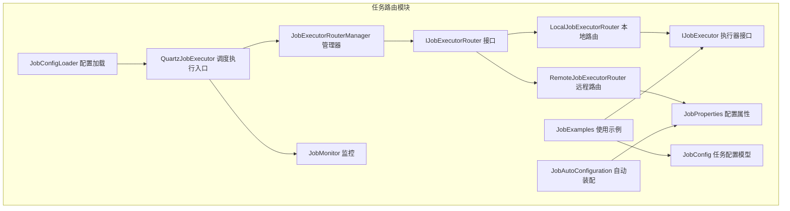
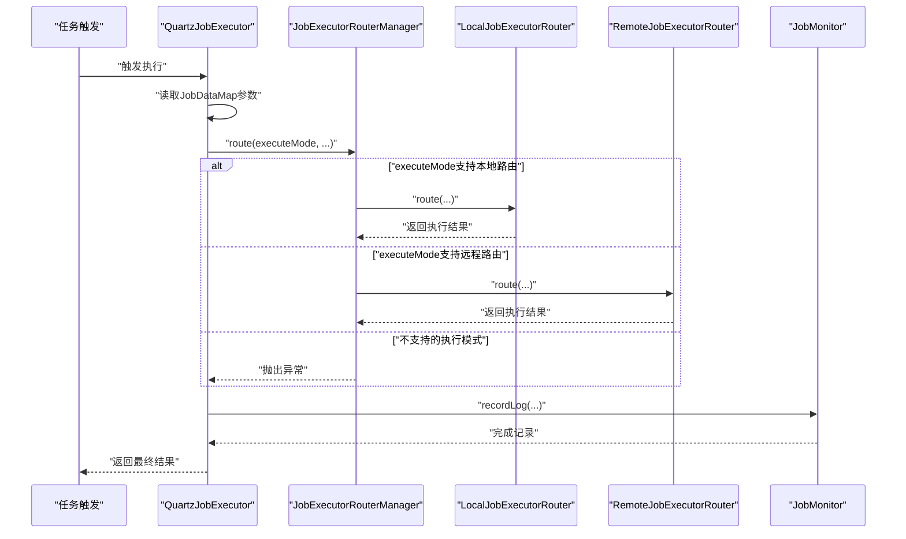
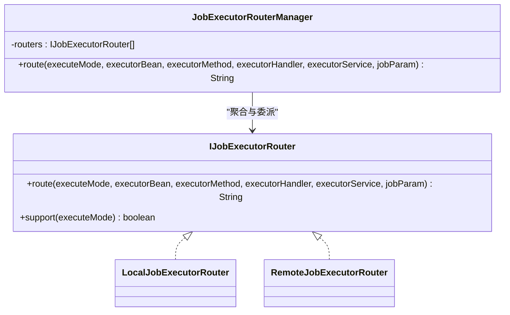
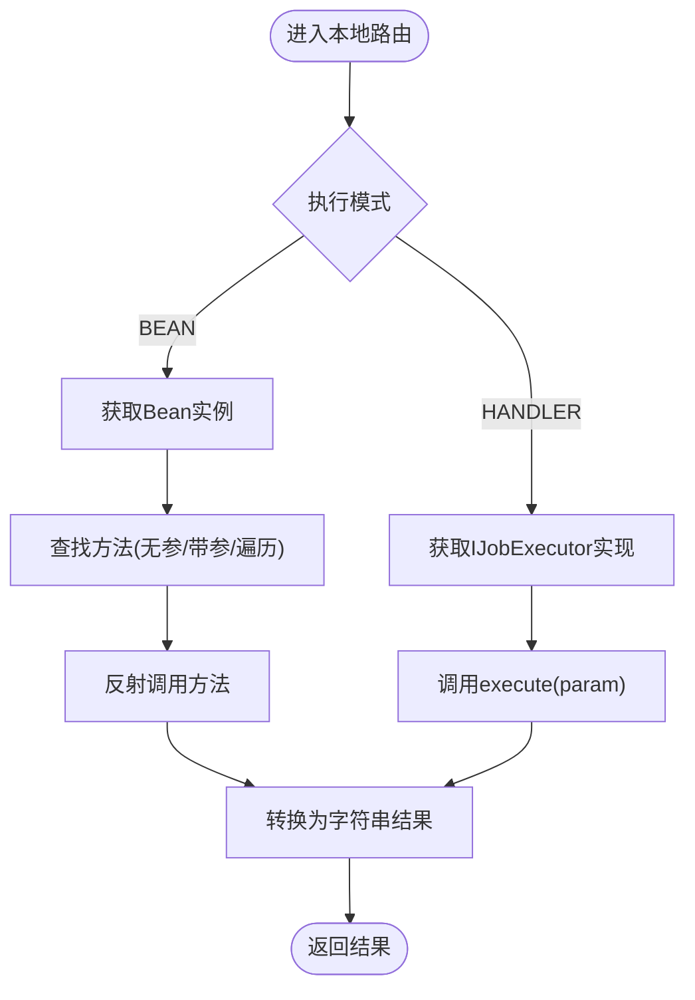
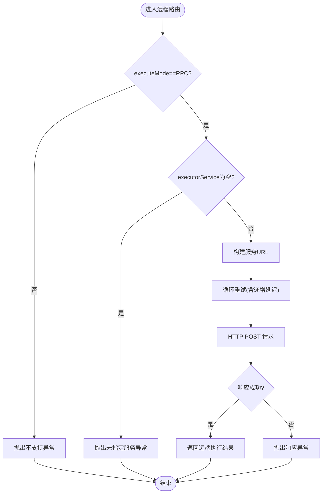
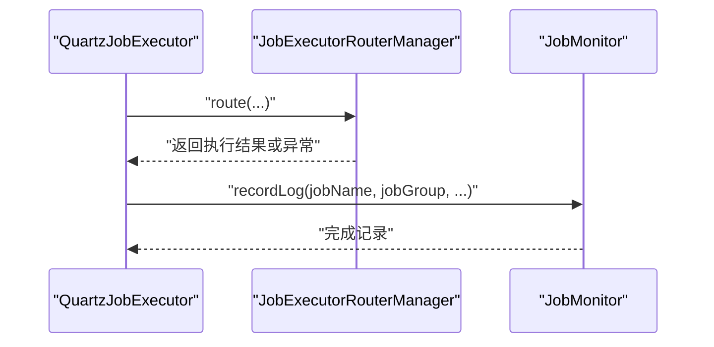
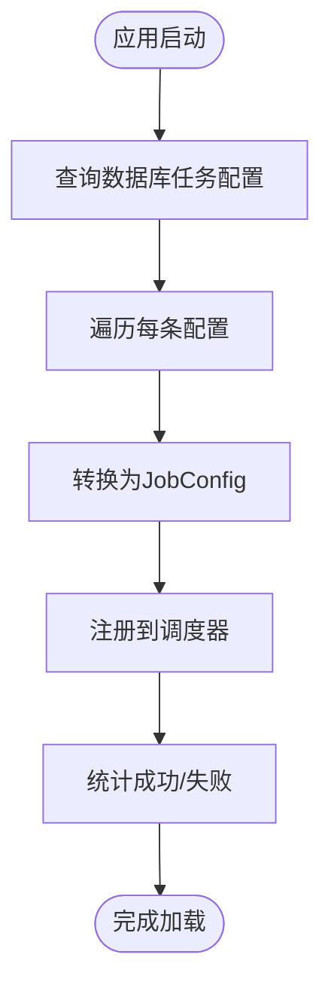
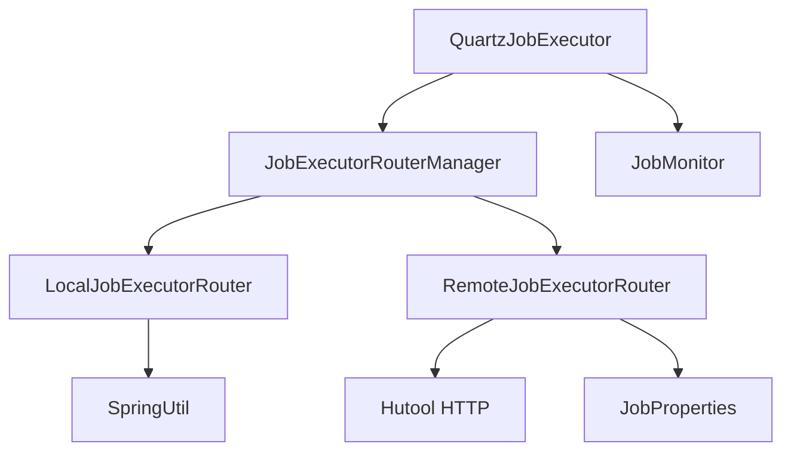

# 任务路由机制

<cite>
**本文引用的文件**
- [IJobExecutorRouter.java](file://forge/forge-framework/forge-plugin-parent/forge-plugin-job/src/main/java/com/mdframe/forge/plugin/job/executor/IJobExecutorRouter.java)
- [JobExecutorRouterManager.java](file://forge/forge-framework/forge-plugin-parent/forge-plugin-job/src/main/java/com/mdframe/forge/plugin/job/executor/JobExecutorRouterManager.java)
- [LocalJobExecutorRouter.java](file://forge/forge-framework/forge-plugin-parent/forge-plugin-job/src/main/java/com/mdframe/forge/plugin/job/executor/impl/LocalJobExecutorRouter.java)
- [RemoteJobExecutorRouter.java](file://forge/forge-framework/forge-plugin-parent/forge-plugin-job/src/main/java/com/mdframe/forge/plugin/job/executor/impl/RemoteJobExecutorRouter.java)
- [IJobExecutor.java](file://forge/forge-framework/forge-plugin-parent/forge-plugin-job/src/main/java/com/mdframe/forge/plugin/job/executor/IJobExecutor.java)
- [QuartzJobExecutor.java](file://forge/forge-framework/forge-plugin-parent/forge-plugin-job/src/main/java/com/mdframe/forge/plugin/job/scheduler/QuartzJobExecutor.java)
- [JobMonitor.java](file://forge/forge-framework/forge-plugin-parent/forge-plugin-job/src/main/java/com/mdframe/forge/plugin/job/monitor/JobMonitor.java)
- [JobConfigLoader.java](file://forge/forge-framework/forge-plugin-parent/forge-plugin-job/src/main/java/com/mdframe/forge/plugin/job/loader/JobConfigLoader.java)
- [JobProperties.java](file://forge/forge-framework/forge-plugin-parent/forge-plugin-job/src/main/java/com/mdframe/forge/plugin/job/config/JobProperties.java)
- [JobAutoConfiguration.java](file://forge/forge-framework/forge-plugin-parent/forge-plugin-job/src/main/java/com/mdframe/forge/plugin/job/config/JobAutoConfiguration.java)
- [JobConfig.java](file://forge/forge-framework/forge-plugin-parent/forge-plugin-job/src/main/java/com/mdframe/forge/plugin/job/model/JobConfig.java)
- [JobExamples.java](file://forge/forge-framework/forge-plugin-parent/forge-plugin-job/src/main/java/com/mdframe/forge/plugin/job/example/JobExamples.java)
</cite>

## 目录
1. [引言](#引言)
2. [项目结构](#项目结构)
3. [核心组件](#核心组件)
4. [架构总览](#架构总览)
5. [详细组件分析](#详细组件分析)
6. [依赖关系分析](#依赖关系分析)
7. [性能考虑](#性能考虑)
8. [故障排查指南](#故障排查指南)
9. [结论](#结论)
10. [附录](#附录)

## 引言
本技术文档围绕任务路由机制展开，重点阐述 IJobExecutorRouter 接口的设计理念、JobExecutorRouterManager 的管理机制，以及路由策略的选择算法、执行器优先级排序与动态路由切换。同时覆盖路由配置的加载流程、执行器健康检查与故障检测机制，并提供路由策略的自定义开发指南、性能监控指标与故障排查方法，帮助开发者构建灵活高效的任务路由系统。

## 项目结构
任务路由相关代码主要位于插件模块中，采用按职责分层的组织方式：
- 接口与抽象：定义路由接口与通用执行器接口
- 路由实现：本地与远程两种路由策略
- 调度与执行：Quartz 任务执行入口与监控
- 配置与加载：自动装配、配置属性与启动加载
- 示例与模型：任务配置模型与使用示例

图表来源
- [IJobExecutorRouter.java](file://forge/forge-framework/forge-plugin-parent/forge-plugin-job/src/main/java/com/mdframe/forge/plugin/job/executor/IJobExecutorRouter.java#L1-L32)
- [JobExecutorRouterManager.java](file://forge/forge-framework/forge-plugin-parent/forge-plugin-job/src/main/java/com/mdframe/forge/plugin/job/executor/JobExecutorRouterManager.java#L1-L41)
- [LocalJobExecutorRouter.java](file://forge/forge-framework/forge-plugin-parent/forge-plugin-job/src/main/java/com/mdframe/forge/plugin/job/executor/impl/LocalJobExecutorRouter.java#L1-L102)
- [RemoteJobExecutorRouter.java](file://forge/forge-framework/forge-plugin-parent/forge-plugin-job/src/main/java/com/mdframe/forge/plugin/job/executor/impl/RemoteJobExecutorRouter.java#L1-L107)
- [IJobExecutor.java](file://forge/forge-framework/forge-plugin-parent/forge-plugin-job/src/main/java/com/mdframe/forge/plugin/job/executor/IJobExecutor.java#L1-L16)
- [QuartzJobExecutor.java](file://forge/forge-framework/forge-plugin-parent/forge-plugin-job/src/main/java/com/mdframe/forge/plugin/job/scheduler/QuartzJobExecutor.java#L1-L61)
- [JobMonitor.java](file://forge/forge-framework/forge-plugin-parent/forge-plugin-job/src/main/java/com/mdframe/forge/plugin/job/monitor/JobMonitor.java#L1-L106)
- [JobConfigLoader.java](file://forge/forge-framework/forge-plugin-parent/forge-plugin-job/src/main/java/com/mdframe/forge/plugin/job/loader/JobConfigLoader.java#L1-L83)
- [JobProperties.java](file://forge/forge-framework/forge-plugin-parent/forge-plugin-job/src/main/java/com/mdframe/forge/plugin/job/config/JobProperties.java#L1-L66)
- [JobAutoConfiguration.java](file://forge/forge-framework/forge-plugin-parent/forge-plugin-job/src/main/java/com/mdframe/forge/plugin/job/config/JobAutoConfiguration.java#L1-L27)
- [JobConfig.java](file://forge/forge-framework/forge-plugin-parent/forge-plugin-job/src/main/java/com/mdframe/forge/plugin/job/model/JobConfig.java#L1-L98)
- [JobExamples.java](file://forge/forge-framework/forge-plugin-parent/forge-plugin-job/src/main/java/com/mdframe/forge/plugin/job/example/JobExamples.java#L1-L97)

章节来源
- [JobAutoConfiguration.java](file://forge/forge-framework/forge-plugin-parent/forge-plugin-job/src/main/java/com/mdframe/forge/plugin/job/config/JobAutoConfiguration.java#L1-L27)
- [JobProperties.java](file://forge/forge-framework/forge-plugin-parent/forge-plugin-job/src/main/java/com/mdframe/forge/plugin/job/config/JobProperties.java#L1-L66)

## 核心组件
- IJobExecutorRouter：定义路由接口，负责根据执行模式选择合适的执行方式（本地/远程），并提供支持判断能力。
- JobExecutorRouterManager：统一的路由管理器，聚合多个路由器，按执行模式进行匹配与委派。
- LocalJobExecutorRouter：本地路由实现，支持 BEAN 与 HANDLER 两种模式，直接在本地 JVM 中调用。
- RemoteJobExecutorRouter：远程路由实现，基于 RPC 模式，通过 HTTP 调用远端服务，具备重试与超时控制。
- IJobExecutor：业务任务执行器接口，业务侧实现具体任务逻辑。
- QuartzJobExecutor：Quartz 任务执行入口，负责从 JobDataMap 提取参数，调用路由管理器并记录日志。
- JobMonitor：任务监控器，负责日志持久化与失败告警通知。
- JobConfigLoader：应用启动时从数据库加载任务配置并注册到调度器。
- JobProperties：任务调度配置属性，包括部署模式、分布式配置等。
- JobConfig：任务配置模型，承载任务元信息与执行参数。
- JobExamples：使用示例，展示 BEAN、HANDLER、RPC 三种执行模式的典型用法。

章节来源
- [IJobExecutorRouter.java](file://forge/forge-framework/forge-plugin-parent/forge-plugin-job/src/main/java/com/mdframe/forge/plugin/job/executor/IJobExecutorRouter.java#L1-L32)
- [JobExecutorRouterManager.java](file://forge/forge-framework/forge-plugin-parent/forge-plugin-job/src/main/java/com/mdframe/forge/plugin/job/executor/JobExecutorRouterManager.java#L1-L41)
- [LocalJobExecutorRouter.java](file://forge/forge-framework/forge-plugin-parent/forge-plugin-job/src/main/java/com/mdframe/forge/plugin/job/executor/impl/LocalJobExecutorRouter.java#L1-L102)
- [RemoteJobExecutorRouter.java](file://forge/forge-framework/forge-plugin-parent/forge-plugin-job/src/main/java/com/mdframe/forge/plugin/job/executor/impl/RemoteJobExecutorRouter.java#L1-L107)
- [IJobExecutor.java](file://forge/forge-framework/forge-plugin-parent/forge-plugin-job/src/main/java/com/mdframe/forge/plugin/job/executor/IJobExecutor.java#L1-L16)
- [QuartzJobExecutor.java](file://forge/forge-framework/forge-plugin-parent/forge-plugin-job/src/main/java/com/mdframe/forge/plugin/job/scheduler/QuartzJobExecutor.java#L1-L61)
- [JobMonitor.java](file://forge/forge-framework/forge-plugin-parent/forge-plugin-job/src/main/java/com/mdframe/forge/plugin/job/monitor/JobMonitor.java#L1-L106)
- [JobConfigLoader.java](file://forge/forge-framework/forge-plugin-parent/forge-plugin-job/src/main/java/com/mdframe/forge/plugin/job/loader/JobConfigLoader.java#L1-L83)
- [JobProperties.java](file://forge/forge-framework/forge-plugin-parent/forge-plugin-job/src/main/java/com/mdframe/forge/plugin/job/config/JobProperties.java#L1-L66)
- [JobConfig.java](file://forge/forge-framework/forge-plugin-parent/forge-plugin-job/src/main/java/com/mdframe/forge/plugin/job/model/JobConfig.java#L1-L98)
- [JobExamples.java](file://forge/forge-framework/forge-plugin-parent/forge-plugin-job/src/main/java/com/mdframe/forge/plugin/job/example/JobExamples.java#L1-L97)

## 架构总览
下图展示了从任务触发到执行与监控的整体流程，以及路由策略的动态选择：

图表来源
- [QuartzJobExecutor.java](file://forge/forge-framework/forge-plugin-parent/forge-plugin-job/src/main/java/com/mdframe/forge/plugin/job/scheduler/QuartzJobExecutor.java#L1-L61)
- [JobExecutorRouterManager.java](file://forge/forge-framework/forge-plugin-parent/forge-plugin-job/src/main/java/com/mdframe/forge/plugin/job/executor/JobExecutorRouterManager.java#L1-L41)
- [LocalJobExecutorRouter.java](file://forge/forge-framework/forge-plugin-parent/forge-plugin-job/src/main/java/com/mdframe/forge/plugin/job/executor/impl/LocalJobExecutorRouter.java#L1-L102)
- [RemoteJobExecutorRouter.java](file://forge/forge-framework/forge-plugin-parent/forge-plugin-job/src/main/java/com/mdframe/forge/plugin/job/executor/impl/RemoteJobExecutorRouter.java#L1-L107)
- [JobMonitor.java](file://forge/forge-framework/forge-plugin-parent/forge-plugin-job/src/main/java/com/mdframe/forge/plugin/job/monitor/JobMonitor.java#L1-L106)

## 详细组件分析

### IJobExecutorRouter 接口与 JobExecutorRouterManager
- 设计理念
  - 通过统一接口抽象不同执行模式，便于扩展新的路由策略。
  - 路由器之间低耦合，通过支持性判断进行动态选择，提升系统可维护性。
- 管理机制
  - 管理器聚合多个路由器，按顺序遍历并调用 support 判断，命中后立即委派执行，避免重复匹配。
  - 当无路由器支持当前执行模式时，抛出不支持的异常，便于上层感知与降级处理。

图表来源
- [IJobExecutorRouter.java](file://forge/forge-framework/forge-plugin-parent/forge-plugin-job/src/main/java/com/mdframe/forge/plugin/job/executor/IJobExecutorRouter.java#L1-L32)
- [JobExecutorRouterManager.java](file://forge/forge-framework/forge-plugin-parent/forge-plugin-job/src/main/java/com/mdframe/forge/plugin/job/executor/JobExecutorRouterManager.java#L1-L41)
- [LocalJobExecutorRouter.java](file://forge/forge-framework/forge-plugin-parent/forge-plugin-job/src/main/java/com/mdframe/forge/plugin/job/executor/impl/LocalJobExecutorRouter.java#L1-L102)
- [RemoteJobExecutorRouter.java](file://forge/forge-framework/forge-plugin-parent/forge-plugin-job/src/main/java/com/mdframe/forge/plugin/job/executor/impl/RemoteJobExecutorRouter.java#L1-L107)

章节来源
- [IJobExecutorRouter.java](file://forge/forge-framework/forge-plugin-parent/forge-plugin-job/src/main/java/com/mdframe/forge/plugin/job/executor/IJobExecutorRouter.java#L1-L32)
- [JobExecutorRouterManager.java](file://forge/forge-framework/forge-plugin-parent/forge-plugin-job/src/main/java/com/mdframe/forge/plugin/job/executor/JobExecutorRouterManager.java#L1-L41)

### 本地路由策略（LocalJobExecutorRouter）
- 支持模式
  - BEAN：通过 Spring 容器获取 Bean 并反射调用方法，支持无参与带参两种签名。
  - HANDLER：通过 Handler 名称获取实现 IJobExecutor 的执行器并调用 execute。
- 方法选择算法
  - 优先尝试无参方法；若失败再尝试带 String 参数的方法；最后遍历所有方法匹配名称，确保兼容性。
- 错误处理
  - 对缺失 Bean、方法不可见、参数不匹配等情况抛出明确异常，便于定位问题。

图表来源
- [LocalJobExecutorRouter.java](file://forge/forge-framework/forge-plugin-parent/forge-plugin-job/src/main/java/com/mdframe/forge/plugin/job/executor/impl/LocalJobExecutorRouter.java#L1-L102)

章节来源
- [LocalJobExecutorRouter.java](file://forge/forge-framework/forge-plugin-parent/forge-plugin-job/src/main/java/com/mdframe/forge/plugin/job/executor/impl/LocalJobExecutorRouter.java#L1-L102)

### 远程路由策略（RemoteJobExecutorRouter）
- 支持模式
  - 仅支持 RPC 模式，通过 HTTP 请求将 Handler 名称与参数传递给远端服务。
- 动态路由切换机制
  - 依据配置属性中的部署模式与执行模式进行选择，当处于分布式模式且执行模式为 RPC 时，委派至远程路由。
- 重试与超时
  - 支持配置重试次数与超时时间，内部循环重试并采用递增延迟策略，提升网络波动下的稳定性。
- URL 构建
  - 当前实现为简化版本，未来可集成服务发现（如 Nacos/Eureka/Consul）以动态解析服务地址。

图表来源
- [RemoteJobExecutorRouter.java](file://forge/forge-framework/forge-plugin-parent/forge-plugin-job/src/main/java/com/mdframe/forge/plugin/job/executor/impl/RemoteJobExecutorRouter.java#L1-L107)
- [JobProperties.java](file://forge/forge-framework/forge-plugin-parent/forge-plugin-job/src/main/java/com/mdframe/forge/plugin/job/config/JobProperties.java#L1-L66)

章节来源
- [RemoteJobExecutorRouter.java](file://forge/forge-framework/forge-plugin-parent/forge-plugin-job/src/main/java/com/mdframe/forge/plugin/job/executor/impl/RemoteJobExecutorRouter.java#L1-L107)
- [JobProperties.java](file://forge/forge-framework/forge-plugin-parent/forge-plugin-job/src/main/java/com/mdframe/forge/plugin/job/config/JobProperties.java#L1-L66)

### 调度执行与监控（QuartzJobExecutor 与 JobMonitor）
- 调度执行
  - 从 JobDataMap 中提取执行模式与参数，调用路由管理器执行任务，并在 finally 中记录执行日志。
- 日志记录与告警
  - JobMonitor 将执行结果、耗时、异常等信息持久化，并在失败时触发告警通知（如存在告警实现）。

图表来源
- [QuartzJobExecutor.java](file://forge/forge-framework/forge-plugin-parent/forge-plugin-job/src/main/java/com/mdframe/forge/plugin/job/scheduler/QuartzJobExecutor.java#L1-L61)
- [JobMonitor.java](file://forge/forge-framework/forge-plugin-parent/forge-plugin-job/src/main/java/com/mdframe/forge/plugin/job/monitor/JobMonitor.java#L1-L106)

章节来源
- [QuartzJobExecutor.java](file://forge/forge-framework/forge-plugin-parent/forge-plugin-job/src/main/java/com/mdframe/forge/plugin/job/scheduler/QuartzJobExecutor.java#L1-L61)
- [JobMonitor.java](file://forge/forge-framework/forge-plugin-parent/forge-plugin-job/src/main/java/com/mdframe/forge/plugin/job/monitor/JobMonitor.java#L1-L106)

### 路由配置加载与任务注册（JobConfigLoader 与 JobConfig）
- 加载流程
  - 应用启动时，按条件加载数据库中的任务配置，逐条转换为 JobConfig 并注册到调度器。
  - 统计成功/失败数量，便于运维观测与问题定位。
- 任务参数
  - JobConfig 包含执行模式、执行器 Bean/Handler/Service、Cron 表达式、任务参数等关键字段。

图表来源
- [JobConfigLoader.java](file://forge/forge-framework/forge-plugin-parent/forge-plugin-job/src/main/java/com/mdframe/forge/plugin/job/loader/JobConfigLoader.java#L1-L83)
- [JobConfig.java](file://forge/forge-framework/forge-plugin-parent/forge-plugin-job/src/main/java/com/mdframe/forge/plugin/job/model/JobConfig.java#L1-L98)

章节来源
- [JobConfigLoader.java](file://forge/forge-framework/forge-plugin-parent/forge-plugin-job/src/main/java/com/mdframe/forge/plugin/job/loader/JobConfigLoader.java#L1-L83)
- [JobConfig.java](file://forge/forge-framework/forge-plugin-parent/forge-plugin-job/src/main/java/com/mdframe/forge/plugin/job/model/JobConfig.java#L1-L98)

### 自定义路由策略开发指南
- 实现步骤
  - 实现 IJobExecutorRouter 接口，提供 route 与 support 方法。
  - 在支持的执行模式下完成具体路由逻辑（如本地反射、远程 HTTP 调用等）。
  - 通过 Spring 条件注解控制生效范围（如按部署模式启用）。
- 注意事项
  - 明确支持的执行模式集合，避免与其他路由器冲突。
  - 对异常进行分类处理与包装，便于上层统一感知。
  - 在分布式场景下，考虑重试、超时与服务发现集成。

章节来源
- [IJobExecutorRouter.java](file://forge/forge-framework/forge-plugin-parent/forge-plugin-job/src/main/java/com/mdframe/forge/plugin/job/executor/IJobExecutorRouter.java#L1-L32)
- [JobProperties.java](file://forge/forge-framework/forge-plugin-parent/forge-plugin-job/src/main/java/com/mdframe/forge/plugin/job/config/JobProperties.java#L1-L66)

## 依赖关系分析
- 组件耦合
  - QuartzJobExecutor 依赖 JobExecutorRouterManager 与 JobMonitor，体现“调度入口”与“路由/监控”的职责分离。
  - JobExecutorRouterManager 聚合多种路由器，遵循开闭原则，新增路由无需修改现有代码。
  - LocalJobExecutorRouter 依赖 SpringUtil 与 IJobExecutor，RemoteJobExecutorRouter 依赖 JobProperties 与 HTTP 工具。
- 外部依赖
  - Quartz 用于任务调度。
  - Hutool 用于 HTTP 请求与 Spring 上下文工具。
  - MyBatis-Plus 用于数据库访问（配置加载）。

图表来源
- [QuartzJobExecutor.java](file://forge/forge-framework/forge-plugin-parent/forge-plugin-job/src/main/java/com/mdframe/forge/plugin/job/scheduler/QuartzJobExecutor.java#L1-L61)
- [JobExecutorRouterManager.java](file://forge/forge-framework/forge-plugin-parent/forge-plugin-job/src/main/java/com/mdframe/forge/plugin/job/executor/JobExecutorRouterManager.java#L1-L41)
- [LocalJobExecutorRouter.java](file://forge/forge-framework/forge-plugin-parent/forge-plugin-job/src/main/java/com/mdframe/forge/plugin/job/executor/impl/LocalJobExecutorRouter.java#L1-L102)
- [RemoteJobExecutorRouter.java](file://forge/forge-framework/forge-plugin-parent/forge-plugin-job/src/main/java/com/mdframe/forge/plugin/job/executor/impl/RemoteJobExecutorRouter.java#L1-L107)
- [JobMonitor.java](file://forge/forge-framework/forge-plugin-parent/forge-plugin-job/src/main/java/com/mdframe/forge/plugin/job/monitor/JobMonitor.java#L1-L106)

## 性能考虑
- 路由选择复杂度
  - 管理器按序遍历路由器，通常路由器数量有限，时间复杂度近似 O(1)。
- 本地反射调用
  - 方法查找与反射调用存在开销，建议在高频任务中缓存方法引用或减少反射路径。
- 远程调用
  - 建议合理设置超时与重试次数，避免阻塞调度线程；必要时引入异步执行或连接池优化。
- 监控与日志
  - 日志持久化与告警通知可能带来额外 IO 开销，建议结合异步写入与限流策略。

## 故障排查指南
- 常见问题与定位
  - 不支持的执行模式：检查 JobExecutorRouterManager 是否包含对应路由器，或确认 executeMode 是否正确。
  - 本地路由异常：确认 Bean 名称、方法签名与可见性；关注方法查找失败与参数不匹配。
  - 远程路由异常：检查服务名、URL 构建、网络连通性与远端服务可用性；查看重试与超时配置。
  - 配置加载失败：核对数据库任务配置字段与调度器注册流程，关注统计日志。
- 建议措施
  - 启用详细日志，定位异常堆栈与参数上下文。
  - 对远程调用增加熔断与降级策略，防止级联故障。
  - 对高频任务进行压测，识别瓶颈并优化。

章节来源
- [JobExecutorRouterManager.java](file://forge/forge-framework/forge-plugin-parent/forge-plugin-job/src/main/java/com/mdframe/forge/plugin/job/executor/JobExecutorRouterManager.java#L1-L41)
- [LocalJobExecutorRouter.java](file://forge/forge-framework/forge-plugin-parent/forge-plugin-job/src/main/java/com/mdframe/forge/plugin/job/executor/impl/LocalJobExecutorRouter.java#L1-L102)
- [RemoteJobExecutorRouter.java](file://forge/forge-framework/forge-plugin-parent/forge-plugin-job/src/main/java/com/mdframe/forge/plugin/job/executor/impl/RemoteJobExecutorRouter.java#L1-L107)
- [JobConfigLoader.java](file://forge/forge-framework/forge-plugin-parent/forge-plugin-job/src/main/java/com/mdframe/forge/plugin/job/loader/JobConfigLoader.java#L1-L83)

## 结论
本文档系统梳理了任务路由机制的设计与实现，涵盖接口抽象、管理器委派、本地与远程路由策略、调度与监控、配置加载与示例。通过清晰的职责划分与可扩展的路由接口，开发者可以快速定制新路由策略，并结合配置属性与监控体系实现稳定高效的分布式任务执行平台。

## 附录
- 配置项参考
  - 启用开关：是否启用任务调度
  - 部署模式：单体/分布式
  - 分布式配置：注册中心类型、执行器服务列表、超时时间、重试次数
- 使用示例参考
  - BEAN 模式：通过注解直接绑定本地 Bean 方法
  - HANDLER 模式：实现 IJobExecutor 接口并通过名称绑定
  - RPC 模式：配置远端服务名与 Handler 名称，实现跨服务任务执行

章节来源
- [JobProperties.java](file://forge/forge-framework/forge-plugin-parent/forge-plugin-job/src/main/java/com/mdframe/forge/plugin/job/config/JobProperties.java#L1-L66)
- [JobExamples.java](file://forge/forge-framework/forge-plugin-parent/forge-plugin-job/src/main/java/com/mdframe/forge/plugin/job/example/JobExamples.java#L1-L97)